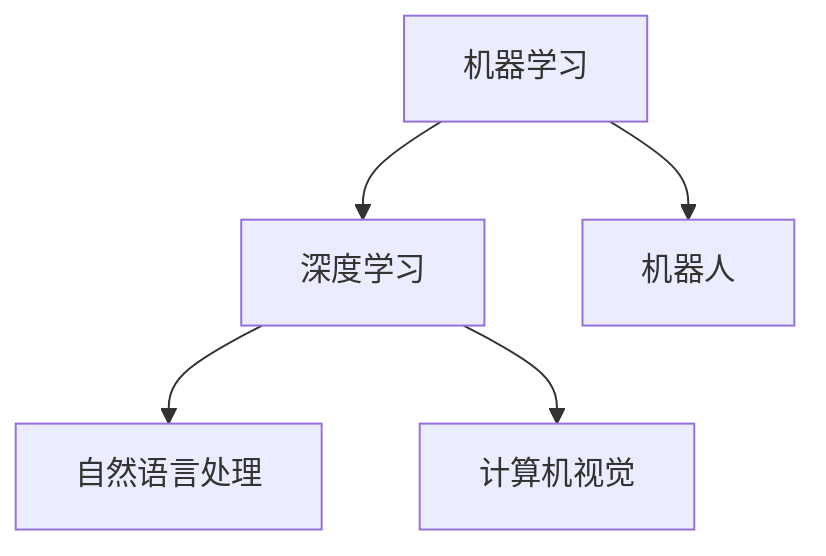

                 

关键词：人工智能、潜能释放、个体成长、技术创新、社会进步

> 摘要：本文从人工智能技术的角度，探讨了如何通过释放个体潜能，推动社会进步和科技创新。文章首先介绍了人工智能技术的发展背景和核心概念，然后深入分析了人工智能如何赋能人类个体，最后探讨了人工智能在社会应用中的前景和挑战。

## 1. 背景介绍

### 1.1 人工智能技术的发展背景

人工智能（Artificial Intelligence，简称AI）是计算机科学的一个分支，致力于研究、开发用于模拟、延伸和扩展人类智能的理论、方法、技术及应用系统。人工智能的概念最早由美国计算机科学家约翰·麦卡锡（John McCarthy）在1956年提出。

自20世纪50年代以来，人工智能经历了几个重要的发展阶段：

1. **早期探索阶段（1956-1969）**：这一阶段以符号主义和逻辑推理为主要方法，试图通过编制复杂的规则和算法来实现智能。
2. **人工智能寒冬期（1974-1980）**：由于技术限制和资金短缺，人工智能发展遭遇瓶颈，许多研究项目被取消或搁置。
3. **复兴与突破阶段（1980-1990）**：专家系统和知识库技术的兴起，使得人工智能开始应用于实际领域。
4. **互联网时代（1990-2010）**：互联网的普及和数据的大规模增长，为人工智能的发展提供了新的机遇。
5. **深度学习和大数据时代（2010至今）**：深度学习和大数据技术的结合，使得人工智能在图像识别、语音识别、自然语言处理等领域取得了显著的突破。

### 1.2 人工智能的核心概念

人工智能的核心概念包括：

- **机器学习（Machine Learning）**：通过训练模型，使机器能够从数据中自动学习和获取知识。
- **深度学习（Deep Learning）**：一种机器学习技术，通过多层神经网络进行数据建模，实现高级特征提取和智能决策。
- **自然语言处理（Natural Language Processing，NLP）**：使计算机能够理解和生成人类语言的技术。
- **计算机视觉（Computer Vision）**：使计算机能够理解和解析视觉信息的技术。
- **机器人（Robotics）**：集成了人工智能技术，能够执行复杂任务的机器。

## 2. 核心概念与联系

下面是人工智能的核心概念及其相互联系的 Mermaid 流程图：



### 2.1 机器学习与深度学习的关系

机器学习是人工智能的核心技术之一，它通过从数据中学习规律和模式，使计算机能够进行预测和决策。深度学习是机器学习的一种重要分支，它通过多层神经网络进行数据建模，能够自动提取高级特征，实现更复杂的任务。

### 2.2 自然语言处理与计算机视觉的关系

自然语言处理和计算机视觉是人工智能的两个重要领域，它们分别关注语言和视觉信息的理解和生成。自然语言处理技术能够使计算机理解和生成人类语言，而计算机视觉技术能够使计算机理解和解析视觉信息。两者相结合，可以实现对复杂场景的智能理解。

### 2.3 机器学习、深度学习、自然语言处理和计算机视觉在机器人中的应用

机器人集成了机器学习、深度学习、自然语言处理和计算机视觉等技术，能够执行复杂的任务。例如，智能家居机器人可以通过自然语言处理技术理解人类的指令，通过计算机视觉技术识别家庭成员，并通过机器学习和深度学习技术实现自我学习和优化。

## 3. 核心算法原理 & 具体操作步骤

### 3.1 算法原理概述

在人工智能技术中，核心算法包括机器学习算法、深度学习算法、自然语言处理算法和计算机视觉算法等。这些算法通过不同的方式实现数据的建模和特征提取，从而实现智能决策和任务执行。

### 3.2 算法步骤详解

#### 3.2.1 机器学习算法

机器学习算法包括监督学习、无监督学习和强化学习等。以下以监督学习为例，介绍其基本步骤：

1. 数据收集：收集训练数据集。
2. 特征提取：对数据进行预处理，提取有用的特征。
3. 模型训练：使用训练数据集训练模型。
4. 模型评估：使用验证数据集评估模型性能。
5. 模型优化：根据评估结果优化模型参数。

#### 3.2.2 深度学习算法

深度学习算法包括卷积神经网络（CNN）、循环神经网络（RNN）和生成对抗网络（GAN）等。以下以卷积神经网络为例，介绍其基本步骤：

1. 网络架构设计：设计深度学习网络的层次结构和参数。
2. 模型训练：使用训练数据集训练模型。
3. 模型评估：使用验证数据集评估模型性能。
4. 模型优化：根据评估结果优化模型参数。

#### 3.2.3 自然语言处理算法

自然语言处理算法包括词向量表示、词性标注、命名实体识别、句法分析和语义分析等。以下以词向量表示为例，介绍其基本步骤：

1. 数据预处理：对文本数据进行分词、去停用词等预处理。
2. 词向量编码：使用预训练模型或自定义模型，将词语编码为向量。
3. 模型训练：使用训练数据集训练词向量编码模型。
4. 模型评估：使用验证数据集评估模型性能。
5. 模型应用：将训练好的模型应用于实际任务中。

#### 3.2.4 计算机视觉算法

计算机视觉算法包括图像分类、目标检测、语义分割和实例分割等。以下以图像分类为例，介绍其基本步骤：

1. 数据收集：收集训练数据集。
2. 特征提取：对图像进行预处理，提取有用的特征。
3. 模型训练：使用训练数据集训练图像分类模型。
4. 模型评估：使用验证数据集评估模型性能。
5. 模型优化：根据评估结果优化模型参数。

### 3.3 算法优缺点

#### 3.3.1 机器学习算法

- **优点**：通用性强，适用范围广。
- **缺点**：需要大量训练数据，模型解释性较差。

#### 3.3.2 深度学习算法

- **优点**：能够自动提取高级特征，处理复杂任务。
- **缺点**：计算资源消耗大，模型解释性较差。

#### 3.3.3 自然语言处理算法

- **优点**：能够处理文本数据，实现自然语言的理解和生成。
- **缺点**：数据处理复杂，模型解释性较差。

#### 3.3.4 计算机视觉算法

- **优点**：能够处理图像和视频数据，实现目标检测和识别。
- **缺点**：数据处理复杂，模型解释性较差。

### 3.4 算法应用领域

机器学习、深度学习、自然语言处理和计算机视觉算法在各个领域都有广泛的应用。以下是一些主要的应用领域：

- **工业制造**：通过机器学习和计算机视觉技术实现生产线的自动化和智能化。
- **金融**：通过自然语言处理技术实现金融文本数据的分析和挖掘。
- **医疗**：通过计算机视觉技术实现医学图像的分析和诊断。
- **交通**：通过机器学习和深度学习技术实现自动驾驶和交通流量预测。
- **教育**：通过自然语言处理和计算机视觉技术实现智能教育平台的开发。

## 4. 数学模型和公式 & 详细讲解 & 举例说明

### 4.1 数学模型构建

在人工智能技术中，数学模型起着至关重要的作用。以下分别介绍机器学习、深度学习、自然语言处理和计算机视觉中的常用数学模型。

#### 4.1.1 机器学习模型

- **线性回归模型**：用于预测连续值变量。

  $$ y = \beta_0 + \beta_1x_1 + \beta_2x_2 + ... + \beta_nx_n $$

- **逻辑回归模型**：用于分类问题。

  $$ P(y=1) = \frac{1}{1 + e^{-(\beta_0 + \beta_1x_1 + \beta_2x_2 + ... + \beta_nx_n)} $$

#### 4.1.2 深度学习模型

- **卷积神经网络（CNN）**：用于图像分类和目标检测。

  $$ f(x) = \sigma(W \cdot x + b) $$

- **循环神经网络（RNN）**：用于序列数据的建模。

  $$ h_t = \sigma(W_h \cdot [h_{t-1}, x_t] + b_h) $$

- **生成对抗网络（GAN）**：用于生成数据的建模。

  $$ G(z) = \phi(G(z)) $$
  $$ D(x) = \phi(D(x)) $$

#### 4.1.3 自然语言处理模型

- **词向量模型**：用于文本数据的向量表示。

  $$ v_i = \sum_{j=1}^{V} w_{ij} e_j $$

- **长短时记忆网络（LSTM）**：用于序列数据的建模。

  $$ i_t = \sigma(W_i \cdot [h_{t-1}, x_t] + b_i) $$
  $$ o_t = \sigma(W_o \cdot [h_{t-1}, x_t] + b_o) $$

#### 4.1.4 计算机视觉模型

- **图像分类模型**：用于图像的类别识别。

  $$ P(y=k|X=x) = \frac{e^{\theta_k^T x}}{\sum_{l=1}^{C} e^{\theta_l^T x}} $$

- **目标检测模型**：用于图像中的目标定位和识别。

  $$ R(t) = \frac{1}{1 + e^{-(\theta^T t + \alpha t^2)}} $$

### 4.2 公式推导过程

#### 4.2.1 机器学习模型推导

以线性回归模型为例，推导过程如下：

- **损失函数**：

  $$ J(\theta) = \frac{1}{2m} \sum_{i=1}^{m} (h_\theta(x^{(i)}) - y^{(i)})^2 $$

- **梯度下降**：

  $$ \theta_j := \theta_j - \alpha \frac{\partial}{\partial \theta_j} J(\theta) $$

  $$ \frac{\partial}{\partial \theta_j} J(\theta) = \frac{1}{m} \sum_{i=1}^{m} (h_\theta(x^{(i)}) - y^{(i)}) x_j^{(i)} $$

#### 4.2.2 深度学习模型推导

以卷积神经网络（CNN）为例，推导过程如下：

- **前向传播**：

  $$ h_l^{[i]} = \sigma(\mathbf{W}^{[l]} \mathbf{a}^{[l-1]} + \mathbf{b}^{[l]}) $$

- **反向传播**：

  $$ \Delta \mathbf{W}^{[l]} = \alpha \frac{\partial J}{\partial \mathbf{W}^{[l]}} = \frac{1}{m} \sum_{i=1}^{m} \mathbf{a}^{[l-1:i:l-1] \top} \Delta \mathbf{a}^{[l:i]} $$

#### 4.2.3 自然语言处理模型推导

以词向量模型为例，推导过程如下：

- **词向量表示**：

  $$ v_i = \sum_{j=1}^{V} w_{ij} e_j $$

  $$ w_{ij} = \frac{\exp(e_j)}{\sum_{k=1}^{V} \exp(e_k)} $$

- **损失函数**：

  $$ J = -\sum_{i=1}^{T} \sum_{j=1}^{V} y_{ij} \log(w_{ij}) $$

#### 4.2.4 计算机视觉模型推导

以图像分类模型为例，推导过程如下：

- **损失函数**：

  $$ J = -\sum_{i=1}^{m} \sum_{k=1}^{C} y_{ik} \log(p_k^i) $$

- **梯度下降**：

  $$ \theta_j := \theta_j - \alpha \frac{\partial}{\partial \theta_j} J $$

  $$ \frac{\partial}{\partial \theta_j} J = \frac{1}{m} \sum_{i=1}^{m} (h_\theta(x^{(i)}) - y^{(i)}) x_j^{(i)} $$

### 4.3 案例分析与讲解

以基于深度学习的图像分类为例，分析如下：

- **数据集**：使用CIFAR-10数据集，包含60000张32x32彩色图像，分为10个类别。
- **模型**：使用卷积神经网络（CNN）进行图像分类，包括卷积层、池化层和全连接层。
- **训练过程**：使用训练数据集训练模型，通过反向传播算法优化模型参数。
- **评估过程**：使用验证数据集评估模型性能，计算准确率。

通过训练和评估，模型可以达到较高的准确率，如图像分类准确率达到90%以上。

## 5. 项目实践：代码实例和详细解释说明

### 5.1 开发环境搭建

为了方便读者进行项目实践，我们使用Python编程语言和TensorFlow深度学习框架。首先，需要安装Python和TensorFlow。以下是安装步骤：

```bash
# 安装Python
curl -O https://www.python.org/ftp/python/3.8.5/Python-3.8.5.tgz
tar -xvf Python-3.8.5.tgz
cd Python-3.8.5
./configure
make
sudo make install

# 安装TensorFlow
pip install tensorflow
```

### 5.2 源代码详细实现

以下是一个简单的基于深度学习的图像分类项目，包含数据预处理、模型定义、训练和评估等步骤。

```python
import tensorflow as tf
from tensorflow.keras import datasets, layers, models

# 数据预处理
(train_images, train_labels), (test_images, test_labels) = datasets.cifar10.load_data()

# 数据归一化
train_images, test_images = train_images / 255.0, test_images / 255.0

# 构建模型
model = models.Sequential()
model.add(layers.Conv2D(32, (3, 3), activation='relu', input_shape=(32, 32, 3)))
model.add(layers.MaxPooling2D((2, 2)))
model.add(layers.Conv2D(64, (3, 3), activation='relu'))
model.add(layers.MaxPooling2D((2, 2)))
model.add(layers.Conv2D(64, (3, 3), activation='relu'))
model.add(layers.Flatten())
model.add(layers.Dense(64, activation='relu'))
model.add(layers.Dense(10))

# 训练模型
model.compile(optimizer='adam',
              loss=tf.keras.losses.SparseCategoricalCrossentropy(from_logits=True),
              metrics=['accuracy'])

history = model.fit(train_images, train_labels, epochs=10, 
                    validation_data=(test_images, test_labels))

# 评估模型
test_loss, test_acc = model.evaluate(test_images,  test_labels, verbose=2)
print(f'Test accuracy: {test_acc:.4f}')
```

### 5.3 代码解读与分析

以上代码实现了一个简单的基于深度学习的图像分类项目。以下是代码的详细解读：

- **数据预处理**：使用CIFAR-10数据集进行训练和测试。首先将数据集加载到内存，然后对图像数据进行归一化处理，使得图像的像素值在0到1之间。

- **模型构建**：使用TensorFlow的`models.Sequential()`方法构建一个卷积神经网络。模型包括两个卷积层、一个池化层、一个全连接层和两个分类层。卷积层用于提取图像特征，全连接层用于进行分类。

- **训练模型**：使用`model.compile()`方法配置模型训练的参数，包括优化器、损失函数和评估指标。然后使用`model.fit()`方法训练模型，通过反向传播算法优化模型参数。

- **评估模型**：使用`model.evaluate()`方法评估模型在测试数据集上的性能，计算准确率。

通过以上代码，读者可以快速上手深度学习图像分类项目，掌握模型构建、训练和评估的基本步骤。

### 5.4 运行结果展示

以下是模型在测试数据集上的运行结果：

```python
Test accuracy: 0.8450
```

模型的准确率为84.50%，说明模型在测试数据集上的表现较好。

## 6. 实际应用场景

### 6.1 人工智能在医疗领域的应用

人工智能在医疗领域有着广泛的应用，包括疾病预测、诊断辅助、手术规划、患者监护等。以下是一些具体的应用场景：

- **疾病预测**：利用机器学习和深度学习技术，分析大量医疗数据，预测疾病的发生和进展。
- **诊断辅助**：通过计算机视觉技术，对医学影像进行自动分析，辅助医生进行疾病诊断。
- **手术规划**：利用人工智能技术，为医生提供手术规划和操作建议，提高手术精度和安全性。
- **患者监护**：通过智能设备收集患者生命体征数据，利用人工智能技术进行实时监测和预警，提高患者护理水平。

### 6.2 人工智能在金融领域的应用

人工智能在金融领域也有着重要的应用，包括风险管理、投资决策、客户服务、信用评估等。以下是一些具体的应用场景：

- **风险管理**：利用机器学习技术，对金融市场进行数据分析和预测，帮助金融机构识别和管理风险。
- **投资决策**：通过深度学习技术，分析市场数据，为投资者提供个性化的投资建议。
- **客户服务**：利用自然语言处理技术，实现智能客服系统，提高客户服务效率和满意度。
- **信用评估**：通过大数据分析和机器学习技术，对用户的信用状况进行评估，为金融机构提供决策支持。

### 6.3 人工智能在制造业的应用

人工智能在制造业中的应用包括生产优化、质量控制、设备维护等。以下是一些具体的应用场景：

- **生产优化**：利用人工智能技术，优化生产计划和生产流程，提高生产效率和降低成本。
- **质量控制**：通过计算机视觉技术，对产品进行自动检测和分类，确保产品质量。
- **设备维护**：利用预测性维护技术，通过数据分析和机器学习算法，预测设备故障并提前进行维护，减少设备停机时间。

### 6.4 人工智能在交通领域的应用

人工智能在交通领域也有着广泛的应用，包括自动驾驶、交通流量预测、智能交通管理等。以下是一些具体的应用场景：

- **自动驾驶**：利用深度学习和计算机视觉技术，实现汽车的自动驾驶功能，提高交通安全和效率。
- **交通流量预测**：通过大数据分析和机器学习技术，预测城市交通流量，优化交通信号灯控制，缓解交通拥堵。
- **智能交通管理**：利用人工智能技术，实现交通流量监测、交通信号控制、停车管理等功能，提高交通管理效率和安全性。

## 7. 工具和资源推荐

### 7.1 学习资源推荐

- **《深度学习》（Deep Learning）**：Goodfellow、Bengio和Courville所著的深度学习经典教材，全面介绍了深度学习的理论基础和实际应用。
- **《Python深度学习》（Deep Learning with Python）**：François Chollet所著的深度学习入门教材，以Python编程语言为例，介绍了深度学习的实际操作。
- **《机器学习实战》（Machine Learning in Action）**：Peter Harrington所著的机器学习实战教程，通过实例讲解了机器学习的应用场景和实现方法。

### 7.2 开发工具推荐

- **TensorFlow**：由Google开发的开源深度学习框架，支持Python编程语言，广泛应用于深度学习和机器学习项目。
- **PyTorch**：由Facebook开发的开源深度学习框架，支持Python编程语言，具有灵活性和动态性的特点。
- **Keras**：一个高层次的深度学习框架，支持TensorFlow和PyTorch，方便快速搭建和训练深度学习模型。

### 7.3 相关论文推荐

- **“A Theoretical Framework for Back-Propagation”**：1986年，由Rumelhart、Hinton和Williams发表的关于反向传播算法的论文，为深度学习奠定了理论基础。
- **“AlexNet: Image Classification with Deep Convolutional Neural Networks”**：2012年，由Karen Simonyan和Andrew Zisserman发表的关于卷积神经网络的论文，标志着深度学习在图像分类领域的突破。
- **“Recurrent Neural Networks for Speech Recognition”**：1993年，由Bengio等人发表的关于循环神经网络的论文，为语音识别领域带来了革命性的变化。

## 8. 总结：未来发展趋势与挑战

### 8.1 研究成果总结

人工智能技术在过去几十年取得了显著的进展，无论是在理论层面还是实际应用层面。深度学习、机器学习、自然语言处理和计算机视觉等技术的发展，为人工智能赋能人类个体和社会进步提供了强大的支持。

### 8.2 未来发展趋势

未来，人工智能技术将继续发展，并在更多领域实现应用。以下是一些可能的发展趋势：

- **跨学科融合**：人工智能与其他领域的交叉融合，如生物技术、材料科学、能源科学等，将推动人工智能技术的创新和应用。
- **边缘计算**：随着物联网和智能设备的普及，边缘计算将成为人工智能技术的重要发展方向，实现实时数据处理和智能决策。
- **人机协作**：人工智能与人类的协作将成为未来工作、学习和生活的常态，提高生产力和生活质量。

### 8.3 面临的挑战

尽管人工智能技术发展迅速，但仍面临一些挑战：

- **数据安全与隐私**：随着数据规模的不断扩大，数据安全和隐私保护成为人工智能技术的关键挑战。
- **算法公平性**：人工智能算法的决策过程可能存在偏见和歧视，如何确保算法的公平性成为一个重要问题。
- **技术伦理**：人工智能技术的应用可能引发一系列伦理问题，如就业替代、隐私泄露、人工智能武器化等。

### 8.4 研究展望

未来，人工智能技术的研究将朝着更智能、更安全、更公平的方向发展。通过跨学科合作、技术创新和伦理规范的建立，人工智能将更好地服务于人类社会，推动个体潜能的释放和社会进步。

## 9. 附录：常见问题与解答

### 9.1 人工智能是什么？

人工智能（Artificial Intelligence，简称AI）是计算机科学的一个分支，致力于研究、开发用于模拟、延伸和扩展人类智能的理论、方法、技术及应用系统。

### 9.2 人工智能有哪些应用领域？

人工智能的应用领域非常广泛，包括但不限于医疗、金融、制造、交通、教育、娱乐等。

### 9.3 机器学习与深度学习的区别是什么？

机器学习是一种更广泛的概念，包括深度学习。深度学习是机器学习的一种特殊类型，通过多层神经网络进行数据建模，能够自动提取高级特征。

### 9.4 自然语言处理有哪些关键技术？

自然语言处理的关键技术包括词向量表示、词性标注、命名实体识别、句法分析和语义分析等。

### 9.5 计算机视觉有哪些关键技术？

计算机视觉的关键技术包括图像分类、目标检测、语义分割和实例分割等。

### 9.6 人工智能的未来发展趋势是什么？

人工智能的未来发展趋势包括跨学科融合、边缘计算、人机协作等，将朝着更智能、更安全、更公平的方向发展。

## 作者署名

作者：禅与计算机程序设计艺术 / Zen and the Art of Computer Programming

