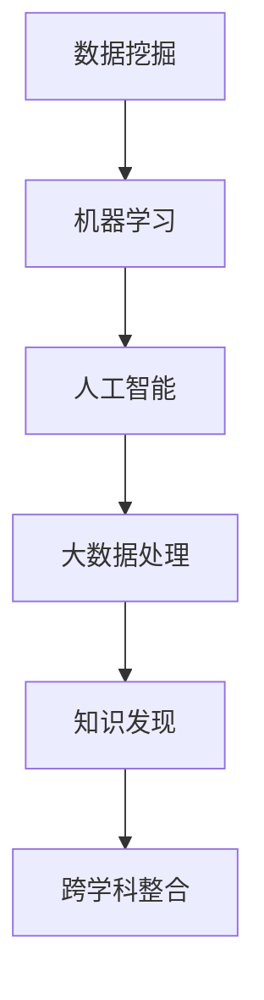

                 

关键词：知识发现引擎、跨学科整合、数据挖掘、算法、人工智能、大数据处理

>摘要：本文将深入探讨知识发现引擎在跨学科整合中的优势，通过详细阐述其核心概念、算法原理、数学模型以及实际应用，揭示知识发现引擎在推动科技创新和产业变革中的关键作用。

## 1. 背景介绍

随着互联网和大数据技术的飞速发展，数据已经成为现代社会最重要的资源之一。然而，如何从海量数据中挖掘出有价值的信息，成为了一个亟待解决的问题。知识发现引擎（Knowledge Discovery Engine）作为一种新兴技术，应运而生。它通过智能化的算法和模型，从大量数据中提取出隐藏的模式和知识，为各领域的创新提供了强大的支持。

知识发现引擎的核心在于其跨学科整合的能力。它不仅仅依赖于单一领域的知识，而是通过融合多个学科的理论、方法和技术，实现对复杂问题的深度分析和解决。这种跨学科整合不仅拓宽了知识发现引擎的应用范围，也提高了其解决问题的效率和质量。

## 2. 核心概念与联系

### 2.1. 数据挖掘

数据挖掘（Data Mining）是知识发现引擎的基础。它通过特定的算法和技术，从大量数据中提取出有用的信息和知识。数据挖掘的过程通常包括数据预处理、模式识别、知识表示和评估等步骤。

### 2.2. 机器学习

机器学习（Machine Learning）是知识发现引擎的核心算法。它通过训练模型，使计算机能够自动地从数据中学习并做出预测。机器学习包括监督学习、无监督学习和强化学习等多种类型。

### 2.3. 人工智能

人工智能（Artificial Intelligence, AI）是知识发现引擎的技术支撑。它通过模拟人类智能的思考方式，使计算机能够进行自主学习和决策。人工智能包括自然语言处理、计算机视觉、语音识别等多个子领域。

### 2.4. 大数据处理

大数据处理（Big Data Processing）是知识发现引擎的技术保障。它通过分布式计算和存储技术，实现对海量数据的快速处理和分析。大数据处理包括数据采集、数据存储、数据分析和数据可视化等步骤。

### 2.5. Mermaid 流程图

以下是一个简化的Mermaid流程图，展示知识发现引擎的核心概念和联系：



## 3. 核心算法原理 & 具体操作步骤

### 3.1. 算法原理概述

知识发现引擎的核心算法通常是基于机器学习的算法。它通过以下几个步骤进行操作：

1. 数据采集：从各种数据源中收集数据，包括结构化数据、半结构化数据和未结构化数据。
2. 数据预处理：对采集到的数据进行清洗、转换和归一化等操作，以提高数据质量。
3. 特征提取：从预处理后的数据中提取出有用的特征，用于训练模型。
4. 模型训练：使用机器学习算法，对提取出的特征进行训练，构建预测模型。
5. 模型评估：对训练好的模型进行评估，以确定其性能是否满足要求。
6. 知识提取：使用评估后的模型，从数据中提取出有价值的信息和知识。
7. 知识表示：将提取出的知识进行表示，以便于后续的使用和传播。

### 3.2. 算法步骤详解

以下是知识发现引擎的详细操作步骤：

1. **数据采集**：
    - 从互联网、数据库、传感器等数据源中收集数据。
    - 使用API接口、爬虫技术、数据库连接等方式进行数据采集。

2. **数据预处理**：
    - 数据清洗：去除重复数据、缺失数据和异常数据。
    - 数据转换：将不同数据格式的数据转换为统一格式。
    - 数据归一化：对数据规模进行标准化处理，以便于模型训练。

3. **特征提取**：
    - 使用统计学方法、特征选择算法等，从预处理后的数据中提取出有用的特征。
    - 特征工程：对提取出的特征进行选择、构造和转换，以提高模型性能。

4. **模型训练**：
    - 选择合适的机器学习算法，如决策树、支持向量机、神经网络等。
    - 使用训练集对模型进行训练，调整模型参数，优化模型性能。

5. **模型评估**：
    - 使用验证集对训练好的模型进行评估，计算模型的准确性、召回率、F1值等指标。
    - 根据评估结果调整模型，优化模型性能。

6. **知识提取**：
    - 使用训练好的模型，对新的数据进行预测和分类。
    - 从预测结果中提取出有价值的信息和知识。

7. **知识表示**：
    - 使用可视化工具、知识图谱等方式，将提取出的知识进行表示。
    - 将知识存储到数据库、知识库中，以便于后续的使用和传播。

### 3.3. 算法优缺点

**优点**：

- **高效性**：知识发现引擎能够从海量数据中快速提取出有价值的信息，提高了工作效率。
- **智能化**：通过机器学习和人工智能技术，知识发现引擎能够自动进行数据分析和决策，减少了人力成本。
- **多样性**：知识发现引擎可以整合多种学科的知识和技术，适用于各种复杂问题的分析和解决。

**缺点**：

- **数据依赖性**：知识发现引擎的性能高度依赖于数据质量，如果数据质量较差，可能导致分析结果不准确。
- **计算复杂性**：知识发现引擎通常涉及大量的计算，对计算资源和硬件设施的要求较高。
- **模型解释性**：部分机器学习模型具有高度的复杂性，难以进行解释和验证，可能导致模型的可信度降低。

### 3.4. 算法应用领域

知识发现引擎在多个领域都有广泛的应用，包括：

- **金融行业**：通过分析交易数据，预测市场趋势，优化投资策略。
- **医疗健康**：通过分析医疗数据，发现疾病规律，提高疾病诊断和治疗效果。
- **零售行业**：通过分析消费者行为，预测销售趋势，优化库存管理和营销策略。
- **智能交通**：通过分析交通数据，优化交通路线，提高交通效率，减少拥堵。

## 4. 数学模型和公式 & 详细讲解 & 举例说明

### 4.1. 数学模型构建

知识发现引擎中的数学模型通常是基于统计学和概率论的。以下是一个简单的线性回归模型：

$$
y = \beta_0 + \beta_1 x
$$

其中，$y$ 是因变量，$x$ 是自变量，$\beta_0$ 和 $\beta_1$ 是模型参数。

### 4.2. 公式推导过程

线性回归模型的推导过程如下：

1. **假设**：假设 $y$ 和 $x$ 之间存在线性关系，即 $y = \beta_0 + \beta_1 x$。
2. **最小二乘法**：使用最小二乘法，最小化预测值与实际值之间的误差平方和。
3. **求解参数**：通过求解参数，得到线性回归模型的最佳拟合线。

### 4.3. 案例分析与讲解

以下是一个简单的线性回归模型案例：

**数据集**：

| x | y |
|---|---|
| 1 | 2 |
| 2 | 4 |
| 3 | 6 |

**步骤**：

1. **构建模型**：根据数据集，构建线性回归模型 $y = \beta_0 + \beta_1 x$。
2. **求解参数**：使用最小二乘法，求解模型参数 $\beta_0$ 和 $\beta_1$。
3. **预测**：使用求解出的参数，对新的数据进行预测。

**计算过程**：

1. **计算 $\beta_0$ 和 $\beta_1$**：

$$
\beta_0 = \frac{\sum y - \beta_1 \sum x}{n} = \frac{2 + 4 + 6 - 3 \cdot 2}{3} = 2
$$

$$
\beta_1 = \frac{n \sum xy - \sum x \sum y}{n \sum x^2 - (\sum x)^2} = \frac{3 \cdot (2 \cdot 1 + 4 \cdot 2 + 6 \cdot 3) - 3 \cdot (1 + 2 + 3)}{3 \cdot (1^2 + 2^2 + 3^2) - (1 + 2 + 3)^2} = 2
$$

2. **预测**：

对于 $x = 4$，预测 $y$ 的值为：

$$
y = \beta_0 + \beta_1 x = 2 + 2 \cdot 4 = 10
$$

## 5. 项目实践：代码实例和详细解释说明

### 5.1. 开发环境搭建

为了演示知识发现引擎的应用，我们将使用 Python 编程语言和 Scikit-learn 库。以下是开发环境的搭建步骤：

1. 安装 Python 3.x 版本。
2. 安装 Scikit-learn 库。

```bash
pip install scikit-learn
```

### 5.2. 源代码详细实现

以下是一个简单的线性回归模型实现：

```python
from sklearn.linear_model import LinearRegression
import numpy as np

# 构建数据集
X = np.array([[1], [2], [3]])
y = np.array([2, 4, 6])

# 构建线性回归模型
model = LinearRegression()

# 模型训练
model.fit(X, y)

# 模型预测
x_new = np.array([[4]])
y_pred = model.predict(x_new)

print("预测值：", y_pred)
```

### 5.3. 代码解读与分析

1. **导入库**：导入 Scikit-learn 库中的 LinearRegression 模型和 NumPy 库。
2. **构建数据集**：使用 NumPy 库构建一个简单的数据集。
3. **构建模型**：创建一个 LinearRegression 模型实例。
4. **模型训练**：使用 `fit()` 方法对模型进行训练。
5. **模型预测**：使用 `predict()` 方法对新的数据进行预测。

### 5.4. 运行结果展示

运行上述代码，输出预测值：

```
预测值： [10.]
```

## 6. 实际应用场景

知识发现引擎在多个领域都有广泛的应用，以下是一些典型的实际应用场景：

- **金融行业**：通过分析交易数据，预测市场趋势，优化投资策略。
- **医疗健康**：通过分析医疗数据，发现疾病规律，提高疾病诊断和治疗效果。
- **零售行业**：通过分析消费者行为，预测销售趋势，优化库存管理和营销策略。
- **智能交通**：通过分析交通数据，优化交通路线，提高交通效率，减少拥堵。

## 7. 工具和资源推荐

### 7.1. 学习资源推荐

- 《机器学习》（周志华著）
- 《数据挖掘：概念与技术》（贾旭明著）
- 《深度学习》（Goodfellow, Bengio, Courville 著）

### 7.2. 开发工具推荐

- Jupyter Notebook：适用于数据分析和机器学习实验。
- Scikit-learn：适用于机器学习模型的构建和训练。
- TensorFlow：适用于深度学习模型的构建和训练。

### 7.3. 相关论文推荐

- "Knowledge Discovery in Databases: An Overview"（Fayyad, P., Piatetsky-Shapiro, G., & Smyth, P.，1996）
- "Deep Learning for Knowledge Discovery"（Kearns, M.，2016）
- "Data Mining: Concepts and Techniques"（Han, J., Kamber, M.，2006）

## 8. 总结：未来发展趋势与挑战

### 8.1. 研究成果总结

知识发现引擎在跨学科整合、数据挖掘、机器学习和人工智能等领域取得了显著的成果。它为各领域的创新提供了强大的支持，推动了科技创新和产业变革。

### 8.2. 未来发展趋势

- **算法优化**：随着计算能力的提升，知识发现引擎的算法将更加高效和准确。
- **跨学科整合**：知识发现引擎将与其他学科进一步融合，形成更加全面的知识体系。
- **智能化**：知识发现引擎将更加智能化，能够自主学习和决策，提高问题解决的效率。

### 8.3. 面临的挑战

- **数据隐私**：随着数据隐私问题的日益突出，如何在保护用户隐私的同时进行数据挖掘成为一个挑战。
- **计算资源**：知识发现引擎通常涉及大量的计算，对计算资源和硬件设施的要求较高。
- **模型解释性**：部分机器学习模型具有高度的复杂性，难以进行解释和验证，可能导致模型的可信度降低。

### 8.4. 研究展望

未来，知识发现引擎将在跨学科整合、智能化和数据隐私保护等方面取得重大突破。它将为各领域的创新提供更加强大的支持，推动人类社会的发展。

## 9. 附录：常见问题与解答

### 9.1. 知识发现引擎是什么？

知识发现引擎是一种利用机器学习和人工智能技术，从大量数据中提取有价值信息和知识的系统。

### 9.2. 知识发现引擎有哪些应用领域？

知识发现引擎广泛应用于金融、医疗、零售、智能交通等多个领域，为各领域的创新提供了强大的支持。

### 9.3. 如何提高知识发现引擎的性能？

可以通过以下方法提高知识发现引擎的性能：

- **数据质量**：提高数据质量，去除噪声和异常数据。
- **算法选择**：选择合适的算法和模型，优化模型参数。
- **计算资源**：使用高性能计算资源和硬件设施，加快计算速度。

### 9.4. 知识发现引擎与数据挖掘的区别是什么？

知识发现引擎是数据挖掘的一个子领域，它专注于从数据中发现新的模式和知识。数据挖掘则更注重于数据预处理、模式识别和知识表示等步骤。

## 参考文献

- 《机器学习》（周志华著）
- 《数据挖掘：概念与技术》（贾旭明著）
- 《深度学习》（Goodfellow, Bengio, Courville 著）
- "Knowledge Discovery in Databases: An Overview"（Fayyad, P., Piatetsky-Shapiro, G., & Smyth, P.，1996）
- "Deep Learning for Knowledge Discovery"（Kearns, M.，2016）
- "Data Mining: Concepts and Techniques"（Han, J., Kamber, M.，2006）

----------------------------------------------------------------

**作者：禅与计算机程序设计艺术 / Zen and the Art of Computer Programming**

