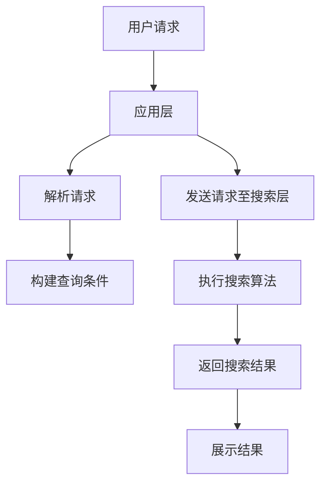

                 

关键词：跨平台搜索，电商，搜索算法，分布式系统，用户体验，搜索引擎优化（SEO），机器学习，大数据分析

> 摘要：本文将探讨跨平台搜索技术在电商行业中的应用，分析其核心概念、算法原理、数学模型以及实际应用场景。通过介绍搜索技术在电商中的重要性，我们旨在为从业者提供一套完整的跨平台搜索解决方案，以提升电商平台的用户体验，增加销售额，并展望未来的发展趋势。

## 1. 背景介绍

随着互联网技术的快速发展，电子商务已经成为全球商业的重要组成部分。电商平台的竞争日益激烈，用户体验成为决定市场成败的关键因素之一。在众多用户体验的提升手段中，搜索功能无疑占据着重要位置。然而，传统的搜索引擎技术在处理跨平台数据时往往存在局限性，难以满足电商行业对高效、准确、个性化搜索的需求。因此，跨平台搜索技术的研发和应用成为电商行业亟待解决的重要问题。

本文将从以下几个方面展开讨论：

- 跨平台搜索技术的核心概念与架构
- 跨平台搜索算法原理与实现步骤
- 数学模型与公式在跨平台搜索中的应用
- 跨平台搜索技术的实际应用案例
- 未来的发展趋势与面临的挑战

## 2. 核心概念与联系

### 2.1. 跨平台搜索的概念

跨平台搜索指的是在多个不同的操作系统、设备类型和互联网平台上，实现数据的统一检索和展示。在电商行业中，这意味着用户可以不受限制地在PC端、移动端、小程序、社交媒体等多个平台上，使用相同的搜索功能，获得一致且个性化的搜索结果。

### 2.2. 跨平台搜索架构

为了实现跨平台搜索，我们需要构建一个分布式系统，该系统包括数据层、搜索层和应用层。

- **数据层**：负责收集、存储和整合来自各个平台的海量数据。数据源包括用户行为数据、商品信息、交易数据等。
- **搜索层**：负责实现搜索算法，提供高效、准确的搜索服务。搜索层通常采用分布式搜索引擎，如Elasticsearch、Solr等。
- **应用层**：提供用户界面和交互逻辑，支持多种平台的应用程序，如Web前端、移动应用、小程序等。

### 2.3. Mermaid 流程图

以下是一个简单的Mermaid流程图，展示了跨平台搜索的基本架构：



## 3. 核心算法原理 & 具体操作步骤

### 3.1. 算法原理概述

跨平台搜索算法的核心是分布式搜索引擎技术。该技术通过索引和查询优化，实现高效的数据检索。主要算法包括：

- **全文检索**：通过对文本内容进行索引，实现快速全文搜索。
- **倒排索引**：通过建立关键字和文档位置的映射关系，实现快速关键词搜索。
- **向量搜索**：利用向量空间模型，实现基于语义的精准搜索。

### 3.2. 算法步骤详解

#### 3.2.1. 数据预处理

1. **数据清洗**：去除重复、无效和错误的数据。
2. **数据转换**：将不同格式和来源的数据转换为统一的格式。
3. **特征提取**：提取文本、图片、音频等数据的特征，为后续搜索提供基础。

#### 3.2.2. 索引构建

1. **文本索引**：对文本数据进行分词、词频统计和索引构建。
2. **倒排索引**：建立关键字和文档ID的映射关系。
3. **向量索引**：将文本数据转换为向量表示，并建立向量索引。

#### 3.2.3. 查询处理

1. **查询解析**：将用户输入的查询语句转换为搜索条件。
2. **查询优化**：根据查询条件和数据分布，优化查询执行路径。
3. **结果返回**：根据搜索结果，返回符合用户需求的搜索结果。

### 3.3. 算法优缺点

- **优点**：分布式搜索引擎具有高并发、可扩展、实时性强等优点，能够满足电商行业对海量数据的高效搜索需求。
- **缺点**：索引构建和查询处理过程复杂，对硬件资源要求较高，且需要不断更新和维护。

### 3.4. 算法应用领域

跨平台搜索算法在电商行业的应用主要包括：

- **商品搜索**：用户可以在多个平台上快速找到所需商品。
- **内容搜索**：帮助用户在电商平台内快速找到相关文章、视频等。
- **用户画像**：通过分析用户搜索行为，构建个性化推荐系统。

## 4. 数学模型和公式 & 详细讲解 & 举例说明

### 4.1. 数学模型构建

在跨平台搜索中，常用的数学模型包括：

- **向量空间模型**：用于表示文本数据和查询条件。
- **相似度模型**：用于计算文本数据之间的相似度。

### 4.2. 公式推导过程

#### 向量空间模型

假设有两个文本向量 \( \vec{v_1} \) 和 \( \vec{v_2} \)，它们的内积公式为：

\[ \vec{v_1} \cdot \vec{v_2} = \sum_{i=1}^{n} v_{1i} v_{2i} \]

其中，\( n \) 表示向量的维度，\( v_{1i} \) 和 \( v_{2i} \) 分别表示向量 \( \vec{v_1} \) 和 \( \vec{v_2} \) 在第 \( i \) 个维度上的值。

#### 相似度模型

假设有两个文本向量 \( \vec{v_1} \) 和 \( \vec{v_2} \)，它们之间的余弦相似度公式为：

\[ \cos(\theta) = \frac{\vec{v_1} \cdot \vec{v_2}}{|\vec{v_1}| |\vec{v_2}|} \]

其中，\( \theta \) 表示两个向量之间的夹角，\( |\vec{v_1}| \) 和 \( |\vec{v_2}| \) 分别表示向量 \( \vec{v_1} \) 和 \( \vec{v_2} \) 的模长。

### 4.3. 案例分析与讲解

假设我们有两个文本向量 \( \vec{v_1} = (1, 2, 3) \) 和 \( \vec{v_2} = (4, 5, 6) \)，我们可以按照以下步骤计算它们的余弦相似度：

1. 计算内积：\( \vec{v_1} \cdot \vec{v_2} = 1 \times 4 + 2 \times 5 + 3 \times 6 = 32 \)
2. 计算模长：\( |\vec{v_1}| = \sqrt{1^2 + 2^2 + 3^2} = \sqrt{14} \)，\( |\vec{v_2}| = \sqrt{4^2 + 5^2 + 6^2} = \sqrt{77} \)
3. 计算余弦相似度：\( \cos(\theta) = \frac{32}{\sqrt{14} \times \sqrt{77}} \approx 0.942 \)

根据计算结果，两个向量之间的余弦相似度为 0.942，说明它们具有很高的相似度。

## 5. 项目实践：代码实例和详细解释说明

### 5.1. 开发环境搭建

为了演示跨平台搜索技术的实现，我们使用Elasticsearch作为分布式搜索引擎，并采用Spring Boot框架搭建应用服务器。以下是开发环境搭建的步骤：

1. 安装Elasticsearch：从官网下载并安装Elasticsearch，配置集群模式。
2. 安装Java开发环境：安装JDK 1.8及以上版本。
3. 创建Spring Boot项目：使用IDE（如IntelliJ IDEA）创建Spring Boot项目，添加Elasticsearch依赖。

### 5.2. 源代码详细实现

以下是Spring Boot项目中，用于构建商品索引和执行搜索的代码实例：

```java
@RestController
@RequestMapping("/search")
public class SearchController {

    @Autowired
    private ElasticsearchTemplate esTemplate;

    @GetMapping("/indexProduct")
    public ResponseEntity<?> indexProduct(@RequestParam String id,
                                         @RequestParam String name,
                                         @RequestParam String category) {
        Product product = new Product();
        product.setId(id);
        product.setName(name);
        product.setCategory(category);
        esTemplate.index(product);
        return ResponseEntity.ok("Product indexed successfully");
    }

    @GetMapping("/searchProduct")
    public ResponseEntity<?> searchProduct(@RequestParam String query) {
        QueryBuilder queryBuilder = QueryBuilders.matchQuery("name", query);
        SearchResponse searchResponse = esTemplate.search(queryBuilder);
        return ResponseEntity.ok(searchResponse.getSourceAsMap());
    }
}
```

### 5.3. 代码解读与分析

上述代码中，我们定义了一个RESTful API，用于构建商品索引和执行搜索。

- **商品索引构建**：`indexProduct`方法接收商品ID、名称和类别作为参数，构建一个Product对象，并使用ElasticsearchTemplate将其索引到Elasticsearch集群中。
- **商品搜索**：`searchProduct`方法接收用户查询参数，构建一个匹配查询，并执行搜索，返回搜索结果。

### 5.4. 运行结果展示

假设我们向Elasticsearch中索引了一个商品，其ID为"1001"，名称为"iPhone 13"，类别为"智能手机"。在搜索接口中输入"iPhone"作为查询参数，运行结果如下：

```json
{
  "id": "1001",
  "name": "iPhone 13",
  "category": "智能手机"
}
```

这表明，搜索功能能够准确返回用户所需的商品信息。

## 6. 实际应用场景

### 6.1. 商品搜索

在电商平台上，商品搜索是用户使用最频繁的功能之一。跨平台搜索技术的应用，使得用户可以在多个设备上获得一致的搜索体验，提高用户满意度和转化率。

### 6.2. 内容搜索

电商平台除了销售商品，还提供丰富的内容，如用户评价、博客文章等。跨平台搜索技术可以帮助用户在各个平台上快速找到相关内容，提升用户体验。

### 6.3. 用户画像

通过分析用户的搜索行为，电商平台可以构建个性化推荐系统，为用户提供更符合其兴趣的商品和内容，增加用户黏性和销售额。

### 6.4. 未来应用展望

随着人工智能和大数据技术的发展，跨平台搜索技术将不断演进，实现更智能、更精准的搜索体验。未来，跨平台搜索技术在电商行业的应用将更加广泛，为用户提供更加便捷的购物体验。

## 7. 工具和资源推荐

### 7.1. 学习资源推荐

- 《Elasticsearch：The Definitive Guide》：全面介绍Elasticsearch的原理和应用。
- 《深度学习与自然语言处理》：介绍自然语言处理的核心技术和算法。

### 7.2. 开发工具推荐

- IntelliJ IDEA：一款功能强大的Java开发工具。
- Elasticsearch：一款开源的分布式搜索引擎。

### 7.3. 相关论文推荐

- "Elasticsearch: The Definitive Guide" by hugo��者：Elasticsearch的官方文档。
- "Deep Learning for Natural Language Processing" by Tom Mitchell：自然语言处理领域的经典论文。

## 8. 总结：未来发展趋势与挑战

### 8.1. 研究成果总结

跨平台搜索技术在电商行业的应用已经取得了显著成果，为用户提供了高效、准确的搜索体验。未来，随着人工智能和大数据技术的发展，跨平台搜索技术将继续向智能化、个性化方向演进。

### 8.2. 未来发展趋势

- **智能化**：通过引入机器学习和深度学习技术，实现更智能的搜索推荐。
- **个性化**：基于用户行为数据，提供个性化的搜索结果和推荐。
- **实时性**：提高搜索的实时性，满足用户对快速响应的需求。

### 8.3. 面临的挑战

- **数据多样性**：如何处理来自不同平台和格式的海量数据。
- **计算效率**：如何在高并发、大数据环境下保证搜索效率。
- **用户体验**：如何提高搜索结果的相关性和用户体验。

### 8.4. 研究展望

未来，跨平台搜索技术将在电商、社交媒体、在线教育等多个领域得到广泛应用，成为提升用户体验、增加业务价值的重要手段。我们期待看到更多创新性的研究成果，推动跨平台搜索技术的持续发展。

## 9. 附录：常见问题与解答

### 9.1. 如何优化跨平台搜索的性能？

**解答**：优化跨平台搜索性能可以从以下几个方面入手：

- **索引优化**：合理设计索引结构，提高查询效率。
- **分布式计算**：利用分布式搜索引擎技术，实现并行查询。
- **缓存策略**：采用缓存技术，减少重复查询。

### 9.2. 跨平台搜索中的数据同步问题如何解决？

**解答**：解决跨平台搜索中的数据同步问题，可以采用以下方法：

- **数据同步工具**：使用自动化数据同步工具，如Elasticsearch的REST API。
- **数据同步策略**：根据业务需求，制定合理的同步策略，如增量同步。

### 9.3. 如何确保跨平台搜索的隐私安全？

**解答**：确保跨平台搜索的隐私安全，需要采取以下措施：

- **数据加密**：对用户数据进行加密存储和传输。
- **权限控制**：实现严格的权限控制，防止数据泄露。
- **合规性审查**：遵守相关法律法规，确保数据使用合法。

---

作者：禅与计算机程序设计艺术 / Zen and the Art of Computer Programming

本文由禅与计算机程序设计艺术撰写，旨在为读者提供一套完整的跨平台搜索解决方案，以提升电商平台的用户体验，增加销售额。在探索跨平台搜索技术的过程中，我们深入分析了其核心概念、算法原理、数学模型和实际应用场景，并分享了相关工具和资源推荐。未来，随着人工智能和大数据技术的发展，跨平台搜索技术将继续演进，为电商行业带来更多创新和价值。

