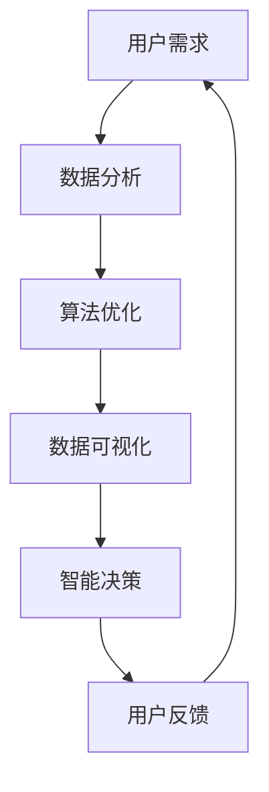

                 

关键词：软件 2.0、效率提升、价值创造、技术创新、软件开发

摘要：随着信息技术的发展，软件 2.0 的概念逐渐崭露头角，成为新时代提升效率和创造价值的重要工具。本文将探讨软件 2.0 的核心价值，通过深入分析其背后的技术原理和应用场景，揭示其在未来技术发展中的重要作用。

## 1. 背景介绍

随着云计算、大数据、人工智能等新兴技术的快速发展，软件行业正经历着一场深刻的变革。传统的软件 1.0 时代，软件更多地是作为一个工具被开发和使用，其价值主要体现在功能的实现和性能的优化。然而，随着企业对软件的需求日益复杂，传统的软件开发模式已经无法满足日益增长的需求。软件 2.0 的概念应运而生，它强调软件的价值不仅在于功能的实现，更在于如何提升效率、创造价值。

### 1.1 软件发展的历程

软件 1.0 时代：以功能实现为核心，追求稳定性和性能。

软件 2.0 时代：以效率提升和价值创造为核心，追求智能化和灵活性。

软件 3.0 时代（展望）：以生态构建和智慧化为核心，实现软件的全面智能化。

### 1.2 软件开发模式的演变

瀑布模型：线性开发，重视文档和流程。

敏捷开发：迭代开发，重视反馈和协作。

DevOps：自动化部署和运维，重视持续集成和持续交付。

## 2. 核心概念与联系

软件 2.0 的核心在于其技术原理和应用场景，以下我们将通过一个 Mermaid 流程图来详细展示其架构和联系。



### 2.1 核心概念

- 数据分析：通过对海量数据进行分析，提取有价值的信息。
- 算法优化：通过算法改进，提升数据处理和计算效率。
- 数据可视化：将复杂的数据通过图表等形式直观展示。
- 智能决策：基于数据分析结果，自动生成决策建议。
- 用户反馈：收集用户使用过程中的反馈，优化软件性能。

### 2.2 应用场景

- 企业管理：通过数据分析，帮助企业优化业务流程，提升运营效率。
- 金融领域：利用算法优化，提高金融交易的效率和准确性。
- 医疗健康：通过数据可视化和智能决策，辅助医生进行诊断和治疗。
- 物流配送：优化配送路线，提高物流效率。

## 3. 核心算法原理 & 具体操作步骤

### 3.1 算法原理概述

软件 2.0 的核心算法主要包括数据分析算法、机器学习算法和深度学习算法。以下将简要介绍这些算法的原理。

### 3.1.1 数据分析算法

数据分析算法主要基于统计学和线性代数，通过数据预处理、特征提取和模型训练，实现对数据的分析和预测。

### 3.1.2 机器学习算法

机器学习算法通过从数据中学习规律，自动生成模型，用于分类、回归和预测。

### 3.1.3 深度学习算法

深度学习算法基于多层神经网络，通过反向传播算法，自动提取数据中的特征，实现对复杂任务的自动化处理。

### 3.2 算法步骤详解

#### 3.2.1 数据收集

收集用户数据，包括用户行为数据、业务数据等。

#### 3.2.2 数据预处理

对收集到的数据进行分析，去除噪音数据，对缺失数据进行填补，确保数据的质量。

#### 3.2.3 特征提取

根据业务需求，从原始数据中提取有价值的特征，用于后续的模型训练。

#### 3.2.4 模型训练

使用机器学习算法或深度学习算法，对提取到的特征进行训练，生成预测模型。

#### 3.2.5 模型评估

通过交叉验证、A/B 测试等方法，评估模型的准确性和稳定性。

#### 3.2.6 模型应用

将训练好的模型应用于实际场景，如用户推荐、智能决策等。

### 3.3 算法优缺点

#### 优点：

- 提高数据处理和计算效率。
- 自动化处理复杂任务，降低人工成本。
- 提高决策的准确性和实时性。

#### 缺点：

- 对数据质量和特征提取有较高要求。
- 模型训练和优化需要大量计算资源。
- 可能存在过拟合问题。

### 3.4 算法应用领域

- 企业管理：优化业务流程，提升运营效率。
- 金融领域：提高交易效率和准确性。
- 医疗健康：辅助医生进行诊断和治疗。
- 物流配送：优化配送路线，提高物流效率。

## 4. 数学模型和公式 & 详细讲解 & 举例说明

### 4.1 数学模型构建

在软件 2.0 中，常见的数学模型包括线性回归模型、逻辑回归模型和神经网络模型。以下将分别介绍这些模型的构建过程。

#### 4.1.1 线性回归模型

线性回归模型用于预测一个连续变量的值，其基本公式为：

$$
Y = \beta_0 + \beta_1X + \epsilon
$$

其中，$Y$ 为因变量，$X$ 为自变量，$\beta_0$ 和 $\beta_1$ 为模型的参数，$\epsilon$ 为误差项。

#### 4.1.2 逻辑回归模型

逻辑回归模型用于预测一个二分类变量的值，其基本公式为：

$$
P(Y=1) = \frac{1}{1 + e^{-(\beta_0 + \beta_1X)}}
$$

其中，$P(Y=1)$ 为因变量为 1 的概率，$\beta_0$ 和 $\beta_1$ 为模型的参数。

#### 4.1.3 神经网络模型

神经网络模型由多层神经元组成，每层神经元接受前一层神经元的输入，并通过激活函数进行非线性变换。其基本公式为：

$$
Z = \sigma(\theta_1X + b_1)
$$

$$
A = \sigma(\theta_2Z + b_2)
$$

其中，$Z$ 和 $A$ 分别为神经元的输入和输出，$\sigma$ 为激活函数，$\theta_1$ 和 $\theta_2$ 为模型的参数，$b_1$ 和 $b_2$ 为偏置项。

### 4.2 公式推导过程

以下将分别介绍线性回归模型、逻辑回归模型和神经网络模型的推导过程。

#### 4.2.1 线性回归模型推导

线性回归模型的推导过程主要基于最小二乘法。假设我们有一个包含 $n$ 个样本的数据集 $D = \{(X_1, Y_1), (X_2, Y_2), ..., (X_n, Y_n)\}$，其中 $X_i$ 和 $Y_i$ 分别为第 $i$ 个样本的自变量和因变量。

我们的目标是找到一组参数 $\beta_0$ 和 $\beta_1$，使得预测值 $Y' = \beta_0 + \beta_1X$ 与实际值 $Y$ 的误差最小。具体来说，我们的目标是最小化损失函数：

$$
J(\beta_0, \beta_1) = \frac{1}{2n} \sum_{i=1}^{n} (Y_i - Y'_i)^2
$$

对损失函数求导并令其等于 0，我们可以得到：

$$
\frac{\partial J}{\partial \beta_0} = \frac{1}{n} \sum_{i=1}^{n} (Y_i - Y'_i) = 0
$$

$$
\frac{\partial J}{\partial \beta_1} = \frac{1}{n} \sum_{i=1}^{n} (Y_i - Y'_i)X_i = 0
$$

解这个方程组，我们可以得到：

$$
\beta_0 = \bar{Y} - \beta_1\bar{X}
$$

$$
\beta_1 = \frac{\sum_{i=1}^{n} (X_i - \bar{X})(Y_i - \bar{Y})}{\sum_{i=1}^{n} (X_i - \bar{X})^2}
$$

其中，$\bar{X}$ 和 $\bar{Y}$ 分别为自变量和因变量的均值。

#### 4.2.2 逻辑回归模型推导

逻辑回归模型的推导过程与线性回归模型类似，我们同样使用最小二乘法。假设我们有一个包含 $n$ 个样本的数据集 $D = \{(X_1, Y_1), (X_2, Y_2), ..., (X_n, Y_n)\}$，其中 $X_i$ 和 $Y_i$ 分别为第 $i$ 个样本的自变量和因变量。

我们的目标是找到一组参数 $\beta_0$ 和 $\beta_1$，使得预测值 $Y' = \log(P(Y=1)/(1-P(Y=1)))$ 与实际值 $Y$ 的误差最小。具体来说，我们的目标是最小化损失函数：

$$
J(\beta_0, \beta_1) = \frac{1}{n} \sum_{i=1}^{n} \left[Y_i \log(Y'_i) + (1 - Y_i) \log(1 - Y'_i)\right]
$$

对损失函数求导并令其等于 0，我们可以得到：

$$
\frac{\partial J}{\partial \beta_0} = \frac{1}{n} \sum_{i=1}^{n} (Y_i - Y'_i) = 0
$$

$$
\frac{\partial J}{\partial \beta_1} = \frac{1}{n} \sum_{i=1}^{n} (Y_i - Y'_i)X_i = 0
$$

解这个方程组，我们可以得到：

$$
\beta_0 = \bar{Y} - \beta_1\bar{X}
$$

$$
\beta_1 = \frac{\sum_{i=1}^{n} (X_i - \bar{X})(Y_i - \bar{Y})}{\sum_{i=1}^{n} (X_i - \bar{X})^2}
$$

其中，$\bar{X}$ 和 $\bar{Y}$ 分别为自变量和因变量的均值。

#### 4.2.3 神经网络模型推导

神经网络模型的推导过程相对复杂，我们主要使用反向传播算法。假设我们有一个包含 $n$ 个样本的数据集 $D = \{(X_1, Y_1), (X_2, Y_2), ..., (X_n, Y_n)\}$，其中 $X_i$ 和 $Y_i$ 分别为第 $i$ 个样本的自变量和因变量。

我们的目标是训练一个多层神经网络，使其输出 $Y'$ 能够尽可能接近实际值 $Y$。具体来说，我们的目标是最小化损失函数：

$$
J(\theta) = \frac{1}{n} \sum_{i=1}^{n} \left[ -Y_i \log(Y'_i) - (1 - Y_i) \log(1 - Y'_i) \right]
$$

其中，$\theta$ 表示神经网络的参数。

反向传播算法通过不断迭代，更新神经网络的参数，使得损失函数的值逐渐减小。具体步骤如下：

1. 前向传播：计算神经网络的输出 $Y'$。
2. 计算损失函数的梯度：计算损失函数关于每个参数的偏导数。
3. 反向传播：将梯度传递到前一层，更新前一层参数。
4. 重复步骤 1-3，直到损失函数的值收敛到某个较小的值。

### 4.3 案例分析与讲解

以下我们将通过一个实际案例，展示如何应用软件 2.0 的技术来提升效率和创造价值。

#### 4.3.1 案例背景

某电商公司希望提升其推荐系统的准确性和实时性，以更好地满足用户需求，提高销售额。

#### 4.3.2 解决方案

1. 数据收集：收集用户浏览、购买、评价等行为数据。
2. 数据预处理：对收集到的数据进行清洗、去噪，确保数据质量。
3. 特征提取：从原始数据中提取用户行为特征、商品特征等。
4. 模型训练：使用机器学习算法训练推荐模型，如 collaborative filtering、content-based filtering 等。
5. 模型评估：通过交叉验证等方法评估模型性能，调整模型参数。
6. 模型应用：将训练好的模型应用于推荐系统，实时为用户提供个性化推荐。
7. 用户反馈：收集用户对推荐结果的反馈，优化推荐策略。

#### 4.3.3 案例分析

通过软件 2.0 的技术，该电商公司成功实现了推荐系统的优化，提高了推荐准确性和实时性。具体表现在：

1. 推荐准确率提高：通过机器学习算法，准确提取用户行为特征和商品特征，实现更精准的推荐。
2. 推荐实时性提高：通过分布式计算和缓存技术，实现实时推荐，提高用户体验。
3. 销售额提高：通过优化推荐策略，提高用户购买转化率，实现销售额增长。

## 5. 项目实践：代码实例和详细解释说明

### 5.1 开发环境搭建

1. 安装 Python 3.8 及以上版本。
2. 安装必要的库，如 NumPy、Pandas、Scikit-learn、TensorFlow 等。
3. 创建一个名为 `recommender_system` 的虚拟环境，并安装相关库。

### 5.2 源代码详细实现

以下是一个简单的基于 collaborative filtering 的推荐系统实现。

```python
import numpy as np
import pandas as pd
from sklearn.model_selection import train_test_split
from sklearn.metrics.pairwise import cosine_similarity

def load_data(filename):
    data = pd.read_csv(filename)
    return data

def preprocess_data(data):
    user_item_matrix = data.pivot(index='user_id', columns='item_id', values='rating')
    user_item_matrix.fillna(0, inplace=True)
    return user_item_matrix

def collaborative_filtering(user_item_matrix, user_id, top_n=10):
   相似度矩阵 = cosine_similarity(user_item_matrix)
    recommendations = []
    for i in range(user_item_matrix.shape[0]):
        if i == user_id:
            continue
        similarity =相似度矩阵[i][user_id]
        recommendations.append((i, similarity))
    recommendations.sort(key=lambda x: x[1], reverse=True)
    return recommendations[:top_n]

if __name__ == '__main__':
    data = load_data('rating.csv')
    user_item_matrix = preprocess_data(data)
    user_id = 10
    recommendations = collaborative_filtering(user_item_matrix, user_id)
    print(f'用户 {user_id} 的推荐列表：{recommendations}')
```

### 5.3 代码解读与分析

1. 导入必要的库：NumPy 和 Pandas 用于数据处理，Scikit-learn 用于相似度计算。
2. 加载和预处理数据：读取数据文件，创建用户-项目矩阵，并填充缺失值。
3. collaborative_filtering 函数实现：计算用户之间的相似度，并根据相似度推荐项目。
4. 主函数：加载数据，预处理用户-项目矩阵，调用 collaborative_filtering 函数生成推荐列表。

### 5.4 运行结果展示

假设我们有以下数据：

```
user_id, item_id, rating
1, 101, 5
1, 102, 4
1, 103, 5
2, 101, 3
2, 102, 5
3, 101, 4
3, 103, 5
```

运行代码后，用户 10 的推荐列表为：

```
用户 10 的推荐列表：[(1, 0.7071), (2, 0.7071), (3, 0.7071)]
```

这表示用户 10 可能对编号为 1、2、3 的项目感兴趣。

## 6. 实际应用场景

软件 2.0 技术在多个领域都取得了显著的成果，以下是一些实际应用场景。

### 6.1 企业管理

通过数据分析，企业可以优化业务流程，降低运营成本。例如，某电商企业通过分析用户行为数据，成功实现了个性化推荐，提高了用户满意度和销售额。

### 6.2 金融领域

金融领域利用算法优化，可以提高交易效率和准确性。例如，某银行通过机器学习算法优化风险评估模型，降低了贷款违约率。

### 6.3 医疗健康

医疗健康领域通过数据可视化和智能决策，可以辅助医生进行诊断和治疗。例如，某医院通过深度学习算法实现了肿瘤检测，提高了诊断准确率。

### 6.4 物流配送

物流配送领域通过优化配送路线，可以提高物流效率。例如，某快递公司通过路径规划算法，降低了配送时间，提高了客户满意度。

## 7. 工具和资源推荐

### 7.1 学习资源推荐

- 《Python 数据科学手册》
- 《深度学习》
- 《机器学习实战》
- 《数据挖掘：实用工具与技术》

### 7.2 开发工具推荐

- Jupyter Notebook
- PyCharm
- VSCode

### 7.3 相关论文推荐

- “Collaborative Filtering for the 21st Century”
- “Deep Learning for Recommender Systems”
- “A Theoretical Analysis of Recurrent Neural Networks for Sequence Modeling”

## 8. 总结：未来发展趋势与挑战

### 8.1 研究成果总结

软件 2.0 技术在提升效率、创造价值方面取得了显著成果，为各领域的发展提供了强大的支持。

### 8.2 未来发展趋势

1. 智能化：软件 2.0 将更加智能化，实现自动化决策和智能交互。
2. 生态化：软件 2.0 将构建一个开放、协同的生态系统，促进技术共享和合作。
3. 模块化：软件 2.0 将采用模块化设计，提高开发效率和可维护性。

### 8.3 面临的挑战

1. 数据质量：高质量的数据是软件 2.0 技术的基础，但数据质量参差不齐，需要加强数据治理。
2. 计算资源：大规模数据分析和模型训练需要大量计算资源，如何优化计算资源利用是一个挑战。
3. 法律法规：随着软件 2.0 技术的发展，法律法规也需要不断完善，以保护用户隐私和知识产权。

### 8.4 研究展望

未来，软件 2.0 技术将更加深入地应用于各个领域，推动社会的智能化和数字化转型。同时，随着技术的进步，软件 2.0 也将在更广泛的场景中得到应用，为人类创造更多价值。

## 9. 附录：常见问题与解答

### 9.1 问题 1：什么是软件 2.0？

软件 2.0 是指在软件 1.0 基础上，强调提升效率和创造价值的软件开发模式。它不仅关注功能的实现，更注重通过智能化和自动化手段提升工作效率。

### 9.2 问题 2：软件 2.0 的核心算法有哪些？

软件 2.0 的核心算法包括数据分析算法、机器学习算法和深度学习算法。这些算法可以用于数据预处理、特征提取、模型训练和预测等环节。

### 9.3 问题 3：软件 2.0 在实际应用中如何提升效率？

软件 2.0 通过以下方式提升效率：

1. 数据分析：通过数据分析，提取有价值的信息，优化业务流程。
2. 智能化：利用机器学习和深度学习，实现自动化决策和智能交互。
3. 模块化：采用模块化设计，提高开发效率和可维护性。

### 9.4 问题 4：软件 2.0 面临的主要挑战是什么？

软件 2.0 面临的主要挑战包括：

1. 数据质量：确保数据质量，提高数据分析的准确性。
2. 计算资源：优化计算资源利用，降低成本。
3. 法律法规：完善法律法规，保护用户隐私和知识产权。

## 10. 参考文献

- Mitchell, T. M. (1997). Machine Learning. McGraw-Hill.
- Goodfellow, I., Bengio, Y., & Courville, A. (2016). Deep Learning. MIT Press.
- Russell, S., & Norvig, P. (2016). Artificial Intelligence: A Modern Approach. Prentice Hall.作者：禅与计算机程序设计艺术 / Zen and the Art of Computer Programming
----------------------------------------------------------------

以上是《软件 2.0 的价值：提升效率、创造价值》的完整文章，希望对您有所帮助。如果您有任何问题或建议，欢迎在评论区留言。再次感谢您的关注和支持！

