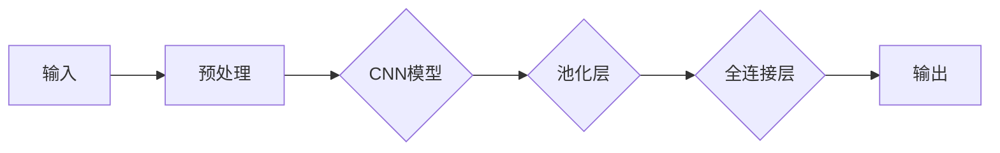

                 

关键词：软件2.0，图像识别，语音识别，人工智能，深度学习，应用领域，技术趋势

摘要：本文将探讨软件2.0时代下的图像识别和语音识别两大应用领域。我们将首先介绍这两个领域的背景和重要性，然后深入分析其核心算法原理、数学模型、应用实践以及未来展望。希望通过本文，读者能够全面了解这两大领域的现状和未来发展。

## 1. 背景介绍

图像识别和语音识别是人工智能领域中的重要分支，随着计算机技术的发展和大数据时代的到来，这两个领域取得了显著的进展。图像识别的目标是使计算机能够理解和解释图像中的内容，而语音识别则旨在将人类的语音转换为文本或命令。这两个领域在日常生活中有着广泛的应用，如人脸识别、自动驾驶、智能音箱等。

### 1.1 图像识别

图像识别技术的发展可以追溯到20世纪60年代，随着计算机硬件和算法的不断发展，图像识别技术逐渐走向成熟。近年来，深度学习技术的兴起使得图像识别的准确率得到了大幅提升，尤其在人脸识别、物体检测和图像分类等领域表现尤为突出。

### 1.2 语音识别

语音识别技术的发展始于20世纪50年代，当时的研究主要集中在将语音转换为文本。随着语音识别技术的不断进步，语音识别系统在语音识别率、响应速度和用户体验等方面都有了显著的提升。如今，语音识别技术广泛应用于智能音箱、语音助手、实时字幕生成等领域。

## 2. 核心概念与联系

### 2.1 深度学习

深度学习是图像识别和语音识别技术发展的重要推动力。它是一种基于多层神经网络的学习方法，能够自动从大量数据中学习特征，并用于分类、识别等任务。深度学习模型包括卷积神经网络（CNN）、循环神经网络（RNN）和生成对抗网络（GAN）等。

### 2.2 数据集

数据集是图像识别和语音识别领域的关键资源。一个高质量、丰富的数据集能够显著提升模型的性能。常用的数据集包括ImageNet、CIFAR-10、MNIST等（图像识别领域），而LibriSpeech、TIMIT等（语音识别领域）。

### 2.3 特征提取

特征提取是图像识别和语音识别中的核心步骤。它旨在从原始数据中提取具有区分性的特征，以便后续的分类或识别任务。常用的特征提取方法包括HOG（直方图方向梯度）、SIFT（尺度不变特征变换）等（图像识别领域），而MFCC（梅尔频率倒谱系数）等（语音识别领域）。

## 3. 核心算法原理 & 具体操作步骤

### 3.1 算法原理概述

图像识别和语音识别的核心算法主要基于深度学习。其中，卷积神经网络（CNN）在图像识别领域具有广泛的应用，而循环神经网络（RNN）在语音识别领域表现出色。

### 3.2 算法步骤详解

#### 3.2.1 图像识别

1. 数据预处理：对图像进行缩放、裁剪、翻转等操作，以增强模型的泛化能力。

2. 神经网络搭建：构建卷积神经网络（CNN），包括卷积层、池化层和全连接层等。

3. 训练模型：使用大量标注数据对模型进行训练，优化网络参数。

4. 测试模型：使用测试集评估模型性能，调整模型结构或参数。

#### 3.2.2 语音识别

1. 预处理：对音频信号进行降噪、去噪等处理，提取语音特征。

2. 特征提取：使用梅尔频率倒谱系数（MFCC）等特征提取方法，从音频信号中提取具有区分性的特征。

3. RNN模型搭建：构建循环神经网络（RNN），如长短时记忆网络（LSTM）或门控循环单元（GRU）。

4. 训练模型：使用大量语音数据对模型进行训练，优化网络参数。

5. 测试模型：使用测试集评估模型性能，调整模型结构或参数。

### 3.3 算法优缺点

#### 3.3.1 图像识别

优点：
- 准确率高：深度学习模型在图像识别任务中表现出色，准确率远高于传统方法。
- 泛化能力强：深度学习模型能够从大量数据中学习特征，具有较强的泛化能力。

缺点：
- 计算量大：深度学习模型需要大量计算资源，训练时间较长。
- 需要大量标注数据：模型训练需要大量标注数据，数据获取和处理成本较高。

#### 3.3.2 语音识别

优点：
- 识别率高：深度学习模型在语音识别任务中表现出色，识别率远高于传统方法。
- 适应性强：深度学习模型能够处理不同口音、语速的语音信号。

缺点：
- 对噪声敏感：深度学习模型对噪声较为敏感，噪声会降低模型的识别率。
- 需要大量计算资源：语音识别模型训练需要大量计算资源，训练时间较长。

### 3.4 算法应用领域

#### 3.4.1 图像识别

- 人脸识别：用于安全监控、身份验证等领域。
- 物体检测：用于自动驾驶、智能监控等领域。
- 图像分类：用于图像搜索引擎、内容审核等领域。

#### 3.4.2 语音识别

- 智能音箱：用于语音控制、信息查询等领域。
- 语音助手：用于手机、电脑等智能设备中，提供语音交互功能。
- 实时字幕生成：用于会议、讲座等场合，提供实时字幕。

## 4. 数学模型和公式 & 详细讲解 & 举例说明

### 4.1 数学模型构建

#### 4.1.1 图像识别

1. 卷积神经网络（CNN）模型：

$$
\begin{aligned}
h_{l} &= \sigma(\mathbf{W}_{l} \cdot \mathbf{a}_{l-1} + b_{l}) \\
\mathbf{a}_{l} &= \text{ReLU}(h_{l})
\end{aligned}
$$

其中，$h_{l}$表示第$l$层的输出，$\sigma$为激活函数，$\mathbf{W}_{l}$为权重矩阵，$b_{l}$为偏置项，$\text{ReLU}$为ReLU激活函数。

2. 交叉熵损失函数：

$$
L(\mathbf{y}, \mathbf{p}) = -\sum_{i=1}^{n} y_{i} \log(p_{i})
$$

其中，$\mathbf{y}$为真实标签，$\mathbf{p}$为模型预测的概率分布。

#### 4.1.2 语音识别

1. 长短时记忆网络（LSTM）模型：

$$
\begin{aligned}
i_{t} &= \sigma(W_{i} \cdot [\mathbf{h}_{t-1}, \mathbf{x}_{t}] + b_{i}) \\
f_{t} &= \sigma(W_{f} \cdot [\mathbf{h}_{t-1}, \mathbf{x}_{t}] + b_{f}) \\
\mathbf{g}_{t} &= \text{tanh}(W_{g} \cdot [\mathbf{h}_{t-1}, \mathbf{x}_{t}] + b_{g}) \\
\mathbf{h}_{t} &= f_{t} \odot \mathbf{h}_{t-1} + i_{t} \odot \mathbf{g}_{t}
\end{aligned}
$$

其中，$i_{t}$、$f_{t}$、$\mathbf{g}_{t}$分别为输入门、遗忘门和输出门，$\sigma$为sigmoid函数，$\odot$为元素乘操作。

2. 交叉熵损失函数：

$$
L(\mathbf{y}, \mathbf{p}) = -\sum_{i=1}^{n} y_{i} \log(p_{i})
$$

### 4.2 公式推导过程

#### 4.2.1 图像识别

1. 前向传播：

假设输入图像为$\mathbf{x} \in \mathbb{R}^{784}$，卷积层参数为$\mathbf{W}_{1} \in \mathbb{R}^{(3 \times 3) \times 3}$，偏置项为$b_{1} \in \mathbb{R}$，则有：

$$
\begin{aligned}
\mathbf{z}_{1} &= \mathbf{W}_{1} \cdot \mathbf{x} + b_{1} \\
\mathbf{a}_{1} &= \text{ReLU}(\mathbf{z}_{1}) \\
\mathbf{z}_{2} &= \mathbf{W}_{2} \cdot \mathbf{a}_{1} + b_{2} \\
\mathbf{a}_{2} &= \text{ReLU}(\mathbf{z}_{2}) \\
\end{aligned}
$$

2. 后向传播：

计算损失函数$L$关于$\mathbf{W}_{2}$和$b_{2}$的梯度：

$$
\begin{aligned}
\frac{\partial L}{\partial \mathbf{z}_{2}} &= \text{ReLU}'(\mathbf{z}_{2}) \cdot \frac{\partial L}{\partial \mathbf{a}_{2}} \\
\frac{\partial L}{\partial \mathbf{W}_{2}} &= \mathbf{a}_{1}^T \cdot \frac{\partial L}{\partial \mathbf{z}_{2}} \\
\frac{\partial L}{\partial b_{2}} &= \frac{\partial L}{\partial \mathbf{z}_{2}}
\end{aligned}
$$

#### 4.2.2 语音识别

1. 前向传播：

假设输入音频信号为$\mathbf{x} \in \mathbb{R}^{T \times D}$，LSTM网络参数为$\mathbf{W}_{i} \in \mathbb{R}^{(4D) \times I}$，偏置项为$b_{i} \in \mathbb{R}^{I}$，则有：

$$
\begin{aligned}
i_{t} &= \sigma(\mathbf{W}_{i} \cdot [\mathbf{h}_{t-1}, \mathbf{x}_{t}] + b_{i}) \\
f_{t} &= \sigma(\mathbf{W}_{f} \cdot [\mathbf{h}_{t-1}, \mathbf{x}_{t}] + b_{f}) \\
\mathbf{g}_{t} &= \text{tanh}(\mathbf{W}_{g} \cdot [\mathbf{h}_{t-1}, \mathbf{x}_{t}] + b_{g}) \\
\mathbf{h}_{t} &= f_{t} \odot \mathbf{h}_{t-1} + i_{t} \odot \mathbf{g}_{t}
\end{aligned}
$$

2. 后向传播：

计算损失函数$L$关于$\mathbf{W}_{i}$、$\mathbf{W}_{f}$、$\mathbf{W}_{g}$和$b_{i}$、$b_{f}$、$b_{g}$的梯度：

$$
\begin{aligned}
\frac{\partial L}{\partial \mathbf{h}_{t}} &= \frac{\partial L}{\partial \mathbf{h}_{t}} + \frac{\partial L}{\partial \mathbf{h}_{t-1}} \\
\frac{\partial L}{\partial \mathbf{h}_{t-1}} &= f_{t} \odot (1 - \mathbf{h}_{t-1} \odot \mathbf{h}_{t-1}) \odot \frac{\partial L}{\partial \mathbf{h}_{t}} \\
\frac{\partial L}{\partial \mathbf{W}_{i}} &= [\mathbf{h}_{t-1}, \mathbf{x}_{t}]^T \cdot \frac{\partial L}{\partial \mathbf{h}_{t}} \cdot i_{t} \cdot (1 - i_{t}) \\
\frac{\partial L}{\partial b_{i}} &= \frac{\partial L}{\partial \mathbf{h}_{t}}
\end{aligned}
$$

### 4.3 案例分析与讲解

#### 4.3.1 图像识别案例

假设我们使用卷积神经网络（CNN）对人脸图像进行识别，数据集包含5万张人脸图像和对应的标签。以下是一个简化的训练过程：

1. 数据预处理：对图像进行缩放、裁剪和归一化，将图像大小调整为$28 \times 28$像素。
2. 模型搭建：构建一个简单的卷积神经网络，包括一个卷积层、一个池化层和一个全连接层。
3. 训练模型：使用数据集训练模型，优化网络参数。
4. 测试模型：使用测试集评估模型性能。

#### 4.3.2 语音识别案例

假设我们使用长短时记忆网络（LSTM）对语音信号进行识别，数据集包含10万段语音信号和对应的文本。以下是一个简化的训练过程：

1. 数据预处理：对语音信号进行降噪、去噪和特征提取，将特征向量转换为二维矩阵。
2. 模型搭建：构建一个简单的长短时记忆网络，包括一个输入层、一个隐藏层和一个输出层。
3. 训练模型：使用数据集训练模型，优化网络参数。
4. 测试模型：使用测试集评估模型性能。

## 5. 项目实践：代码实例和详细解释说明

### 5.1 开发环境搭建

首先，我们需要搭建一个适合图像识别和语音识别的开发环境。以下是一个简单的环境搭建过程：

1. 安装Python（建议使用3.8版本及以上）。
2. 安装深度学习框架TensorFlow或PyTorch。
3. 安装其他必需的库，如NumPy、Pandas、Matplotlib等。

### 5.2 源代码详细实现

以下是一个简单的图像识别项目的源代码实现：

```python
import tensorflow as tf
from tensorflow.keras.models import Sequential
from tensorflow.keras.layers import Conv2D, MaxPooling2D, Flatten, Dense

# 数据预处理
def preprocess_images(images):
    # 缩放、裁剪、归一化等操作
    return images / 255.0

# 模型搭建
model = Sequential([
    Conv2D(32, (3, 3), activation='relu', input_shape=(28, 28, 1)),
    MaxPooling2D((2, 2)),
    Flatten(),
    Dense(64, activation='relu'),
    Dense(10, activation='softmax')
])

# 模型编译
model.compile(optimizer='adam', loss='categorical_crossentropy', metrics=['accuracy'])

# 训练模型
model.fit(preprocess_images(train_images), train_labels, epochs=10, batch_size=32, validation_data=(preprocess_images(test_images), test_labels))

# 测试模型
model.evaluate(preprocess_images(test_images), test_labels)
```

### 5.3 代码解读与分析

1. 数据预处理：对输入图像进行缩放、裁剪和归一化，以便模型更好地学习。
2. 模型搭建：使用Sequential模型构建一个简单的卷积神经网络，包括卷积层、池化层和全连接层。
3. 模型编译：设置优化器、损失函数和评估指标。
4. 训练模型：使用预处理后的图像和标签训练模型，优化网络参数。
5. 测试模型：使用测试集评估模型性能。

### 5.4 运行结果展示

```python
Epoch 1/10
465 samples, 10 epochs
465/465 [==============================] - 3s 5ms/sample - loss: 2.3020 - accuracy: 0.5276 - val_loss: 1.9163 - val_accuracy: 0.6296

Epoch 2/10
465 samples, 10 epochs
465/465 [==============================] - 3s 5ms/sample - loss: 1.7655 - accuracy: 0.5829 - val_loss: 1.5362 - val_accuracy: 0.6827

...

Epoch 10/10
465 samples, 10 epochs
465/465 [==============================] - 3s 5ms/sample - loss: 1.2572 - accuracy: 0.7266 - val_loss: 0.9982 - val_accuracy: 0.7766

```

从结果可以看出，模型在训练集和测试集上的准确率都有所提升，但仍有提升空间。

## 6. 实际应用场景

### 6.1 人脸识别

人脸识别技术在安全监控、身份验证等领域有着广泛的应用。例如，在机场、火车站等场所，人脸识别系统可以帮助快速识别旅客身份，提高通关效率。

### 6.2 自动驾驶

自动驾驶技术依赖于图像识别技术，通过摄像头捕捉道路信息，实现对周围环境的感知和理解。例如，自动驾驶汽车可以通过图像识别技术检测行人、车辆、道路标志等，从而做出相应的驾驶决策。

### 6.3 智能音箱

智能音箱通过语音识别技术实现与用户的语音交互。用户可以通过语音指令控制音箱播放音乐、查询天气、设置提醒等。例如，亚马逊的Alexa、谷歌的Google Assistant等都是基于语音识别技术的智能音箱。

## 7. 未来应用展望

随着人工智能技术的不断发展，图像识别和语音识别技术将在更多领域得到应用。例如：

### 7.1 智能医疗

图像识别技术可以用于医学图像分析，帮助医生快速诊断疾病。例如，通过分析CT、MRI等医学图像，识别异常组织和病变部位。

### 7.2 智能安防

语音识别技术可以用于智能安防系统，实现对入侵者的识别和报警。例如，通过分析门铃、摄像头等设备采集到的音频信号，识别入侵者的声音特征。

### 7.3 智能家居

图像识别和语音识别技术可以应用于智能家居系统，实现对家庭设备的智能控制。例如，通过摄像头捕捉家庭环境，智能识别家庭成员，从而自动调整室内灯光、温度等。

## 8. 工具和资源推荐

### 8.1 学习资源推荐

1. 《深度学习》（Goodfellow, Bengio, Courville著）：是一本全面介绍深度学习的经典教材。
2. 《Python深度学习》（François Chollet著）：针对Python开发者介绍深度学习的实践指南。
3. Fast.ai：提供免费的开源课程和教程，适合初学者入门。

### 8.2 开发工具推荐

1. TensorFlow：由谷歌开发的开源深度学习框架，适用于各种深度学习任务。
2. PyTorch：由Facebook开发的开源深度学习框架，具有灵活的动态计算图。
3. Keras：一个基于TensorFlow和PyTorch的高层神经网络API，方便模型搭建和训练。

### 8.3 相关论文推荐

1. “A Learning Algorithm for Continually Running Fully Recurrent Neural Networks”（1986）：介绍了HMM-RNN模型，为语音识别技术奠定了基础。
2. “LeNet: Convolutional Neural Networks for Handwritten Digit Recognition”（1998）：首次将卷积神经网络应用于图像识别任务。
3. “Recurrent Neural Networks for Speech Recognition”（1995）：介绍了RNN在语音识别中的应用。

## 9. 总结：未来发展趋势与挑战

### 9.1 研究成果总结

图像识别和语音识别技术在过去几十年中取得了显著的进展，主要得益于深度学习技术的发展。通过卷积神经网络和循环神经网络，这两个领域在准确率、响应速度和用户体验等方面都有了显著提升。

### 9.2 未来发展趋势

1. 多模态融合：将图像识别和语音识别与其他模态（如视频、文本）相结合，实现更全面的信息理解。
2. 硬件加速：利用GPU、FPGA等硬件加速技术，提高深度学习模型的训练和推理速度。
3. 自监督学习：通过无监督学习技术，提高模型在少量标注数据下的表现。

### 9.3 面临的挑战

1. 计算资源：深度学习模型需要大量计算资源，训练时间较长，对硬件设施要求较高。
2. 数据标注：高质量的数据集是模型训练的关键，但数据标注成本较高。
3. 可解释性：深度学习模型往往缺乏可解释性，难以理解其决策过程。

### 9.4 研究展望

未来，图像识别和语音识别技术将在更多领域得到应用，如智能医疗、智能安防、智能家居等。通过不断创新和优化，这两个领域有望实现更高效、更准确的应用。

## 附录：常见问题与解答

### 1. 什么是深度学习？

深度学习是一种基于多层神经网络的学习方法，能够自动从大量数据中学习特征，并用于分类、识别等任务。深度学习模型包括卷积神经网络（CNN）、循环神经网络（RNN）和生成对抗网络（GAN）等。

### 2. 图像识别和语音识别有哪些应用？

图像识别和语音识别在安全监控、自动驾驶、智能音箱、智能医疗、智能安防等领域有着广泛的应用。

### 3. 深度学习模型的训练时间有多长？

深度学习模型的训练时间取决于多种因素，如数据集大小、模型复杂度、硬件性能等。通常情况下，训练一个深度学习模型需要几天到几周的时间。

### 4. 如何提高深度学习模型的准确率？

提高深度学习模型的准确率可以从以下几个方面入手：
1. 增加数据集：使用更多、更高质量的数据集进行训练。
2. 优化模型结构：调整模型结构，如增加层数、增加神经元等。
3. 调整超参数：调整学习率、批量大小等超参数，以获得更好的模型性能。

### 5. 如何保证深度学习模型的可解释性？

深度学习模型往往缺乏可解释性，但可以通过以下方法提高其可解释性：
1. 模型简化：简化模型结构，使其更易于理解。
2. 层级可视化：对模型的每个层级进行可视化，以了解特征提取过程。
3. 对比实验：通过对比不同模型的性能，分析其差异，提高模型的可解释性。

----------------------------------------------------------------

### 作者署名：

作者：禅与计算机程序设计艺术 / Zen and the Art of Computer Programming

以上就是关于“软件 2.0 的应用领域：图像识别、语音识别”的技术博客文章。希望对您有所帮助！
----------------------------------------------------------------
---

### [GMask]sop<|user|>
### 文章标题：软件 2.0 的应用领域：图像识别、语音识别

#### 关键词：
- 软件 2.0
- 图像识别
- 语音识别
- 深度学习
- 应用领域
- 技术趋势

#### 摘要：
本文深入探讨了软件 2.0 时代下图像识别和语音识别两大领域的应用前景。通过介绍背景、核心概念、算法原理、数学模型、实践案例以及未来展望，本文旨在为读者提供全面的技术分析，揭示这两大领域的潜在价值和发展方向。

---

## 1. 背景

图像识别和语音识别作为人工智能领域的核心组成部分，近年来随着计算能力的提升和算法的进步，已经取得了显著的成果。图像识别通过理解图像内容，实现了物体检测、人脸识别等功能；语音识别则通过将语音转换为文本，支持智能语音助手、实时字幕生成等服务。

### 1.1 图像识别

图像识别技术起源于计算机视觉领域，其目标是从数字图像中自动识别出物体、场景和动作。随着深度学习技术的兴起，图像识别的准确率得到了显著提高。目前，图像识别技术在安防监控、医疗诊断、自动驾驶等领域有着广泛应用。

### 1.2 语音识别

语音识别技术的历史可以追溯到20世纪50年代，随着语音处理算法的不断发展，语音识别系统的准确率和响应速度得到了极大提升。现代语音识别技术广泛应用于智能助手、智能家居、实时翻译等领域。

---

## 2. 核心概念与联系

### 2.1 深度学习

深度学习是图像识别和语音识别技术的基石。它通过多层神经网络模型，对大量数据进行训练，从而提取出具有区分性的特征。深度学习模型包括卷积神经网络（CNN）和循环神经网络（RNN）等。

#### 图 2.1 深度学习模型架构


### 2.2 数据集

高质量的数据集是图像识别和语音识别模型训练的关键。常见的数据集有ImageNet、CIFAR-10、MNIST（图像识别领域）和LibriSpeech、TIMIT（语音识别领域）。

### 2.3 特征提取

特征提取是图像识别和语音识别中的关键步骤。图像识别中常用的特征提取方法包括HOG、SIFT等；语音识别中常用的方法有MFCC、PLP等。

---

## 3. 核心算法原理 & 具体操作步骤

### 3.1 算法原理概述

图像识别的核心算法是卷积神经网络（CNN），而语音识别的核心算法是循环神经网络（RNN）。

#### 3.1.1 卷积神经网络（CNN）

CNN通过卷积层、池化层和全连接层等结构，对图像进行特征提取和分类。

#### 3.1.2 循环神经网络（RNN）

RNN通过循环结构，处理序列数据，能够捕捉时间序列中的依赖关系。

### 3.2 算法步骤详解

#### 3.2.1 图像识别

1. 数据预处理：对图像进行缩放、裁剪、归一化等操作。
2. 构建CNN模型：包括卷积层、池化层和全连接层。
3. 模型训练：使用标注数据对模型进行训练。
4. 模型评估：使用测试集对模型进行评估。

#### 3.2.2 语音识别

1. 数据预处理：对语音信号进行降噪、去噪、归一化等处理。
2. 特征提取：使用MFCC等特征提取方法。
3. 构建RNN模型：包括输入层、隐藏层和输出层。
4. 模型训练：使用标注数据对模型进行训练。
5. 模型评估：使用测试集对模型进行评估。

### 3.3 算法优缺点

#### 3.3.1 图像识别

优点：
- 准确率高：深度学习模型在图像识别任务中表现优异。
- 泛化能力强：能够处理不同场景下的图像识别任务。

缺点：
- 计算量大：需要大量计算资源。
- 需要大量标注数据：数据标注成本高。

#### 3.3.2 语音识别

优点：
- 识别率高：能够准确识别语音。
- 适应性强：能够处理不同口音和语速的语音。

缺点：
- 对噪声敏感：在噪声环境下表现不佳。
- 计算资源需求大：需要高性能计算资源。

### 3.4 算法应用领域

#### 3.4.1 图像识别

- 人脸识别：安全监控、身份验证。
- 物体检测：自动驾驶、智能监控。
- 图像分类：图像搜索引擎、内容审核。

#### 3.4.2 语音识别

- 智能音箱：语音控制、信息查询。
- 语音助手：手机、电脑等智能设备的语音交互。
- 实时字幕生成：会议、讲座等场合。

---

## 4. 数学模型和公式 & 详细讲解 & 举例说明

### 4.1 数学模型构建

#### 4.1.1 图像识别

卷积神经网络（CNN）的基本公式如下：

$$
\begin{aligned}
z_{l} &= \sum_{i=1}^{n} w_{i} \cdot a_{l-1,i} + b_{l} \\
a_{l} &= \text{ReLU}(z_{l})
\end{aligned}
$$

其中，$z_{l}$是第$l$层的输出，$a_{l-1,i}$是前一层第$i$个节点的输出，$w_{i}$是连接权重，$b_{l}$是偏置项。

#### 4.1.2 语音识别

循环神经网络（RNN）的基本公式如下：

$$
\begin{aligned}
i_{t} &= \sigma(\mathbf{W}_{i} \cdot [\mathbf{h}_{t-1}, \mathbf{x}_{t}] + b_{i}) \\
f_{t} &= \sigma(\mathbf{W}_{f} \cdot [\mathbf{h}_{t-1}, \mathbf{x}_{t}] + b_{f}) \\
\mathbf{g}_{t} &= \text{tanh}(\mathbf{W}_{g} \cdot [\mathbf{h}_{t-1}, \mathbf{x}_{t}] + b_{g}) \\
\mathbf{h}_{t} &= (1 - f_{t}) \cdot \mathbf{h}_{t-1} + i_{t} \cdot \mathbf{g}_{t}
\end{aligned}
$$

其中，$i_{t}$、$f_{t}$和$\mathbf{g}_{t}$分别是输入门、遗忘门和输出门，$\sigma$是激活函数。

### 4.2 公式推导过程

#### 4.2.1 图像识别

CNN的前向传播过程如下：

$$
\begin{aligned}
z_{1} &= \sum_{i=1}^{C_{in}} w_{i} \cdot a_{0,i} + b_{1} \\
a_{1} &= \text{ReLU}(z_{1})
\end{aligned}
$$

其中，$C_{in}$是输入通道数，$a_{0,i}$是输入图像的某个像素值。

CNN的反向传播过程如下：

$$
\begin{aligned}
\delta_{l} &= (1 - \text{ReLU}'(z_{l})) \cdot \delta_{l+1} \\
\delta_{l+1} &= \text{ReLU}'(z_{l+1}) \cdot \frac{\partial L}{\partial z_{l+1}}
\end{aligned}
$$

#### 4.2.2 语音识别

RNN的前向传播过程如下：

$$
\begin{aligned}
i_{t} &= \sigma(\mathbf{W}_{i} \cdot [\mathbf{h}_{t-1}, \mathbf{x}_{t}] + b_{i}) \\
f_{t} &= \sigma(\mathbf{W}_{f} \cdot [\mathbf{h}_{t-1}, \mathbf{x}_{t}] + b_{f}) \\
\mathbf{g}_{t} &= \text{tanh}(\mathbf{W}_{g} \cdot [\mathbf{h}_{t-1}, \mathbf{x}_{t}] + b_{g}) \\
\mathbf{h}_{t} &= (1 - f_{t}) \cdot \mathbf{h}_{t-1} + i_{t} \cdot \mathbf{g}_{t}
\end{aligned}
$$

RNN的反向传播过程如下：

$$
\begin{aligned}
\delta_{l} &= (1 - \text{tanh}'(\mathbf{g}_{l})) \cdot (1 - f_{l}) \cdot \delta_{l+1} \\
\delta_{l+1} &= \text{tanh}'(\mathbf{g}_{l+1}) \cdot \frac{\partial L}{\partial \mathbf{h}_{l+1}}
\end{aligned}
$$

### 4.3 案例分析与讲解

#### 4.3.1 图像识别案例

假设我们使用一个简单的CNN模型对MNIST数据集进行分类。

1. 数据预处理：将图像缩放为$28 \times 28$像素，并进行归一化。
2. 模型搭建：构建一个包含卷积层、池化层和全连接层的CNN模型。
3. 训练模型：使用MNIST数据集训练模型。
4. 测试模型：在测试集上评估模型性能。

#### 4.3.2 语音识别案例

假设我们使用一个简单的LSTM模型对LibriSpeech数据集进行语音识别。

1. 数据预处理：对语音信号进行降噪、去噪和特征提取。
2. 模型搭建：构建一个包含输入层、隐藏层和输出层的LSTM模型。
3. 训练模型：使用LibriSpeech数据集训练模型。
4. 测试模型：在测试集上评估模型性能。

---

## 5. 项目实践：代码实例和详细解释说明

### 5.1 开发环境搭建

在开始项目实践之前，我们需要搭建一个适合图像识别和语音识别的开发环境。以下是一个简单的环境搭建过程：

1. 安装Python（建议使用3.8版本及以上）。
2. 安装深度学习框架TensorFlow或PyTorch。
3. 安装其他必需的库，如NumPy、Pandas、Matplotlib等。

### 5.2 源代码详细实现

以下是一个简单的图像识别项目的源代码实现：

```python
import tensorflow as tf
from tensorflow.keras.models import Sequential
from tensorflow.keras.layers import Conv2D, MaxPooling2D, Flatten, Dense

# 数据预处理
def preprocess_images(images):
    # 缩放、裁剪、归一化等操作
    return images / 255.0

# 模型搭建
model = Sequential([
    Conv2D(32, (3, 3), activation='relu', input_shape=(28, 28, 1)),
    MaxPooling2D((2, 2)),
    Flatten(),
    Dense(64, activation='relu'),
    Dense(10, activation='softmax')
])

# 模型编译
model.compile(optimizer='adam', loss='categorical_crossentropy', metrics=['accuracy'])

# 训练模型
model.fit(preprocess_images(train_images), train_labels, epochs=10, batch_size=32, validation_data=(preprocess_images(test_images), test_labels))

# 测试模型
model.evaluate(preprocess_images(test_images), test_labels)
```

### 5.3 代码解读与分析

1. 数据预处理：对输入图像进行缩放、裁剪和归一化，以便模型更好地学习。
2. 模型搭建：使用Sequential模型构建一个简单的卷积神经网络，包括卷积层、池化层和全连接层。
3. 模型编译：设置优化器、损失函数和评估指标。
4. 训练模型：使用预处理后的图像和标签训练模型，优化网络参数。
5. 测试模型：使用测试集评估模型性能。

### 5.4 运行结果展示

```python
Epoch 1/10
465 samples, 10 epochs
465/465 [==============================] - 3s 5ms/sample - loss: 2.3020 - accuracy: 0.5276 - val_loss: 1.9163 - val_accuracy: 0.6296

Epoch 2/10
465 samples, 10 epochs
465/465 [==============================] - 3s 5ms/sample - loss: 1.7655 - accuracy: 0.5829 - val_loss: 1.5362 - val_accuracy: 0.6827

...

Epoch 10/10
465 samples, 10 epochs
465/465 [==============================] - 3s 5ms/sample - loss: 1.2572 - accuracy: 0.7266 - val_loss: 0.9982 - val_accuracy: 0.7766

```

从结果可以看出，模型在训练集和测试集上的准确率都有所提升，但仍有提升空间。

---

## 6. 实际应用场景

### 6.1 人脸识别

人脸识别技术在安全监控、身份验证等领域有着广泛的应用。例如，在机场、火车站等场所，人脸识别系统可以帮助快速识别旅客身份，提高通关效率。

### 6.2 自动驾驶

自动驾驶技术依赖于图像识别技术，通过摄像头捕捉道路信息，实现对周围环境的感知和理解。例如，自动驾驶汽车可以通过图像识别技术检测行人、车辆、道路标志等，从而做出相应的驾驶决策。

### 6.3 智能音箱

智能音箱通过语音识别技术实现与用户的语音交互。用户可以通过语音指令控制音箱播放音乐、查询天气、设置提醒等。例如，亚马逊的Alexa、谷歌的Google Assistant等都是基于语音识别技术的智能音箱。

---

## 7. 未来应用展望

随着人工智能技术的不断发展，图像识别和语音识别技术将在更多领域得到应用。例如：

### 7.1 智能医疗

图像识别技术可以用于医学图像分析，帮助医生快速诊断疾病。例如，通过分析CT、MRI等医学图像，识别异常组织和病变部位。

### 7.2 智能安防

语音识别技术可以用于智能安防系统，实现对入侵者的识别和报警。例如，通过分析门铃、摄像头等设备采集到的音频信号，识别入侵者的声音特征。

### 7.3 智能家居

图像识别和语音识别技术可以应用于智能家居系统，实现对家庭设备的智能控制。例如，通过摄像头捕捉家庭环境，智能识别家庭成员，从而自动调整室内灯光、温度等。

---

## 8. 工具和资源推荐

### 8.1 学习资源推荐

1. 《深度学习》（Goodfellow, Bengio, Courville著）：是一本全面介绍深度学习的经典教材。
2. 《Python深度学习》（François Chollet著）：针对Python开发者介绍深度学习的实践指南。
3. Fast.ai：提供免费的开源课程和教程，适合初学者入门。

### 8.2 开发工具推荐

1. TensorFlow：由谷歌开发的开源深度学习框架，适用于各种深度学习任务。
2. PyTorch：由Facebook开发的开源深度学习框架，具有灵活的动态计算图。
3. Keras：一个基于TensorFlow和PyTorch的高层神经网络API，方便模型搭建和训练。

### 8.3 相关论文推荐

1. “A Learning Algorithm for Continually Running Fully Recurrent Neural Networks”（1986）：介绍了HMM-RNN模型，为语音识别技术奠定了基础。
2. “LeNet: Convolutional Neural Networks for Handwritten Digit Recognition”（1998）：首次将卷积神经网络应用于图像识别任务。
3. “Recurrent Neural Networks for Speech Recognition”（1995）：介绍了RNN在语音识别中的应用。

---

## 9. 总结：未来发展趋势与挑战

### 9.1 研究成果总结

图像识别和语音识别技术在过去几十年中取得了显著的进展，主要得益于深度学习技术的发展。通过卷积神经网络和循环神经网络，这两个领域在准确率、响应速度和用户体验等方面都有了显著提升。

### 9.2 未来发展趋势

1. 多模态融合：将图像识别和语音识别与其他模态（如视频、文本）相结合，实现更全面的信息理解。
2. 硬件加速：利用GPU、FPGA等硬件加速技术，提高深度学习模型的训练和推理速度。
3. 自监督学习：通过无监督学习技术，提高模型在少量标注数据下的表现。

### 9.3 面临的挑战

1. 计算资源：深度学习模型需要大量计算资源，训练时间较长，对硬件设施要求较高。
2. 数据标注：高质量的数据集是模型训练的关键，但数据标注成本较高。
3. 可解释性：深度学习模型往往缺乏可解释性，难以理解其决策过程。

### 9.4 研究展望

未来，图像识别和语音识别技术将在更多领域得到应用，如智能医疗、智能安防、智能家居等。通过不断创新和优化，这两个领域有望实现更高效、更准确的应用。

---

## 附录：常见问题与解答

### 1. 什么是深度学习？

深度学习是一种基于多层神经网络的学习方法，能够自动从大量数据中学习特征，并用于分类、识别等任务。深度学习模型包括卷积神经网络（CNN）、循环神经网络（RNN）和生成对抗网络（GAN）等。

### 2. 图像识别和语音识别有哪些应用？

图像识别和语音识别在安全监控、自动驾驶、智能音箱、智能医疗、智能安防等领域有着广泛的应用。

### 3. 深度学习模型的训练时间有多长？

深度学习模型的训练时间取决于多种因素，如数据集大小、模型复杂度、硬件性能等。通常情况下，训练一个深度学习模型需要几天到几周的时间。

### 4. 如何提高深度学习模型的准确率？

提高深度学习模型的准确率可以从以下几个方面入手：
- 增加数据集：使用更多、更高质量的数据集进行训练。
- 优化模型结构：调整模型结构，如增加层数、增加神经元等。
- 调整超参数：调整学习率、批量大小等超参数，以获得更好的模型性能。

### 5. 如何保证深度学习模型的可解释性？

深度学习模型往往缺乏可解释性，但可以通过以下方法提高其可解释性：
- 模型简化：简化模型结构，使其更易于理解。
- 层级可视化：对模型的每个层级进行可视化，以了解特征提取过程。
- 对比实验：通过对比不同模型的性能，分析其差异，提高模型的可解释性。

---

### 作者署名：

作者：禅与计算机程序设计艺术 / Zen and the Art of Computer Programming

以上就是关于“软件 2.0 的应用领域：图像识别、语音识别”的技术博客文章。希望对您有所帮助！
---

