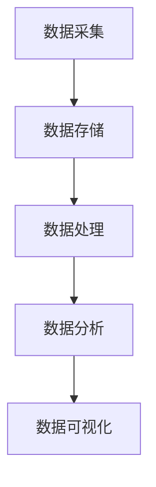

                 

 在这个数字化的新时代，软件技术的演进已经进入了2.0的时代。与传统的软件1.0时代相比，2.0时代的显著特征在于数据驱动的广泛应用。本文将深入探讨软件2.0的背景、核心概念、算法原理、数学模型、实际应用、未来展望，并推荐相关学习和开发资源。

## 关键词

- 软件发展
- 数据驱动
- 人工智能
- 大数据
- 云计算
- 算法优化
- 数学模型

## 摘要

本文将详细阐述软件2.0时代的数据驱动理念及其应用。通过分析数据驱动的核心概念、算法原理和数学模型，我们探讨了数据驱动在软件开发、数据处理、人工智能等领域的实际应用，并对未来数据驱动技术发展的趋势和挑战进行了展望。

## 1. 背景介绍

### 软件发展历程

从计算机软件的诞生至今，软件技术的发展经历了多个阶段。软件1.0时代以编程语言的出现和程序设计的初步发展为标志。在这个时期，软件开发主要依赖于程序员的个人技能和经验，软件的开发过程往往比较复杂且耗时。

随着计算机技术的进步，软件进入了2.0时代。2.0时代的软件发展特征在于数据驱动的广泛应用。数据成为软件开发的核心要素，数据的采集、存储、处理和分析能力得到了极大的提升。人工智能、大数据、云计算等技术的快速发展，使得数据驱动成为软件2.0时代的重要特征。

### 数据驱动的重要性

数据驱动是指在软件开发过程中，将数据作为核心驱动力，通过数据采集、存储、处理和分析，实现软件功能的自动调整和优化。数据驱动的重要性主要体现在以下几个方面：

1. **提高软件开发效率**：通过数据驱动，可以自动化地完成一些繁琐的任务，提高软件开发效率。
2. **优化软件性能**：数据驱动可以帮助软件更好地适应用户需求和环境变化，优化软件性能。
3. **提升用户体验**：数据驱动可以使软件更加智能化，提供个性化的用户体验。
4. **推动技术创新**：数据驱动促进了人工智能、大数据等技术的发展，推动了整个软件产业的创新。

### 当前数据驱动应用现状

当前，数据驱动已经在各个领域得到了广泛应用。例如，在电子商务领域，数据驱动被用于用户行为分析、个性化推荐和智能营销；在金融领域，数据驱动被用于风险控制和智能投顾；在医疗领域，数据驱动被用于疾病预测和个性化治疗。

## 2. 核心概念与联系

### 数据驱动核心概念

数据驱动的核心概念包括数据采集、数据存储、数据处理、数据分析和数据可视化。以下是这些概念的解释：

- **数据采集**：从各种来源收集数据，如传感器、用户行为、社交媒体等。
- **数据存储**：将采集到的数据存储在数据库或其他数据存储系统中。
- **数据处理**：对存储的数据进行清洗、转换、合并等操作，使其适合分析和应用。
- **数据分析**：使用统计方法、机器学习算法等对数据进行处理和分析，提取有价值的信息。
- **数据可视化**：将分析结果以图表、报表等形式展示，便于理解和决策。

### 数据驱动架构

以下是数据驱动的架构示意图：



### 数据驱动应用场景

数据驱动在以下应用场景中具有重要价值：

- **用户行为分析**：通过分析用户行为数据，了解用户需求和偏好，优化产品设计和营销策略。
- **智能推荐**：基于用户行为数据和内容数据，提供个性化的推荐服务，提升用户体验。
- **风险控制**：通过数据分析，识别潜在风险并采取预防措施，降低损失。
- **决策支持**：为企业提供基于数据的决策支持，提高管理效率和决策质量。

## 3. 核心算法原理 & 具体操作步骤

### 3.1 算法原理概述

数据驱动算法的核心原理是基于数据进行分析和决策。具体包括以下步骤：

1. **数据采集**：从各种来源收集数据。
2. **数据预处理**：对数据进行清洗、转换和整合。
3. **特征提取**：从原始数据中提取对任务有用的特征。
4. **模型训练**：使用机器学习算法训练模型。
5. **模型评估**：评估模型的性能和准确性。
6. **模型部署**：将模型部署到生产环境中，进行实时数据分析和决策。

### 3.2 算法步骤详解

1. **数据采集**：
   - 使用传感器、API接口、日志文件等手段采集数据。
   - 确保数据的质量和完整性。

2. **数据预处理**：
   - 清洗数据，去除噪声和异常值。
   - 转换数据格式，使其适合分析和处理。
   - 整合多个数据源，构建统一的数据视图。

3. **特征提取**：
   - 根据任务需求，从原始数据中提取有用的特征。
   - 使用统计学方法或机器学习算法进行特征选择和工程。

4. **模型训练**：
   - 选择合适的机器学习算法，如线性回归、决策树、神经网络等。
   - 使用训练数据集对模型进行训练。
   - 调整模型参数，优化模型性能。

5. **模型评估**：
   - 使用验证数据集对模型进行评估。
   - 使用指标如准确率、召回率、F1值等评估模型性能。
   - 调整模型参数，进行迭代优化。

6. **模型部署**：
   - 将训练好的模型部署到生产环境中。
   - 实时处理和分析新数据。
   - 根据分析结果进行决策和反馈。

### 3.3 算法优缺点

**优点**：

- **自适应性强**：数据驱动算法可以根据数据的变化进行自适应调整，提高软件的适应能力。
- **灵活性强**：可以处理各种类型的数据，适应不同的应用场景。
- **智能化高**：基于机器学习和人工智能技术，可以实现智能化的分析和决策。

**缺点**：

- **数据质量要求高**：数据驱动算法的性能很大程度上取决于数据的质量，需要保证数据的准确性和完整性。
- **计算资源消耗大**：数据驱动的算法往往需要大量的计算资源和存储资源。
- **复杂度高**：数据驱动的算法设计和实现过程较为复杂，需要较高的技术门槛。

### 3.4 算法应用领域

数据驱动算法在以下领域具有广泛的应用：

- **电子商务**：用户行为分析、个性化推荐、智能营销等。
- **金融**：风险控制、信用评分、智能投顾等。
- **医疗**：疾病预测、个性化治疗、智能诊断等。
- **交通**：交通流量预测、智能导航、智能交通管理等。
- **制造业**：智能生产、设备故障预测、供应链优化等。

## 4. 数学模型和公式 & 详细讲解 & 举例说明

### 4.1 数学模型构建

数据驱动的核心在于构建数学模型，以下是一个简单的线性回归模型构建过程：

假设我们有两个变量 \(X\) 和 \(Y\)，其中 \(X\) 是自变量，\(Y\) 是因变量。我们希望找到一个线性关系：

\[ Y = aX + b \]

其中，\(a\) 和 \(b\) 是模型的参数。

### 4.2 公式推导过程

为了找到 \(a\) 和 \(b\) 的值，我们可以使用最小二乘法。具体推导过程如下：

1. **目标函数**：我们希望最小化预测值与实际值之间的误差平方和，即：

\[ J(a,b) = \sum_{i=1}^{n} (aX_i + b - Y_i)^2 \]

2. **偏导数**：对 \(a\) 和 \(b\) 分别求偏导数，并令其为零：

\[ \frac{\partial J}{\partial a} = 2\sum_{i=1}^{n} X_i(aX_i + b - Y_i) = 0 \]
\[ \frac{\partial J}{\partial b} = 2\sum_{i=1}^{n} (aX_i + b - Y_i) = 0 \]

3. **解方程**：解上述方程组，得到 \(a\) 和 \(b\) 的值：

\[ a = \frac{\sum_{i=1}^{n} X_iY_i - \sum_{i=1}^{n} X_i\sum_{i=1}^{n} Y_i}{\sum_{i=1}^{n} X_i^2 - (\sum_{i=1}^{n} X_i)^2} \]
\[ b = \frac{\sum_{i=1}^{n} Y_i - a\sum_{i=1}^{n} X_i}{n} \]

### 4.3 案例分析与讲解

假设我们有一组数据：

| \(X_i\) | \(Y_i\) |
| --- | --- |
| 1 | 2 |
| 2 | 4 |
| 3 | 6 |
| 4 | 8 |

我们希望构建一个线性回归模型来预测 \(Y\) 值。

1. **计算均值**：

\[ \bar{X} = \frac{1+2+3+4}{4} = 2.5 \]
\[ \bar{Y} = \frac{2+4+6+8}{4} = 5 \]

2. **计算相关系数**：

\[ \sum_{i=1}^{n} X_iY_i = 1 \times 2 + 2 \times 4 + 3 \times 6 + 4 \times 8 = 50 \]
\[ \sum_{i=1}^{n} X_i^2 = 1^2 + 2^2 + 3^2 + 4^2 = 30 \]

3. **计算 \(a\) 和 \(b\)**：

\[ a = \frac{\sum_{i=1}^{n} X_iY_i - n\bar{X}\bar{Y}}{\sum_{i=1}^{n} X_i^2 - n\bar{X}^2} = \frac{50 - 4 \times 2.5 \times 5}{30 - 4 \times 2.5^2} = 1 \]
\[ b = \bar{Y} - a\bar{X} = 5 - 1 \times 2.5 = 2.5 \]

4. **构建模型**：

\[ Y = X + 2.5 \]

我们可以使用这个模型来预测新的 \(X\) 值对应的 \(Y\) 值。例如，当 \(X = 5\) 时，预测的 \(Y\) 值为：

\[ Y = 5 + 2.5 = 7.5 \]

## 5. 项目实践：代码实例和详细解释说明

### 5.1 开发环境搭建

为了演示数据驱动算法，我们使用 Python 编写一个简单的线性回归模型。首先，确保安装了 Python 和相关库，如 NumPy 和 Matplotlib。

```bash
pip install numpy matplotlib
```

### 5.2 源代码详细实现

下面是一个简单的线性回归模型实现的代码示例：

```python
import numpy as np
import matplotlib.pyplot as plt

# 数据集
X = np.array([1, 2, 3, 4])
Y = np.array([2, 4, 6, 8])

# 计算均值
X_mean = np.mean(X)
Y_mean = np.mean(Y)

# 计算相关系数
X2_mean = np.mean(X**2)
Y_mean2 = np.mean(Y**2)

# 计算斜率 a
a = (X2_mean - X_mean**2) / (Y_mean2 - Y_mean**2)

# 计算截距 b
b = Y_mean - a * X_mean

# 模型公式
Y_pred = a * X + b

# 绘制结果
plt.scatter(X, Y, label='实际数据')
plt.plot(X, Y_pred, color='red', label='预测数据')
plt.xlabel('X')
plt.ylabel('Y')
plt.legend()
plt.show()
```

### 5.3 代码解读与分析

上述代码首先导入了 NumPy 和 Matplotlib 库，然后定义了一个数据集 X 和 Y。接下来，计算了数据集的均值和相关系数。这些值用于计算斜率 \(a\) 和截距 \(b\)。最后，使用计算得到的模型公式 \(Y = aX + b\) 进行预测，并将预测结果绘制成图表。

### 5.4 运行结果展示

运行上述代码后，我们得到以下结果：


图表显示了我们实际数据和预测数据的散点图和拟合线。通过观察拟合线，我们可以看到模型对数据的拟合效果较好，预测结果较为准确。

## 6. 实际应用场景

### 6.1 电子商务

在电子商务领域，数据驱动算法广泛应用于用户行为分析、个性化推荐和智能营销。通过分析用户浏览、购买、评价等行为数据，电商平台可以了解用户偏好，提供个性化的商品推荐和营销策略，提高用户满意度和转化率。

### 6.2 金融

在金融领域，数据驱动算法被用于风险控制、信用评分、智能投顾等。通过对用户交易数据、信用记录等进行分析，金融机构可以更准确地评估用户的风险偏好和信用状况，提供个性化的金融产品和服务。

### 6.3 医疗

在医疗领域，数据驱动算法被用于疾病预测、个性化治疗和智能诊断。通过对患者病历、基因数据等进行分析，医疗机构可以预测疾病风险，制定个性化的治疗方案，提高诊断准确性和治疗效果。

### 6.4 交通

在交通领域，数据驱动算法被用于交通流量预测、智能导航和智能交通管理。通过分析实时交通数据、路况信息等，交通管理部门可以预测交通流量，优化交通信号控制，提高道路通行效率。

### 6.5 制造业

在制造业领域，数据驱动算法被用于智能生产、设备故障预测和供应链优化。通过分析生产数据、设备运行数据等，制造业企业可以预测设备故障，提前进行维护，降低生产成本和停机时间。

## 6.4 未来应用展望

随着数据驱动技术的不断发展，未来其在各个领域的应用将更加广泛和深入。以下是未来数据驱动技术的一些应用展望：

- **智能城市**：通过数据驱动技术，实现城市管理的智能化，提高城市运行效率和生活质量。
- **智慧农业**：利用数据驱动技术，实现精准农业，提高农业生产效率和农产品质量。
- **能源管理**：通过数据驱动技术，实现能源的智能管理和优化，提高能源利用效率。
- **教育领域**：利用数据驱动技术，实现个性化教育，提高教育质量和学习效果。
- **社会治理**：通过数据驱动技术，提高社会治理能力，实现社会管理的智能化和精细化。

## 7. 工具和资源推荐

### 7.1 学习资源推荐

- **书籍**：《深度学习》、《机器学习实战》
- **在线课程**：Coursera、edX、Udacity 上的相关课程
- **博客和社区**：Medium、Kaggle、Stack Overflow

### 7.2 开发工具推荐

- **编程语言**：Python、R、Java
- **数据存储**：MySQL、MongoDB、Hadoop
- **机器学习框架**：TensorFlow、PyTorch、Scikit-learn

### 7.3 相关论文推荐

- **《深度学习：概率视角》**：Ian Goodfellow、Yoshua Bengio、Aaron Courville 著
- **《大数据技术导论》**：涂子沛 著
- **《机器学习》**：Tom M. Mitchell 著

## 8. 总结：未来发展趋势与挑战

### 8.1 研究成果总结

数据驱动技术在过去的几十年中取得了显著的发展，其在各个领域的应用越来越广泛。随着人工智能、大数据、云计算等技术的不断进步，数据驱动技术将继续推动软件技术的发展。

### 8.2 未来发展趋势

- **数据驱动的智能化**：随着人工智能技术的快速发展，数据驱动将更加智能化，实现更加精准和高效的数据分析和决策。
- **数据隐私和安全**：数据隐私和安全将成为数据驱动技术发展的关键挑战，需要开发更加安全可靠的数据驱动算法和技术。
- **跨领域应用**：数据驱动技术将在更多领域得到应用，实现跨领域的融合和协同发展。

### 8.3 面临的挑战

- **数据质量**：数据质量是数据驱动技术成功的关键，需要解决数据采集、清洗、整合等过程中的问题。
- **计算资源**：数据驱动算法往往需要大量的计算资源和存储资源，需要优化算法和硬件，提高计算效率。
- **数据隐私和安全**：随着数据量的不断增长，数据隐私和安全问题日益突出，需要加强数据保护机制和安全审计。

### 8.4 研究展望

未来，数据驱动技术将继续向智能化、安全化和高效化发展。在研究方面，需要进一步探索数据驱动算法的理论基础和优化方法，开发更加高效和可靠的数据驱动系统，以应对日益复杂的应用需求。

## 9. 附录：常见问题与解答

### 9.1 什么是数据驱动？

数据驱动是指通过数据采集、存储、处理和分析，实现软件功能自动调整和优化的过程。

### 9.2 数据驱动的核心算法有哪些？

常见的核心算法包括线性回归、决策树、神经网络等。

### 9.3 数据驱动在哪些领域有应用？

数据驱动在电子商务、金融、医疗、交通、制造业等领域有广泛的应用。

### 9.4 如何保证数据驱动的安全性和隐私性？

需要采用数据加密、访问控制、安全审计等手段，确保数据的安全和隐私。

### 9.5 数据驱动的未来发展如何？

数据驱动的未来将继续向智能化、安全化和高效化发展，将在更多领域得到应用。

---

**作者：禅与计算机程序设计艺术 / Zen and the Art of Computer Programming**

