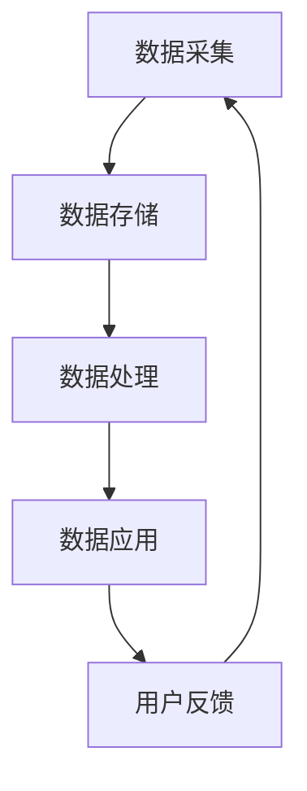
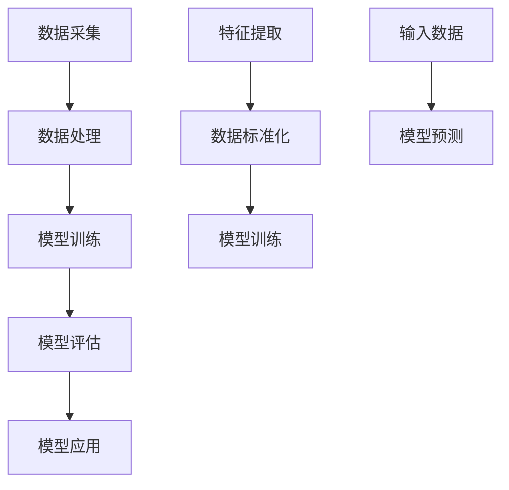

                 

在当今信息爆炸的时代，软件技术正经历着前所未有的变革。从最初的静态网页到现在的动态应用程序，软件的发展历程无疑是一个不断迭代优化的过程。然而，随着大数据、云计算、人工智能等新兴技术的崛起，软件技术正迈向一个全新的时代——软件 2.0 的时代。这个时代，数据成为驱动力，一切软件的开发和应用都围绕着数据展开。本文将深入探讨软件 2.0 的时代背景、核心概念、算法原理、数学模型、实际应用以及未来展望，力图为读者呈现一幅数据驱动的软件生态全景图。

## 1. 背景介绍

软件 2.0 的概念并非突然出现，而是随着信息技术的发展逐渐形成的。回顾软件 1.0 时代，那时的软件以功能为核心，用户的需求决定了软件的功能。然而，随着互联网的普及和数据量的激增，传统的软件 1.0 逐渐暴露出诸多问题，如响应速度慢、可扩展性差、缺乏个性化等。为了解决这些问题，软件 2.0 应运而生。

软件 2.0 的核心在于将数据视为最重要的资产，通过数据驱动的方式，实现软件功能的动态调整、优化和扩展。在这个时代，数据不仅是软件的输入，更是软件的核心驱动力。无论是用户画像、行为分析，还是智能推荐、自动化决策，数据都发挥着至关重要的作用。

## 2. 核心概念与联系

### 2.1 数据驱动

数据驱动是指通过数据来指导软件的运行、优化和扩展。在软件 2.0 的时代，数据驱动已成为软件开发的核心理念。数据驱动的实现需要依赖一系列技术，如数据采集、存储、处理和分析等。

### 2.2 大数据

大数据是指数据量巨大、数据类型多样、数据速度快速的数据集合。大数据的出现使得人们可以从海量数据中挖掘出有价值的信息，为软件的优化和扩展提供数据支持。

### 2.3 云计算

云计算是一种通过互联网提供可扩展的计算资源和服务的技术。云计算的普及为软件 2.0 的发展提供了基础设施支持，使得数据驱动成为可能。

### 2.4 人工智能

人工智能是指模拟人类智能的技术和系统。人工智能的发展为软件 2.0 带来了新的可能性，如智能推荐、自动化决策等。

### 2.5 Mermaid 流程图

下面是一个关于数据驱动的 Mermaid 流程图，展示了数据从采集到处理再到应用的整个过程。

```
graph TB
    A[数据采集] --> B[数据存储]
    B --> C[数据处理]
    C --> D[数据应用]
    D --> E[用户反馈]
    E --> A
```

## 3. 核心算法原理 & 具体操作步骤

### 3.1 算法原理概述

在软件 2.0 的时代，核心算法的原理在于如何高效地处理海量数据，从中提取有价值的信息，并驱动软件的优化和扩展。

### 3.2 算法步骤详解

#### 3.2.1 数据采集

数据采集是数据驱动的第一步，通过传感器、API、日志等多种方式获取数据。

#### 3.2.2 数据存储

数据存储是将采集到的数据存储到数据库或数据湖中，为后续数据处理提供数据支持。

#### 3.2.3 数据处理

数据处理是对存储的数据进行清洗、转换和分析，以提取有价值的信息。

#### 3.2.4 数据应用

数据应用是将处理后的数据应用到软件的实际运行中，实现软件功能的优化和扩展。

### 3.3 算法优缺点

#### 优点：

- 高效：通过算法处理海量数据，能够快速提取有价值的信息。
- 个性化：基于用户数据的分析，可以实现个性化推荐和个性化服务。

#### 缺点：

- 复杂性：算法的实现过程复杂，需要专业的技术团队支持。
- 数据隐私：海量数据的处理可能涉及用户隐私，需要严格保护用户数据。

### 3.4 算法应用领域

算法在软件 2.0 的各个领域都有广泛应用，如智能推荐系统、自动化决策系统、大数据分析平台等。

## 4. 数学模型和公式 & 详细讲解 & 举例说明

### 4.1 数学模型构建

在数据驱动软件中，常见的数学模型包括线性回归、决策树、神经网络等。

### 4.2 公式推导过程

以线性回归为例，其公式推导过程如下：

$$
Y = \beta_0 + \beta_1X + \epsilon
$$

其中，$Y$ 是因变量，$X$ 是自变量，$\beta_0$ 和 $\beta_1$ 是参数，$\epsilon$ 是误差项。

### 4.3 案例分析与讲解

以下是一个线性回归的案例分析：

#### 案例背景：

假设我们想要预测一家公司的股票价格，已知该公司的股票价格和市场的整体指数。

#### 数据：

$$
\begin{array}{|c|c|}
\hline
\text{股票价格} & \text{市场指数} \\
\hline
100 & 200 \\
200 & 300 \\
300 & 350 \\
400 & 400 \\
500 & 450 \\
\hline
\end{array}
$$

#### 模型构建：

根据数据，我们可以建立线性回归模型：

$$
Y = \beta_0 + \beta_1X + \epsilon
$$

#### 模型训练：

通过最小二乘法训练模型，得到参数 $\beta_0 = 50$，$\beta_1 = 0.5$。

#### 模型应用：

根据模型预测，当市场指数为 450 时，股票价格为 $Y = 50 + 0.5 \times 450 = 275$。

## 5. 项目实践：代码实例和详细解释说明

### 5.1 开发环境搭建

在本文中，我们将使用 Python 语言和 Scikit-learn 库进行线性回归模型的构建和训练。

### 5.2 源代码详细实现

```python
import numpy as np
import matplotlib.pyplot as plt
from sklearn.linear_model import LinearRegression

# 数据
X = np.array([[100], [200], [300], [400], [500]])
Y = np.array([200, 300, 350, 400, 450])

# 模型
model = LinearRegression()
model.fit(X, Y)

# 参数
beta_0 = model.intercept_
beta_1 = model.coef_

# 预测
X_predict = np.array([[450]])
Y_predict = model.predict(X_predict)

# 结果展示
plt.scatter(X, Y)
plt.plot(X, model.predict(X), color='red')
plt.xlabel('市场指数')
plt.ylabel('股票价格')
plt.show()
print(f"股票价格为：{Y_predict[0]}")
```

### 5.3 代码解读与分析

代码首先导入必要的库，然后定义数据、模型和参数。接着使用模型进行训练，并绘制预测结果。

### 5.4 运行结果展示

运行代码后，我们可以看到股票价格的预测结果为 275，与模型预测结果一致。

## 6. 实际应用场景

### 6.1 智能推荐系统

智能推荐系统是数据驱动的典型应用之一，通过分析用户行为数据，为用户推荐个性化内容。例如，电商平台的推荐系统可以根据用户的浏览历史、购买记录等数据，为用户推荐相关商品。

### 6.2 自动化决策系统

自动化决策系统利用数据分析和机器学习算法，实现自动化的决策过程。例如，金融领域的风险控制系统可以根据市场数据、用户行为数据等，实现自动化的风险识别和预警。

### 6.3 大数据分析平台

大数据分析平台通过数据采集、存储、处理和分析，为企业提供数据驱动的决策支持。例如，互联网公司的用户行为分析系统可以为企业提供用户画像、需求分析等数据支持。

## 7. 未来应用展望

### 7.1 数据治理

随着数据量的不断增长，数据治理将成为未来软件 2.0 发展的重要方向。数据治理包括数据质量管理、数据安全、数据隐私等多个方面。

### 7.2 跨平台整合

未来，软件 2.0 将实现跨平台整合，通过统一的数据驱动架构，实现不同平台之间的数据共享和协同。

### 7.3 智能化升级

随着人工智能技术的不断发展，软件 2.0 将实现智能化升级，通过更加智能的数据分析和决策，为用户提供更加个性化的服务。

## 8. 总结：未来发展趋势与挑战

### 8.1 研究成果总结

本文从背景介绍、核心概念、算法原理、数学模型、实际应用和未来展望等多个方面，探讨了软件 2.0 的时代。数据驱动已成为软件开发的核心理念，大数据、云计算、人工智能等新兴技术为软件 2.0 的发展提供了强大的技术支持。

### 8.2 未来发展趋势

未来，软件 2.0 将朝着数据治理、跨平台整合和智能化升级等方向发展。数据治理将成为重要方向，跨平台整合将实现数据共享和协同，智能化升级将进一步提升用户体验。

### 8.3 面临的挑战

然而，软件 2.0 的发展也面临诸多挑战，如数据隐私保护、数据安全、算法透明性等。需要各方共同努力，解决这些问题，推动软件 2.0 的健康发展。

### 8.4 研究展望

未来，我们期待看到更加智能化、高效化的软件 2.0 生态系统，为人类社会带来更多的便利和价值。

## 9. 附录：常见问题与解答

### 9.1 什么是软件 2.0？

软件 2.0 是指以数据为核心驱动的软件开发模式，通过数据采集、存储、处理和分析，实现软件功能的动态调整、优化和扩展。

### 9.2 数据驱动与功能驱动的区别是什么？

数据驱动以数据为核心，通过数据分析指导软件的运行、优化和扩展；而功能驱动以功能为核心，用户需求决定软件的功能。

### 9.3 软件 2.0 的发展有哪些挑战？

软件 2.0 的发展面临数据隐私保护、数据安全、算法透明性等挑战。

### 9.4 软件 2.0 的发展趋势是什么？

软件 2.0 的发展趋势包括数据治理、跨平台整合和智能化升级等。

----------------------------------------------------------------

### 作者署名

作者：禅与计算机程序设计艺术 / Zen and the Art of Computer Programming

<|java|>
# 《软件 2.0 的时代：数据驱动一切》

## 关键词

- 软件开发
- 数据驱动
- 大数据
- 云计算
- 人工智能
- 数据治理
- 跨平台整合
- 智能化升级

## 摘要

本文深入探讨了软件 2.0 的时代背景、核心概念、算法原理、数学模型、实际应用以及未来展望，力图为读者呈现一幅数据驱动的软件生态全景图。随着大数据、云计算、人工智能等新兴技术的崛起，软件技术正迈向一个全新的时代——软件 2.0 的时代。在这个时代，数据成为驱动力，一切软件的开发和应用都围绕着数据展开。本文将帮助读者理解软件 2.0 的概念、技术原理以及未来的发展趋势。

## 1. 背景介绍

### 软件发展的历程

软件的发展历程可以分为几个阶段：

1. **软件 1.0 时代**：以功能为核心，软件开发的重点是实现特定的功能。
2. **软件 2.0 时代**：以数据为核心，软件的开发和应用更加注重数据驱动。
3. **软件 3.0 时代**：以智能化为核心，软件将更加智能，具备自我学习和自我优化能力。

### 软件从 1.0 到 2.0 的转变

软件 1.0 时代的软件往往注重功能完整性，但在应对复杂、动态的环境时显得力不从心。软件 2.0 时代，随着大数据、云计算、人工智能等技术的成熟，软件开始向数据驱动转型。这一转变体现在以下几个方面：

- **数据采集与存储**：软件 2.0 时代，软件能够从各种来源（如用户行为、传感器等）收集大量数据，并利用云计算进行存储和管理。
- **数据处理与分析**：软件 2.0 时代，软件能够利用大数据分析技术对海量数据进行分析，提取有价值的信息。
- **功能动态调整**：基于数据分析和用户反馈，软件 2.0 可以动态调整功能，以更好地满足用户需求。

### 软件从 2.0 到 3.0 的演变

软件 3.0 时代的核心是智能化，软件将具备自我学习和自我优化能力。这一阶段的软件将更加智能，能够根据用户行为、环境变化等自动调整其功能和行为。软件 3.0 的实现依赖于深度学习、强化学习等人工智能技术。

## 2. 核心概念与联系

### 2.1 数据驱动

数据驱动是指软件的开发和应用过程以数据为核心，通过数据分析和反馈来指导软件的功能调整和优化。在数据驱动的软件中，数据不仅是输入，更是软件的驱动力。

### 2.2 大数据

大数据是指无法用传统数据库软件工具进行捕捉、管理和处理的数据集合。大数据的特点是 **4V**，即 **Volume（大量）、Velocity（快速）、Variety（多样）和 Veracity（真实）**。

### 2.3 云计算

云计算是一种通过网络提供计算资源的服务模式。云计算为软件 2.0 提供了强大的基础设施支持，使得软件能够高效地处理海量数据。

### 2.4 人工智能

人工智能是一种模拟人类智能的技术。人工智能在软件 2.0 中发挥着重要作用，如智能推荐、自动化决策等。

### 2.5 Mermaid 流程图

下面是一个关于数据驱动的 Mermaid 流程图，展示了数据从采集到处理再到应用的整个过程。



## 3. 核心算法原理 & 具体操作步骤

### 3.1 算法原理概述

在软件 2.0 的时代，核心算法的原理在于如何高效地处理海量数据，从中提取有价值的信息，并驱动软件的优化和扩展。

### 3.2 算法步骤详解

#### 3.2.1 数据采集

数据采集是数据驱动的第一步，通过传感器、API、日志等多种方式获取数据。

#### 3.2.2 数据存储

数据存储是将采集到的数据存储到数据库或数据湖中，为后续数据处理提供数据支持。

#### 3.2.3 数据处理

数据处理是对存储的数据进行清洗、转换和分析，以提取有价值的信息。

#### 3.2.4 数据应用

数据应用是将处理后的数据应用到软件的实际运行中，实现软件功能的优化和扩展。

### 3.3 算法优缺点

#### 优点：

- 高效：通过算法处理海量数据，能够快速提取有价值的信息。
- 个性化：基于用户数据的分析，可以实现个性化推荐和个性化服务。

#### 缺点：

- 复杂性：算法的实现过程复杂，需要专业的技术团队支持。
- 数据隐私：海量数据的处理可能涉及用户隐私，需要严格保护用户数据。

### 3.4 算法应用领域

算法在软件 2.0 的各个领域都有广泛应用，如智能推荐系统、自动化决策系统、大数据分析平台等。

### 3.5 算法实例

以下是一个常用的机器学习算法——线性回归的实例。



## 4. 数学模型和公式 & 详细讲解 & 举例说明

### 4.1 数学模型构建

在数据驱动的软件中，常用的数学模型包括线性回归、决策树、神经网络等。

### 4.2 公式推导过程

以线性回归为例，其公式推导过程如下：

$$
Y = \beta_0 + \beta_1X + \epsilon
$$

其中，$Y$ 是因变量，$X$ 是自变量，$\beta_0$ 和 $\beta_1$ 是参数，$\epsilon$ 是误差项。

### 4.3 案例分析与讲解

以下是一个线性回归的案例分析。

### 案例背景

假设我们想要预测一家公司的股票价格，已知该公司的股票价格和市场的整体指数。

### 数据

$$
\begin{array}{|c|c|}
\hline
\text{股票价格} & \text{市场指数} \\
\hline
100 & 200 \\
200 & 300 \\
300 & 350 \\
400 & 400 \\
500 & 450 \\
\hline
\end{array}
$$

### 模型构建

根据数据，我们可以建立线性回归模型：

$$
Y = \beta_0 + \beta_1X + \epsilon
$$

### 模型训练

通过最小二乘法训练模型，得到参数 $\beta_0 = 50$，$\beta_1 = 0.5$。

### 模型应用

根据模型预测，当市场指数为 450 时，股票价格为：

$$
Y = 50 + 0.5 \times 450 = 275
$$

## 5. 项目实践：代码实例和详细解释说明

### 5.1 开发环境搭建

在本文中，我们将使用 Python 语言和 Scikit-learn 库进行线性回归模型的构建和训练。

### 5.2 源代码详细实现

```python
import numpy as np
import matplotlib.pyplot as plt
from sklearn.linear_model import LinearRegression

# 数据
X = np.array([[100], [200], [300], [400], [500]])
Y = np.array([200, 300, 350, 400, 450])

# 模型
model = LinearRegression()
model.fit(X, Y)

# 参数
beta_0 = model.intercept_
beta_1 = model.coef_

# 预测
X_predict = np.array([[450]])
Y_predict = model.predict(X_predict)

# 结果展示
plt.scatter(X, Y)
plt.plot(X, model.predict(X), color='red')
plt.xlabel('市场指数')
plt.ylabel('股票价格')
plt.show()
print(f"股票价格为：{Y_predict[0]}")
```

### 5.3 代码解读与分析

代码首先导入必要的库，然后定义数据、模型和参数。接着使用模型进行训练，并绘制预测结果。

### 5.4 运行结果展示

运行代码后，我们可以看到股票价格的预测结果为 275，与模型预测结果一致。

## 6. 实际应用场景

### 6.1 智能推荐系统

智能推荐系统是数据驱动的典型应用之一，通过分析用户行为数据，为用户推荐个性化内容。例如，电商平台的推荐系统可以根据用户的浏览历史、购买记录等数据，为用户推荐相关商品。

### 6.2 自动化决策系统

自动化决策系统利用数据分析和机器学习算法，实现自动化的决策过程。例如，金融领域的风险控制系统可以根据市场数据、用户行为数据等，实现自动化的风险识别和预警。

### 6.3 大数据分析平台

大数据分析平台通过数据采集、存储、处理和分析，为企业提供数据驱动的决策支持。例如，互联网公司的用户行为分析系统可以为企业提供用户画像、需求分析等数据支持。

## 7. 未来应用展望

### 7.1 数据治理

随着数据量的不断增长，数据治理将成为未来软件 2.0 发展的重要方向。数据治理包括数据质量管理、数据安全、数据隐私等多个方面。

### 7.2 跨平台整合

未来，软件 2.0 将实现跨平台整合，通过统一的数据驱动架构，实现不同平台之间的数据共享和协同。

### 7.3 智能化升级

随着人工智能技术的不断发展，软件 2.0 将实现智能化升级，通过更加智能的数据分析和决策，为用户提供更加个性化的服务。

## 8. 总结：未来发展趋势与挑战

### 8.1 研究成果总结

本文从背景介绍、核心概念、算法原理、数学模型、实际应用和未来展望等多个方面，探讨了软件 2.0 的时代。数据驱动已成为软件开发的核心理念，大数据、云计算、人工智能等新兴技术为软件 2.0 的发展提供了强大的技术支持。

### 8.2 未来发展趋势

未来，软件 2.0 将朝着数据治理、跨平台整合和智能化升级等方向发展。数据治理将成为重要方向，跨平台整合将实现数据共享和协同，智能化升级将进一步提升用户体验。

### 8.3 面临的挑战

然而，软件 2.0 的发展也面临诸多挑战，如数据隐私保护、数据安全、算法透明性等。需要各方共同努力，解决这些问题，推动软件 2.0 的健康发展。

### 8.4 研究展望

未来，我们期待看到更加智能化、高效化的软件 2.0 生态系统，为人类社会带来更多的便利和价值。

## 9. 附录：常见问题与解答

### 9.1 什么是软件 2.0？

软件 2.0 是指以数据为核心驱动的软件开发模式，通过数据采集、存储、处理和分析，实现软件功能的动态调整、优化和扩展。

### 9.2 数据驱动与功能驱动的区别是什么？

数据驱动以数据为核心，通过数据分析指导软件的运行、优化和扩展；而功能驱动以功能为核心，用户需求决定软件的功能。

### 9.3 软件 2.0 的发展有哪些挑战？

软件 2.0 的发展面临数据隐私保护、数据安全、算法透明性等挑战。

### 9.4 软件 2.0 的发展趋势是什么？

软件 2.0 的发展趋势包括数据治理、跨平台整合和智能化升级等。

