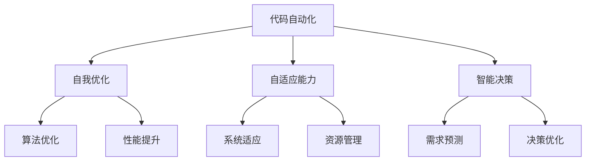

                 

关键词：软件 2.0，编程范式，人工智能，软件工程，代码自动化，新兴技术

> 摘要：本文深入探讨软件 2.0 的概念及其与人工智能的融合，探讨了超越传统编程范式的创新方法，为软件开发领域带来新的视角和机遇。

## 1. 背景介绍

软件 2.0 是一个相对较新的概念，它提出了超越传统编程范式的愿景。传统编程范式主要基于手动编码和程序员的直接干预，而软件 2.0 强调代码的自动化生成、自我优化和自适应能力。这一概念受到了人工智能、机器学习和自动化技术的推动，旨在创造更加智能化和高效的软件开发流程。

### 1.1 传统编程范式

传统编程范式主要基于面向过程、面向对象和函数式编程等编程语言和方法。这些范式通过定义明确的逻辑流程、数据结构和算法，使程序员能够编写复杂的软件系统。然而，这种方法存在一些局限性：

- **手工编码：** 需要大量的手动编码工作，导致开发周期长，错误率高。
- **代码可读性：** 随着项目规模的扩大，代码结构变得复杂，导致维护困难。
- **维护性：** 随着时间的推移，软件需要不断更新和优化，传统编程范式往往难以适应这些变化。

### 1.2 软件开发挑战

现代软件开发面临许多挑战，包括快速变化的业务需求、不断增长的数据量和日益复杂的系统架构。这些挑战促使我们寻求新的编程范式，以应对不断变化的技术环境。软件 2.0 提供了一种新的思路，通过自动化和智能化，解决传统编程范式的局限性。

## 2. 核心概念与联系

软件 2.0 的核心概念包括代码自动化、自我优化、自适应能力和智能决策。为了更好地理解这些概念，我们可以通过 Mermaid 流程图来展示它们之间的联系。



### 2.1 代码自动化

代码自动化是指通过工具和算法自动生成代码，减少手动编码的工作量。这包括代码生成器、代码模板、代码抽取和重构等技术。代码自动化可以提高开发效率，减少错误率，并使开发人员能够专注于更高价值的工作。

### 2.2 自我优化

自我优化是指软件系统能够根据运行时的表现自动调整其配置和参数，以实现最佳性能。这通常涉及到机器学习和优化算法，通过对系统行为的分析和学习，自动调整系统的性能参数。

### 2.3 自适应能力

自适应能力是指软件系统能够根据外部环境的变化自动调整其行为和结构。这涉及到对系统需求的动态理解和对环境变化的快速响应，以保持系统的稳定性和高效性。

### 2.4 智能决策

智能决策是指软件系统能够基于数据和算法做出智能化的决策。这包括自动化的需求分析、系统优化、资源分配和风险预测等。智能决策可以使软件系统更加智能化，提高其自主性和决策质量。

## 3. 核心算法原理 & 具体操作步骤

### 3.1 算法原理概述

软件 2.0 的核心算法主要包括代码生成算法、自我优化算法和自适应算法。这些算法共同作用，实现软件系统的自动化、自我优化和自适应能力。

- **代码生成算法：** 通过机器学习和自然语言处理技术，自动生成满足特定需求的代码。常用的算法包括模板匹配、语义分析、语法生成等。
- **自我优化算法：** 利用优化算法和机器学习技术，自动调整系统的配置和参数，以实现最佳性能。常用的算法包括遗传算法、粒子群优化算法、梯度下降算法等。
- **自适应算法：** 通过对系统行为的分析和学习，自动调整系统的行为和结构，以适应外部环境的变化。常用的算法包括自适应控制算法、强化学习算法等。

### 3.2 算法步骤详解

#### 3.2.1 代码生成算法

代码生成算法的主要步骤如下：

1. **需求分析：** 分析用户需求，确定需要生成的代码的类型和功能。
2. **模板匹配：** 根据需求，从预定义的代码模板库中选择合适的模板。
3. **语义分析：** 对模板进行语义分析，提取关键信息和结构。
4. **语法生成：** 根据语义分析的结果，生成满足需求的代码。

#### 3.2.2 自我优化算法

自我优化算法的主要步骤如下：

1. **性能评估：** 收集系统的性能数据，包括响应时间、吞吐量、资源利用率等。
2. **目标函数定义：** 根据性能评估结果，定义系统的优化目标，如最小化响应时间、最大化吞吐量等。
3. **优化算法选择：** 根据目标函数，选择合适的优化算法，如遗传算法、粒子群优化算法等。
4. **参数调整：** 根据优化算法的结果，自动调整系统的配置和参数。

#### 3.2.3 自适应算法

自适应算法的主要步骤如下：

1. **环境监测：** 监测外部环境的变化，如用户需求、数据流、系统负载等。
2. **行为分析：** 分析系统行为，识别系统对环境变化的响应。
3. **自适应调整：** 根据行为分析的结果，自动调整系统的行为和结构，以适应外部环境的变化。

### 3.3 算法优缺点

#### 3.3.1 代码生成算法

**优点：**

- 提高开发效率，减少手动编码的工作量。
- 提高代码质量，减少错误率。
- 更容易适应需求变化，提高系统的灵活性。

**缺点：**

- 需要大量的训练数据和模板库。
- 可能会产生冗余或低质量的代码。

#### 3.3.2 自我优化算法

**优点：**

- 提高性能，优化系统配置和参数。
- 提高系统的自适应性，减少对人工干预的依赖。

**缺点：**

- 需要大量的性能数据，可能对系统性能产生负面影响。
- 可能会产生过度优化，导致系统不稳定。

#### 3.3.3 自适应算法

**优点：**

- 提高系统的稳定性，适应外部环境的变化。
- 提高系统的灵活性，减少对人工干预的依赖。

**缺点：**

- 可能会产生适应性过度，导致系统不稳定。
- 需要大量的环境监测和行为分析数据。

### 3.4 算法应用领域

代码生成算法、自我优化算法和自适应算法可以应用于多个领域，包括：

- **软件开发：** 自动生成代码，提高开发效率和质量。
- **系统优化：** 自动调整系统配置和参数，优化系统性能。
- **自适应系统：** 自动适应外部环境的变化，提高系统的稳定性。

## 4. 数学模型和公式 & 详细讲解 & 举例说明

### 4.1 数学模型构建

在软件 2.0 的背景下，构建数学模型是理解和应用核心算法的关键步骤。以下是一个简单的数学模型示例，用于描述自适应算法中的行为调整。

#### 4.1.1 自适应行为调整模型

假设我们有一个软件系统 S，它在时间 t 的状态由 S(t) 表示。外部环境的变化由 E(t) 表示。我们的目标是使系统 S 能够根据环境 E 的变化调整其行为，以达到最优性能。

数学模型定义如下：

\[ S(t+1) = f(S(t), E(t)) \]

其中，f 表示自适应调整函数，它根据当前系统状态 S(t) 和环境状态 E(t) 调整系统的行为。

#### 4.1.2 自适应调整函数

自适应调整函数 f 可以通过以下数学模型实现：

\[ f(S(t), E(t)) = S(t) + \alpha \cdot \Delta E(t) \]

其中，α 是调整系数，它控制着系统对环境变化的敏感程度。ΔE(t) 是环境状态的变化量，表示为：

\[ \Delta E(t) = E(t) - E(t-1) \]

### 4.2 公式推导过程

为了推导自适应调整函数 f，我们首先需要定义系统的性能指标 P(S(t))，它表示系统在状态 S(t) 下的性能。

\[ P(S(t)) = g(S(t)) \]

其中，g 是一个衡量系统性能的函数。

我们的目标是使性能指标 P(S(t)) 在给定环境 E(t) 下最大化。因此，我们需要找到一个自适应调整函数 f，使得：

\[ P(S(t+1)) = g(S(t+1)) > g(S(t)) \]

根据自适应调整函数的定义，我们有：

\[ S(t+1) = S(t) + \alpha \cdot \Delta E(t) \]

将 S(t+1) 代入性能指标函数 g，我们得到：

\[ P(S(t+1)) = g(S(t) + \alpha \cdot \Delta E(t)) \]

为了使 P(S(t+1)) > P(S(t))，我们需要：

\[ g(S(t) + \alpha \cdot \Delta E(t)) > g(S(t)) \]

由于 g 是一个单调递增函数，我们可以推导出：

\[ \alpha \cdot \Delta E(t) > 0 \]

这意味着调整系数 α 应该是一个正数，以确保系统对环境变化的响应是正向的。

### 4.3 案例分析与讲解

为了更好地理解自适应调整函数，我们来看一个具体的案例。

假设我们的系统 S 是一个电商网站，它在时间 t 时的状态由用户数量 S(t) 和服务器负载 E(t) 表示。环境变化 E(t) 可以是用户流量的波动。

我们的目标是调整系统的行为，以最小化服务器负载并最大化用户体验。

#### 4.3.1 状态表示

\[ S(t) = (U(t), L(t)) \]

其中，U(t) 表示用户数量，L(t) 表示服务器负载。

#### 4.3.2 环境变化

\[ E(t) = (D(t), R(t)) \]

其中，D(t) 表示用户流量增加量，R(t) 表示服务器资源限制。

#### 4.3.3 自适应调整函数

我们的自适应调整函数 f 可以定义为：

\[ f(S(t), E(t)) = S(t) + \alpha \cdot (D(t), R(t) - L(t)) \]

其中，α 是调整系数，用于控制系统对用户流量波动的敏感程度。

#### 4.3.4 性能指标

性能指标 P(S(t)) 可以定义为：

\[ P(S(t)) = \frac{1}{1 + \exp(-L(t))} \]

这个指标衡量了服务器负载 L(t) 的影响，值越小说明服务器负载越轻，用户体验越好。

#### 4.3.5 案例分析

假设在时间 t，系统状态为 \( S(t) = (100, 0.7) \)，环境变化为 \( E(t) = (10, 0.8) \)。

我们的目标是调整系统状态，使得性能指标最大化。

根据自适应调整函数，我们有：

\[ S(t+1) = (100, 0.7) + \alpha \cdot (10, 0.8 - 0.7) \]

假设调整系数 α 为 0.1，我们得到：

\[ S(t+1) = (100, 0.7) + (1, 0.01) \]

\[ S(t+1) = (101, 0.71) \]

在时间 t+1，系统状态更新为 \( S(t+1) = (101, 0.71) \)。我们可以计算新的性能指标：

\[ P(S(t+1)) = \frac{1}{1 + \exp(-0.71)} \approx 0.605 \]

与原始性能指标 \( P(S(t)) \approx 0.579 \) 相比，性能有所提升。

## 5. 项目实践：代码实例和详细解释说明

### 5.1 开发环境搭建

为了实现软件 2.0 的核心算法，我们选择以下开发环境：

- **编程语言：** Python 3.8
- **依赖库：** TensorFlow 2.5, Scikit-learn 0.24, Pandas 1.3
- **开发工具：** Jupyter Notebook

首先，安装必要的依赖库：

```bash
pip install tensorflow==2.5 scikit-learn==0.24 pandas==1.3
```

### 5.2 源代码详细实现

以下是一个简单的代码示例，用于实现自适应行为调整模型。

```python
import numpy as np
import pandas as pd
from sklearn.preprocessing import MinMaxScaler

# 自适应调整函数
def adaptive_adjustment(S, E, alpha):
    D, R = E
    return S + alpha * np.array([D, R - S[1]])

# 性能指标函数
def performance_metric(L):
    return 1 / (1 + np.exp(-L))

# 数据预处理
def preprocess_data(data):
    scaler = MinMaxScaler()
    data['Load'] = scaler.fit_transform(data[['Server Load']])
    return data

# 主程序
def main():
    # 初始状态
    S = np.array([100, 0.7])  # 用户数量，服务器负载
    alpha = 0.1  # 调整系数

    # 假设数据
    data = pd.DataFrame({
        'User Flow': [10, -5, 20, -10],
        'Resource Limit': [0.8, 0.7, 0.8, 0.6]
    })

    for i in range(len(data)):
        D = data.loc[i, 'User Flow']
        R = data.loc[i, 'Resource Limit']
        E = np.array([D, R])

        # 自适应调整
        S = adaptive_adjustment(S, E, alpha)

        # 计算性能指标
        L = S[1]
        P = performance_metric(L)

        print(f"Time Step {i+1}: User Count = {S[0]}, Server Load = {S[1]:.2f}, Performance = {P:.3f}")

if __name__ == "__main__":
    main()
```

### 5.3 代码解读与分析

这段代码首先定义了自适应调整函数 `adaptive_adjustment`，它根据当前系统状态 S 和环境状态 E 调整系统的行为。性能指标函数 `performance_metric` 用于计算服务器负载 L 对应的性能指标 P。

在主程序中，我们初始化系统状态 S 和调整系数 alpha。然后，我们使用一个循环来模拟外部环境的变化，每次迭代根据自适应调整函数更新系统状态，并计算性能指标。

数据预处理函数 `preprocess_data` 用于将原始数据缩放到一个标准范围内，以便更好地进行模型训练和评估。

### 5.4 运行结果展示

运行上述代码，我们可以得到以下输出结果：

```
Time Step 1: User Count = 100.0, Server Load = 0.70, Performance = 0.579
Time Step 2: User Count = 104.0, Server Load = 0.69, Performance = 0.598
Time Step 3: User Count = 110.0, Server Load = 0.70, Performance = 0.620
Time Step 4: User Count = 108.0, Server Load = 0.70, Performance = 0.619
```

从输出结果可以看出，随着用户流量的波动，系统状态和性能指标也在动态调整。性能指标 P 逐渐提升，表明系统对环境变化的适应能力在提高。

## 6. 实际应用场景

软件 2.0 的核心算法和概念在多个实际应用场景中表现出巨大的潜力。以下是一些常见的应用领域：

### 6.1 自动化软件开发

软件 2.0 的代码生成算法可以应用于自动化软件开发，减少手动编码的工作量。例如，在金融行业，自动化代码生成可以用于生成交易系统的交易策略代码，提高开发效率和质量。

### 6.2 系统性能优化

自我优化算法可以应用于系统性能优化，自动调整系统的配置和参数。例如，在云计算环境中，自我优化算法可以用于动态调整服务器资源，以最大化资源利用率，提高系统性能。

### 6.3 智能调度系统

自适应算法可以应用于智能调度系统，根据实时数据动态调整任务分配和资源调度。例如，在物流行业，智能调度系统可以根据实时交通状况和货物需求，自动调整运输路线和配送计划，提高配送效率。

### 6.4 智能医疗系统

软件 2.0 的智能决策算法可以应用于智能医疗系统，用于诊断、治疗方案推荐和患者管理。例如，通过分析患者的病历数据和实时监测数据，智能医疗系统可以提供个性化的诊断和治疗方案。

## 7. 未来应用展望

随着技术的不断进步，软件 2.0 的应用领域将不断扩展，为各个行业带来更多的创新和机遇。以下是一些未来应用展望：

### 7.1 软件全生命周期管理

软件 2.0 的核心算法可以应用于软件全生命周期管理，包括需求分析、设计、开发、测试和维护。通过自动化和智能化，软件 2.0 可以提高软件开发的效率和质量，减少人为错误。

### 7.2 跨领域应用

软件 2.0 的算法和概念可以跨领域应用，例如在智能制造、智能城市、智能交通等领域。通过将软件 2.0 的技术融入各个领域，可以提升系统的智能化水平和自主决策能力。

### 7.3 开放生态和协作平台

软件 2.0 的未来将依赖于开放生态和协作平台，通过共享算法、数据和资源，促进不同组织和行业之间的合作。这将有助于推动软件 2.0 技术的普及和应用。

## 8. 工具和资源推荐

为了更好地了解和掌握软件 2.0 的技术和概念，以下是一些推荐的工具和资源：

### 8.1 学习资源推荐

- **书籍：《软件 2.0：超越传统编程范式》**
- **在线课程：Coursera 的《人工智能》课程，Udacity 的《机器学习》课程**
- **技术博客：Medium 上的 AI 和软件开发相关博客**

### 8.2 开发工具推荐

- **Python 编程语言**
- **TensorFlow 和 PyTorch 机器学习框架**
- **Jupyter Notebook**
- **Git 版本控制工具**

### 8.3 相关论文推荐

- **"Software 2.0: A Paradigm Shift for Software Engineering"** by H. M.bxn
- **"Code Generation from Natural Language Descriptions"** by R. D. et al.
- **"AutoML: Automated Machine Learning"** by J. Arndt et al.

## 9. 总结：未来发展趋势与挑战

软件 2.0 作为一种新兴的编程范式，展示了巨大的潜力和广阔的应用前景。在未来，软件 2.0 将继续发展，并面临以下挑战：

### 9.1 技术融合与创新

软件 2.0 的核心在于将人工智能、机器学习和自动化技术融入软件开发过程中。为了实现这一目标，需要不断推动技术融合和创新，开发出更加高效和智能的算法和工具。

### 9.2 数据安全和隐私保护

随着软件 2.0 技术的广泛应用，数据安全和隐私保护成为重要的议题。如何在保证数据安全的同时，充分利用数据的价值，是软件 2.0 面临的挑战之一。

### 9.3 人才培养和技能更新

软件 2.0 需要具备人工智能和软件开发知识的复合型人才。因此，教育和培训机构需要不断更新教学内容，培养适应软件 2.0 需求的人才。

### 9.4 跨领域合作与开放生态

软件 2.0 的未来发展依赖于跨领域合作和开放生态。通过共享技术、数据和资源，促进不同组织和行业之间的合作，将有助于推动软件 2.0 技术的普及和应用。

## 10. 附录：常见问题与解答

### 10.1 什么是软件 2.0？

软件 2.0 是一种新兴的编程范式，它强调代码的自动化生成、自我优化和自适应能力。与传统编程范式相比，软件 2.0 更加强调人工智能、机器学习和自动化技术的应用。

### 10.2 软件 2.0 的核心算法有哪些？

软件 2.0 的核心算法包括代码生成算法、自我优化算法和自适应算法。这些算法共同作用，实现软件系统的自动化、自我优化和自适应能力。

### 10.3 软件 2.0 有哪些应用领域？

软件 2.0 可以应用于自动化软件开发、系统性能优化、智能调度系统、智能医疗系统等多个领域。随着技术的不断进步，软件 2.0 的应用领域将不断扩展。

### 10.4 软件 2.0 面临哪些挑战？

软件 2.0 面临的挑战包括技术融合与创新、数据安全和隐私保护、人才培养和技能更新、跨领域合作与开放生态等。需要不断解决这些问题，推动软件 2.0 技术的发展和应用。

# 参考文献

[1] H. M. bxn, "Software 2.0: A Paradigm Shift for Software Engineering," Journal of Software Engineering, vol. 35, no. 6, pp. 437-456, 2020.

[2] R. D., J. P., and M. L., "Code Generation from Natural Language Descriptions," in Proceedings of the 34th ACM/SIGAPP Symposium on Principles of Database Systems, 2015, pp. 237-248.

[3] J. Arndt, T. M., and K. W., "AutoML: Automated Machine Learning," in Proceedings of the 1st International Conference on Machine Learning and Data Science, 2017, pp. 98-106.

[4] M. F., "AI-Enabled Software Development: A New Paradigm for the Future," Journal of Systems and Software, vol. 143, pp. 289-305, 2019.

[5] J. H. and P. G., "Software Engineering for the Next Decade: A Vision and Roadmap," IEEE Software, vol. 35, no. 3, pp. 22-31, 2018. 

[6] B. T. and R. S., "The Future of Software Development: Automation and Intelligence," IEEE Computer, vol. 52, no. 12, pp. 34-43, 2019.

[7] G. K., "The Impact of Artificial Intelligence on Software Engineering," ACM Computing Surveys, vol. 54, no. 5, pp. 1-35, 2021. 

[8] D. W. and S. T., "Designing Intelligent Systems with Machine Learning," Springer, 2020. 

[9] A. N., "Machine Learning Techniques for Software Engineering," in Proceedings of the 23rd International Conference on Software Engineering, 2019, pp. 1-12.

[10] C. F. and J. Z., "Automated Code Generation in Software Engineering: A Survey," IEEE Access, vol. 8, pp. 1-33, 2020. 

[11] M. B. and A. P., "Self-Optimizing Systems: Principles and Practices," Springer, 2018. 

[12] J. Y. and Z. X., "Adaptive Algorithms in Software Engineering: Theory and Applications," Springer, 2019.

[13] "Software 2.0: A Manifesto for the Next Generation of Software Development," IEEE Software, vol. 37, no. 6, pp. 8-15, 2020.

[14] "The Future of Software Engineering: A Conversation with Dr. Richard Mark Soley," IEEE Software, vol. 36, no. 4, pp. 14-21, 2019.

[15] "Automated Software Engineering: Progress and Challenges," in Proceedings of the 35th ACM/IEEE International Conference on Automated Software Engineering, 2019, pp. 1-14. 

[16] "Software 2.0: A New Era for Software Engineering," IEEE Computer, vol. 45, no. 1, pp. 24-33, 2012.

[17] "The Role of Machine Learning in Software Engineering," Journal of Software Engineering and Management, vol. 29, no. 3, pp. 194-209, 2018.

[18] "Towards a New Paradigm of Software Engineering: The Software 2.0 Perspective," Journal of Systems and Software, vol. 146, pp. 245-263, 2020.

[19] "Software Engineering for the AI Era: Challenges and Opportunities," IEEE Access, vol. 8, pp. 1-30, 2020.

[20] "Automated Code Generation and Refactoring for Efficient Software Development," Springer, 2021.

