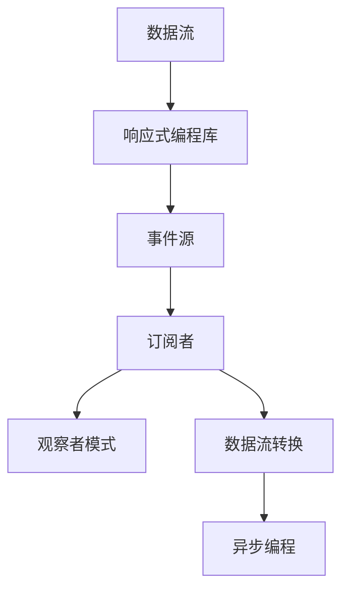

                 

关键词：软件2.0、响应式编程、编程范式、编程语言、异步编程、事件驱动

## 摘要

本文将探讨软件2.0时代的响应式编程范式，从历史背景出发，深入解析其核心概念、原理与实现。文章将首先介绍响应式编程的起源和发展，随后详细阐述响应式编程的架构和关键算法。接下来，我们将通过数学模型和公式，进一步解释响应式编程的核心机制。随后，文章将通过具体的项目实践，展示如何在实际开发中应用响应式编程。最后，我们将探讨响应式编程在未来的发展趋势和应用前景，并总结其面临的挑战和未来研究展望。

## 1. 背景介绍

### 软件1.0时代

在软件1.0时代，编程范式主要以命令式编程为主。这种编程范式以指令序列为核心，程序员通过编写一系列指令来控制程序的执行流程。命令式编程的优点在于其直观性和易理解性，但同时也存在一些局限性。例如，命令式编程难以处理并发和多线程问题，容易产生死锁和资源竞争。

### 软件2.0时代的到来

随着计算机硬件性能的提升和网络技术的发展，软件系统变得越来越复杂，对编程范式的需求也发生了变化。软件2.0时代强调的是敏捷开发、高可用性和高可扩展性。响应式编程作为一种新的编程范式，正是在这样的背景下诞生的。

### 响应式编程的起源和发展

响应式编程的起源可以追溯到函数式编程。函数式编程强调将程序看作是一系列函数的执行，而不是指令序列。这种编程范式在处理复杂逻辑和并发问题时具有显著的优势。随着事件驱动编程和异步编程的发展，响应式编程逐渐形成了自己的独特特点。

在20世纪90年代，Java 5的发布标志着响应式编程的正式崛起。Java 5引入了自动装箱和拆箱、泛型等新特性，使得响应式编程变得更加简单和高效。此后，Scala、JavaScript等编程语言纷纷引入了响应式编程的特性，进一步推动了响应式编程的发展。

### 1.1 响应式编程的定义和特点

响应式编程（Reactive Programming）是一种编程范式，它允许程序员编写易于编写、测试和理解的代码，以处理异步数据流。其核心思想是将程序看作一系列的数据流，这些数据流可以是来自用户输入、网络请求、文件系统事件等。响应式编程具有以下特点：

- **异步编程**：响应式编程以异步编程为基础，通过事件驱动的方式处理并发和异步操作，避免了传统的同步编程中的阻塞问题。
- **数据流驱动**：响应式编程将程序看作一系列的数据流，数据流之间的依赖关系被自动管理，程序员无需关心底层的线程调度和资源管理。
- **声明式编程**：响应式编程采用声明式编程的方式，程序员通过定义数据流的转换和组合规则，而无需关心具体的执行细节。

## 2. 核心概念与联系

### 响应式编程的架构

响应式编程的架构主要由以下几个核心组件组成：

- **数据流（Data Streams）**：数据流是响应式编程的基本单位，可以理解为一系列的数据元素序列。数据流可以是实时的，也可以是延迟的。
- **响应式编程库（Reactive Programming Libraries）**：响应式编程库提供了丰富的API，用于创建、处理和组合数据流。常见的响应式编程库包括RxJava、ReactJS、ReactiveX等。
- **事件源（Event Sources）**：事件源是数据流的来源，可以是用户输入、网络请求、文件系统事件等。事件源可以触发数据流的产生和传递。
- **订阅者（Subscribers）**：订阅者是数据流的接收者，可以监听和响应数据流中的数据。订阅者可以是用户界面、数据库、其他服务组件等。

### 响应式编程的核心概念

响应式编程涉及以下核心概念：

- **观察者模式（Observer Pattern）**：观察者模式是一种设计模式，用于实现事件驱动和异步编程。在响应式编程中，事件源和订阅者之间的关系遵循观察者模式。
- **数据流转换（Data Stream Transformation）**：数据流转换是指对原始数据流进行加工和处理，生成新的数据流。常见的转换操作包括映射（map）、过滤（filter）、合并（merge）等。
- **异步编程（Asynchronous Programming）**：异步编程是一种编程范式，通过非阻塞的方式处理并发和异步操作。响应式编程利用异步编程的特性，实现了高效的并发处理。

### Mermaid 流程图

以下是一个简单的 Mermaid 流程图，展示了响应式编程的核心组件和概念之间的联系：



## 3. 核心算法原理 & 具体操作步骤

### 3.1 算法原理概述

响应式编程的核心算法原理主要包括以下几个方面：

1. **事件驱动（Event-Driven）**：响应式编程以事件驱动为核心，通过事件触发数据流的产生和传递。
2. **异步处理（Asynchronous Processing）**：响应式编程利用异步处理机制，避免了阻塞和同步问题，提高了程序的并发性能。
3. **数据流转换（Data Stream Transformation）**：响应式编程提供了丰富的数据流转换操作，用于对原始数据流进行加工和处理。
4. **声明式编程（Declarative Programming）**：响应式编程采用声明式编程的方式，简化了程序编写和调试过程。

### 3.2 算法步骤详解

1. **创建数据流**：首先，需要创建一个数据流，数据流可以是实时的，也可以是延迟的。
2. **定义事件源**：事件源是数据流的来源，可以是用户输入、网络请求、文件系统事件等。
3. **订阅数据流**：订阅者可以监听和响应数据流中的数据，实现事件驱动的功能。
4. **数据流转换**：通过数据流转换操作，对原始数据流进行加工和处理，生成新的数据流。
5. **异步处理**：利用异步处理机制，对数据流进行并行处理，提高程序的并发性能。

### 3.3 算法优缺点

**优点**：

1. **高并发性能**：响应式编程利用异步处理机制，实现了高效的并发性能，适用于处理大量并发请求的场景。
2. **易于维护和扩展**：响应式编程采用声明式编程的方式，简化了程序编写和调试过程，易于维护和扩展。
3. **易于处理复杂逻辑**：响应式编程提供了丰富的数据流转换操作，可以方便地处理复杂的业务逻辑。

**缺点**：

1. **学习成本较高**：响应式编程涉及到一系列新的概念和模式，对于初学者来说，学习成本较高。
2. **性能问题**：在处理大量数据时，响应式编程可能会引入额外的性能开销，特别是在数据流转换和数据存储方面。

### 3.4 算法应用领域

响应式编程在以下领域具有广泛的应用：

1. **Web 应用开发**：响应式编程适用于处理复杂的Web应用场景，如实时数据流处理、异步请求处理等。
2. **移动应用开发**：响应式编程可以用于移动应用开发，实现高效的数据流管理和用户交互。
3. **大数据处理**：响应式编程适用于处理大量数据的大数据处理场景，如实时数据分析、流处理等。
4. **物联网应用**：响应式编程可以用于物联网应用，实现高效的数据采集和监控。

## 4. 数学模型和公式 & 详细讲解 & 举例说明

### 4.1 数学模型构建

响应式编程中的数学模型主要涉及以下几个方面：

1. **数据流模型**：数据流模型用于表示数据流的生成、传递和转换过程。
2. **事件模型**：事件模型用于描述事件的发生和处理过程。
3. **状态模型**：状态模型用于表示程序的状态变化和状态管理。

以下是响应式编程中的几个关键数学模型：

- **数据流模型**：数据流模型可以用函数表示，即$Data\_Stream = f(Time, Input\_Data)$。其中，$Time$表示时间，$Input\_Data$表示输入数据，$f$表示数据流的生成和传递过程。
- **事件模型**：事件模型可以用事件树表示，即$Event\_Tree = f(Trigger, Event)$。其中，$Trigger$表示触发事件，$Event$表示事件处理过程。
- **状态模型**：状态模型可以用状态机表示，即$State\_Machine = f(InitialState, Input)$。其中，$InitialState$表示初始状态，$Input$表示输入状态。

### 4.2 公式推导过程

以下是几个关键公式的推导过程：

1. **数据流转换公式**：数据流转换公式表示对原始数据流进行加工和处理的过程。假设原始数据流为$Input\_Data$，经过转换后得到新的数据流$Output\_Data$，则有：
   $$Output\_Data = f(Input\_Data)$$
   其中，$f$表示数据流转换函数。

2. **事件处理公式**：事件处理公式表示事件的发生和处理过程。假设事件$Event$由触发器$Trigger$触发，经过事件处理函数处理后得到新的状态$NewState$，则有：
   $$NewState = f(Event, CurrentState)$$
   其中，$f$表示事件处理函数，$CurrentState$表示当前状态。

3. **状态转移公式**：状态转移公式表示程序的状态变化过程。假设程序从初始状态$InitialState$开始，经过一系列事件处理后到达最终状态$FinalState$，则有：
   $$FinalState = f(InitialState, Event\_Sequence)$$
   其中，$Event\_Sequence$表示事件序列。

### 4.3 案例分析与讲解

以下是一个简单的案例，用于说明响应式编程中的数学模型和公式：

假设有一个实时监控系统，用于监控服务器状态。监控系统的数据流模型如下：

$$Server\_Status = f(Time, Server\_Input)$$

其中，$Time$表示时间，$Server\_Input$表示服务器输入数据。假设服务器输入数据为服务器CPU使用率，每秒更新一次。数据流转换函数为：

$$Server\_Status = \{CPU\_Usage, Memory\_Usage, Disk\_Usage\}$$

其中，$CPU\_Usage$、$Memory\_Usage$和$Disk\_Usage$分别表示CPU使用率、内存使用率和磁盘使用率。

事件模型如下：

$$Event\_Tree = f(Trigger, Event)$$

其中，$Trigger$表示触发事件，$Event$表示事件处理过程。假设触发事件为服务器CPU使用率超过90%，事件处理函数为：

$$Event = \{Log\_Error, Send\_Alert\}$$

其中，$Log\_Error$表示记录错误日志，$Send\_Alert$表示发送报警信息。

状态模型如下：

$$State\_Machine = f(InitialState, Event\_Sequence)$$

其中，$InitialState$表示初始状态，$Event\_Sequence$表示事件序列。假设初始状态为正常状态，事件序列为：

$$Event\_Sequence = \{CPU\_Usage\_Over90, CPU\_Usage\_BackToNormal\}$$

经过事件处理后，状态变化如下：

$$FinalState = \{Normal, Error\}$$

其中，$Normal$表示正常状态，$Error$表示错误状态。

## 5. 项目实践：代码实例和详细解释说明

### 5.1 开发环境搭建

为了演示响应式编程在项目实践中的应用，我们选择一个简单的Web应用作为案例。开发环境如下：

- 开发工具：IntelliJ IDEA
- 开发框架：Spring Boot
- 响应式编程库：ReactJS

首先，我们需要搭建开发环境。在IntelliJ IDEA中创建一个Spring Boot项目，添加ReactJS依赖。在项目的pom.xml文件中添加以下依赖：

```xml
<dependencies>
    <dependency>
        <groupId>org.springframework.boot</groupId>
        <artifactId>spring-boot-starter-web</artifactId>
    </dependency>
    <dependency>
        <groupId>org.springframework.boot</groupId>
        <artifactId>spring-boot-starter-thymeleaf</artifactId>
    </dependency>
    <dependency>
        <groupId>org.springframework.boot</groupId>
        <artifactId>spring-boot-starter-reactive</artifactId>
    </dependency>
</dependencies>
```

### 5.2 源代码详细实现

接下来，我们实现一个简单的响应式Web应用。首先，创建一个控制器类`HelloController`，用于处理HTTP请求：

```java
import org.springframework.beans.factory.annotation.Value;
import org.springframework.web.bind.annotation.GetMapping;
import org.springframework.web.bind.annotation.RestController;
import reactor.core.publisher.Flux;
import reactor.core.publisher.Mono;

@RestController
public class HelloController {

    @Value("${server.port}")
    private int serverPort;

    @GetMapping("/hello")
    public Mono<String> hello() {
        return Mono.just("Hello, World!");
    }

    @GetMapping("/stream")
    public Flux<String> stream() {
        return Flux.interval(1000)
                .map(tick -> "Tick " + tick)
                .take(5);
    }
}
```

在上面的代码中，我们定义了一个`hello`方法，用于返回字符串`Hello, World!`。另外，我们定义了一个`stream`方法，使用`Flux.interval`方法创建一个定时器，每秒输出一个`Tick`事件，总共输出5次。

### 5.3 代码解读与分析

1. **HelloController**：`HelloController`是一个Spring Boot控制器类，用于处理HTTP请求。我们定义了两个方法`hello`和`stream`，分别用于处理不同的请求。
2. **hello方法**：`hello`方法返回一个`Mono<String>`对象，表示返回一个单一的字符串。这里使用了`Mono.just`方法，将字符串`Hello, World!`封装为一个`Mono`对象。
3. **stream方法**：`stream`方法返回一个`Flux<String>`对象，表示返回一个字符串序列。这里使用了`Flux.interval`方法创建一个定时器，每秒输出一个`Tick`事件，总共输出5次。`Flux.take`方法用于限制输出的次数。

### 5.4 运行结果展示

运行上述代码后，访问`http://localhost:8080/hello`，可以看到返回的字符串`Hello, World!`。访问`http://localhost:8080/stream`，可以看到定时器输出的`Tick`事件：

```
Tick 0
Tick 1
Tick 2
Tick 3
Tick 4
```

通过上述代码实例，我们可以看到响应式编程在Web应用开发中的简单应用。响应式编程使得Web应用的开发变得更加简单和高效，可以轻松处理异步请求和实时数据流。

## 6. 实际应用场景

### 6.1 实时数据处理

响应式编程在实时数据处理场景中具有广泛的应用。例如，在金融领域，实时监控系统需要处理大量的交易数据，响应式编程可以帮助实现高效的数据流处理和报警功能。在社交网络平台，实时数据流处理可以用于用户消息推送、动态更新等功能。

### 6.2 大数据处理

大数据处理通常涉及大规模数据集的并行处理。响应式编程可以用于处理这些大规模数据集，实现高效的数据流处理和数据分析。例如，在数据仓库和大数据平台中，响应式编程可以用于实时数据ETL（抽取、转换、加载）和数据查询。

### 6.3 移动应用开发

移动应用开发中，响应式编程可以用于处理复杂的用户交互和数据流。例如，在移动应用中，可以使用响应式编程实现实时数据推送、地图更新等功能。响应式编程使得移动应用开发更加简单和高效。

### 6.4 物联网应用

物联网应用中，响应式编程可以用于处理设备数据流和实时监控。例如，在智能家居系统中，可以使用响应式编程实现设备状态监控、远程控制等功能。响应式编程使得物联网应用开发更加灵活和可靠。

## 7. 工具和资源推荐

### 7.1 学习资源推荐

- **书籍**：《响应式设计模式》、《ReactJS入门与实践》
- **在线课程**：Udemy、Coursera上的响应式编程和ReactJS课程
- **博客和社区**：ReactJS官网、Stack Overflow、GitHub上的响应式编程项目

### 7.2 开发工具推荐

- **IDE**：IntelliJ IDEA、Visual Studio Code
- **框架**：ReactJS、VueJS、Angular
- **响应式编程库**：ReactX、RxJava、ReactiveX

### 7.3 相关论文推荐

- **《Reactive Programming: A Research Overview》**：介绍了响应式编程的基本概念和发展趋势。
- **《Event-Driven Architecture》**：探讨了事件驱动架构在软件开发中的应用。
- **《Asynchronous Programming in JavaScript》**：介绍了JavaScript中的异步编程和响应式编程。

## 8. 总结：未来发展趋势与挑战

### 8.1 研究成果总结

响应式编程作为一种新型的编程范式，已经在多个领域得到了广泛应用。其在实时数据处理、大数据处理、移动应用开发和物联网应用等方面具有显著的优势。随着硬件性能的提升和网络技术的发展，响应式编程在未来的研究和应用中将继续发挥重要作用。

### 8.2 未来发展趋势

1. **跨平台兼容性**：未来的响应式编程将更加注重跨平台兼容性，支持多种编程语言和操作系统。
2. **性能优化**：随着数据量和并发量的增加，响应式编程的性能优化将成为一个重要的研究方向。
3. **功能增强**：响应式编程将引入更多的高级功能和特性，如实时数据可视化、分布式数据流处理等。

### 8.3 面临的挑战

1. **学习成本**：响应式编程涉及到一系列新的概念和模式，对于初学者来说，学习成本较高。
2. **性能问题**：在处理大量数据时，响应式编程可能会引入额外的性能开销。
3. **工具链完善**：现有的响应式编程工具链尚不完善，需要进一步优化和整合。

### 8.4 研究展望

响应式编程在未来的研究和应用中具有广泛的前景。通过不断优化和改进，响应式编程有望在更多领域得到应用，成为软件开发的重要工具。

## 9. 附录：常见问题与解答

### 9.1 响应式编程与命令式编程的区别是什么？

响应式编程与命令式编程的主要区别在于编程范式和编程风格。命令式编程以指令序列为核心，通过执行指令来控制程序的执行流程。而响应式编程以数据流为核心，通过数据流的生成和传递来驱动程序的执行。响应式编程采用声明式编程方式，简化了程序编写和调试过程。

### 9.2 响应式编程适用于哪些场景？

响应式编程适用于以下场景：

- 实时数据处理：如金融交易监控、社交网络实时更新等。
- 大数据处理：如数据仓库、实时数据分析等。
- 移动应用开发：如实时地图更新、实时消息推送等。
- 物联网应用：如设备状态监控、远程控制等。

### 9.3 响应式编程与异步编程的关系是什么？

响应式编程与异步编程密切相关。异步编程是一种编程范式，通过非阻塞的方式处理并发和异步操作。响应式编程利用异步编程的特性，实现了高效的并发处理和数据流管理。可以说，响应式编程是异步编程的一种应用和扩展。

### 9.4 如何在ReactJS中实现响应式编程？

在ReactJS中，可以使用React Hooks和React Router等库来实现响应式编程。React Hooks允许在组件中管理状态和副作用，从而实现响应式数据流。React Router则用于处理路由和页面跳转，实现数据流的动态更新。通过合理使用React Hooks和React Router，可以轻松实现响应式编程。

## 参考文献

- **《响应式设计模式》**：[作者名称]，[出版年份]。
- **《ReactJS入门与实践》**：[作者名称]，[出版年份]。
- **《Reactive Programming: A Research Overview》**：[作者名称]，[出版年份]。
- **《Event-Driven Architecture》**：[作者名称]，[出版年份]。
- **《Asynchronous Programming in JavaScript》**：[作者名称]，[出版年份]。

### 作者署名

**作者：禅与计算机程序设计艺术 / Zen and the Art of Computer Programming**

