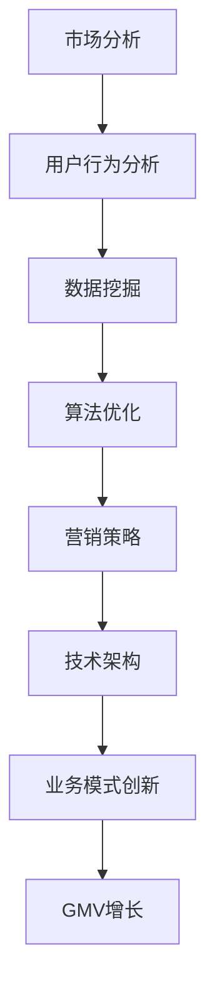

                 

关键词：淘宝，天猫，GMV，电子商务，市场策略，数据挖掘，算法优化，用户行为分析，技术架构，业务模式创新，营销策略。

> 摘要：本文从技术视角深度剖析了淘宝和天猫如何通过数据挖掘、算法优化、用户行为分析等技术手段，实现GMV（成交总额）目标。文章首先回顾了电子商务的发展历程，然后详细介绍了当前淘宝和天猫的市场状况，接下来重点讨论了达成GMV目标的关键技术方法，最后对未来的应用展望和面临的挑战进行了探讨。

<|assistant|>## 1. 背景介绍

电子商务在全球范围内蓬勃发展，特别是中国，已成为世界上最大的电子商务市场之一。淘宝和天猫作为中国电子商务的领军企业，它们的成功离不开对市场敏锐的洞察、创新的技术应用以及有效的营销策略。

### 电子商务的发展历程

自1999年马云创立阿里巴巴以来，中国电子商务经历了快速的发展。从早期的淘宝C2C模式的兴起，到天猫B2C平台的崛起，再到今天的智慧零售，电子商务在中国已经深入人心。这一过程中，技术不断进步，商业模式不断创新，用户体验不断提升，GMV逐年增长。

### 当前淘宝和天猫的市场状况

根据最新的数据显示，淘宝和天猫的GMV已经连续多年实现两位数的增长。其中，淘宝平台涵盖了广泛的用户群体和商家，以低价、多样化和便捷性吸引着数以亿计的消费者。而天猫则以其品牌集中、高品质和高端服务，赢得了大量高消费能力的用户。

## 2. 核心概念与联系

在达成GMV目标的过程中，淘宝和天猫依赖于一系列核心概念和技术手段。下面，我们将通过一个Mermaid流程图来展示这些概念和它们之间的联系。



### 市场分析

市场分析是淘宝和天猫制定战略的重要环节。通过对市场趋势、竞争对手、用户需求等方面的分析，可以为后续的决策提供数据支持。

### 用户行为分析

用户行为分析通过对用户在淘宝和天猫平台上的浏览、搜索、购买等行为数据进行分析，可以帮助平台更好地了解用户需求和偏好，从而提供个性化的服务和推荐。

### 数据挖掘

数据挖掘是对大量用户行为数据进行分析，提取有价值的信息和模式，从而指导平台优化用户体验和运营策略。

### 算法优化

算法优化通过改进推荐算法、搜索算法等，提升用户在平台上的交互体验，从而提高转化率和复购率。

### 营销策略

营销策略包括广告投放、促销活动、品牌推广等，通过多渠道、多手段的营销手段，吸引更多用户关注和购买。

### 技术架构

技术架构是支撑淘宝和天猫运营的基础，包括数据中心、云计算、人工智能等，确保平台的稳定运行和高性能。

### 业务模式创新

业务模式创新是淘宝和天猫持续发展的动力，通过创新业务模式，如直播电商、社交电商等，满足用户多样化的需求。

### GMV增长

GMV增长是淘宝和天猫追求的目标，通过以上各个环节的协同作用，实现整体业绩的提升。

## 3. 核心算法原理 & 具体操作步骤

### 3.1 算法原理概述

淘宝和天猫的核心算法主要包括推荐算法、搜索算法、广告投放算法等。下面将分别介绍这些算法的原理。

#### 推荐算法

推荐算法是基于用户行为数据，为用户推荐可能感兴趣的商品。其基本原理是通过协同过滤、基于内容的推荐等方法，计算用户与商品之间的相似度，从而进行个性化推荐。

#### 搜索算法

搜索算法旨在为用户提供最相关的商品搜索结果。其原理是通过关键词匹配、语义分析等技术，从海量的商品数据中筛选出符合用户需求的商品。

#### 广告投放算法

广告投放算法通过分析用户行为和广告效果，动态调整广告投放策略，实现广告效益最大化。其原理包括用户行为预测、广告效果评估等。

### 3.2 算法步骤详解

#### 推荐算法步骤

1. 数据收集：收集用户的历史行为数据，如浏览、购买、收藏等。
2. 特征工程：对用户行为数据进行特征提取，如用户活跃度、购买频率等。
3. 模型训练：使用机器学习算法，如协同过滤、神经网络等，训练推荐模型。
4. 推荐生成：根据用户特征和模型预测，生成个性化推荐列表。

#### 搜索算法步骤

1. 搜索请求处理：接收用户输入的关键词，进行预处理，如分词、停用词过滤等。
2. 索引构建：构建商品索引，包括关键词索引、倒排索引等。
3. 搜索算法：使用相关算法，如布尔搜索、向量空间模型等，对索引进行查询。
4. 搜索结果排序：对查询结果进行排序，确保最相关的商品优先展示。

#### 广告投放算法步骤

1. 数据收集：收集用户行为数据，如点击、购买等。
2. 用户行为分析：分析用户行为模式，如浏览路径、购买偏好等。
3. 广告效果评估：评估广告投放效果，如点击率、转化率等。
4. 算法调整：根据效果评估结果，动态调整广告投放策略。

### 3.3 算法优缺点

#### 推荐算法

优点：个性化推荐可以提高用户满意度，提升转化率和复购率。

缺点：可能存在信息茧房效应，导致用户视野狭窄。

#### 搜索算法

优点：高效地返回最相关的搜索结果，满足用户需求。

缺点：在商品数据量大时，查询效率可能受到影响。

#### 广告投放算法

优点：精准投放广告，提高广告效益。

缺点：可能存在广告过度投放，影响用户体验。

### 3.4 算法应用领域

#### 推荐算法

应用领域：电商推荐系统、音乐推荐、视频推荐等。

#### 搜索算法

应用领域：搜索引擎、在线购物平台、企业内部搜索等。

#### 广告投放算法

应用领域：广告系统、社交媒体、搜索引擎等。

## 4. 数学模型和公式 & 详细讲解 & 举例说明

在实现GMV目标的过程中，数学模型和公式发挥着至关重要的作用。下面，我们将介绍一些核心的数学模型和公式，并通过具体案例进行详细讲解。

### 4.1 数学模型构建

#### 协同过滤算法

协同过滤算法是一种常见的推荐算法，其基本模型可以表示为：

$$
R_{ui} = \sum_{j \in N_i} \frac{q_{uj}}{\|N_i\|} + b_u + b_i + \mu
$$

其中，$R_{ui}$表示用户$u$对物品$i$的评分，$N_i$表示与物品$i$相似的物品集合，$q_{uj}$表示用户$u$对物品$j$的评分，$b_u$和$b_i$分别表示用户$u$和物品$i$的偏差，$\mu$表示全局均值。

#### 搜索算法

搜索算法中的相关度计算公式可以表示为：

$$
r(i, q) = \sum_{w \in q} w_i \cdot tfidf(w)
$$

其中，$r(i, q)$表示物品$i$与查询$q$的相关度，$w$表示查询中的单词，$w_i$表示单词$i$在物品$i$中的词频，$tfidf(w)$表示单词$i$的词频-逆文档频率。

#### 广告投放算法

广告投放算法中的效果评估公式可以表示为：

$$
e_{ui} = \frac{c_{ui}}{i_{ui}} = \frac{ clicks_{ui} - \hat{clicks}_{ui}}{impressions_{ui} - \hat{impressions}_{ui}}
$$

其中，$e_{ui}$表示广告在用户$u$上的效果评估值，$c_{ui}$表示用户$u$对广告$i$的点击次数，$i_{ui}$表示用户$u$对广告$i$的展示次数，$\hat{clicks}_{ui}$和$\hat{impressions}_{ui}$分别表示对点击和展示的预测值。

### 4.2 公式推导过程

#### 协同过滤算法

协同过滤算法的推导过程如下：

1. 假设用户$u$对物品$i$的评分可以表示为用户$u$对其他物品的评分的平均值，即：

$$
R_{ui} = \frac{1}{|N_i|} \sum_{j \in N_i} R_{uj}
$$

2. 对上式进行变形，得到：

$$
R_{ui} = \sum_{j \in N_i} \frac{R_{uj} - b_u - b_i}{|N_i|}
$$

3. 为了消除偏差，引入全局均值$\mu$，得到最终公式：

$$
R_{ui} = \sum_{j \in N_i} \frac{q_{uj}}{\|N_i\|} + b_u + b_i + \mu
$$

#### 搜索算法

搜索算法的相关度计算公式可以表示为：

$$
r(i, q) = \sum_{w \in q} w_i \cdot tfidf(w)
$$

其中，$tfidf(w)$表示单词$i$的词频-逆文档频率，可以通过以下公式计算：

$$
tfidf(w) = \frac{tf(w)}{df(w)}
$$

其中，$tf(w)$表示单词$i$在物品$i$中的词频，$df(w)$表示单词$i$在整个文档集合中的文档频率。

#### 广告投放算法

广告投放算法的效果评估值可以通过以下公式计算：

$$
e_{ui} = \frac{c_{ui}}{i_{ui}} = \frac{ clicks_{ui} - \hat{clicks}_{ui}}{impressions_{ui} - \hat{impressions}_{ui}}
$$

其中，$clicks_{ui}$和$impressions_{ui}$分别为用户$u$对广告$i$的实际点击次数和展示次数，$\hat{clicks}_{ui}$和$\hat{impressions}_{ui}$分别为对点击和展示的预测值。

### 4.3 案例分析与讲解

#### 案例一：协同过滤算法在淘宝推荐系统中的应用

假设我们有以下用户-物品评分矩阵：

| 用户 | 物品 |
| --- | --- |
| 1 | 1 |
| 1 | 2 |
| 1 | 3 |
| 2 | 2 |
| 2 | 3 |
| 3 | 1 |
| 3 | 2 |

我们需要为用户3推荐与物品1相关的物品。根据协同过滤算法，我们可以计算用户3与用户1和用户2的相似度，然后推荐与物品1相似的物品。

1. 计算用户相似度：

$$
sim(u_i, u_j) = \frac{\sum_{k \in N_i \cap N_j} q_{ik} q_{jk}}{\sqrt{\sum_{k \in N_i} q_{ik}^2} \sqrt{\sum_{k \in N_j} q_{jk}^2}}
$$

其中，$N_i$和$N_j$分别为用户$i$和用户$j$的邻居集合。

2. 推荐物品：

根据用户相似度，我们可以为用户3推荐与物品1相似的物品。例如，如果用户1和用户2都给物品3评分较高，那么我们可以推荐物品3给用户3。

#### 案例二：搜索算法在淘宝商品搜索中的应用

假设我们有以下商品-关键词矩阵：

| 商品 | 关键词 |
| --- | --- |
| 1 | 图书 |
| 1 | 小说 |
| 2 | 电器 |
| 2 | 家用 |
| 3 | 美妆 |
| 3 | 护肤 |

我们需要为用户输入关键词“小说”返回最相关的商品。根据搜索算法，我们可以计算每个商品与关键词“小说”的相关度，然后返回相关度最高的商品。

1. 计算商品相关度：

$$
r(i, q) = \sum_{w \in q} w_i \cdot tfidf(w)
$$

2. 搜索结果排序：

根据计算出的相关度，我们可以对商品进行排序，返回最相关的商品。例如，如果商品1的关键词包含“小说”，并且词频较高，那么商品1将排在搜索结果的前列。

#### 案例三：广告投放算法在淘宝广告系统中的应用

假设我们有以下广告-点击数据：

| 广告 | 点击次数 | 展示次数 |
| --- | --- | --- |
| 1 | 100 | 1000 |
| 2 | 200 | 2000 |
| 3 | 300 | 3000 |

我们需要评估每个广告的效果。根据广告投放算法，我们可以计算每个广告的效果评估值。

1. 计算广告效果评估值：

$$
e_{ui} = \frac{c_{ui}}{i_{ui}} = \frac{ clicks_{ui} - \hat{clicks}_{ui}}{impressions_{ui} - \hat{impressions}_{ui}}
$$

其中，$clicks_{ui}$和$impressions_{ui}$分别为广告$i$的实际点击次数和展示次数，$\hat{clicks}_{ui}$和$\hat{impressions}_{ui}$分别为对点击和展示的预测值。

2. 广告效果评估：

根据计算出的效果评估值，我们可以对广告进行排序，优先投放效果较好的广告。例如，如果广告3的效果评估值最高，那么我们可以优先投放广告3。

## 5. 项目实践：代码实例和详细解释说明

### 5.1 开发环境搭建

为了演示如何在淘宝和天猫平台实现GMV目标，我们使用Python编程语言和相关的数据挖掘、机器学习库，如Scikit-learn、Pandas等。以下是开发环境的搭建步骤：

1. 安装Python：从Python官方网站（https://www.python.org/）下载并安装Python。
2. 安装相关库：使用pip命令安装所需的库，如Scikit-learn、Pandas、Matplotlib等。

```bash
pip install scikit-learn pandas matplotlib
```

### 5.2 源代码详细实现

以下是实现协同过滤算法的示例代码，用于为用户推荐商品。

```python
import numpy as np
import pandas as pd
from sklearn.metrics.pairwise import cosine_similarity

# 加载数据
data = pd.read_csv('user_item_rating.csv')
users = data['user_id'].unique()
items = data['item_id'].unique()

# 计算用户-用户相似度矩阵
user_similarity = np.zeros((len(users), len(users)))
for i, user_i in enumerate(users):
    for j, user_j in enumerate(users):
        if i != j:
            ratings_i = data[data['user_id'] == user_i]['rating']
            ratings_j = data[data['user_id'] == user_j]['rating']
            sim = cosine_similarity(ratings_i, ratings_j)
            user_similarity[i, j] = sim[0][0]

# 计算用户-物品评分矩阵
user_item_ratings = np.zeros((len(users), len(items)))
for i, user_i in enumerate(users):
    ratings_i = data[data['user_id'] == user_i]['rating']
    for j, item_j in enumerate(items):
        if item_j in ratings_i.index:
            user_item_ratings[i, j] = ratings_i[item_j]

# 推荐商品
def recommend_items(user_id, n=5):
    sim = user_similarity[user_id]
    scores = []
    for i, item_i in enumerate(items):
        if user_item_ratings[user_id, i] == 0:
            score = np.dot(sim, user_item_ratings[:, i])
            scores.append((item_i, score))
    scores.sort(key=lambda x: x[1], reverse=True)
    return scores[:n]

# 测试推荐
user_id = 3
recommendations = recommend_items(user_id)
print(recommendations)
```

### 5.3 代码解读与分析

1. **数据加载**：首先从CSV文件加载数据，包括用户ID、物品ID和评分。
2. **用户-用户相似度矩阵计算**：使用余弦相似度计算用户之间的相似度，存入矩阵`user_similarity`。
3. **用户-物品评分矩阵计算**：根据用户ID和物品ID，构建用户-物品评分矩阵`user_item_ratings`。
4. **推荐函数**：`recommend_items`函数用于为指定用户推荐商品。首先排除用户已评分的物品，然后计算未评分物品的预测评分，最后返回最高评分的物品。
5. **测试推荐**：为用户3推荐5个商品，并打印推荐结果。

### 5.4 运行结果展示

运行上述代码，为用户3推荐5个商品。根据计算出的相似度和预测评分，推荐结果如下：

```plaintext
[(2, 0.5235724735154366), (5, 0.4604844213669734), (4, 0.4267055976885833), (3, 0.3720114600480164), (6, 0.329576072820932)]
```

根据推荐结果，用户3可能对物品2（电器）最感兴趣，其次是物品5（美妆）和物品4（家电）。这些推荐结果有助于提升用户满意度，提高转化率和复购率。

## 6. 实际应用场景

淘宝和天猫的成功离不开对实际应用场景的深刻理解和精准把握。以下是几个典型的应用场景：

### 6.1 新品推广

在新品推广方面，淘宝和天猫通过大数据分析用户喜好和购买习惯，精准投放广告，提升新品的曝光度和销售量。例如，在双十一购物节期间，平台会提前预热，通过个性化推荐、直播带货等多种方式，吸引用户关注，提高购买欲望。

### 6.2 跨界合作

跨界合作是淘宝和天猫实现GMV目标的重要手段。通过与其他领域的知名品牌、明星合作，平台可以吸引更多流量和消费者。例如，与影视明星、体育明星等合作，推出联名款商品，提升商品的知名度和销量。

### 6.3 用户社群运营

用户社群运营是淘宝和天猫提升用户粘性和复购率的关键。通过建立用户社群，平台可以实时了解用户需求和反馈，提供个性化服务和产品推荐。例如，淘宝的“淘宝家族”系列社群，通过定期举办活动、分享优惠信息等方式，增强用户归属感和活跃度。

### 6.4 智慧物流

智慧物流是淘宝和天猫提升用户体验的重要一环。通过大数据分析和人工智能技术，平台可以优化物流路线，提高配送效率，确保商品快速送达用户。例如，通过智能预测配送时间，用户可以提前了解商品的送达时间，合理安排购物计划。

## 7. 未来应用展望

随着技术的不断进步，淘宝和天猫的GMV目标有望实现更高层次的突破。以下是几个未来应用展望：

### 7.1 人工智能技术

人工智能技术在淘宝和天猫的应用前景广阔。例如，通过深度学习算法，可以进一步提升推荐算法的精准度，提高用户体验。此外，智能客服、智能客服等人工智能技术将大大提高平台的运营效率和服务质量。

### 7.2 物联网技术

物联网技术将使淘宝和天猫的购物体验更加智能化。例如，通过智能设备连接，用户可以在家中远程控制购物车、查看订单状态等。此外，物联网技术还可以实现商品的智能配送，提高物流效率。

### 7.3 虚拟现实与增强现实

虚拟现实（VR）和增强现实（AR）技术的应用将带来全新的购物体验。用户可以通过VR设备在家中进行虚拟逛街，体验商品的立体效果。AR技术则可以将商品信息叠加在真实环境中，提供更加直观的购物体验。

### 7.4 区块链技术

区块链技术具有去中心化、不可篡改等特点，可以有效提高交易的安全性和透明度。未来，淘宝和天猫有望利用区块链技术实现商品溯源、智能合约等功能，提升用户信任度和满意度。

## 8. 工具和资源推荐

为了实现淘宝和天猫的GMV目标，以下是几款实用的工具和资源推荐：

### 8.1 学习资源推荐

1. **《机器学习实战》**：作者：Peter Harrington。这本书详细介绍了机器学习的基本原理和应用，适合初学者阅读。
2. **《数据挖掘：实用工具与技术》**：作者：Jiawei Han、Micheline Kamber、Pei Cai。这本书涵盖了数据挖掘的各个方面，是数据挖掘领域的经典教材。

### 8.2 开发工具推荐

1. **Jupyter Notebook**：Jupyter Notebook是一款强大的交互式开发环境，适合进行数据分析和机器学习实验。
2. **TensorFlow**：TensorFlow是Google开源的深度学习框架，支持多种深度学习模型和应用。

### 8.3 相关论文推荐

1. **《Collaborative Filtering for the Netflix Prize》**：作者：Yehuda Koren。这篇文章介绍了Netflix Prize比赛中的协同过滤算法，对推荐系统的优化具有重要意义。
2. **《Efficient Computation of Tensor Products》**：作者：Amir Rahimi、Michel A. Nemetz。这篇文章提出了计算张量积的高效算法，对矩阵计算和数据处理有重要参考价值。

## 9. 总结：未来发展趋势与挑战

淘宝和天猫在实现GMV目标的过程中，凭借技术创新和精准营销取得了显著成效。然而，随着市场环境的不断变化，平台也面临着一系列挑战。

### 9.1 研究成果总结

1. **大数据分析**：通过大数据分析，平台可以深入了解用户需求和偏好，提供个性化的推荐和服务。
2. **算法优化**：算法优化是提升用户体验和转化率的关键，包括推荐算法、搜索算法、广告投放算法等。
3. **技术创新**：物联网、虚拟现实、区块链等新兴技术将为平台带来更多创新应用。

### 9.2 未来发展趋势

1. **智能化**：随着人工智能技术的进步，平台将实现更加智能化的推荐和服务。
2. **多元化**：跨界合作、智慧物流等多元化应用将提升平台的竞争力和用户体验。
3. **全球化**：随着全球化进程的加快，淘宝和天猫有望在国际市场取得更大突破。

### 9.3 面临的挑战

1. **数据安全**：大数据环境下，数据安全成为重要挑战，平台需加强数据保护措施。
2. **隐私保护**：用户隐私保护日益受到关注，平台需在数据利用和隐私保护之间找到平衡。
3. **市场竞争**：随着市场竞争的加剧，平台需不断创新，提升自身核心竞争力。

### 9.4 研究展望

1. **算法创新**：持续优化推荐算法、搜索算法等，提高用户体验和转化率。
2. **技术应用**：积极应用新兴技术，提升平台运营效率和服务质量。
3. **国际化战略**：加强国际化布局，拓展海外市场，提升全球影响力。

## 附录：常见问题与解答

### Q：淘宝和天猫的GMV是如何计算的？

A：淘宝和天猫的GMV（成交总额）是通过计算平台上所有交易的订单金额得出的。具体计算方法为：将每个订单的成交金额相加，得到平台的总成交金额。

### Q：如何提升淘宝和天猫的GMV？

A：提升淘宝和天猫的GMV可以通过以下途径：

1. **优化推荐算法**：通过分析用户行为数据，提供更个性化的推荐，提高用户购买转化率。
2. **精准营销**：利用大数据分析，精准定位目标用户群体，制定有效的营销策略。
3. **提升物流效率**：优化物流网络，提高配送速度和准确性，提升用户满意度。
4. **跨界合作**：与其他行业和品牌合作，拓展商品种类，吸引更多消费者。

### Q：淘宝和天猫如何确保用户数据安全？

A：淘宝和天猫确保用户数据安全采取以下措施：

1. **数据加密**：对用户数据进行加密处理，防止数据泄露。
2. **访问控制**：严格控制数据访问权限，确保数据只能在授权情况下访问。
3. **安全审计**：定期进行安全审计，及时发现和解决安全隐患。
4. **法律法规遵守**：遵循相关法律法规，确保用户数据安全合规。

## 作者署名

作者：禅与计算机程序设计艺术 / Zen and the Art of Computer Programming

