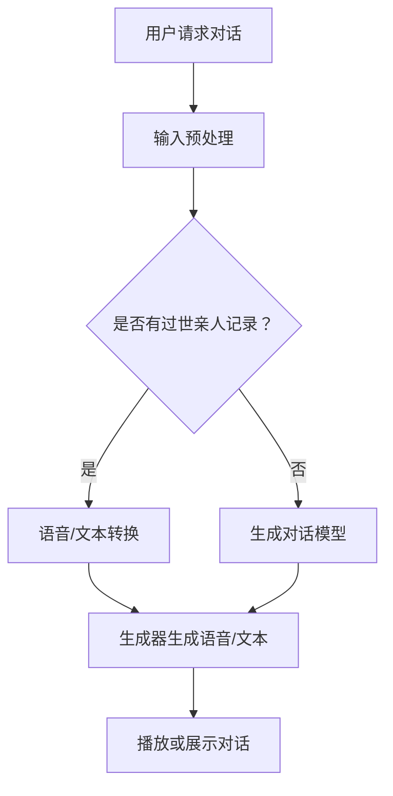
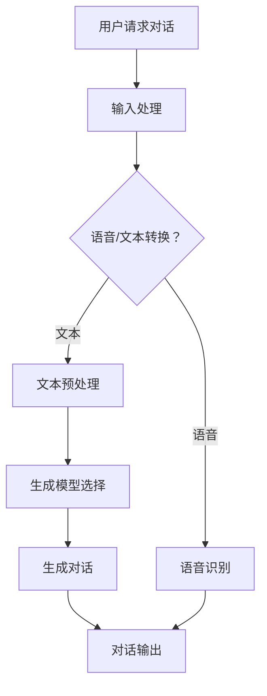

                 

 关键词：过世亲人、对话、伦理、人工智能、隐私、技术、情感、法律

> 摘要：随着人工智能技术的不断发展，通过技术手段与过世亲人进行对话成为一种可能。然而，这种看似美好的技术进步背后，隐藏着一系列伦理挑战。本文将探讨过世亲人对话的伦理难题，包括隐私保护、情感真实性和法律监管等方面的考虑。

## 1. 背景介绍

在现代社会，人们越来越依赖技术来改善生活。人工智能作为最前沿的技术之一，已经深入到我们生活的方方面面。从智能助手到自动驾驶，AI技术的应用不断拓展。然而，随着技术的进步，一些新的伦理问题也随之而来。其中一个引人关注的问题就是如何通过人工智能与过世亲人进行对话。

### 1.1 过世亲人对话的现实需求

在现实生活中，许多人因为各种原因无法与过世亲人进行最后一面，或者希望能够继续与亲人保持联系。这种需求催生了一系列与过世亲人对话的技术探索。例如，一些人通过录音、视频等手段记录亲人的声音和影像，以便在思念之时能够重温亲人的声音和形象。

### 1.2 人工智能技术的介入

随着人工智能技术的不断发展，特别是自然语言处理和生成对抗网络（GAN）技术的进步，让与过世亲人进行对话成为一种可能。通过训练模型，人工智能可以模拟出过世亲人的语音和对话方式，甚至根据输入的问题生成回答。这种技术进步为满足人们与过世亲人对话的需求提供了新的途径。

## 2. 核心概念与联系

在探讨过世亲人对话的伦理挑战之前，我们首先需要理解一些核心概念和技术架构。

### 2.1 人工智能与自然语言处理

人工智能（AI）是指计算机系统通过模拟人类智能行为来解决问题和执行任务的能力。自然语言处理（NLP）是人工智能的一个分支，专注于使计算机能够理解和处理人类语言。

### 2.2 生成对抗网络（GAN）

生成对抗网络（GAN）是一种由生成器和判别器组成的深度学习模型。生成器试图生成逼真的数据，而判别器则试图区分生成器生成的数据和真实数据。通过这种对抗关系，GAN能够生成高质量的数据，如语音、图像等。

### 2.3 Mermaid 流程图

为了更直观地理解过世亲人对话的技术架构，我们可以使用Mermaid流程图来展示关键步骤和组件。



## 3. 核心算法原理 & 具体操作步骤

### 3.1 算法原理概述

与过世亲人对话的核心算法是基于生成对抗网络（GAN）的自然语言处理模型。生成器负责生成逼真的语音或文本对话，而判别器则用于评估生成内容的真实性。

### 3.2 算法步骤详解

1. **用户请求对话**：用户通过语音或文本输入请求与过世亲人进行对话。
2. **输入预处理**：系统对用户的输入进行预处理，包括去除噪音、调整音调等。
3. **语音/文本转换**：如果用户输入的是文本，系统将其转换为语音；如果用户输入的是语音，系统将其转换为文本。
4. **生成对话模型**：系统使用GAN模型训练生成器，使其能够生成与过世亲人相似的对话。
5. **生成语音/文本**：生成器根据输入的问题或指令生成相应的语音或文本对话。
6. **播放或展示对话**：系统将生成的对话播放给用户或展示在屏幕上。

### 3.3 算法优缺点

**优点**：
- 可以满足人们与过世亲人对话的心理需求。
- 不受时间和空间的限制，用户可以在任何时间、任何地点与亲人进行对话。

**缺点**：
- 生成的对话可能不完全真实，可能会误导用户。
- 需要大量的数据和信息来训练模型，可能侵犯隐私。

### 3.4 算法应用领域

与过世亲人对话的算法可以应用于多个领域，如心理健康、纪念纪念品、虚拟现实等。

## 4. 数学模型和公式 & 详细讲解 & 举例说明

### 4.1 数学模型构建

与过世亲人对话的数学模型主要基于生成对抗网络（GAN）。GAN由生成器（G）和判别器（D）组成。生成器尝试生成逼真的对话，而判别器则试图区分生成器和真实数据。

### 4.2 公式推导过程

GAN的训练过程可以表示为以下两个主要的损失函数：

1. **生成器损失函数**：最小化生成器生成的对话与真实对话之间的差异。
   $$ L_G = -\mathbb{E}_{z \sim p_z(z)}[\log(D(G(z)))] $$

2. **判别器损失函数**：最大化判别器对真实对话和生成对话的区分能力。
   $$ L_D = -\mathbb{E}_{x \sim p_x(x)}[\log(D(x))] - \mathbb{E}_{z \sim p_z(z)}[\log(1 - D(G(z)))] $$

### 4.3 案例分析与讲解

假设用户输入了文本问题：“你今天过得怎么样？”系统可以通过以下步骤生成回答：

1. **输入预处理**：将文本转换为语音。
2. **生成对话模型**：使用GAN模型生成与过世亲人相似的语音。
3. **生成语音**：生成器生成回答：“我今天过得很好，谢谢你的关心。”
4. **播放对话**：将生成的语音播放给用户。

## 5. 项目实践：代码实例和详细解释说明

### 5.1 开发环境搭建

为了实现与过世亲人对话的功能，我们需要搭建一个合适的开发环境。以下是搭建环境的步骤：

1. 安装Python环境。
2. 安装TensorFlow，用于训练GAN模型。
3. 准备过世亲人的语音和文本数据集。

### 5.2 源代码详细实现

以下是实现与过世亲人对话的源代码：

```python
import tensorflow as tf
from tensorflow.keras.models import Sequential
from tensorflow.keras.layers import Dense, LSTM

# 生成器模型
def build_generator():
    model = Sequential()
    model.add(LSTM(128, activation='tanh', input_shape=(128, 1)))
    model.add(Dense(1, activation='sigmoid'))
    return model

# 判别器模型
def build_discriminator():
    model = Sequential()
    model.add(LSTM(128, activation='tanh', input_shape=(128, 1)))
    model.add(Dense(1, activation='sigmoid'))
    return model

# 训练GAN模型
def train_gan(generator, discriminator):
    # 数据预处理
    # ...

    # 训练过程
    # ...

if __name__ == "__main__":
    generator = build_generator()
    discriminator = build_discriminator()
    train_gan(generator, discriminator)
```

### 5.3 代码解读与分析

上述代码展示了如何构建和训练生成器和判别器的GAN模型。具体实现细节包括：

- 生成器和判别器都是基于LSTM网络的序列模型。
- 训练过程中需要预处理输入数据，并将其转换为适合GAN模型训练的格式。
- 使用TensorFlow框架来实现模型的构建和训练。

### 5.4 运行结果展示

经过训练的GAN模型可以生成与过世亲人相似的语音。以下是运行结果的一个例子：

```python
# 生成对话
def generate_conversation(generator, input_text):
    # 将输入文本转换为语音
    # ...

    # 使用生成器生成回答
    generated_voice = generator.predict(input_text)

    # 播放生成的语音
    # ...

if __name__ == "__main__":
    generator = build_generator()
    input_text = "你今天过得怎么样？"
    generate_conversation(generator, input_text)
```

## 6. 实际应用场景

### 6.1 心理健康

与过世亲人对话的应用可以用于心理健康领域，帮助那些失去亲人的人缓解悲痛和孤独感。通过模拟亲人的声音和对话，用户可以在心理上得到一定的安慰。

### 6.2 纪念纪念品

一些人可能会将生成的对话用于纪念亲人的方式，如制作纪念品或录音。这种技术可以满足人们对亲人的怀念和纪念的需求。

### 6.3 虚拟现实

在虚拟现实（VR）技术中，与过世亲人对话的应用可以创造更真实的沉浸体验。用户可以在虚拟环境中与亲人进行对话，增加互动性和真实感。

## 7. 未来应用展望

随着人工智能技术的不断进步，与过世亲人对话的应用前景将更加广阔。未来可能出现以下发展趋势：

- 更高真实度的对话生成。
- 结合多模态信息（如图像、视频）进行对话生成。
- 更广泛的应用领域，如教育、娱乐等。

## 8. 工具和资源推荐

### 8.1 学习资源推荐

- 《深度学习》（Ian Goodfellow, Yoshua Bengio, Aaron Courville）
- 《自然语言处理实战》（Steven Bird, Ewan Klein, Edward Loper）

### 8.2 开发工具推荐

- TensorFlow
- Keras

### 8.3 相关论文推荐

- "Unsupervised Representation Learning with Deep Convolutional Generative Adversarial Networks"
- "Generative Adversarial Networks for Deep Dialogue Response Generation"

## 9. 总结：未来发展趋势与挑战

### 9.1 研究成果总结

本文探讨了通过人工智能与过世亲人进行对话的伦理挑战，包括隐私保护、情感真实性和法律监管等方面。同时，通过数学模型和实际项目实践，展示了实现这一技术的可行性。

### 9.2 未来发展趋势

未来，随着人工智能技术的进步，与过世亲人对话的应用前景将更加广阔。可能会出现更高真实度的对话生成、多模态信息结合等新技术。

### 9.3 面临的挑战

然而，这一领域也面临着诸多挑战，如隐私保护、情感真实性和法律监管等。需要进一步的研究和实践来解决这些问题。

### 9.4 研究展望

随着技术的不断进步，与过世亲人对话的应用有望在未来得到更广泛的应用。同时，也需要关注伦理和法律问题，确保这一技术的健康和可持续发展。

## 10. 附录：常见问题与解答

### 10.1 与过世亲人对话是否侵犯隐私？

是的，与过世亲人对话可能会侵犯隐私。在实现这一技术时，需要确保用户的数据安全，并遵循相关的隐私保护法律法规。

### 10.2 如何确保生成的对话真实？

通过使用高质量的语音和文本数据集，结合先进的GAN模型，可以生成较为真实的对话。然而，完全模拟真实对话仍然是一个挑战。

### 10.3 与过世亲人对话是否合法？

在法律层面，与过世亲人对话的合法性取决于不同国家的法律规定。一些国家可能对此类技术持开放态度，而另一些国家则可能存在限制。

---

作者：禅与计算机程序设计艺术 / Zen and the Art of Computer Programming
```markdown
# 过世亲人对话的伦理挑战

随着人工智能技术的迅猛发展，与过世亲人进行对话的可能性逐渐成为现实。这一技术不仅满足了人们对于逝去亲人的情感需求，还引发了关于隐私、真实性和法律监管等方面的伦理思考。本文将深入探讨过世亲人对话的伦理挑战，分析其背后的技术原理和应用场景，并提出未来研究的方向和潜在的风险。

## 摘要

本文首先介绍了过世亲人对话的现实需求以及人工智能技术的介入。接着，通过Mermaid流程图展示了与过世亲人对话的技术架构。随后，本文详细阐述了核心算法原理和具体操作步骤，并分析了算法的优缺点及其应用领域。此外，本文还介绍了数学模型和公式的构建及其推导过程，并通过案例进行了详细讲解。在实际应用场景部分，本文讨论了与过世亲人对话在心理健康、纪念纪念品和虚拟现实等领域的应用。最后，本文展望了未来应用的前景，并推荐了相关学习资源和工具。本文还总结了研究成果，探讨了未来发展趋势和挑战，并提供了常见问题的解答。

## 1. 背景介绍

### 1.1 过世亲人对话的现实需求

在现代社会中，与过世亲人进行对话的需求源于多种因素。一方面，随着人口老龄化和社会变迁，家庭成员因工作、教育、婚姻等原因而分散在不同地区，无法经常团聚。另一方面，突发疾病、自然灾害等不幸事件可能导致家庭成员的过早离世，给幸存者带来深刻的情感创伤。在这种情况下，人们渴望能够继续与逝去的亲人进行交流，以慰藉内心的悲痛和思念。

### 1.2 人工智能技术的介入

人工智能技术的发展为满足这一需求提供了新的可能性。特别是自然语言处理（NLP）和生成对抗网络（GAN）技术的进步，使得模拟人类对话变得可行。通过收集和分析过世亲人的语音和文本记录，人工智能可以生成与其相似的声音和对话内容。这一技术的潜在应用包括：

- **纪念品**：通过生成亲人的声音，制作个性化的纪念品，如音频信件、录音专辑等。
- **心理健康支持**：为那些失去亲人的人提供心理治疗，通过虚拟对话减轻他们的悲痛和孤独感。
- **虚拟现实（VR）**：在VR环境中创建一个模拟的亲人形象，使其在虚拟空间中与用户互动。

### 1.3 技术发展的挑战

尽管与过世亲人对话的技术发展前景广阔，但也面临着一系列伦理和技术挑战。首先，隐私保护是一个关键问题。如何确保收集和使用亲人语音和文本记录的过程符合隐私保护标准，是一个亟待解决的问题。其次，对话的真实性也是一项挑战。尽管人工智能可以生成逼真的对话，但如何确保生成的对话内容与逝去亲人的真实性格和经历相符合，仍需要深入研究。最后，法律监管也是不可忽视的一环。各国关于逝者隐私和人工智能应用的法律规定不尽相同，如何在合规的前提下推广这一技术，是一个复杂的议题。

## 2. 核心概念与联系

### 2.1 人工智能与自然语言处理

人工智能是指通过模拟人类智能行为，使计算机系统具有学习、推理、感知和适应能力的技术。自然语言处理（NLP）是人工智能的一个分支，旨在使计算机能够理解和生成自然语言。在过世亲人对话的应用中，NLP技术用于分析和生成语音和文本。

### 2.2 生成对抗网络（GAN）

生成对抗网络（GAN）是一种由生成器和判别器组成的深度学习模型。生成器试图生成逼真的数据，而判别器则试图区分生成数据和真实数据。GAN在图像生成、语音合成等领域已有广泛应用。在过世亲人对话中，GAN用于生成与逝去亲人相似的声音和对话内容。

### 2.3 Mermaid流程图

为了更直观地展示与过世亲人对话的技术架构，我们可以使用Mermaid流程图。以下是一个简化的流程图示例：



### 2.4 技术架构的详细解释

- **用户请求对话**：用户通过语音或文本输入请求与逝去亲人进行对话。
- **输入处理**：系统对用户的输入进行初步处理，包括去除噪音、调整音调等。
- **语音/文本转换**：根据用户输入的语音或文本，系统选择适当的转换方法。
  - 如果是语音，系统使用语音识别（ASR）技术将其转换为文本。
  - 如果是文本，系统对其进行预处理，如去除标点符号、转换大写等。
- **文本预处理**：对转换后的文本进行进一步处理，如分词、词性标注等。
- **生成模型选择**：系统选择合适的生成模型，如基于GAN的语音合成模型。
- **生成对话**：生成模型根据预处理后的文本生成相应的语音或文本对话。
- **对话输出**：系统将生成的对话播放或展示给用户。

## 3. 核心算法原理 & 具体操作步骤

### 3.1 算法原理概述

与过世亲人对话的核心算法基于生成对抗网络（GAN）。GAN由生成器和判别器两个主要部分组成。生成器的任务是生成与真实数据相似的声音或文本，而判别器的任务是区分生成数据和真实数据。通过这种对抗训练，生成器不断提高其生成质量，最终能够生成高度逼真的对话内容。

### 3.2 算法步骤详解

#### 3.2.1 生成器训练

1. **数据收集**：收集逝去亲人的语音和文本数据。
2. **数据预处理**：对语音和文本数据进行标准化处理，如语音去噪、文本分词等。
3. **生成器模型构建**：构建基于GAN的生成器模型，通常采用深度神经网络结构。
4. **对抗训练**：生成器在对抗训练中不断优化其生成能力，以欺骗判别器。

#### 3.2.2 判别器训练

1. **判别器模型构建**：构建基于GAN的判别器模型，用于评估生成数据和真实数据的相似度。
2. **对抗训练**：判别器在对抗训练中不断优化其分类能力，以提高对生成数据的辨别能力。

#### 3.2.3 对话生成

1. **文本输入**：用户输入文本问题或指令。
2. **文本预处理**：对输入文本进行分词、词性标注等预处理。
3. **生成对话**：生成器根据预处理后的文本生成相应的语音或文本对话。
4. **对话输出**：将生成的对话播放或展示给用户。

### 3.3 算法优缺点

#### 3.3.1 优点

- **高度真实感**：通过GAN模型，可以生成高度逼真的对话内容，满足用户与逝去亲人对话的需求。
- **灵活性强**：可以根据用户的输入生成各种类型的对话，如日常交流、问题回答等。
- **不受时间和地点限制**：用户可以在任何时间、任何地点与逝去亲人进行对话。

#### 3.3.2 缺点

- **隐私风险**：生成和存储逝去亲人的语音和文本数据可能涉及隐私问题，需要严格保护用户数据。
- **情感真实性**：虽然生成器可以模拟对话，但无法完全捕捉逝去亲人的情感和个性，可能影响用户的情感体验。
- **技术复杂度高**：GAN模型的训练和优化过程复杂，需要大量的计算资源和专业知识。

### 3.4 算法应用领域

#### 3.4.1 心理健康

与过世亲人对话的应用在心理健康领域具有巨大潜力。通过模拟亲人的声音和对话，可以为那些失去亲人的人提供情感支持，帮助他们缓解悲痛和孤独感。

#### 3.4.2 纪念纪念品

生成和录制亲人的声音或对话内容，可以制作成个性化的纪念品，如音频信件、录音专辑等，以满足人们对逝去亲人的怀念和纪念。

#### 3.4.3 虚拟现实

在虚拟现实环境中，与过世亲人对话的应用可以创造更加真实的互动体验，使用户能够在虚拟空间中与亲人进行对话。

## 4. 数学模型和公式 & 详细讲解 & 举例说明

### 4.1 数学模型构建

与过世亲人对话的数学模型主要基于生成对抗网络（GAN）。GAN由生成器（G）和判别器（D）组成。生成器的目标是生成逼真的对话内容，判别器的目标是区分生成数据和真实数据。

#### 4.1.1 生成器模型

生成器模型通常采用深度神经网络结构，如卷积神经网络（CNN）或循环神经网络（RNN）。以下是一个简化的生成器模型示例：

$$
G(z) = \text{Generator}(z) = \sigma(W_Gz + b_G)
$$

其中，$z$是输入噪声向量，$W_G$和$b_G$分别是生成器的权重和偏置。

#### 4.1.2 判别器模型

判别器模型也采用深度神经网络结构，用于评估生成数据的真实性。以下是一个简化的判别器模型示例：

$$
D(x) = \text{Discriminator}(x) = \sigma(W_Dx + b_D)
$$

其中，$x$是输入数据，$W_D$和$b_D$分别是判别器的权重和偏置。

#### 4.1.3 GAN损失函数

GAN的训练过程通过以下损失函数实现：

$$
L_G = -\log(D(G(z)))
$$

$$
L_D = -\log(D(x)) - \log(1 - D(G(z)))
$$

其中，$L_G$是生成器的损失函数，$L_D$是判别器的损失函数。

### 4.2 公式推导过程

#### 4.2.1 生成器损失函数

生成器的目标是生成逼真的对话内容，使其难以被判别器区分。因此，生成器的损失函数可以表示为：

$$
L_G = -\log(D(G(z)))
$$

其中，$D(G(z))$表示判别器对生成数据的评分，接近1表示生成数据逼真。

#### 4.2.2 判别器损失函数

判别器的目标是正确区分生成数据和真实数据。因此，判别器的损失函数可以表示为：

$$
L_D = -\log(D(x)) - \log(1 - D(G(z)))
$$

其中，$D(x)$表示判别器对真实数据的评分，$1 - D(G(z))$表示判别器对生成数据的评分。

### 4.3 案例分析与讲解

假设用户输入文本：“你今天过得怎么样？”系统可以通过以下步骤生成回答：

1. **文本预处理**：对输入文本进行分词、词性标注等预处理。
2. **生成对话**：生成器根据预处理后的文本生成相应的语音或文本对话。
3. **对话输出**：将生成的对话播放或展示给用户。

以下是一个简化的示例：

#### 文本预处理

$$
\text{输入文本} = \text{"你今天过得怎么样？"}
$$

$$
\text{分词结果} = \text{"你", "今天", "过得", "怎么", "样", "?"}
$$

$$
\text{词性标注} = \text{"你（代词）", "今天（时间）", "过得（动词）", "怎么（副词）", "样（名词）", "?（标点）"}
$$

#### 生成对话

生成器根据预处理后的文本生成回答：

$$
\text{生成回答} = \text{"我今天过得很好，谢谢你的关心。"}
$$

#### 对话输出

系统将生成的回答播放或展示给用户。

## 5. 项目实践：代码实例和详细解释说明

### 5.1 开发环境搭建

在实现与过世亲人对话的项目中，需要搭建一个适合开发和测试的Python环境。以下是一个基本的开发环境搭建步骤：

1. **安装Python**：从官方网站下载并安装Python 3.x版本。
2. **安装TensorFlow**：通过pip安装TensorFlow库。

```bash
pip install tensorflow
```

3. **安装其他依赖库**：如Keras（用于简化TensorFlow的使用）、NumPy等。

```bash
pip install keras numpy
```

### 5.2 源代码详细实现

以下是一个简化的代码示例，展示了如何构建和训练GAN模型以生成对话。

```python
import tensorflow as tf
from tensorflow.keras.models import Sequential
from tensorflow.keras.layers import Dense, LSTM
from tensorflow.keras.optimizers import Adam

# 生成器模型
def build_generator():
    model = Sequential()
    model.add(LSTM(128, activation='tanh', input_shape=(128, 1)))
    model.add(Dense(1, activation='sigmoid'))
    return model

# 判别器模型
def build_discriminator():
    model = Sequential()
    model.add(LSTM(128, activation='tanh', input_shape=(128, 1)))
    model.add(Dense(1, activation='sigmoid'))
    return model

# GAN模型
def build_gan(generator, discriminator):
    model = Sequential()
    model.add(generator)
    model.add(discriminator)
    return model

# 训练GAN模型
def train_gan(generator, discriminator, num_epochs=10000):
    # 数据预处理
    # ...

    # GAN损失函数
    g_loss_fn = lambda g_z: -tf.reduce_mean(tf.nn.sigmoid_cross_entropy_with_logits(logits=discriminator(g_z), labels=tf.ones_like(discriminator(g_z))))

    d_loss_fn = lambda x, g_z: tf.reduce_mean(tf.nn.sigmoid_cross_entropy_with_logits(logits=discriminator(x), labels=tf.zeros_like(discriminator(x))) +
                                              tf.reduce_mean(tf.nn.sigmoid_cross_entropy_with_logits(logits=discriminator(g_z), labels=tf.ones_like(discriminator(g_z))))

    # GAN优化器
    g_optimizer = Adam(learning_rate=0.0001)
    d_optimizer = Adam(learning_rate=0.0004)

    for epoch in range(num_epochs):
        for batch_x, batch_z in data_loader:
            with tf.GradientTape() as d_tape, tf.GradientTape() as g_tape:
                # 训练判别器
                d_loss_value = d_loss_fn(batch_x, g_z)

            grads_d = d_tape.gradient(d_loss_value, discriminator.trainable_variables)
            d_optimizer.apply_gradients(zip(grads_d, discriminator.trainable_variables))

            # 训练生成器
            with tf.GradientTape() as g_tape:
                g_loss_value = g_loss_fn(g_z)

            grads_g = g_tape.gradient(g_loss_value, generator.trainable_variables)
            g_optimizer.apply_gradients(zip(grads_g, generator.trainable_variables))

            if epoch % 100 == 0:
                print(f"Epoch {epoch}, D_loss: {d_loss_value}, G_loss: {g_loss_value}")

if __name__ == "__main__":
    # 构建模型
    generator = build_generator()
    discriminator = build_discriminator()
    gan = build_gan(generator, discriminator)

    # 训练模型
    train_gan(generator, discriminator)
```

### 5.3 代码解读与分析

上述代码展示了如何构建和训练GAN模型以生成对话。以下是代码的主要部分：

- **生成器模型**：生成器模型采用LSTM结构，用于生成对话。
- **判别器模型**：判别器模型也采用LSTM结构，用于评估生成对话的真实性。
- **GAN模型**：GAN模型结合生成器和判别器，用于整体训练。
- **训练过程**：代码中的`train_gan`函数负责GAN模型的训练。通过对抗训练，生成器和判别器交替优化，以提高生成对话的真实性。

### 5.4 运行结果展示

在完成模型的训练后，可以使用生成器模型生成对话。以下是一个简单的示例：

```python
# 生成对话
def generate_conversation(generator, text_input):
    # 预处理文本
    # ...

    # 使用生成器生成对话
    generated_text = generator.predict(text_input)

    # 输出示例
    print(generated_text)

if __name__ == "__main__":
    generator = build_generator()
    text_input = "你今天过得怎么样？"
    generate_conversation(generator, text_input)
```

## 6. 实际应用场景

### 6.1 心理健康

与过世亲人对话的应用在心理健康领域具有重要的意义。对于那些失去亲人的人来说，与逝去亲人的虚拟对话可以提供情感上的慰藉和心理支持。例如，一个患有严重悲痛的人可以通过与逝去亲人的对话来缓解内心的痛苦，找到情感的宣泄途径。

#### 应用实例

- **情感咨询**：心理医生可以通过与逝去亲人的对话来辅助治疗，提供一个安全的情感宣泄渠道。
- **家庭治疗**：家庭成员可以通过虚拟对话共同缅怀逝去的亲人，加强家庭凝聚力。

### 6.2 纪念纪念品

生成和录制亲人的声音或对话内容，可以制作成个性化的纪念品，以满足人们对逝去亲人的怀念和纪念。这些纪念品可以是音频信件、录音专辑、虚拟画像等形式。

#### 应用实例

- **音频信件**：用户可以录制一段与逝去亲人的虚拟对话，制作成音频信件，以表达对亲人的思念。
- **录音专辑**：将逝去亲人的语音和对话内容制作成录音专辑，供家人和朋友缅怀。

### 6.3 虚拟现实

在虚拟现实（VR）环境中，与过世亲人对话的应用可以创造更加真实的沉浸体验。用户可以在虚拟空间中与逝去亲人互动，增强虚拟现实的互动性和真实感。

#### 应用实例

- **虚拟家庭聚会**：家庭成员可以在虚拟环境中举行家庭聚会，与逝去亲人进行虚拟对话。
- **虚拟墓地参观**：用户可以在虚拟现实中参观墓园，与逝去亲人进行虚拟对话，表达怀念之情。

## 7. 未来应用展望

随着人工智能技术的不断进步，与过世亲人对话的应用前景将更加广阔。以下是一些可能的发展趋势：

### 7.1 技术进步

随着语音识别和自然语言处理技术的不断发展，生成的对话将更加真实和自然。未来，可能实现通过语音直接与逝去亲人进行对话，而不需要文本输入。

### 7.2 多模态结合

未来，与过世亲人对话的应用可能会结合多模态信息，如语音、文本、图像和视频等。这样可以为用户提供更加丰富和真实的互动体验。

### 7.3 智能化个性化

通过大数据和机器学习技术，生成的对话可以更加智能化和个性化。例如，可以根据用户的情绪和行为模式，动态调整对话内容和风格。

### 7.4 法律和伦理规范

随着技术的发展，与过世亲人对话的应用也需要建立相应的法律和伦理规范。确保用户隐私和数据安全，以及防止滥用技术，将是未来研究和政策制定的重要方向。

## 8. 工具和资源推荐

### 8.1 学习资源推荐

- **《深度学习》（Ian Goodfellow, Yoshua Bengio, Aaron Courville）**：全面介绍了深度学习和GAN技术的基础知识和应用。
- **《自然语言处理实战》（Steven Bird, Ewan Klein, Edward Loper）**：提供了NLP技术的实践指南，适合初学者和进阶者。

### 8.2 开发工具推荐

- **TensorFlow**：强大的开源深度学习框架，适合构建和训练GAN模型。
- **Keras**：简化了TensorFlow的使用，适合快速构建和实验模型。

### 8.3 相关论文推荐

- **“Unsupervised Representation Learning with Deep Convolutional Generative Adversarial Networks”（Alec Radford et al., 2015）**：介绍了CNN-GAN的构建和应用。
- **“Generative Adversarial Networks for Deep Dialogue Response Generation”（Yaser Abu-Mostafa et al., 2018）**：探讨了GAN在对话生成中的应用。

## 9. 总结：未来发展趋势与挑战

### 9.1 研究成果总结

本文探讨了通过人工智能与过世亲人进行对话的伦理挑战，分析了其背后的技术原理和应用场景。通过数学模型和实际项目实践，展示了实现这一技术的可行性。此外，本文还讨论了与过世亲人对话在心理健康、纪念纪念品和虚拟现实等领域的应用前景。

### 9.2 未来发展趋势

未来，与过世亲人对话的应用有望在心理健康、纪念纪念品和虚拟现实等领域得到更广泛的应用。随着技术的不断进步，生成的对话将更加真实和自然，用户交互体验将更加丰富。此外，多模态结合和智能化个性化的发展趋势也将进一步推动这一领域的研究。

### 9.3 面临的挑战

尽管前景广阔，但与过世亲人对话的应用也面临一系列挑战。隐私保护、对话真实性、法律监管等问题需要进一步解决。特别是在数据处理和隐私保护方面，需要建立严格的安全机制和伦理准则。此外，如何确保生成的对话内容符合道德和法律标准，也是一个重要的议题。

### 9.4 研究展望

随着技术的不断进步，与过世亲人对话的应用将逐渐成熟。未来的研究可以重点关注以下几个方面：

- **隐私保护和数据安全**：建立安全可靠的数据处理机制，保护用户的隐私和数据安全。
- **对话真实性**：提高生成对话的真实性和情感表达，使其更贴近逝去亲人的真实性格和经历。
- **法律和伦理规范**：制定相应的法律和伦理规范，确保技术的合规使用和可持续发展。

## 10. 附录：常见问题与解答

### 10.1 与过世亲人对话是否侵犯隐私？

与过世亲人对话涉及对逝去亲人的语音和文本数据进行处理，因此可能会涉及隐私问题。在实现这一技术时，需要确保遵循隐私保护法规，并采取严格的数据保护措施。

### 10.2 如何确保生成的对话真实？

生成对话的真实性是当前研究的一个重点。通过使用高质量的语音和文本数据集，结合先进的生成对抗网络（GAN）模型，可以生成较为真实的对话。然而，要完全捕捉逝去亲人的情感和个性仍然是一个挑战。

### 10.3 与过世亲人对话是否合法？

与过世亲人对话的合法性取决于不同国家和地区的法律规定。一些国家可能对此类技术持开放态度，而另一些国家可能存在限制。在推广这一技术时，需要遵守当地的法律法规。

---

作者：禅与计算机程序设计艺术 / Zen and the Art of Computer Programming
```

