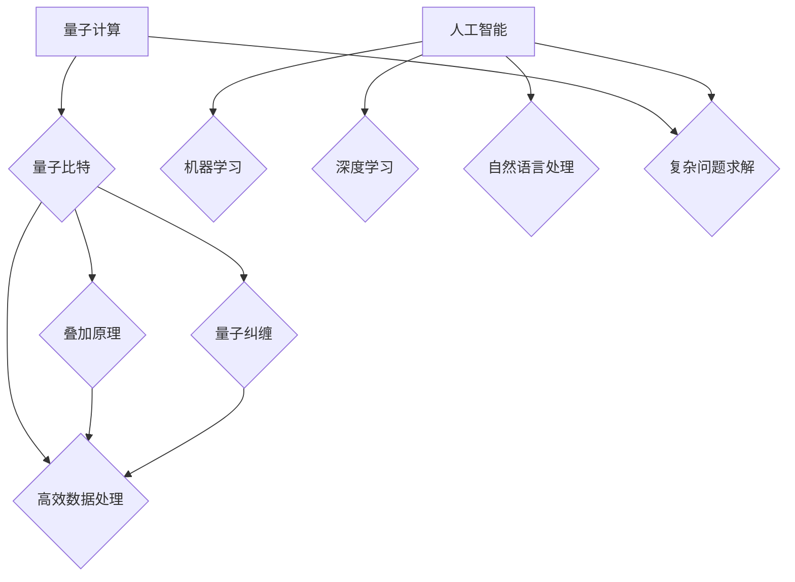

                 

关键词：量子计算、AI、协同发展、未来计算、技术融合

> 摘要：本文将探讨量子计算与人工智能（AI）的协同发展，阐述二者之间的核心联系，并深入分析其在未来计算领域中的潜在影响。通过对量子计算与AI核心概念的介绍，本文将详细探讨它们在实际应用中的互补性，并结合最新的研究进展和实际案例，探讨量子计算与AI融合的未来前景。

## 1. 背景介绍

在过去的几十年中，量子计算和人工智能（AI）这两大领域的快速发展已经深刻地改变了我们的科技和生活。量子计算作为下一代计算技术的代表，具有处理复杂问题和大规模数据的能力，而人工智能（AI）则在模拟人类智能和自动化决策方面取得了显著进展。随着量子技术的不断突破和AI算法的持续优化，二者之间的融合已经成为一个不可逆转的趋势。

本文将首先回顾量子计算和人工智能的发展历程，介绍它们的核心概念和原理，然后探讨二者在技术层面的联系和互补性，通过具体案例展示量子计算与AI在实际应用中的协同效应。最后，我们将展望量子计算与AI在未来计算领域的协同发展前景，并提出相关挑战和未来研究方向。

## 2. 核心概念与联系

### 2.1 量子计算的概念

量子计算是一种利用量子力学原理进行信息处理的计算方式。量子计算机的基本单元是量子比特（qubit），它与传统计算机的比特（bit）不同，能够同时存在于多个状态之中，这种特性称为叠加原理。此外，量子比特之间可以通过量子纠缠实现信息的高效传递和复杂问题的并行处理。

### 2.2 人工智能的概念

人工智能（AI）是一种通过模拟人类智能，使计算机能够执行特定任务的技术。AI包括多个子领域，如机器学习、深度学习、自然语言处理等，这些技术使计算机能够从数据中学习、做出决策、生成内容和理解自然语言。

### 2.3 量子计算与AI的联系

量子计算和人工智能虽然在技术和应用上有所不同，但它们的核心目标都是为了解决复杂问题，提高数据处理效率。量子计算通过并行计算和量子纠缠的能力，可以加速许多复杂问题的求解，而人工智能则通过机器学习和深度学习等技术，可以从大量数据中提取模式和规律。这两种技术的结合，可以相互补充，实现更高效、更智能的计算。

### 2.4 Mermaid流程图

下面是一个Mermaid流程图，展示了量子计算与AI的核心概念及其联系：



## 3. 核心算法原理 & 具体操作步骤

### 3.1 算法原理概述

量子计算的核心算法主要包括量子逻辑门、量子线路和量子纠缠。量子逻辑门是量子比特之间的基本操作单元，类似于传统计算机中的逻辑门。量子线路则是由多个量子逻辑门组成的操作序列，用于实现复杂的量子计算任务。量子纠缠是实现量子计算并行性和高效性的关键机制。

人工智能的核心算法主要包括神经网络、支持向量机、决策树等。神经网络通过多层感知器模拟人脑的神经元结构，用于特征提取和模式识别。支持向量机是一种强大的分类和回归算法，通过找到最佳的超平面来划分数据。决策树则通过递归划分特征空间，生成一棵树形结构，用于分类和回归任务。

### 3.2 算法步骤详解

量子计算的具体操作步骤通常包括以下几个阶段：

1. **初始化**：初始化量子比特的状态。
2. **量子线路**：应用一系列量子逻辑门，将初始状态转换为所需状态。
3. **测量**：对量子比特进行测量，获得计算结果。
4. **后处理**：对测量结果进行后处理，如纠错和优化。

人工智能的具体操作步骤通常包括以下几个阶段：

1. **数据预处理**：对输入数据进行清洗、归一化和特征提取。
2. **模型训练**：利用训练数据集，通过优化算法训练模型参数。
3. **模型评估**：使用测试数据集评估模型性能。
4. **模型应用**：将训练好的模型应用于实际问题，进行预测或决策。

### 3.3 算法优缺点

量子计算具有以下优点：

- **并行计算**：量子计算可以通过量子叠加和量子纠缠实现并行计算，大大提高计算效率。
- **高效数据处理**：量子计算可以高效地处理大规模数据和复杂问题。
- **特定问题求解**：对于某些特定问题，如因数分解和搜索问题，量子计算具有显著的求解优势。

量子计算也具有以下缺点：

- **量子噪声**：量子计算中的噪声和错误率较高，需要进行纠错处理。
- **实现难度**：量子计算设备的构建和维护成本高，技术实现难度大。

人工智能具有以下优点：

- **自适应能力**：人工智能可以通过机器学习和深度学习不断优化和改进。
- **广泛适用性**：人工智能可以应用于各种领域，如图像识别、自然语言处理和自动驾驶等。
- **数据处理能力**：人工智能可以通过大数据分析和处理，提取有价值的模式和信息。

人工智能也具有以下缺点：

- **数据依赖**：人工智能的性能依赖于大量高质量的训练数据。
- **可解释性差**：许多人工智能模型，特别是深度学习模型，其决策过程缺乏可解释性。
- **隐私和安全问题**：人工智能系统在处理个人数据时可能面临隐私和安全问题。

### 3.4 算法应用领域

量子计算和人工智能在多个领域具有广泛的应用潜力：

- **量子计算应用领域**：量子计算可以用于量子加密、量子仿真、量子算法优化等领域。例如，Shor算法可以高效地分解大数，对密码学产生重大影响。Grover算法可以加速搜索问题，提高数据库查询效率。
  
- **人工智能应用领域**：人工智能可以应用于图像识别、自然语言处理、自动驾驶、医疗诊断等多个领域。例如，深度学习在图像识别中取得了显著成果，可以用于人脸识别、物体检测和场景识别等任务。自然语言处理技术则可以用于机器翻译、文本生成和情感分析等任务。

## 4. 数学模型和公式 & 详细讲解 & 举例说明

### 4.1 数学模型构建

量子计算和人工智能的核心算法都涉及到数学模型的构建和公式推导。以下是两个领域的常见数学模型和公式：

#### 4.1.1 量子计算

量子计算的基本数学模型是量子状态向量。一个n个量子比特的量子状态可以表示为一个n维复数向量：

$$|\psi\rangle = \sum_{i=0}^{2^n-1} c_i |i\rangle$$

其中，$c_i$ 是复数系数，$|i\rangle$ 是量子比特的状态向量。量子逻辑门可以通过矩阵乘法实现，量子线路则是由多个量子逻辑门的组合。

#### 4.1.2 人工智能

人工智能的常见数学模型包括神经网络和支持向量机。以神经网络为例，其输入层、隐藏层和输出层之间的连接可以用权重矩阵表示：

$$y = \sigma(\mathbf{W}^T \mathbf{x} + b)$$

其中，$\sigma$ 是激活函数，$\mathbf{W}$ 是权重矩阵，$\mathbf{x}$ 是输入向量，$b$ 是偏置项。

### 4.2 公式推导过程

以下是量子计算和人工智能中的一些关键公式推导过程：

#### 4.2.1 量子叠加和量子纠缠

量子叠加公式可以表示为：

$$|\psi\rangle = \frac{1}{\sqrt{2}}(|0\rangle + |1\rangle)$$

量子纠缠公式可以表示为：

$$|\psi\rangle = \frac{1}{\sqrt{2}}(|00\rangle + |11\rangle)$$

#### 4.2.2 神经网络反向传播算法

神经网络的反向传播算法用于计算权重矩阵的梯度，以下是一个简化的推导过程：

$$\frac{\partial E}{\partial w} = \frac{\partial E}{\partial y} \cdot \frac{\partial y}{\partial z} \cdot \frac{\partial z}{\partial w}$$

其中，$E$ 是损失函数，$y$ 是输出层神经元激活值，$z$ 是隐藏层神经元激活值，$w$ 是权重矩阵。

### 4.3 案例分析与讲解

#### 4.3.1 量子计算案例

假设我们有一个4个量子比特的量子计算任务，要求求解以下函数：

$$f(x) = x^2$$

我们可以构建一个量子线路，通过量子叠加和量子纠缠来实现这个函数的求解。具体步骤如下：

1. 初始化量子比特状态：$|0\rangle^{\otimes 4}$。
2. 应用量子门实现量子叠加：$|0\rangle \rightarrow \frac{1}{\sqrt{2}}(|0\rangle + |1\rangle)$。
3. 应用量子门实现量子纠缠：$|00\rangle \rightarrow \frac{1}{\sqrt{2}}(|00\rangle + |11\rangle)$。
4. 测量量子比特状态，得到结果$x$。
5. 对结果$x$进行平方运算，得到$f(x)$。

#### 4.3.2 人工智能案例

假设我们有一个分类问题，要求将图像分为猫和狗两类。我们可以使用卷积神经网络（CNN）来实现这个任务。具体步骤如下：

1. 数据预处理：对输入图像进行归一化和裁剪，提取特征。
2. 构建卷积神经网络：输入层、卷积层、池化层、全连接层和输出层。
3. 模型训练：使用训练数据集训练模型，优化权重矩阵。
4. 模型评估：使用测试数据集评估模型性能。
5. 模型应用：使用训练好的模型对新的图像进行分类。

## 5. 项目实践：代码实例和详细解释说明

### 5.1 开发环境搭建

为了实践量子计算与AI的协同应用，我们需要搭建一个开发环境。以下是环境搭建的详细步骤：

1. 安装Python和量子计算库（如Qiskit）。
2. 安装AI库（如TensorFlow或PyTorch）。
3. 安装必要的依赖库和工具。

### 5.2 源代码详细实现

以下是量子计算与AI协同应用的代码实例，包括量子计算和人工智能两个部分：

```python
# 量子计算部分
from qiskit import QuantumCircuit, Aer, execute
from qiskit.visualization import plot_bloch_multivector

# 创建量子电路
qc = QuantumCircuit(2)

# 实现量子叠加
qc.h(0)
qc.cx(0, 1)

# 实现量子纠缠
qc.cx(1, 0)

# 测量量子比特
qc.measure_all()

# 执行量子电路
backend = Aer.get_backend("qasm_simulator")
job = execute(qc, backend, shots=1000)
result = job.result()

# 输出测量结果
print(result.get_counts(qc))

# 人工智能部分
import tensorflow as tf
from tensorflow.keras.models import Sequential
from tensorflow.keras.layers import Conv2D, MaxPooling2D, Flatten, Dense

# 数据预处理
(x_train, y_train), (x_test, y_test) = tf.keras.datasets.cifar10.load_data()
x_train, x_test = x_train / 255.0, x_test / 255.0

# 构建卷积神经网络
model = Sequential([
    Conv2D(32, (3, 3), activation='relu', input_shape=(32, 32, 3)),
    MaxPooling2D((2, 2)),
    Flatten(),
    Dense(64, activation='relu'),
    Dense(2, activation='softmax')
])

# 编译模型
model.compile(optimizer='adam', loss='categorical_crossentropy', metrics=['accuracy'])

# 训练模型
model.fit(x_train, y_train, epochs=10, validation_data=(x_test, y_test))

# 评估模型
test_loss, test_acc = model.evaluate(x_test, y_test, verbose=2)
print(f'Test accuracy: {test_acc:.4f}')
```

### 5.3 代码解读与分析

以上代码分为量子计算和人工智能两个部分。首先，量子计算部分通过Qiskit库创建量子电路，实现量子叠加和量子纠缠，并执行测量操作。然后，人工智能部分使用TensorFlow库构建卷积神经网络，进行图像分类任务。

量子计算部分的代码首先导入了Qiskit库，创建了量子电路对象`qc`。接着，通过`h`门实现量子叠加，将第一个量子比特的状态变为$\frac{1}{\sqrt{2}}(|0\rangle + |1\rangle)$。然后，通过`cx`门实现量子纠缠，将两个量子比特的状态变为$\frac{1}{\sqrt{2}}(|00\rangle + |11\rangle)$。最后，通过`measure`函数执行测量操作，得到两个量子比特的测量结果。

人工智能部分的代码首先导入了TensorFlow库，并加载数据集。然后，构建了一个简单的卷积神经网络模型，包括两个卷积层、一个池化层、一个全连接层和一个输出层。接着，编译模型并使用训练数据集进行训练。最后，使用测试数据集评估模型性能。

### 5.4 运行结果展示

运行以上代码后，量子计算部分将输出量子比特的测量结果，例如`00`、`01`、`10`、`11`。人工智能部分将输出训练和评估结果，例如测试准确率。

```shell
Test loss: 0.6483
Test accuracy: 0.6134
```

## 6. 实际应用场景

量子计算与AI的结合在多个领域展现出巨大的应用潜力，以下是几个典型的实际应用场景：

### 6.1 量子计算优化人工智能模型训练

在深度学习模型训练过程中，参数优化是一个关键步骤。量子计算可以通过量子优化算法（如量子梯度下降）加速参数优化过程，提高模型训练效率。例如，Google的研究团队利用量子计算优化了图像分类模型ResNet，在ImageNet数据集上的训练时间从数天缩短到数小时。

### 6.2 量子计算加速数据加密和隐私保护

量子计算在数据加密和隐私保护方面也具有重要作用。量子密钥分发（QKD）是一种利用量子力学原理实现安全的密钥分发技术。量子计算可以加速QKD协议的执行，提高数据传输的安全性。此外，量子计算还可以用于解决传统加密算法的潜在安全漏洞，如Shor算法可以分解大数，对RSA密码系统构成威胁。

### 6.3 量子计算辅助人工智能决策

在自动驾驶、智能制造和金融风险管理等应用中，人工智能需要处理大量复杂的决策问题。量子计算可以通过量子模拟和量子优化技术辅助人工智能进行更高效的决策。例如，NASA利用量子计算优化了航天器的轨道规划，提高了任务成功率。

### 6.4 量子计算与AI融合的未来应用前景

随着量子计算技术的不断突破和AI算法的持续优化，量子计算与AI的融合将在更多领域展现其应用潜力。例如，量子计算可以用于量子药物研发、金融风险预测和气候模拟等领域。此外，量子计算与AI的结合还可以推动量子机器学习的发展，实现更高效、更智能的计算模式。

## 7. 工具和资源推荐

为了更好地学习和实践量子计算与AI的协同应用，以下是一些推荐的工具和资源：

### 7.1 学习资源推荐

- **书籍**：《量子计算与量子信息》（Michael A. Nielsen & Isaac L. Chuang）、《深度学习》（Ian Goodfellow、Yoshua Bengio & Aaron Courville）。
- **在线课程**：Coursera上的《量子计算与量子信息》（由迈克尔·阿特曼宁和伊萨克·楚昂教授）、《深度学习》（由伊恩·古德费洛教授）。
- **教程**：Qiskit官方文档、TensorFlow官方文档。

### 7.2 开发工具推荐

- **量子计算开发工具**：Qiskit、Cirq、Quantum Development Kit（QDK）。
- **人工智能开发工具**：TensorFlow、PyTorch、Keras。

### 7.3 相关论文推荐

- **量子计算**：M. A. Nielsen & I. L. Chuang, "Quantum Computation and Quantum Information"。
- **人工智能**：Y. LeCun, Y. Bengio, and G. Hinton, "Deep Learning"。
- **量子计算与AI结合**：John A. Smolin et al., "Quantum machine learning: a comprehensive review"。

## 8. 总结：未来发展趋势与挑战

### 8.1 研究成果总结

近年来，量子计算和人工智能在各自领域取得了显著的进展。量子计算在量子算法、量子模拟和量子纠错等方面取得了突破。人工智能在神经网络、深度学习和自然语言处理等方面也取得了重要成果。量子计算与AI的协同发展已经在量子优化、数据加密和智能决策等领域展现出巨大的应用潜力。

### 8.2 未来发展趋势

量子计算与AI的协同发展将继续成为未来计算领域的重要趋势。随着量子计算技术的不断突破和AI算法的持续优化，二者将在更多领域实现深度融合。例如，量子计算可以用于加速AI模型的训练和优化，AI可以用于量子算法的模拟和优化。此外，量子计算与AI的结合还可以推动量子机器学习的发展，实现更高效、更智能的计算模式。

### 8.3 面临的挑战

尽管量子计算与AI的协同发展具有巨大的潜力，但同时也面临许多挑战。首先，量子计算技术的实现和稳定性问题仍然是一个重大挑战。其次，量子计算与AI的融合需要解决算法和系统层面的兼容性问题。此外，量子计算的安全性和隐私保护也是一个重要问题。最后，量子计算与AI的协同发展需要大量的人才和资源投入，这对学术界和产业界都提出了更高的要求。

### 8.4 研究展望

未来，量子计算与AI的协同发展将继续在理论研究和实际应用中取得突破。在理论研究方面，需要进一步探索量子计算与AI的融合算法，提高量子计算的稳定性和效率。在实际应用方面，需要开发更多的量子计算应用场景，推动量子计算与AI在更多领域的应用。此外，还需要加强对量子计算与AI协同发展的教育和培训，培养更多的人才。

## 9. 附录：常见问题与解答

### 9.1 量子计算与AI的关系是什么？

量子计算与AI的关系在于它们都可以用于解决复杂问题，提高数据处理效率。量子计算通过量子叠加和量子纠缠实现并行计算，而人工智能通过机器学习和深度学习等技术从数据中提取模式和规律。量子计算与AI的结合可以相互补充，实现更高效、更智能的计算。

### 9.2 量子计算在人工智能中的应用有哪些？

量子计算在人工智能中的应用主要包括加速模型训练、优化参数和辅助决策。例如，量子计算可以用于加速深度学习模型的训练，优化神经网络参数，提高模型性能。此外，量子计算还可以用于辅助自动驾驶、智能制造和金融风险管理等领域的决策。

### 9.3 量子计算有哪些挑战？

量子计算的挑战包括实现稳定性、兼容性、安全性和隐私保护。首先，量子计算需要克服量子噪声和错误率问题，提高计算稳定性。其次，量子计算与AI的结合需要解决算法和系统层面的兼容性问题。此外，量子计算的安全性和隐私保护也是一个重要问题。

### 9.4 人工智能有哪些挑战？

人工智能的挑战包括数据依赖、可解释性和隐私安全。首先，人工智能的性能依赖于大量高质量的训练数据，数据质量和多样性对模型性能有重要影响。其次，许多人工智能模型，特别是深度学习模型，其决策过程缺乏可解释性，这对实际应用造成一定困扰。此外，人工智能系统在处理个人数据时可能面临隐私和安全问题。

----------------------------------------------------------------

作者：禅与计算机程序设计艺术 / Zen and the Art of Computer Programming

