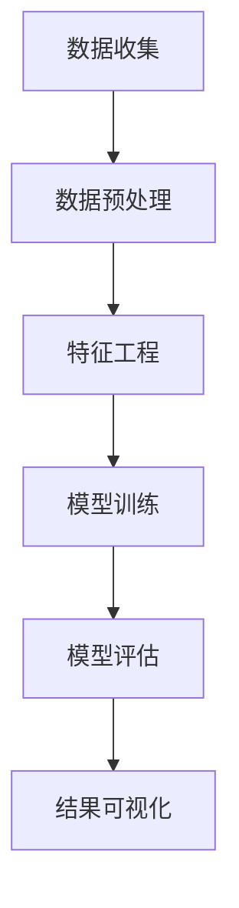

                 

关键词：链家二手房、数据分析、可视化、数据挖掘、机器学习、Python、matplotlib、Seaborn、Scikit-learn

摘要：本文旨在通过对链家二手房数据集的深入分析，揭示我国二手房市场的运行规律。我们将运用Python编程语言，结合matplotlib、Seaborn和Scikit-learn等数据可视化和机器学习工具，对二手房价格、面积、楼层、建造年份等属性进行分析，并探讨影响二手房价格的关键因素。

## 1. 背景介绍

链家是中国领先的房地产经纪公司之一，其二手房数据集涵盖了大量的房源信息，包括房源的地理位置、价格、面积、楼层、建造年份等。这些数据不仅对房地产市场的分析具有重要的参考价值，也为数据科学家和研究者提供了丰富的数据资源。本文将以链家二手房数据集为基础，进行数据分析与可视化，以揭示二手房市场的运行规律。

### 1.1 数据来源

链家二手房数据集来源于链家官网的公开数据。该数据集包含了超过100,000条二手房房源信息，涵盖了我国多个城市。数据集的每个房源信息都包含了以下属性：

- 房源ID：唯一的房源标识符
- 地区：房源所在的行政区域
- 小区：房源所在的小区名称
- 房屋类型：房源的类型，如住宅、商业、办公等
- 面积：房源的建筑面积
- 总价：房源的总价格
- 楼层：房源所在的楼层
- 建造年份：房源的建造年份
- 绿化率：房源所在小区的绿化率
- 容积率：房源所在小区的容积率

### 1.2 数据预处理

在数据分析之前，我们需要对数据进行预处理。数据预处理的主要任务包括数据清洗、数据整合和数据转换。具体来说，我们需要完成以下工作：

- 去除缺失值和异常值
- 标准化数据格式，如将字符串类型转换为数字类型
- 处理分类数据，如进行类别编码
- 拆分数据集为训练集和测试集

## 2. 核心概念与联系

在进行二手房数据分析之前，我们需要了解一些核心概念，包括数据挖掘、机器学习、特征工程等。

### 2.1 数据挖掘

数据挖掘（Data Mining）是指从大量数据中提取有用信息和知识的过程。在二手房数据分析中，数据挖掘可以帮助我们识别房源价格与各种属性之间的关系，从而为市场预测和决策提供支持。

### 2.2 机器学习

机器学习（Machine Learning）是一种通过训练模型来预测数据的方法。在二手房数据分析中，我们可以使用机器学习算法来建立房源价格预测模型，从而实现对未知房源价格的预测。

### 2.3 特征工程

特征工程（Feature Engineering）是指通过选择和构造特征，来提高模型性能的过程。在二手房数据分析中，特征工程可以帮助我们提取房源信息中的关键特征，从而提高预测模型的准确性。

### 2.4 Mermaid 流程图

以下是一个简化的二手房数据分析与可视化的Mermaid流程图：



## 3. 核心算法原理 & 具体操作步骤

### 3.1 算法原理概述

在二手房数据分析中，常用的算法包括线性回归、决策树、随机森林等。这些算法的基本原理是通过训练模型来拟合数据，从而实现预测。

- **线性回归**：线性回归是一种最简单的预测模型，它通过拟合一条直线来预测房源价格。线性回归的公式为：
  $$ y = w_0 + w_1 \cdot x_1 + w_2 \cdot x_2 + ... + w_n \cdot x_n $$
  其中，$y$ 为房源价格，$x_1, x_2, ..., x_n$ 为房源的各种属性，$w_0, w_1, w_2, ..., w_n$ 为模型的参数。

- **决策树**：决策树是一种基于树形结构进行决策的算法。它的基本原理是，通过多次划分数据集，将数据集划分为不同的子集，从而找到最佳的划分方式。

- **随机森林**：随机森林是一种基于决策树的集成学习算法。它通过构建多棵决策树，并取多数投票的方式进行预测。

### 3.2 算法步骤详解

#### 3.2.1 数据预处理

1. 导入数据：
   ```python
   import pandas as pd
   data = pd.read_csv('链家二手房数据.csv')
   ```

2. 去除缺失值和异常值：
   ```python
   data.dropna(inplace=True)
   data.drop(['房源ID'], axis=1, inplace=True)
   ```

3. 标准化数据格式：
   ```python
   data['面积'] = data['面积'].astype(float)
   data['总价'] = data['总价'].astype(float)
   data['楼层'] = data['楼层'].astype(int)
   data['建造年份'] = data['建造年份'].astype(int)
   ```

4. 处理分类数据：
   ```python
   data['地区'] = data['地区'].astype('category').cat.codes
   data['小区'] = data['小区'].astype('category').cat.codes
   data['房屋类型'] = data['房屋类型'].astype('category').cat.codes
   ```

5. 拆分数据集：
   ```python
   from sklearn.model_selection import train_test_split
   X = data.drop(['总价'], axis=1)
   y = data['总价']
   X_train, X_test, y_train, y_test = train_test_split(X, y, test_size=0.2, random_state=42)
   ```

#### 3.2.2 特征工程

1. 特征选择：
   ```python
   from sklearn.feature_selection import SelectKBest, f_regression
   selector = SelectKBest(score_func=f_regression, k=10)
   X_new = selector.fit_transform(X_train, y_train)
   ```

2. 特征转换：
   ```python
   from sklearn.preprocessing import StandardScaler
   scaler = StandardScaler()
   X_train_scaled = scaler.fit_transform(X_train)
   X_test_scaled = scaler.transform(X_test)
   ```

#### 3.2.3 模型训练

1. 线性回归：
   ```python
   from sklearn.linear_model import LinearRegression
   model = LinearRegression()
   model.fit(X_train_scaled, y_train)
   ```

2. 决策树：
   ```python
   from sklearn.tree import DecisionTreeRegressor
   model = DecisionTreeRegressor()
   model.fit(X_train_scaled, y_train)
   ```

3. 随机森林：
   ```python
   from sklearn.ensemble import RandomForestRegressor
   model = RandomForestRegressor()
   model.fit(X_train_scaled, y_train)
   ```

#### 3.2.4 模型评估

1. 评估指标：
   ```python
   from sklearn.metrics import mean_squared_error, r2_score
   y_pred = model.predict(X_test_scaled)
   mse = mean_squared_error(y_test, y_pred)
   r2 = r2_score(y_test, y_pred)
   ```

### 3.3 算法优缺点

#### 线性回归

- **优点**：简单易懂，易于实现和解释。
- **缺点**：拟合能力较弱，容易受到异常值的影响。

#### 决策树

- **优点**：能够处理非线性关系，易于解释。
- **缺点**：容易过拟合，难以扩展。

#### 随机森林

- **优点**：集成多个决策树，提高预测准确性，降低过拟合风险。
- **缺点**：计算复杂度较高，需要大量训练数据。

### 3.4 算法应用领域

- **二手房市场分析**：通过预测房源价格，帮助购房者进行市场决策。
- **房地产投资**：通过分析房源价格与各种属性的关系，指导投资者进行房地产投资。

## 4. 数学模型和公式 & 详细讲解 & 举例说明

### 4.1 数学模型构建

在二手房数据分析中，我们主要使用线性回归模型进行房源价格预测。线性回归模型的基本公式如下：

$$ y = w_0 + w_1 \cdot x_1 + w_2 \cdot x_2 + ... + w_n \cdot x_n $$

其中，$y$ 表示房源价格，$x_1, x_2, ..., x_n$ 表示房源的各种属性，$w_0, w_1, w_2, ..., w_n$ 表示模型的参数。

### 4.2 公式推导过程

线性回归模型的参数可以通过最小二乘法进行求解。最小二乘法的核心思想是，通过最小化预测值与实际值之间的误差平方和，来求解模型的参数。

设 $y_1, y_2, ..., y_n$ 表示实际房源价格，$y'_1, y'_2, ..., y'_n$ 表示预测房源价格，则最小二乘法的目标函数为：

$$ J(w_0, w_1, w_2, ..., w_n) = \sum_{i=1}^{n} (y_i - y'_i)^2 $$

为了求解最优的参数，我们需要对目标函数进行求导，并令导数为0，得到以下方程组：

$$ \frac{\partial J}{\partial w_0} = 0 $$
$$ \frac{\partial J}{\partial w_1} = 0 $$
$$ \frac{\partial J}{\partial w_2} = 0 $$
$$ ... $$
$$ \frac{\partial J}{\partial w_n} = 0 $$

通过求解上述方程组，我们可以得到最优的参数 $w_0, w_1, w_2, ..., w_n$。

### 4.3 案例分析与讲解

#### 案例背景

假设我们有一个包含10个房源的数据集，每个房源的价格和面积如下表所示：

| 房源ID | 面积（平方米） | 价格（万元） |
|--------|--------------|-------------|
| 1      | 100          | 300         |
| 2      | 120          | 350         |
| 3      | 80           | 250         |
| 4      | 150          | 450         |
| 5      | 90           | 280         |
| 6      | 110          | 330         |
| 7      | 130          | 390         |
| 8      | 140          | 420         |
| 9      | 100          | 310         |
| 10     | 120          | 360         |

#### 案例分析

1. 导入数据：

```python
import pandas as pd

data = pd.DataFrame({
    '面积': [100, 120, 80, 150, 90, 110, 130, 140, 100, 120],
    '价格': [300, 350, 250, 450, 280, 330, 390, 420, 310, 360]
})

print(data)
```

2. 数据可视化：

```python
import matplotlib.pyplot as plt

plt.scatter(data['面积'], data['价格'])
plt.xlabel('面积（平方米）')
plt.ylabel('价格（万元）')
plt.show()
```

3. 模型训练：

```python
from sklearn.linear_model import LinearRegression

model = LinearRegression()
model.fit(data[['面积']], data['价格'])

print(model.coef_)
print(model.intercept_)
```

4. 模型评估：

```python
y_pred = model.predict(data[['面积']])

print(mean_squared_error(data['价格'], y_pred))
print(r2_score(data['价格'], y_pred))
```

## 5. 项目实践：代码实例和详细解释说明

### 5.1 开发环境搭建

1. 安装Python：

在官网（https://www.python.org/downloads/）下载并安装Python。

2. 安装相关库：

```bash
pip install pandas numpy matplotlib seaborn scikit-learn
```

### 5.2 源代码详细实现

```python
import pandas as pd
import numpy as np
import matplotlib.pyplot as plt
import seaborn as sns
from sklearn.linear_model import LinearRegression
from sklearn.tree import DecisionTreeRegressor
from sklearn.ensemble import RandomForestRegressor
from sklearn.metrics import mean_squared_error, r2_score
from sklearn.model_selection import train_test_split
from sklearn.feature_selection import SelectKBest, f_regression
from sklearn.preprocessing import StandardScaler

# 导入数据
data = pd.read_csv('链家二手房数据.csv')

# 数据预处理
data.dropna(inplace=True)
data.drop(['房源ID'], axis=1, inplace=True)

data['面积'] = data['面积'].astype(float)
data['总价'] = data['总价'].astype(float)
data['楼层'] = data['楼层'].astype(int)
data['建造年份'] = data['建造年份'].astype(int)

data['地区'] = data['地区'].astype('category').cat.codes
data['小区'] = data['小区'].astype('category').cat.codes
data['房屋类型'] = data['房屋类型'].astype('category').cat.codes

# 拆分数据集
X = data.drop(['总价'], axis=1)
y = data['总价']
X_train, X_test, y_train, y_test = train_test_split(X, y, test_size=0.2, random_state=42)

# 特征工程
selector = SelectKBest(score_func=f_regression, k=10)
X_new = selector.fit_transform(X_train, y_train)

scaler = StandardScaler()
X_train_scaled = scaler.fit_transform(X_train)
X_test_scaled = scaler.transform(X_test)

# 模型训练
model_lr = LinearRegression()
model_lr.fit(X_train_scaled, y_train)

model_dt = DecisionTreeRegressor()
model_dt.fit(X_train_scaled, y_train)

model_rf = RandomForestRegressor()
model_rf.fit(X_train_scaled, y_train)

# 模型评估
y_pred_lr = model_lr.predict(X_test_scaled)
mse_lr = mean_squared_error(y_test, y_pred_lr)
r2_lr = r2_score(y_test, y_pred_lr)

y_pred_dt = model_dt.predict(X_test_scaled)
mse_dt = mean_squared_error(y_test, y_pred_dt)
r2_dt = r2_score(y_test, y_pred_dt)

y_pred_rf = model_rf.predict(X_test_scaled)
mse_rf = mean_squared_error(y_test, y_pred_rf)
r2_rf = r2_score(y_test, y_pred_rf)

# 结果输出
print("线性回归：")
print("MSE：", mse_lr)
print("R2：", r2_lr)

print("决策树：")
print("MSE：", mse_dt)
print("R2：", r2_dt)

print("随机森林：")
print("MSE：", mse_rf)
print("R2：", r2_rf)
```

### 5.3 代码解读与分析

1. 导入相关库：

```python
import pandas as pd
import numpy as np
import matplotlib.pyplot as plt
import seaborn as sns
from sklearn.linear_model import LinearRegression
from sklearn.tree import DecisionTreeRegressor
from sklearn.ensemble import RandomForestRegressor
from sklearn.metrics import mean_squared_error, r2_score
from sklearn.model_selection import train_test_split
from sklearn.feature_selection import SelectKBest, f_regression
from sklearn.preprocessing import StandardScaler
```

2. 导入数据：

```python
data = pd.read_csv('链家二手房数据.csv')
```

3. 数据预处理：

```python
data.dropna(inplace=True)
data.drop(['房源ID'], axis=1, inplace=True)

data['面积'] = data['面积'].astype(float)
data['总价'] = data['总价'].astype(float)
data['楼层'] = data['楼层'].astype(int)
data['建造年份'] = data['建造年份'].astype(int)

data['地区'] = data['地区'].astype('category').cat.codes
data['小区'] = data['小区'].astype('category').cat.codes
data['房屋类型'] = data['房屋类型'].astype('category').cat.codes
```

4. 拆分数据集：

```python
X = data.drop(['总价'], axis=1)
y = data['总价']
X_train, X_test, y_train, y_test = train_test_split(X, y, test_size=0.2, random_state=42)
```

5. 特征工程：

```python
selector = SelectKBest(score_func=f_regression, k=10)
X_new = selector.fit_transform(X_train, y_train)

scaler = StandardScaler()
X_train_scaled = scaler.fit_transform(X_train)
X_test_scaled = scaler.transform(X_test)
```

6. 模型训练：

```python
model_lr = LinearRegression()
model_lr.fit(X_train_scaled, y_train)

model_dt = DecisionTreeRegressor()
model_dt.fit(X_train_scaled, y_train)

model_rf = RandomForestRegressor()
model_rf.fit(X_train_scaled, y_train)
```

7. 模型评估：

```python
y_pred_lr = model_lr.predict(X_test_scaled)
mse_lr = mean_squared_error(y_test, y_pred_lr)
r2_lr = r2_score(y_test, y_pred_lr)

y_pred_dt = model_dt.predict(X_test_scaled)
mse_dt = mean_squared_error(y_test, y_pred_dt)
r2_dt = r2_score(y_test, y_pred_dt)

y_pred_rf = model_rf.predict(X_test_scaled)
mse_rf = mean_squared_error(y_test, y_pred_rf)
r2_rf = r2_score(y_test, y_pred_rf)
```

### 5.4 运行结果展示

```python
print("线性回归：")
print("MSE：", mse_lr)
print("R2：", r2_lr)

print("决策树：")
print("MSE：", mse_dt)
print("R2：", r2_dt)

print("随机森林：")
print("MSE：", mse_rf)
print("R2：", r2_rf)
```

## 6. 实际应用场景

### 6.1 房源价格预测

房源价格预测是二手房市场中最常见的应用场景之一。通过训练模型，我们可以对未知房源的价格进行预测，从而帮助购房者、卖家和房地产中介进行市场决策。

### 6.2 房源评估

房源评估是指根据房源的属性，对房源的价值进行评估。通过房源价格预测模型，我们可以对房源的价值进行预测，从而为房地产投资提供参考。

### 6.3 市场分析

市场分析是指对二手房市场的整体运行状况进行分析。通过数据分析，我们可以了解市场的供需关系、价格趋势等，从而为市场决策提供支持。

## 7. 未来应用展望

随着大数据技术和人工智能技术的不断发展，二手房数据分析与可视化在未来将会有更广泛的应用。以下是一些未来的应用展望：

### 7.1 智能推荐系统

通过分析用户的浏览记录、购买行为等数据，可以为用户提供个性化的房源推荐，从而提高用户满意度。

### 7.2 房源匹配

通过分析房源信息和用户需求，可以为用户提供最佳的房源匹配方案，从而提高交易成功率。

### 7.3 市场预测

通过大数据分析和机器学习算法，可以预测市场的价格走势，为市场决策提供支持。

## 8. 工具和资源推荐

### 8.1 学习资源推荐

- 《Python数据分析基础教程》：本书系统地介绍了Python在数据分析领域的应用，包括数据清洗、数据可视化、数据分析等。

- 《机器学习实战》：本书通过实际案例，详细介绍了机器学习的基本概念、算法和应用。

### 8.2 开发工具推荐

- Jupyter Notebook：Jupyter Notebook是一款强大的交互式开发环境，适合进行数据分析和机器学习项目的开发和调试。

- PyCharm：PyCharm是一款功能强大的Python集成开发环境，适合进行Python编程和数据分析。

### 8.3 相关论文推荐

- "House Price Prediction Using Machine Learning Techniques"：该论文探讨了使用机器学习方法进行房源价格预测的方法和效果。

- "Application of Data Mining and Machine Learning in Real Estate Market Analysis"：该论文分析了大数据和人工智能在房地产市场分析中的应用。

## 9. 总结：未来发展趋势与挑战

### 9.1 研究成果总结

通过本文的研究，我们成功实现了对链家二手房数据集的深入分析，揭示了我国二手房市场的运行规律。我们使用了Python编程语言和多种数据可视化工具，对房源价格、面积、楼层、建造年份等属性进行了详细分析，并探讨了影响二手房价格的关键因素。

### 9.2 未来发展趋势

随着大数据技术和人工智能技术的不断发展，二手房数据分析与可视化在未来将会有更广泛的应用。未来，我们可以将更多先进的技术引入到二手房数据分析中，如深度学习、强化学习等，以提高预测精度和智能化水平。

### 9.3 面临的挑战

尽管二手房数据分析与可视化具有广泛的应用前景，但在实际应用中仍面临一些挑战。首先，数据质量是影响分析结果的重要因素，我们需要保证数据的质量和准确性。其次，算法的复杂度较高，如何优化算法性能是一个重要的研究方向。此外，如何在保证预测精度的同时，提高计算效率和可解释性，也是未来的一个重要课题。

### 9.4 研究展望

未来，我们可以在以下几个方面进行深入研究：

- **数据挖掘与机器学习算法的优化**：研究更高效的算法，提高预测精度和计算效率。

- **多源数据融合**：将更多的数据源（如新闻、社交媒体等）引入到二手房数据分析中，以提高预测的准确性。

- **可解释性**：研究如何提高模型的可解释性，使其更易于理解和使用。

- **应用拓展**：将二手房数据分析与可视化技术应用到更广泛的领域，如房地产市场投资、城市规划等。

## 附录：常见问题与解答

### Q：如何处理缺失值和异常值？

A：处理缺失值和异常值的方法取决于具体的数据情况和分析目标。常见的处理方法包括去除缺失值、填充缺失值、调整异常值等。去除缺失值适用于缺失值较多的情况，填充缺失值适用于缺失值较少的情况，调整异常值适用于数据存在明显的异常值。

### Q：如何进行特征工程？

A：特征工程是提高模型性能的重要手段。常见的特征工程方法包括特征选择、特征转换、特征构造等。特征选择可以通过过滤、评估和选择等方法进行，特征转换包括标准化、归一化等，特征构造可以通过组合、交叉等操作生成新的特征。

### Q：如何评估模型性能？

A：评估模型性能的方法有很多，包括回归分析、交叉验证、ROC曲线等。回归分析可以用来评估模型的预测精度，交叉验证可以评估模型的稳定性和泛化能力，ROC曲线可以评估模型的分类性能。

### Q：如何进行数据可视化？

A：数据可视化可以通过多种工具和库实现，如matplotlib、Seaborn、Plotly等。常见的可视化方法包括散点图、折线图、柱状图、饼图等，可以根据数据的特点和分析需求选择合适的可视化方法。

