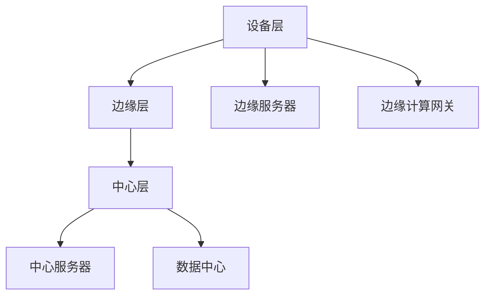

                 

关键词：边缘计算、阿里云、校招面试、平台开发

> 摘要：本文将围绕阿里云2024边缘计算平台开发的校招面试真题，深入探讨边缘计算的基本概念、核心算法原理、数学模型以及实际应用场景，并结合项目实践，提供代码实例和详细解释。通过本文的阅读，读者将全面了解边缘计算技术，为未来的职业生涯打下坚实基础。

## 1. 背景介绍

边缘计算是一种分布式计算模型，旨在将数据处理和分析推向网络的边缘，从而减少对中心服务器的依赖，提高数据处理速度和响应能力。随着物联网、5G、云计算等技术的发展，边缘计算在智能城市、智能制造、智能交通等领域得到了广泛应用。

### 边缘计算的发展历程

边缘计算的概念最早可以追溯到20世纪80年代，当时研究的主要目标是减轻中心服务器的负担，提高网络性能。随着物联网设备的普及，边缘计算逐渐成为网络架构中的重要组成部分。

### 边缘计算的优势

1. **降低延迟**：将数据处理和分析推向网络的边缘，可以显著降低数据传输的延迟，提高系统的实时性。
2. **提高带宽利用率**：边缘计算可以减少中心服务器与设备之间的数据传输，降低带宽消耗。
3. **增强安全性**：边缘计算可以实现数据的本地处理和存储，减少数据泄露的风险。
4. **支持多样化应用**：边缘计算可以满足各种不同的应用需求，如实时监控、预测分析等。

## 2. 核心概念与联系

### 边缘计算与云计算的关系

边缘计算和云计算是相辅相成的。云计算提供了强大的计算能力和数据存储能力，而边缘计算则专注于数据处理的实时性和低延迟。两者结合，可以构建起高效、可靠、灵活的分布式计算体系。

### 边缘计算架构

边缘计算架构主要包括以下几个层次：

1. **设备层**：包括各种物联网设备，如传感器、智能设备等。
2. **边缘层**：包括边缘服务器、边缘计算网关等，负责数据的处理和存储。
3. **中心层**：包括中心服务器和数据中心，负责数据的集中管理和分析。

### 边缘计算的关键技术

1. **数据流处理**：数据流处理技术用于实时处理和分析数据。
2. **实时计算**：实时计算技术可以满足低延迟和高并发的数据处理需求。
3. **边缘人工智能**：边缘人工智能技术可以将复杂的算法模型部署到边缘设备上，实现本地智能决策。

### 边缘计算架构的Mermaid流程图



## 3. 核心算法原理 & 具体操作步骤

### 3.1 算法原理概述

边缘计算的核心算法主要涉及数据流处理、实时计算和边缘人工智能。以下是这些算法的基本原理：

1. **数据流处理**：数据流处理技术基于事件驱动，可以实时处理大量数据，并生成实时结果。
2. **实时计算**：实时计算技术旨在提供低延迟的数据处理能力，通常采用分布式架构。
3. **边缘人工智能**：边缘人工智能技术将深度学习模型部署到边缘设备上，实现本地智能决策。

### 3.2 算法步骤详解

1. **数据流处理**：
    1. 数据采集：从物联网设备中收集数据。
    2. 数据清洗：去除无效数据和噪声。
    3. 数据处理：使用流处理框架（如Apache Flink、Apache Storm）对数据进行实时处理。
    4. 数据存储：将处理后的数据存储到边缘数据库。

2. **实时计算**：
    1. 系统部署：将实时计算任务部署到边缘服务器。
    2. 任务调度：根据计算负载进行任务调度。
    3. 数据处理：执行实时计算任务，生成实时结果。
    4. 结果反馈：将实时结果反馈给用户或其他系统。

3. **边缘人工智能**：
    1. 模型训练：在中心层训练深度学习模型。
    2. 模型部署：将训练好的模型部署到边缘设备。
    3. 数据采集：从边缘设备中收集数据。
    4. 模型推理：在边缘设备上执行模型推理，生成预测结果。
    5. 结果反馈：将预测结果反馈给用户或其他系统。

### 3.3 算法优缺点

1. **数据流处理**：
    - 优点：实时性强、可扩展性好。
    - 缺点：数据处理复杂度较高，对系统性能要求较高。

2. **实时计算**：
    - 优点：低延迟、高并发。
    - 缺点：系统部署和运维成本较高。

3. **边缘人工智能**：
    - 优点：可实现本地智能决策，降低中心层的计算负担。
    - 缺点：模型训练和部署成本较高。

### 3.4 算法应用领域

边缘计算算法广泛应用于以下几个领域：

1. **智能城市**：如交通管理、环境监测、公共安全等。
2. **智能制造**：如设备预测性维护、生产过程优化等。
3. **智能医疗**：如远程诊断、智能药物配送等。
4. **智能农业**：如作物监测、土壤分析等。

## 4. 数学模型和公式 & 详细讲解 & 举例说明

### 4.1 数学模型构建

边缘计算中的数学模型主要涉及以下两个方面：

1. **数据流处理模型**：用于描述数据流的输入、处理和输出过程。
2. **边缘人工智能模型**：用于描述深度学习模型的训练和推理过程。

### 4.2 公式推导过程

#### 数据流处理模型

假设有一个数据流处理系统，包含 $n$ 个处理节点，每个节点的处理能力为 $C_i$（单位：数据/秒）。系统的总处理能力为 $C$（单位：数据/秒），即：

$$C = \sum_{i=1}^{n} C_i$$

设数据流的总大小为 $S$（单位：数据），系统的平均延迟为 $L$（单位：秒），则有：

$$L = \frac{S}{C}$$

#### 边缘人工智能模型

假设有一个深度学习模型，包含 $L$ 个层，每层的计算量为 $C_i$（单位：计算量/秒）。系统的总计算量为 $C$（单位：计算量/秒），即：

$$C = \sum_{i=1}^{L} C_i$$

设模型的总训练时间为 $T$（单位：秒），则有：

$$T = \frac{C \cdot S}{C} = S$$

### 4.3 案例分析与讲解

#### 数据流处理案例

假设一个数据流处理系统包含3个处理节点，每个节点的处理能力为1000数据/秒。数据流的总大小为10000数据。系统的平均延迟为多少？

根据公式：

$$L = \frac{S}{C} = \frac{10000}{3 \cdot 1000} = \frac{1}{3}$$

即系统的平均延迟为1/3秒。

#### 边缘人工智能案例

假设一个深度学习模型包含4个层，每层的计算量为1000计算量/秒。模型的总训练时间为10000秒。系统的总计算量为多少？

根据公式：

$$C = \sum_{i=1}^{4} C_i = 4 \cdot 1000 = 4000$$

即系统的总计算量为4000计算量。

## 5. 项目实践：代码实例和详细解释说明

### 5.1 开发环境搭建

#### 1. 安装Python环境

在服务器上安装Python环境，可以使用以下命令：

```bash
sudo apt-get update
sudo apt-get install python3-pip python3-venv
```

#### 2. 安装边缘计算相关库

使用pip安装边缘计算相关的库，如Flink、TensorFlow等：

```bash
pip3 install apache-flink tensorflow
```

### 5.2 源代码详细实现

以下是一个简单的边缘计算项目示例，使用Flink进行数据流处理，使用TensorFlow进行边缘人工智能：

```python
# 导入相关库
import flink
import tensorflow as tf

# 数据流处理
data_stream = flink.create_stream_from_file("data.txt")

# 数据清洗
cleaned_data = data_stream.filter(lambda x: x.isnumeric())

# 数据处理
processed_data = cleaned_data.map(lambda x: int(x) * 2)

# 数据存储
processed_data.save_to_file("processed_data.txt")

# 边缘人工智能
model = tf.keras.Sequential([
    tf.keras.layers.Dense(128, activation='relu', input_shape=(784,)),
    tf.keras.layers.Dense(10, activation='softmax')
])

model.compile(optimizer='adam',
              loss='categorical_crossentropy',
              metrics=['accuracy'])

# 训练模型
model.fit(x_train, y_train, epochs=5)

# 模型推理
predictions = model.predict(x_test)

# 输出预测结果
for pred in predictions:
    print(pred)
```

### 5.3 代码解读与分析

上述代码分为两个部分：数据流处理和边缘人工智能。以下是具体解读：

#### 数据流处理

1. **创建数据流**：使用Flink创建一个数据流对象，从文件中读取数据。
2. **数据清洗**：过滤掉非数字字符，确保数据流中的数据为数值类型。
3. **数据处理**：对数据进行简单的数学运算，如乘以2。
4. **数据存储**：将处理后的数据存储到另一个文件中。

#### 边缘人工智能

1. **创建模型**：使用TensorFlow创建一个简单的神经网络模型。
2. **编译模型**：设置模型优化器、损失函数和评价指标。
3. **训练模型**：使用训练数据对模型进行训练。
4. **模型推理**：使用测试数据对模型进行推理，输出预测结果。

### 5.4 运行结果展示

在运行上述代码后，会生成一个名为"processed_data.txt"的文件，其中包含处理后的数据。同时，会输出模型的预测结果，每个预测结果是一个概率分布。

## 6. 实际应用场景

### 6.1 智能城市

边缘计算在智能城市中有着广泛的应用，如智能交通、智能安防、智能环保等。通过在边缘设备上部署实时计算和边缘人工智能算法，可以实现快速响应和智能决策。

### 6.2 智能制造

在智能制造领域，边缘计算可以用于设备预测性维护、生产过程优化等。通过在边缘设备上实时收集和处理数据，可以提前发现设备故障，提高生产效率。

### 6.3 智能医疗

边缘计算在智能医疗中有着重要的应用，如远程诊断、智能药物配送等。通过在边缘设备上实时分析患者数据和药物信息，可以提供更加精准和个性化的医疗服务。

### 6.4 智能农业

边缘计算可以用于智能农业，如作物监测、土壤分析等。通过在边缘设备上实时监测环境数据，可以优化农业灌溉和施肥策略，提高农业产量。

## 7. 工具和资源推荐

### 7.1 学习资源推荐

1. **《边缘计算：原理、架构与实现》**：这本书详细介绍了边缘计算的基本概念、架构和关键技术。
2. **《边缘计算实战》**：这本书通过实际案例，展示了边缘计算在各个领域的应用。

### 7.2 开发工具推荐

1. **Apache Flink**：一个高性能、易用的分布式流处理框架。
2. **TensorFlow**：一个开源的深度学习框架。

### 7.3 相关论文推荐

1. **“Edge Computing: Vision and Challenges”**：这篇论文全面介绍了边缘计算的研究现状和未来挑战。
2. **“Fog Computing: A Taxonomy, Survey and Research Problems”**：这篇论文探讨了雾计算（边缘计算的一种形式）的研究现状和问题。

## 8. 总结：未来发展趋势与挑战

### 8.1 研究成果总结

边缘计算作为一种新兴的计算模型，已经在多个领域取得了显著的成果。未来，边缘计算将在数据处理速度、低延迟、高并发等方面继续取得突破。

### 8.2 未来发展趋势

1. **融合云计算与边缘计算**：未来，云计算和边缘计算将更加紧密地融合，形成统一的计算体系。
2. **边缘人工智能**：边缘人工智能将成为边缘计算的重要方向，实现更智能的本地决策。
3. **5G与边缘计算**：5G技术的推广将为边缘计算提供更高速、更稳定的网络支持。

### 8.3 面临的挑战

1. **安全性**：边缘计算设备数量庞大，如何保证数据安全和系统安全是一个重要挑战。
2. **计算资源限制**：边缘设备的计算资源有限，如何优化资源利用是一个关键问题。
3. **标准化**：缺乏统一的边缘计算标准和协议，不利于边缘计算技术的发展。

### 8.4 研究展望

边缘计算在未来将继续发展，为各个领域提供更加高效、智能的解决方案。研究人员和开发者需要关注边缘计算的安全性、计算优化和标准化问题，推动边缘计算技术的广泛应用。

## 9. 附录：常见问题与解答

### 9.1 边缘计算与云计算的区别是什么？

边缘计算和云计算的区别主要在于数据处理的位置和目的。边缘计算将数据处理推向网络的边缘，减少对中心服务器的依赖，提高实时性和响应能力；而云计算则主要提供强大的计算和存储能力，支持大规模数据处理和分析。

### 9.2 边缘计算的优势有哪些？

边缘计算的优势包括降低延迟、提高带宽利用率、增强安全性和支持多样化应用等。

### 9.3 边缘计算的关键技术是什么？

边缘计算的关键技术包括数据流处理、实时计算、边缘人工智能、网络通信和安全等。

### 9.4 边缘计算的应用领域有哪些？

边缘计算的应用领域广泛，包括智能城市、智能制造、智能医疗、智能农业等。此外，边缘计算还可以应用于工业物联网、智能交通、智能环境监测等领域。

---

作者：禅与计算机程序设计艺术 / Zen and the Art of Computer Programming

