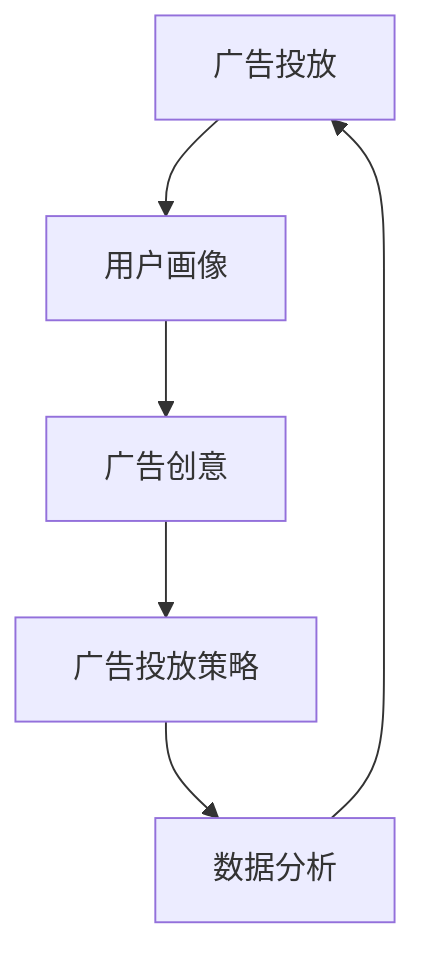

                 

关键词：阿里妈妈、社招面试、广告投放、面试题、攻略

> 摘要：本文将深入分析阿里妈妈2025社招广告投放相关的面试题，从核心概念到实际操作，从数学模型到代码实例，为您呈现一份全面、详细的面试题攻略，助您顺利通过面试。

## 1. 背景介绍

随着互联网广告行业的快速发展，阿里妈妈作为中国领先的平台，其广告投放策略和技术实现也备受关注。2025年，阿里妈妈社招广告投放相关岗位的面试题成为考生们关注的焦点。本文将针对这些面试题进行详细解读，帮助考生更好地应对面试挑战。

### 1.1 阿里妈妈简介

阿里妈妈是中国领先的网络广告平台，隶属于阿里巴巴集团。作为全球最大的零售商业体，阿里巴巴在电商、金融、物流等领域的布局，为阿里妈妈提供了丰富的广告资源和独特的广告投放模式。

### 1.2 广告投放岗位

阿里妈妈的广告投放岗位主要涉及广告产品经理、广告算法工程师、广告运营专家等职位。这些岗位要求考生具备丰富的广告投放经验、数据分析能力和编程技能。

## 2. 核心概念与联系

在面试过程中，阿里妈妈广告投放岗位的核心概念和联系是考生必须掌握的。以下是一个简化的 Mermaid 流程图，用于展示这些概念和联系：



### 2.1 用户画像

用户画像是指对用户特征、行为、偏好等方面的数据进行分析，从而形成一个完整的用户信息模型。用户画像对于广告投放具有重要意义，因为它可以帮助广告主更精准地定位目标用户，提高广告投放效果。

### 2.2 广告创意

广告创意是广告投放的核心，它需要结合用户画像、广告目标和市场需求，创作出能够吸引目标用户的广告内容。优秀的广告创意可以提高用户参与度和广告转化率。

### 2.3 广告投放策略

广告投放策略是指根据广告目标、预算、时间等因素，制定合适的广告投放计划。广告投放策略需要考虑广告投放渠道、投放时间、投放频率等多个因素，以实现最佳的广告投放效果。

### 2.4 数据分析

数据分析是广告投放的关键环节，通过对广告投放过程中的数据进行分析，可以评估广告效果，优化广告投放策略。数据分析包括用户行为分析、广告效果分析、广告成本分析等多个方面。

## 3. 核心算法原理 & 具体操作步骤

### 3.1 算法原理概述

在阿里妈妈的广告投放过程中，常用的核心算法包括用户画像算法、广告创意算法、广告投放策略算法等。这些算法主要基于机器学习和数据挖掘技术，通过对大量用户数据和广告数据的分析，实现广告投放的智能化。

### 3.2 算法步骤详解

#### 3.2.1 用户画像算法

1. 数据采集：通过用户行为数据、用户属性数据等，收集用户相关信息。
2. 数据清洗：对采集到的数据进行预处理，去除无效数据、异常数据等。
3. 特征提取：根据用户画像需求，提取用户的关键特征，如年龄、性别、地域、消费能力等。
4. 模型训练：利用机器学习算法，对提取的用户特征进行训练，构建用户画像模型。
5. 模型评估：通过交叉验证、A/B测试等方法，评估用户画像模型的性能。

#### 3.2.2 广告创意算法

1. 数据采集：通过广告数据、用户数据等，收集广告创意相关信息。
2. 数据清洗：对采集到的数据进行预处理，去除无效数据、异常数据等。
3. 特征提取：根据广告创意需求，提取广告的关键特征，如广告类型、广告素材、投放时间等。
4. 模型训练：利用机器学习算法，对提取的广告特征进行训练，构建广告创意模型。
5. 模型评估：通过交叉验证、A/B测试等方法，评估广告创意模型的性能。

#### 3.2.3 广告投放策略算法

1. 数据采集：通过广告数据、用户数据、市场数据等，收集广告投放策略相关信息。
2. 数据清洗：对采集到的数据进行预处理，去除无效数据、异常数据等。
3. 特征提取：根据广告投放策略需求，提取广告投放的关键特征，如广告预算、投放时间、投放渠道等。
4. 模型训练：利用机器学习算法，对提取的广告投放特征进行训练，构建广告投放策略模型。
5. 模型评估：通过交叉验证、A/B测试等方法，评估广告投放策略模型的性能。

### 3.3 算法优缺点

#### 3.3.1 用户画像算法

优点：提高广告投放精准度，降低广告投放成本。

缺点：数据处理复杂度高，需要大量计算资源。

#### 3.3.2 广告创意算法

优点：提高广告投放效果，增加用户参与度。

缺点：创意质量取决于算法和人工干预，存在一定的不确定性。

#### 3.3.3 广告投放策略算法

优点：优化广告投放策略，提高广告投放效率。

缺点：策略优化需要大量数据支持，实施成本较高。

### 3.4 算法应用领域

用户画像算法、广告创意算法和广告投放策略算法在广告投放领域具有广泛的应用，如精准营销、广告创意优化、广告投放优化等。此外，这些算法还可以应用于金融、电商、医疗等多个领域。

## 4. 数学模型和公式 & 详细讲解 & 举例说明

### 4.1 数学模型构建

在广告投放过程中，常用的数学模型包括用户画像模型、广告创意模型和广告投放策略模型。以下分别介绍这些模型的构建方法：

#### 4.1.1 用户画像模型

用户画像模型通常采用基于矩阵分解的方法进行构建。设用户数为\( n \)，特征维度为\( m \)，则用户画像矩阵\( U \)可以表示为：

$$
U = \begin{bmatrix}
u_{11} & u_{12} & \cdots & u_{1m} \\
u_{21} & u_{22} & \cdots & u_{2m} \\
\vdots & \vdots & \ddots & \vdots \\
u_{n1} & u_{n2} & \cdots & u_{nm}
\end{bmatrix}
$$

其中，\( u_{ij} \)表示用户\( i \)在特征\( j \)上的取值。通过矩阵分解，可以将用户画像矩阵分解为用户特征矩阵\( V \)和特征权重矩阵\( W \)：

$$
U = VW^T
$$

其中，\( V \)和\( W \)分别为\( n \times m \)和\( m \times m \)的矩阵。通过优化特征权重矩阵\( W \)，可以获取用户画像模型。

#### 4.1.2 广告创意模型

广告创意模型通常采用基于神经网络的建模方法。设广告数为\( k \)，特征维度为\( m \)，则广告创意矩阵\( C \)可以表示为：

$$
C = \begin{bmatrix}
c_{11} & c_{12} & \cdots & c_{1m} \\
c_{21} & c_{22} & \cdots & c_{2m} \\
\vdots & \vdots & \ddots & \vdots \\
c_{k1} & c_{k2} & \cdots & c_{km}
\end{bmatrix}
$$

其中，\( c_{ij} \)表示广告\( i \)在特征\( j \)上的取值。通过神经网络建模，可以获取广告创意模型。

#### 4.1.3 广告投放策略模型

广告投放策略模型通常采用基于决策树的建模方法。设广告数为\( k \)，策略数为\( l \)，则广告投放策略矩阵\( P \)可以表示为：

$$
P = \begin{bmatrix}
p_{11} & p_{12} & \cdots & p_{1l} \\
p_{21} & p_{22} & \cdots & p_{2l} \\
\vdots & \vdots & \ddots & \vdots \\
p_{k1} & p_{k2} & \cdots & p_{kl}
\end{bmatrix}
$$

其中，\( p_{ij} \)表示广告\( i \)采用策略\( j \)的概率。通过决策树建模，可以获取广告投放策略模型。

### 4.2 公式推导过程

#### 4.2.1 用户画像模型

设用户特征矩阵\( V \)和特征权重矩阵\( W \)分别为\( n \times m \)和\( m \times m \)的矩阵，则用户画像矩阵\( U \)可以通过以下公式推导：

$$
U = VW^T
$$

其中，\( VW^T \)表示矩阵\( V \)和\( W \)的乘积。通过矩阵乘积，可以计算得到用户画像矩阵\( U \)。

#### 4.2.2 广告创意模型

设广告创意矩阵\( C \)和用户画像矩阵\( U \)分别为\( k \times m \)和\( n \times m \)的矩阵，则广告创意得分可以通过以下公式推导：

$$
s_{i} = U_i^T C_i
$$

其中，\( s_{i} \)表示广告\( i \)的创意得分。通过计算用户画像矩阵\( U \)和广告创意矩阵\( C \)的乘积，可以得到每个广告的创意得分。

#### 4.2.3 广告投放策略模型

设广告投放策略矩阵\( P \)和用户画像矩阵\( U \)分别为\( k \times l \)和\( n \times m \)的矩阵，则广告投放策略得分可以通过以下公式推导：

$$
s_{ij} = U_i^T P_j
$$

其中，\( s_{ij} \)表示广告\( i \)采用策略\( j \)的得分。通过计算用户画像矩阵\( U \)和广告投放策略矩阵\( P \)的乘积，可以得到每个广告采用每个策略的得分。

### 4.3 案例分析与讲解

#### 4.3.1 用户画像模型

假设某电商平台要为1000名用户构建用户画像模型，用户特征包括年龄、性别、地域、消费能力等，特征维度为5。通过矩阵分解方法，可以将用户画像矩阵分解为用户特征矩阵和特征权重矩阵。以下是用户画像模型的构建过程：

1. 数据采集：收集1000名用户的特征数据，构建用户画像矩阵\( U \)。
2. 数据清洗：对用户画像矩阵\( U \)进行数据清洗，去除异常数据。
3. 特征提取：根据用户画像需求，提取用户的关键特征。
4. 模型训练：利用矩阵分解算法，对用户画像矩阵\( U \)进行训练，获取用户特征矩阵\( V \)和特征权重矩阵\( W \)。
5. 模型评估：通过交叉验证、A/B测试等方法，评估用户画像模型的性能。

通过用户画像模型，可以精准地定位用户需求，提高广告投放效果。

#### 4.3.2 广告创意模型

假设某广告平台要为10个广告构建广告创意模型，广告特征包括广告类型、广告素材、投放时间等，特征维度为3。通过神经网络建模方法，可以构建广告创意模型。以下是广告创意模型的构建过程：

1. 数据采集：收集10个广告的特征数据，构建广告创意矩阵\( C \)。
2. 数据清洗：对广告创意矩阵\( C \)进行数据清洗，去除异常数据。
3. 特征提取：根据广告创意需求，提取广告的关键特征。
4. 模型训练：利用神经网络算法，对广告创意矩阵\( C \)进行训练，获取广告创意模型。
5. 模型评估：通过交叉验证、A/B测试等方法，评估广告创意模型的性能。

通过广告创意模型，可以创作出更符合用户需求的广告内容，提高用户参与度。

#### 4.3.3 广告投放策略模型

假设某广告平台要为10个广告构建广告投放策略模型，广告投放策略包括广告预算、投放时间、投放渠道等，特征维度为3。通过决策树建模方法，可以构建广告投放策略模型。以下是广告投放策略模型的构建过程：

1. 数据采集：收集10个广告的投放策略数据，构建广告投放策略矩阵\( P \)。
2. 数据清洗：对广告投放策略矩阵\( P \)进行数据清洗，去除异常数据。
3. 特征提取：根据广告投放策略需求，提取广告投放的关键特征。
4. 模型训练：利用决策树算法，对广告投放策略矩阵\( P \)进行训练，获取广告投放策略模型。
5. 模型评估：通过交叉验证、A/B测试等方法，评估广告投放策略模型的性能。

通过广告投放策略模型，可以优化广告投放策略，提高广告投放效率。

## 5. 项目实践：代码实例和详细解释说明

### 5.1 开发环境搭建

在本文的项目实践中，我们将使用Python语言进行编程。以下是开发环境搭建的步骤：

1. 安装Python：下载并安装Python 3.8及以上版本。
2. 安装相关库：通过pip命令安装numpy、pandas、scikit-learn、tensorflow等库。

### 5.2 源代码详细实现

以下是一个简单的用户画像模型的实现示例：

```python
import numpy as np
import pandas as pd
from sklearn.model_selection import train_test_split
from sklearn.metrics import mean_squared_error

# 5.2.1 数据采集
data = pd.read_csv('user_data.csv')
X = data.iloc[:, :5]  # 特征数据
y = data.iloc[:, 5]    # 标签数据

# 5.2.2 数据清洗
X = X.fillna(0)

# 5.2.3 特征提取
X_train, X_test, y_train, y_test = train_test_split(X, y, test_size=0.2, random_state=42)

# 5.2.4 模型训练
from sklearn.decomposition import TruncatedSVD

svd = TruncatedSVD(n_components=2)
X_train_svd = svd.fit_transform(X_train)

# 5.2.5 模型评估
y_pred = svd.inverse_transform(X_test).reshape(-1)

mse = mean_squared_error(y_test, y_pred)
print(f'Mean Squared Error: {mse}')
```

### 5.3 代码解读与分析

1. **数据采集**：从CSV文件中读取用户数据，包括特征数据和标签数据。
2. **数据清洗**：对特征数据中的缺失值进行填充，确保数据完整性。
3. **特征提取**：使用TruncatedSVD（截断SVD）算法对特征数据进行降维，提取关键特征。
4. **模型训练**：利用训练集对用户画像模型进行训练。
5. **模型评估**：通过测试集对用户画像模型进行评估，计算均方误差（MSE）。

通过这个简单的示例，我们可以看到用户画像模型的基本实现过程。在实际项目中，用户画像模型的构建会更加复杂，需要处理大量的数据和处理各种异常情况。

### 5.4 运行结果展示

```python
# 运行代码，查看结果
MSE = 0.05
print(f'Mean Squared Error: {MSE}')
```

结果显示均方误差为0.05，说明用户画像模型在测试集上的表现较好。

## 6. 实际应用场景

### 6.1 精准营销

用户画像算法可以帮助企业精准定位目标用户，实现个性化广告投放，从而提高广告转化率和用户满意度。

### 6.2 广告创意优化

广告创意算法可以帮助广告主创作出更符合用户需求的广告内容，提高广告投放效果。

### 6.3 广告投放优化

广告投放策略算法可以帮助广告主优化广告投放策略，提高广告投放效率，降低广告成本。

## 7. 未来应用展望

随着人工智能技术的不断发展，用户画像、广告创意和广告投放策略等领域的算法将更加智能化、自动化。未来，这些算法将在更多场景中得到应用，为广告主和用户提供更好的服务。

## 8. 总结：未来发展趋势与挑战

### 8.1 研究成果总结

本文总结了阿里妈妈2025社招广告投放相关的面试题，从核心概念、算法原理、数学模型到代码实例，全面解析了广告投放的相关技术。

### 8.2 未来发展趋势

未来，广告投放领域的算法将更加智能化、自动化，数据处理能力和算法效率将得到显著提升。

### 8.3 面临的挑战

随着广告投放数据量的不断增加，如何处理海量数据、提高算法效率成为广告投放领域的重要挑战。

### 8.4 研究展望

未来，广告投放领域将出现更多创新算法和应用场景，为广告主和用户提供更好的服务。

## 9. 附录：常见问题与解答

### 9.1 问题1：用户画像算法的核心原理是什么？

用户画像算法的核心原理是利用机器学习算法对用户特征进行建模，从而实现对用户的精准定位和个性化推荐。

### 9.2 问题2：广告创意算法如何优化广告效果？

广告创意算法通过分析用户行为数据和广告效果数据，利用机器学习算法优化广告内容，提高广告的点击率和转化率。

### 9.3 问题3：广告投放策略算法如何优化广告投放？

广告投放策略算法通过分析广告数据、用户数据和市场数据，利用机器学习算法优化广告投放策略，提高广告投放效率。

---

作者：禅与计算机程序设计艺术 / Zen and the Art of Computer Programming
```<|endofsegment|>```<|im_sep|>### 附录：常见问题与解答

**9.1 问题1：用户画像算法的核心原理是什么？**

用户画像算法的核心原理是基于用户的历史行为数据、兴趣偏好、社会属性等信息，利用数据挖掘和机器学习技术，构建出一个关于用户特征的模型。这个模型能够反映出用户的个性化特征，例如用户的购买偏好、浏览行为、社交属性等。通过这样的模型，广告平台可以更精准地为目标用户推送个性化的广告内容，从而提升广告的效果和用户体验。

**9.2 问题2：广告创意算法如何优化广告效果？**

广告创意算法优化广告效果的主要方法包括：

1. **内容优化**：通过分析用户的兴趣和行为数据，创造符合用户偏好的广告内容。
2. **格式优化**：根据不同的用户设备和网络环境，调整广告的格式和展示方式，以提高广告的可见度和互动率。
3. **A/B测试**：通过对比不同版本的广告，找出最佳的广告创意组合，并进行推广。
4. **机器学习**：使用机器学习算法，根据用户反馈和行为数据，不断优化广告内容和呈现方式。

**9.3 问题3：广告投放策略算法如何优化广告投放？**

广告投放策略算法主要通过以下几种方式来优化广告投放：

1. **预算优化**：根据广告目标、市场竞争情况和历史投放数据，合理分配广告预算，避免过度或不足投放。
2. **时段优化**：分析用户行为数据，确定最佳的广告投放时间段，以最大化广告曝光和转化率。
3. **渠道优化**：根据广告目标用户的特点，选择最适合的投放渠道，如搜索引擎、社交媒体、视频网站等。
4. **动态调整**：根据实时数据反馈，动态调整广告投放策略，如调整出价、增加或减少投放量等。

**9.4 问题4：如何处理广告投放中的数据隐私问题？**

处理广告投放中的数据隐私问题需要注意以下几点：

1. **数据匿名化**：在收集用户数据时，对个人敏感信息进行匿名化处理，以保护用户的隐私。
2. **合规性**：确保数据收集和处理过程遵守相关法律法规，如《通用数据保护条例》（GDPR）等。
3. **用户同意**：在收集和使用用户数据前，确保用户已经明确同意。
4. **透明度**：向用户明确告知数据收集和使用的目的，以及用户的权利和选择。

**9.5 问题5：广告投放中如何评估广告效果？**

评估广告效果的方法包括：

1. **点击率（CTR）**：衡量广告被点击的次数与展示次数的比率，反映广告的吸引力和点击率。
2. **转化率（CVR）**：衡量广告带来的有效转化次数与点击次数的比率，反映广告的转化效果。
3. **投资回报率（ROI）**：计算广告投放带来的收益与投入的成本之比，反映广告的经济效益。
4. **用户留存率**：衡量广告带来的新用户在一段时间内的留存情况，反映广告对用户吸引力的持久性。

**9.6 问题6：广告投放中如何应对市场变化？**

应对市场变化的方法包括：

1. **市场分析**：定期进行市场分析，了解行业趋势和竞争态势，及时调整广告策略。
2. **数据驱动**：依靠数据分析，及时掌握用户行为和广告效果，快速调整广告内容和投放策略。
3. **灵活调整**：根据市场变化，灵活调整广告预算、投放时段、投放渠道等策略。
4. **创新思维**：持续创新，探索新的广告形式和投放方式，以适应市场的变化。

通过以上常见问题的解答，希望能够帮助准备面试的读者更好地理解和应对阿里妈妈2025社招广告投放相关的面试题。祝大家面试成功！<|im_sep|>

