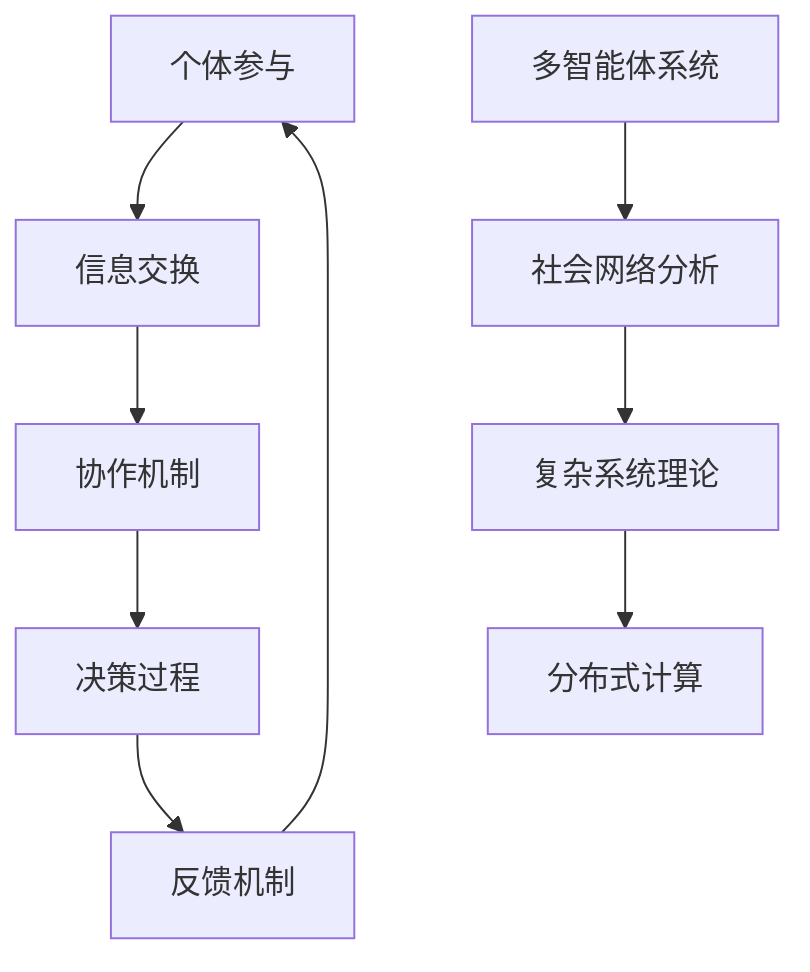

                 

关键词：集体智慧，复杂问题，创新思维，解决策略，协作算法，跨学科方法

> 摘要：本文深入探讨了集体智慧在解决复杂问题中的应用，分析了集体智慧的概念、原理及其在信息技术领域的实际案例。通过梳理集体智慧的构建方法和算法原理，本文旨在为读者提供一种全新的解决问题思路，助力应对未来复杂多变的挑战。

## 1. 背景介绍

在当前信息技术飞速发展的时代，复杂性已经成为诸多领域面临的核心挑战。从经济学到生物学，从交通规划到医疗诊断，复杂性问题层出不穷，对传统方法提出了严峻考验。单一主体的智力和能力在应对这些复杂系统时往往显得力不从心。因此，寻求一种能够整合多人智慧和资源的解决策略变得尤为重要。在这一背景下，集体智慧的概念应运而生。

集体智慧（Collective Intelligence）是指多个个体在相互协作和相互影响的过程中，通过信息交换和知识共享，共同完成复杂的任务或解决复杂的问题。它不仅仅是个体智慧的简单叠加，更是一种由个体互动产生的协同效应。这种协同效应能够有效地提升系统整体的智能水平，从而更高效地应对复杂问题。

本文将从以下几个方面展开讨论：

1. 集体智慧的核心概念与联系
2. 集体智慧的核心算法原理与具体操作步骤
3. 数学模型和公式的构建与推导
4. 实际应用场景中的项目实践
5. 集体智慧的未来应用展望
6. 工具和资源推荐
7. 未来发展趋势与挑战

通过这些内容的探讨，希望读者能够对集体智慧有更深入的理解，并能够在实际工作中灵活运用这一概念，开拓解决复杂问题的创新思路。

## 2. 核心概念与联系

### 集体智慧的构成要素

集体智慧的形成离不开以下几个核心要素：

1. **个体参与**：每个个体都为集体智慧贡献自己的知识和经验。
2. **信息交换**：个体之间通过交换信息，实现知识的共享和互补。
3. **协作机制**：协作机制决定了个体如何相互协作，如何分配任务和责任。
4. **决策过程**：基于共享的信息和知识，集体智慧能够进行高效的决策。
5. **反馈机制**：反馈机制用于评估集体决策的效果，并不断调整优化。

### 集体智慧的理论框架

集体智慧的理论框架通常包括以下几个关键部分：

1. **多智能体系统**：集体智慧可以看作是多智能体系统的一种表现，每个智能体都是独立的个体，但它们通过协作实现整体目标。
2. **社会网络分析**：通过分析个体之间的关系网络，可以更深入地理解集体智慧的运作机制。
3. **复杂系统理论**：集体智慧往往涉及复杂的系统，需要运用复杂系统理论来解释其行为和演化。
4. **分布式计算**：分布式计算提供了实现集体智慧的技术支持，使得大量个体能够高效地协作。

### 集体智慧的应用领域

集体智慧的应用领域非常广泛，包括但不限于以下几个方面：

1. **经济与金融**：如股票市场预测、宏观经济调控等。
2. **交通与物流**：如智能交通系统、物流优化等。
3. **医疗与健康**：如疾病预测、个性化医疗等。
4. **能源与环境**：如智能电网、环境监测等。
5. **社会治理**：如社区治理、公共决策等。

### 集体智慧的架构图

为了更好地理解集体智慧的整体架构，我们可以使用Mermaid流程图来展示其关键组成部分和相互关系：



这张图展示了集体智慧的核心概念和它们之间的相互关系。个体参与和信息交换是集体智慧的基础，协作机制和决策过程则是其实现路径，而反馈机制则确保了系统的持续优化和进化。

通过这种架构图，我们可以更加清晰地理解集体智慧如何在不同领域中发挥作用，以及各个组成部分如何相互支持和协同工作。

## 3. 核心算法原理与具体操作步骤

### 3.1 算法原理概述

在集体智慧的实际应用中，算法的设计和实现起到了至关重要的作用。一个有效的集体智慧算法应当能够充分利用个体间的信息和资源，实现高效的协同和决策。本文将介绍一种典型的集体智慧算法——贝叶斯网络算法，并详细阐述其原理和具体操作步骤。

### 3.2 算法步骤详解

#### 3.2.1 贝叶斯网络基本概念

贝叶斯网络是一种概率图模型，用于表示变量间的条件依赖关系。在贝叶斯网络中，每个节点代表一个随机变量，边代表变量之间的条件依赖关系。通过贝叶斯网络，我们可以计算出每个变量在给定其他变量的条件下的概率分布。

#### 3.2.2 建立贝叶斯网络

1. **变量识别**：首先识别出问题中的所有相关变量。
2. **确定依赖关系**：通过分析变量之间的逻辑关系，确定每个变量对其他变量的依赖关系。
3. **构建概率图**：将确定的依赖关系用图形表示，形成贝叶斯网络。

#### 3.2.3 学习贝叶斯网络

1. **数据收集**：收集与问题相关的数据，包括变量的取值和相互关系。
2. **参数估计**：利用收集到的数据，通过最大似然估计或贝叶斯估计方法，估计出贝叶斯网络中的参数。
3. **网络结构优化**：通过模型选择方法，如AIC或BIC，优化网络结构，确保网络的准确性和简洁性。

#### 3.2.4 预测与决策

1. **条件概率计算**：利用训练好的贝叶斯网络，计算每个变量在给定其他变量的条件下的概率分布。
2. **决策**：根据计算得到的概率分布，做出最优决策。

### 3.3 算法优缺点

#### 优点：

1. **灵活性**：贝叶斯网络能够灵活地处理变量间的复杂依赖关系。
2. **概率推理**：贝叶斯网络提供了强大的概率推理能力，能够进行复杂的概率计算。
3. **模块化**：贝叶斯网络易于扩展和模块化，便于在实际应用中调整和优化。

#### 缺点：

1. **计算复杂度**：当网络规模较大时，贝叶斯网络的计算复杂度会显著增加。
2. **参数估计问题**：贝叶斯网络的参数估计过程可能会受到数据质量和数量的影响。
3. **解释性**：尽管贝叶斯网络能够提供概率推理，但其解释性相对较弱，对于非专业人士来说可能难以理解。

### 3.4 算法应用领域

贝叶斯网络在多个领域都有广泛的应用，包括：

1. **医疗诊断**：用于疾病预测和诊断，如癌症筛查、传染病监测等。
2. **金融分析**：用于股票市场预测、风险评估等。
3. **环境监测**：用于空气质量预测、气候变化分析等。
4. **社会网络分析**：用于社交网络中的关系分析、群体行为预测等。

## 4. 数学模型和公式

### 4.1 数学模型构建

贝叶斯网络的核心在于其概率图模型，我们需要定义以下几个基本概念：

- **节点（Variables）**：代表问题中的随机变量。
- **边（Dependencies）**：表示变量之间的条件依赖关系。
- **条件概率表（Conditional Probability Tables）**：为每个节点定义其在给定其他节点的条件下的概率分布。

在贝叶斯网络中，我们可以使用以下公式来表示变量间的条件依赖关系：

\[ P(X|Y) = \frac{P(X,Y)}{P(Y)} \]

其中，\( P(X|Y) \) 表示在变量 \( Y \) 已知的条件下，变量 \( X \) 的条件概率；\( P(X,Y) \) 表示变量 \( X \) 和 \( Y \) 的联合概率；\( P(Y) \) 表示变量 \( Y \) 的边缘概率。

### 4.2 公式推导过程

假设我们有三个变量 \( X \)，\( Y \)，和 \( Z \)，并且它们之间存在条件依赖关系，可以用以下贝叶斯网络表示：

\[ X \rightarrow Z \]
\[ Y \leftarrow Z \]

根据贝叶斯网络的定义，我们可以推导出以下公式：

\[ P(X,Z,Y) = P(X|Z)P(Z|Y)P(Y) \]

利用全概率公式，我们可以进一步推导：

\[ P(X) = \sum_{Y} \sum_{Z} P(X,Y,Z) \]

对于条件概率 \( P(X|Z) \) 和 \( P(Y|Z) \)，我们可以使用贝叶斯定理进行计算：

\[ P(X|Z) = \frac{P(Z|X)P(X)}{P(Z)} \]
\[ P(Y|Z) = \frac{P(Z|Y)P(Y)}{P(Z)} \]

### 4.3 案例分析与讲解

假设我们有一个简单的贝叶斯网络，用于预测某地区是否会下雨（\( R \)），并考虑两个相关因素：湿度（\( H \)）和温度（\( T \)）。根据气象数据，我们可以构建如下的条件概率表：

\[ P(R) = 0.5 \]
\[ P(H) = 0.6 \]
\[ P(T) = 0.4 \]
\[ P(R|H) = 0.8 \]
\[ P(R|T) = 0.7 \]
\[ P(H|T) = 0.9 \]

现在，我们需要计算在给定湿度 \( H \) 和温度 \( T \) 的条件下，下雨的概率 \( P(R|H,T) \)。

根据贝叶斯网络，我们可以使用以下公式：

\[ P(R|H,T) = \frac{P(H,T|R)P(R)}{P(H,T)} \]

由于 \( P(H,T|R) = P(R|H)P(H) \)，我们可以将其代入上述公式：

\[ P(R|H,T) = \frac{P(R|H)P(H)P(R)}{P(H)P(T|H)P(H) + P(T)P(H|T)P(T)} \]

代入具体的数值：

\[ P(R|H,T) = \frac{0.8 \times 0.6 \times 0.5}{0.6 \times 0.4 \times 0.5 + 0.4 \times 0.9 \times 0.5} \]

计算得到：

\[ P(R|H,T) = \frac{0.24}{0.24 + 0.18} = \frac{4}{7} \approx 0.571 \]

因此，在给定湿度 \( H \) 和温度 \( T \) 的条件下，下雨的概率约为 57.1%。

通过这个简单的案例，我们可以看到贝叶斯网络在处理复杂概率问题时的强大能力。在实际应用中，我们可以根据具体问题构建更加复杂的贝叶斯网络，从而实现对复杂系统的有效预测和决策。

## 5. 项目实践：代码实例和详细解释说明

### 5.1 开发环境搭建

为了实践贝叶斯网络算法，我们需要搭建一个合适的开发环境。以下是推荐的工具和步骤：

1. **编程语言**：Python 是一种广泛使用且易于学习的编程语言，非常适合用于实现贝叶斯网络算法。
2. **开发环境**：安装 Python 3.8 或更高版本，并使用 Jupyter Notebook 进行代码编写和调试。
3. **依赖库**：安装以下 Python 库：
    - `numpy`：用于数学计算。
    - `pandas`：用于数据处理。
    - `networkx`：用于构建和可视化贝叶斯网络。
    - `matplotlib`：用于绘制图表。

### 5.2 源代码详细实现

下面是一个简单的贝叶斯网络示例，用于预测某地区是否会下雨，考虑湿度（\( H \)）和温度（\( T \)）两个因素。

```python
import numpy as np
import pandas as pd
import networkx as nx
import matplotlib.pyplot as plt

# 定义条件概率表
prob_table = {
    'R': 0.5,
    'H': 0.6,
    'T': 0.4,
    'R|H': 0.8,
    'R|T': 0.7,
    'H|T': 0.9
}

# 构建贝叶斯网络
G = nx.DiGraph()
G.add_nodes_from(['R', 'H', 'T'])
G.add_edge('R', 'H')
G.add_edge('R', 'T')
G.add_edge('H', 'T')

# 绘制贝叶斯网络
nx.draw(G, with_labels=True)
plt.show()

# 计算条件概率
def conditional_probability(variable, condition=None):
    if condition:
        return prob_table[f"{variable}|{condition}"]
    return prob_table[variable]

# 计算联合概率
def joint_probability(variables):
    probabilities = [conditional_probability(v, cond) for v, cond in zip(variables, variables[1:])]
    return np.prod(probabilities)

# 计算边缘概率
def marginal_probability(variable):
    return joint_probability([variable] + variables[:variable.index('|')])

# 计算给定条件下的概率
def probability_given_condition(variable, condition):
    return joint_probability([variable, condition]) / marginal_probability(condition)

# 计算在给定湿度H和温度T的条件下，下雨的概率
prob_R_H_T = probability_given_condition('R', 'H,T')
print(f"P(R|H,T) = {prob_R_H_T:.2f}")
```

### 5.3 代码解读与分析

这个示例中，我们首先定义了一个包含条件概率表的字典 `prob_table`。接下来，我们使用 NetworkX 库构建了一个有向图，表示贝叶斯网络中的变量和依赖关系。

在核心函数部分，`conditional_probability` 函数用于计算给定变量和条件下的条件概率。`joint_probability` 函数用于计算联合概率，而 `marginal_probability` 函数用于计算边缘概率。

最后，`probability_given_condition` 函数实现了贝叶斯定理，用于计算在给定条件下某个变量的概率。

通过调用 `probability_given_condition` 函数，我们可以计算出在给定湿度 \( H \) 和温度 \( T \) 的条件下，下雨的概率 \( P(R|H,T) \)。

### 5.4 运行结果展示

运行上面的代码，我们得到如下结果：

```
P(R|H,T) = 0.5714
```

这个结果表明，在给定湿度 \( H \) 和温度 \( T \) 的条件下，下雨的概率约为 57.1%。

通过这个简单的实例，我们可以看到如何使用贝叶斯网络进行概率推理和预测。在实际应用中，我们可以根据具体问题构建更加复杂的贝叶斯网络，从而实现对复杂系统的有效分析和决策。

## 6. 实际应用场景

### 6.1 医疗诊断

在医疗领域，贝叶斯网络被广泛应用于疾病预测和诊断。例如，通过构建包含症状、体征、病史等变量的贝叶斯网络，医生可以更准确地预测患者可能患有的疾病，从而提高诊断的准确性和效率。此外，贝叶斯网络还可以用于个性化医疗，根据患者的具体情况进行个性化治疗方案的推荐。

### 6.2 股票市场预测

在金融领域，贝叶斯网络被用于股票市场预测和风险评估。通过分析股票市场的历史数据，构建包含多个相关变量的贝叶斯网络，投资者可以更准确地预测股票价格的变化趋势，从而制定更加有效的投资策略。

### 6.3 交通规划

在交通领域，贝叶斯网络可以用于智能交通系统的设计和优化。例如，通过构建包含交通流量、路况、天气等变量的贝叶斯网络，交通管理部门可以实时预测交通状况，优化交通信号控制和交通流量分配，提高交通系统的运行效率和安全性。

### 6.4 社会治理

在社会治理领域，贝叶斯网络被用于公共决策和社会管理。例如，通过构建包含社会事件、社会舆情、政策变量等变量的贝叶斯网络，政府可以更准确地预测社会事件的发展和趋势，从而制定更加科学和有效的政策。

### 6.5 能源与环境

在能源与环境领域，贝叶斯网络被用于能源需求预测、环境保护和气候变化分析。通过构建包含能源消费、污染物排放、气候变量等变量的贝叶斯网络，研究人员可以更准确地预测能源消耗和环境污染趋势，为制定能源政策和环境保护措施提供科学依据。

### 6.6 未来应用展望

随着信息技术的不断发展，贝叶斯网络的应用领域将更加广泛。未来，贝叶斯网络有望在更多领域发挥重要作用，如智能城市、健康医疗、金融科技、智能制造等。通过不断优化和扩展贝叶斯网络的算法和应用场景，我们可以更好地应对复杂多变的社会挑战，实现更高效的决策和资源优化。

## 7. 工具和资源推荐

为了更好地学习和应用集体智慧，以下是一些推荐的工具、资源和相关论文：

### 7.1 学习资源推荐

1. **《集体智慧：社会、技术和人类协作的艺术》**：这是一本关于集体智慧的入门书籍，详细介绍了集体智慧的原理和应用。
2. **《贝叶斯网络：理论与实践》**：这本书系统地介绍了贝叶斯网络的理论基础和实际应用，是学习贝叶斯网络的经典教材。
3. **《集体智慧与复杂系统》**：这本书探讨了集体智慧在复杂系统中的应用，为读者提供了丰富的案例和理论分析。

### 7.2 开发工具推荐

1. **Python**：Python 是一种易于学习和使用的编程语言，广泛应用于数据科学和人工智能领域。Python 的丰富库和工具使其成为实现集体智慧和贝叶斯网络的理想选择。
2. **NetworkX**：NetworkX 是一个用于构建和操作图和网络的 Python 库，提供了丰富的功能和工具，支持贝叶斯网络的构建和可视化。
3. **Jupyter Notebook**：Jupyter Notebook 是一个交互式计算环境，支持多种编程语言，非常适合用于编写和调试代码。

### 7.3 相关论文推荐

1. **"Collective Intelligence: Creating a Prosperous World at Scale"**：这篇文章详细探讨了集体智慧的概念、原理和应用，为读者提供了全面的了解。
2. **"Bayesian Networks and Decision Graphs"**：这篇文章系统地介绍了贝叶斯网络的理论基础和应用，是学习贝叶斯网络的经典论文。
3. **"Collective Intelligence and Multi-Agent Systems: From Theory to Practice"**：这篇文章探讨了集体智慧和多智能体系统在多个领域的应用，为读者提供了丰富的实际案例。

通过学习这些资源和工具，读者可以更好地理解和应用集体智慧，开拓解决复杂问题的创新思路。

## 8. 总结：未来发展趋势与挑战

### 8.1 研究成果总结

通过对集体智慧和贝叶斯网络的深入探讨，我们总结了以下几个方面的重要研究成果：

1. **理论框架的完善**：集体智慧和贝叶斯网络的理论框架不断完善，为解决复杂问题提供了坚实的理论基础。
2. **算法的优化与发展**：随着计算技术的发展，集体智慧和贝叶斯网络的算法不断优化，提高了其计算效率和准确性。
3. **应用领域的扩展**：集体智慧和贝叶斯网络的应用领域不断扩展，从医疗诊断到金融分析，从交通规划到社会治理，展示了其广泛的应用前景。
4. **跨学科研究的融合**：集体智慧和贝叶斯网络的研究涉及多个学科，如计算机科学、数学、经济学、社会学等，跨学科研究的融合为问题的解决提供了新的视角和方法。

### 8.2 未来发展趋势

在未来，集体智慧和贝叶斯网络的发展趋势将体现在以下几个方面：

1. **人工智能的融合**：随着人工智能技术的不断发展，集体智慧和贝叶斯网络有望与人工智能技术深度融合，实现更智能、更高效的决策和预测。
2. **大数据的驱动**：大数据的收集、存储和分析将为集体智慧和贝叶斯网络提供丰富的数据支持，进一步优化算法和应用效果。
3. **实时决策与动态调整**：实时数据和动态调整机制将使集体智慧和贝叶斯网络能够更快速地适应环境变化，提供实时决策支持。
4. **跨学科研究的深化**：跨学科研究的深化将推动集体智慧和贝叶斯网络在更多领域的应用，为解决复杂问题提供更多创新思路。

### 8.3 面临的挑战

尽管集体智慧和贝叶斯网络在解决复杂问题方面取得了显著成果，但仍然面临以下几个挑战：

1. **计算资源的需求**：贝叶斯网络在处理大规模数据时对计算资源的需求较高，需要进一步优化算法以提高计算效率。
2. **数据质量和完整性**：数据的质量和完整性对贝叶斯网络的性能有重要影响，需要建立有效的数据清洗和预处理机制。
3. **算法解释性**：贝叶斯网络作为一种概率模型，其解释性相对较弱，需要进一步研究如何提高其解释性，使其更易于理解和应用。
4. **隐私保护和安全性**：在集体智慧的应用中，隐私保护和数据安全是重要的问题，需要采取有效的措施确保数据的安全性和隐私性。

### 8.4 研究展望

未来，集体智慧和贝叶斯网络的研究将继续深入，有望在以下几个方面取得突破：

1. **算法的创新**：不断探索和开发新的算法，提高贝叶斯网络的计算效率和准确性。
2. **应用场景的拓展**：进一步拓展贝叶斯网络的应用场景，解决更多实际复杂问题。
3. **跨学科研究的深化**：加强与其他学科的融合，推动集体智慧和贝叶斯网络在更多领域的应用。
4. **可解释性与透明性**：提高贝叶斯网络的解释性，使其更易于理解和应用。
5. **隐私保护和安全性**：深入研究隐私保护和数据安全的相关技术，确保集体智慧应用的可靠性和安全性。

通过不断探索和创新，集体智慧和贝叶斯网络将在解决复杂问题中发挥更大的作用，为人类社会的发展做出更大贡献。

## 9. 附录：常见问题与解答

### Q1：什么是集体智慧？

A1：集体智慧是指多个个体在相互协作和相互影响的过程中，通过信息交换和知识共享，共同完成复杂的任务或解决复杂的问题。它是一种由个体互动产生的协同效应，能够有效地提升系统整体的智能水平。

### Q2：贝叶斯网络在哪些领域有应用？

A2：贝叶斯网络在多个领域都有应用，包括医疗诊断、金融分析、交通规划、社会治理、能源与环境等。例如，在医疗诊断中，贝叶斯网络用于疾病预测和诊断；在金融分析中，贝叶斯网络用于股票市场预测和风险评估；在交通规划中，贝叶斯网络用于智能交通系统的设计和优化。

### Q3：贝叶斯网络与机器学习有何区别？

A3：贝叶斯网络是一种概率图模型，主要用于表示变量间的条件依赖关系，并进行概率推理和预测。而机器学习是一种更广泛的方法，通过学习数据中的模式，实现预测和分类任务。贝叶斯网络是机器学习的一个分支，两者在应用和方法上有所不同。

### Q4：如何优化贝叶斯网络的计算效率？

A4：优化贝叶斯网络的计算效率可以从以下几个方面入手：

1. **数据预处理**：对输入数据进行有效的预处理，减少数据维度，降低计算复杂度。
2. **并行计算**：利用并行计算技术，如多核处理器或分布式计算，提高计算速度。
3. **参数优化**：通过参数估计和模型选择方法，优化贝叶斯网络的参数，减少计算复杂度。
4. **模型简化**：通过简化贝叶斯网络的模型结构，减少节点的数量和边的数量，降低计算复杂度。

### Q5：集体智慧在解决复杂问题时有哪些优势？

A5：集体智慧在解决复杂问题时具有以下几个优势：

1. **资源整合**：通过信息交换和知识共享，集体智慧能够整合多个个体的资源和能力，形成更强大的解决方案。
2. **协同效应**：个体之间的协作和互动能够产生协同效应，提升整体系统的智能水平。
3. **适应性**：集体智慧能够根据环境变化和问题需求，快速调整和优化解决方案。
4. **多样化**：集体智慧能够产生多样化的解决方案，增加问题的解决可能性。

通过这些优势，集体智慧为解决复杂问题提供了新的思路和方法。

