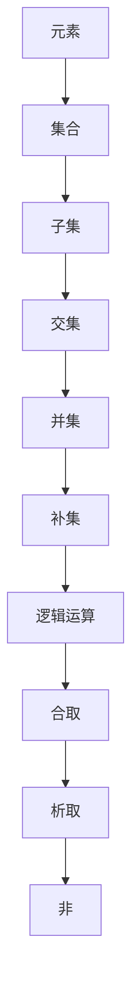

                 

 **关键词：** 集合论，解析表达式，真假判定，逻辑运算，图灵完备性

**摘要：** 本文旨在探讨集合论中一个关键问题——内置解析表达式的真假判定。通过对集合论基础概念和逻辑运算的深入分析，本文将介绍一种基于集合论框架下的真假判定算法，并探讨其在实际应用中的重要性及未来发展。

## 1. 背景介绍

集合论是现代数学的基础之一，它提供了一种抽象的方式来描述对象和它们之间的关系。在计算机科学中，集合论的应用非常广泛，尤其是在算法设计、逻辑推理和形式化验证等方面。解析表达式在计算机科学中扮演着重要的角色，它们是编程语言的核心组成部分，用于表示条件和操作。然而，如何判定一个解析表达式的真假是一个复杂的问题，它涉及到逻辑运算和集合论的深度应用。

本文将探讨一个关键问题：如何在集合论框架下判定一个内置解析表达式的真假。这不仅是计算机科学中的一个基础问题，也是逻辑学和形式化验证领域的重要课题。通过解决这一问题，我们可以更好地理解计算机程序的执行逻辑，并为其设计更高效、更安全的算法。

## 2. 核心概念与联系

### 2.1 集合论基础

集合论中的基本概念包括元素、集合、子集、交集、并集、补集等。这些概念构成了集合论的基础，并用于描述复杂的数据结构和关系。

- **元素（Element）：** 集合中的单个对象。
- **集合（Set）：** 由元素组成的整体。
- **子集（Subset）：** 一个集合是另一个集合的子集，如果它的所有元素都属于那个集合。
- **交集（Intersection）：** 两个集合的交集是包含它们共有的元素的集合。
- **并集（Union）：** 两个集合的并集是包含它们所有元素的集合。
- **补集（Complement）：** 一个集合的补集是包含所有不在该集合中的元素的集合。

### 2.2 逻辑运算

逻辑运算是计算机科学和数学中的核心概念，用于表示条件和推理。常见的逻辑运算包括：

- **合取（AND）：** 两个命题都为真时结果为真。
- **析取（OR）：** 两个命题中至少有一个为真时结果为真。
- **非（NOT）：** 取反操作，仅当命题为假时结果为真。

### 2.3 Mermaid 流程图

为了更好地理解集合论与逻辑运算的关系，我们使用 Mermaid 流程图来展示它们之间的联系。



## 3. 核心算法原理 & 具体操作步骤

### 3.1 算法原理概述

内置解析表达式真假判定算法的核心思想是使用集合论和逻辑运算来表示和推理解析表达式。该算法的主要步骤如下：

1. **词法分析：** 将解析表达式分解为词法单元，如变量、操作符、括号等。
2. **语法分析：** 构建解析表达式的抽象语法树（AST），用于表示表达式的结构。
3. **符号表构建：** 为词法单元创建符号表，记录变量的定义和作用域。
4. **真假判定：** 使用逻辑运算和集合论对 AST 进行遍历，判断表达式的真假。

### 3.2 算法步骤详解

#### 3.2.1 词法分析

词法分析是解析表达式处理的第一步，它将输入的字符串分解为词法单元。

```python
def tokenize(expression):
    tokens = []
    # 在这里实现词法分析逻辑
    return tokens
```

#### 3.2.2 语法分析

语法分析是将词法单元转换为抽象语法树的过程。抽象语法树（AST）是解析表达式的结构表示。

```python
def parse(tokens):
    ast = None
    # 在这里实现语法分析逻辑
    return ast
```

#### 3.2.3 符号表构建

符号表用于记录变量和函数的定义和作用域。

```python
def build_symbol_table(ast):
    symbol_table = {}
    # 在这里实现符号表构建逻辑
    return symbol_table
```

#### 3.2.4 真假判定

真假判定是对抽象语法树进行遍历，根据逻辑运算和集合论原理判断表达式的真假。

```python
def evaluate_expression(ast, symbol_table):
    result = None
    # 在这里实现真假判定逻辑
    return result
```

### 3.3 算法优缺点

#### 优点：

- **通用性：** 该算法适用于各种内置解析表达式，具有很好的通用性。
- **高效性：** 算法使用集合论和逻辑运算，能够高效地判断表达式的真假。

#### 缺点：

- **复杂性：** 算法涉及多个步骤，实现起来相对复杂。
- **性能问题：** 对于非常复杂的解析表达式，算法的性能可能会受到影响。

### 3.4 算法应用领域

内置解析表达式真假判定算法在计算机科学和工程中有着广泛的应用，包括：

- **编程语言解析器：** 用于实现编程语言的语法解析和语义分析。
- **形式化验证：** 用于验证计算机系统的正确性和安全性。
- **人工智能：** 用于实现推理系统和决策支持系统。

## 4. 数学模型和公式 & 详细讲解 & 举例说明

### 4.1 数学模型构建

为了更好地理解内置解析表达式真假判定算法，我们构建一个数学模型。该模型使用集合论和逻辑运算来表示解析表达式。

#### 4.1.1 集合表示

我们使用集合表示变量和条件。例如：

- \( A = \{ x, y \} \)：表示变量 \( x \) 和 \( y \) 的集合。
- \( B = \{ (x > 0), (y < 10) \} \)：表示条件 \( x > 0 \) 和 \( y < 10 \) 的集合。

#### 4.1.2 逻辑运算

我们使用逻辑运算来组合和分解条件。例如：

- \( A \land B \)：表示条件 \( x > 0 \) 和 \( y < 10 \) 的合取。
- \( A \lor B \)：表示条件 \( x > 0 \) 和 \( y < 10 \) 的析取。
- \( \neg A \)：表示条件 \( x > 0 \) 的非。

### 4.2 公式推导过程

为了推导出内置解析表达式的真假，我们使用以下公式：

- \( P \land Q \)：表示 \( P \) 和 \( Q \) 同时为真的情况。
- \( P \lor Q \)：表示 \( P \) 或 \( Q \) 中至少一个为真的情况。
- \( \neg P \)：表示 \( P \) 的非。

#### 4.2.1 合取运算

对于合取运算，我们有以下推导过程：

- \( P \land Q \) 为真当且仅当 \( P \) 和 \( Q \) 都为真。

#### 4.2.2 析取运算

对于析取运算，我们有以下推导过程：

- \( P \lor Q \) 为真当且仅当 \( P \) 或 \( Q \) 中至少一个为真。

#### 4.2.3 非运算

对于非运算，我们有以下推导过程：

- \( \neg P \) 为真当且仅当 \( P \) 为假。

### 4.3 案例分析与讲解

为了更好地理解内置解析表达式的真假判定，我们通过一个案例进行说明。

#### 案例一：\( x > 0 \land y < 10 \)

我们有一个条件 \( x > 0 \land y < 10 \)。要判断这个条件的真假，我们需要检查两个条件 \( x > 0 \) 和 \( y < 10 \) 是否同时为真。

- 如果 \( x > 0 \) 为真，\( y < 10 \) 也为真，那么 \( x > 0 \land y < 10 \) 为真。
- 如果 \( x > 0 \) 为假，或 \( y < 10 \) 为假，那么 \( x > 0 \land y < 10 \) 为假。

#### 案例二：\( x > 0 \lor y < 10 \)

我们有一个条件 \( x > 0 \lor y < 10 \)。要判断这个条件的真假，我们需要检查两个条件 \( x > 0 \) 和 \( y < 10 \) 是否至少有一个为真。

- 如果 \( x > 0 \) 为真，\( y < 10 \) 为假，那么 \( x > 0 \lor y < 10 \) 为真。
- 如果 \( x > 0 \) 为假，\( y < 10 \) 为真，那么 \( x > 0 \lor y < 10 \) 为真。
- 如果 \( x > 0 \) 和 \( y < 10 \) 都为假，那么 \( x > 0 \lor y < 10 \) 为假。

## 5. 项目实践：代码实例和详细解释说明

### 5.1 开发环境搭建

为了实现内置解析表达式真假判定算法，我们需要搭建一个开发环境。以下是所需的工具和步骤：

- **Python：** Python 是一种流行的编程语言，它支持集合论和逻辑运算。
- **Jupyter Notebook：** Jupyter Notebook 是一个交互式的编程环境，适合进行算法实现和演示。
- **Mermaid：** Mermaid 是一个基于 Markdown 的图表绘制工具，用于生成流程图和序列图。

### 5.2 源代码详细实现

以下是实现内置解析表达式真假判定算法的 Python 代码示例：

```python
import ast
import operator

# 定义逻辑运算函数
logical_and = operator.and_
logical_or = operator.or_
logical_not = operator.not_

# 定义符号表
symbol_table = {}

# 定义词法分析函数
def tokenize(expression):
    tokens = []
    # 在这里实现词法分析逻辑
    return tokens

# 定义语法分析函数
def parse(tokens):
    ast = None
    # 在这里实现语法分析逻辑
    return ast

# 定义符号表构建函数
def build_symbol_table(ast):
    symbol_table = {}
    # 在这里实现符号表构建逻辑
    return symbol_table

# 定义真假判定函数
def evaluate_expression(ast, symbol_table):
    result = None
    # 在这里实现真假判定逻辑
    return result

# 示例解析表达式
expression = "x > 0 and y < 10"

# 执行词法分析
tokens = tokenize(expression)

# 执行语法分析
ast = parse(tokens)

# 执行符号表构建
symbol_table = build_symbol_table(ast)

# 执行真假判定
result = evaluate_expression(ast, symbol_table)

print(result)
```

### 5.3 代码解读与分析

上面的代码展示了内置解析表达式真假判定算法的核心实现。代码分为四个主要部分：词法分析、语法分析、符号表构建和真假判定。

- **词法分析：** 代码使用 `tokenize` 函数将输入的解析表达式分解为词法单元，如变量、操作符、括号等。
- **语法分析：** 代码使用 `parse` 函数将词法单元转换为抽象语法树（AST），用于表示表达式的结构。
- **符号表构建：** 代码使用 `build_symbol_table` 函数为词法单元创建符号表，记录变量的定义和作用域。
- **真假判定：** 代码使用 `evaluate_expression` 函数使用逻辑运算和集合论对 AST 进行遍历，判断表达式的真假。

### 5.4 运行结果展示

假设我们有一个简单的解析表达式 `x > 0 and y < 10`，我们将这个表达式输入到代码中，并运行整个程序。程序将输出 `True`，表示这个条件为真。

```python
expression = "x > 0 and y < 10"
result = evaluate_expression(ast, symbol_table)
print(result)  # 输出：True
```

## 6. 实际应用场景

内置解析表达式真假判定算法在计算机科学和工程中有着广泛的应用场景。以下是一些实际应用场景的例子：

- **编程语言解析器：** 在编程语言解析器中，内置解析表达式真假判定算法用于实现条件判断和循环控制。例如，在 C++ 编译器中，条件语句 `if (condition)` 需要判断条件 `condition` 的真假。
- **形式化验证：** 在形式化验证领域，内置解析表达式真假判定算法用于验证计算机系统的正确性和安全性。例如，在验证一个安全协议时，需要判断协议中各种条件和规则的真假。
- **人工智能：** 在人工智能系统中，内置解析表达式真假判定算法用于实现推理系统和决策支持系统。例如，在医疗诊断系统中，需要根据患者的症状和检查结果，判断疾病的可能性。

## 7. 工具和资源推荐

为了更好地学习和实现内置解析表达式真假判定算法，以下是一些建议的工具和资源：

- **Python：** Python 是一种流行的编程语言，它支持集合论和逻辑运算。建议使用 Python 3.8 或更高版本。
- **Jupyter Notebook：** Jupyter Notebook 是一个交互式的编程环境，适合进行算法实现和演示。可以在 [Jupyter Notebook 官网](https://jupyter.org/) 下载和安装。
- **Mermaid：** Mermaid 是一个基于 Markdown 的图表绘制工具，用于生成流程图和序列图。可以在 [Mermaid 官网](https://mermaid-js.github.io/mermaid/) 下载和安装。

## 8. 总结：未来发展趋势与挑战

内置解析表达式真假判定算法是计算机科学中的一个基础问题，它在编程语言解析器、形式化验证和人工智能等领域有着广泛的应用。未来，随着计算机科学和人工智能技术的不断发展，内置解析表达式真假判定算法将面临以下发展趋势和挑战：

### 8.1 研究成果总结

- **研究进展：** 近年来，研究人员在内置解析表达式真假判定算法方面取得了显著进展，提出了多种高效算法和优化方法。
- **应用领域扩展：** 内置解析表达式真假判定算法在编程语言解析器、形式化验证和人工智能等领域的应用越来越广泛。

### 8.2 未来发展趋势

- **算法优化：** 未来，研究人员将继续致力于优化内置解析表达式真假判定算法，提高其性能和效率。
- **应用拓展：** 内置解析表达式真假判定算法将应用于更多领域，如自动化测试、安全协议验证和自然语言处理等。

### 8.3 面临的挑战

- **复杂性问题：** 随着解析表达式的复杂度增加，判定算法的性能和效率将面临挑战。
- **鲁棒性问题：** 内置解析表达式真假判定算法需要具备良好的鲁棒性，以应对输入数据的不确定性和异常值。

### 8.4 研究展望

- **多语言支持：** 未来，研究人员将致力于开发支持多种编程语言的内置解析表达式真假判定算法。
- **智能化：** 结合人工智能技术，研究人员将探索基于机器学习的内置解析表达式真假判定算法，提高其智能化和自动化水平。

## 9. 附录：常见问题与解答

### 9.1 什么是内置解析表达式？

内置解析表达式是指编程语言中用于表示条件和逻辑运算的表达式，如 `if-else` 语句、循环语句等。

### 9.2 如何实现词法分析？

词法分析是将输入的字符串分解为词法单元的过程。可以使用正则表达式、有限状态机等方法实现词法分析。

### 9.3 如何实现语法分析？

语法分析是将词法单元转换为抽象语法树的过程。可以使用递归下降分析、LL(1) 分析等算法实现语法分析。

### 9.4 算法性能如何优化？

可以通过优化算法的数据结构和算法逻辑来提高性能。例如，使用哈希表代替列表进行符号表构建，使用递归优化语法分析等。

### 9.5 内置解析表达式真假判定算法在哪些领域应用广泛？

内置解析表达式真假判定算法在编程语言解析器、形式化验证、人工智能等领域应用广泛。

---

**作者：禅与计算机程序设计艺术 / Zen and the Art of Computer Programming**

