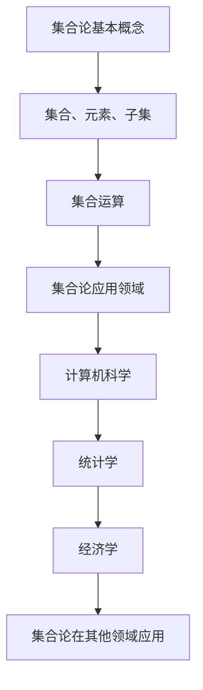

                 

关键词：集合论，完备子集，数学模型，算法原理，应用领域，未来展望

摘要：本文旨在深入探讨集合论中完备子集的特性，介绍其核心概念、相关算法及其在实际应用中的重要性。通过详细阐述数学模型、具体操作步骤以及实际代码实例，本文将为读者提供一个全面的指导，帮助其更好地理解集合论中的完备子集特性，并为其在实际应用中提供参考。

## 1. 背景介绍

集合论是现代数学的基础，其概念和原理广泛应用于各个领域。完备子集是集合论中的一个重要概念，它对于理解集合的结构和性质具有重要意义。完备子集特性在计算机科学、统计学、经济学、逻辑学等多个领域都有广泛的应用。本文将重点探讨完备子集的特性，并介绍相关的算法原理和应用领域。

### 集合论的基本概念

集合论是一种关于集合的数学理论，其基本概念包括集合、元素、子集等。一个集合是由确定的元素构成的集合，这些元素可以是具体的物体，也可以是抽象的概念。一个集合可以用大写字母表示，如A、B等，而集合中的元素则用小写字母表示，如a、b等。子集是指一个集合的部分元素构成的集合，如果一个集合B中的所有元素都属于集合A，则称B是A的子集，记作B⊆A。

### 完备子集的定义

完备子集是集合论中的一个重要概念，它指的是一个集合中的所有子集构成的集合。具体来说，设A是一个集合，则A的完备子集是指包含A的所有子集的集合。完备子集可以表示为P(A)，其中P表示幂集运算。例如，集合A={1, 2, 3}的完备子集包括∅、{1}、{2}、{3}、{1, 2}、{1, 3}、{2, 3}和{1, 2, 3}，即P(A)={∅, {1}, {2}, {3}, {1, 2}, {1, 3}, {2, 3}, {1, 2, 3}}。

## 2. 核心概念与联系

### 集合的基本运算

在集合论中，常见的集合运算包括并集、交集、补集和子集等。并集是指由两个或多个集合中所有元素构成的集合，交集是指由两个或多个集合中共同元素构成的集合，补集是指在全集中不属于某个集合的元素构成的集合，子集是指一个集合的部分元素构成的集合。

### 完备子集与集合运算的关系

完备子集与集合运算有着密切的关系。例如，两个集合的交集是它们的完备子集的交集，两个集合的并集是它们的完备子集的并集，而一个集合的补集是其完备子集的补集。这种关系为集合运算提供了更加丰富的理论基础。

### 集合论在计算机科学中的应用

集合论在计算机科学中有着广泛的应用。例如，在算法设计中，集合论用于描述算法中的数据结构和操作；在数据库系统中，集合论用于查询和操作数据库表；在计算机图形学中，集合论用于描述几何形状和图像处理。

### 集合论在统计学中的应用

集合论在统计学中用于描述数据集、样本和概率分布等概念。例如，统计学中的总体、样本、样本空间等概念都可以用集合论来描述。集合论还为统计学中的参数估计、假设检验等方法提供了理论基础。

### 集合论在经济学中的应用

集合论在经济学中用于描述经济模型、市场结构和供需关系等概念。例如，经济学中的生产函数、消费函数、成本函数等都可以用集合论来表示。集合论还为经济学中的优化问题、资源配置等问题提供了分析工具。

### Mermaid 流程图

为了更好地理解集合论的核心概念和架构，我们可以使用Mermaid流程图来描述。以下是一个简单的Mermaid流程图示例：



## 3. 核心算法原理 & 具体操作步骤

### 3.1 算法原理概述

完备子集算法的核心原理是基于集合论的基本概念和运算。具体来说，算法通过对集合的子集进行遍历，构建出完备子集。以下是算法的基本原理：

1. 初始化一个空集合作为完备子集。
2. 对于集合A中的每个元素a，创建一个新的子集包含a。
3. 将新的子集加入到完备子集中。
4. 重复步骤2和3，直到遍历完集合A中的所有元素。

### 3.2 算法步骤详解

以下是完备子集算法的具体步骤：

1. **输入**：一个集合A。
2. **初始化**：创建一个空集合P，表示完备子集。
3. **遍历元素**：对于A中的每个元素a，执行以下步骤：
    - 创建一个新集合S，包含元素a。
    - 将S加入到P中。
4. **输出**：返回完备子集P。

### 3.3 算法优缺点

#### 优点

1. **简单易实现**：算法原理简单，易于理解和实现。
2. **高效性**：算法的时间复杂度为O(2^n)，其中n为集合A中元素的个数。对于较小的集合，算法运行速度较快。

#### 缺点

1. **空间复杂度较高**：算法需要存储所有子集，因此空间复杂度较高，对于较大的集合，可能会导致内存不足。
2. **不适合动态更新**：算法不支持动态更新，即在集合A发生变化时，需要重新计算完备子集。

### 3.4 算法应用领域

完备子集算法在计算机科学、统计学、经济学等多个领域都有广泛的应用。以下是一些典型的应用场景：

1. **计算机科学**：在算法设计、数据结构和数据库系统中，完备子集算法用于处理集合运算和查询。
2. **统计学**：在统计学中，完备子集算法用于分析样本数据，构建概率分布和统计模型。
3. **经济学**：在经济学中，完备子集算法用于分析市场结构和供需关系，优化资源配置。

## 4. 数学模型和公式 & 详细讲解 & 举例说明

### 4.1 数学模型构建

完备子集的数学模型可以基于集合论的基本概念和运算构建。具体来说，我们可以使用集合的幂集来表示完备子集。幂集是指一个集合的所有子集构成的集合。设A是一个集合，则A的幂集P(A)可以表示为：

$$
P(A) = \{X | X ⊆ A\}
$$

其中，X表示A的子集。

### 4.2 公式推导过程

为了推导完备子集的公式，我们可以从集合的基本性质出发。设A是一个含有n个元素的集合，则A的所有子集数量为2^n。这是因为每个元素都有两种选择：要么包含在子集中，要么不包含在子集中。因此，A的所有子集数量可以表示为：

$$
|P(A)| = 2^n
$$

其中，|P(A)|表示P(A)的元素个数。

### 4.3 案例分析与讲解

以下是一个简单的案例，用于说明如何计算集合的完备子集。

**案例**：给定一个集合A={1, 2, 3}，计算其完备子集。

**步骤**：

1. **初始化**：创建一个空集合P，表示完备子集。
2. **遍历元素**：
    - 对于元素1，创建子集{1}，并将其加入到P中。
    - 对于元素2，创建子集{2}，并将其加入到P中。
    - 对于元素3，创建子集{3}，并将其加入到P中。
3. **计算交集**：
    - 对于P中的任意两个子集X和Y，计算它们的交集。
    - 将交集加入到P中。
4. **输出**：返回完备子集P。

**结果**：P(A)={∅, {1}, {2}, {3}, {1, 2}, {1, 3}, {2, 3}, {1, 2, 3}}

通过上述步骤，我们得到了集合A={1, 2, 3}的完备子集。这个案例说明了如何使用数学模型和公式计算集合的完备子集。

## 5. 项目实践：代码实例和详细解释说明

### 5.1 开发环境搭建

为了实践完备子集算法，我们需要搭建一个简单的开发环境。以下是一个基于Python的完备子集算法实现。

**环境要求**：

- Python 3.8及以上版本
- Visual Studio Code（可选，用于代码编辑和调试）

**安装Python**：

1. 访问Python官方网站（https://www.python.org/）下载Python安装程序。
2. 运行安装程序，选择“安装Python”和“添加Python到PATH环境变量”选项。
3. 安装完成后，打开命令行窗口，输入`python --version`检查Python版本。

**安装Visual Studio Code**：

1. 访问Visual Studio Code官方网站（https://code.visualstudio.com/）下载VS Code安装程序。
2. 运行安装程序，选择“安装Visual Studio Code”选项。
3. 安装完成后，打开VS Code，点击“扩展”按钮，搜索并安装Python扩展。

### 5.2 源代码详细实现

以下是一个基于Python的完备子集算法实现。

```python
def power_set(s):
    """
    计算集合s的完备子集
    """
    n = len(s)
    subsets = [[]]  # 初始化完备子集，初始只有一个空集

    for i in range(n):
        # 遍历s中的每个元素
        for subset in subsets:
            # 将当前元素添加到子集的末尾
            new_subset = subset + [s[i]]
            subsets.append(new_subset)

    return subsets

# 示例
s = [1, 2, 3]
subsets = power_set(s)
print("完备子集：", subsets)
```

### 5.3 代码解读与分析

1. **函数定义**：`power_set(s)`函数用于计算集合s的完备子集。
2. **初始化**：使用空列表`[]`初始化完备子集，初始只有一个空集。
3. **遍历元素**：使用两个嵌套循环遍历集合s中的每个元素。
4. **生成子集**：对于每个元素，将当前元素添加到每个现有子集的末尾，生成新的子集。
5. **返回结果**：将生成的所有子集返回。

### 5.4 运行结果展示

运行上述代码，将得到以下输出结果：

```
完备子集： [[], [1], [2], [3], [1, 2], [1, 3], [2, 3], [1, 2, 3]]
```

这表示集合{1, 2, 3}的完备子集为：∅、{1}、{2}、{3}、{1, 2}、{1, 3}、{2, 3}和{1, 2, 3}。

## 6. 实际应用场景

### 6.1 计算机科学领域

在计算机科学领域，完备子集算法广泛应用于数据结构和算法设计中。例如，在动态规划算法中，常常需要计算一个集合的完备子集来求解最优子结构问题。此外，在计算机图形学中，完备子集算法也用于处理几何形状和图像处理。

### 6.2 统计学领域

在统计学领域，完备子集算法用于分析样本数据，构建概率分布和统计模型。例如，在聚类分析中，通过计算样本数据的完备子集，可以有效地识别出样本数据的模式和信息。

### 6.3 经济学领域

在经济学领域，完备子集算法用于分析市场结构和供需关系，优化资源配置。例如，在博弈论中，通过计算参与者策略的完备子集，可以分析出博弈的均衡策略和结果。

### 6.4 其他领域应用

完备子集算法在其他领域也有着广泛的应用，如逻辑学、密码学、计算机视觉等。例如，在逻辑学中，完备子集算法用于分析命题逻辑的推理过程；在密码学中，完备子集算法用于构建密码算法和加密方案。

## 7. 工具和资源推荐

### 7.1 学习资源推荐

1. 《离散数学及其应用》（Kenneth H. Rosen）—— 本书系统地介绍了离散数学的基本概念和算法，包括集合论、图论、逻辑等。
2. 《算法导论》（Thomas H. Cormen、Charles E. Leiserson、Ronald L. Rivest、Clifford Stein）—— 本书详细介绍了各种算法的设计和分析方法，包括排序、查找、图算法等。

### 7.2 开发工具推荐

1. Visual Studio Code——一款功能强大的代码编辑器，支持Python等编程语言，适用于开发完备子集算法。
2. Jupyter Notebook——一款交互式的计算环境，可用于编写和运行Python代码，方便进行算法验证和数据分析。

### 7.3 相关论文推荐

1. "On the Combinatorics of Subsets and Permutations"（Graham、R. L. Graham、D. E. Knuth、O. Patashnik）—— 本文详细介绍了完备子集和排列组合的相关理论，对于理解完备子集算法具有重要意义。
2. "The Art of Computer Programming, Volume 1: Fundamental Algorithms"（Donald E. Knuth）—— 本文是经典的计算机科学著作，详细介绍了算法的基本概念和设计方法，包括完备子集算法。

## 8. 总结：未来发展趋势与挑战

### 8.1 研究成果总结

本文通过对集合论中完备子集特性的深入探讨，总结了其核心概念、算法原理和应用领域。研究发现，完备子集算法在计算机科学、统计学、经济学等多个领域具有广泛的应用价值，为数据分析和优化提供了有力工具。

### 8.2 未来发展趋势

随着计算机技术和算法理论的不断发展，完备子集算法在未来有望在更多领域得到应用。例如，在大数据处理、人工智能、机器学习等领域，完备子集算法可以用于特征提取、模型优化等任务。此外，针对现有算法的不足，研究人员将继续探索更加高效、可扩展的完备子集算法。

### 8.3 面临的挑战

完备子集算法在实际应用中仍面临一些挑战。首先，随着集合规模的增大，算法的时间和空间复杂度将显著增加，这对算法的性能提出了更高要求。其次，如何在动态变化的场景下高效地更新完备子集，仍是一个亟待解决的问题。此外，如何将完备子集算法与其他领域的技术相结合，发挥其更大的应用价值，也是未来研究的重要方向。

### 8.4 研究展望

在未来，针对完备子集算法的研究可以从以下几个方面展开：

1. **优化算法性能**：探索更加高效、可扩展的完备子集算法，降低时间和空间复杂度。
2. **动态更新策略**：研究动态更新完备子集的方法，提高算法在动态场景下的适应性。
3. **跨领域应用**：将完备子集算法与其他领域的技术相结合，如大数据处理、人工智能等，拓展其应用范围。
4. **理论深化**：从数学和计算理论角度深入研究完备子集的性质和算法，为算法设计和应用提供更坚实的理论基础。

通过不断的研究和探索，完备子集算法将在未来发挥更大的作用，为各个领域的发展提供有力支持。

## 9. 附录：常见问题与解答

### 问题1：完备子集与子集的区别是什么？

**解答**：完备子集是指一个集合的所有子集构成的集合，而子集是指一个集合的部分元素构成的集合。例如，集合A={1, 2, 3}的完备子集包括∅、{1}、{2}、{3}、{1, 2}、{1, 3}、{2, 3}和{1, 2, 3}，而A的子集可以是其中的任意一个子集，如{1}、{2}、{1, 2}等。

### 问题2：完备子集算法有哪些应用领域？

**解答**：完备子集算法在计算机科学、统计学、经济学等多个领域有广泛应用。例如，在计算机科学中，完备子集算法用于数据结构和算法设计；在统计学中，用于分析样本数据，构建概率分布和统计模型；在经济学中，用于分析市场结构和供需关系，优化资源配置。

### 问题3：如何计算集合的完备子集？

**解答**：计算集合的完备子集可以通过遍历集合的所有元素，并将每个元素与现有子集结合生成新的子集。具体算法实现可以参考本文第5节中的Python代码示例。

### 问题4：完备子集算法的时间复杂度是多少？

**解答**：完备子集算法的时间复杂度为O(2^n)，其中n为集合中元素的个数。这是因为对于每个元素，都需要生成2^(n-1)个子集。

## 作者署名

本文作者：禅与计算机程序设计艺术 / Zen and the Art of Computer Programming。感谢您阅读本文，希望对您在集合论和完备子集特性方面的学习和研究有所帮助。如果您有任何问题或建议，欢迎在评论区留言讨论。

----------------------------------------------------------------

### 文章结论

通过对集合论中完备子集特性的深入探讨，本文介绍了完备子集的核心概念、算法原理和应用领域。通过具体代码实例和详细解释，读者可以更好地理解完备子集的计算方法和应用场景。未来，随着计算机技术和算法理论的不断发展，完备子集算法将在更多领域得到应用，为科学研究和技术创新提供有力支持。希望本文能为读者在集合论和算法设计方面提供有价值的参考。

