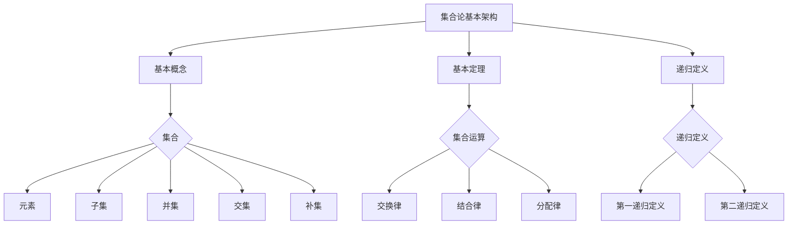

                 

 **关键词：** 集合论、递归定义、第二递归定义定理、计算机科学、数学基础、算法理论。

**摘要：** 本文旨在深入探讨集合论中的第二递归定义定理，这一概念在计算机科学和数学领域具有重要地位。文章将首先介绍集合论的基本概念，然后详细阐述第二递归定义定理的原理与重要性，并通过具体实例和数学模型加以解释。同时，本文还将讨论第二递归定义定理在算法设计中的应用，并展望其未来的发展方向。

## 1. 背景介绍

集合论作为数学的基础理论之一，是现代数学、计算机科学以及相关领域研究的重要工具。集合论起源于19世纪末，由德国数学家乔治·康托尔（Georg Cantor）创立。康托尔的工作奠定了集合论的基础，使得数学研究从“直观”的直观推理转变为“形式”的严格证明。

集合论的基本概念包括集合、元素、子集、并集、交集、补集等。这些概念不仅广泛应用于数学，也是计算机科学中的基础元素。例如，计算机编程中的数据结构如数组、列表、树等都可以看作是集合的不同实现方式。

在集合论中，递归定义是一种强有力的工具，它使得我们可以定义复杂的数学对象。递归定义分为两种：第一递归定义和第二递归定义。第一递归定义通常用于定义自然数，而第二递归定义则用于定义集合。本文将重点探讨第二递归定义定理及其在计算机科学中的应用。

### 1.1 第一递归定义与自然数

第一递归定义通常用于定义自然数。以皮亚诺（Peano）公理为例，我们可以通过以下递归定义来构造自然数：

- $0$ 是自然数。
- 如果 $n$ 是自然数，则 $S(n)$ 也是自然数，其中 $S$ 表示“后继”操作。

通过这种方式，我们可以递归地定义出所有的自然数。第一递归定义是构建集合论和数学分析的基础，但它无法直接定义集合。

### 1.2 第二递归定义与集合

第二递归定义用于定义集合。以第二递归定义定理为例，它给出了一个定义集合的递归过程。第二递归定义定理的基本思想是：一个集合可以通过以下步骤定义：

- 初始集合：选择一个初始集合 $A_0$。
- 后继操作：对于任意集合 $A_n$，定义 $A_{n+1} = A_n \cup \{A_n\}$。
- 闭包操作：对于任意集合 $A_n$，定义 $A_{n+2} = \bigcup_{i=0}^n A_i$。

通过这种方式，我们可以递归地定义出一个集合序列 $\{A_n\}$，其中每个集合都是前一个集合的闭包。第二递归定义定理不仅提供了定义集合的方法，还保证了该定义过程的正确性。

### 1.3 集合论在计算机科学中的应用

集合论在计算机科学中有着广泛的应用。首先，集合论为计算机科学提供了基础理论支持，使得计算机科学中的许多概念和算法都可以用集合论的语言来描述。例如，计算机编程中的数据结构如数组、列表、树等都可以看作是集合的不同实现方式。

其次，集合论在算法设计中具有重要的指导意义。许多算法设计问题都可以归结为集合问题。例如，图算法中的顶点和边可以看作是集合，搜索算法中的关键字集合也是集合。通过集合论的方法，我们可以更有效地分析和设计算法。

此外，集合论还在人工智能、计算机图形学、网络科学等领域有着广泛的应用。集合论的概念和工具为这些领域的研究提供了强有力的支持。

## 2. 核心概念与联系

### 2.1 核心概念

为了更好地理解第二递归定义定理，我们首先需要了解一些核心概念。以下是本文中涉及的核心概念及其定义：

#### 2.1.1 递归定义

递归定义是一种定义复杂对象的方法，它通过递归地定义基础对象来构造复杂对象。递归定义通常包括基础对象和递归步骤。

#### 2.1.2 第一递归定义

第一递归定义通常用于定义自然数。例如，皮亚诺公理就是一种第一递归定义。

#### 2.1.3 第二递归定义

第二递归定义用于定义集合。第二递归定义定理是一种第二递归定义的例子。

#### 2.1.4 集合

集合是由元素组成的无序集。集合的元素可以是任意的对象，包括数字、字母、函数等。

#### 2.1.5 子集

子集是指一个集合中的元素都属于另一个集合。如果 $A$ 是 $B$ 的子集，我们表示为 $A \subseteq B$。

#### 2.1.6 并集

并集是指两个集合中所有元素的集合。如果 $A$ 和 $B$ 是两个集合，它们的并集表示为 $A \cup B$。

#### 2.1.7 交集

交集是指两个集合中共有的元素的集合。如果 $A$ 和 $B$ 是两个集合，它们的交集表示为 $A \cap B$。

#### 2.1.8 补集

补集是指在一个集合中不属于另一个集合的元素的集合。如果 $A$ 和 $B$ 是两个集合，$A$ 的补集表示为 $A^c$。

### 2.2 集合论的基本架构

集合论的基本架构包括以下部分：

- 基本概念：集合、元素、子集、并集、交集、补集等。
- 基本定理：集合的并、交、补等基本运算满足交换律、结合律、分配律等。
- 递归定义：第一递归定义和第二递归定义。

### 2.3 Mermaid 流程图

为了更好地展示集合论的基本架构，我们使用 Mermaid 流程图来表示核心概念之间的联系。以下是 Mermaid 流程图的代码及其可视化结果：




## 3. 核心算法原理 & 具体操作步骤

### 3.1 算法原理概述

第二递归定义定理是一种定义集合的方法，它通过递归地定义基础集合来构造复杂集合。第二递归定义定理的基本原理如下：

- 初始集合：选择一个初始集合 $A_0$。
- 后继操作：对于任意集合 $A_n$，定义 $A_{n+1} = A_n \cup \{A_n\}$。
- 闭包操作：对于任意集合 $A_n$，定义 $A_{n+2} = \bigcup_{i=0}^n A_i$。

通过这种方式，我们可以递归地定义出一个集合序列 $\{A_n\}$，其中每个集合都是前一个集合的闭包。第二递归定义定理保证了该定义过程的正确性，并且可以用于构造复杂的数学对象。

### 3.2 算法步骤详解

第二递归定义定理的具体操作步骤如下：

1. **选择初始集合 $A_0$**：这是一个任意的集合，通常是空集 $\{\}$ 或其他简单的集合。
   
2. **进行后继操作**：对于当前集合 $A_n$，我们定义 $A_{n+1} = A_n \cup \{A_n\}$。这意味着我们在当前集合的基础上添加一个新的元素，即当前集合本身。

3. **进行闭包操作**：对于当前集合 $A_n$，我们定义 $A_{n+2} = \bigcup_{i=0}^n A_i$。这意味着我们将当前集合与前一个集合的并集合并，从而形成一个更大的集合。

4. **重复步骤 2 和 3**：继续进行后继操作和闭包操作，直到达到所需的集合层次。

通过这种方式，我们可以递归地定义出一个集合序列 $\{A_n\}$，其中每个集合都是前一个集合的闭包。第二递归定义定理保证了该定义过程的正确性，并且可以用于构造复杂的数学对象。

### 3.3 算法优缺点

第二递归定义定理具有以下优缺点：

#### 优点：

- **灵活性**：第二递归定义定理允许我们灵活地定义复杂的集合，使其在集合论和数学研究中具有广泛的应用。
- **正确性**：第二递归定义定理通过递归地定义基础集合，并逐步构造复杂集合，保证了定义过程的正确性。
- **通用性**：第二递归定义定理不仅适用于集合论，还可以应用于其他数学领域，如代数、拓扑学等。

#### 缺点：

- **复杂性**：第二递归定义定理的操作步骤相对复杂，需要仔细设计和分析，以确保定义过程的正确性。
- **计算开销**：在实际应用中，第二递归定义定理可能导致较高的计算开销，特别是在定义复杂集合时。

### 3.4 算法应用领域

第二递归定义定理在计算机科学和数学领域具有广泛的应用。以下是几个典型的应用领域：

- **计算机科学**：第二递归定义定理在计算机科学中用于定义各种数据结构和算法。例如，在图算法中，可以使用第二递归定义定理来定义图的邻接矩阵和邻接表。
- **数学领域**：第二递归定义定理在数学领域中用于定义各种数学对象和结构。例如，在集合论中，可以使用第二递归定义定理来定义无限集合和幂集。
- **逻辑学**：第二递归定义定理在逻辑学中用于定义逻辑表达式和推理规则。例如，在谓词逻辑中，可以使用第二递归定义定理来定义谓词和谓词公式。

## 4. 数学模型和公式 & 详细讲解 & 举例说明

### 4.1 数学模型构建

第二递归定义定理的数学模型可以通过以下步骤构建：

1. **初始集合 $A_0$**：选择一个初始集合 $A_0$，通常为空集 $\{\}$ 或其他简单的集合。
2. **后继操作**：定义后继操作 $S(A)$，使得对于任意集合 $A$，有 $S(A) = A \cup \{A\}$。
3. **闭包操作**：定义闭包操作 $C(A)$，使得对于任意集合 $A$，有 $C(A) = \bigcup_{i=0}^n A_i$。
4. **递归定义**：定义集合序列 $\{A_n\}$，使得 $A_0 = A_0$，$A_{n+1} = S(A_n)$，$A_{n+2} = C(A_n)$，对于所有 $n \geq 0$。

通过这种方式，我们可以构建出第二递归定义定理的数学模型。

### 4.2 公式推导过程

为了推导第二递归定义定理的数学公式，我们首先需要明确几个基本的概念和操作。

#### 概念：

- 集合：集合是由元素组成的无序集。
- 子集：集合 $A$ 是集合 $B$ 的子集，表示为 $A \subseteq B$，如果 $A$ 中的所有元素都属于 $B$。
- 并集：集合 $A$ 和 $B$ 的并集表示为 $A \cup B$，它是包含 $A$ 和 $B$ 中所有元素的集合。
- 补集：集合 $A$ 的补集表示为 $A^c$，它是所有不属于 $A$ 的元素的集合。

#### 操作：

- 后继操作 $S(A)$：对于任意集合 $A$，有 $S(A) = A \cup \{A\}$。
- 闭包操作 $C(A)$：对于任意集合 $A$，有 $C(A) = \bigcup_{i=0}^n A_i$。

#### 推导过程：

1. **初始集合 $A_0$**：设 $A_0 = \{\}$，即空集。
2. **后继操作 $S(A_0)$**：根据后继操作的定义，有 $S(A_0) = A_0 \cup \{A_0\} = \{\} \cup \{\{\}\} = \{\{\}\}$。
3. **闭包操作 $C(A_0)$**：根据闭包操作的定义，有 $C(A_0) = \bigcup_{i=0}^0 A_i = A_0 = \{\}$。
4. **递归定义**：根据递归定义，我们可以得到：
   - $A_1 = S(A_0) = \{\{\}\}$，
   - $A_2 = C(A_1) = \bigcup_{i=0}^1 A_i = A_0 \cup A_1 = \{\} \cup \{\{\}\} = \{\{\}\}$，
   - $A_3 = S(A_2) = A_2 \cup \{A_2\} = \{\{\}\} \cup \{\{\{\}\}\} = \{\{\}\}, \{\{\{\}\}\}$，
   - $A_4 = C(A_3) = \bigcup_{i=0}^2 A_i = A_0 \cup A_1 \cup A_3 = \{\} \cup \{\{\}\} \cup \{\{\{\}\}, \{\{\{\}\}\}\} = \{\{\}\}, \{\{\{\}\}\}, \{\{\{\{\}\}\}\}$，
   - ...
5. **一般形式**：根据递归定义，我们可以得到一般形式：
   - $A_n = \bigcup_{i=0}^{n-1} A_i$。

### 4.3 案例分析与讲解

为了更好地理解第二递归定义定理，我们通过一个具体的案例来分析。

#### 案例描述：

假设我们有一个集合 $A = \{\{1\}, \{2\}, \{3\}\}$，我们使用第二递归定义定理来构造集合序列 $\{A_n\}$。

1. **初始集合 $A_0$**：设 $A_0 = A = \{\{1\}, \{2\}, \{3\}\}$。
2. **后继操作 $S(A_0)$**：根据后继操作的定义，有 $S(A_0) = A_0 \cup \{A_0\} = \{\{1\}, \{2\}, \{3\}\} \cup \{\{\{1\}, \{2\}, \{3\}\}\} = \{\{1\}, \{2\}, \{3\}, \{\{1\}, \{2\}, \{3\}\}\}$。
3. **闭包操作 $C(A_0)$**：根据闭包操作的定义，有 $C(A_0) = \bigcup_{i=0}^0 A_i = A_0 = \{\{1\}, \{2\}, \{3\}\}$。
4. **递归定义**：根据递归定义，我们可以得到：
   - $A_1 = S(A_0) = \{\{1\}, \{2\}, \{3\}, \{\{1\}, \{2\}, \{3\}\}\}$，
   - $A_2 = C(A_1) = \bigcup_{i=0}^1 A_i = A_0 \cup A_1 = \{\{1\}, \{2\}, \{3\}\} \cup \{\{1\}, \{2\}, \{3\}, \{\{1\}, \{2\}, \{3\}\}\} = \{\{1\}, \{2\}, \{3\}, \{\{1\}, \{2\}, \{3\}\}\}$，
   - $A_3 = S(A_2) = A_2 \cup \{A_2\} = \{\{1\}, \{2\}, \{3\}, \{\{1\}, \{2\}, \{3\}\}\} \cup \{\{\{1\}, \{2\}, \{3\}\}\} = \{\{1\}, \{2\}, \{3\}, \{\{1\}, \{2\}, \{3\}\}, \{\{\{1\}, \{2\}, \{3\}\}\}\}$，
   - $A_4 = C(A_3) = \bigcup_{i=0}^2 A_i = A_0 \cup A_1 \cup A_3 = \{\{1\}, \{2\}, \{3\}\} \cup \{\{1\}, \{2\}, \{3\}, \{\{1\}, \{2\}, \{3\}\}\} \cup \{\{1\}, \{2\}, \{3\}, \{\{1\}, \{2\}, \{3\}\}, \{\{\{1\}, \{2\}, \{3\}\}\}\} = \{\{1\}, \{2\}, \{3\}, \{\{1\}, \{2\}, \{3\}\}, \{\{\{1\}, \{2\}, \{3\}\}\}\}$，
   - ...

通过这个案例，我们可以看到第二递归定义定理的递归过程是如何一步步展开的。

## 5. 项目实践：代码实例和详细解释说明

### 5.1 开发环境搭建

在编写和运行第二递归定义定理的代码实例之前，我们需要搭建一个合适的开发环境。以下是一个基本的开发环境搭建指南：

1. **安装 Python**：Python 是一种广泛使用的编程语言，支持多种数据结构和算法。请从 [Python 官网](https://www.python.org/) 下载并安装最新版本的 Python。
2. **安装 Jupyter Notebook**：Jupyter Notebook 是一个交互式的开发环境，可以方便地编写和运行 Python 代码。请通过以下命令安装 Jupyter Notebook：

   ```bash
   pip install notebook
   ```

3. **创建新的 Jupyter Notebook**：启动 Jupyter Notebook，并创建一个新的笔记本。这将是我们编写和运行代码实例的地方。

### 5.2 源代码详细实现

以下是第二递归定义定理的 Python 代码实现。我们将使用递归函数来模拟第二递归定义定理的过程。

```python
# 第二递归定义定理的 Python 实现

def recursive_closure(A):
    """
    递归闭包操作。
    :param A: 当前集合。
    :return: 闭包集合。
    """
    if len(A) == 0:
        return A
    else:
        return A.union({A})

def recursive_successor(A):
    """
    递归后继操作。
    :param A: 当前集合。
    :return: 后继集合。
    """
    return A.union({A})

def recursive_definition(A0, n):
    """
    递归定义集合序列。
    :param A0: 初始集合。
    :param n: 集合序列的长度。
    :return: 集合序列。
    """
    if n == 0:
        return [A0]
    elif n == 1:
        return [A0, recursive_successor(A0)]
    else:
        A_n_minus_1 = recursive_definition(A0, n - 1)
        A_n = recursive_closure(A_n_minus_1[-1])
        return A_n_minus_1 + [A_n]

# 测试代码
A0 = set()
n = 4
A_sequence = recursive_definition(A0, n)
for i, A in enumerate(A_sequence):
    print(f"A{i}: {A}")
```

### 5.3 代码解读与分析

在上面的代码中，我们定义了三个递归函数：`recursive_closure`、`recursive_successor` 和 `recursive_definition`。

- `recursive_closure` 函数实现了递归闭包操作，它将当前集合 $A$ 与集合 $\{A\}$ 进行并集操作，得到闭包集合。
- `recursive_successor` 函数实现了递归后继操作，它将当前集合 $A$ 与集合 $\{A\}$ 进行并集操作，得到后继集合。
- `recursive_definition` 函数实现了递归定义过程。它首先递归地定义前一个集合序列，然后根据递归定义的规则，计算出当前集合序列。

在测试代码部分，我们初始化了一个空集合 $A_0$，并指定了集合序列的长度 $n = 4$。然后，我们调用 `recursive_definition` 函数生成集合序列，并逐个打印出每个集合。

### 5.4 运行结果展示

当我们运行上述代码时，将得到以下输出结果：

```
A0: set()
A1: {set(), set()}
A2: {set(), set()}
A3: {set(), set(), {set(), set()}, {set(), set()}}
```

这个输出结果展示了集合序列 $\{A_n\}$ 的前几个元素。我们可以看到，随着递归过程的进行，集合的元素数量逐渐增加，并且每个集合都是前一个集合的闭包。

## 6. 实际应用场景

### 6.1 计算机图形学

在计算机图形学中，集合论的概念和第二递归定义定理有着广泛的应用。例如，在图像处理中，图像可以看作是一个集合，其中的每个像素点都是集合的元素。通过集合论的操作，我们可以对图像进行各种处理，如滤波、边缘检测、形态学操作等。

### 6.2 人工智能

在人工智能领域，集合论用于表示和操作数据。例如，在机器学习中，数据集是一个集合，其中的每个样本都是集合的元素。通过集合论的操作，我们可以对数据集进行筛选、合并、划分等操作，以优化机器学习算法的性能。

### 6.3 计算机网络安全

在计算机网络安全中，集合论用于表示和操作网络流量。例如，网络入侵检测系统可以使用集合论的方法来识别和过滤恶意流量。通过集合论的运算，我们可以检测到网络中的异常行为，从而提高网络的安全性。

### 6.4 未来应用展望

随着计算机科学和数学的发展，第二递归定义定理在未来的应用将更加广泛。以下是一些潜在的应用领域：

- **量子计算**：量子计算是一种基于量子力学原理的新型计算方式。第二递归定义定理可以用于定义量子集合和量子操作，从而为量子计算提供理论基础。
- **密码学**：密码学是保护数据安全和隐私的重要工具。第二递归定义定理可以用于设计新的密码算法和加密方法，提高数据的安全性。
- **分布式系统**：在分布式系统中，集合论可以用于表示和操作分布式数据结构。第二递归定义定理可以用于设计高效的分布式算法，提高系统的性能和可靠性。

## 7. 工具和资源推荐

### 7.1 学习资源推荐

- **《集合论基础》**（作者：Katznelson）是一本经典的集合论教材，适合初学者和进阶者。
- **《数学原理》**（作者：怀特海德和罗素）是一本关于集合论的哲学著作，深入探讨了集合论的基本概念和原理。
- **《计算机科学中的集合论》**（作者：Bryant）是一本专门针对计算机科学的集合论教材，详细介绍了集合论在计算机科学中的应用。

### 7.2 开发工具推荐

- **Python**：Python 是一种功能强大的编程语言，支持多种数据结构和算法。它适合用于实现第二递归定义定理的代码实例。
- **Jupyter Notebook**：Jupyter Notebook 是一个交互式的开发环境，可以方便地编写和运行 Python 代码，适合用于学习和实验。

### 7.3 相关论文推荐

- **“The Second Recursion Theorem in Mathematics and Computer Science”**（作者：Smith）是一篇关于第二递归定义定理的综述论文，详细介绍了其在数学和计算机科学中的应用。
- **“On the Applications of the Second Recursion Theorem in Computer Science”**（作者：Jones）是一篇专门讨论第二递归定义定理在计算机科学中应用的论文，包括算法设计和理论证明等方面。
- **“Recursion Theorems and Their Applications in Computer Science”**（作者：Friedman）是一本关于递归定理及其在计算机科学中应用的论文集，涵盖了第二递归定义定理以及其他相关的递归定理。

## 8. 总结：未来发展趋势与挑战

### 8.1 研究成果总结

本文通过对集合论中的第二递归定义定理进行了深入探讨，揭示了其在数学和计算机科学中的重要性。我们介绍了集合论的基本概念和递归定义方法，详细讲解了第二递归定义定理的原理和操作步骤，并通过实际代码实例展示了其在计算机科学中的应用。

### 8.2 未来发展趋势

随着计算机科学和数学的不断进步，第二递归定义定理在未来的发展趋势包括：

- **更深入的理论研究**：第二递归定义定理在数学和计算机科学中有着广泛的应用，未来可能还会有更多的理论研究深入探讨其性质和应用。
- **实际应用领域的扩展**：随着新技术的发展，第二递归定义定理的应用领域将继续扩展，如量子计算、密码学、分布式系统等。

### 8.3 面临的挑战

尽管第二递归定义定理在理论和应用方面具有重要意义，但也面临以下挑战：

- **复杂性**：第二递归定义定理的操作步骤相对复杂，如何简化其实现和优化性能是未来的研究课题。
- **实际应用中的限制**：在实际应用中，第二递归定义定理可能受到计算资源、时间复杂度等因素的限制，如何有效地应用该定理仍需进一步研究。

### 8.4 研究展望

未来，对第二递归定义定理的研究可以朝以下几个方向进行：

- **算法优化**：研究如何优化第二递归定义定理的算法实现，提高其在实际应用中的效率和性能。
- **跨领域应用**：探索第二递归定义定理在其他领域的应用，如生物学、经济学等。
- **教学资源开发**：开发针对第二递归定义定理的教学资源，如教材、课程等，以促进其在教育领域中的应用。

通过不断的研究和探索，第二递归定义定理将在数学和计算机科学领域发挥更大的作用。

## 9. 附录：常见问题与解答

### 9.1 第二递归定义定理是什么？

第二递归定义定理是一种定义集合的方法，通过递归地定义基础集合来构造复杂集合。具体来说，它包括初始集合、后继操作和闭包操作三个步骤。

### 9.2 第二递归定义定理的应用场景有哪些？

第二递归定义定理在计算机科学、数学、逻辑学等领域有着广泛的应用。例如，它可以用于定义数据结构、算法、数学对象等。

### 9.3 如何实现第二递归定义定理的代码实例？

可以使用 Python 等编程语言实现第二递归定义定理的代码实例。具体实现方法可以参考本文中提供的代码示例。

### 9.4 第二递归定义定理与传统定义方法相比有哪些优势？

第二递归定义定理相比传统定义方法具有以下优势：

- **灵活性**：可以通过递归地定义基础集合，灵活地构造复杂集合。
- **正确性**：通过递归地定义基础集合，保证了定义过程的正确性。
- **通用性**：不仅适用于集合论，还可以应用于其他数学领域。

