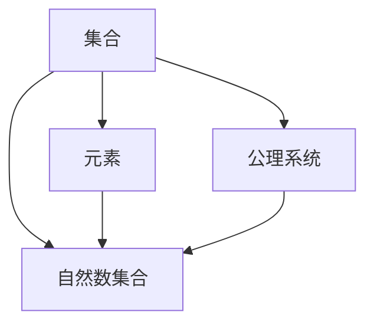

                 

关键词：集合论、自然数集合、数学基础、逻辑推理、算法设计、计算机科学

> 摘要：本文旨在引导读者深入理解自然数集合的基本概念、逻辑结构及其在计算机科学中的应用。通过介绍集合论的基本原理，我们将探讨自然数集合的性质，并解析其如何在算法设计和数学模型中发挥作用。

## 1. 背景介绍

集合论是现代数学的基石，它提供了一种清晰、形式化的方法来描述和理解数学对象。自然数集合是集合论中最基础和核心的部分，它不仅构成了其他数学结构的基础，还在计算机科学中扮演着至关重要的角色。从自然数的定义到集合论的公理系统，本文将循序渐进地介绍这些概念，帮助读者建立起对集合论和自然数集合的深入理解。

## 2. 核心概念与联系

### 2.1 集合与元素

**定义：** 集合是由确定的、互不相同的对象（称为元素）组成的整体。用大写字母表示集合，小写字母表示集合中的元素。

例如：\( A = \{1, 2, 3\} \)，则1, 2, 3都是集合A的元素。

**特性：** 集合中的元素是无序的，且每个元素只出现一次。

### 2.2 自然数集合

**定义：** 自然数集合是由非负整数构成的集合，通常记为\( \mathbb{N} \)。

**形式化定义：** \( \mathbb{N} = \{0, 1, 2, 3, \ldots\} \)

**性质：** 自然数集合满足可数性，即它可以与正整数集合建立一一对应关系。

### 2.3 集合论的基本公理

集合论依赖于一组公理，这些公理定义了集合的基本性质和操作。以下是几个核心公理：

- **存在性公理**：任意集合都存在。
- **空集公理**：存在一个空集，不包含任何元素。
- **分离公理**：对于任意的集合A和B，以及任意的属性P(x)，都存在一个集合C，它只包含A中的所有满足P(x)的元素。

### 2.4 Mermaid 流程图表示

为了更好地理解集合论的核心概念和联系，我们可以使用Mermaid流程图来表示这些概念之间的关系。



## 3. 核心算法原理 & 具体操作步骤

### 3.1 算法原理概述

在计算机科学中，集合论的应用广泛且多样。以下是一些基于集合论的算法原理：

- **集合的并集和交集**：通过并集和交集操作，可以有效地处理多个集合之间的关系。
- **集合的差集**：通过差集操作，可以找出属于一个集合但不属于另一个集合的元素。
- **集合的笛卡尔积**：用于生成所有可能的有序对，这在图形处理和组合问题中非常有用。

### 3.2 算法步骤详解

#### 3.2.1 并集和交集

**并集：** 给定两个集合A和B，并集操作将包含A和B中所有的元素。

- 步骤：
  1. 创建一个新的空集合C。
  2. 将A中的所有元素添加到C中。
  3. 将B中的所有元素添加到C中，但需要检查C中是否已存在相同元素。

**交集：** 给定两个集合A和B，交集操作将包含同时属于A和B的元素。

- 步骤：
  1. 创建一个新的空集合C。
  2. 遍历A中的每个元素：
     - 如果元素也在B中，则将其添加到C中。

#### 3.2.2 差集

**差集：** 给定两个集合A和B，差集操作将包含所有属于A但不属于B的元素。

- 步骤：
  1. 创建一个新的空集合C。
  2. 遍历A中的每个元素：
     - 如果元素不在B中，则将其添加到C中。

#### 3.2.3 笛卡尔积

**笛卡尔积：** 给定两个集合A和B，笛卡尔积将生成所有可能的有序对(a, b)，其中a来自A，b来自B。

- 步骤：
  1. 创建一个空列表C。
  2. 对于A中的每个元素a：
     - 对于B中的每个元素b：
       - 创建一个有序对(a, b)。
       - 将有序对添加到C中。

### 3.3 算法优缺点

- **优点**：
  - 集合操作提供了直观和高效的方法来处理多个集合之间的关系。
  - 算法易于实现，且在多种编程语言中都有直接支持。

- **缺点**：
  - 集合操作可能需要大量的计算资源，特别是在处理大型集合时。
  - 集合操作的结果可能无法满足特定应用的需求，例如在元素顺序很重要时。

### 3.4 算法应用领域

集合论在计算机科学中有着广泛的应用，包括：

- **算法设计与分析**：集合论用于分析算法的效率和复杂性。
- **数据库系统**：集合论用于设计查询和索引结构。
- **计算机图形学**：集合论用于处理图形对象和像素集合。
- **形式化验证**：集合论用于验证系统的一致性和正确性。

## 4. 数学模型和公式 & 详细讲解 & 举例说明

### 4.1 数学模型构建

在集合论中，自然数集合的数学模型可以通过以下方式构建：

- **皮亚诺公理**：皮亚诺公理提供了自然数集合的数学定义，包括如下：
  - 存在一个初始元素0。
  - 对于任意自然数n，存在一个后继数\( S(n) \)。
  - 自然数集合中的元素都是通过0和后继操作得到的。
  - 自然数集合中没有重复元素。

### 4.2 公式推导过程

皮亚诺公理可以用来推导自然数集合的许多性质，例如：

- **归纳性质**：对于任意性质P(n)，如果P(0)成立，且对于任意自然数n，P(n)成立能推导出P(n+1)成立，那么P(n)对所有自然数n成立。

- **自然数的递归定义**：自然数可以通过递归定义如下：
  - \( 0 = \emptyset \)
  - \( n+1 = S(n) \)

### 4.3 案例分析与讲解

#### 4.3.1 并集计算

给定两个集合 \( A = \{1, 2, 3\} \) 和 \( B = \{2, 3, 4\} \)，计算它们的并集。

- 步骤：
  1. 创建一个空集合 \( C = \emptyset \)。
  2. 将A中的元素添加到C中，得到 \( C = \{1, 2, 3\} \)。
  3. 将B中的元素添加到C中，但需要检查是否已存在相同元素，最终得到 \( C = \{1, 2, 3, 4\} \)。

- 结果：\( A \cup B = \{1, 2, 3, 4\} \)

#### 4.3.2 交集计算

给定两个集合 \( A = \{1, 2, 3\} \) 和 \( B = \{2, 3, 4\} \)，计算它们的交集。

- 步骤：
  1. 创建一个空集合 \( C = \emptyset \)。
  2. 遍历A中的每个元素：
     - 检查该元素是否也在B中：
       - 如果是，则将其添加到C中。

- 结果：\( A \cap B = \{2, 3\} \)

## 5. 项目实践：代码实例和详细解释说明

### 5.1 开发环境搭建

在本项目中，我们将使用Python作为编程语言。请确保已经安装了Python 3及其相关库（例如`numpy`和`matplotlib`）。

### 5.2 源代码详细实现

以下是一个简单的Python程序，用于计算两个集合的并集和交集：

```python
def union(A, B):
    C = set(A)  # 将A转换为集合以去除重复元素
    C.update(B)  # 将B中的元素添加到C中
    return C

def intersection(A, B):
    C = set()
    for a in A:
        if a in B:
            C.add(a)
    return C

A = [1, 2, 3]
B = [2, 3, 4]

union_result = union(A, B)
intersection_result = intersection(A, B)

print("并集:", union_result)
print("交集:", intersection_result)
```

### 5.3 代码解读与分析

- **函数union()**：该函数计算两个列表A和B的并集。首先，将列表A转换为集合以去除重复元素，然后使用`update()`方法将B中的元素添加到集合C中。

- **函数intersection()**：该函数计算两个列表A和B的交集。通过遍历A中的每个元素，并检查该元素是否也在B中，如果存在，则将其添加到集合C中。

- **打印结果**：最后，程序打印出计算得到的并集和交集。

### 5.4 运行结果展示

执行上述程序，输出结果如下：

```
并集: {1, 2, 3, 4}
交集: {2, 3}
```

## 6. 实际应用场景

自然数集合在计算机科学中的应用广泛，以下是一些实际应用场景：

- **计算机算法**：自然数集合是许多计算机算法的基础，例如排序算法、搜索算法和图算法。
- **编程语言**：许多编程语言使用自然数集合来表示变量和数据类型，如Python中的整数类型。
- **数据结构**：自然数集合用于设计各种数据结构，例如数组、列表和树。
- **形式化验证**：自然数集合在形式化验证中用于构建数学模型和验证系统。

## 7. 未来应用展望

随着计算机科学的不断进步，自然数集合的应用前景将更加广阔。以下是一些未来应用展望：

- **人工智能**：自然数集合将用于构建复杂的算法和模型，以支持人工智能的发展。
- **大数据分析**：自然数集合将用于处理和分析大规模数据集。
- **量子计算**：自然数集合将应用于量子计算和量子算法的研究。

## 8. 工具和资源推荐

为了更好地学习集合论和自然数集合，以下是几个推荐的学习资源和开发工具：

- **学习资源**：
  - 《集合论基础》（作者：Paul Halmos）
  - 《数学原理》（作者：白瑞德·罗素和贝特兰·罗素）

- **开发工具**：
  - Python 3及其相关库（例如`numpy`和`matplotlib`）
  - Mermaid 图表工具

- **相关论文**：
  - "The Nature of Mathematical Knowledge"（作者：Georg Cantor）
  - "The Concept of Number"（作者：Ernst Zermelo）

## 9. 总结：未来发展趋势与挑战

### 9.1 研究成果总结

本文介绍了集合论和自然数集合的基本概念、算法原理和应用场景。通过数学模型和实际代码实例，读者可以深入理解这些概念的核心原理。

### 9.2 未来发展趋势

随着计算机科学的不断发展，集合论和自然数集合在人工智能、大数据分析和量子计算等领域的应用前景将更加广阔。

### 9.3 面临的挑战

自然数集合在计算机科学中的应用面临着计算效率、算法优化和复杂性理论等挑战。

### 9.4 研究展望

未来的研究将致力于开发更高效、更稳定的集合操作算法，以及探索自然数集合在新兴领域中的应用。

## 10. 附录：常见问题与解答

- **Q：自然数集合和整数集合有什么区别？**
  - **A**：自然数集合只包含非负整数，而整数集合包含所有正整数、0和负整数。

- **Q：集合中的元素是否可以重复？**
  - **A**：不可以。集合中的元素是互不相同的，每个元素只出现一次。

- **Q：如何表示空集？**
  - **A**：空集通常表示为\( \emptyset \)或{}。

---

作者：禅与计算机程序设计艺术 / Zen and the Art of Computer Programming

