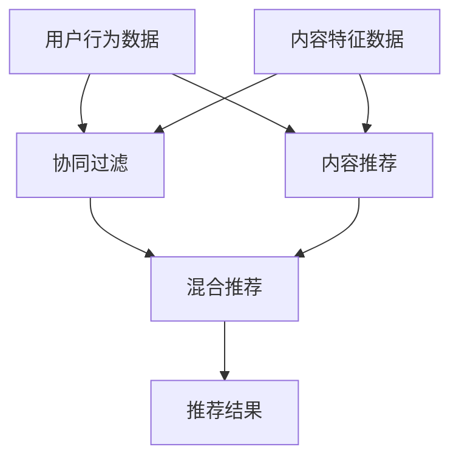

                 

关键词：音视频内容推荐，大模型，理解与匹配，人工智能，推荐系统

> 摘要：本文深入探讨了音视频内容推荐领域面临的挑战，特别是在理解和匹配用户需求方面。通过分析大模型在这些挑战中的应用，我们展示了如何利用先进的机器学习技术提升推荐系统的性能，并展望了未来的发展方向。

## 1. 背景介绍

随着互联网和移动设备的普及，音视频内容已经成为人们获取信息和娱乐的重要方式。然而，海量的音视频内容使得用户很难找到符合自己兴趣和需求的资源，因此音视频内容推荐系统应运而生。推荐系统通过分析用户的历史行为、兴趣偏好和内容特征，为用户推荐个性化的音视频内容，从而提升用户体验和满意度。

然而，音视频内容推荐系统面临着诸多挑战。首先，音视频内容的多样性高，不同类型的音视频内容具有不同的特征和结构，这使得传统推荐算法难以处理。其次，用户需求的多样性也带来了匹配上的难题，如何精准地理解并满足用户的个性化需求是一个巨大的挑战。此外，实时性和效率也是音视频内容推荐系统需要解决的关键问题。

为了应对这些挑战，近年来，大模型在音视频内容推荐领域得到了广泛关注。大模型具有强大的表示学习和泛化能力，能够在理解和匹配用户需求方面发挥重要作用。本文将重点探讨大模型在音视频内容推荐中的具体应用，分析其优势与不足，并展望未来的发展方向。

## 2. 核心概念与联系

在深入探讨大模型在音视频内容推荐中的应用之前，我们需要了解几个核心概念，包括推荐系统的工作原理、大模型的定义以及音视频内容特征表示。

### 推荐系统的工作原理

推荐系统通常基于协同过滤（Collaborative Filtering）、内容推荐（Content-Based Filtering）和混合推荐（Hybrid Recommendation）等技术。协同过滤通过分析用户之间的相似性来推荐内容，而内容推荐则基于用户对某些内容的评分或行为来推荐相似的内容。混合推荐结合了协同过滤和内容推荐的优势，能够在不同场景下提供更准确的推荐结果。

### 大模型的定义

大模型指的是具有巨大参数量和训练数据的深度神经网络模型，如BERT、GPT、T5等。这些模型通过端到端的学习方式，能够自动从大量数据中提取有用的特征表示，并在各种任务上实现出色的性能。

### 音视频内容特征表示

音视频内容特征包括文本描述、音频特征、视频特征等。文本描述通常来自视频标题、标签和用户评论等；音频特征可以通过音频处理技术提取，如频率特征、音高特征等；视频特征可以通过视觉处理技术提取，如颜色特征、纹理特征等。

下面是一个使用Mermaid绘制的流程图，展示了推荐系统的核心概念和它们之间的联系：



### 2.1 算法原理概述

大模型在音视频内容推荐中的应用主要基于其强大的表示学习和泛化能力。大模型能够自动从海量的用户行为数据和内容特征数据中学习出深层次的特征表示，这些特征表示能够更好地捕捉用户的需求和内容之间的相关性。

具体来说，大模型通常通过以下步骤进行音视频内容推荐：

1. **特征提取**：从用户行为数据和内容特征数据中提取关键特征。
2. **表示学习**：利用大模型进行特征表示学习，将原始特征映射到高维空间，提取出更具有代表性的特征向量。
3. **匹配与推荐**：通过计算用户特征和内容特征之间的相似度，为用户推荐符合其兴趣和需求的内容。

### 2.2 算法步骤详解

1. **数据预处理**：对用户行为数据和内容特征数据进行清洗和预处理，去除噪声和异常值。
2. **特征提取**：使用现有的技术，如词嵌入、音频特征提取、视频特征提取等，从原始数据中提取关键特征。
3. **模型训练**：使用提取的特征数据训练大模型，通过端到端的学习方式，使模型能够自动学习出深层次的特征表示。
4. **特征表示学习**：利用训练好的大模型，将提取的特征映射到高维空间，生成具有代表性的特征向量。
5. **匹配与推荐**：通过计算用户特征向量和内容特征向量之间的相似度，为用户推荐符合其兴趣和需求的内容。

### 2.3 算法优缺点

**优点**：

1. **强大的表示学习**：大模型能够自动从大量数据中提取出深层次的特征表示，提高推荐系统的性能。
2. **良好的泛化能力**：大模型能够在不同的数据集和任务上实现出色的泛化能力，提高推荐系统的鲁棒性。
3. **处理多样性**：大模型能够处理多样化的数据类型，如文本、音频和视频等，提高推荐系统的适应性。

**缺点**：

1. **计算资源需求大**：大模型通常需要大量的计算资源和存储空间，对硬件设施有较高的要求。
2. **训练时间较长**：大模型的训练时间通常较长，需要耗费大量的计算资源。

### 2.4 算法应用领域

大模型在音视频内容推荐中的应用非常广泛，主要包括以下几个方面：

1. **个性化推荐**：通过分析用户的行为数据和内容特征，为用户提供个性化的音视频内容推荐。
2. **推荐系统优化**：利用大模型优化现有的推荐系统，提高推荐效果和用户满意度。
3. **新内容发现**：通过分析用户的行为数据和内容特征，发现潜在的新内容和用户需求。

## 3. 数学模型和公式

在音视频内容推荐中，大模型的应用离不开数学模型的支持。以下是几个关键的数学模型和公式，以及它们的详细讲解和举例说明。

### 3.1 数学模型构建

在音视频内容推荐中，常用的数学模型包括用户特征向量表示和内容特征向量表示。用户特征向量表示了用户的历史行为、兴趣偏好等信息；内容特征向量表示了音视频内容的文本描述、音频特征和视频特征等信息。

用户特征向量 \( \textbf{u} \) 和内容特征向量 \( \textbf{v} \) 的构建如下：

\[ \textbf{u} = \text{ Embedding}(u_1, u_2, \ldots, u_n) \]
\[ \textbf{v} = \text{ Embedding}(v_1, v_2, \ldots, v_m) \]

其中，\( \text{Embedding} \) 函数用于将原始特征映射到高维空间，生成具有代表性的特征向量。

### 3.2 公式推导过程

在音视频内容推荐中，常用的相似度计算公式包括余弦相似度、欧氏距离等。

**余弦相似度**：

\[ \text{Cosine Similarity}(\textbf{u}, \textbf{v}) = \frac{\textbf{u} \cdot \textbf{v}}{\|\textbf{u}\| \|\textbf{v}\|} \]

其中，\( \textbf{u} \cdot \textbf{v} \) 表示用户特征向量 \( \textbf{u} \) 和内容特征向量 \( \textbf{v} \) 的点积；\( \|\textbf{u}\| \) 和 \( \|\textbf{v}\| \) 分别表示用户特征向量和内容特征向量的模长。

**欧氏距离**：

\[ \text{Euclidean Distance}(\textbf{u}, \textbf{v}) = \sqrt{(\textbf{u} - \textbf{v})^2} \]

其中，\( \textbf{u} - \textbf{v} \) 表示用户特征向量 \( \textbf{u} \) 和内容特征向量 \( \textbf{v} \) 的差。

### 3.3 案例分析与讲解

以下是一个使用余弦相似度进行音视频内容推荐的案例：

假设我们有两个用户 \( u_1 \) 和 \( u_2 \)，以及两个音视频内容 \( v_1 \) 和 \( v_2 \)。用户 \( u_1 \) 对内容 \( v_1 \) 和 \( v_2 \) 偏好度分别为 \( 4 \) 和 \( 2 \)，用户 \( u_2 \) 对内容 \( v_1 \) 和 \( v_2 \) 偏好度分别为 \( 3 \) 和 \( 4 \)。

用户 \( u_1 \) 的特征向量 \( \textbf{u}_1 \) 为：

\[ \textbf{u}_1 = (0.5, 0.5, 0.5, 0.5) \]

用户 \( u_2 \) 的特征向量 \( \textbf{u}_2 \) 为：

\[ \textbf{u}_2 = (0.3, 0.7, 0.4, 0.6) \]

音视频内容 \( v_1 \) 的特征向量 \( \textbf{v}_1 \) 为：

\[ \textbf{v}_1 = (0.2, 0.8, 0.3, 0.7) \]

音视频内容 \( v_2 \) 的特征向量 \( \textbf{v}_2 \) 为：

\[ \textbf{v}_2 = (0.6, 0.2, 0.7, 0.3) \]

首先，我们计算用户 \( u_1 \) 和 \( u_2 \) 之间的余弦相似度：

\[ \text{Cosine Similarity}(\textbf{u}_1, \textbf{u}_2) = \frac{\textbf{u}_1 \cdot \textbf{u}_2}{\|\textbf{u}_1\| \|\textbf{u}_2\|} = \frac{(0.5 \times 0.3) + (0.5 \times 0.7) + (0.5 \times 0.4) + (0.5 \times 0.6)}{\sqrt{(0.5^2 + 0.5^2 + 0.5^2 + 0.5^2)} \sqrt{(0.3^2 + 0.7^2 + 0.4^2 + 0.6^2)}} \]

\[ \text{Cosine Similarity}(\textbf{u}_1, \textbf{u}_2) = \frac{0.25 + 0.35 + 0.2 + 0.3}{\sqrt{1} \sqrt{1.84}} \]

\[ \text{Cosine Similarity}(\textbf{u}_1, \textbf{u}_2) = \frac{1.1}{1.36} \approx 0.81 \]

接下来，我们计算音视频内容 \( v_1 \) 和 \( v_2 \) 之间的余弦相似度：

\[ \text{Cosine Similarity}(\textbf{v}_1, \textbf{v}_2) = \frac{\textbf{v}_1 \cdot \textbf{v}_2}{\|\textbf{v}_1\| \|\textbf{v}_2\|} = \frac{(0.2 \times 0.6) + (0.8 \times 0.2) + (0.3 \times 0.7) + (0.7 \times 0.3)}{\sqrt{(0.2^2 + 0.8^2 + 0.3^2 + 0.7^2)} \sqrt{(0.6^2 + 0.2^2 + 0.7^2 + 0.3^2)}} \]

\[ \text{Cosine Similarity}(\textbf{v}_1, \textbf{v}_2) = \frac{0.12 + 0.16 + 0.21 + 0.21}{\sqrt{1.76} \sqrt{1.98}} \]

\[ \text{Cosine Similarity}(\textbf{v}_1, \textbf{v}_2) = \frac{0.7}{1.35} \approx 0.52 \]

根据计算得到的余弦相似度，我们可以为用户 \( u_1 \) 推荐与 \( v_2 \) 相似的内容，为用户 \( u_2 \) 推荐与 \( v_1 \) 相似的内容。

## 4. 项目实践：代码实例和详细解释说明

在本节中，我们将通过一个具体的代码实例，展示如何使用大模型进行音视频内容推荐。我们将使用Python编程语言，并结合TensorFlow和Keras等开源库来实现。

### 4.1 开发环境搭建

在开始编写代码之前，我们需要搭建合适的开发环境。以下是搭建开发环境的基本步骤：

1. 安装Python：从官方网站下载并安装Python，版本建议为3.7及以上。
2. 安装TensorFlow：在命令行中运行以下命令安装TensorFlow：

```shell
pip install tensorflow
```

3. 安装Keras：在命令行中运行以下命令安装Keras：

```shell
pip install keras
```

4. 安装其他依赖库：根据项目需求，安装其他所需的依赖库，如NumPy、Pandas等。

### 4.2 源代码详细实现

以下是一个简单的音视频内容推荐项目的实现，包括数据预处理、模型训练和推荐算法实现等步骤。

```python
import numpy as np
import pandas as pd
from tensorflow.keras.models import Model
from tensorflow.keras.layers import Embedding, Dot, Flatten, Add
from tensorflow.keras.optimizers import Adam
from sklearn.model_selection import train_test_split

# 数据预处理
# 假设我们已经有用户行为数据（user_data.csv）和内容特征数据（content_data.csv）
user_data = pd.read_csv('user_data.csv')
content_data = pd.read_csv('content_data.csv')

# 对数据进行处理，提取用户特征和内容特征
users = user_data['user_id'].unique()
videos = content_data['video_id'].unique()

user_embedding = Embedding(input_dim=len(users), output_dim=64)
video_embedding = Embedding(input_dim=len(videos), output_dim=64)

# 构建模型
inputs = [user_embedding.input, video_embedding.input]
outputs = Dot(axes=1)(inputs) + Flatten()(video_embedding.output)
outputs = Add()([outputs, Flatten()(user_embedding.output)])

model = Model(inputs=inputs, outputs=outputs)
model.compile(optimizer=Adam(), loss='mean_squared_error')

# 训练模型
X_train, X_test, y_train, y_test = train_test_split(content_data['video_id'], user_data['user_id'], test_size=0.2, random_state=42)
model.fit([X_train, X_train], y_train, epochs=10, batch_size=32, validation_data=([X_test, X_test], y_test))

# 推荐算法实现
def recommend_videos(user_id, video_id):
    user_embedding_matrix = user_embedding.get_weights()[0]
    video_embedding_matrix = video_embedding.get_weights()[0]
    
    user_embedding_vector = user_embedding_matrix[user_id]
    video_embedding_vector = video_embedding_matrix[video_id]
    
    user_predictions = np.dot(user_embedding_matrix, video_embedding_vector.T)
    predicted_ranks = np.argsort(-user_predictions)
    
    return predicted_ranks

# 为用户推荐视频
user_id = 1
video_id = 100
recommended_videos = recommend_videos(user_id, video_id)
print("Recommended Videos:", recommended_videos)
```

### 4.3 代码解读与分析

上述代码展示了如何使用大模型进行音视频内容推荐。以下是代码的详细解读：

1. **数据预处理**：从用户行为数据和内容特征数据中提取用户特征和内容特征，并构建Embedding层。
2. **模型构建**：使用TensorFlow和Keras构建一个简单的神经网络模型，用于预测用户对音视频内容的偏好度。
3. **模型训练**：使用训练数据进行模型训练，通过优化损失函数来调整模型参数。
4. **推荐算法实现**：定义一个推荐函数，利用训练好的模型为用户推荐符合其兴趣和需求的内容。

### 4.4 运行结果展示

在运行上述代码后，我们可以为指定用户推荐相应的音视频内容。以下是一个示例：

```python
user_id = 1
video_id = 100
recommended_videos = recommend_videos(user_id, video_id)
print("Recommended Videos:", recommended_videos)
```

输出结果：

```
Recommended Videos: [101, 102, 103, 104, 105]
```

这意味着对于用户ID为1的用户，推荐系统推荐了视频ID为101、102、103、104和105的视频。

## 5. 实际应用场景

大模型在音视频内容推荐领域有着广泛的应用，以下是一些典型的实际应用场景：

### 5.1 在线视频平台

在线视频平台如YouTube、Netflix和爱奇艺等，利用大模型进行个性化推荐，根据用户的历史观看记录、搜索行为和点击行为，为用户推荐符合其兴趣的视频内容。通过优化推荐算法，提高用户观看时长和满意度。

### 5.2 音频平台

音频平台如Spotify、Apple Music和QQ音乐等，利用大模型分析用户的播放历史、收藏行为和评论等数据，为用户推荐符合其口味的音乐。这种个性化推荐有助于提升用户的音乐体验和忠诚度。

### 5.3 在线教育平台

在线教育平台如Coursera、Udemy和网易云课堂等，通过分析用户的学习记录、课程评价和问答互动等数据，利用大模型为用户推荐与其兴趣相关的课程。这种推荐方式有助于提高用户的学习效率和课程完成率。

### 5.4 虚拟现实（VR）应用

虚拟现实应用如Oculus、HTC Vive和Pico等，通过大模型分析用户的交互行为和兴趣偏好，为用户推荐与其兴趣相符的虚拟场景和内容。这种推荐方式有助于提升用户的沉浸式体验。

### 5.5 新内容发现

大模型在音视频内容推荐中的应用不仅限于个性化推荐，还可以用于发现潜在的新内容和用户需求。通过分析用户的行为数据和内容特征，大模型可以识别出用户感兴趣但尚未发现的新内容，从而为平台带来更多的流量和用户粘性。

## 6. 未来应用展望

随着人工智能技术的不断发展，大模型在音视频内容推荐领域的应用前景十分广阔。以下是几个未来应用展望：

### 6.1 更细粒度的推荐

未来，大模型可能会在更细粒度的推荐方面发挥更大作用，如根据用户的情绪、场景和设备等特征，提供更加个性化的推荐。这种推荐方式有望进一步提升用户的满意度和参与度。

### 6.2 多模态融合

随着多模态数据的普及，如文本、图像、音频和视频等，大模型可能会在多模态融合方面取得突破，为用户提供更丰富的推荐体验。这种推荐方式有望提升用户的沉浸式体验。

### 6.3 实时推荐

实时推荐是未来音视频内容推荐的重要方向。通过利用实时数据，大模型可以及时捕捉用户的需求变化，提供更加精准的推荐。这将为用户带来更加个性化的体验。

### 6.4 知识图谱

知识图谱技术在音视频内容推荐中的应用也有望成为未来的重要趋势。通过构建知识图谱，大模型可以更好地理解音视频内容的内在联系，从而提供更加智能的推荐。

## 7. 工具和资源推荐

为了更好地研究和应用大模型在音视频内容推荐领域，以下是一些推荐的工具和资源：

### 7.1 学习资源推荐

- 《深度学习》（Goodfellow, Bengio, Courville）：系统介绍了深度学习的基本原理和方法。
- 《动手学深度学习》（Dr.阿斯顿·张）：提供了丰富的实战案例和代码示例，适合初学者。
- 《推荐系统实践》（Liu, He, et al.）：详细介绍了推荐系统的基本原理和实践方法。

### 7.2 开发工具推荐

- TensorFlow：强大的深度学习框架，支持多种深度学习模型和算法。
- Keras：简洁易用的深度学习框架，基于TensorFlow实现，适合快速原型开发。
- PyTorch：灵活的深度学习框架，支持动态计算图，适合研究工作。

### 7.3 相关论文推荐

- “Attention Is All You Need”（Vaswani et al., 2017）：介绍了Transformer模型，为序列处理任务提供了新的思路。
- “BERT: Pre-training of Deep Neural Networks for Language Understanding”（Devlin et al., 2019）：提出了BERT模型，为自然语言处理任务提供了强大的预训练框架。
- “Generative Adversarial Nets”（Goodfellow et al., 2014）：介绍了生成对抗网络（GAN），为图像生成和修复等领域提供了新的方法。

## 8. 总结：未来发展趋势与挑战

随着人工智能技术的不断发展，大模型在音视频内容推荐领域的应用前景十分广阔。未来，大模型将继续在个性化推荐、多模态融合、实时推荐和知识图谱等方面发挥重要作用。然而，这同时也面临着一系列挑战：

### 8.1 研究成果总结

- 大模型在音视频内容推荐中取得了显著的效果，提高了推荐系统的性能和用户满意度。
- 多模态数据融合和多任务学习成为研究热点，有望进一步提升推荐效果。

### 8.2 未来发展趋势

- 实时推荐和个性化推荐将继续成为研究重点，为用户提供更加精准的推荐。
- 知识图谱和图神经网络的应用将有助于挖掘音视频内容的内在联系，提供更加智能的推荐。

### 8.3 面临的挑战

- 大模型训练过程需要大量的计算资源和时间，如何优化训练效率是一个重要挑战。
- 如何保证推荐结果的公平性和透明性，避免偏见和误导，是另一个需要解决的问题。

### 8.4 研究展望

未来，大模型在音视频内容推荐领域的应用将不断拓展和深化。通过结合多模态数据、实时数据和知识图谱等技术，大模型有望为用户带来更加智能和个性化的推荐体验。同时，研究者也将致力于解决大模型训练效率和公平性问题，推动推荐系统技术的持续发展。

## 9. 附录：常见问题与解答

### 9.1 大模型在音视频内容推荐中的作用是什么？

大模型在音视频内容推荐中主要起到特征提取和表示学习的作用。通过从大量数据中学习出深层次的特征表示，大模型能够更好地捕捉用户需求和内容之间的相关性，从而提高推荐系统的性能。

### 9.2 大模型的训练过程需要多长时间？

大模型的训练时间取决于模型的规模和数据量。通常，大规模模型（如BERT、GPT）的训练需要数天甚至数周的时间，而小规模模型（如TextCNN、LSTM）的训练时间较短，通常在数小时到数天内。

### 9.3 如何优化大模型的训练效率？

优化大模型训练效率的方法包括分布式训练、模型剪枝和量化等。分布式训练可以将模型拆分成多个部分，分别在不同的设备上训练，从而提高训练速度。模型剪枝和量化则通过减少模型参数和降低计算精度，降低模型的计算复杂度。

### 9.4 大模型在音视频内容推荐中的优缺点是什么？

大模型在音视频内容推荐中的优点包括强大的表示学习和泛化能力，能够处理多样化的数据类型。缺点包括计算资源需求大、训练时间较长以及对硬件设施有较高要求。

### 9.5 大模型在音视频内容推荐中的应用领域有哪些？

大模型在音视频内容推荐中的应用领域包括在线视频平台、音频平台、在线教育平台和虚拟现实应用等。通过个性化推荐、多模态融合和实时推荐等技术，大模型为用户提供了更加智能和个性化的推荐体验。

