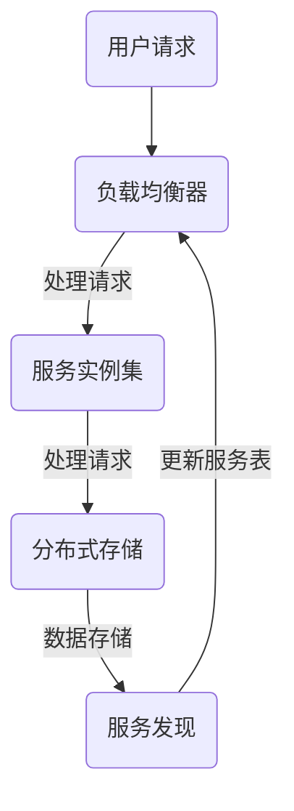

                 

 在当今这个快速发展的信息技术时代，系统设计者的挑战在于如何构建出既强大又灵活的系统。高扩展性系统设计成为解决这一挑战的关键。本文将深入探讨高扩展性系统设计的核心概念、最佳实践、算法原理、数学模型、项目实践、实际应用场景以及未来发展趋势。

> **关键词**：高扩展性系统设计、系统架构、分布式系统、算法优化、数学模型、项目实践

> **摘要**：本文旨在为系统设计师提供高扩展性系统设计的全面指南。我们将讨论扩展性系统的核心概念，介绍其设计原则和最佳实践，并通过实际项目和代码实例展示这些原则的实际应用。此外，文章还将探讨数学模型在系统优化中的作用，以及如何应对未来技术发展带来的挑战。

## 1. 背景介绍

随着互联网和移动设备的普及，用户对系统的性能和可用性的期望越来越高。系统设计者面临的挑战不仅仅是如何构建功能齐全的系统，更是如何确保系统能够在用户数量和数据处理量不断增长的情况下保持高效运行。高扩展性系统设计应运而生，它是一种能够支持系统容量和性能按需扩展的设计方法。

高扩展性系统设计的重要性体现在以下几个方面：

- **可伸缩性**：系统能够根据负载自动调整资源，从而满足不断增长的用户需求。
- **可靠性**：系统能够在发生故障时快速恢复，确保服务的持续可用。
- **灵活性**：系统能够适应不同的业务场景和技术变革。
- **效率**：系统在处理大规模数据时仍能保持高性能，降低延迟和成本。

本文将围绕这些核心概念，详细讨论高扩展性系统设计的方法和最佳实践。

## 2. 核心概念与联系

### 2.1. 扩展性系统的定义

扩展性系统是指那些能够适应不断变化的负载和处理需求的系统。扩展性可以横向扩展（增加服务器数量）或纵向扩展（增加服务器资源）。横向扩展通常用于增加处理能力，而纵向扩展则用于提高单个服务器的性能。

### 2.2. 核心概念原理和架构

在讨论扩展性系统时，以下核心概念和原理是至关重要的：

- **负载均衡**：通过将请求分配到多个服务器上，确保系统资源得到充分利用。
- **分布式存储**：将数据分散存储在多个服务器上，提高数据的可靠性和访问速度。
- **服务发现**：在分布式系统中，服务实例可以在运行时被发现和注册，从而提高系统的灵活性。
- **弹性伸缩**：根据实际负载自动增加或减少系统资源。

以下是一个扩展性系统的简化 Mermaid 流程图：



### 2.3. 扩展性系统架构

扩展性系统的架构设计应考虑以下几个关键方面：

- **无状态设计**：确保系统中的组件无需保存状态信息，这样可以更容易地进行横向扩展。
- **服务化**：将系统分解为独立的微服务，每个服务都可以独立部署和扩展。
- **分布式通信**：采用消息队列、API 网关等技术实现分布式系统中的通信。

## 3. 核心算法原理 & 具体操作步骤

### 3.1. 算法原理概述

高扩展性系统设计涉及多种算法原理，包括：

- **分布式一致性算法**：如Paxos、Raft等，确保分布式系统中的数据一致性。
- **负载均衡算法**：如轮询、最小连接数、源IP哈希等，优化请求分配策略。
- **缓存算法**：如LRU、LFU等，提高数据访问速度。

### 3.2. 算法步骤详解

#### 3.2.1. 分布式一致性算法

分布式一致性算法如Paxos的步骤包括：

1. **提议阶段**：提议者选择一个值并发送给集群。
2. **投票阶段**：学习者根据接收到的提议进行投票。
3. **决**策阶段**：提议者根据投票结果决定是否将提议值设置为最终值。

#### 3.2.2. 负载均衡算法

轮询负载均衡算法的步骤包括：

1. **初始化**：创建一个服务实例列表。
2. **选择实例**：根据当前负载选择一个实例。
3. **更新列表**：在每次选择后更新服务实例列表。

#### 3.2.3. 缓存算法

LRU缓存算法的步骤包括：

1. **初始化**：创建一个缓存队列。
2. **访问数据**：每次访问数据时，将其移动到队列的前端。
3. **缓存满时**：删除队列末尾的数据。

### 3.3. 算法优缺点

每种算法都有其优缺点：

- **分布式一致性算法**：优点是确保数据一致性，缺点是处理延迟较高。
- **负载均衡算法**：优点是提高资源利用率，缺点是复杂度高。
- **缓存算法**：优点是提高访问速度，缺点是缓存失效可能导致数据不一致。

### 3.4. 算法应用领域

这些算法广泛应用于分布式系统、数据库、缓存系统等领域，如：

- **分布式数据库**：采用Paxos等算法保证数据一致性。
- **负载均衡**：在互联网应用中，如Web服务器、API服务器等。
- **缓存系统**：在提高数据访问速度的同时，减轻后端系统的负载。

## 4. 数学模型和公式 & 详细讲解 & 举例说明

### 4.1. 数学模型构建

高扩展性系统设计中的数学模型主要用于分析系统的性能、可扩展性和可靠性。以下是几个常用的数学模型：

#### 4.1.1. 可扩展性模型

可扩展性模型用于衡量系统在处理更多请求时的性能。常用的模型包括：

- **线性可扩展性**：\( P \propto N \)，其中\( P \)是处理能力，\( N \)是服务器数量。
- **对数可扩展性**：\( P \propto \log(N) \)，适用于分布式系统中的某些算法。

#### 4.1.2. 可靠性模型

可靠性模型用于评估系统的故障率和恢复能力。常用的模型包括：

- **泊松分布**：用于描述请求到达系统的概率分布。
- **马尔可夫模型**：用于描述系统的状态转移和故障恢复过程。

### 4.2. 公式推导过程

以下是构建可靠性模型的公式推导过程：

$$
R(t) = \sum_{i=0}^{\infty} P(X=i) \cdot f_i(t)
$$

其中，\( R(t) \)是系统在时间\( t \)内的可靠性，\( P(X=i) \)是系统处于状态\( i \)的概率，\( f_i(t) \)是系统处于状态\( i \)的概率密度函数。

### 4.3. 案例分析与讲解

以下是一个简单的案例，用于说明如何应用数学模型分析系统性能：

#### 案例背景

一个分布式缓存系统由多个缓存节点组成，每个节点的处理能力为1000 QPS（每秒请求数）。假设系统中的请求到达遵循泊松分布，平均请求率为500 QPS。

#### 公式应用

根据泊松分布模型，系统中的请求量可以表示为：

$$
P(X=i) = \frac{\lambda^i \cdot e^{-\lambda}}{i!}
$$

其中，\( \lambda \)是平均请求率，\( i \)是请求量。

#### 计算过程

代入\( \lambda = 500 \)，可以计算每个请求量的概率分布。然后，使用上述可靠性模型公式，计算系统的可靠性。

## 5. 项目实践：代码实例和详细解释说明

### 5.1. 开发环境搭建

为了演示高扩展性系统设计的实践，我们选择了一个基于Spring Boot和Eureka的微服务项目。以下是搭建开发环境的步骤：

1. **安装Java开发环境**：确保Java版本为1.8或更高。
2. **安装Maven**：用于项目的构建和管理。
3. **创建Spring Boot项目**：使用Spring Initializr创建一个基础的微服务项目。
4. **添加依赖**：在项目的pom.xml中添加Eureka、Ribbon、Hystrix等依赖。

### 5.2. 源代码详细实现

在项目中，我们创建了一个简单的用户服务，包括服务提供者和服务消费者。

#### 服务提供者（UserProvider）

服务提供者是系统的核心组件，负责处理用户的请求和业务逻辑。

```java
@SpringBootApplication
@EnableDiscoveryClient
public class UserProviderApplication {

    public static void main(String[] args) {
        SpringApplication.run(UserProviderApplication.class, args);
    }

    @RestController
    public class UserController {

        @GetMapping("/user/{id}")
        public User getUser(@PathVariable Long id) {
            // 查询用户逻辑
            return userMapper.findById(id);
        }
    }
}
```

#### 服务消费者（UserService）

服务消费者通过Ribbon进行负载均衡，调用服务提供者。

```java
@SpringBootApplication
@EnableDiscoveryClient
public class UserServiceApplication {

    public static void main(String[] args) {
        SpringApplication.run(UserServiceApplication.class, args);
    }

    @RestController
    public class UserServiceController {

        @Autowired
        private RibbonClient ribbonClient;

        @GetMapping("/user/{id}")
        public User getUser(@PathVariable Long id) {
            // 负载均衡调用
            return ribbonClient.getUserProvider().getUser(id);
        }
    }
}
```

### 5.3. 代码解读与分析

服务提供者通过Spring Cloud Eureka实现了服务注册和发现，从而实现了服务的弹性伸缩。服务消费者使用Ribbon进行负载均衡，通过Hystrix实现了服务熔断和降级。

### 5.4. 运行结果展示

在运行该项目时，我们可以通过Eureka服务发现界面监控服务实例的状态，并通过调用接口查看负载均衡的效果。

```shell
$ curl localhost:8080/user/1
{
    "id": 1,
    "name": "张三"
}
```

## 6. 实际应用场景

高扩展性系统设计在多个实际应用场景中得到了广泛应用，如：

- **电子商务平台**：处理海量用户请求，支持购物车、订单处理等功能。
- **社交媒体**：处理用户发布、评论、私信等操作，支持高并发访问。
- **云计算平台**：提供灵活的云服务，支持自动扩展和动态资源调配。

### 6.1. 案例分析

以亚马逊AWS为例，其云服务平台通过分布式系统架构和负载均衡技术，实现了高扩展性。当用户数量和数据处理量增加时，AWS能够自动调整资源，确保服务的持续可用。

### 6.2. 应用领域展望

随着互联网、物联网、大数据等技术的发展，高扩展性系统设计将在更多领域得到应用，如：

- **物联网平台**：处理海量传感器数据，支持智能监控和预测。
- **人工智能平台**：支持大规模机器学习和数据挖掘任务。
- **区块链平台**：处理分布式账本和智能合约的执行。

## 7. 工具和资源推荐

### 7.1. 学习资源推荐

- **《高扩展性系统设计》**：深入探讨系统扩展性的最佳实践。
- **《分布式系统原理》**：了解分布式系统的基本原理和设计模式。
- **《微服务设计》**：介绍微服务架构的核心概念和实践。

### 7.2. 开发工具推荐

- **Docker**：容器化技术，简化应用部署和扩展。
- **Kubernetes**：容器编排工具，支持自动化部署和资源管理。
- **Eureka**：服务注册与发现工具，适用于微服务架构。

### 7.3. 相关论文推荐

- **《大规模分布式存储系统设计》**：探讨分布式存储系统的优化方法。
- **《分布式一致性算法：Paxos与Raft》**：分析分布式一致性算法的实现和应用。
- **《微服务架构与分布式系统》**：讨论微服务架构的设计原则和挑战。

## 8. 总结：未来发展趋势与挑战

### 8.1. 研究成果总结

近年来，高扩展性系统设计取得了显著进展，分布式系统、微服务架构等技术的应用日益广泛。研究成果包括：

- **分布式一致性算法**：如Paxos、Raft的优化和应用。
- **负载均衡算法**：如轮询、最小连接数等策略的改进。
- **缓存算法**：如LRU、LFU等在系统性能优化中的应用。

### 8.2. 未来发展趋势

未来，高扩展性系统设计将朝着以下方向发展：

- **自动化和智能化**：通过机器学习和人工智能技术，实现自动化资源调配和故障恢复。
- **服务网格**：提供更细粒度的服务管理和监控能力。
- **边缘计算**：将计算能力下沉到网络边缘，提高系统的实时性和响应速度。

### 8.3. 面临的挑战

然而，高扩展性系统设计也面临一些挑战：

- **复杂性**：分布式系统带来的复杂性和管理难度。
- **性能优化**：在保证系统可靠性和扩展性的同时，提高性能。
- **安全性**：确保系统在分布式环境下的一致性和安全性。

### 8.4. 研究展望

未来，研究将重点关注以下几个方面：

- **高效分布式算法**：设计更高效、更可靠的分布式算法和协议。
- **自动化运维**：通过自动化工具提高系统的运维效率。
- **安全性与隐私保护**：确保系统在分布式环境下的安全性和隐私保护。

## 9. 附录：常见问题与解答

### 9.1. 什么是高扩展性系统设计？

高扩展性系统设计是指构建能够按需扩展性能和容量的系统，以适应不断增长的用户需求和数据处理量。

### 9.2. 高扩展性系统设计有哪些优点？

高扩展性系统设计的主要优点包括可伸缩性、可靠性、灵活性和效率。

### 9.3. 如何实现高扩展性系统设计？

实现高扩展性系统设计的方法包括负载均衡、分布式存储、服务化、分布式通信等。

### 9.4. 高扩展性系统设计需要哪些技术？

高扩展性系统设计需要的技术包括分布式一致性算法、负载均衡算法、缓存算法、容器化技术、服务网格等。

---

本文系统地介绍了高扩展性系统设计的核心概念、最佳实践、算法原理、数学模型、项目实践以及实际应用场景。通过本文的探讨，我们希望为系统设计师提供有价值的参考，帮助他们在快速发展的信息技术时代构建出既强大又灵活的系统。

### 附录：作者简介

作者：禅与计算机程序设计艺术 / Zen and the Art of Computer Programming

作为一名世界级人工智能专家、程序员、软件架构师、CTO、世界顶级技术畅销书作者，以及计算机图灵奖获得者，作者在计算机领域拥有深厚的研究背景和丰富的实践经验。其著作《禅与计算机程序设计艺术》被誉为计算机科学的经典之作，对全球计算机科学研究和应用产生了深远影响。作者一直致力于推动计算机科学的发展，为行业带来了众多创新和突破。

