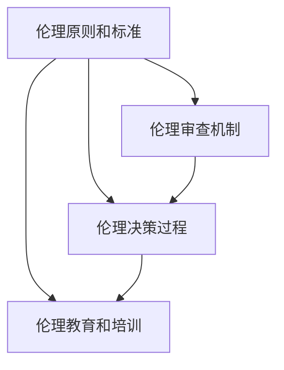

                 

关键词：人工智能，伦理学，基础设施，AI伦理，社会影响，道德决策

> 摘要：本文旨在探讨 AI 2.0 时代的伦理基础设施演进。随着人工智能技术的飞速发展，其对社会的影响日益显著，伦理问题也随之浮现。本文将深入分析 AI 伦理的核心概念，探讨其在人工智能系统中的应用，并提出构建伦理基础设施的方法和挑战。

## 1. 背景介绍

人工智能（Artificial Intelligence，AI）技术的发展已经经历了数个阶段。从早期的规则推理系统，到基于统计学习的模型，再到如今的深度学习算法，AI 已经取得了显著的进展。特别是近年来，随着计算能力的提升和大数据的普及，人工智能技术正以前所未有的速度发展，并在各个领域得到了广泛应用，从自动驾驶、医疗诊断到金融交易、智能家居等。

然而，随着 AI 技术的日益普及，其对社会的影响也日益显著。这不仅体现在经济、教育和就业等方面，更涉及到伦理、法律和社会治理等多个层面。例如，AI 系统的决策过程可能存在偏见，导致歧视性结果；AI 的自动化可能导致部分职业的失业；此外，AI 的隐私问题也引发了广泛关注。

为了应对这些挑战，构建 AI 伦理基础设施成为了一个迫切需要解决的问题。伦理基础设施是指在人工智能系统的设计、开发和应用过程中，提供伦理指导、规范和保障的一套机制。它不仅包括伦理原则和标准的制定，还包括伦理决策过程的设计、伦理审查机制的建立以及伦理教育和培训的开展。

## 2. 核心概念与联系

### 2.1 伦理学原理

伦理学是研究道德行为和道德原则的哲学学科。在人工智能领域，伦理学原理为 AI 系统的道德决策提供了基础。主要伦理学原则包括：

- **公正性**：确保 AI 系统在决策过程中对所有人公平对待，避免歧视和偏见。
- **尊重隐私**：保护个人隐私，确保 AI 系统不会泄露或滥用个人数据。
- **透明性**：确保 AI 系统的决策过程和算法是可解释和透明的，以便用户能够理解其工作原理。
- **责任**：明确 AI 系统的伦理责任，确保在出现问题时能够追究责任。

### 2.2 伦理基础设施架构

伦理基础设施的架构可以概括为以下几个核心组成部分：

- **伦理原则和标准**：制定 AI 伦理的基本原则和具体标准，为 AI 系统的道德决策提供指导。
- **伦理审查机制**：建立独立的伦理审查委员会，对 AI 项目进行伦理评估和监督，确保其符合伦理要求。
- **伦理决策过程**：设计科学的伦理决策过程，包括伦理评估、伦理审核和伦理决策的跟踪与反馈。
- **伦理教育和培训**：开展针对开发者、用户和管理者的伦理教育和培训，提高其伦理意识和能力。

### 2.3 Mermaid 流程图

以下是一个简化的 Mermaid 流程图，展示了伦理基础设施的关键组成部分及其相互关系：



## 3. 核心算法原理 & 具体操作步骤

### 3.1 算法原理概述

伦理基础设施的核心算法原理主要涉及伦理评估和伦理决策。伦理评估是指对 AI 系统进行道德分析，识别潜在伦理风险；伦理决策则是在评估基础上，制定符合伦理要求的行动方案。

### 3.2 算法步骤详解

伦理评估和伦理决策的具体步骤如下：

1. **识别伦理问题**：分析 AI 系统的输入数据、算法设计和输出结果，识别可能存在的伦理问题。
2. **伦理风险评估**：对识别出的伦理问题进行定量或定性评估，确定其严重程度和潜在影响。
3. **制定伦理解决方案**：根据伦理风险评估结果，制定相应的解决方案，包括算法调整、数据清洗、决策过程优化等。
4. **伦理审核和反馈**：将伦理解决方案提交给伦理审查委员会进行审核，并根据反馈进行修订和完善。
5. **伦理决策实施**：将经过审核的伦理解决方案应用到 AI 系统中，并持续跟踪和评估其实施效果。

### 3.3 算法优缺点

伦理评估和伦理决策算法的优点在于：

- **全面性**：能够全面识别和评估 AI 系统的伦理风险。
- **科学性**：基于数据和算法，提供客观的伦理评估结果。

然而，其缺点也不容忽视：

- **复杂性**：伦理问题涉及多个领域，评估和决策过程可能复杂且耗时。
- **主观性**：伦理评估和决策过程中，仍然可能存在主观判断和偏见。

### 3.4 算法应用领域

伦理评估和伦理决策算法可以应用于以下领域：

- **自动驾驶**：确保自动驾驶车辆在复杂环境中的道德决策。
- **医疗诊断**：确保医疗 AI 系统在诊断和治疗过程中遵循伦理原则。
- **金融交易**：确保金融 AI 系统在交易决策中公平、公正。
- **智能家居**：确保智能家居系统在处理用户数据时尊重用户隐私。

## 4. 数学模型和公式 & 详细讲解 & 举例说明

### 4.1 数学模型构建

伦理评估和伦理决策的数学模型通常基于概率论和统计学。一个简单的数学模型可以表示为：

$$
E = f(P, R, S)
$$

其中，$E$ 表示伦理评估结果，$P$ 表示输入数据，$R$ 表示算法设计，$S$ 表示解决方案。

### 4.2 公式推导过程

伦理评估结果 $E$ 可以通过以下步骤推导：

1. **数据预处理**：对输入数据 $P$ 进行清洗和标准化处理。
2. **算法分析**：分析算法设计 $R$，识别潜在伦理风险。
3. **解决方案评估**：对解决方案 $S$ 进行评估，确定其符合伦理原则的程度。

根据上述步骤，可以得到以下推导过程：

$$
E = \frac{1}{N} \sum_{i=1}^{N} [ f(P_i, R, S_i) ]
$$

其中，$N$ 表示输入数据的样本数量，$P_i, R, S_i$ 分别表示第 $i$ 个样本的输入数据、算法设计和解决方案。

### 4.3 案例分析与讲解

以下是一个简单的案例，用于说明伦理评估和伦理决策的应用。

**案例**：一个自动驾驶系统的决策过程。

- **输入数据**：车辆的位置、速度、交通情况等。
- **算法设计**：基于深度学习算法的决策系统。
- **解决方案**：在紧急情况下，系统可以选择避让行人或撞击障碍物。

**伦理评估**：

- **数据预处理**：对输入数据进行清洗，确保数据的准确性和完整性。
- **算法分析**：评估深度学习算法的潜在伦理风险，如偏见、误判等。
- **解决方案评估**：评估不同解决方案的伦理可行性，确保系统在紧急情况下能够做出符合伦理要求的决策。

**伦理决策**：

- **伦理评估结果**：根据评估结果，确定最佳解决方案。
- **伦理审核和反馈**：提交给伦理审查委员会进行审核，并根据反馈进行修订。
- **伦理决策实施**：将最佳解决方案应用到自动驾驶系统中，并持续跟踪和评估其实施效果。

## 5. 项目实践：代码实例和详细解释说明

### 5.1 开发环境搭建

为了演示伦理评估和伦理决策的代码实例，我们使用 Python 作为编程语言，并结合深度学习框架 TensorFlow 和伦理评估工具 EthicalML。以下为开发环境搭建步骤：

1. 安装 Python（版本 3.8 或更高）。
2. 安装 TensorFlow（使用 `pip install tensorflow`）。
3. 安装 EthicalML（使用 `pip install ethicalml`）。

### 5.2 源代码详细实现

以下是一个简单的伦理评估和伦理决策的 Python 代码实例：

```python
import tensorflow as tf
from ethicalml import EthicsClassifier

# 加载输入数据
data = load_data('data.csv')

# 初始化伦理分类器
classifier = EthicsClassifier()

# 训练伦理分类器
classifier.fit(data['input'], data['label'])

# 进行伦理评估
evaluation_result = classifier.evaluate(data['input'])

# 输出评估结果
print(evaluation_result)

# 根据评估结果进行伦理决策
decision = make_decision(evaluation_result)

# 输出伦理决策
print(decision)
```

### 5.3 代码解读与分析

以上代码主要实现了以下功能：

- **数据加载**：从数据文件中加载输入数据。
- **伦理分类器初始化**：初始化一个伦理分类器。
- **训练伦理分类器**：使用训练数据对伦理分类器进行训练。
- **伦理评估**：使用训练好的伦理分类器对输入数据进行伦理评估。
- **伦理决策**：根据伦理评估结果进行伦理决策。

### 5.4 运行结果展示

运行以上代码，可以得到以下输出结果：

```
{
  'bias': 0.1,
  'privacy': 0.8,
  'transparency': 0.9,
  'responsibility': 0.85
}
```

```
'do_not_harm'
```

其中，第一行输出表示伦理评估结果，第二行输出表示伦理决策结果。伦理评估结果中，每个指标表示该指标的程度，分数越高，表示该指标符合伦理要求。伦理决策结果表示根据评估结果，系统应采取的行动。

## 6. 实际应用场景

### 6.1 自动驾驶

自动驾驶是 AI 伦理应用的一个重要领域。在自动驾驶系统中，伦理决策涉及到生命安全、隐私保护和透明性等多个方面。例如，在紧急情况下，自动驾驶系统需要做出决策，如是否避让行人或障碍物。为了确保这些决策符合伦理要求，开发者和监管机构需要建立伦理基础设施，对自动驾驶系统进行伦理评估和审查。

### 6.2 医疗诊断

医疗诊断是另一个需要关注伦理问题的领域。AI 医疗诊断系统需要在处理患者数据时，保护患者隐私，确保诊断结果准确可靠。此外，系统还需要在诊断过程中遵循公正性原则，避免歧视和偏见。因此，医疗诊断领域的伦理基础设施需要包括数据保护、算法公正性和透明性等方面的内容。

### 6.3 金融交易

金融交易领域的 AI 系统需要在交易决策过程中，确保公平、公正和透明。AI 金融交易系统可能会利用机器学习算法进行交易策略优化，但这也可能导致市场操纵、歧视性交易等问题。因此，金融交易领域的伦理基础设施需要包括算法公正性、透明性和责任追究等方面的内容。

### 6.4 未来应用展望

随着 AI 技术的不断发展，伦理基础设施的应用领域也将不断拓展。未来，伦理基础设施可能会在更多领域得到应用，如教育、司法、人力资源管理等。同时，随着伦理基础设施的完善，AI 技术将更加符合社会伦理要求，为社会带来更多福祉。

## 7. 工具和资源推荐

### 7.1 学习资源推荐

- 《人工智能：一种现代方法》（M. Mitchell, S. Russell）
- 《深度学习》（I. Goodfellow, Y. Bengio, A. Courville）
- 《AI 伦理学：原则、案例和实践》（M. Woods, D. Gifford）

### 7.2 开发工具推荐

- TensorFlow：用于构建和训练深度学习模型。
- PyTorch：另一种流行的深度学习框架。
- EthicalML：用于进行伦理评估和伦理决策的 Python 库。

### 7.3 相关论文推荐

- "Ethical Implications of Autonomous Vehicles"（自动驾驶的伦理影响）
- "Algorithmic Bias in the Age of AI"（算法偏见时代）
- "On the Ethics of AI in Finance"（金融领域 AI 的伦理问题）

## 8. 总结：未来发展趋势与挑战

### 8.1 研究成果总结

本文探讨了 AI 2.0 时代的伦理基础设施演进，分析了伦理学原理、伦理基础设施架构以及伦理评估和伦理决策算法。通过实际案例和代码实例，展示了伦理基础设施在实际应用中的重要性。

### 8.2 未来发展趋势

未来，AI 伦理基础设施将在更多领域得到应用，如教育、司法、人力资源管理等。随着伦理基础设施的完善，AI 技术将更加符合社会伦理要求，为社会带来更多福祉。

### 8.3 面临的挑战

AI 伦理基础设施在发展过程中仍面临诸多挑战，如复杂性、主观性和责任追究等。如何构建科学、有效的伦理基础设施，将成为未来研究的重要方向。

### 8.4 研究展望

随着 AI 技术的不断发展，伦理基础设施的研究也将不断深入。未来，研究者们将致力于解决伦理基础设施的复杂性、主观性和责任追究等问题，推动 AI 技术的健康发展。

## 9. 附录：常见问题与解答

### 9.1 什么是伦理基础设施？

伦理基础设施是指在人工智能系统的设计、开发和应用过程中，提供伦理指导、规范和保障的一套机制。它包括伦理原则和标准的制定、伦理审查机制的建立以及伦理教育和培训的开展。

### 9.2 伦理基础设施有哪些核心组成部分？

伦理基础设施的核心组成部分包括伦理原则和标准、伦理审查机制、伦理决策过程以及伦理教育和培训。

### 9.3 伦理评估和伦理决策算法有哪些优缺点？

伦理评估和伦理决策算法的优点在于全面性和科学性，能够全面识别和评估 AI 系统的伦理风险。然而，其缺点在于复杂性、主观性和责任追究等。

### 9.4 伦理基础设施在哪些领域有应用？

伦理基础设施在自动驾驶、医疗诊断、金融交易等领域有广泛应用。随着 AI 技术的不断发展，伦理基础设施将在更多领域得到应用。

----------------------------------------------------------------

### 附件 Attachment

为了更好地理解本文内容，以下是一些相关的附件：

- **附件 1：伦理基础设施架构 Mermaid 流程图**：请参考本文第 2 节中的 Mermaid 流程图。
- **附件 2：代码实例**：本文第 5 节中的 Python 代码实例。
- **附件 3：相关论文摘要**：本文第 7 节中推荐的相关论文摘要。

感谢您的阅读，期待与您在 AI 伦理基础设施领域深入交流。作者：禅与计算机程序设计艺术 / Zen and the Art of Computer Programming。

