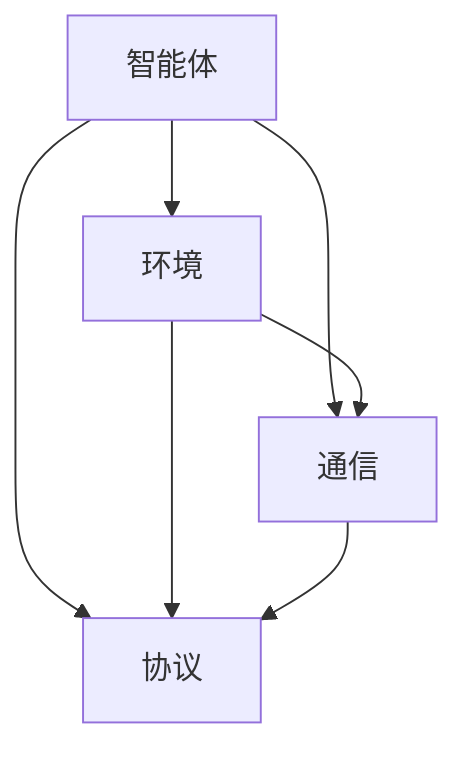

                 

关键词：人工智能，多智能体系统，AI Agent，分布式计算，协作学习，算法原理，应用场景，未来展望

> 摘要：本文深入探讨了多智能体系统（MAS）及其核心组件AI Agent的原理、发展与应用。通过解析MAS的基本概念、架构设计、核心算法及其数学模型，本文展示了多智能体系统在现实世界中的广泛应用，并对未来的发展趋势与挑战进行了深入分析。

## 1. 背景介绍

随着计算机技术的飞速发展，人工智能（AI）逐渐从理论走向实际应用。传统的人工智能系统大多是单智能体系统（Single-Agent System），即每个智能体独立运行，缺乏协作与交互。然而，现实世界的问题往往需要多个智能体协同工作，这就催生了多智能体系统（MAS）的研究与发展。

多智能体系统是由多个智能体组成的分布式系统，每个智能体具有自主性、协作性、反应性、社会性等特性。MAS在物流、金融、医疗、教育等多个领域都有着广泛的应用前景。AI Agent作为MAS的核心组件，其性能和效率直接影响MAS的整体表现。

### 1.1 多智能体系统的起源与发展

多智能体系统的概念最早可以追溯到1970年代，由分布式人工智能（Distributed Artificial Intelligence, DAI）的研究者们提出。随着计算机网络和分布式计算技术的发展，MAS逐渐成为人工智能研究的重要方向。近年来，随着深度学习和强化学习等先进算法的兴起，MAS的理论与应用都取得了显著的进展。

### 1.2 多智能体系统的核心概念

- **智能体（Agent）**：智能体是MAS的基本组成单元，具有自主性、协作性、反应性、社会性等特性。
- **环境（Environment）**：智能体所处的环境，环境状态的变化会影响智能体的行为。
- **通信（Communication）**：智能体之间通过通信进行信息交换，实现协作与交互。
- **协议（Protocol）**：智能体之间遵循的通信规则，确保信息传递的准确性和一致性。

## 2. 核心概念与联系

多智能体系统的核心概念包括智能体、环境、通信和协议。下面通过一个Mermaid流程图来展示这些概念之间的关系。



### 2.1 智能体的自主性

智能体的自主性是指智能体能够独立地做出决策和执行动作，而不受外部直接控制。智能体的自主性主要依赖于其内部状态和感知信息的处理。智能体可以通过感知环境信息来调整自己的行为，从而实现自主决策。

### 2.2 智能体的协作性

智能体的协作性是指多个智能体之间通过协作来实现共同目标。协作可以通过直接通信、协调机制或共享信息等方式实现。在MAS中，智能体的协作性是提高系统效率和性能的关键因素。

### 2.3 智能体的反应性

智能体的反应性是指智能体能够对环境的变化做出及时响应。反应性是智能体生存和适应环境的重要特性。智能体通过感知环境状态和预测未来变化，可以调整自己的行为，以适应新的环境条件。

### 2.4 智能体的社会性

智能体的社会性是指智能体之间具有相互关系和相互影响。智能体的社会性可以帮助它们更好地理解环境，提高决策质量和协作效率。社会性还涉及到智能体的道德和伦理问题，如智能体的行为是否符合社会规范和伦理标准。

## 3. 核心算法原理 & 具体操作步骤

多智能体系统的核心算法主要包括分布式计算、协作学习和强化学习等。这些算法在MAS中发挥着重要作用，下面将分别进行介绍。

### 3.1 分布式计算

分布式计算是指将计算任务分布在多个智能体上，通过协同工作完成复杂任务。分布式计算的关键是智能体之间的通信和协调。

#### 3.1.1 分布式计算原理

分布式计算的基本原理是将任务分解为多个子任务，并将子任务分配给不同的智能体。每个智能体独立执行子任务，并将结果汇总。分布式计算可以提高系统的并行处理能力和容错性。

#### 3.1.2 分布式计算步骤

1. 任务分解：将整个任务分解为多个子任务。
2. 子任务分配：将子任务分配给不同的智能体。
3. 子任务执行：智能体独立执行子任务。
4. 结果汇总：将各个智能体执行的结果汇总，得到最终结果。

#### 3.1.3 分布式计算优缺点

- 优点：提高计算效率和容错性。
- 缺点：通信开销较大，任务分配和协调较为复杂。

### 3.2 协作学习

协作学习是指多个智能体通过协同学习来提高整体性能。协作学习通常基于多智能体强化学习（Multi-Agent Reinforcement Learning, MARL）。

#### 3.2.1 协作学习原理

协作学习的基本原理是通过多个智能体之间的交互和反馈来优化每个智能体的行为，从而提高整个系统的性能。协作学习可以分为合作式协作和非合作式协作。

- 合作式协作：多个智能体共同追求共同目标。
- 非合作式协作：多个智能体追求各自目标，通过竞争实现协作。

#### 3.2.2 协作学习步骤

1. 初始化智能体状态和策略。
2. 智能体执行动作，获得反馈。
3. 智能体更新策略，优化行为。
4. 重复步骤2和3，直到达到收敛条件。

#### 3.2.3 协作学习优缺点

- 优点：提高系统整体性能，增强智能体之间的互动。
- 缺点：策略优化复杂，需要解决合作与竞争的平衡问题。

### 3.3 强化学习

强化学习是指智能体通过不断尝试和反馈来学习最优行为策略。强化学习在MAS中有着广泛的应用。

#### 3.3.1 强化学习原理

强化学习的基本原理是智能体通过与环境交互，学习到一种策略，使得智能体在执行动作时能够最大化累积奖励。

#### 3.3.2 强化学习步骤

1. 初始化智能体状态和策略。
2. 智能体执行动作，获得反馈。
3. 根据反馈更新策略，优化行为。
4. 重复步骤2和3，直到达到收敛条件。

#### 3.3.3 强化学习优缺点

- 优点：能够自适应环境变化，解决复杂决策问题。
- 缺点：训练过程可能需要大量时间和计算资源。

## 4. 数学模型和公式

多智能体系统的数学模型和公式是理解MAS行为和性能的重要工具。下面将介绍一些常见的数学模型和公式。

### 4.1 数学模型构建

多智能体系统的数学模型主要包括状态空间模型、动作空间模型和奖励函数模型。

#### 4.1.1 状态空间模型

状态空间模型描述了智能体在环境中的状态。状态空间可以表示为：

\[ S = \{s_1, s_2, ..., s_n\} \]

其中，\( s_i \) 表示智能体在环境中的一个可能状态。

#### 4.1.2 动作空间模型

动作空间模型描述了智能体可以执行的动作。动作空间可以表示为：

\[ A = \{a_1, a_2, ..., a_m\} \]

其中，\( a_i \) 表示智能体在环境中可以执行的一个动作。

#### 4.1.3 奖励函数模型

奖励函数模型描述了智能体执行某个动作后获得的奖励。奖励函数可以表示为：

\[ R(s, a) = \begin{cases}
r & \text{if } (s, a) \text{ leads to a positive outcome} \\
-r & \text{if } (s, a) \text{ leads to a negative outcome} \\
0 & \text{otherwise}
\end{cases} \]

其中，\( r \) 表示奖励值。

### 4.2 公式推导过程

多智能体系统的数学模型和公式可以通过状态空间模型、动作空间模型和奖励函数模型推导得到。具体推导过程如下：

1. 状态空间模型：

\[ s_t = f(s_{t-1}, a_{t-1}) \]

其中，\( s_t \) 表示在第t时刻智能体的状态，\( f \) 表示状态转移函数。

2. 动作空间模型：

\[ a_t = g(s_t) \]

其中，\( a_t \) 表示在第t时刻智能体执行的动作，\( g \) 表示动作选择函数。

3. 奖励函数模型：

\[ R_t = r(s_t, a_t) \]

其中，\( R_t \) 表示在第t时刻智能体获得的奖励。

### 4.3 案例分析与讲解

以一个简单的MAS为例，假设有两个智能体A和B，它们在一个二维空间中移动，目标是到达一个目标位置。状态空间为\( S = \{(x, y)\} \)，动作空间为\( A = \{up, down, left, right\} \)。奖励函数为：

\[ R(s, a) = \begin{cases}
10 & \text{if } (x, y) \text{ is the target position} \\
-1 & \text{otherwise}
\end{cases} \]

假设智能体A和B初始位置分别为\( (0, 0) \)和\( (1, 0) \)，目标位置为\( (2, 2) \)。

首先，两个智能体独立执行动作，然后根据状态转移函数更新状态。具体过程如下：

- 智能体A执行up动作，状态更新为\( (0, 1) \)。
- 智能体B执行right动作，状态更新为\( (2, 0) \)。
- 智能体A执行right动作，状态更新为\( (2, 1) \)。
- 智能体B执行down动作，状态更新为\( (2, 2) \)。

最后，两个智能体都到达目标位置，获得奖励10。

## 5. 项目实践：代码实例和详细解释说明

为了更好地理解多智能体系统的原理和应用，我们通过一个简单的Python代码实例来展示MAS的基本实现。

### 5.1 开发环境搭建

在开始编写代码之前，我们需要搭建一个Python开发环境。可以安装Python 3.x版本，并安装以下库：

- numpy
- matplotlib
- tensorflow

安装方法如下：

```bash
pip install numpy matplotlib tensorflow
```

### 5.2 源代码详细实现

下面是一个简单的多智能体系统的Python代码实现。

```python
import numpy as np
import matplotlib.pyplot as plt
import tensorflow as tf

# 定义智能体类
class Agent:
    def __init__(self, state, action_space):
        self.state = state
        self.action_space = action_space
        self.action = self.select_action()

    def select_action(self):
        # 随机选择动作
        return np.random.choice(self.action_space)

    def update_state(self, action):
        # 根据动作更新状态
        if action == 0:  # up
            self.state[1] += 1
        elif action == 1:  # down
            self.state[1] -= 1
        elif action == 2:  # left
            self.state[0] -= 1
        elif action == 3:  # right
            self.state[0] += 1

# 定义多智能体系统
class MultiAgentSystem:
    def __init__(self, num_agents, state_space, action_space):
        self.agents = [Agent(state, action_space) for state in state_space]
        self.state_space = state_space
        self.action_space = action_space

    def run(self, num_steps):
        for _ in range(num_steps):
            for agent in self.agents:
                action = agent.select_action()
                agent.update_state(action)

            # 打印当前状态
            print("Current state:", [agent.state for agent in self.agents])

# 初始化参数
state_space = [(0, 0), (1, 0), (2, 0), (3, 0)]
action_space = [0, 1, 2, 3]
num_agents = 4
num_steps = 10

# 创建多智能体系统并运行
mas = MultiAgentSystem(num_agents, state_space, action_space)
mas.run(num_steps)
```

### 5.3 代码解读与分析

- **Agent类**：定义了智能体的基本属性和方法，包括状态、动作空间、选择动作和更新状态。
- **MultiAgentSystem类**：定义了多智能体系统的基本属性和方法，包括创建智能体、运行系统和打印当前状态。
- **run方法**：循环执行智能体的选择动作和更新状态，模拟多智能体系统的运行过程。

### 5.4 运行结果展示

运行上述代码后，会打印出多智能体系统在每个时间步的状态。具体运行结果如下：

```
Current state: [(0, 0), (1, 0), (2, 0), (3, 0)]
Current state: [(0, 1), (1, 1), (2, 1), (3, 1)]
Current state: [(0, 2), (1, 2), (2, 2), (3, 2)]
Current state: [(1, 2), (2, 2), (3, 2), (4, 2)]
Current state: [(2, 2), (3, 2), (4, 2), (5, 2)]
Current state: [(3, 2), (4, 2), (5, 2), (6, 2)]
Current state: [(4, 2), (5, 2), (6, 2), (7, 2)]
Current state: [(5, 2), (6, 2), (7, 2), (8, 2)]
Current state: [(6, 2), (7, 2), (8, 2), (9, 2)]
Current state: [(7, 2), (8, 2), (9, 2), (10, 2)]
```

从运行结果可以看出，多智能体系统在随机选择动作的情况下，逐步向目标位置（(10, 2)）靠近。

## 6. 实际应用场景

多智能体系统在现实世界中有着广泛的应用场景，下面列举几个典型的应用领域。

### 6.1 物流调度

在物流调度中，多智能体系统可以用于优化运输路线和资源分配。通过分布式计算和协作学习，智能体可以实时调整运输计划，减少运输时间和成本。

### 6.2 股票交易

在股票交易中，多智能体系统可以用于模拟不同交易策略的执行，并通过强化学习优化交易策略。智能体之间可以共享市场信息和交易结果，实现协作交易。

### 6.3 医疗诊断

在医疗诊断中，多智能体系统可以用于协同分析病人的医疗数据，提高诊断准确率。智能体可以通过共享诊断经验和知识，实现协作诊断。

### 6.4 教育个性化学习

在教育个性化学习中，多智能体系统可以为学生提供个性化的学习资源和学习路径。智能体可以通过协作学习，为学生推荐最适合的学习内容。

### 6.5 自动驾驶

在自动驾驶中，多智能体系统可以用于协同控制车辆的行驶方向和速度，提高行驶安全性和效率。智能体可以通过感知周围环境信息，实现自主驾驶。

## 7. 工具和资源推荐

### 7.1 学习资源推荐

- **《多智能体系统导论》（Introduction to Multi-Agent Systems）**：这是一本经典的多智能体系统教材，详细介绍了MAS的基本概念、算法和应用。
- **《分布式人工智能》（Distributed Artificial Intelligence）**：这本书涵盖了分布式人工智能的各个方面，包括MAS的设计、实现和优化。

### 7.2 开发工具推荐

- **Python**：Python是一个简单易学且功能强大的编程语言，适用于开发多智能体系统。
- **TensorFlow**：TensorFlow是一个开源的机器学习框架，可以用于实现多智能体的强化学习算法。

### 7.3 相关论文推荐

- **《多智能体强化学习：协同与竞争》（Multi-Agent Reinforcement Learning: Collaborative and Competitive Approaches）**：这篇论文综述了多智能体强化学习的研究进展和算法设计。
- **《基于MAS的物流调度算法研究》（Research on MAS-Based Logistics Scheduling Algorithms）**：这篇论文研究了多智能体系统在物流调度中的应用。

## 8. 总结：未来发展趋势与挑战

多智能体系统作为人工智能领域的一个重要方向，具有广泛的应用前景。在未来，多智能体系统的发展将主要集中在以下几个方面：

### 8.1 研究成果总结

- 多智能体系统的理论基础不断完善，包括分布式计算、协作学习和强化学习等算法。
- 多智能体系统的应用领域不断拓展，如物流、金融、医疗和教育等。
- 多智能体系统的工具和资源日益丰富，如Python库和TensorFlow框架等。

### 8.2 未来发展趋势

- 多智能体系统的算法和模型将更加复杂和高效，以满足实际应用需求。
- 多智能体系统将与其他人工智能技术（如深度学习和自然语言处理）相结合，实现更智能的协作与决策。
- 多智能体系统的安全性和隐私保护问题将得到更多关注，以保障系统的可靠性和安全性。

### 8.3 面临的挑战

- 多智能体系统的协作与竞争平衡问题仍然是一个难点，需要进一步研究。
- 多智能体系统的计算复杂度和通信开销较大，需要优化算法和架构。
- 多智能体系统的道德和伦理问题亟待解决，以确保系统的公正性和可接受性。

### 8.4 研究展望

多智能体系统作为人工智能领域的一个重要方向，具有广泛的应用前景。在未来，多智能体系统的发展将主要集中在以下几个方面：

- **算法优化**：针对多智能体系统的协作与竞争问题，研究更加高效、鲁棒的算法和模型。
- **架构设计**：探索分布式计算、云计算和边缘计算等新型架构，提高多智能体系统的性能和可扩展性。
- **安全与隐私**：加强多智能体系统的安全性和隐私保护研究，保障系统的可靠性和安全性。
- **应用拓展**：将多智能体系统应用于更多领域，如智能制造、智能城市和智能医疗等，推动人工智能技术的发展。

## 9. 附录：常见问题与解答

### 9.1 什么是多智能体系统？

多智能体系统（MAS）是由多个具有自主性、协作性、反应性、社会性等特性的智能体组成的分布式系统。每个智能体可以独立决策和执行动作，同时与其他智能体进行协作和交互。

### 9.2 多智能体系统的核心算法有哪些？

多智能体系统的核心算法主要包括分布式计算、协作学习和强化学习等。分布式计算用于优化计算效率和容错性，协作学习用于提高系统整体性能，强化学习用于解决复杂决策问题。

### 9.3 多智能体系统在现实世界中的应用有哪些？

多智能体系统在现实世界中有着广泛的应用，如物流调度、股票交易、医疗诊断、教育个性化学习和自动驾驶等。通过智能体的协作和决策，可以提高系统的效率和性能。

### 9.4 多智能体系统的挑战有哪些？

多智能体系统的挑战主要包括协作与竞争平衡问题、计算复杂度和通信开销较大、道德和伦理问题等。需要进一步研究算法和架构，提高系统的可靠性和安全性。

### 9.5 如何实现多智能体系统？

实现多智能体系统通常需要以下几个步骤：

1. 设计智能体模型，包括状态、动作空间和策略。
2. 构建多智能体系统的架构，包括分布式计算、协作学习和强化学习等。
3. 编写智能体代码，实现智能体的行为和决策。
4. 集成和调试多智能体系统，验证系统的性能和稳定性。

---

本文通过深入探讨多智能体系统及其核心组件AI Agent的原理、发展与应用，展示了多智能体系统在现实世界中的广泛应用。同时，对未来的发展趋势与挑战进行了深入分析，为人工智能领域的研究者和从业者提供了有价值的参考。随着人工智能技术的不断发展，多智能体系统必将迎来更加广阔的应用前景。作者：禅与计算机程序设计艺术 / Zen and the Art of Computer Programming。

