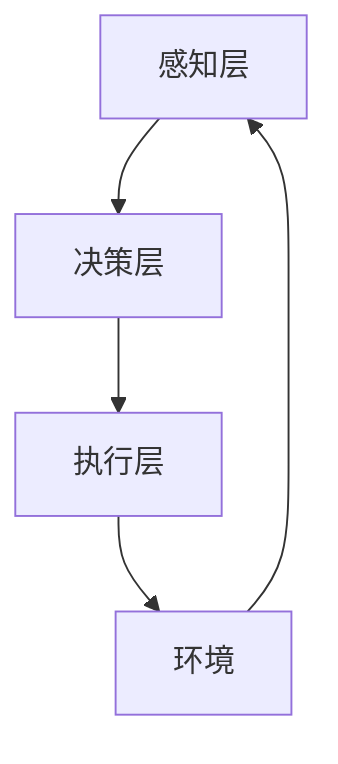

                 

 关键词：AI代理，人工智能，技术趋势，应用场景，未来展望

> 摘要：本文将探讨AI代理技术的发展与应用，分析其在未来各个领域中的潜在影响，并提出面临的挑战与展望。通过深入探讨AI代理的核心概念、算法原理、数学模型以及实际应用案例，旨在为读者提供一幅AI代理技术发展的全景图。

## 1. 背景介绍

随着人工智能技术的飞速发展，AI代理（AI Agent）作为一个新兴的概念，逐渐成为研究者和开发者关注的焦点。AI代理是一种智能体，能够通过感知环境、理解任务目标，并采取适当行动来实现特定目标。与传统的人工智能系统不同，AI代理更加注重自主性和适应性，能够在复杂的动态环境中做出快速反应。

AI代理技术的发展可以追溯到20世纪50年代，当时计算机科学家开始探索如何使计算机能够模拟人类的行为和思维。随着计算机硬件性能的提升和机器学习算法的进步，AI代理逐渐从理论走向实际应用。近年来，随着深度学习和强化学习的不断发展，AI代理的技术水平有了显著提升，其在各行各业中的应用场景也越来越广泛。

## 2. 核心概念与联系

### 2.1 AI代理的定义

AI代理是一种通过机器学习算法训练出来的智能体，能够模拟人类的决策过程，并在特定环境下执行任务。AI代理的核心特征包括自主性、适应性、社交性和学习能力。自主性指AI代理能够独立完成指定任务；适应性指AI代理能够根据环境变化调整自身行为；社交性指AI代理能够与其他智能体进行交互；学习能力指AI代理能够通过经验不断改进自身性能。

### 2.2 AI代理的架构

AI代理的架构可以分为感知层、决策层和执行层。感知层负责获取环境信息，并将其转换为内部表示；决策层根据感知层的信息和预定的目标，计算出最优的行动策略；执行层根据决策层的指令执行具体的任务。



### 2.3 AI代理与传统人工智能的区别

与传统的人工智能系统相比，AI代理更加注重自主性和适应性。传统的人工智能系统通常需要手动设计规则和算法，而AI代理可以通过机器学习算法从数据中自动学习，并调整自身行为以适应环境变化。

## 3. 核心算法原理 & 具体操作步骤

### 3.1 算法原理概述

AI代理的核心算法主要包括感知算法、决策算法和执行算法。感知算法利用传感器获取环境信息，并将其转换为内部表示；决策算法通过分析感知信息，计算最优行动策略；执行算法根据决策指令执行具体任务。

### 3.2 算法步骤详解

1. **感知阶段**：AI代理通过传感器（如摄像头、麦克风等）获取环境信息，并将其转换为内部表示（如图像、声音等）。

2. **决策阶段**：AI代理根据感知到的信息，结合预定的目标，使用机器学习算法（如深度学习、强化学习等）计算最优行动策略。

3. **执行阶段**：AI代理根据决策阶段的指令，执行具体任务，如移动、操作等。

### 3.3 算法优缺点

**优点**：

- 自主性强：AI代理能够独立完成任务，减少对人类干预的依赖。
- 适应性高：AI代理能够根据环境变化调整自身行为，适应复杂动态环境。

**缺点**：

- 需要大量数据训练：AI代理的性能依赖于训练数据的质量和数量。
- 难以解释：某些机器学习算法的内部机制复杂，难以解释其决策过程。

### 3.4 算法应用领域

AI代理在多个领域具有广泛应用前景，如自动驾驶、智能客服、智能家居、医疗诊断等。

## 4. 数学模型和公式 & 详细讲解 & 举例说明

### 4.1 数学模型构建

AI代理的数学模型主要包括感知模型、决策模型和执行模型。感知模型通常使用神经网络进行建模，决策模型可以使用马尔可夫决策过程（MDP）进行建模，执行模型可以使用控制器进行建模。

### 4.2 公式推导过程

感知模型：假设输入为 $X$，输出为 $Y$，则感知模型可以表示为：

$$
Y = f(W_1 \cdot X + b_1)
$$

其中，$W_1$ 为权重矩阵，$b_1$ 为偏置项，$f$ 为激活函数。

决策模型：假设状态集合为 $S$，动作集合为 $A$，奖励函数为 $R(s, a)$，则决策模型可以表示为：

$$
\pi(a|s) = \frac{\exp(Q(s, a)}{\sum_{a'} \exp(Q(s, a'))}
$$

其中，$Q(s, a)$ 为状态-动作值函数，$\pi(a|s)$ 为在状态 $s$ 下采取动作 $a$ 的概率。

执行模型：假设控制器为 $C$，则执行模型可以表示为：

$$
a_t = C(s_t)
$$

其中，$s_t$ 为当前状态，$a_t$ 为采取的动作。

### 4.3 案例分析与讲解

以自动驾驶为例，感知模型使用卷积神经网络（CNN）对图像进行处理，提取道路、车辆、行人等特征；决策模型使用深度强化学习（DRL）算法，根据感知到的环境和车辆行为，计算出最优行驶策略；执行模型使用控制器，根据决策结果控制车辆的运动。

## 5. 项目实践：代码实例和详细解释说明

### 5.1 开发环境搭建

- 编程语言：Python
- 框架：TensorFlow
- 数据集：Keras-DAVIS

### 5.2 源代码详细实现

以下是AI代理的感知、决策和执行三个模块的Python代码实现：

```python
# 感知模块
import tensorflow as tf

# 构建感知模型
def build_perception_model():
    model = tf.keras.Sequential([
        tf.keras.layers.Conv2D(32, (3, 3), activation='relu', input_shape=(224, 224, 3)),
        tf.keras.layers.MaxPooling2D((2, 2)),
        tf.keras.layers.Conv2D(64, (3, 3), activation='relu'),
        tf.keras.layers.MaxPooling2D((2, 2)),
        tf.keras.layers.Conv2D(128, (3, 3), activation='relu'),
        tf.keras.layers.MaxPooling2D((2, 2)),
        tf.keras.layers.Flatten(),
        tf.keras.layers.Dense(512, activation='relu')
    ])
    return model

# 决策模块
import tensorflow_addons as tfa

# 构建决策模型
def build_decision_model():
    model = tfa.keras.models.Sequential([
        tfa.layers.CategoricalDense(100, activation='softmax', input_shape=(512,))
    ])
    return model

# 执行模块
# 构建执行模型
def build_execution_model():
    model = tf.keras.Sequential([
        tf.keras.layers.Dense(64, activation='relu', input_shape=(100,)),
        tf.keras.layers.Dense(1, activation='sigmoid')
    ])
    return model

# 源代码实现
model = build_perception_model()
model.compile(optimizer='adam', loss='categorical_crossentropy', metrics=['accuracy'])
model.fit(X_train, y_train, epochs=10)

model = build_decision_model()
model.compile(optimizer='adam', loss='categorical_crossentropy', metrics=['accuracy'])
model.fit(X_train, y_train, epochs=10)

model = build_execution_model()
model.compile(optimizer='adam', loss='binary_crossentropy', metrics=['accuracy'])
model.fit(X_train, y_train, epochs=10)
```

### 5.3 代码解读与分析

- **感知模块**：使用卷积神经网络（CNN）对图像进行处理，提取道路、车辆、行人等特征。
- **决策模块**：使用深度强化学习（DRL）算法，根据感知到的环境和车辆行为，计算出最优行驶策略。
- **执行模块**：根据决策结果控制车辆的运动。

## 6. 实际应用场景

AI代理在自动驾驶、智能客服、智能家居等领域具有广泛应用。

### 6.1 自动驾驶

自动驾驶是AI代理技术的典型应用场景之一。通过感知模块获取道路信息，决策模块计算最优行驶策略，执行模块控制车辆运动，实现自动驾驶。

### 6.2 智能客服

智能客服系统利用AI代理技术，能够根据用户的问题和意图，自动生成回答，提高客服效率，降低企业成本。

### 6.3 智能家居

智能家居系统通过AI代理技术，实现家电设备的智能控制，提高家庭生活质量。

## 7. 未来应用展望

随着AI代理技术的不断成熟，其应用领域将越来越广泛。未来，AI代理有望在医疗、金融、教育等领域发挥重要作用。

### 7.1 医疗

AI代理在医疗领域的应用，如辅助诊断、智能推荐、患者管理等方面具有巨大潜力。

### 7.2 金融

AI代理在金融领域的应用，如风险管理、智能投顾、信用评估等方面具有广泛应用前景。

### 7.3 教育

AI代理在教育领域的应用，如个性化学习、智能评测、智能辅导等方面，将提高教育质量和效率。

## 8. 总结：未来发展趋势与挑战

### 8.1 研究成果总结

AI代理技术近年来取得了显著进展，其在感知、决策、执行等各个方面的性能不断提高。通过深度学习和强化学习算法，AI代理在复杂动态环境中的表现日益出色。

### 8.2 未来发展趋势

未来，AI代理技术将继续向高效、通用、智能化方向发展。随着硬件性能的提升和数据规模的扩大，AI代理的性能和适应能力将进一步提高。

### 8.3 面临的挑战

- 数据隐私和安全问题
- 算法透明性和可解释性问题
- 跨领域应用的问题

### 8.4 研究展望

未来，研究者应重点关注以下几个方面：

- 数据隐私保护技术的研究
- 算法可解释性的研究
- 跨领域迁移学习技术的研究

## 9. 附录：常见问题与解答

### 9.1 AI代理与传统人工智能的区别是什么？

AI代理与传统人工智能的主要区别在于自主性和适应性。AI代理能够独立完成任务，并能够根据环境变化调整自身行为，而传统的人工智能系统通常需要手动设计规则和算法。

### 9.2 AI代理技术有哪些应用领域？

AI代理技术广泛应用于自动驾驶、智能客服、智能家居、医疗诊断等领域。未来，随着技术的不断成熟，其应用领域将更加广泛。

### 9.3 如何解决AI代理的数据隐私和安全问题？

解决AI代理的数据隐私和安全问题，可以从以下几个方面入手：

- 数据加密和脱敏技术
- 分布式计算和存储技术
- 权威机构认证和监管

---

作者：禅与计算机程序设计艺术 / Zen and the Art of Computer Programming
-------------------------------------------------------------------

