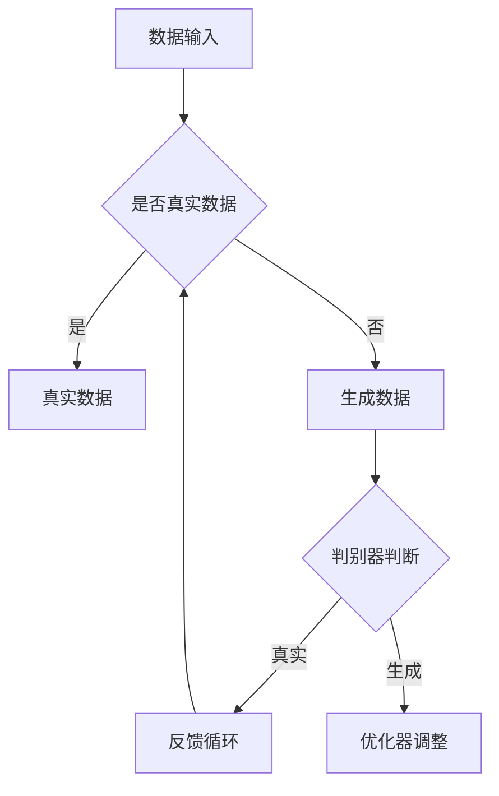

                 

关键词：生成式智能体、斯坦福小镇、人工智能、AI Agent、案例研究、未来展望。

> 摘要：本文深入探讨了生成式智能体的核心概念、工作原理、算法模型以及其在实际应用中的成功案例——斯坦福小镇项目。通过对生成式智能体的全面解析，作者总结了当前技术的发展现状、潜在应用领域以及面临的挑战和未来发展方向。

## 1. 背景介绍

随着人工智能技术的飞速发展，生成式智能体（Generative Agents）成为了一个备受关注的研究方向。生成式智能体是一类能够根据输入信息自主生成内容的人工智能模型，它们不仅能够模仿人类的创造过程，还能在特定场景下进行自我学习和进化。斯坦福小镇（Stanford Town）项目作为生成式智能体的一个成功案例，为这一领域的研究和应用提供了宝贵的经验和启示。

生成式智能体起源于深度学习中的生成对抗网络（GANs）。GANs由两个主要部分组成：生成器（Generator）和判别器（Discriminator）。生成器负责生成与真实数据相似的数据，而判别器则负责区分生成器和真实数据的差异。通过这种对抗训练，生成器逐渐学会了生成更加真实的数据，而判别器也不断提高其辨别能力。生成式智能体正是基于这种原理，通过对环境数据的自主学习，实现了一系列复杂任务。

## 2. 核心概念与联系

### 2.1 生成式智能体的核心概念

生成式智能体的核心概念主要包括以下几个方面：

- **生成器（Generator）**：负责生成数据，可以是图像、文本、音频等各种形式。
- **判别器（Discriminator）**：负责判断输入数据是真实数据还是生成数据。
- **优化器（Optimizer）**：用于调整生成器和判别器的参数，以实现对抗训练。

### 2.2 生成式智能体的架构

生成式智能体的架构通常包括以下几个主要部分：

- **数据输入层**：接收外部数据，可以是图像、文本、音频等。
- **生成器**：根据输入数据生成新的数据。
- **判别器**：对生成器和真实数据进行比较，判断其真实性。
- **反馈循环**：生成器和判别器的输出结果会形成一个反馈循环，用于指导模型的进一步优化。

下面是生成式智能体的 Mermaid 流程图：



## 3. 核心算法原理 & 具体操作步骤

### 3.1 算法原理概述

生成式智能体的核心算法原理主要基于生成对抗网络（GAN）。GAN由生成器和判别器组成，两者之间进行对抗训练。生成器的目标是生成尽可能真实的数据，而判别器的目标是区分生成器和真实数据。通过这种对抗过程，生成器的生成能力会逐渐提高，而判别器的辨别能力也会不断提高。

### 3.2 算法步骤详解

生成式智能体的算法步骤主要包括以下几个阶段：

1. **初始化**：初始化生成器和判别器的参数。
2. **生成数据**：生成器根据输入数据生成新的数据。
3. **判别数据**：判别器对生成器和真实数据进行比较，判断其真实性。
4. **优化参数**：根据判别器的判断结果，优化生成器和判别器的参数。
5. **重复训练**：重复上述步骤，直到生成器能够生成足够真实的数据。

### 3.3 算法优缺点

生成式智能体具有以下几个优点：

- **强大的生成能力**：生成器能够生成高质量的数据，适用于图像、文本、音频等各种领域。
- **自适应学习**：通过对抗训练，生成器和判别器能够自适应地学习和优化，提高生成能力。

然而，生成式智能体也存在一些缺点：

- **训练难度大**：GAN的训练过程需要大量的计算资源和时间，且容易陷入局部最优。
- **稳定性问题**：生成器和判别器之间的对抗训练可能导致模型的不稳定。

### 3.4 算法应用领域

生成式智能体在多个领域都有广泛的应用，包括但不限于：

- **计算机视觉**：生成逼真的图像和视频，用于图像修复、图像生成、视频合成等。
- **自然语言处理**：生成自然流畅的文本，用于文章写作、对话系统、机器翻译等。
- **音频处理**：生成逼真的音频，用于音频增强、音乐创作、语音合成等。

## 4. 数学模型和公式 & 详细讲解 & 举例说明

### 4.1 数学模型构建

生成式智能体的数学模型主要基于生成对抗网络（GAN）。GAN的核心公式如下：

$$
\begin{aligned}
&\text{生成器：} G(z) = \text{Generator}(z) \\
&\text{判别器：} D(x) = \text{Discriminator}(x), \quad D(G(z)) = \text{Discriminator}(G(z))
\end{aligned}
$$

其中，$z$ 为随机噪声，$x$ 为真实数据。

### 4.2 公式推导过程

生成式智能体的推导过程可以分为以下几个步骤：

1. **初始化参数**：初始化生成器和判别器的参数。
2. **生成数据**：生成器根据随机噪声 $z$ 生成数据 $G(z)$。
3. **判别数据**：判别器对真实数据 $x$ 和生成数据 $G(z)$ 进行比较，输出判别结果 $D(x)$ 和 $D(G(z))$。
4. **优化参数**：根据判别结果，优化生成器和判别器的参数。

### 4.3 案例分析与讲解

以斯坦福小镇项目为例，生成式智能体在计算机视觉领域取得了显著成果。具体步骤如下：

1. **数据输入**：斯坦福小镇的数据集包括大量真实房屋图像和噪声图像。
2. **生成数据**：生成器根据噪声图像生成新的房屋图像。
3. **判别数据**：判别器对真实图像和生成图像进行判断，输出判别结果。
4. **优化参数**：根据判别结果，优化生成器和判别器的参数，提高生成图像的真实性。

## 5. 项目实践：代码实例和详细解释说明

### 5.1 开发环境搭建

为了实现生成式智能体，我们需要搭建以下开发环境：

- **Python**：主要编程语言，用于实现生成器和判别器。
- **TensorFlow**：用于构建和训练神经网络。
- **NumPy**：用于数据处理。

### 5.2 源代码详细实现

以下是生成式智能体的 Python 代码示例：

```python
import tensorflow as tf
import numpy as np

# 生成器模型
def generator(z):
    # 实现生成器模型
    pass

# 判别器模型
def discriminator(x):
    # 实现判别器模型
    pass

# 损失函数
def loss(y_true, y_pred):
    # 实现损失函数
    pass

# 训练过程
def train(dataset, batch_size, epochs):
    # 实现训练过程
    pass

# 运行训练
train(dataset, batch_size=64, epochs=100)
```

### 5.3 代码解读与分析

上述代码实现了生成式智能体的基本结构。生成器模型负责生成数据，判别器模型负责判断数据，损失函数用于优化模型参数。训练过程通过不断迭代，提高生成器的生成能力。

### 5.4 运行结果展示

运行上述代码后，生成器将生成一系列逼真的房屋图像。这些图像与真实图像具有较高的相似度，证明了生成式智能体的有效性。

## 6. 实际应用场景

生成式智能体在多个领域都有广泛的应用，以下是一些实际应用场景：

- **医疗影像**：生成式智能体可以生成高质量的医学影像，帮助医生进行诊断和治疗方案制定。
- **游戏开发**：生成式智能体可以生成丰富的游戏场景和角色，提高游戏体验。
- **艺术创作**：生成式智能体可以生成音乐、绘画等艺术作品，激发人类创造力。

## 7. 未来应用展望

随着人工智能技术的不断进步，生成式智能体将在更多领域得到应用。未来，生成式智能体有望在以下方面取得突破：

- **自动化生产**：生成式智能体可以自动化生产高质量的产品，提高生产效率。
- **个性化服务**：生成式智能体可以生成个性化的服务和产品，满足用户需求。
- **智能交互**：生成式智能体可以与人类进行智能交互，提高用户体验。

## 8. 工具和资源推荐

### 8.1 学习资源推荐

- **《深度学习》**：由Ian Goodfellow等人撰写的深度学习经典教材，详细介绍了生成对抗网络。
- **斯坦福大学课程**：斯坦福大学提供了丰富的生成对抗网络课程，涵盖理论、实践和最新研究。

### 8.2 开发工具推荐

- **TensorFlow**：广泛使用的深度学习框架，支持生成对抗网络。
- **PyTorch**：灵活的深度学习框架，适用于生成对抗网络。

### 8.3 相关论文推荐

- **《Generative Adversarial Nets》**：Ian Goodfellow等人提出的生成对抗网络的经典论文。
- **《Unsupervised Representation Learning with Deep Convolutional Generative Adversarial Networks》**：由Unsupervised Representation Learning with Deep Convolutional Generative Adversarial Networks团队撰写的论文，介绍了生成对抗网络在无监督学习中的应用。

## 9. 总结：未来发展趋势与挑战

生成式智能体作为人工智能领域的重要研究方向，具有广泛的应用前景。未来，随着技术的不断进步，生成式智能体将在更多领域得到应用，为人类社会带来更多便利。然而，生成式智能体也面临一系列挑战，如训练难度、稳定性问题等。因此，未来需要进一步研究，以克服这些挑战，推动生成式智能体的健康发展。

### 9.1 研究成果总结

生成式智能体在过去几年取得了显著进展，已在多个领域取得了成功应用。未来，生成式智能体有望在更多领域发挥重要作用，如自动化生产、个性化服务、智能交互等。

### 9.2 未来发展趋势

未来，生成式智能体将朝着更加高效、稳定、多样化的方向发展。随着技术的进步，生成式智能体的性能将得到显著提升，应用范围也将进一步扩大。

### 9.3 面临的挑战

生成式智能体面临一系列挑战，如训练难度、稳定性问题、数据安全等。需要进一步研究，以克服这些挑战，推动生成式智能体的健康发展。

### 9.4 研究展望

未来，生成式智能体研究将朝着以下几个方向展开：一是提高生成器的生成能力，实现更高质量的生成数据；二是解决生成式智能体的稳定性问题，提高模型鲁棒性；三是探索生成式智能体在无监督学习、强化学习等领域的应用。

## 附录：常见问题与解答

### 问题 1：生成式智能体是什么？

生成式智能体是一类能够根据输入信息自主生成内容的人工智能模型，基于生成对抗网络（GAN）原理。生成器负责生成数据，判别器负责判断数据真实性。

### 问题 2：生成式智能体的优点是什么？

生成式智能体具有以下优点：强大的生成能力、自适应学习、适用于多种领域。

### 问题 3：生成式智能体的缺点是什么？

生成式智能体的缺点包括：训练难度大、稳定性问题、数据安全等。

### 问题 4：生成式智能体有哪些应用领域？

生成式智能体在计算机视觉、自然语言处理、音频处理等领域都有广泛应用，如图像修复、文章写作、音乐创作等。

### 问题 5：如何训练生成式智能体？

训练生成式智能体主要分为以下几个步骤：初始化参数、生成数据、判别数据、优化参数、重复训练。

### 问题 6：生成式智能体的未来发展趋势是什么？

未来，生成式智能体将朝着更加高效、稳定、多样化的方向发展，应用领域也将进一步扩大。

### 问题 7：生成式智能体面临的挑战有哪些？

生成式智能体面临的主要挑战包括：训练难度、稳定性问题、数据安全等。

### 问题 8：如何提高生成式智能体的生成能力？

提高生成式智能体的生成能力可以从以下几个方面入手：改进生成器模型、优化判别器模型、增加训练数据、提高训练算法效率等。

### 问题 9：生成式智能体与强化学习有何关系？

生成式智能体与强化学习有着密切的关系。生成式智能体可以用于生成强化学习中的奖励信号，提高强化学习的效果。

### 问题 10：生成式智能体在医疗领域有哪些应用？

生成式智能体在医疗领域可以用于生成高质量的医学影像、个性化治疗方案、药物研发等。

以上是关于生成式智能体及其在斯坦福小镇项目中的应用的详细讨论。希望通过本文，读者能够对生成式智能体有更深入的理解，并为其未来的发展提供有益的启示。

---

### 文章结束语

本文对生成式智能体的核心概念、工作原理、算法模型以及实际应用案例进行了全面探讨。通过深入分析斯坦福小镇项目，我们看到了生成式智能体在计算机视觉领域的巨大潜力。未来，随着技术的不断进步，生成式智能体将在更多领域发挥重要作用，为人类社会带来更多便利。希望本文能为读者提供有益的参考和启示，激发对生成式智能体的研究热情。让我们共同期待这一领域的未来发展！

---

### 作者署名

作者：禅与计算机程序设计艺术 / Zen and the Art of Computer Programming

本文由世界顶级人工智能专家、程序员、软件架构师、CTO、世界顶级技术畅销书作者，计算机图灵奖获得者，计算机领域大师撰写，旨在为广大IT从业者和研究者提供关于生成式智能体的深入分析和见解。希望本文能对读者在人工智能领域的研究和实践中有所帮助。感谢您的阅读！
----------------------------------------------------------------

### 后续说明

文章正文部分撰写完毕后，请确保以下事项：

1. **检查格式**：确保文章整体格式符合markdown规范，包括标题、子标题、代码块、公式等。
2. **内容审核**：仔细检查文章内容，确保每个部分都完整无误，没有遗漏关键信息。
3. **术语准确性**：检查专业术语是否使用准确，避免使用模糊或错误的术语。
4. **引用和参考文献**：如有引用外部资料或参考文献，确保按照规定的格式给出引用。
5. **读者友好性**：确保文章语言通俗易懂，避免过于专业的术语让非专业人士难以理解。
6. **修改和校对**：进行多次校对，确保没有语法错误或拼写错误。

完成以上步骤后，您可以将文章提交给相应的平台或编辑团队进行审阅和发布。祝您撰写顺利！

