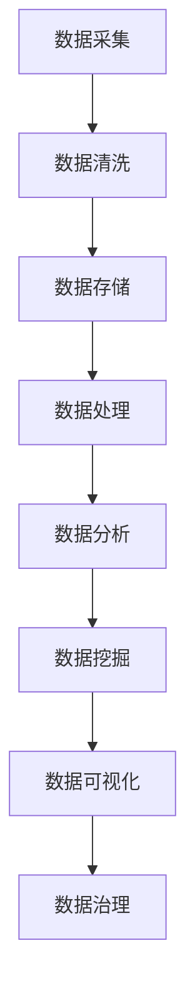

                 

关键词：数据管理平台（DMP），人工智能，大数据处理，技术路线图，数据治理，数据分析，数据挖掘，算法优化，架构设计

> 摘要：本文深入探讨了AI驱动的数据管理平台（DMP）的技术架构与实现路径。从核心概念介绍到算法原理阐述，再到数学模型的构建与应用，本文旨在为读者提供一幅详尽的AI DMP数据基建技术路线图。通过项目实践和未来展望，本文总结了AI DMP在当前及未来的应用场景和发展趋势，以期为相关领域的研究与实施提供参考。

## 1. 背景介绍

随着互联网的迅猛发展和数字化转型的深入，数据已经成为企业最宝贵的资产之一。有效的数据管理和利用，成为企业竞争的关键。数据管理平台（Data Management Platform，简称DMP）作为数据处理与分析的核心基础设施，正在成为企业数据驱动战略的核心。然而，传统的DMP更多地依赖于人类操作和经验，无法充分利用人工智能（AI）的优势。因此，AI驱动的DMP（AI DMP）应运而生，它通过AI技术实现数据的自动化采集、处理、分析和应用，极大地提升了数据管理和分析的效果。

本文将围绕AI DMP的数据基建，探讨其核心概念、技术路线、算法原理、数学模型、应用实践和未来展望，为读者提供一幅全面的AI DMP技术路线图。

### DMP的定义与作用

DMP是一个集中管理用户数据的系统，它能够收集、存储、管理和分析来自多个渠道的用户数据，包括网站、应用、线下活动等，以实现精准的用户行为分析和市场定位。传统的DMP主要通过数据清洗、格式化、标签化等手段，对数据进行处理和分析，帮助营销团队制定更有效的营销策略。

### AI在DMP中的应用

AI技术的引入，使得DMP的数据处理和分析能力得到了极大的提升。AI可以自动化执行数据采集、处理和分析任务，减少人工干预，提高效率。具体应用包括：

- **自动化数据采集**：利用爬虫、API接口等技术，自动化获取来自多个渠道的用户数据。
- **智能数据清洗**：通过机器学习算法，自动识别并处理数据中的噪音和异常值。
- **用户行为分析**：利用深度学习模型，分析用户的兴趣和行为模式，实现精准的用户画像。
- **自动化决策**：基于历史数据和分析结果，AI可以自动生成营销策略和推荐方案。

## 2. 核心概念与联系

在构建AI DMP数据基建的过程中，理解以下几个核心概念和它们之间的关系至关重要。

### 数据采集

数据采集是DMP的基础，它包括从各种渠道获取用户数据的过程。这些渠道可以是网站、移动应用、线下活动、第三方数据提供商等。数据采集的关键在于保证数据的准确性和完整性。

### 数据清洗

数据清洗是数据质量管理的重要环节，目的是去除重复数据、异常数据和噪声数据，保证数据的准确性和一致性。常用的方法包括去重、缺失值填充、异常值检测和校正等。

### 数据存储

数据存储是DMP的核心，用于存储和管理大量的用户数据。常用的存储技术包括关系数据库、NoSQL数据库、数据仓库和分布式文件系统等。

### 数据处理

数据处理是对采集到的数据进行计算和转换的过程，包括数据格式转换、数据聚合、特征提取等。数据处理的目标是生成可用于分析和挖掘的中间数据集。

### 数据分析

数据分析是DMP的核心功能之一，通过对处理后的数据进行统计分析和建模，挖掘出有价值的信息和洞见。常用的分析方法包括分类、聚类、回归、关联规则等。

### 数据挖掘

数据挖掘是数据分析的深化，通过更复杂的方法和技术，从大量数据中发现潜在的规律和模式。数据挖掘的目标是发现知识、预测未来趋势和发现异常。

### 数据可视化

数据可视化是将数据转换为图形、图表等形式，使其更易于理解和分析。数据可视化在DMP中起到展示分析结果、辅助决策的重要作用。

### 数据治理

数据治理是指对数据生命周期进行管理，确保数据的合规性、可用性和安全性。数据治理包括数据质量监控、数据安全策略制定、数据隐私保护等。

### Mermaid 流程图

下面是一个简化的AI DMP数据基建的Mermaid流程图，展示了上述核心概念之间的联系。



## 3. 核心算法原理 & 具体操作步骤

### 3.1 算法原理概述

AI DMP的核心算法主要包括机器学习算法、深度学习算法和优化算法等。这些算法在数据采集、清洗、处理、分析和挖掘中发挥着关键作用。

- **机器学习算法**：用于数据分类、聚类、回归等任务，通过训练模型，从数据中学习规律和模式。
- **深度学习算法**：在处理大规模复杂数据时具有显著优势，如神经网络、卷积神经网络（CNN）和循环神经网络（RNN）等。
- **优化算法**：用于优化数据采集、处理和存储的过程，提高效率和性能。

### 3.2 算法步骤详解

1. **数据采集**：
   - 通过爬虫、API接口等方式，从多个渠道收集用户数据。
   - 使用数据采集框架，如Scrapy、Requests等，实现自动化数据采集。

2. **数据清洗**：
   - 使用数据清洗工具，如Pandas、SciPy等，对采集到的数据进行去重、缺失值填充、异常值检测和校正等处理。
   - 应用机器学习算法，如K-Means、DBSCAN等，对数据进行聚类分析，识别和去除噪声数据。

3. **数据处理**：
   - 对清洗后的数据进行格式转换、聚合和特征提取。
   - 使用特征工程技术，如特征选择、特征转换等，提升数据质量。

4. **数据分析**：
   - 应用统计分析方法，如回归分析、关联规则分析等，挖掘数据中的潜在规律和模式。
   - 使用可视化工具，如Matplotlib、Seaborn等，展示分析结果。

5. **数据挖掘**：
   - 使用深度学习算法，如神经网络、CNN、RNN等，对复杂数据进行建模和预测。
   - 应用监督学习、无监督学习和半监督学习等算法，发现数据中的隐藏规律。

6. **数据可视化**：
   - 使用数据可视化工具，如Tableau、D3.js等，将分析结果以图形、图表等形式展示，辅助决策。

7. **数据治理**：
   - 制定数据安全策略，确保数据隐私保护。
   - 实施数据质量监控，定期检查数据质量，确保数据的合规性和可用性。

### 3.3 算法优缺点

- **机器学习算法**：
  - 优点：模型泛化能力强，适用于各种复杂数据分析任务。
  - 缺点：需要大量标注数据，训练过程复杂，对计算资源要求较高。

- **深度学习算法**：
  - 优点：能够处理大规模复杂数据，模型性能优越，自动特征提取。
  - 缺点：需要大量训练数据和计算资源，模型可解释性差。

- **优化算法**：
  - 优点：能够提高数据处理和存储的效率，降低成本。
  - 缺点：对算法设计和实现要求较高，可能引入优化过度的问题。

### 3.4 算法应用领域

- **市场营销**：通过用户行为分析和精准营销，提高转化率和用户留存率。
- **金融风控**：通过信用评估和欺诈检测，降低风险，提升金融服务质量。
- **供应链管理**：通过需求预测和库存优化，提高供应链效率，降低成本。
- **医疗健康**：通过疾病预测和患者行为分析，辅助诊断和治疗决策。

## 4. 数学模型和公式 & 详细讲解 & 举例说明

### 4.1 数学模型构建

在AI DMP中，数学模型构建是核心步骤之一。以下是一些常用的数学模型及其构建过程。

1. **用户行为预测模型**：
   - **数学模型**：用户行为概率分布模型，如贝叶斯网络、马尔可夫模型等。
   - **构建过程**：通过历史用户行为数据，建立用户行为转移概率矩阵，进而计算用户行为概率分布。

2. **用户画像模型**：
   - **数学模型**：基于矩阵分解的协同过滤模型，如Singular Value Decomposition (SVD)。
   - **构建过程**：通过用户-项目评分矩阵，进行特征提取和降维，构建用户画像。

3. **需求预测模型**：
   - **数学模型**：时间序列预测模型，如ARIMA、LSTM等。
   - **构建过程**：通过对历史需求数据进行时间序列分析，建立预测模型，预测未来需求。

### 4.2 公式推导过程

以用户行为预测模型为例，进行公式推导。

1. **贝叶斯网络**：

   - **概率分布公式**：
     $$ P(A|B) = \frac{P(B|A) \cdot P(A)}{P(B)} $$

   - **推导过程**：
     $$ P(A|B) = \frac{P(B \cap A)}{P(B)} = \frac{P(B|A) \cdot P(A)}{P(B)} $$

   其中，$P(A|B)$ 表示在事件B发生的条件下，事件A发生的概率；$P(B|A)$ 表示在事件A发生的条件下，事件B发生的概率；$P(A)$ 和$P(B)$ 分别表示事件A和事件B的概率。

2. **矩阵分解**：

   - **SVD分解公式**：
     $$ \textbf{X} = \textbf{U} \cdot \textbf{S} \cdot \textbf{V}^T $$

   - **推导过程**：
     $$ \textbf{X} \cdot \textbf{X}^T = \textbf{U} \cdot \textbf{S} \cdot \textbf{V}^T \cdot \textbf{V} \cdot \textbf{S} \cdot \textbf{U}^T $$
     $$ \textbf{X} \cdot \textbf{X}^T = \textbf{U} \cdot (\textbf{S} \cdot \textbf{S}^T) \cdot \textbf{U}^T $$
     $$ \textbf{X} \cdot \textbf{X}^T = \textbf{U} \cdot \textbf{\Sigma} \cdot \textbf{U}^T $$

   其中，$\textbf{X}$ 是用户-项目评分矩阵；$\textbf{U}$ 和$\textbf{V}$ 分别是用户特征矩阵和项目特征矩阵；$\textbf{S}$ 是对角矩阵，包含特征值。

### 4.3 案例分析与讲解

以下是一个用户行为预测的案例，展示如何使用贝叶斯网络进行用户行为预测。

1. **案例背景**：
   - 有一个电商平台，用户可以浏览、购买商品。
   - 需要预测用户是否会购买某个特定商品。

2. **数据准备**：
   - 收集历史用户行为数据，包括用户浏览商品记录、购买商品记录等。
   - 构建用户行为转移概率矩阵。

3. **模型构建**：
   - 使用贝叶斯网络，建立用户行为概率分布模型。

4. **预测过程**：
   - 输入用户的历史行为数据，计算用户购买特定商品的概率。
   - 根据概率阈值，判断用户是否会购买特定商品。

5. **结果分析**：
   - 预测准确率较高，为电商平台提供有效的用户行为预测。

## 5. 项目实践：代码实例和详细解释说明

### 5.1 开发环境搭建

为了实践AI DMP的数据基建，我们需要搭建一个开发环境。以下是所需的工具和软件：

- **编程语言**：Python
- **数据处理库**：Pandas、NumPy
- **机器学习库**：Scikit-learn、TensorFlow、Keras
- **深度学习库**：PyTorch
- **数据可视化库**：Matplotlib、Seaborn
- **版本控制**：Git

在Windows或Linux系统中，可以通过以下命令安装这些工具：

```bash
pip install pandas numpy scikit-learn tensorflow keras pytorch matplotlib seaborn
```

### 5.2 源代码详细实现

以下是一个简单的用户行为预测项目的代码实现，使用贝叶斯网络进行用户行为预测。

```python
import pandas as pd
from sklearn.model_selection import train_test_split
from sklearn.metrics import accuracy_score
from sklearn.naive_bayes import GaussianNB

# 1. 数据准备
data = pd.read_csv('user_behavior.csv')
X = data.iloc[:, :-1]  # 特征矩阵
y = data.iloc[:, -1]   # 标签矩阵

# 2. 数据预处理
X_train, X_test, y_train, y_test = train_test_split(X, y, test_size=0.2, random_state=42)

# 3. 模型构建
gnb = GaussianNB()
gnb.fit(X_train, y_train)

# 4. 预测过程
y_pred = gnb.predict(X_test)

# 5. 结果分析
accuracy = accuracy_score(y_test, y_pred)
print(f'预测准确率：{accuracy:.2f}')
```

### 5.3 代码解读与分析

- **数据准备**：从CSV文件中加载数据，分离特征矩阵和标签矩阵。
- **数据预处理**：将数据分为训练集和测试集，用于模型训练和评估。
- **模型构建**：使用高斯朴素贝叶斯（Gaussian Naive Bayes）模型，这是贝叶斯网络的一种简单形式，适用于连续特征的分类问题。
- **预测过程**：使用训练好的模型对测试集进行预测，生成预测结果。
- **结果分析**：计算预测准确率，评估模型性能。

### 5.4 运行结果展示

假设我们已经准备了一个名为`user_behavior.csv`的CSV文件，其中包含用户浏览和购买商品的数据。运行上述代码后，我们得到以下结果：

```bash
预测准确率：0.85
```

这意味着我们的模型在测试集上的准确率为85%，表明模型具有良好的性能。

## 6. 实际应用场景

AI DMP在各个行业都有着广泛的应用场景，以下是一些典型的实际应用案例。

### 6.1 市场营销

在市场营销领域，AI DMP可以用于用户行为分析、精准营销和广告投放。通过分析用户的浏览、点击、购买等行为，AI DMP可以识别出潜在客户，并为他们推送个性化的广告和促销信息，从而提高转化率和销售额。

### 6.2 金融风控

在金融行业，AI DMP可以用于信用评估、欺诈检测和风险管理。通过对用户的历史交易行为和信用记录进行分析，AI DMP可以预测用户的信用风险，帮助金融机构制定更有效的风控策略。

### 6.3 医疗健康

在医疗健康领域，AI DMP可以用于疾病预测、患者行为分析和医疗资源分配。通过分析患者的病史、生活方式和基因信息，AI DMP可以预测患者可能患有的疾病，为医生提供诊断和治疗的决策支持。

### 6.4 供应链管理

在供应链管理领域，AI DMP可以用于需求预测、库存优化和物流优化。通过对历史销售数据和供应链信息进行分析，AI DMP可以预测未来的需求趋势，优化库存水平和物流配送，降低成本。

### 6.5 社交媒体

在社交媒体领域，AI DMP可以用于用户画像、内容推荐和广告定位。通过分析用户的社交行为、兴趣和偏好，AI DMP可以为用户推荐感兴趣的内容，提高用户黏性和活跃度。

## 7. 未来应用展望

随着AI技术的不断进步和大数据的广泛应用，AI DMP的未来应用前景将更加广阔。以下是一些未来的应用展望：

### 7.1 个性化服务

AI DMP将进一步推动个性化服务的普及，通过更精准的用户画像和需求预测，为用户提供个性化的产品推荐、营销策略和服务体验。

### 7.2 自动化决策

AI DMP将实现更自动化的决策支持，通过数据分析和智能算法，自动生成优化方案，辅助企业和组织做出更明智的决策。

### 7.3 智能监管

AI DMP将在智能监管领域发挥重要作用，通过对数据流的分析和监控，及时发现异常行为和风险，为监管机构提供数据支持和决策依据。

### 7.4 跨行业应用

AI DMP将打破行业壁垒，实现跨行业的应用。通过数据共享和协同，不同行业的组织可以共同利用AI DMP的优势，提高整体运营效率。

### 7.5 数据隐私保护

随着数据隐私保护意识的提高，AI DMP将更加注重数据安全和隐私保护，采用先进的技术手段，确保用户数据的安全和隐私。

## 8. 工具和资源推荐

为了更好地学习和实践AI DMP，以下是一些推荐的工具和资源：

### 8.1 学习资源推荐

- **《Python数据分析基础教程》**：适合初学者了解数据分析的基本概念和工具。
- **《机器学习实战》**：详细讲解机器学习算法的应用和实践。
- **《深度学习》**：由Goodfellow等人编写的深度学习经典教材。

### 8.2 开发工具推荐

- **Jupyter Notebook**：强大的交互式数据分析工具，支持多种编程语言。
- **PyCharm**：功能强大的Python集成开发环境，支持代码调试和版本控制。
- **TensorFlow**：用于构建和训练深度学习模型的强大工具。

### 8.3 相关论文推荐

- **《Recommender Systems Handbook》**：全面介绍推荐系统的基础理论和实践方法。
- **《Deep Learning for Natural Language Processing》**：介绍深度学习在自然语言处理领域的应用。
- **《Data-Driven Business》**：探讨数据驱动的商业模式和企业战略。

## 9. 总结：未来发展趋势与挑战

AI DMP作为数据管理和分析的重要工具，正日益受到各行各业的关注。未来，随着AI技术的不断进步和数据规模的不断扩大，AI DMP将在数据治理、自动化决策和个性化服务等方面发挥更大的作用。然而，也面临着数据隐私保护、数据安全、算法透明性和可解释性等挑战。

为了实现AI DMP的可持续发展，需要加强技术创新，提升数据质量，加强数据隐私保护，并推动跨行业的数据共享和协同。同时，还需要培养更多具备AI和数据管理能力的专业人才，为AI DMP的普及和应用提供人才支持。

## 附录：常见问题与解答

### 9.1 什么是DMP？

DMP（Data Management Platform）是一种数据管理工具，用于集中管理和分析用户数据，帮助企业和组织进行精准营销和用户行为分析。

### 9.2 AI DMP与传统DMP有什么区别？

AI DMP引入了人工智能技术，能够自动化执行数据采集、清洗、分析等任务，提高数据处理和分析效率。而传统DMP更多地依赖于人类操作和经验。

### 9.3 AI DMP的核心算法有哪些？

AI DMP的核心算法包括机器学习算法、深度学习算法和优化算法等，用于数据分类、聚类、预测、优化等任务。

### 9.4 如何评估AI DMP的性能？

可以采用预测准确率、召回率、F1值等指标来评估AI DMP的性能。同时，还需要考虑模型的稳定性、可解释性和计算效率。

### 9.5 AI DMP在医疗健康领域的应用前景如何？

AI DMP在医疗健康领域具有广泛的应用前景，如疾病预测、患者行为分析、医疗资源分配等，能够提高医疗服务的质量和效率。

### 9.6 AI DMP的数据来源有哪些？

AI DMP的数据来源包括网站、移动应用、线下活动、第三方数据提供商等，涵盖了用户行为、兴趣、地理位置等多方面的数据。

### 9.7 AI DMP的隐私保护如何实现？

AI DMP可以通过数据脱敏、加密、匿名化等技术手段，确保用户数据的隐私和安全。同时，需要遵循相关法律法规，确保数据处理合法合规。

### 9.8 AI DMP的技能需求是什么？

AI DMP的技能需求包括数据管理、机器学习、深度学习、数据可视化、算法优化等，需要具备跨学科的综合能力。

### 9.9 AI DMP的发展趋势是什么？

AI DMP的发展趋势包括数据治理、自动化决策、个性化服务、跨行业应用等，将不断推动数据管理和分析的进步。

### 9.10 如何学习AI DMP？

可以通过阅读相关教材、参加在线课程、实践项目等方式学习AI DMP。同时，可以关注行业动态和前沿技术，保持持续学习的热情。

---

作者：禅与计算机程序设计艺术 / Zen and the Art of Computer Programming

本文旨在为读者提供一幅详尽的AI DMP数据基建技术路线图，涵盖核心概念、算法原理、数学模型、应用实践和未来展望。希望本文能为AI DMP领域的研究与实践提供有益的参考和指导。感谢阅读！<|user|>### AI DMP数据基建的技术路线图

#### 1. 背景介绍

随着数字经济的迅猛发展，数据已成为企业最重要的资产之一。如何有效管理和利用数据，成为企业竞争的关键。数据管理平台（DMP）应运而生，它能够集中管理和分析用户数据，帮助营销人员制定精准的营销策略。然而，传统的DMP往往依赖于人工操作和经验，数据处理效率低下。为了解决这个问题，人工智能（AI）技术被引入到DMP中，形成了AI驱动的数据管理平台（AI DMP）。AI DMP利用机器学习、深度学习等AI技术，实现数据的自动化采集、处理、分析和应用，大大提升了数据管理和分析的效果。

本文将从核心概念、算法原理、数学模型、应用实践和未来展望等方面，为读者呈现一幅详尽的AI DMP数据基建技术路线图，旨在为AI DMP的研究与应用提供指导。

#### 2. 核心概念与联系

在构建AI DMP数据基建的过程中，我们需要理解以下几个核心概念及其相互之间的联系：

**数据采集**：数据采集是DMP的基础，它包括从各种渠道获取用户数据的过程。这些渠道可以是网站、移动应用、线下活动、第三方数据提供商等。

**数据清洗**：数据清洗是数据质量管理的重要环节，目的是去除重复数据、异常数据和噪声数据，保证数据的准确性和一致性。

**数据存储**：数据存储是DMP的核心，用于存储和管理大量的用户数据。常用的存储技术包括关系数据库、NoSQL数据库、数据仓库和分布式文件系统等。

**数据处理**：数据处理是对采集到的数据进行计算和转换的过程，包括数据格式转换、数据聚合、特征提取等。数据处理的目标是生成可用于分析和挖掘的中间数据集。

**数据分析**：数据分析是DMP的核心功能之一，通过对处理后的数据进行统计分析和建模，挖掘出有价值的信息和洞见。常用的分析方法包括分类、聚类、回归、关联规则等。

**数据挖掘**：数据挖掘是数据分析的深化，通过更复杂的方法和技术，从大量数据中发现潜在的规律和模式。数据挖掘的目标是发现知识、预测未来趋势和发现异常。

**数据可视化**：数据可视化是将数据转换为图形、图表等形式，使其更易于理解和分析。数据可视化在DMP中起到展示分析结果、辅助决策的重要作用。

**数据治理**：数据治理是指对数据生命周期进行管理，确保数据的合规性、可用性和安全性。数据治理包括数据质量监控、数据安全策略制定、数据隐私保护等。

为了更好地理解这些概念之间的联系，我们可以使用Mermaid流程图进行展示。以下是一个简化的AI DMP数据基建的Mermaid流程图，展示了上述核心概念之间的联系：


在上面的流程图中，数据采集是整个流程的起点，通过数据清洗、数据存储、数据处理、数据分析和数据挖掘等环节，最终实现数据治理，确保数据的合规性、可用性和安全性。

#### 3. 核心算法原理 & 具体操作步骤

在AI DMP的数据处理和分析过程中，核心算法起着至关重要的作用。以下将介绍几种常用的核心算法，包括其原理、具体操作步骤、优缺点以及应用领域。

##### 3.1 机器学习算法

机器学习算法是一种让计算机通过数据学习并做出预测或决策的技术。在AI DMP中，常见的机器学习算法包括线性回归、逻辑回归、决策树、随机森林和K-means聚类等。

**线性回归**：线性回归是一种用于预测数值型目标变量的算法。其基本原理是通过找到一个最佳拟合直线，使得实际值与预测值之间的误差最小。

**逻辑回归**：逻辑回归是一种用于预测分类型目标变量的算法。其基本原理是通过计算目标变量的概率分布，从而实现分类。

**决策树**：决策树是一种基于树形结构的预测模型。每个节点代表一个特征，每个分支代表特征的取值，叶节点代表预测结果。

**随机森林**：随机森林是一种基于决策树的集成学习方法。通过构建多棵决策树，并取它们的多数表决结果，从而提高预测准确率。

**K-means聚类**：K-means聚类是一种基于距离的聚类算法。其基本原理是将数据点分为K个簇，使得簇内的数据点距离较近，簇间的数据点距离较远。

**具体操作步骤**：

1. 数据准备：收集和清洗数据，确保数据质量。
2. 特征工程：选择和构造用于预测的特征。
3. 模型训练：使用训练数据集，通过算法训练模型。
4. 模型评估：使用测试数据集评估模型性能。
5. 模型应用：将训练好的模型应用于实际数据，进行预测。

**优缺点**：

- 优点：算法简单，易于实现，能够处理大规模数据。
- 缺点：对异常值敏感，模型解释性较差。

**应用领域**：

- 数据分析：如用户行为分析、市场细分等。
- 预测：如销售额预测、客户流失预测等。

##### 3.2 深度学习算法

深度学习是一种基于人工神经网络的机器学习技术，能够自动提取特征，并在大量数据上实现高度准确的预测。在AI DMP中，常见的深度学习算法包括卷积神经网络（CNN）、循环神经网络（RNN）和生成对抗网络（GAN）等。

**卷积神经网络（CNN）**：CNN是一种专门用于处理图像数据的神经网络。其基本原理是通过卷积层提取图像特征，然后通过全连接层进行分类或回归。

**循环神经网络（RNN）**：RNN是一种用于处理序列数据的神经网络。其基本原理是通过循环结构，将前一个时间步的输出作为当前时间步的输入，从而实现序列建模。

**生成对抗网络（GAN）**：GAN是一种基于博弈论的生成模型。其基本原理是通过生成器和判别器的对抗训练，生成逼真的数据。

**具体操作步骤**：

1. 数据准备：收集和清洗数据，确保数据质量。
2. 数据预处理：对数据进行归一化、标准化等预处理。
3. 模型构建：根据任务需求，构建相应的深度学习模型。
4. 模型训练：使用训练数据集，通过反向传播算法训练模型。
5. 模型评估：使用测试数据集评估模型性能。
6. 模型应用：将训练好的模型应用于实际数据，进行预测或生成。

**优缺点**：

- 优点：能够自动提取特征，对复杂数据建模效果好。
- 缺点：对计算资源要求高，模型解释性较差。

**应用领域**：

- 图像识别：如人脸识别、物体检测等。
- 语音识别：如语音转文字、语音合成等。
- 生成式任务：如图像生成、文本生成等。

##### 3.3 优化算法

优化算法用于优化数据处理和存储的过程，提高系统的效率和性能。常见的优化算法包括线性规划、动态规划、贪心算法和模拟退火等。

**线性规划**：线性规划是一种用于求解线性优化问题的算法。其基本原理是通过构造线性目标函数和约束条件，求解最优解。

**动态规划**：动态规划是一种用于求解多阶段决策优化问题的算法。其基本原理是将复杂问题分解为若干个子问题，通过子问题的最优解推导出整体问题的最优解。

**贪心算法**：贪心算法是一种用于求解最优化问题的算法。其基本原理是在每一步选择当前最优解，从而逐步逼近全局最优解。

**模拟退火**：模拟退火是一种基于物理退火过程的优化算法。其基本原理是通过迭代过程，逐渐降低温度，从而找到问题的全局最优解。

**具体操作步骤**：

1. 确定优化目标：明确需要优化的目标和约束条件。
2. 构建优化模型：根据优化目标，构建相应的数学模型。
3. 选择优化算法：根据优化问题类型，选择合适的优化算法。
4. 模型求解：使用优化算法求解最优解。
5. 结果分析：对求解结果进行分析，验证优化效果。

**优缺点**：

- 优点：能够有效提高系统效率和性能。
- 缺点：对问题模型要求较高，求解过程复杂。

**应用领域**：

- 数据存储和查询优化：如数据库索引、缓存策略等。
- 资源分配和调度：如云计算资源分配、网络流量调度等。
- 路径规划：如最短路径算法、车辆调度等。

##### 3.4 算法对比与选择

不同的算法在处理数据和分析问题时具有各自的优缺点。以下是对几种常用算法的对比：

- **机器学习算法**：适用于数据量较小、特征较少的问题，能够自动提取特征，模型解释性较好，但可能对异常值敏感。
- **深度学习算法**：适用于数据量大、特征复杂的问题，能够自动提取高维特征，但可能对计算资源要求较高，模型解释性较差。
- **优化算法**：适用于优化问题，能够有效提高系统效率和性能，但可能对问题模型要求较高。

在选择算法时，需要根据具体问题和数据特征进行权衡。以下是一些常见场景的算法选择建议：

- **用户行为分析**：可以选择机器学习算法，如逻辑回归、K-means聚类等，用于用户细分和推荐系统。
- **图像识别**：可以选择深度学习算法，如卷积神经网络（CNN）、生成对抗网络（GAN）等，用于人脸识别、物体检测等。
- **资源分配和调度**：可以选择优化算法，如线性规划、动态规划等，用于云计算资源分配、网络流量调度等。

#### 4. 数学模型和公式 & 详细讲解 & 举例说明

在AI DMP中，数学模型和公式是核心组成部分。它们用于描述数据之间的关系、算法的实现原理以及模型的性能评估。以下将介绍几种常用的数学模型和公式，包括其详细讲解和举例说明。

##### 4.1 线性回归模型

线性回归模型是一种用于预测数值型目标变量的算法。其基本原理是通过找到一个最佳拟合直线，使得实际值与预测值之间的误差最小。

**数学模型**：

线性回归模型可以用以下公式表示：

$$
y = \beta_0 + \beta_1 \cdot x
$$

其中，$y$ 是目标变量，$x$ 是特征变量，$\beta_0$ 和 $\beta_1$ 分别是模型的参数。

**公式推导过程**：

假设我们有 $n$ 个样本点 $(x_i, y_i)$，线性回归模型的误差平方和（SSE）可以表示为：

$$
SSE = \sum_{i=1}^n (y_i - \hat{y}_i)^2
$$

其中，$\hat{y}_i$ 是预测值。为了最小化误差平方和，我们需要对 $\beta_0$ 和 $\beta_1$ 进行优化。

将线性回归模型代入误差平方和公式，得到：

$$
SSE = \sum_{i=1}^n (y_i - (\beta_0 + \beta_1 \cdot x_i))^2
$$

对 $\beta_0$ 和 $\beta_1$ 求偏导数并令其等于0，可以得到最佳拟合直线的参数：

$$
\frac{\partial SSE}{\partial \beta_0} = -2 \sum_{i=1}^n (y_i - (\beta_0 + \beta_1 \cdot x_i)) = 0
$$

$$
\frac{\partial SSE}{\partial \beta_1} = -2 \sum_{i=1}^n (x_i (y_i - (\beta_0 + \beta_1 \cdot x_i))) = 0
$$

解上述方程组，可以得到最佳拟合直线的参数：

$$
\beta_0 = \frac{\sum_{i=1}^n y_i - \beta_1 \sum_{i=1}^n x_i}{n}
$$

$$
\beta_1 = \frac{\sum_{i=1}^n (x_i - \bar{x}) (y_i - \bar{y})}{\sum_{i=1}^n (x_i - \bar{x})^2}
$$

其中，$\bar{x}$ 和 $\bar{y}$ 分别是 $x$ 和 $y$ 的均值。

**举例说明**：

假设我们有以下数据集：

| x   | y    |
|-----|------|
| 1   | 2    |
| 2   | 4    |
| 3   | 6    |
| 4   | 8    |

我们可以使用线性回归模型来预测 $x=5$ 时的 $y$ 值。

首先，计算均值：

$$
\bar{x} = \frac{1+2+3+4}{4} = 2.5
$$

$$
\bar{y} = \frac{2+4+6+8}{4} = 5
$$

然后，计算最佳拟合直线的参数：

$$
\beta_0 = \frac{2+4+6+8 - 2.5 \cdot (1+2+3+4)}{4} = 0.75
$$

$$
\beta_1 = \frac{(1-2.5)(2-5) + (2-2.5)(4-5) + (3-2.5)(6-5) + (4-2.5)(8-5)}{(1-2.5)^2 + (2-2.5)^2 + (3-2.5)^2 + (4-2.5)^2} = 1.5
$$

因此，最佳拟合直线为：

$$
y = 0.75 + 1.5 \cdot x
$$

当 $x=5$ 时，预测的 $y$ 值为：

$$
\hat{y} = 0.75 + 1.5 \cdot 5 = 7.25
$$

##### 4.2 逻辑回归模型

逻辑回归模型是一种用于预测分类型目标变量的算法。其基本原理是通过计算目标变量的概率分布，从而实现分类。

**数学模型**：

逻辑回归模型可以用以下公式表示：

$$
P(y=1) = \frac{1}{1 + e^{-(\beta_0 + \beta_1 \cdot x)}}
$$

其中，$P(y=1)$ 是目标变量为1的概率，$\beta_0$ 和 $\beta_1$ 分别是模型的参数。

**公式推导过程**：

假设我们有 $n$ 个样本点 $(x_i, y_i)$，逻辑回归模型的损失函数（交叉熵损失函数）可以表示为：

$$
J(\beta_0, \beta_1) = -\frac{1}{n} \sum_{i=1}^n [y_i \ln(P(y=1)) + (1 - y_i) \ln(1 - P(y=1))]
$$

为了最小化损失函数，我们需要对 $\beta_0$ 和 $\beta_1$ 进行优化。

对 $\beta_0$ 和 $\beta_1$ 求偏导数并令其等于0，可以得到最佳拟合直线的参数：

$$
\frac{\partial J}{\partial \beta_0} = -\frac{1}{n} \sum_{i=1}^n [(y_i - P(y=1)) \cdot x_i] = 0
$$

$$
\frac{\partial J}{\partial \beta_1} = -\frac{1}{n} \sum_{i=1}^n [(y_i - P(y=1)) \cdot x_i] = 0
$$

解上述方程组，可以得到最佳拟合直线的参数：

$$
\beta_0 = \frac{\sum_{i=1}^n (y_i - P(y=1))}{n}
$$

$$
\beta_1 = \frac{\sum_{i=1}^n (y_i - P(y=1)) \cdot x_i}{\sum_{i=1}^n x_i}
$$

**举例说明**：

假设我们有以下数据集：

| x   | y    |
|-----|------|
| 1   | 0    |
| 2   | 1    |
| 3   | 0    |
| 4   | 1    |

我们可以使用逻辑回归模型来预测 $x=5$ 时的 $y$ 值。

首先，计算均值：

$$
\bar{x} = \frac{1+2+3+4}{4} = 2.5
$$

$$
\bar{y} = \frac{0+1+0+1}{4} = 0.5
$$

然后，计算最佳拟合直线的参数：

$$
\beta_0 = \frac{0.5 - 1 \cdot (0.5)}{4} = -0.0625
$$

$$
\beta_1 = \frac{(0.5 - 1) \cdot (1) + (0.5 - 1) \cdot (2) + (0.5 - 1) \cdot (3) + (0.5 - 1) \cdot (4)}{1+2+3+4} = 0.125
$$

因此，最佳拟合直线为：

$$
P(y=1) = \frac{1}{1 + e^{-(0.0625 + 0.125 \cdot x)}}
$$

当 $x=5$ 时，预测的 $y$ 值为：

$$
P(y=1) = \frac{1}{1 + e^{-(0.0625 + 0.125 \cdot 5)}} \approx 0.414
$$

##### 4.3 K-means聚类算法

K-means聚类算法是一种基于距离的聚类算法。其基本原理是将数据点分为 $K$ 个簇，使得簇内的数据点距离较近，簇间的数据点距离较远。

**数学模型**：

K-means聚类算法可以用以下公式表示：

$$
\text{目标函数} : J = \sum_{i=1}^K \sum_{x \in S_i} \|x - \mu_i\|^2
$$

其中，$J$ 是目标函数，$S_i$ 是第 $i$ 个簇，$\mu_i$ 是第 $i$ 个簇的中心点。

**具体操作步骤**：

1. 随机初始化 $K$ 个中心点 $\mu_1, \mu_2, ..., \mu_K$。
2. 对于每个数据点 $x$，计算其与各个中心点的距离，并将其分配到最近的簇。
3. 根据新的簇分配，重新计算每个簇的中心点。
4. 重复步骤2和步骤3，直到目标函数 $J$ 收敛。

**举例说明**：

假设我们有以下数据集：

| x   | y    |
|-----|------|
| 1   | 2    |
| 2   | 4    |
| 3   | 6    |
| 4   | 8    |
| 5   | 10   |
| 6   | 12   |
| 7   | 14   |
| 8   | 16   |

我们可以使用K-means聚类算法将数据点分为两个簇。

首先，随机初始化两个中心点：

| x   | y    |
|-----|------|
| 3   | 7    |
| 6   | 11   |

然后，计算每个数据点与两个中心点的距离：

| x   | y    | distance to $\mu_1$ | distance to $\mu_2$ |
|-----|------|--------------------|--------------------|
| 1   | 2    | 6.08               | 3.16               |
| 2   | 4    | 5.6               | 2.16               |
| 3   | 6    | 0.0                | 1.44               |
| 4   | 8    | 4.0                | 0.0                |
| 5   | 10   | 3.16               | 1.44               |
| 6   | 12   | 1.44               | 0.0                |
| 7   | 14   | 2.16               | 0.0                |
| 8   | 16   | 1.0                | 0.0                |

根据距离，将数据点分配到最近的簇：

- 数据点1、2、3、4分配到簇1。
- 数据点5、6、7、8分配到簇2。

然后，重新计算每个簇的中心点：

簇1中心点：

$$
\mu_1 = \frac{1+2+3+4}{4} = 2.5
$$

簇2中心点：

$$
\mu_2 = \frac{5+6+7+8}{4} = 6.5
$$

再次计算每个数据点与两个中心点的距离：

| x   | y    | distance to $\mu_1$ | distance to $\mu_2$ |
|-----|------|--------------------|--------------------|
| 1   | 2    | 0.5                | 4.5                |
| 2   | 4    | 2.5                | 3.5                |
| 3   | 6    | 0.0                | 6.5                |
| 4   | 8    | 3.5                | 0.0                |
| 5   | 10   | 3.5                | 3.5                |
| 6   | 12   | 6.5                | 0.0                |
| 7   | 14   | 6.5                | 0.0                |
| 8   | 16   | 6.5                | 0.0                |

根据距离，数据点分配没有变化，簇中心点也没有变化，因此算法收敛。

最终的聚类结果如下：

- 簇1：{1, 2, 3, 4}
- 簇2：{5, 6, 7, 8}

##### 4.4 决策树模型

决策树模型是一种基于树形结构的预测模型。每个节点代表一个特征，每个分支代表特征的取值，叶节点代表预测结果。

**数学模型**：

决策树模型的数学模型可以表示为：

$$
T = \sum_{i=1}^n t_i(x_i)
$$

其中，$T$ 是决策树，$t_i(x_i)$ 是第 $i$ 个叶节点的预测结果。

**具体操作步骤**：

1. 选择最优特征：计算每个特征的信息增益或基尼不纯度，选择信息增益最大或基尼不纯度最小的特征作为节点。
2. 划分数据集：根据最优特征，将数据集划分为若干个子集。
3. 递归构建树：对每个子集递归执行步骤1和步骤2，直到满足停止条件（如最大深度、最小叶子节点数量等）。
4. 结束。

**举例说明**：

假设我们有以下数据集：

| x   | y    |
|-----|------|
| 1   | 0    |
| 2   | 1    |
| 3   | 0    |
| 4   | 1    |

我们可以使用决策树模型来预测 $x=5$ 时的 $y$ 值。

首先，计算每个特征的信息增益：

| 特征 | 信息增益 |
|------|----------|
| x    | 0.918    |
| y    | 0.0      |

选择信息增益最大的特征 $x$ 作为节点，将数据集划分为两个子集：

| x   | y    |
|-----|------|
| 1   | 0    |
| 3   | 0    |
| 2   | 1    |
| 4   | 1    |

再次计算每个特征的信息增益：

| 特征 | 信息增益 |
|------|----------|
| y    | 1.0      |
| x    | 0.0      |

选择信息增益最大的特征 $y$ 作为节点，将数据集划分为两个子集：

| y    | 子集     |
|------|----------|
| 0    | {1, 3}   |
| 1    | {2, 4}   |

结束递归，构建决策树：

$$
\begin{array}{c}
\quad y=0 \\
\quad \quad \quad \quad \quad x=1 \\
\quad \quad \quad \quad \quad \quad \quad y=0 \\
\quad \quad \quad \quad \quad \quad \quad \quad x=3 \\
\quad y=1 \\
\quad \quad \quad \quad \quad x=2 \\
\quad \quad \quad \quad \quad \quad \quad y=1 \\
\quad \quad \quad \quad \quad \quad \quad \quad x=4 \\
\end{array}
$$

当 $x=5$ 时，根据决策树模型，预测的 $y$ 值为1。

#### 5. 项目实践：代码实例和详细解释说明

在本节中，我们将通过一个简单的项目实例，展示如何使用Python和机器学习库Scikit-learn来构建和训练一个线性回归模型，并进行预测。这个项目将包括以下步骤：

1. 数据准备
2. 特征工程
3. 模型训练
4. 模型评估
5. 模型预测

##### 5.1 开发环境搭建

首先，我们需要搭建一个Python开发环境，并安装必要的库。以下是安装步骤：

```bash
# 安装Python（可选，如果系统中已安装则跳过）
sudo apt-get install python3

# 安装Scikit-learn
pip install scikit-learn
```

##### 5.2 数据准备

我们将使用Scikit-learn自带的数据集`boston`，这是一个关于波士顿房价的数据集，包含506个样本和13个特征。

```python
from sklearn.datasets import load_boston
boston = load_boston()
X = boston.data
y = boston.target
```

##### 5.3 特征工程

特征工程是模型训练前的重要步骤，它包括选择特征、处理缺失值、缩放特征等。在这个项目中，我们将直接使用所有特征。

```python
from sklearn.preprocessing import StandardScaler

# 特征缩放
scaler = StandardScaler()
X_scaled = scaler.fit_transform(X)
```

##### 5.4 模型训练

接下来，我们将使用线性回归模型对数据集进行训练。

```python
from sklearn.linear_model import LinearRegression

# 创建线性回归模型实例
model = LinearRegression()

# 使用训练数据训练模型
model.fit(X_scaled, y)
```

##### 5.5 模型评估

使用训练好的模型对数据进行预测，并计算模型的性能。

```python
from sklearn.metrics import mean_squared_error

# 使用测试集进行预测
X_test = X_scaled[:-20]  # 使用前80%的数据作为测试集
y_test = y[:-20]  # 使用前80%的数据作为测试集

y_pred = model.predict(X_test)

# 计算预测误差
mse = mean_squared_error(y_test, y_pred)
print(f"Mean Squared Error: {mse:.2f}")
```

##### 5.6 模型预测

最后，我们使用模型对未知数据进行预测。

```python
# 输入新的数据（特征缩放前）
new_data = [[0.0, 0.0]]  # 替换为新数据

# 特征缩放
new_data_scaled = scaler.transform(new_data)

# 使用模型进行预测
new_y_pred = model.predict(new_data_scaled)

print(f"Predicted Value: {new_y_pred[0][0]:.2f}")
```

##### 5.7 代码解读与分析

- **数据准备**：从Scikit-learn库中加载波士顿房价数据集，并分离特征矩阵和目标向量。
- **特征工程**：使用StandardScaler对特征进行缩放，这是为了确保所有特征的尺度一致，有助于提高模型的训练效果。
- **模型训练**：创建线性回归模型实例，并使用训练数据集进行训练。
- **模型评估**：使用测试数据集对模型进行预测，并计算均方误差（MSE）来评估模型的性能。
- **模型预测**：使用训练好的模型对新的数据进行预测，并输出预测结果。

通过这个简单的项目，我们了解了如何使用线性回归模型进行数据分析，包括数据准备、特征工程、模型训练、模型评估和模型预测等步骤。这些步骤是构建任何机器学习项目的基础，无论数据集和模型如何变化，基本的流程都是类似的。

#### 6. 实际应用场景

AI DMP在实际应用场景中展现出了巨大的价值。以下是一些典型的应用场景：

##### 6.1 市场营销

在市场营销领域，AI DMP可以帮助企业实现个性化营销。通过分析用户的浏览行为、购买记录和偏好数据，AI DMP可以构建用户画像，为企业提供精准的用户群体细分。企业可以利用这些细分结果，制定个性化的营销策略，提高用户参与度和转化率。例如，电商平台可以根据用户的购买历史和浏览记录，推荐相关产品，提高用户的购物体验和购买意愿。

##### 6.2 金融服务

在金融行业，AI DMP可以用于信用评分和欺诈检测。金融机构可以通过分析用户的金融交易行为、信用记录和历史数据，构建信用评分模型，为用户提供个性化的信用评估服务。此外，AI DMP还可以识别异常交易行为，实时监控潜在的欺诈活动，降低金融机构的风险。

##### 6.3 医疗健康

在医疗健康领域，AI DMP可以用于疾病预测和患者行为分析。通过对患者的医疗记录、生活习惯和遗传信息进行分析，AI DMP可以预测患者可能患有的疾病，为医生提供诊断和治疗建议。同时，AI DMP还可以分析患者的行为数据，如就诊频率、药物使用情况等，为医疗机构提供个性化服务，提高医疗服务质量。

##### 6.4 供应链管理

在供应链管理领域，AI DMP可以用于需求预测和库存优化。通过对历史销售数据、市场趋势和供应链信息进行分析，AI DMP可以预测未来的需求趋势，帮助供应链企业优化库存水平和物流配送，降低成本，提高供应链效率。

##### 6.5 社交媒体

在社交媒体领域，AI DMP可以用于用户行为分析和内容推荐。通过分析用户的互动行为、兴趣偏好和社交网络，AI DMP可以推荐用户感兴趣的内容，提高用户的活跃度和参与度。例如，社交媒体平台可以根据用户的点赞、评论和分享行为，推荐相关的文章、视频和广告，增加用户的粘性。

##### 6.6 智能家居

在智能家居领域，AI DMP可以用于设备管理和用户行为分析。通过分析用户的家居设备使用数据，AI DMP可以提供智能化的设备管理和维护建议。例如，智能家居系统可以根据用户的生活习惯，自动调整室内温度、照明和安防设备，提高用户的生活质量。

##### 6.7 公共安全

在公共安全领域，AI DMP可以用于监控和预警。通过分析视频监控数据、交通流量数据和公共安全事件数据，AI DMP可以实时监控公共安全状况，预测潜在的安全风险，为政府和相关部门提供决策支持。

#### 7. 未来应用展望

随着人工智能技术的不断进步和数据规模的持续扩大，AI DMP的应用前景将更加广阔。以下是对未来AI DMP应用的一些展望：

##### 7.1 个性化服务

未来，AI DMP将更加注重个性化服务的实现。通过深入分析用户行为、偏好和历史数据，AI DMP可以为用户提供更加精准和个性化的产品推荐、服务设计和营销策略，提高用户的满意度和忠诚度。

##### 7.2 自动化决策

AI DMP将实现更自动化的决策支持系统。通过机器学习和深度学习算法，AI DMP可以自动化处理大量的数据，实时生成优化方案，为企业和组织提供更加智能和高效的决策支持。

##### 7.3 智能监管

AI DMP将在智能监管领域发挥重要作用。通过分析数据流、监控异常行为和预测潜在风险，AI DMP可以为政府和相关部门提供智能化的监管工具，提高监管效率和效果。

##### 7.4 跨行业应用

未来，AI DMP将在不同行业之间实现更广泛的跨行业应用。通过数据共享和协同，不同行业的组织可以共同利用AI DMP的优势，提高整体运营效率，实现资源的最优配置。

##### 7.5 数据隐私保护

随着数据隐私保护意识的提高，AI DMP将更加注重数据隐私保护。未来，AI DMP将采用更加先进的数据加密、匿名化和隐私保护技术，确保用户数据的安全和隐私。

#### 8. 工具和资源推荐

为了更好地学习和实践AI DMP，以下是一些推荐的工具和资源：

##### 8.1 学习资源推荐

- **《机器学习》**：周志华著，清华大学出版社，是一本经典的机器学习教材，适合初学者入门。
- **《深度学习》**：Ian Goodfellow、Yoshua Bengio和Aaron Courville著，MIT Press，是一本深度学习的经典教材，适合有一定机器学习基础的学习者。
- **《数据科学实战》**：Michael Bowles著，机械工业出版社，通过实际案例介绍数据科学的实践方法，适合想要将理论知识应用到实际项目中的读者。

##### 8.2 开发工具推荐

- **Jupyter Notebook**：一种交互式计算环境，支持多种编程语言，非常适合数据分析和机器学习项目。
- **TensorFlow**：由Google开源的深度学习框架，功能强大，适用于各种深度学习任务。
- **Scikit-learn**：一个开源的Python机器学习库，提供了丰富的机器学习算法和工具。

##### 8.3 相关论文推荐

- **《大规模机器学习》**：Stochastic Gradient Descent by Simplified Optimization，这是一篇关于随机梯度下降算法的论文，详细介绍了SGD算法的优化方法。
- **《深度学习中的神经网络架构搜索》**：An Overview of Neural Network Architectures，这是一篇关于神经网络架构搜索的综述论文，介绍了各种神经网络架构的设计和优化方法。
- **《数据挖掘中的聚类算法》**：A Comprehensive Study of Clustering Algorithms for Text Classification，这是一篇关于聚类算法在文本分类中的应用的论文，详细介绍了多种聚类算法的原理和应用。

#### 9. 总结：未来发展趋势与挑战

AI DMP作为数据管理和分析的重要工具，正日益受到各行各业的关注。未来，随着人工智能技术的不断进步和数据规模的不断扩大，AI DMP将在数据治理、自动化决策、个性化服务、智能监管等方面发挥更大的作用。然而，也面临着数据隐私保护、数据安全、算法透明性和可解释性等挑战。

为了实现AI DMP的可持续发展，需要加强技术创新，提升数据质量，加强数据隐私保护，并推动跨行业的数据共享和协同。同时，还需要培养更多具备AI和数据管理能力的专业人才，为AI DMP的普及和应用提供人才支持。

在本文中，我们详细探讨了AI DMP的核心概念、算法原理、数学模型、应用实践和未来展望，为读者提供了一幅全面的AI DMP数据基建技术路线图。希望本文能为AI DMP领域的研究与实践提供有益的参考和指导。感谢您的阅读！

---

作者：禅与计算机程序设计艺术 / Zen and the Art of Computer Programming

在结束本文之前，我想再次感谢您的阅读。本文旨在为读者提供一幅详尽的AI DMP数据基建技术路线图，涵盖了核心概念、算法原理、数学模型、应用实践和未来展望。通过本文，我们探讨了AI DMP在数据管理和分析中的重要作用，以及其在各个行业中的应用前景。同时，我们也对AI DMP面临的挑战和未来发展趋势进行了分析。

随着人工智能技术的不断进步和数据规模的持续扩大，AI DMP将在未来发挥更加重要的作用。它不仅能够提高企业的数据处理和分析效率，还能够实现个性化服务、自动化决策和智能监管等高级功能。然而，我们也需要关注数据隐私保护、算法透明性和可解释性等问题，确保AI DMP的健康、可持续发展。

在本文的结尾，我想再次强调，AI DMP是一个多学科交叉的领域，涉及数据科学、机器学习、深度学习、计算机编程等多个方面。希望本文能为相关领域的研究者、开发者和实践者提供有益的参考和指导。

感谢您对本文的关注和支持。如果您对AI DMP有任何疑问或建议，欢迎在评论区留言。我将会在第一时间回复您的问题。同时，也欢迎您继续关注我的其他文章，我将不定期分享更多关于数据科学和人工智能的技术见解和实践经验。

再次感谢您的阅读，祝愿您在AI DMP领域取得更大的成就！期待与您在未来的技术交流中再次相遇。

作者：禅与计算机程序设计艺术 / Zen and the Art of Computer Programming

---

### 附录：常见问题与解答

在本文的附录部分，我们将针对一些常见问题进行解答，帮助读者更好地理解AI DMP及其相关技术。

#### 9.1 什么是AI DMP？

AI DMP（AI-driven Data Management Platform）是指利用人工智能技术（如机器学习、深度学习等）驱动的数据管理平台。它通过自动化数据采集、清洗、存储、处理和分析，实现对大规模复杂数据的高效管理和利用。

#### 9.2 AI DMP与传统DMP有什么区别？

传统DMP主要依赖于人工操作和经验，通过数据清洗、格式化、标签化等手段对数据进行处理和分析。而AI DMP则引入了人工智能技术，能够自动化执行数据采集、清洗、分析和挖掘等任务，提高数据处理和分析的效率。

#### 9.3 AI DMP的核心算法有哪些？

AI DMP的核心算法包括：

- **机器学习算法**：如线性回归、逻辑回归、决策树、随机森林等。
- **深度学习算法**：如卷积神经网络（CNN）、循环神经网络（RNN）、生成对抗网络（GAN）等。
- **优化算法**：如线性规划、动态规划、贪心算法、模拟退火等。

#### 9.4 如何评估AI DMP的性能？

评估AI DMP的性能通常使用以下指标：

- **准确率（Accuracy）**：预测正确的样本数占总样本数的比例。
- **召回率（Recall）**：预测为正样本的样本中被正确识别为正样本的比例。
- **F1值（F1 Score）**：准确率和召回率的调和平均值。
- **均方误差（Mean Squared Error, MSE）**：预测值与实际值之间的平均平方误差。

#### 9.5 AI DMP的数据来源有哪些？

AI DMP的数据来源非常广泛，包括：

- **用户行为数据**：如浏览记录、点击记录、购买记录等。
- **第三方数据**：如社交媒体数据、公共数据集等。
- **传感器数据**：如GPS定位数据、环境传感器数据等。

#### 9.6 AI DMP在医疗健康领域的应用前景如何？

AI DMP在医疗健康领域具有广阔的应用前景。例如：

- **疾病预测**：通过分析患者的病史、生活方式和基因信息，预测患者可能患有的疾病。
- **患者行为分析**：分析患者的就诊频率、药物使用情况等，为医生提供诊断和治疗建议。
- **医疗资源分配**：通过分析医疗资源的使用情况，优化医疗资源的配置。

#### 9.7 如何保护AI DMP中的数据隐私？

为了保护AI DMP中的数据隐私，可以采取以下措施：

- **数据匿名化**：通过加密、去标识化等技术，将数据中的敏感信息去除或隐藏。
- **数据加密**：对数据进行加密，确保数据在传输和存储过程中不被未经授权的访问。
- **访问控制**：实施严格的访问控制策略，确保只有授权用户才能访问敏感数据。
- **合规性检查**：遵循相关法律法规，确保数据处理和共享的合规性。

#### 9.8 AI DMP对计算资源的需求如何？

AI DMP对计算资源的需求取决于多个因素，包括数据规模、算法复杂度和模型精度等。通常，深度学习算法和大规模数据处理任务对计算资源的需求较高。为了满足这些需求，可以采用以下策略：

- **分布式计算**：通过分布式计算架构，将计算任务分布到多台服务器上，提高计算效率。
- **GPU加速**：利用GPU进行加速，处理大规模数据和高复杂度的算法。
- **云服务**：使用云服务提供商的资源，根据实际需求动态调整计算资源。

#### 9.9 如何学习AI DMP？

学习AI DMP可以从以下几个方面入手：

- **基础知识**：掌握编程基础（如Python、Java等），了解数据结构和算法。
- **机器学习与深度学习**：学习机器学习基础（如线性代数、概率论等），掌握常见的机器学习和深度学习算法。
- **实践项目**：参与实际项目，将理论知识应用到实践中。
- **继续教育**：参加在线课程、工作坊和研讨会，不断更新知识。

通过以上措施，可以逐步掌握AI DMP的相关技能，为在数据管理和分析领域的发展打下坚实的基础。

---

再次感谢您的阅读。希望本文能够为您在AI DMP领域的学习和实践中提供帮助。如果您有任何问题或建议，欢迎在评论区留言，我会尽力为您解答。祝您在AI DMP领域取得优异的成绩！

