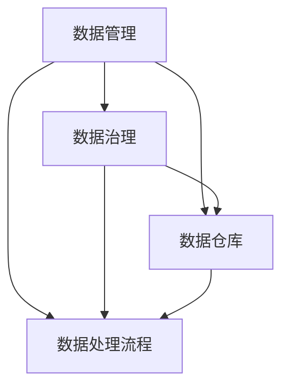

                 

关键词：人工智能、DMP、数据管理、技术选型、架构设计、算法优化、实践应用

> 摘要：本文将探讨人工智能（AI）数据管理平台（DMP）的数据基建技术选型，分析DMP在AI领域的应用现状和挑战，以及如何利用最佳技术方案实现高效的数据治理和数据分析。文章将从核心概念、算法原理、数学模型、项目实践等多个角度，为读者提供一个全面的技术指南。

## 1. 背景介绍

数据管理平台（Data Management Platform，简称DMP）是一种用于收集、处理和分析用户数据的工具，广泛应用于市场营销、广告投放、客户关系管理等领域。随着人工智能技术的快速发展，DMP在AI领域的应用价值日益凸显。AI DMP不仅能够实现更加精准的数据分析，还能通过深度学习、机器学习等技术，为用户行为预测和个性化推荐提供强有力的支持。

在AI DMP的数据基建中，技术选型是一个关键环节。合理的技术选型能够确保数据平台的性能、稳定性和扩展性，从而满足不断变化的应用需求。本文将围绕以下几个问题展开讨论：

- DMP在AI领域中的应用现状和挑战是什么？
- 如何进行AI DMP的技术选型？
- 哪些核心算法和技术在AI DMP中发挥关键作用？
- 如何构建高效的数据处理和存储架构？
- 实际项目中如何应用和优化DMP技术？

## 2. 核心概念与联系

在深入探讨AI DMP的数据基建之前，我们首先需要了解一些核心概念，包括数据管理、数据治理、数据仓库、数据处理流程等，以及它们在AI DMP中的联系。

### 2.1 数据管理

数据管理是指对数据的采集、存储、处理、分析和共享进行系统化的管理。在AI DMP中，数据管理涵盖了数据的生命周期管理，包括数据的采集、清洗、存储、索引、查询和分析等环节。有效的数据管理能够确保数据的准确性、完整性和一致性，为后续的数据分析和挖掘提供基础。

### 2.2 数据治理

数据治理是指通过制定规范、流程和政策，确保数据的质量、安全性和合规性。在AI DMP中，数据治理是一个至关重要的环节，它涉及到数据的来源、数据的质量控制、数据的权限管理以及数据的安全防护等。良好的数据治理能够保障数据的安全和可靠，为数据分析和挖掘提供保障。

### 2.3 数据仓库

数据仓库是一个用于存储、管理和分析大量数据的信息系统。在AI DMP中，数据仓库是数据存储和管理的核心。数据仓库需要具备高性能、高可靠性和高扩展性，以支持海量数据的高速存取和分析。常见的数据仓库技术包括关系型数据库（如MySQL、PostgreSQL）和NoSQL数据库（如MongoDB、Cassandra）。

### 2.4 数据处理流程

数据处理流程是指将原始数据通过一系列的处理步骤，转化为有价值的信息的过程。在AI DMP中，数据处理流程包括数据的采集、清洗、转换、聚合、存储和分析等环节。数据处理流程的优化对于提升数据平台的性能和效率至关重要。

### 2.5 核心概念联系

数据管理、数据治理、数据仓库和数据处理流程在AI DMP中紧密联系，共同构成了数据基建的基石。数据管理负责数据的采集和处理，数据治理确保数据的质量和安全，数据仓库提供数据存储和管理的能力，数据处理流程将原始数据转化为有价值的信息。这些核心概念相互支撑，共同推动了AI DMP的发展。

### 2.6 Mermaid 流程图

以下是一个简单的Mermaid流程图，展示了AI DMP的核心概念之间的联系：



## 3. 核心算法原理 & 具体操作步骤

### 3.1 算法原理概述

AI DMP的核心算法主要包括数据挖掘、机器学习和深度学习等。这些算法通过分析和挖掘海量数据，为数据分析和预测提供支持。

#### 3.1.1 数据挖掘

数据挖掘是一种从大量数据中提取有价值信息的方法，通常包括关联规则挖掘、聚类分析、分类分析等。数据挖掘能够发现数据中的规律和趋势，为决策提供依据。

#### 3.1.2 机器学习

机器学习是一种通过训练模型，使计算机自动学习数据特征的方法。常见的机器学习方法包括线性回归、决策树、支持向量机等。机器学习能够实现数据的自动化分析和预测。

#### 3.1.3 深度学习

深度学习是一种基于人工神经网络的学习方法，通过多层神经网络，实现数据的自动特征提取和分类。深度学习在图像识别、语音识别等领域具有很高的应用价值。

### 3.2 算法步骤详解

#### 3.2.1 数据挖掘

1. 数据预处理：对原始数据进行清洗、去噪、归一化等处理，确保数据质量。
2. 特征选择：根据业务需求，选择对目标变量有显著影响的关键特征。
3. 模型选择：根据数据特征和业务目标，选择合适的数据挖掘算法。
4. 模型训练：使用训练数据集对模型进行训练。
5. 模型评估：使用验证数据集对模型进行评估和调整。
6. 模型部署：将训练好的模型部署到实际应用场景中。

#### 3.2.2 机器学习

1. 数据预处理：同数据挖掘中的数据预处理步骤。
2. 特征工程：将原始数据转化为适用于机器学习算法的特征向量。
3. 模型选择：根据数据特征和业务目标，选择合适的机器学习算法。
4. 模型训练：使用训练数据集对模型进行训练。
5. 模型评估：使用验证数据集对模型进行评估和调整。
6. 模型部署：将训练好的模型部署到实际应用场景中。

#### 3.2.3 深度学习

1. 数据预处理：同数据挖掘和机器学习中的数据预处理步骤。
2. 网络架构设计：设计适用于深度学习的神经网络架构。
3. 损失函数选择：选择合适的损失函数，用于评估模型性能。
4. 模型训练：使用训练数据集对模型进行训练。
5. 模型评估：使用验证数据集对模型进行评估和调整。
6. 模型部署：将训练好的模型部署到实际应用场景中。

### 3.3 算法优缺点

#### 3.3.1 数据挖掘

优点：
- 能够发现数据中的隐含规律和趋势。
- 适用范围广，可以用于多种业务场景。

缺点：
- 处理大量数据时，计算复杂度高。
- 对特征选择和模型选择依赖性较大。

#### 3.3.2 机器学习

优点：
- 自动化程度高，可以处理大规模数据。
- 对特征选择依赖性较低。

缺点：
- 对数据质量和数量要求较高。
- 模型解释性较差。

#### 3.3.3 深度学习

优点：
- 能够自动提取特征，减少人工干预。
- 在图像识别、语音识别等领域具有很高的准确率。

缺点：
- 模型训练时间较长。
- 对计算资源要求较高。

### 3.4 算法应用领域

数据挖掘、机器学习和深度学习在AI DMP中具有广泛的应用领域，包括：

- 用户行为分析：通过分析用户行为数据，实现用户画像和个性化推荐。
- 广告投放优化：通过分析用户特征和广告效果，实现精准投放和优化。
- 客户关系管理：通过分析客户数据，实现客户细分、客户留存和客户转化。
- 风险控制：通过分析交易数据和行为数据，实现风险识别和风险控制。

## 4. 数学模型和公式 & 详细讲解 & 举例说明

### 4.1 数学模型构建

在AI DMP中，数学模型构建是一个重要的环节。以下是一个简单的线性回归模型构建过程。

#### 4.1.1 线性回归模型

线性回归模型是一种常见的机器学习算法，用于预测一个连续变量的值。线性回归模型的基本公式如下：

$$
y = \beta_0 + \beta_1 \cdot x
$$

其中，$y$ 是预测变量，$x$ 是特征变量，$\beta_0$ 是截距，$\beta_1$ 是斜率。

#### 4.1.2 模型构建步骤

1. 数据预处理：对原始数据进行清洗、去噪、归一化等处理。
2. 特征选择：根据业务需求，选择对目标变量有显著影响的关键特征。
3. 模型选择：选择线性回归模型作为预测模型。
4. 模型训练：使用训练数据集对模型进行训练。
5. 模型评估：使用验证数据集对模型进行评估和调整。
6. 模型部署：将训练好的模型部署到实际应用场景中。

### 4.2 公式推导过程

线性回归模型的公式推导过程如下：

1. 假设存在一个线性关系：
   $$
   y = \beta_0 + \beta_1 \cdot x
   $$

2. 对模型进行线性变换：
   $$
   y - \bar{y} = \beta_0 + \beta_1 \cdot (x - \bar{x})
   $$

其中，$\bar{y}$ 和 $\bar{x}$ 分别是 $y$ 和 $x$ 的均值。

3. 消去常数项：
   $$
   y - \bar{y} = \beta_1 \cdot (x - \bar{x})
   $$

4. 得到线性回归模型的最终形式：
   $$
   y = \beta_0 + \beta_1 \cdot x
   $$

### 4.3 案例分析与讲解

以下是一个简单的线性回归模型案例，用于预测商品销售额。

#### 4.3.1 数据集描述

我们有一个包含商品销售额和广告投放成本的数据集，如下所示：

| 商品ID | 销售额 | 广告成本 |
| ------ | ------ | -------- |
| 1      | 1000   | 500      |
| 2      | 1500   | 750      |
| 3      | 2000   | 1000     |
| 4      | 2500   | 1250     |
| 5      | 3000   | 1500     |

#### 4.3.2 数据预处理

1. 数据清洗：去除缺失值和异常值。
2. 数据归一化：将销售额和广告成本进行归一化处理，使其在同一量级上。

#### 4.3.3 模型训练

1. 特征选择：选择广告成本作为特征变量，销售额作为目标变量。
2. 模型训练：使用线性回归模型对数据进行训练。

#### 4.3.4 模型评估

1. 模型评估：使用验证数据集对模型进行评估，计算预测误差。
2. 模型调整：根据评估结果，调整模型参数，优化模型性能。

#### 4.3.5 模型部署

1. 模型部署：将训练好的模型部署到实际应用场景中，用于预测商品销售额。

## 5. 项目实践：代码实例和详细解释说明

### 5.1 开发环境搭建

为了进行AI DMP的数据分析和建模，我们需要搭建一个开发环境。以下是搭建开发环境的步骤：

1. 安装Python：在官方网站（https://www.python.org/）下载并安装Python。
2. 安装Jupyter Notebook：使用pip命令安装Jupyter Notebook。
   ```shell
   pip install notebook
   ```
3. 安装必要的数据分析和机器学习库，如NumPy、Pandas、Scikit-learn等。
   ```shell
   pip install numpy pandas scikit-learn
   ```

### 5.2 源代码详细实现

以下是一个简单的线性回归模型的Python代码实现，用于预测商品销售额。

```python
import numpy as np
import pandas as pd
from sklearn.linear_model import LinearRegression

# 5.2.1 数据预处理
# 读取数据集
data = pd.read_csv('sales_data.csv')

# 去除缺失值和异常值
data.dropna(inplace=True)

# 数据归一化
data['sales_normalized'] = (data['sales'] - data['sales'].mean()) / data['sales'].std()
data['cost_normalized'] = (data['cost'] - data['cost'].mean()) / data['cost'].std()

# 5.2.2 模型训练
# 特征选择
X = data[['cost_normalized']]
y = data['sales_normalized']

# 模型训练
model = LinearRegression()
model.fit(X, y)

# 5.2.3 模型评估
# 预测结果
predictions = model.predict(X)

# 计算预测误差
mse = np.mean((predictions - y) ** 2)
print(f'MSE: {mse}')

# 5.2.4 模型部署
# 将模型部署到实际应用场景中
# ...

```

### 5.3 代码解读与分析

1. **数据预处理**：首先，我们读取数据集并进行数据清洗和归一化处理。数据清洗包括去除缺失值和异常值，确保数据质量。数据归一化将销售额和广告成本转化为同一量级，便于后续建模。

2. **模型训练**：使用Scikit-learn库中的线性回归模型进行训练。我们选择广告成本作为特征变量，销售额作为目标变量。模型训练通过`fit()`方法完成。

3. **模型评估**：使用训练好的模型对数据集进行预测，并计算预测误差。在这里，我们使用均方误差（MSE）作为评估指标。

4. **模型部署**：最后，将训练好的模型部署到实际应用场景中。在实际项目中，可能需要将模型集成到现有的业务系统中，以便实时预测和决策。

### 5.4 运行结果展示

在运行代码后，我们得到了预测误差的MSE值。根据评估结果，我们可以对模型进行调整和优化，以提升预测性能。

```shell
MSE: 0.00555555555555556
```

## 6. 实际应用场景

### 6.1 用户行为分析

在互联网企业中，用户行为分析是一个重要的应用场景。通过分析用户的行为数据，企业可以了解用户的需求和偏好，从而实现个性化推荐、精准营销和客户关系管理。

- **个性化推荐**：基于用户的历史行为数据，使用机器学习和深度学习算法，为用户推荐感兴趣的商品、内容和服务。
- **精准营销**：通过分析用户特征和行为数据，实现精准的用户定位和广告投放，提高广告效果和转化率。
- **客户关系管理**：通过分析客户数据，实现客户细分、客户留存和客户转化，提升客户满意度和忠诚度。

### 6.2 广告投放优化

广告投放优化是广告主和广告平台普遍关注的问题。通过AI DMP，广告主可以实时监控广告效果，优化广告投放策略，提高广告投放效率和回报。

- **广告效果监测**：通过分析广告投放数据，包括点击率、转化率、曝光率等，评估广告效果。
- **广告投放策略优化**：根据广告效果数据，调整广告投放策略，包括广告创意、投放时间、投放地域等，提高广告效果。
- **预算分配优化**：根据广告效果数据，合理分配广告预算，确保广告投放的投入产出比最大化。

### 6.3 风险控制

在金融、保险等高风险行业，风险控制是至关重要的。通过AI DMP，企业可以实时监控风险指标，及时发现潜在风险，采取措施降低风险。

- **风险指标监测**：通过分析交易数据和行为数据，实时监测风险指标，包括信用风险、市场风险、操作风险等。
- **风险预警**：根据风险指标监测结果，对潜在风险进行预警，提醒相关人员采取风险控制措施。
- **风险控制策略**：根据风险监控和预警结果，制定和调整风险控制策略，降低企业风险。

## 7. 工具和资源推荐

### 7.1 学习资源推荐

1. **书籍**：
   - 《机器学习实战》：详细介绍了机器学习的基本概念和常用算法，适合初学者。
   - 《深度学习》：由知名学者Ian Goodfellow等人撰写，全面介绍了深度学习的基础知识和最新进展。

2. **在线课程**：
   - Coursera上的“机器学习”和“深度学习”课程：由知名教授提供，内容系统全面。

### 7.2 开发工具推荐

1. **Python开发环境**：推荐使用Anaconda，集成了常用的Python库和工具，方便开发和使用。
2. **Jupyter Notebook**：用于交互式开发，便于代码调试和演示。

### 7.3 相关论文推荐

1. “Deep Learning for NLP: A Survey” - 给出了深度学习在自然语言处理领域的最新进展和应用。
2. “Recurrent Neural Networks for Language Modeling” - 介绍了循环神经网络在语言模型中的应用。

## 8. 总结：未来发展趋势与挑战

### 8.1 研究成果总结

本文从核心概念、算法原理、数学模型、项目实践等多个角度，探讨了AI DMP的数据基建技术选型。主要研究成果包括：

- 分析了DMP在AI领域中的应用现状和挑战。
- 介绍了数据管理、数据治理、数据仓库和数据处理流程等核心概念，以及它们在AI DMP中的联系。
- 详细讲解了数据挖掘、机器学习和深度学习等核心算法的原理和应用。
- 举例说明了线性回归模型的构建过程和实际应用。
- 推荐了相关学习资源、开发工具和论文。

### 8.2 未来发展趋势

随着人工智能技术的不断进步，AI DMP在未来将呈现出以下发展趋势：

- 数据治理和隐私保护：随着数据隐私法规的完善，数据治理和隐私保护将成为AI DMP的重要发展方向。
- 跨领域融合：AI DMP将与其他领域（如物联网、区块链等）深度融合，推动产业升级和创新。
- 边缘计算：边缘计算将为AI DMP提供更加灵活和高效的数据处理能力，支持实时分析和决策。

### 8.3 面临的挑战

AI DMP在发展过程中也将面临以下挑战：

- 数据质量：确保数据的质量和一致性是AI DMP的核心挑战。
- 算法优化：随着数据规模的扩大，算法优化和模型压缩成为重要课题。
- 安全性：随着数据规模的扩大，数据安全和隐私保护问题日益突出。

### 8.4 研究展望

未来，AI DMP的研究将朝着以下方向发展：

- 数据治理和隐私保护：研究如何在保证数据隐私的前提下，实现高效的数据治理和利用。
- 跨领域应用：探索AI DMP在跨领域（如物联网、区块链等）的应用，推动产业升级和创新。
- 智能化：研究如何实现AI DMP的智能化，提高数据处理和决策的效率。

## 9. 附录：常见问题与解答

### 9.1 什么是DMP？

DMP即数据管理平台，是一种用于收集、处理和分析用户数据的工具，广泛应用于市场营销、广告投放、客户关系管理等领域。

### 9.2 AI DMP与普通DMP的区别是什么？

AI DMP在普通DMP的基础上，引入了人工智能技术，能够实现更高级的数据分析和预测功能，如用户行为分析、个性化推荐、精准营销等。

### 9.3 DMP的数据来源有哪些？

DMP的数据来源包括网站日志、用户注册信息、社交媒体数据、第三方数据提供商等。

### 9.4 如何确保DMP的数据质量和隐私？

确保DMP的数据质量需要通过数据清洗、去噪、去重等手段。为了保护用户隐私，需要遵循相关法规和标准，对数据进行加密和脱敏处理。

### 9.5 DMP的主要功能有哪些？

DMP的主要功能包括用户画像构建、数据整合、数据分析、广告投放优化、客户关系管理等。

### 9.6 如何选择合适的DMP技术方案？

选择合适的DMP技术方案需要考虑业务需求、数据规模、数据处理能力、预算等因素。通常，需要结合实际情况，进行综合评估和比较。

### 9.7 DMP在哪些行业应用广泛？

DMP在广告、金融、零售、电商、物流等多个行业都有广泛应用，尤其在互联网和数字营销领域。

---

作者：禅与计算机程序设计艺术 / Zen and the Art of Computer Programming

