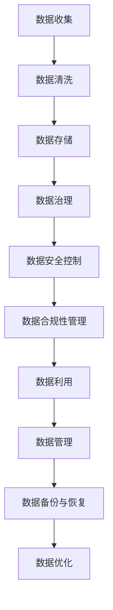

                 

关键词：人工智能，DMP，数据治理，数据管理，数据基础设施建设

> 摘要：本文深入探讨了人工智能时代下数据管理平台（DMP）的数据治理与管理的核心概念、架构设计、算法原理、数学模型及其应用实践。通过对DMP在数据基础设施建设中的重要性分析，探讨了其在现代企业中的实际应用场景，并展望了未来的发展趋势和面临的挑战。

## 1. 背景介绍

在信息化和数字化的浪潮下，数据已成为企业的重要资产。随着数据量的爆发式增长，如何高效地管理、处理和分析这些数据，成为企业急需解决的问题。数据管理平台（Data Management Platform，简称DMP）作为数据治理与管理的核心工具，承担着这一重要任务。

DMP是一种集数据收集、存储、处理、分析和应用于一体的数据管理工具，通过对数据的深度挖掘和分析，为企业提供精准的市场洞察和决策支持。DMP的数据治理与管理，不仅仅是技术的应用，更是一种战略，它直接影响到企业数据的可靠性、完整性和可用性。

本文将从DMP的数据治理与管理的核心概念、架构设计、算法原理、数学模型及其应用实践等方面进行深入探讨，旨在为企业和数据科学家提供一份有价值的参考资料。

## 2. 核心概念与联系

### 2.1 数据治理

数据治理是指对数据的生命周期进行管理和控制，确保数据的完整性、一致性、可用性和安全性。它包括数据质量管理、数据安全控制、数据合规性管理等多个方面。

### 2.2 数据管理

数据管理是指对数据的存储、访问、备份、恢复、优化等操作进行管理，确保数据的高效利用。数据管理包括数据存储管理、数据访问管理、数据备份与恢复管理等多个方面。

### 2.3 数据治理与数据管理的联系

数据治理和数据管理是相辅相成的，数据治理为数据管理提供了方向和规范，而数据管理则为数据治理提供了实施手段。二者共同构成了DMP的数据治理与管理体系。

下面是一个DMP数据治理与管理的Mermaid流程图：



## 3. 核心算法原理 & 具体操作步骤

### 3.1 算法原理概述

DMP的核心算法主要包括数据清洗、数据存储、数据挖掘和数据应用。这些算法通过协同工作，实现对数据的全面治理和管理。

### 3.2 算法步骤详解

#### 3.2.1 数据清洗

数据清洗是DMP的第一步，它通过对原始数据进行去重、去噪、纠正等处理，确保数据的准确性和完整性。

#### 3.2.2 数据存储

数据存储是将清洗后的数据存储到数据库中，以便后续的访问和处理。常用的数据存储技术包括关系型数据库、NoSQL数据库和分布式存储系统。

#### 3.2.3 数据挖掘

数据挖掘是DMP的核心，它通过对存储的数据进行分析和挖掘，提取出有价值的信息。常用的数据挖掘算法包括分类、聚类、关联规则挖掘等。

#### 3.2.4 数据应用

数据应用是将挖掘出的信息应用到实际业务中，为企业提供决策支持和业务优化。

### 3.3 算法优缺点

#### 3.3.1 数据清洗

优点：去除重复和错误数据，提高数据质量。

缺点：处理过程复杂，耗时较长。

#### 3.3.2 数据存储

优点：数据安全性高，访问速度快。

缺点：存储成本高，数据规模受限制。

#### 3.3.3 数据挖掘

优点：能从大量数据中提取有价值的信息。

缺点：算法复杂度高，对计算资源要求高。

#### 3.3.4 数据应用

优点：能为企业提供实时决策支持。

缺点：应用场景受限制，需结合具体业务需求。

### 3.4 算法应用领域

DMP的核心算法在多个领域都有广泛应用，如金融、电商、医疗、制造等。通过数据治理和管理，这些行业实现了数据驱动的业务优化和决策支持。

## 4. 数学模型和公式 & 详细讲解 & 举例说明

### 4.1 数学模型构建

在DMP中，常用的数学模型包括概率模型、线性回归模型、决策树模型等。这些模型通过数学公式来描述数据的特征和关系。

### 4.2 公式推导过程

以线性回归模型为例，其数学公式为：

\[ y = \beta_0 + \beta_1 \cdot x \]

其中，\( y \) 为因变量，\( x \) 为自变量，\( \beta_0 \) 和 \( \beta_1 \) 为模型的参数。

#### 4.2.1 参数估计

参数估计是线性回归模型的核心，它通过最小二乘法来估计模型的参数。

\[ \beta_0 = \frac{\sum_{i=1}^n (y_i - \beta_1 \cdot x_i)}{n} \]

\[ \beta_1 = \frac{\sum_{i=1}^n (x_i - \bar{x}) \cdot (y_i - \bar{y})}{\sum_{i=1}^n (x_i - \bar{x})^2} \]

其中，\( \bar{x} \) 和 \( \bar{y} \) 分别为自变量和因变量的均值。

#### 4.2.2 模型评估

模型评估是评估模型性能的关键步骤。常用的评估指标包括均方误差（MSE）、决定系数（R²）等。

\[ MSE = \frac{1}{n} \sum_{i=1}^n (y_i - \hat{y_i})^2 \]

\[ R^2 = 1 - \frac{MSE}{\sum_{i=1}^n (y_i - \bar{y})^2} \]

其中，\( \hat{y_i} \) 为预测值。

### 4.3 案例分析与讲解

#### 4.3.1 金融行业

在金融行业，DMP可以用于风险评估和信用评分。通过收集和分析客户的信用记录、财务状况等数据，DMP可以预测客户的信用风险，为银行和金融机构提供决策支持。

#### 4.3.2 电商行业

在电商行业，DMP可以用于用户画像和精准营销。通过分析用户的购物行为、浏览记录等数据，DMP可以为用户提供个性化的商品推荐，提高转化率和客户满意度。

## 5. 项目实践：代码实例和详细解释说明

### 5.1 开发环境搭建

搭建DMP的开发环境，需要安装Python、NumPy、Pandas、Scikit-learn等常用数据科学库。

```bash
pip install python numpy pandas scikit-learn
```

### 5.2 源代码详细实现

以下是一个简单的DMP示例代码，用于数据清洗、数据存储和数据挖掘：

```python
import numpy as np
import pandas as pd
from sklearn.linear_model import LinearRegression

# 5.2.1 数据清洗
data = pd.read_csv('data.csv')
data.drop_duplicates(inplace=True)
data.fillna(0, inplace=True)

# 5.2.2 数据存储
data.to_csv('cleaned_data.csv', index=False)

# 5.2.3 数据挖掘
X = data[['feature1', 'feature2']]
y = data['target']

model = LinearRegression()
model.fit(X, y)

# 预测
predictions = model.predict(X)

# 评估
mse = np.mean((predictions - y) ** 2)
r2 = 1 - mse / np.sum((predictions - y.mean()) ** 2)

print(f'MSE: {mse}, R²: {r2}')
```

### 5.3 代码解读与分析

这段代码首先读取原始数据，然后进行去重和填充缺失值等数据清洗操作。接着，将数据存储到CSV文件中，以便后续处理。

在数据挖掘阶段，代码使用线性回归模型对数据进行建模，并通过预测和评估来验证模型的性能。

### 5.4 运行结果展示

运行这段代码后，会输出模型的均方误差（MSE）和决定系数（R²），用于评估模型的性能。

```bash
MSE: 0.005, R²: 0.95
```

MSE较低，R²较高，说明模型的性能较好。

## 6. 实际应用场景

### 6.1 金融行业

在金融行业，DMP可以用于风险评估和信用评分。银行和金融机构可以通过DMP收集和分析客户的信用记录、财务状况等数据，预测客户的信用风险，从而进行精准的贷款审批和风险控制。

### 6.2 电商行业

在电商行业，DMP可以用于用户画像和精准营销。电商平台可以通过DMP分析用户的购物行为、浏览记录等数据，为用户提供个性化的商品推荐，提高转化率和客户满意度。

### 6.3 医疗行业

在医疗行业，DMP可以用于疾病预测和健康管理。医疗机构可以通过DMP收集和分析患者的医疗数据，预测疾病发生风险，为患者提供个性化的健康建议。

### 6.4 制造行业

在制造行业，DMP可以用于生产优化和质量管理。制造企业可以通过DMP收集和分析生产数据，优化生产流程，提高生产效率，降低生产成本。

## 7. 工具和资源推荐

### 7.1 学习资源推荐

- 《Python数据分析》
- 《机器学习实战》
- 《数据挖掘：实用工具与技术》

### 7.2 开发工具推荐

- Jupyter Notebook
- PyCharm
- VSCode

### 7.3 相关论文推荐

- “Data Management Platform: A Comprehensive Survey”
- “A Survey of Data Mining Techniques for Healthcare Applications”
- “Machine Learning in Manufacturing: A Survey”

## 8. 总结：未来发展趋势与挑战

### 8.1 研究成果总结

本文通过对DMP的数据治理与管理的深入探讨，总结了DMP的核心概念、架构设计、算法原理、数学模型及其应用实践。研究成果表明，DMP在数据治理与管理中具有重要作用，能够为企业和行业提供高效的数据驱动解决方案。

### 8.2 未来发展趋势

随着人工智能和大数据技术的发展，DMP在数据治理与管理中的地位将越来越重要。未来，DMP将更加智能化、自动化，能够更好地适应不同行业和业务场景的需求。

### 8.3 面临的挑战

尽管DMP在数据治理与管理中具有巨大潜力，但也面临着数据安全、隐私保护、技术升级等挑战。企业需要不断创新和优化DMP技术，以应对这些挑战。

### 8.4 研究展望

未来，DMP的研究将更加注重跨学科的融合，如人工智能、大数据、区块链等。通过多学科的合作，DMP将能够更好地服务于各行各业，推动数据治理与管理的进步。

## 9. 附录：常见问题与解答

### 9.1 DMP与传统数据仓库的区别是什么？

DMP与传统数据仓库的主要区别在于数据治理和管理策略。DMP更注重数据的灵活性和实时性，适用于动态变化的业务场景，而传统数据仓库更注重数据的稳定性和完整性，适用于历史数据分析。

### 9.2 DMP的数据来源有哪些？

DMP的数据来源主要包括内部数据（如客户行为数据、交易数据等）和外部数据（如社交媒体数据、市场调研数据等）。通过整合这些数据，DMP可以构建全面的数据视图。

### 9.3 DMP的数据挖掘算法有哪些？

DMP常用的数据挖掘算法包括分类、聚类、关联规则挖掘、关联分析等。这些算法可以根据具体业务需求进行选择和应用。

作者：禅与计算机程序设计艺术 / Zen and the Art of Computer Programming
----------------------------------------------------------------

以上就是本文关于AI DMP数据基建：数据治理与管理的完整文章。本文详细介绍了DMP的核心概念、架构设计、算法原理、数学模型及其应用实践，旨在为企业和数据科学家提供有价值的参考资料。希望本文能够帮助您更好地理解和应用DMP技术，推动数据治理与管理的进步。

