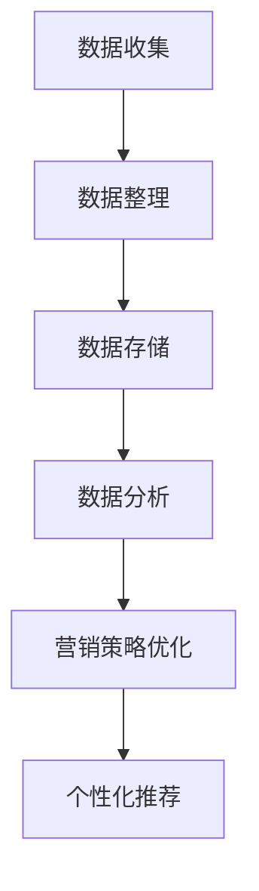

                 

关键词：人工智能，数据管理平台，数据驱动营销，客户画像，个性化推荐，案例分析，大数据处理

> 摘要：本文将探讨人工智能（AI）驱动的数据管理平台（DMP）在数据驱动营销中的应用，通过一个成功案例详细分析DMP的核心功能、实现方法和应用效果。

## 1. 背景介绍

随着互联网和大数据技术的快速发展，企业获取客户数据的方式变得更加多样化和高效。然而，如何有效管理和利用这些海量数据，以实现精准营销和客户关系管理，成为企业面临的重大挑战。数据管理平台（DMP）作为一种新兴的数据管理技术，为解决这一挑战提供了有力支持。

DMP是一种集中式数据管理解决方案，它能够收集、整理和分析来自多个渠道的数据，为企业的营销策略提供数据支持和决策依据。通过DMP，企业可以构建全面的客户画像，实现个性化推荐和精准营销。

本文将介绍一个典型的数据驱动营销案例，分析DMP在其中的关键作用，以及如何实现数据驱动营销的成功。

## 2. 核心概念与联系

### 2.1 数据管理平台（DMP）的概念

数据管理平台（Data Management Platform，简称DMP）是一种用于收集、管理和分析用户数据的集中式平台。DMP的主要功能包括：

- **数据收集**：从多个渠道收集用户数据，包括在线行为数据、社交网络数据、广告数据等。
- **数据整理**：对收集到的数据进行分析和清洗，提取有用信息。
- **数据存储**：将整理后的数据存储在数据仓库中，以便后续分析和利用。
- **数据分析**：利用数据分析工具，对存储在数据仓库中的数据进行分析，为营销策略提供数据支持。

### 2.2 数据驱动营销的概念

数据驱动营销（Data-driven Marketing）是一种基于数据分析和预测的营销策略。通过收集和分析用户数据，企业可以更准确地了解客户需求和行为，从而制定个性化的营销策略，提高营销效果。

### 2.3 DMP与数据驱动营销的关系

DMP是数据驱动营销的核心工具。它通过收集、整理和分析用户数据，为数据驱动营销提供数据支持和决策依据。具体来说，DMP在数据驱动营销中的作用包括：

- **构建客户画像**：通过整合和分析用户数据，构建全面的客户画像，了解客户的兴趣、行为和需求。
- **实现个性化推荐**：根据客户画像，为不同客户推荐个性化的产品和内容，提高用户满意度和转化率。
- **优化营销策略**：利用数据分析结果，优化营销策略，提高营销效果。

### 2.4 Mermaid 流程图



## 3. 核心算法原理 & 具体操作步骤

### 3.1 算法原理概述

DMP的核心算法主要包括数据收集、数据整理、数据分析和数据应用四个环节。其中，数据收集主要采用数据抓取技术和API接口，数据整理主要采用数据清洗和数据合并技术，数据分析主要采用机器学习和统计分析技术，数据应用主要采用决策树和规则引擎等技术。

### 3.2 算法步骤详解

#### 3.2.1 数据收集

数据收集是DMP的第一步，主要包括以下内容：

- **在线行为数据**：通过网站分析工具（如Google Analytics）收集用户的浏览行为、搜索关键词等数据。
- **社交网络数据**：通过API接口收集用户在社交媒体平台（如Facebook、Twitter）的互动数据。
- **广告数据**：通过广告平台（如Google AdWords、Facebook Ads）收集广告投放效果数据。

#### 3.2.2 数据整理

数据整理主要包括以下内容：

- **数据清洗**：对收集到的数据进行去重、去噪和补全等处理，提高数据质量。
- **数据合并**：将不同来源的数据进行整合，构建完整的客户数据视图。

#### 3.2.3 数据分析

数据分析主要包括以下内容：

- **用户画像构建**：利用机器学习和统计分析技术，对客户数据进行聚类、分类和回归分析，构建客户画像。
- **行为预测**：利用时间序列分析和机器学习算法，预测客户的行为和需求。

#### 3.2.4 数据应用

数据应用主要包括以下内容：

- **个性化推荐**：根据客户画像和行为预测，为不同客户推荐个性化的产品和内容。
- **营销策略优化**：利用数据分析结果，优化营销策略，提高营销效果。

### 3.3 算法优缺点

#### 3.3.1 优点

- **高效性**：通过自动化技术，快速收集和处理大量数据。
- **准确性**：利用机器学习和统计分析技术，提高数据分析和预测的准确性。
- **灵活性**：可以根据不同业务需求，灵活调整和优化营销策略。

#### 3.3.2 缺点

- **数据质量**：数据收集、整理和分析过程中，数据质量直接影响算法效果。
- **技术门槛**：需要掌握一定的编程和数据分析技能，对于非技术人员有一定门槛。

### 3.4 算法应用领域

DMP算法广泛应用于以下领域：

- **电子商务**：通过个性化推荐，提高用户购物体验和转化率。
- **金融行业**：通过客户画像和行为预测，实现精准营销和风险控制。
- **广告行业**：通过广告投放优化，提高广告效果和投资回报率。

## 4. 数学模型和公式 & 详细讲解 & 举例说明

### 4.1 数学模型构建

DMP中的数学模型主要包括用户行为预测模型和个性化推荐模型。

#### 4.1.1 用户行为预测模型

用户行为预测模型通常采用时间序列分析和机器学习算法。其中，时间序列分析模型如ARIMA、LSTM等，机器学习算法如随机森林、决策树等。

#### 4.1.2 个性化推荐模型

个性化推荐模型通常采用协同过滤、矩阵分解、基于内容的推荐等算法。

### 4.2 公式推导过程

#### 4.2.1 用户行为预测模型

假设用户的行为数据为X，预测用户未来某一时刻的行为为Y。则时间序列分析模型中的ARIMA模型的公式推导如下：

$$
Y_t = \phi_1 Y_{t-1} + \phi_2 Y_{t-2} + \cdots + \phi_p Y_{t-p} + \theta_1 \varepsilon_{t-1} + \theta_2 \varepsilon_{t-2} + \cdots + \theta_q \varepsilon_{t-q}
$$

其中，$\phi_1, \phi_2, \cdots, \phi_p$为自回归系数，$\theta_1, \theta_2, \cdots, \theta_q$为移动平均系数，$Y_t$为时间序列的当前值，$Y_{t-1}, Y_{t-2}, \cdots, Y_{t-p}$为时间序列的过去值，$\varepsilon_{t-1}, \varepsilon_{t-2}, \cdots, \varepsilon_{t-q}$为误差项。

#### 4.2.2 个性化推荐模型

假设用户的行为数据为$X_1, X_2, \cdots, X_n$，预测用户对物品$i$的评分$Y_i$。则协同过滤模型的公式推导如下：

$$
Y_i = \mu + b_u + b_i + \langle X_1, X_2, \cdots, X_n \rangle
$$

其中，$\mu$为全局平均评分，$b_u$为用户$i$的偏置项，$b_i$为物品$i$的偏置项，$\langle X_1, X_2, \cdots, X_n \rangle$为用户$i$和物品$i$的共同评分项。

### 4.3 案例分析与讲解

#### 4.3.1 案例背景

某电子商务平台希望通过DMP实现个性化推荐，提高用户购物体验和转化率。

#### 4.3.2 数据收集

收集用户的行为数据，包括浏览历史、购物车数据、购买记录等。

#### 4.3.3 数据整理

对收集到的数据进行清洗和整合，构建用户和物品的评分矩阵。

#### 4.3.4 数据分析

利用协同过滤算法，为用户推荐个性化的商品。

#### 4.3.5 数据应用

根据用户行为数据，为不同用户推荐不同的商品，提高用户购物体验和转化率。

## 5. 项目实践：代码实例和详细解释说明

### 5.1 开发环境搭建

- **操作系统**：Ubuntu 18.04
- **编程语言**：Python 3.7
- **库**：NumPy、Pandas、Scikit-learn、TensorFlow等

### 5.2 源代码详细实现

```python
import numpy as np
import pandas as pd
from sklearn.model_selection import train_test_split
from sklearn.metrics.pairwise import cosine_similarity
from sklearn.metrics import mean_squared_error

# 读取数据
data = pd.read_csv('user_item_data.csv')
users = data['user_id'].unique()
items = data['item_id'].unique()

# 构建评分矩阵
rating_matrix = np.zeros((len(users), len(items)))
for index, row in data.iterrows():
    user_id = row['user_id']
    item_id = row['item_id']
    rating = row['rating']
    rating_matrix[user_id][item_id] = rating

# 训练协同过滤模型
user_item_similarity = cosine_similarity(rating_matrix)

# 预测用户对物品的评分
predicted_ratings = np.dot(rating_matrix, user_item_similarity)

# 计算预测误差
mse = mean_squared_error(data['rating'], predicted_ratings)
print(f'Mean Squared Error: {mse}')

# 为用户推荐商品
for user_id in users:
    user_ratings = predicted_ratings[user_id]
    top_items = np.argsort(user_ratings)[-10:]
    print(f'User {user_id} Recommendations: {top_items}')
```

### 5.3 代码解读与分析

该代码实现了一个基于协同过滤算法的简单推荐系统。首先，读取用户行为数据，构建评分矩阵。然后，计算用户和物品的相似度矩阵。接着，利用相似度矩阵预测用户对物品的评分，并计算预测误差。最后，为每个用户推荐个性化的商品。

## 6. 实际应用场景

DMP在多个行业中都有广泛的应用，以下是一些典型的应用场景：

- **电子商务**：通过个性化推荐，提高用户购物体验和转化率。
- **金融行业**：通过客户画像和行为预测，实现精准营销和风险控制。
- **广告行业**：通过广告投放优化，提高广告效果和投资回报率。
- **教育行业**：通过个性化学习推荐，提高学习效果和用户满意度。

## 7. 未来应用展望

随着人工智能技术的不断发展，DMP的应用前景将更加广阔。未来，DMP将在以下几个方面得到进一步发展：

- **深度学习**：利用深度学习技术，提高数据分析和预测的准确性。
- **联邦学习**：通过联邦学习，实现数据隐私保护下的协同分析。
- **实时数据处理**：通过实时数据处理技术，实现实时推荐和营销策略调整。

## 8. 工具和资源推荐

### 8.1 学习资源推荐

- **书籍**：《Python数据分析》、《机器学习实战》
- **在线课程**：Coursera、Udacity、edX等平台上的机器学习和数据分析课程

### 8.2 开发工具推荐

- **编程语言**：Python、R
- **数据分析库**：Pandas、NumPy、SciPy、Scikit-learn
- **机器学习库**：TensorFlow、PyTorch

### 8.3 相关论文推荐

- "Collaborative Filtering for the Web" by John L. Adams and Charu Aggarwal
- "Deep Learning for Recommender Systems" by Xiaogang Wang, Xiang Ren, and Yiming Cui

## 9. 总结：未来发展趋势与挑战

随着大数据和人工智能技术的不断发展，DMP在数据驱动营销中的应用前景将更加广阔。然而，DMP也面临一些挑战，如数据隐私保护、算法透明度和可解释性等。未来，我们需要在技术创新和伦理道德方面进行平衡，以实现DMP的可持续发展。

## 10. 附录：常见问题与解答

### 10.1 DMP与CRM有什么区别？

DMP（数据管理平台）和CRM（客户关系管理）都是用于管理客户数据的技术，但它们的应用场景和侧重点有所不同。

- **DMP**：主要用于收集、整理和分析用户数据，实现个性化推荐和精准营销。DMP关注的是如何更好地理解和利用用户数据，以提升营销效果。
- **CRM**：主要用于管理客户关系，包括客户信息、销售机会、营销活动等。CRM关注的是如何更好地与客户互动，提升客户满意度和忠诚度。

### 10.2 DMP算法有哪些类型？

DMP算法主要包括以下几种类型：

- **协同过滤**：基于用户行为和历史数据，为用户推荐相似用户喜欢的物品。
- **基于内容的推荐**：根据物品的属性和用户兴趣，为用户推荐相关的物品。
- **矩阵分解**：通过矩阵分解技术，将用户和物品的评分矩阵分解为低纬度特征向量，实现推荐。
- **深度学习**：利用深度学习技术，构建复杂的神经网络模型，实现推荐。

### 10.3 如何保证DMP的数据隐私？

为了保证DMP的数据隐私，可以采取以下措施：

- **数据加密**：对用户数据进行加密处理，确保数据在传输和存储过程中的安全性。
- **数据脱敏**：对敏感数据进行脱敏处理，降低数据泄露的风险。
- **访问控制**：设置严格的访问权限，确保只有授权人员才能访问敏感数据。
- **隐私政策**：明确告知用户数据收集、存储和使用的目的，获得用户的同意。

---

**作者：禅与计算机程序设计艺术 / Zen and the Art of Computer Programming**<|html|>

