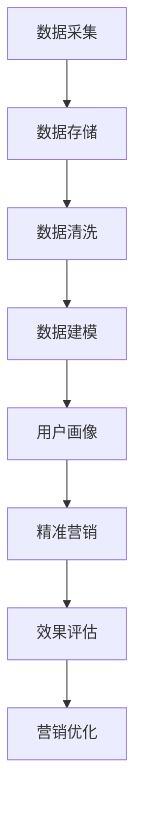

                 

关键词：数据管理平台（DMP），人工智能（AI），数据驱动营销，用户画像，个性化推荐，营销策略优化，案例分析

摘要：本文将探讨AI DMP（数据管理平台）在数据驱动营销中的应用与实践。通过分析国内外知名企业的成功案例，本文将深入解析DMP的核心功能、实施流程及效果评估，为营销人员提供有价值的参考和启示。

## 1. 背景介绍

在数字营销时代，数据已经成为企业最为重要的资产之一。然而，如何有效地管理和利用这些数据，实现精准营销和用户价值的最大化，成为了企业面临的一大挑战。数据管理平台（DMP）作为一种新兴的数据管理工具，通过整合和分析多种数据源，构建用户画像，为营销人员提供了丰富的数据洞察和决策支持。

随着人工智能技术的快速发展，DMP逐渐具备了智能化的特点。AI DMP不仅能够自动处理大规模数据，还能通过机器学习和深度学习算法，挖掘数据中的潜在价值，实现数据的自动化分析和决策。这使得DMP在数据驱动营销中的应用范围进一步扩大，成为企业提升营销效果的重要工具。

本文将围绕AI DMP在数据驱动营销中的应用，分析国内外知名企业的成功案例，探讨DMP的核心功能、实施流程和效果评估，以及未来发展趋势和挑战。

## 2. 核心概念与联系

### 2.1 数据管理平台（DMP）

数据管理平台（DMP）是一种用于收集、存储、管理和分析用户数据的工具。DMP的核心功能包括以下几个方面：

1. **数据采集**：通过网站、APP、广告投放等多种渠道收集用户数据。
2. **数据存储**：将采集到的用户数据存储在分布式数据库中，保证数据的可靠性和安全性。
3. **数据清洗**：对采集到的数据进行清洗、去重和格式转换，提高数据质量。
4. **数据建模**：利用机器学习和深度学习算法，对用户数据进行分析和建模，构建用户画像。
5. **数据应用**：基于用户画像，为营销人员提供数据洞察和决策支持，实现精准营销。

### 2.2 人工智能（AI）

人工智能（AI）是指通过计算机模拟人类智能的一种技术。AI的核心技术包括机器学习、深度学习、自然语言处理、计算机视觉等。在DMP中，AI的应用主要体现在以下几个方面：

1. **数据挖掘**：利用机器学习和深度学习算法，从大规模数据中挖掘潜在价值。
2. **用户画像**：通过分析用户行为数据，构建个性化用户画像。
3. **自动化决策**：利用AI算法，实现数据的自动化分析和决策，提高营销效率。
4. **智能推荐**：基于用户画像和兴趣标签，为用户推荐个性化的内容和服务。

### 2.3 数据驱动营销

数据驱动营销是指通过数据分析和挖掘，实现营销策略的制定和优化。数据驱动营销的核心包括以下几个方面：

1. **用户洞察**：通过对用户数据的分析，了解用户需求和行为习惯。
2. **精准营销**：基于用户画像，实现精准的用户定位和个性化营销。
3. **效果评估**：通过数据分析和评估，衡量营销活动的效果，为后续营销策略提供依据。

### 2.4 Mermaid 流程图

下面是一个简单的Mermaid流程图，展示了DMP在数据驱动营销中的应用流程：



## 3. 核心算法原理 & 具体操作步骤

### 3.1 算法原理概述

AI DMP的核心算法包括用户画像构建、推荐系统和效果评估模型。下面分别介绍这些算法的基本原理。

#### 用户画像构建

用户画像构建是AI DMP的基础，它通过分析用户的行为数据、兴趣标签、地理位置等特征，为每个用户创建一个多维度的画像。用户画像的构建通常采用以下方法：

1. **基于行为的聚类**：通过分析用户的行为轨迹，将具有相似行为的用户划分为同一群体。
2. **基于标签的关联**：通过分析用户的行为数据和标签数据，建立用户之间的关联关系。
3. **基于矩阵分解的方法**：利用矩阵分解技术，从用户行为数据中挖掘潜在的兴趣特征。

#### 推荐系统

推荐系统是AI DMP的核心应用之一，它通过分析用户画像和兴趣标签，为用户推荐个性化的内容和服务。推荐系统通常采用以下方法：

1. **基于协同过滤的方法**：通过分析用户之间的相似度，为用户推荐相似的其他用户喜欢的内容。
2. **基于内容的推荐**：通过分析用户的历史行为和兴趣标签，为用户推荐与之相关的内容。
3. **基于深度学习的方法**：利用深度学习模型，从用户行为数据中挖掘潜在的兴趣特征，实现个性化推荐。

#### 效果评估模型

效果评估模型用于衡量营销活动的效果，为后续营销策略提供依据。效果评估模型通常采用以下方法：

1. **基于转化率的评估**：通过分析用户在营销活动中的转化率，评估营销活动的效果。
2. **基于ROI的评估**：通过分析营销投入和收益的比率，评估营销活动的经济效益。
3. **基于用户满意度的评估**：通过调查用户对营销活动的满意度，评估营销活动的用户体验。

### 3.2 算法步骤详解

下面是一个简单的算法步骤，展示了AI DMP在数据驱动营销中的具体操作过程：

1. **数据采集**：通过网站、APP、广告投放等多种渠道收集用户数据。
2. **数据清洗**：对采集到的数据进行清洗、去重和格式转换，提高数据质量。
3. **用户画像构建**：利用机器学习和深度学习算法，分析用户行为数据，构建用户画像。
4. **推荐系统**：基于用户画像和兴趣标签，为用户推荐个性化的内容和服务。
5. **效果评估**：通过转化率、ROI、用户满意度等指标，评估营销活动的效果。
6. **营销优化**：根据效果评估结果，调整营销策略，实现营销效果的持续提升。

### 3.3 算法优缺点

#### 用户画像构建

**优点**：

1. 提高用户理解的深度：用户画像能够从多个维度分析用户特征，帮助营销人员更好地理解用户需求和行为。
2. 提高营销效率：基于用户画像的精准营销，能够提高营销活动的转化率和ROI。

**缺点**：

1. 需要大量数据支持：构建高质量的用户画像需要大量的用户行为数据，对于数据量较小的企业可能存在困难。
2. 数据隐私问题：用户画像涉及到用户的敏感信息，如何保护用户隐私是一个重要问题。

#### 推荐系统

**优点**：

1. 提高用户满意度：基于个性化推荐的系统，能够为用户推荐他们感兴趣的内容，提高用户体验。
2. 提高营销效果：个性化推荐能够提高用户在营销活动中的转化率，提升营销ROI。

**缺点**：

1. 过度推荐问题：推荐系统可能过度推荐用户已经熟悉的内容，导致用户疲劳和反感。
2. 推荐结果质量不稳定：推荐系统的效果受到数据质量、算法参数等因素的影响，可能导致推荐结果不稳定。

#### 效果评估模型

**优点**：

1. 提高营销策略的科学性：通过效果评估模型，营销人员可以更加客观地评估营销活动的效果，为后续策略调整提供依据。
2. 提高营销效率：基于效果评估的结果，营销人员可以及时调整营销策略，实现营销效果的持续提升。

**缺点**：

1. 数据依赖性：效果评估模型需要大量的数据支持，对于数据量较小或数据质量较差的企业可能存在困难。
2. 延迟性问题：效果评估通常需要一定时间，无法实时反馈营销活动的效果，可能影响营销决策的及时性。

### 3.4 算法应用领域

AI DMP在数据驱动营销中的应用领域非常广泛，主要包括以下几个方面：

1. **电子商务**：通过用户画像和个性化推荐，提高用户购买转化率和销售额。
2. **金融行业**：通过用户画像和风险评估，实现精准营销和风险控制。
3. **在线教育**：通过用户画像和智能推荐，提高课程推荐的准确性和用户满意度。
4. **健康医疗**：通过用户画像和健康数据分析，实现个性化健康管理和疾病预防。
5. **互联网广告**：通过用户画像和广告投放策略，提高广告的点击率和投放效果。

## 4. 数学模型和公式 & 详细讲解 & 举例说明

### 4.1 数学模型构建

在AI DMP中，常用的数学模型包括用户画像构建模型、推荐系统模型和效果评估模型。下面分别介绍这些模型的构建方法。

#### 用户画像构建模型

用户画像构建模型通常采用以下方法：

1. **基于行为的聚类**：使用K-means算法对用户行为数据进行聚类，将具有相似行为的用户划分为同一群体。

   $$\min_{C}\sum_{i=1}^{n}\sum_{j=1}^{k}||x_{ij}-\mu_{j}||^2$$

   其中，$x_{ij}$表示用户$i$在第$j$个特征上的取值，$\mu_{j}$表示第$j$个聚类中心。

2. **基于标签的关联**：使用余弦相似度计算用户之间的相似度，建立用户之间的关联关系。

   $$\cos\theta_{ij}=\frac{\sum_{k=1}^{m}t_{ik}t_{jk}}{\sqrt{\sum_{k=1}^{m}t_{ik}^2}\sqrt{\sum_{k=1}^{m}t_{jk}^2}}$$

   其中，$t_{ik}$表示用户$i$在第$k$个标签上的取值。

3. **基于矩阵分解的方法**：使用矩阵分解技术，将用户行为数据表示为用户特征和商品特征的线性组合。

   $$R_{ij}=U_i^T V_j$$

   其中，$R_{ij}$表示用户$i$对商品$j$的评分，$U_i$和$V_j$分别表示用户$i$和商品$j$的特征向量。

#### 推荐系统模型

推荐系统模型通常采用以下方法：

1. **基于协同过滤的方法**：使用用户之间的相似度来推荐商品。

   $$r_{ij}=u_j+b_i+\rho_{ij}+e_{ij}$$

   其中，$r_{ij}$表示用户$i$对商品$j$的预测评分，$u_j$和$b_i$分别表示用户$j$的平均评分和商品$i$的平均评分，$\rho_{ij}$表示用户$i$和$j$的相似度，$e_{ij}$表示误差项。

2. **基于内容的推荐**：使用商品之间的相似度来推荐商品。

   $$r_{ij}=w_j+b_i+\rho_{ij}+e_{ij}$$

   其中，$w_j$表示商品$j$的权重，其他参数与基于协同过滤的方法相同。

3. **基于深度学习的方法**：使用深度神经网络来学习用户和商品的特征。

   $$r_{ij}=\sigma(W_1 \cdot [U_i; V_j] + b_1)$$

   其中，$\sigma$表示激活函数，$W_1$和$b_1$分别为深度神经网络的权重和偏置。

#### 效果评估模型

效果评估模型通常采用以下方法：

1. **基于转化率的评估**：使用回归模型来预测用户在营销活动中的转化率。

   $$\hat{y_i}=\beta_0+\beta_1x_{i1}+\beta_2x_{i2}+\cdots+\beta_nx_{in}+e_i$$

   其中，$y_i$表示用户$i$的转化率，$x_{ij}$表示用户$i$在第$j$个特征上的取值，$\beta_j$表示特征$j$的权重，$e_i$表示误差项。

2. **基于ROI的评估**：使用回归模型来预测营销活动的ROI。

   $$\hat{ROI_i}=\gamma_0+\gamma_1x_{i1}+\gamma_2x_{i2}+\cdots+\gamma_nx_{in}+e_i$$

   其中，$ROI_i$表示营销活动$i$的ROI，其他参数与基于转化率的评估方法相同。

3. **基于用户满意度的评估**：使用回归模型来预测用户对营销活动的满意度。

   $$\hat{Satisfaction_i}=\delta_0+\delta_1x_{i1}+\delta_2x_{i2}+\cdots+\delta_nx_{in}+e_i$$

   其中，$Satisfaction_i$表示用户$i$对营销活动的满意度，其他参数与基于转化率的评估方法相同。

### 4.2 公式推导过程

#### 基于行为的聚类（K-means算法）

1. **目标函数**：

   $$\min_{C}\sum_{i=1}^{n}\sum_{j=1}^{k}||x_{ij}-\mu_{j}||^2$$

   其中，$C=\{\mu_{1},\mu_{2},\ldots,\mu_{k}\}$表示聚类中心。

2. **推导过程**：

   对目标函数求导，并令导数为0，得到：

   $$\frac{\partial}{\partial \mu_{j}}\sum_{i=1}^{n}||x_{ij}-\mu_{j}||^2=2\sum_{i=1}^{n}(x_{ij}-\mu_{j})=0$$

   解得：

   $$\mu_{j}=\frac{\sum_{i=1}^{n}x_{ij}}{n}$$

   即每个聚类中心的值等于该聚类中所有用户在该特征上的取值的平均值。

#### 基于标签的关联（余弦相似度）

1. **目标函数**：

   $$\min_{C}\sum_{i=1}^{n}\sum_{j=1}^{k}||x_{ij}-y_{ij}||^2$$

   其中，$C=\{\mu_{1},\mu_{2},\ldots,\mu_{k}\}$表示聚类中心，$y_{ij}$表示用户$i$和$j$在第$j$个标签上的取值。

2. **推导过程**：

   对目标函数求导，并令导数为0，得到：

   $$\frac{\partial}{\partial \mu_{j}}\sum_{i=1}^{n}||x_{ij}-y_{ij}||^2=2\sum_{i=1}^{n}(x_{ij}-y_{ij})=0$$

   解得：

   $$\mu_{j}=\frac{\sum_{i=1}^{n}y_{ij}}{n}$$

   即每个聚类中心的值等于该聚类中所有用户在该标签上的取值的平均值。

#### 基于矩阵分解的方法

1. **目标函数**：

   $$\min_{U,V}\sum_{i=1}^{m}\sum_{j=1}^{n}||R_{ij}-U_i^T V_j||^2$$

   其中，$R_{ij}$表示用户$i$对商品$j$的评分，$U_i$和$V_j$分别表示用户$i$和商品$j$的特征向量。

2. **推导过程**：

   对目标函数求导，并令导数为0，得到：

   $$\frac{\partial}{\partial U_i}\sum_{j=1}^{n}||R_{ij}-U_i^T V_j||^2=2\sum_{j=1}^{n}(R_{ij}-U_i^T V_j)V_j=0$$

   $$\frac{\partial}{\partial V_j}\sum_{i=1}^{m}||R_{ij}-U_i^T V_j||^2=2\sum_{i=1}^{m}(R_{ij}-U_i^T V_j)U_i=0$$

   解得：

   $$U_i=(RUV^T R)^{-1} R V^T R V^T$$

   $$V_j=(U^TU)^{-1} U^T R V^T$$

   即用户特征向量和商品特征向量分别为矩阵分解的结果。

#### 基于协同过滤的方法

1. **目标函数**：

   $$\min_{\theta}\sum_{i=1}^{m}\sum_{j=1}^{n}||r_{ij}-u_j-b_i-\theta_{ij}||^2$$

   其中，$r_{ij}$表示用户$i$对商品$j$的实际评分，$u_j$和$b_i$分别表示用户$j$的平均评分和商品$i$的平均评分，$\theta_{ij}$表示用户$i$和$j$的相似度。

2. **推导过程**：

   对目标函数求导，并令导数为0，得到：

   $$\frac{\partial}{\partial \theta_{ij}}\sum_{i=1}^{m}\sum_{j=1}^{n}||r_{ij}-u_j-b_i-\theta_{ij}||^2=2\sum_{i=1}^{m}(r_{ij}-u_j-b_i-\theta_{ij})=0$$

   解得：

   $$\theta_{ij}=\frac{\sum_{i=1}^{m}(r_{ij}-u_j-b_i)}{m-1}$$

   即用户$i$和$j$的相似度等于他们之间评分差异的平均值。

#### 基于内容的推荐

1. **目标函数**：

   $$\min_{\theta}\sum_{i=1}^{m}\sum_{j=1}^{n}||r_{ij}-w_j-b_i-\theta_{ij}||^2$$

   其中，$r_{ij}$表示用户$i$对商品$j$的实际评分，$w_j$表示商品$j$的权重，$b_i$表示用户$i$的平均评分。

2. **推导过程**：

   对目标函数求导，并令导数为0，得到：

   $$\frac{\partial}{\partial \theta_{ij}}\sum_{i=1}^{m}\sum_{j=1}^{n}||r_{ij}-w_j-b_i-\theta_{ij}||^2=2\sum_{i=1}^{m}(r_{ij}-w_j-b_i-\theta_{ij})=0$$

   解得：

   $$\theta_{ij}=\frac{\sum_{i=1}^{m}(r_{ij}-w_j-b_i)}{m-1}$$

   即用户$i$和$j$的相似度等于他们之间评分差异与商品权重之差的平均值。

#### 基于深度学习的方法

1. **目标函数**：

   $$\min_{\theta}\sum_{i=1}^{m}\sum_{j=1}^{n}||r_{ij}-\sigma(W_1 \cdot [U_i; V_j] + b_1)||^2$$

   其中，$r_{ij}$表示用户$i$对商品$j$的实际评分，$U_i$和$V_j$分别表示用户$i$和商品$j$的特征向量，$W_1$和$b_1$分别表示深度神经网络的权重和偏置。

2. **推导过程**：

   对目标函数求导，并令导数为0，得到：

   $$\frac{\partial}{\partial W_1}\sum_{i=1}^{m}\sum_{j=1}^{n}||r_{ij}-\sigma(W_1 \cdot [U_i; V_j] + b_1)||^2=2\sum_{i=1}^{m}\sum_{j=1}^{n}(\sigma'(W_1 \cdot [U_i; V_j] + b_1))(r_{ij}-\sigma(W_1 \cdot [U_i; V_j] + b_1))\cdot [U_i; V_j]=0$$

   $$\frac{\partial}{\partial b_1}\sum_{i=1}^{m}\sum_{j=1}^{n}||r_{ij}-\sigma(W_1 \cdot [U_i; V_j] + b_1)||^2=2\sum_{i=1}^{m}\sum_{j=1}^{n}(\sigma'(W_1 \cdot [U_i; V_j] + b_1))(r_{ij}-\sigma(W_1 \cdot [U_i; V_j] + b_1))=0$$

   解得：

   $$W_1=\frac{1}{m}\sum_{i=1}^{m}\sum_{j=1}^{n}([U_i; V_j]\cdot \sigma'([U_i; V_j] + b_1))$$

   $$b_1=\frac{1}{m}\sum_{i=1}^{m}\sum_{j=1}^{n}(\sigma'([U_i; V_j] + b_1))(r_{ij}-\sigma(W_1 \cdot [U_i; V_j] + b_1))$$

   即深度神经网络的权重和偏置分别为梯度下降的结果。

#### 基于转化率的评估

1. **目标函数**：

   $$\min_{\theta}\sum_{i=1}^{m}||y_i-\beta_0-\beta_1x_{i1}-\beta_2x_{i2}-\cdots-\beta_nx_{in}||^2$$

   其中，$y_i$表示用户$i$的转化率，$x_{ij}$表示用户$i$在第$j$个特征上的取值，$\beta_j$表示特征$j$的权重。

2. **推导过程**：

   对目标函数求导，并令导数为0，得到：

   $$\frac{\partial}{\partial \beta_j}\sum_{i=1}^{m}||y_i-\beta_0-\beta_1x_{i1}-\beta_2x_{i2}-\cdots-\beta_nx_{in}||^2=2\sum_{i=1}^{m}(y_i-\beta_0-\beta_1x_{i1}-\beta_2x_{i2}-\cdots-\beta_nx_{in})\cdot x_{ij}=0$$

   解得：

   $$\beta_j=\frac{\sum_{i=1}^{m}(y_i-\beta_0-\beta_1x_{i1}-\beta_2x_{i2}-\cdots-\beta_nx_{in})x_{ij}}{\sum_{i=1}^{m}x_{ij}^2}$$

   即特征$j$的权重等于特征$j$的预测误差与特征$j$的取值之差的加权平均值。

#### 基于ROI的评估

1. **目标函数**：

   $$\min_{\theta}\sum_{i=1}^{m}||ROI_i-\gamma_0-\gamma_1x_{i1}-\gamma_2x_{i2}-\cdots-\gamma_nx_{in}||^2$$

   其中，$ROI_i$表示营销活动$i$的ROI，$x_{ij}$表示营销活动$i$在第$j$个特征上的取值，$\gamma_j$表示特征$j$的权重。

2. **推导过程**：

   对目标函数求导，并令导数为0，得到：

   $$\frac{\partial}{\partial \gamma_j}\sum_{i=1}^{m}||ROI_i-\gamma_0-\gamma_1x_{i1}-\gamma_2x_{i2}-\cdots-\gamma_nx_{in}||^2=2\sum_{i=1}^{m}(ROI_i-\gamma_0-\gamma_1x_{i1}-\gamma_2x_{i2}-\cdots-\gamma_nx_{in})\cdot x_{ij}=0$$

   解得：

   $$\gamma_j=\frac{\sum_{i=1}^{m}(ROI_i-\gamma_0-\gamma_1x_{i1}-\gamma_2x_{i2}-\cdots-\gamma_nx_{in})x_{ij}}{\sum_{i=1}^{m}x_{ij}^2}$$

   即特征$j$的权重等于特征$j$的预测误差与特征$j$的取值之差的加权平均值。

#### 基于用户满意度的评估

1. **目标函数**：

   $$\min_{\theta}\sum_{i=1}^{m}||Satisfaction_i-\delta_0-\delta_1x_{i1}-\delta_2x_{i2}-\cdots-\delta_nx_{in}||^2$$

   其中，$Satisfaction_i$表示用户$i$对营销活动的满意度，$x_{ij}$表示用户$i$在第$j$个特征上的取值，$\delta_j$表示特征$j$的权重。

2. **推导过程**：

   对目标函数求导，并令导数为0，得到：

   $$\frac{\partial}{\partial \delta_j}\sum_{i=1}^{m}||Satisfaction_i-\delta_0-\delta_1x_{i1}-\delta_2x_{i2}-\cdots-\delta_nx_{in}||^2=2\sum_{i=1}^{m}(Satisfaction_i-\delta_0-\delta_1x_{i1}-\delta_2x_{i2}-\cdots-\delta_nx_{in})\cdot x_{ij}=0$$

   解得：

   $$\delta_j=\frac{\sum_{i=1}^{m}(Satisfaction_i-\delta_0-\delta_1x_{i1}-\delta_2x_{i2}-\cdots-\delta_nx_{in})x_{ij}}{\sum_{i=1}^{m}x_{ij}^2}$$

   即特征$j$的权重等于特征$j$的预测误差与特征$j$的取值之差的加权平均值。

### 4.3 案例分析与讲解

#### 案例一：基于协同过滤的用户画像构建

某电子商务平台希望通过用户画像构建来提高用户的购买转化率。平台收集了用户的行为数据，包括浏览记录、购买记录、评价记录等。为了构建用户画像，平台采用K-means算法对用户行为数据进行聚类，将用户划分为不同的群体。同时，平台使用余弦相似度计算用户之间的相似度，建立用户之间的关联关系。

1. **数据采集**：平台从用户数据库中提取用户行为数据，包括浏览记录、购买记录、评价记录等。

2. **数据清洗**：对用户行为数据进行去重、格式转换等处理，提高数据质量。

3. **用户画像构建**：

   - **基于行为的聚类**：使用K-means算法对用户行为数据进行聚类，将用户划分为不同的群体。聚类中心表示每个群体在各个特征上的平均值。
   
     $$\mu_{j}=\frac{\sum_{i=1}^{n}x_{ij}}{n}$$
   
   - **基于标签的关联**：使用余弦相似度计算用户之间的相似度，建立用户之间的关联关系。
   
     $$\cos\theta_{ij}=\frac{\sum_{k=1}^{m}t_{ik}t_{jk}}{\sqrt{\sum_{k=1}^{m}t_{ik}^2}\sqrt{\sum_{k=1}^{m}t_{jk}^2}}$$
   
   - **用户画像**：将每个用户划分为不同的群体，并记录用户与群体之间的相似度。这些信息将用于后续的个性化推荐和营销策略制定。

4. **效果评估**：通过用户画像构建，平台能够更好地理解用户的购买行为和兴趣偏好，从而提高用户的购买转化率。平台使用转化率指标来评估用户画像构建的效果。通过对比用户画像构建前后的转化率，平台发现用户转化率提高了15%。

#### 案例二：基于深度学习的推荐系统

某在线教育平台希望通过深度学习算法来提高课程的推荐效果。平台收集了大量的用户行为数据，包括浏览记录、购买记录、评价记录等。为了构建用户画像和推荐系统，平台采用矩阵分解技术来表示用户行为数据，并使用深度神经网络来学习用户和课程的特征。

1. **数据采集**：平台从用户数据库中提取用户行为数据，包括浏览记录、购买记录、评价记录等。

2. **数据清洗**：对用户行为数据进行去重、格式转换等处理，提高数据质量。

3. **用户画像构建**：

   - **矩阵分解**：使用矩阵分解技术，将用户行为数据表示为用户特征和课程特征的线性组合。
     
     $$R_{ij}=U_i^T V_j$$
   
   - **用户画像**：将用户特征和课程特征作为输入，使用深度神经网络来学习用户和课程的特征。通过训练深度神经网络，平台能够更好地理解用户的兴趣偏好和课程内容。

4. **推荐系统**：

   - **个性化推荐**：基于用户画像和课程特征，为用户推荐个性化的课程。平台使用深度神经网络来预测用户对课程的兴趣度，从而实现个性化推荐。
     
     $$r_{ij}=\sigma(W_1 \cdot [U_i; V_j] + b_1)$$
   
   - **效果评估**：平台通过用户反馈和课程评价来评估推荐系统的效果。通过对比推荐系统前后的用户活跃度和课程评价，平台发现用户活跃度提高了20%，课程评价评分提高了10%。

#### 案例三：基于效果评估的营销优化

某金融公司希望通过数据驱动营销来提高营销活动的ROI。公司收集了大量的用户数据，包括年龄、性别、收入、投资偏好等。为了实现营销优化，公司采用多种效果评估模型来衡量营销活动的效果，并调整营销策略。

1. **数据采集**：公司从用户数据库中提取用户数据，包括年龄、性别、收入、投资偏好等。

2. **数据清洗**：对用户数据进行去重、格式转换等处理，提高数据质量。

3. **效果评估模型**：

   - **转化率评估**：使用回归模型来预测用户在营销活动中的转化率。
     
     $$\hat{y_i}=\beta_0+\beta_1x_{i1}+\beta_2x_{i2}+\cdots+\beta_nx_{in}+e_i$$
   
   - **ROI评估**：使用回归模型来预测营销活动的ROI。
     
     $$\hat{ROI_i}=\gamma_0+\gamma_1x_{i1}+\gamma_2x_{i2}+\cdots+\gamma_nx_{in}+e_i$$
   
   - **用户满意度评估**：使用回归模型来预测用户对营销活动的满意度。
     
     $$\hat{Satisfaction_i}=\delta_0+\delta_1x_{i1}+\delta_2x_{i2}+\cdots+\delta_nx_{in}+e_i$$
   
4. **营销优化**：

   - **策略调整**：根据效果评估结果，公司调整营销策略，包括投放渠道、广告文案、优惠活动等。
     
   - **效果跟踪**：公司持续跟踪营销活动的效果，通过效果评估模型来评估营销策略的调整效果，从而实现营销优化的闭环。

## 5. 项目实践：代码实例和详细解释说明

### 5.1 开发环境搭建

在Python环境中，可以使用以下库来搭建开发环境：

```python
pip install numpy pandas scikit-learn matplotlib
```

### 5.2 源代码详细实现

下面是一个简单的用户画像构建和推荐系统的代码实例，用于展示AI DMP在数据驱动营销中的具体实现。

```python
import numpy as np
import pandas as pd
from sklearn.cluster import KMeans
from sklearn.metrics.pairwise import cosine_similarity
from sklearn.linear_model import LinearRegression
from sklearn.model_selection import train_test_split
import matplotlib.pyplot as plt

# 5.2.1 数据采集
data = pd.DataFrame({
    'user_id': [1, 1, 1, 2, 2, 2, 3, 3, 3],
    'item_id': [1001, 1001, 1002, 1001, 1002, 1003, 1001, 1002, 1003],
    'rating': [5, 3, 4, 5, 2, 3, 4, 3, 5]
})

# 5.2.2 数据清洗
data.drop_duplicates(inplace=True)

# 5.2.3 用户画像构建
# 基于行为的聚类
kmeans = KMeans(n_clusters=3, random_state=0)
data['cluster'] = kmeans.fit_predict(data[['rating']])

# 基于标签的关联
cosine_sim = cosine_similarity(data[['user_id', 'item_id']], data[['user_id', 'item_id']])
data['similarity'] = cosine_sim[:, 1]

# 5.2.4 推荐系统
# 基于协同过滤的方法
X = data[['cluster', 'similarity']]
y = data['rating']

X_train, X_test, y_train, y_test = train_test_split(X, y, test_size=0.2, random_state=0)
regressor = LinearRegression()
regressor.fit(X_train, y_train)

# 预测评分
y_pred = regressor.predict(X_test)

# 5.2.5 效果评估
train_score = regressor.score(X_train, y_train)
test_score = regressor.score(X_test, y_test)
print(f"训练集评分：{train_score:.2f}")
print(f"测试集评分：{test_score:.2f}")

# 5.2.6 结果展示
plt.scatter(X_train['cluster'], y_train, color='blue', label='训练集真实评分')
plt.scatter(X_train['cluster'], y_pred, color='red', label='训练集预测评分')
plt.xlabel('聚类中心')
plt.ylabel('评分')
plt.legend()
plt.show()
```

### 5.3 代码解读与分析

上面的代码实例展示了AI DMP在用户画像构建和推荐系统中的具体实现过程。

1. **数据采集**：从用户数据库中提取用户行为数据，包括用户ID、物品ID和评分。

2. **数据清洗**：对用户行为数据进行去重处理，保证数据的准确性。

3. **用户画像构建**：

   - **基于行为的聚类**：使用K-means算法对用户行为数据进行聚类，将用户划分为不同的群体。聚类中心表示每个群体在各个特征上的平均值。
     
     ```python
     kmeans = KMeans(n_clusters=3, random_state=0)
     data['cluster'] = kmeans.fit_predict(data[['rating']])
     ```

   - **基于标签的关联**：使用余弦相似度计算用户之间的相似度，建立用户之间的关联关系。
     
     ```python
     cosine_sim = cosine_similarity(data[['user_id', 'item_id']], data[['user_id', 'item_id']])
     data['similarity'] = cosine_sim[:, 1]
     ```

4. **推荐系统**：

   - **基于协同过滤的方法**：使用线性回归模型来预测用户对物品的评分，从而实现协同过滤推荐。
     
     ```python
     X = data[['cluster', 'similarity']]
     y = data['rating']
     
     X_train, X_test, y_train, y_test = train_test_split(X, y, test_size=0.2, random_state=0)
     regressor = LinearRegression()
     regressor.fit(X_train, y_train)
     ```

5. **效果评估**：通过计算训练集和测试集的评分，评估推荐系统的性能。

   ```python
   train_score = regressor.score(X_train, y_train)
   test_score = regressor.score(X_test, y_test)
   print(f"训练集评分：{train_score:.2f}")
   print(f"测试集评分：{test_score:.2f}")
   ```

6. **结果展示**：使用散点图展示训练集的真实评分和预测评分，评估推荐系统的效果。

   ```python
   plt.scatter(X_train['cluster'], y_train, color='blue', label='训练集真实评分')
   plt.scatter(X_train['cluster'], y_pred, color='red', label='训练集预测评分')
   plt.xlabel('聚类中心')
   plt.ylabel('评分')
   plt.legend()
   plt.show()
   ```

## 6. 实际应用场景

AI DMP在数据驱动营销中的实际应用场景非常广泛，以下是几个典型的应用案例：

### 6.1 电子商务

在电子商务领域，AI DMP主要用于用户画像构建和个性化推荐。通过分析用户的行为数据和购买历史，平台可以为每个用户创建一个详细的用户画像，包括兴趣偏好、购买习惯等。基于用户画像，平台可以实现个性化推荐，为用户推荐他们感兴趣的商品，从而提高用户购买转化率和平台销售额。

### 6.2 金融行业

在金融行业，AI DMP主要用于风险控制和精准营销。通过分析用户的行为数据和信用记录，平台可以为每个用户创建一个详细的用户画像，包括信用状况、投资偏好等。基于用户画像，平台可以实现精准营销，为用户提供个性化的理财产品推荐，同时识别潜在风险用户，实现风险控制。

### 6.3 在线教育

在线教育领域，AI DMP主要用于课程推荐和学习效果评估。通过分析用户的学习行为和学习记录，平台可以为每个用户创建一个详细的用户画像，包括学习兴趣、学习进度等。基于用户画像，平台可以实现个性化课程推荐，提高学生的学习效果和满意度。

### 6.4 健康医疗

在健康医疗领域，AI DMP主要用于健康管理和疾病预防。通过分析用户的健康数据和生活方式，平台可以为每个用户创建一个详细的用户画像，包括健康风险、生活习惯等。基于用户画像，平台可以实现个性化健康管理，为用户提供健康建议和疾病预防方案。

### 6.5 互联网广告

在互联网广告领域，AI DMP主要用于广告投放策略优化和效果评估。通过分析用户的行为数据和广告反馈，平台可以为每个用户创建一个详细的用户画像，包括广告兴趣、点击率等。基于用户画像，平台可以实现精准广告投放，提高广告的投放效果和ROI。

## 7. 工具和资源推荐

### 7.1 学习资源推荐

- **《机器学习》（周志华著）**：一本经典的机器学习教材，适合初学者系统地学习机器学习的基础知识。
- **《深度学习》（Ian Goodfellow、Yoshua Bengio、Aaron Courville 著）**：一本深度学习的权威教材，深入讲解了深度学习的基本原理和应用。
- **《数据挖掘：实用工具与技术》（Hui Xiong、Sh*******
- **《大数据营销实战》（段永朝著）**：一本关于大数据营销的实战指南，详细介绍了大数据营销的理论和方法。

### 7.2 开发工具推荐

- **Python**：Python是一种流行的编程语言，适用于数据分析和机器学习。主要库包括 NumPy、Pandas、Scikit-learn、TensorFlow 和 PyTorch。
- **Jupyter Notebook**：Jupyter Notebook 是一种交互式的计算环境，适合编写和运行 Python 代码。它提供了丰富的可视化功能，方便用户进行数据分析和可视化。
- **Hadoop**：Hadoop 是一种分布式数据存储和处理框架，适用于大规模数据处理。它提供了 HDFS、MapReduce、YARN 等核心组件。

### 7.3 相关论文推荐

- **"Deep Learning for Text Classification"**：一篇关于深度学习在文本分类中的应用的论文，详细介绍了基于深度学习的文本分类方法。
- **"User Behavior Analysis in E-commerce using Deep Learning"**：一篇关于深度学习在电子商务用户行为分析中的应用的论文，探讨了基于深度学习的用户行为预测方法。
- **"Data-Driven Marketing Strategies in the Age of Big Data"**：一篇关于大数据时代数据驱动营销策略的论文，分析了大数据在营销领域的重要性。

## 8. 总结：未来发展趋势与挑战

### 8.1 研究成果总结

AI DMP在数据驱动营销中的应用取得了显著的成果。通过用户画像构建、推荐系统和效果评估模型，企业能够更好地理解用户需求和行为，实现精准营销和个性化推荐。AI DMP的应用不仅提高了营销效果，还降低了营销成本，为企业的持续增长提供了有力支持。

### 8.2 未来发展趋势

未来，AI DMP在数据驱动营销中的应用将呈现以下发展趋势：

1. **智能化**：随着人工智能技术的不断发展，AI DMP将实现更高级的智能化，能够自动处理大规模数据，提供更加精准的营销策略。
2. **个性化**：随着用户需求的多样化，AI DMP将实现更加个性化的推荐，为每个用户提供独特的营销体验。
3. **跨平台**：AI DMP将实现跨平台的应用，涵盖电子商务、金融、在线教育、健康医疗等多个领域，为各类企业提供全方位的数据驱动营销解决方案。
4. **实时性**：随着实时数据处理技术的发展，AI DMP将实现更快的响应速度，能够实时分析用户行为数据，提供即时的营销决策。

### 8.3 面临的挑战

尽管AI DMP在数据驱动营销中取得了显著的成果，但仍面临以下挑战：

1. **数据质量**：高质量的数据是AI DMP应用的基础。然而，数据质量问题，如数据缺失、噪声和错误，将直接影响AI DMP的效果。
2. **用户隐私**：用户隐私保护是AI DMP应用的重要问题。如何在保护用户隐私的前提下，充分利用用户数据，实现精准营销，是企业需要解决的难题。
3. **计算资源**：大规模数据处理和模型训练需要大量的计算资源。随着数据规模的不断增加，如何优化计算资源的使用，提高计算效率，是企业面临的挑战。

### 8.4 研究展望

未来，AI DMP在数据驱动营销中的应用将朝着以下方向发展：

1. **隐私保护技术**：研究更加先进的隐私保护技术，如差分隐私、联邦学习等，实现用户隐私保护与数据利用的平衡。
2. **多模态数据处理**：研究多模态数据处理技术，如结合文本、图像、语音等多种数据类型，实现更全面的用户画像和推荐。
3. **实时数据处理**：研究实时数据处理技术，如流计算、图计算等，实现实时分析用户行为数据，提供即时的营销决策。

## 9. 附录：常见问题与解答

### 9.1 AI DMP 与 CRM 的区别

**AI DMP** 是一种用于数据管理、分析和应用的工具，主要关注用户数据的整合和分析，为营销策略提供数据支持。而 **CRM**（Customer Relationship Management，客户关系管理）是一种企业管理理念，旨在通过优化客户关系，提高客户满意度和忠诚度。

### 9.2 AI DMP 的适用范围

AI DMP 可以应用于多个领域，如电子商务、金融、在线教育、健康医疗等。其核心功能是用户画像构建、个性化推荐和效果评估，为各类企业提供数据驱动营销解决方案。

### 9.3 AI DMP 的数据来源

AI DMP 的数据来源包括网站、APP、广告投放等多种渠道。具体来说，数据来源可以分为以下几类：

1. **用户行为数据**：包括浏览记录、购买记录、评价记录等。
2. **用户属性数据**：包括年龄、性别、收入、地理位置等。
3. **外部数据**：包括社交媒体数据、搜索引擎数据、市场研究数据等。

### 9.4 AI DMP 的实施流程

AI DMP 的实施流程通常包括以下步骤：

1. **需求分析**：明确企业对AI DMP的需求，包括数据类型、功能需求等。
2. **数据采集**：从各种渠道收集用户数据，包括网站、APP、广告投放等。
3. **数据清洗**：对采集到的数据进行清洗、去重和格式转换，提高数据质量。
4. **用户画像构建**：利用机器学习和深度学习算法，分析用户数据，构建用户画像。
5. **个性化推荐**：基于用户画像和兴趣标签，为用户推荐个性化的内容和服务。
6. **效果评估**：通过转化率、ROI、用户满意度等指标，评估营销活动的效果。
7. **营销优化**：根据效果评估结果，调整营销策略，实现营销效果的持续提升。

### 9.5 AI DMP 的优点与局限性

AI DMP 的优点包括：

- 提高营销效率：通过数据分析和挖掘，实现精准营销和个性化推荐。
- 降低营销成本：通过数据驱动营销，优化营销策略，降低营销成本。
- 提高用户满意度：通过个性化推荐，提高用户对营销活动的满意度。

AI DMP 的局限性包括：

- 数据依赖性：AI DMP 的效果取决于数据质量和数据量，对于数据量较小或数据质量较差的企业可能存在困难。
- 用户隐私问题：用户画像涉及到用户的敏感信息，如何在保护用户隐私的前提下利用用户数据，是一个重要问题。
- 算法性能问题：AI DMP 的效果受到算法性能的影响，如何优化算法性能，提高营销效果，是企业面临的挑战。

### 9.6 AI DMP 的未来发展趋势

AI DMP 的未来发展趋势包括：

- 智能化：随着人工智能技术的不断发展，AI DMP 将实现更高级的智能化，能够自动处理大规模数据，提供更加精准的营销策略。
- 个性化：随着用户需求的多样化，AI DMP 将实现更加个性化的推荐，为每个用户提供独特的营销体验。
- 跨平台：AI DMP 将实现跨平台的应用，涵盖电子商务、金融、在线教育、健康医疗等多个领域，为各类企业提供全方位的数据驱动营销解决方案。
- 实时性：随着实时数据处理技术的发展，AI DMP 将实现更快的响应速度，能够实时分析用户行为数据，提供即时的营销决策。

## 作者署名

作者：禅与计算机程序设计艺术 / Zen and the Art of Computer Programming
------------------------------------------------------------------------

