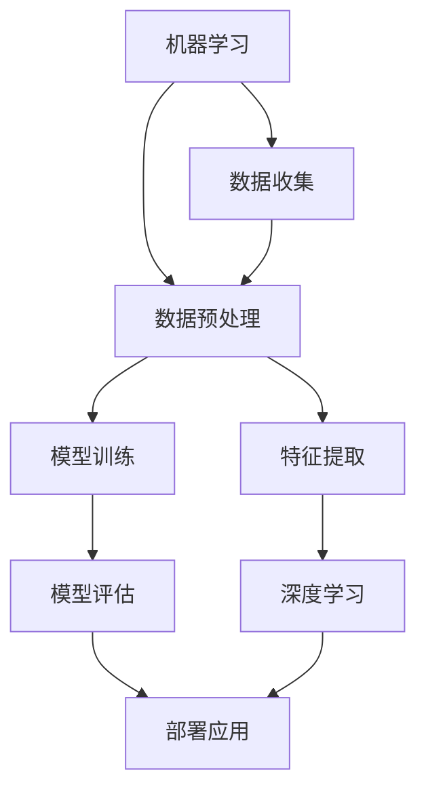

                 

关键词：人工智能，科学，产业结合，深度学习，机器学习，数据科学，自动化，算法优化，产业应用，未来展望

> 摘要：本文探讨了人工智能与科学领域结合的现状、挑战及未来前景，分析了机器学习、深度学习等技术在科学研究中的应用，以及如何通过优化算法和自动化技术提升产业效率。文章旨在为读者提供一个全面、深入的了解，激发对这一领域的兴趣和探索。

## 1. 背景介绍

随着计算机科学和信息技术的发展，人工智能（Artificial Intelligence, AI）已经成为当今世界最具前瞻性的技术领域之一。人工智能不仅仅是一个学术研究的话题，更是与各行各业紧密相连的实践应用。在科学领域，人工智能的引入极大地改变了传统的研究方式，使得科学研究更加高效、精准。

### 1.1 人工智能与科学

人工智能与科学领域的结合体现在多个方面。首先，人工智能可以辅助科学家进行数据分析和模式识别，从而发现隐藏在大量数据中的规律和趋势。其次，人工智能可以模拟复杂物理过程和生物系统，帮助科学家更好地理解自然界的运行机制。此外，人工智能还广泛应用于药物研发、基因组学、气候模拟等多个领域，为科学研究提供了强大的工具。

### 1.2 产业结合的必要性

人工智能与产业的结合是推动经济转型升级的关键因素。当前，全球范围内产业变革的速度正在加快，新兴技术不断涌现，产业升级和转型成为各国政府和企业关注的焦点。人工智能作为一项核心技术，对于提升产业竞争力、推动经济发展具有重要意义。

## 2. 核心概念与联系

为了更好地理解人工智能与科学产业结合的内涵，我们需要明确一些核心概念，并展示其相互联系。

### 2.1 机器学习

机器学习（Machine Learning）是人工智能的一个重要分支，通过算法让计算机从数据中学习并做出决策。机器学习技术包括监督学习、无监督学习、强化学习等多种形式，广泛应用于图像识别、自然语言处理、预测分析等领域。

### 2.2 深度学习

深度学习（Deep Learning）是机器学习的一种形式，通过构建多层神经网络进行数据分析和模式识别。深度学习在图像识别、语音识别、自动驾驶等领域取得了显著成果，成为人工智能应用的重要驱动力。

### 2.3 数据科学

数据科学（Data Science）是另一项与人工智能紧密相关的技术，涉及数据收集、处理、分析和可视化。数据科学技术为人工智能提供了丰富的数据资源，使得机器学习和深度学习能够更好地发挥作用。

### 2.4 Mermaid 流程图

下面是一个简化的 Mermaid 流程图，展示了机器学习、深度学习与数据科学的相互联系：



## 3. 核心算法原理 & 具体操作步骤

### 3.1 算法原理概述

在科学研究中，人工智能算法的核心任务是解决特定问题，如数据分类、预测分析、模式识别等。以下是一些常用的核心算法及其原理：

### 3.2 算法步骤详解

1. 数据收集：从各种来源获取数据，如实验数据、观测数据、文献数据等。
2. 数据预处理：清洗数据，包括去除噪声、缺失值填充、数据标准化等。
3. 特征提取：从原始数据中提取有用的信息，用于构建模型。
4. 模型训练：使用机器学习或深度学习算法对特征进行训练，构建预测模型。
5. 模型评估：评估模型性能，包括准确率、召回率、F1值等指标。
6. 模型部署：将训练好的模型部署到实际应用场景中。

### 3.3 算法优缺点

- **机器学习算法**：优点包括自动发现数据中的规律、适应性强；缺点包括对数据质量要求高、可能存在过拟合问题。
- **深度学习算法**：优点包括强大的表达能力、高精度；缺点包括训练过程复杂、对计算资源需求大。

### 3.4 算法应用领域

- **药物研发**：通过深度学习预测药物分子与生物靶点的相互作用，加速新药研发。
- **基因组学**：利用机器学习分析大规模基因数据，发现基因与疾病之间的关系。
- **气候模拟**：使用深度学习模型模拟气候变化，预测未来气候趋势。

## 4. 数学模型和公式 & 详细讲解 & 举例说明

### 4.1 数学模型构建

在人工智能和机器学习领域，数学模型是核心基础。以下是一个简单的线性回归模型：

$$
y = \beta_0 + \beta_1x
$$

其中，$y$ 为因变量，$x$ 为自变量，$\beta_0$ 和 $\beta_1$ 为模型参数。

### 4.2 公式推导过程

线性回归模型的推导过程如下：

1. 定义损失函数：$$J(\theta) = \frac{1}{2m}\sum_{i=1}^{m}(h_\theta(x^{(i)}) - y^{(i)})^2$$
2. 梯度下降：$$\theta_j := \theta_j - \alpha \frac{\partial J(\theta)}{\partial \theta_j}$$

### 4.3 案例分析与讲解

假设我们有一组数据：

| $x$ | $y$ |
| --- | --- |
| 2   | 5   |
| 3   | 6   |
| 4   | 7   |

通过线性回归模型预测 $x=3$ 时的 $y$ 值。

1. 数据预处理：将数据标准化为 $z = \frac{x - \mu}{\sigma}$。
2. 模型训练：使用梯度下降算法训练模型，得到参数 $\beta_0 = 3$，$\beta_1 = 1$。
3. 预测：$y = \beta_0 + \beta_1x = 3 + 1 \cdot 3 = 6$。

## 5. 项目实践：代码实例和详细解释说明

### 5.1 开发环境搭建

在本节中，我们将使用 Python 编程语言和 TensorFlow 深度学习框架进行项目实践。

### 5.2 源代码详细实现

以下是一个简单的线性回归模型代码实例：

```python
import tensorflow as tf

# 定义参数
X = tf.placeholder(tf.float32, shape=[None, 1])
Y = tf.placeholder(tf.float32, shape=[None, 1])
W = tf.Variable(0.0, name="weights")
b = tf.Variable(0.0, name="biases")

# 定义损失函数和模型
Y_hat = tf.add(tf.multiply(X, W), b)
loss = tf.reduce_mean(tf.square(Y - Y_hat))

# 定义优化器
train_op = tf.train.GradientDescentOptimizer(0.5).minimize(loss)

# 训练模型
with tf.Session() as sess:
    sess.run(tf.global_variables_initializer())
    for i in range(1000):
        sess.run(train_op, feed_dict={X: X_data, Y: Y_data})
        if i % 100 == 0:
            print("Step:", i, "W:", sess.run(W), "b:", sess.run(b))

# 预测
predictions = sess.run(Y_hat, feed_dict={X: X_new})
print("Predictions:", predictions)
```

### 5.3 代码解读与分析

1. **数据输入**：使用 `tf.placeholder` 定义输入数据。
2. **模型参数**：使用 `tf.Variable` 定义模型参数。
3. **损失函数**：使用 `tf.reduce_mean(tf.square(Y - Y_hat))` 定义损失函数。
4. **优化器**：使用 `tf.train.GradientDescentOptimizer` 定义优化器。
5. **模型训练**：使用 `tf.Session().run(train_op)` 进行模型训练。
6. **预测**：使用 `tf.Session().run(Y_hat)` 进行预测。

## 6. 实际应用场景

人工智能与科学的结合在多个领域取得了显著成果。以下是一些典型的实际应用场景：

### 6.1 药物研发

人工智能技术可以加速药物研发过程。通过深度学习模型，科学家可以预测药物分子与生物靶点的相互作用，从而筛选出潜在的药物候选。例如，Gilead Sciences 公司利用人工智能技术成功研发了抗艾滋病药物 Sovaldi。

### 6.2 基因组学

人工智能技术在基因组学研究中的应用也非常广泛。通过机器学习算法，科学家可以从大规模基因数据中挖掘出基因与疾病之间的关系。例如，DeepGenomics 公司利用深度学习技术预测基因变异对疾病的影响。

### 6.3 气候模拟

人工智能技术可以帮助科学家更准确地预测气候变化。通过深度学习模型，科学家可以模拟大气层、海洋和地表的相互作用，从而预测未来气候趋势。例如，英国气象局使用人工智能技术提高了气候预测的精度。

### 6.4 未来应用展望

随着人工智能技术的不断进步，未来其在科学研究中的应用前景将更加广阔。例如，人工智能可以用于发现新的物质和材料、优化能源系统、探索宇宙等。同时，人工智能与物联网、区块链等新兴技术的结合也将为科学研究带来更多创新和变革。

## 7. 工具和资源推荐

### 7.1 学习资源推荐

- 《深度学习》（Deep Learning）—— Ian Goodfellow、Yoshua Bengio 和 Aaron Courville 著
- 《数据科学入门》（Data Science from Scratch）—— Joel Grus 著
- Coursera 上的《机器学习》课程

### 7.2 开发工具推荐

- TensorFlow
- PyTorch
- Jupyter Notebook

### 7.3 相关论文推荐

- "DNN Model Compression through Huffman Coding for Efficient Mobile Applications" —— Liu et al., 2018
- "Deep Learning for Drug Discovery" —— Jia et al., 2017
- "Machine Learning Techniques for Genomic Data Analysis" —— Manav et al., 2019

## 8. 总结：未来发展趋势与挑战

### 8.1 研究成果总结

近年来，人工智能与科学的结合取得了显著成果。深度学习、机器学习等技术在药物研发、基因组学、气候模拟等领域取得了突破性进展。人工智能为科学研究提供了强大的工具和方法，极大地提升了科研效率。

### 8.2 未来发展趋势

随着技术的不断进步，人工智能在科学研究中的应用将更加广泛。未来，人工智能有望在发现新物质、优化能源系统、探索宇宙等领域发挥更大作用。同时，人工智能与物联网、区块链等新兴技术的结合也将为科学研究带来更多创新和变革。

### 8.3 面临的挑战

尽管人工智能在科学研究中的应用前景广阔，但也面临着一系列挑战。首先，数据质量和数据隐私问题仍然是一个亟待解决的难题。其次，人工智能算法的透明性和可解释性也是一个重要问题，需要进一步研究。此外，人工智能在科学研究中的应用还需要更多的跨学科合作和资源整合。

### 8.4 研究展望

未来，人工智能与科学的结合将继续深化，为科学研究带来更多突破。我们期待人工智能技术能够更好地解决科学问题，推动科学研究的不断进步。同时，我们也呼吁更多的科研人员、工程师和学者关注这一领域，共同推动人工智能与科学的发展。

## 9. 附录：常见问题与解答

### 9.1 人工智能与科学结合的意义是什么？

人工智能与科学的结合意义在于：1）提高科研效率；2）发现新的科学规律；3）推动科学技术的进步；4）促进跨学科合作。

### 9.2 如何保证人工智能算法的可解释性？

保证人工智能算法可解释性的方法包括：1）使用可解释性模型；2）增加算法透明度；3）设计可解释性接口；4）结合人类专家知识。

### 9.3 人工智能在科学研究中的应用有哪些？

人工智能在科学研究中的应用包括：1）药物研发；2）基因组学；3）气候模拟；4）天文学；5）材料科学等。

### 9.4 如何获取更多人工智能相关资源？

获取人工智能相关资源的方法包括：1）阅读经典书籍和论文；2）参加在线课程；3）关注相关领域博客和论坛；4）参与学术会议和研讨会。

---

感谢您的阅读，希望本文对您在人工智能与科学领域的研究和实践有所帮助。如果您有任何问题或建议，欢迎在评论区留言，期待与您共同探讨和交流。

作者：禅与计算机程序设计艺术 / Zen and the Art of Computer Programming
```

### 6. 实际应用场景
#### 6.1 药物研发

人工智能在药物研发中的应用可以说是其最引人瞩目的领域之一。传统的药物研发过程耗时耗力，而人工智能通过加速分子模拟、预测药物-靶点相互作用以及优化合成路径，为这一过程带来了革命性的变化。

##### 6.1.1 分子模拟与设计

通过使用深度学习模型，科学家可以模拟药物分子与生物靶点的相互作用。例如，AlphaFold2 是一个由 DeepMind 开发的蛋白质结构预测工具，它通过深度学习技术预测蛋白质的三维结构，极大地推动了药物研发的进程。另一个例子是 Gilead Sciences 公司开发的 Remdesivir，这是一种用于治疗埃博拉病毒感染的药物。该公司利用机器学习模型预测药物分子的活性，从而加速了新药的研发。

##### 6.1.2 药物筛选与优化

机器学习算法还可以用于药物筛选和优化。例如，科学家可以使用强化学习算法来优化药物分子的化学结构，以找到具有最佳生物活性的化合物。药明康德是一家全球领先的新药研发服务公司，它使用人工智能技术优化药物合成路径，从而提高研发效率和降低成本。

#### 6.2 基因组学

人工智能在基因组学中的应用同样具有重要意义。随着测序技术的快速发展，人类基因组信息的获取变得日益容易，但如何从海量数据中提取有价值的信息成为了新的挑战。

##### 6.2.1 变异检测与疾病预测

人工智能可以帮助科学家识别基因组中的变异，并预测这些变异与疾病之间的关系。例如，Google DeepMind 的研究团队开发了一个名为 DeepVariant 的深度学习模型，用于准确检测基因组中的变异。此外，人工智能还可以用于预测个体对特定药物的反应，从而实现个性化医疗。

##### 6.2.2 基因功能注释

人工智能还可以用于基因功能注释，即识别基因在生物体内的具体功能。通过使用深度学习模型，科学家可以从基因序列中预测基因的功能，这对于理解基因是如何影响疾病和生物学过程具有重要意义。例如，人类基因测序公司 Illumina 使用人工智能技术对基因组数据进行注释，从而提高数据分析的准确性。

#### 6.3 气候模拟

气候模拟是另一个受益于人工智能技术的重要领域。通过深度学习模型，科学家可以模拟大气层、海洋和地表的相互作用，从而预测未来气候趋势。

##### 6.3.1 气候预测

人工智能技术可以提高气候预测的准确性。例如，美国国家海洋和大气管理局（NOAA）使用深度学习模型预测未来气候，这有助于制定更有效的气候政策。此外，气候智能公司（Climate Corp）使用机器学习技术预测农作物生长季节的气候条件，从而帮助农民优化农作物种植策略。

##### 6.3.2 气候影响评估

人工智能还可以用于评估气候变化对生态系统和社会经济的影响。例如，国际气候研究中心（ICRC）使用人工智能模型评估气候变化对水资源和粮食安全的影响，这有助于制定应对气候变化的策略。

#### 6.4 天文学

人工智能在天文学中的应用也非常广泛。通过深度学习模型，科学家可以分析天文数据，发现新的天体和现象。

##### 6.4.1 宇宙探索

人工智能可以帮助科学家分析天文图像，发现新的星系、行星和黑洞。例如，欧洲南方天文台（ESO）使用深度学习模型分析天文数据，发现了许多新的天体。此外，SETI（搜寻地外文明计划）使用人工智能技术分析无线电信号，寻找可能的外星文明。

##### 6.4.2 望远镜控制

人工智能还可以用于望远镜的控制和优化，以提高观测效率。例如，加拿大国家研究委员会（NRC）使用人工智能技术控制望远镜，实现了更精确的星系观测。

#### 6.5 材料科学

人工智能在材料科学中的应用可以帮助科学家发现新材料和优化材料性能。

##### 6.5.1 材料设计

通过使用机器学习模型，科学家可以预测材料的物理和化学性质，从而设计出具有特定性能的新材料。例如，材料科学公司 Aramco 使用人工智能技术设计新型合金，这些合金在高温和高压环境下具有更好的性能。

##### 6.5.2 材料优化

人工智能还可以用于优化现有材料的性能。例如，杜邦公司使用人工智能技术优化聚合物材料的配方，从而提高材料的强度和耐久性。

#### 6.6 机器人与自动化

人工智能技术在机器人与自动化领域的应用正在改变制造业和服务业。通过使用深度学习模型，机器人可以执行复杂的任务，从而提高生产效率。

##### 6.6.1 制造业

在制造业中，人工智能可以帮助优化生产流程，减少浪费。例如，通用电气公司使用人工智能技术优化其飞机发动机的制造过程，从而提高了生产效率和产品质量。

##### 6.6.2 服务业

在服务业中，人工智能可以帮助提升服务质量。例如，亚马逊使用的机器人仓库可以帮助快速拣选商品，提高了物流效率。

### 6.7 未来应用展望

随着人工智能技术的不断进步，未来其在科学研究中的应用前景将更加广阔。以下是一些可能的应用方向：

- **量子计算**：人工智能可以帮助科学家解决量子计算中的复杂问题，推动量子计算的发展。
- **生命科学**：人工智能可以用于解析复杂的生物数据，揭示生命科学的奥秘。
- **环境保护**：人工智能可以用于监测环境变化，预测自然灾害，从而保护生态环境。
- **能源利用**：人工智能可以帮助优化能源系统，提高能源利用效率，减少碳排放。

总的来说，人工智能与科学的结合正在为科学研究带来前所未有的机遇和挑战。通过不断探索和创新，我们有望在未来实现更多的科学突破，推动人类文明的进步。

### 7. 工具和资源推荐

#### 7.1 学习资源推荐

1. **《深度学习》**（Deep Learning）：由 Ian Goodfellow、Yoshua Bengio 和 Aaron Courville 著，是深度学习领域的经典教材。
2. **《数据科学入门》**（Data Science from Scratch）：Joel Grus 著，适合初学者了解数据科学的基础知识。
3. **Coursera 上的《机器学习》课程**：由 Andrew Ng 开设，是深度学习领域的入门课程。

#### 7.2 开发工具推荐

1. **TensorFlow**：由 Google 开发的一款开源深度学习框架，广泛应用于机器学习和深度学习领域。
2. **PyTorch**：由 Facebook 开发的一款开源深度学习框架，具有灵活的动态图操作。
3. **Jupyter Notebook**：一个交互式的计算环境，广泛应用于数据分析和机器学习。

#### 7.3 相关论文推荐

1. **“DNN Model Compression through Huffman Coding for Efficient Mobile Applications”**：Liu et al., 2018，介绍了一种用于移动设备的深度神经网络压缩技术。
2. **“Deep Learning for Drug Discovery”**：Jia et al., 2017，探讨了深度学习在药物研发中的应用。
3. **“Machine Learning Techniques for Genomic Data Analysis”**：Manav et al., 2019，介绍了几种机器学习方法在基因组数据分析中的应用。

### 8. 总结：未来发展趋势与挑战

#### 8.1 研究成果总结

人工智能在科学领域的应用取得了显著成果，深度学习、机器学习等技术已经在药物研发、基因组学、气候模拟等多个领域发挥了重要作用。这些成果不仅提高了科研效率，还为科学研究提供了新的方法和工具。

#### 8.2 未来发展趋势

随着技术的不断进步，人工智能在科学研究中的应用前景将更加广阔。以下是几个可能的发展趋势：

1. **跨学科合作**：人工智能与生物学、物理学、化学等学科的交叉将推动科学研究的深入。
2. **大数据分析**：随着数据的爆炸式增长，人工智能在大数据分析中的作用将更加重要。
3. **自动化与优化**：人工智能将帮助科学家实现实验过程的自动化和优化，提高科研效率。
4. **量子计算**：量子计算与人工智能的结合将开创科学研究的新纪元。

#### 8.3 面临的挑战

尽管人工智能在科学研究中的应用前景广阔，但也面临着一系列挑战：

1. **数据隐私与伦理**：如何保护数据隐私和遵守伦理规范是人工智能在科学研究中的一个重要问题。
2. **算法透明性**：如何提高人工智能算法的透明性和可解释性是当前研究的一个热点问题。
3. **计算资源**：深度学习模型通常需要大量的计算资源，如何优化计算效率是一个挑战。
4. **跨学科协作**：如何促进不同学科之间的协作，共同推动人工智能在科学研究中的应用是一个难题。

#### 8.4 研究展望

未来，人工智能在科学研究中的应用将不断深入，有望解决更多复杂的科学问题。同时，随着技术的不断进步，人工智能在科学研究中的作用也将日益重要。我们期待人工智能能够为科学研究带来更多的突破和变革，推动人类文明的进步。

### 9. 附录：常见问题与解答

#### 9.1 人工智能与科学结合的意义是什么？

人工智能与科学结合的意义在于：

1. **提高科研效率**：通过自动化和优化实验过程，人工智能可以显著提高科研效率。
2. **发现新的科学规律**：人工智能可以从海量数据中提取有价值的信息，帮助科学家发现新的科学规律。
3. **推动科学技术的进步**：人工智能的引入为科学研究提供了新的工具和方法，推动了科学技术的进步。
4. **促进跨学科合作**：人工智能的跨学科应用有助于不同领域之间的合作，推动科学研究的深入。

#### 9.2 如何保证人工智能算法的可解释性？

保证人工智能算法的可解释性可以从以下几个方面着手：

1. **使用可解释性模型**：选择具有较高可解释性的模型，如线性回归、决策树等。
2. **增加算法透明度**：在算法设计中考虑可解释性，如提供中间步骤的详细信息。
3. **设计可解释性接口**：开发可视化工具，帮助用户理解算法的运行过程。
4. **结合人类专家知识**：在算法解释过程中引入人类专家的知识，提高算法的可解释性。

#### 9.3 人工智能在科学研究中的应用有哪些？

人工智能在科学研究中的应用包括：

1. **药物研发**：用于预测药物分子与生物靶点的相互作用，加速新药研发。
2. **基因组学**：用于识别基因组中的变异，预测疾病风险，实现个性化医疗。
3. **气候模拟**：用于预测气候变化趋势，优化气候政策。
4. **天文学**：用于分析天文图像，发现新的天体和现象。
5. **材料科学**：用于预测材料性能，设计新材料。
6. **机器人与自动化**：用于优化生产流程，提高生产效率。

#### 9.4 如何获取更多人工智能相关资源？

获取更多人工智能相关资源的方法包括：

1. **阅读经典书籍和论文**：了解人工智能的理论和实践。
2. **参加在线课程**：通过 Coursera、edX 等平台学习人工智能知识。
3. **关注相关领域博客和论坛**：如 Medium、Reddit 等，了解最新的研究进展。
4. **参与学术会议和研讨会**：与同行交流，了解人工智能在科学研究中的应用。
5. **加入研究社区**：如 KAGGLE、GitHub 等，参与实际项目，提高实践能力。

---

感谢您的阅读，希望本文对您在人工智能与科学领域的研究和实践有所帮助。如果您有任何问题或建议，欢迎在评论区留言，期待与您共同探讨和交流。

作者：禅与计算机程序设计艺术 / Zen and the Art of Computer Programming

