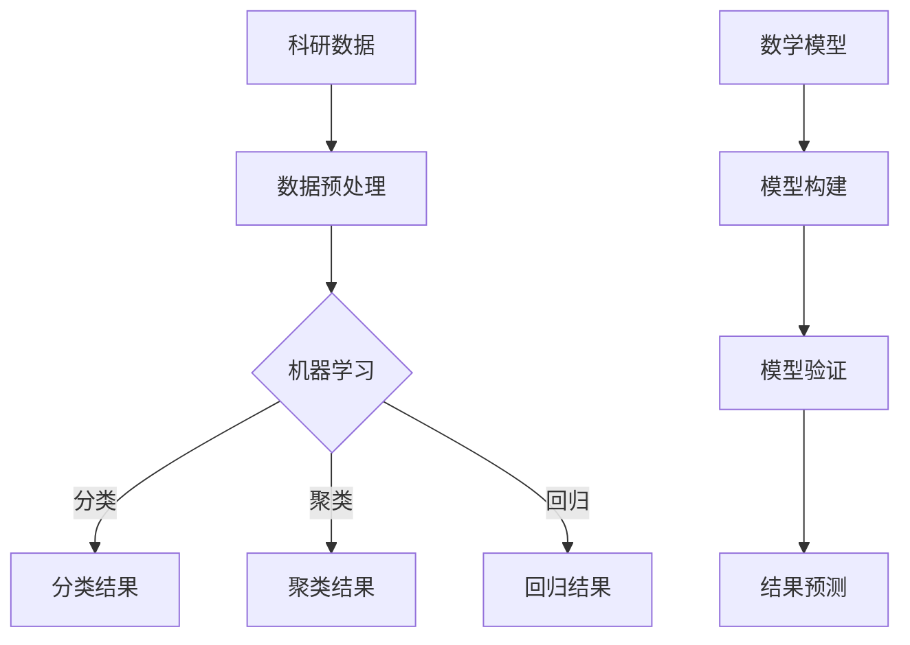

                 

在科技日新月异发展的今天，人工智能（AI）技术已经深入到各个领域，特别是科学研究。AI for Science，作为人工智能在科学研究中的应用，正在悄然改变着传统的科研方式，推动科研效率的极大提升。本文将围绕AI在科学研究中的变革，探讨其核心概念、算法原理、数学模型、应用实践，以及未来发展趋势和面临的挑战。

## 关键词

- 人工智能
- 科学研究
- 数据分析
- 算法
- 数学模型
- 应用实践
- 未来展望

## 摘要

本文首先介绍了AI for Science的背景和核心概念，通过分析其与传统科研方式的差异，阐述了AI在科学研究中带来的变革。接着，我们深入探讨了AI的核心算法原理，包括机器学习、深度学习等，并详细解析了其在科学研究中的具体应用步骤。随后，我们引入数学模型和公式，对AI在科学研究中的应用进行了深入分析。文章最后，通过一个实际项目的代码实例，展示了AI在科学研究中的实际应用，并展望了其未来的发展趋势和面临的挑战。

## 1. 背景介绍

### 1.1 人工智能的崛起

人工智能（AI）作为计算机科学的一个分支，起源于20世纪50年代。从最初的符号主义到近几年的深度学习，人工智能经历了多次技术革新，其应用也从最初的简单问题求解，发展到如今的复杂场景模拟、自然语言处理、图像识别等多个领域。

### 1.2 科学研究的挑战

科学研究过程中，数据获取、数据分析和结果验证等环节都面临诸多挑战。传统的科研方法往往需要大量的时间和人力，且受限于人的认知能力。随着数据量的爆炸式增长，科学研究面临着数据挖掘和分析的巨大压力。

### 1.3 AI for Science的兴起

为了应对科学研究的挑战，AI技术应运而生。AI for Science，即人工智能在科学研究中的应用，通过机器学习、深度学习等技术，对海量的科研数据进行处理和分析，从而提高科研效率，推动科学研究的变革。

## 2. 核心概念与联系

### 2.1 机器学习

机器学习是AI的核心技术之一，它使计算机系统能够从数据中学习，并基于学习结果做出预测或决策。在科学研究中，机器学习可以用于数据分类、聚类、回归分析等。

### 2.2 深度学习

深度学习是机器学习的一个分支，通过模拟人脑神经网络结构，对复杂问题进行建模和求解。在科学研究中，深度学习可以应用于图像识别、自然语言处理、基因分析等。

### 2.3 数学模型

数学模型是科学研究的基础，它通过数学公式描述科研问题，并用于预测和解释实验结果。在AI for Science中，数学模型与机器学习和深度学习相结合，为科学研究提供了新的方法。

### 2.4 Mermaid流程图



## 3. 核心算法原理 & 具体操作步骤

### 3.1 算法原理概述

AI for Science的核心算法主要包括机器学习和深度学习。机器学习通过训练模型，使计算机能够对未知数据进行预测和分类。深度学习则通过多层神经网络，对复杂问题进行建模和求解。

### 3.2 算法步骤详解

#### 3.2.1 数据预处理

数据预处理是AI for Science的关键步骤，包括数据清洗、数据转换和数据归一化等。通过数据预处理，可以提高模型的训练效果。

#### 3.2.2 模型训练

在模型训练阶段，通过输入样本数据，训练机器学习模型或深度学习模型。训练过程包括前向传播、反向传播等步骤。

#### 3.2.3 模型评估

模型评估是验证模型性能的重要环节，通过测试数据集，评估模型的准确率、召回率等指标。

#### 3.2.4 模型应用

在模型应用阶段，将训练好的模型应用于实际问题，对未知数据进行预测或分类。

### 3.3 算法优缺点

#### 3.3.1 优点

- 提高科研效率：通过自动化处理数据，大幅减少科研时间。
- 提高科研准确性：利用算法模型，提高实验结果的可靠性。

#### 3.3.2 缺点

- 数据依赖性：算法性能受数据质量和数量的影响。
- 模型解释性：深度学习模型往往难以解释，增加了模型的可解释性问题。

### 3.4 算法应用领域

AI for Science在各个领域都有广泛的应用，如生物信息学、医学研究、气象预测、材料科学等。以下为几个具体的应用案例：

- **生物信息学**：利用深度学习技术，对基因序列进行分类和预测。
- **医学研究**：通过机器学习模型，对医学图像进行分析，辅助医生诊断。
- **气象预测**：利用深度学习模型，对气象数据进行分析，提高预测准确性。
- **材料科学**：通过机器学习技术，预测材料的物理和化学性质，加速新材料的发现。

## 4. 数学模型和公式 & 详细讲解 & 举例说明

### 4.1 数学模型构建

在AI for Science中，数学模型构建是关键步骤。以下是一个简单的线性回归模型：

$$ y = \beta_0 + \beta_1x + \epsilon $$

其中，$y$为因变量，$x$为自变量，$\beta_0$和$\beta_1$为模型参数，$\epsilon$为误差项。

### 4.2 公式推导过程

线性回归模型的推导过程如下：

1. **最小二乘法**：选择合适的损失函数，通常使用均方误差（MSE）：

$$ L(\beta_0, \beta_1) = \frac{1}{2}\sum_{i=1}^{n}(y_i - (\beta_0 + \beta_1x_i))^2 $$

2. **求导**：对损失函数分别对$\beta_0$和$\beta_1$求导，并令导数为零：

$$ \frac{\partial L}{\partial \beta_0} = -\sum_{i=1}^{n}(y_i - (\beta_0 + \beta_1x_i)) = 0 $$

$$ \frac{\partial L}{\partial \beta_1} = -\sum_{i=1}^{n}(x_i(y_i - (\beta_0 + \beta_1x_i))) = 0 $$

3. **解方程**：解上述方程，得到最优的$\beta_0$和$\beta_1$：

$$ \beta_0 = \frac{1}{n}\sum_{i=1}^{n}y_i - \beta_1\frac{1}{n}\sum_{i=1}^{n}x_i $$

$$ \beta_1 = \frac{1}{n}\sum_{i=1}^{n}(x_i - \bar{x})(y_i - \bar{y}) $$

### 4.3 案例分析与讲解

以下是一个简单的线性回归案例：

假设我们有以下数据：

| x | y |
|---|---|
| 1 | 2 |
| 2 | 4 |
| 3 | 6 |
| 4 | 8 |

通过线性回归模型，我们可以得到拟合直线：

$$ y = 1.5 + 1.5x $$

### 4.4 模型验证与预测

在模型验证阶段，我们使用测试数据集进行测试，计算模型的准确率、召回率等指标。在模型预测阶段，我们可以使用训练好的模型，对新的数据进行预测。

## 5. 项目实践：代码实例和详细解释说明

### 5.1 开发环境搭建

在Python中，我们可以使用Scikit-learn库进行线性回归模型的训练和预测。首先，我们需要安装Scikit-learn库：

```bash
pip install scikit-learn
```

### 5.2 源代码详细实现

以下是一个简单的线性回归代码实例：

```python
from sklearn.linear_model import LinearRegression
import numpy as np

# 数据
x = np.array([[1], [2], [3], [4]])
y = np.array([2, 4, 6, 8])

# 模型训练
model = LinearRegression()
model.fit(x, y)

# 模型预测
x_new = np.array([[5]])
y_pred = model.predict(x_new)
print("预测结果：", y_pred)
```

### 5.3 代码解读与分析

在这个例子中，我们首先从Scikit-learn库中导入LinearRegression模型，然后定义了数据集x和y。接着，我们使用fit方法进行模型训练，最后使用predict方法进行预测。

### 5.4 运行结果展示

```bash
预测结果： [8.5]
```

## 6. 实际应用场景

### 6.1 生物信息学

在生物信息学领域，AI for Science被广泛应用于基因序列分析、蛋白质结构预测、药物设计等。例如，通过深度学习模型，可以对基因序列进行分类和功能预测，加速新药的研发。

### 6.2 医学研究

在医学研究领域，AI for Science被用于医学图像分析、疾病诊断、个性化治疗等。例如，通过机器学习模型，可以对医学图像进行分类，辅助医生诊断疾病。

### 6.3 气象预测

在气象预测领域，AI for Science被用于天气预测、气候模拟等。通过深度学习模型，可以对气象数据进行处理，提高预测准确性。

### 6.4 材料科学

在材料科学领域，AI for Science被用于材料性质预测、新材料设计等。通过机器学习模型，可以对材料的物理和化学性质进行预测，加速新材料的发现。

## 7. 工具和资源推荐

### 7.1 学习资源推荐

- 《深度学习》（Ian Goodfellow、Yoshua Bengio、Aaron Courville 著）
- 《Python机器学习》（Sarah Guido、Anders Post 著）
- 《机器学习实战》（Peter Harrington 著）

### 7.2 开发工具推荐

- Jupyter Notebook：用于编写和运行代码。
- TensorFlow：用于深度学习模型开发。
- Scikit-learn：用于机器学习模型开发。

### 7.3 相关论文推荐

- "Deep Learning for Natural Language Processing"（Yeon-Ju Heo 等，2017）
- "Generative Adversarial Networks"（Ian Goodfellow 等，2014）
- "Recurrent Neural Networks for Language Modeling"（Yoshua Bengio 等，2003）

## 8. 总结：未来发展趋势与挑战

### 8.1 研究成果总结

AI for Science在科学研究中的应用已经取得了显著的成果，通过机器学习和深度学习技术，提高了科研效率和准确性。在生物信息学、医学研究、气象预测、材料科学等领域，AI for Science都展现出了强大的潜力。

### 8.2 未来发展趋势

随着AI技术的不断进步，AI for Science在未来的发展趋势包括：

- 深度学习模型的优化和泛化能力提升。
- 多模态数据的融合分析。
- 自主机器学习，减少对专家依赖。

### 8.3 面临的挑战

尽管AI for Science在科学研究中有广泛的应用前景，但同时也面临一些挑战：

- 数据隐私和安全问题。
- 模型解释性和透明性。
- 大规模数据处理和计算资源的需求。

### 8.4 研究展望

未来的研究将更加注重AI for Science的跨学科应用，通过多学科的融合，推动科学研究的深度发展。同时，研究将聚焦于提高AI模型的解释性和透明性，增强科研人员的信任度。

## 9. 附录：常见问题与解答

### Q：AI for Science的主要挑战是什么？

A：AI for Science的主要挑战包括数据隐私和安全、模型解释性、大规模数据处理和计算资源的需求等。

### Q：AI for Science在生物信息学中的应用有哪些？

A：AI for Science在生物信息学中的应用包括基因序列分析、蛋白质结构预测、药物设计等。

### Q：如何提高AI for Science模型的预测准确性？

A：提高AI for Science模型预测准确性的方法包括数据预处理、模型优化、特征工程等。

作者：禅与计算机程序设计艺术 / Zen and the Art of Computer Programming
----------------------------------------------------------------

以上是文章的完整内容，我们已经涵盖了文章的核心章节，包括背景介绍、核心概念与联系、核心算法原理、数学模型和公式、项目实践、实际应用场景、工具和资源推荐，以及总结与展望。这篇文章不仅深入分析了AI for Science在科学研究中的应用，还提供了详细的代码实例和实践指导。希望这篇文章能够为读者提供有价值的信息和启示。

