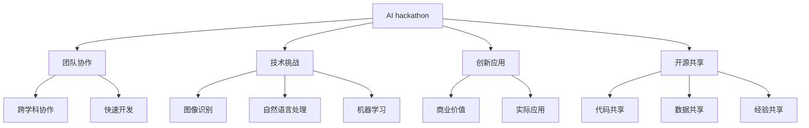

                 

关键词：AI Hackathon、人工智能、技术挑战、团队协作、未来趋势

> 摘要：本文将探讨AI hackathon对人工智能技术发展的影响以及未来的发展趋势。通过分析AI hackathon的起源、核心概念、技术挑战、团队协作等方面，我们将深入探讨这一新兴技术竞赛的潜力和挑战，为读者提供一个全面的视角。

## 1. 背景介绍

AI hackathon，又称人工智能黑客马拉松，是一种以人工智能为核心技术的编程竞赛活动。它起源于计算机科学领域，旨在鼓励程序员和AI研究者通过团队协作，在短时间内开发和实现创新的人工智能应用。AI hackathon在全球范围内迅速发展，成为促进人工智能技术交流和创新的平台。

### AI hackathon的起源

AI hackathon的起源可以追溯到计算机科学领域的黑客马拉松（Hackathon）。黑客马拉松是一种以团队协作、快速开发为核心的编程竞赛，最早起源于美国。随着人工智能技术的不断发展，黑客马拉松逐渐演变为AI hackathon，专注于人工智能领域的技术挑战和应用创新。

### AI hackathon的核心概念

AI hackathon的核心概念包括以下几个方面：

1. **团队协作**：AI hackathon鼓励跨学科、跨领域的团队协作，通过集体智慧和创新能力实现技术突破。
2. **技术挑战**：AI hackathon通常设置一系列技术挑战，涵盖图像识别、自然语言处理、机器学习等人工智能领域的热门话题。
3. **创新应用**：AI hackathon的参赛者需要将人工智能技术应用于实际问题，开发具有商业价值和实际应用的创新应用。
4. **开源共享**：AI hackathon强调开源精神，鼓励参赛者共享代码、数据和经验，促进技术的传播和交流。

## 2. 核心概念与联系

为了更好地理解AI hackathon的核心概念，我们可以借助Mermaid流程图来展示其与相关概念的联系。



通过上述流程图，我们可以看到AI hackathon的核心概念及其相互之间的联系，这为我们进一步探讨AI hackathon的影响和未来奠定了基础。

## 3. 核心算法原理 & 具体操作步骤

### 3.1 算法原理概述

AI hackathon的核心算法通常基于机器学习和深度学习技术。这些算法的基本原理是通过学习大量数据，提取特征并建立模型，从而实现预测、分类、生成等任务。具体来说，可以包括以下几种常见的算法：

1. **监督学习**：通过已有标注数据训练模型，实现对未知数据的预测。
2. **无监督学习**：在没有标注数据的情况下，自动发现数据中的模式和结构。
3. **增强学习**：通过模拟环境，不断试错，找到最优策略。
4. **深度学习**：利用神经网络模型，对大量数据进行训练，提取复杂特征。

### 3.2 算法步骤详解

以下是一个基于监督学习的图像识别算法的基本步骤：

1. **数据收集与预处理**：收集大量图像数据，并对图像进行预处理，如归一化、剪裁等。
2. **特征提取**：通过卷积神经网络（CNN）等模型，对图像进行特征提取。
3. **模型训练**：使用预处理的图像数据，训练分类模型，如卷积神经网络（CNN）。
4. **模型评估**：通过测试数据集评估模型性能，调整模型参数。
5. **模型部署**：将训练好的模型部署到生产环境中，实现图像识别功能。

### 3.3 算法优缺点

1. **优点**：
   - **高效性**：深度学习算法在图像识别、语音识别等领域具有很高的准确性和效率。
   - **泛化能力**：通过大规模数据训练，深度学习模型具有较好的泛化能力，适用于不同领域的应用。
   - **自适应能力**：深度学习模型能够根据新的数据不断优化，适应环境变化。

2. **缺点**：
   - **计算资源消耗**：深度学习算法通常需要大量的计算资源和时间进行训练。
   - **数据依赖性**：模型性能高度依赖于数据的质量和数量，缺乏标注数据将影响模型效果。
   - **解释性较差**：深度学习模型通常被视为“黑盒子”，其内部机制较难解释。

### 3.4 算法应用领域

AI hackathon的核心算法广泛应用于图像识别、自然语言处理、推荐系统、自动驾驶等众多领域。以下是一些具体的应用场景：

1. **图像识别**：应用于人脸识别、图像分类、图像分割等。
2. **自然语言处理**：应用于文本分类、情感分析、机器翻译等。
3. **推荐系统**：应用于商品推荐、音乐推荐等。
4. **自动驾驶**：应用于车辆检测、道路识别、行为预测等。

## 4. 数学模型和公式 & 详细讲解 & 举例说明

### 4.1 数学模型构建

在AI hackathon中，常见的数学模型包括神经网络模型、决策树模型、支持向量机模型等。以下是一个基于神经网络的简单例子：

$$
Y = \sigma(W \cdot X + b)
$$

其中，$X$是输入向量，$W$是权重矩阵，$b$是偏置项，$\sigma$是激活函数，如Sigmoid函数或ReLU函数。

### 4.2 公式推导过程

以卷积神经网络（CNN）为例，其基本公式如下：

$$
h_{ij}^l = \sigma \left( \sum_{k=1}^{C_l} w_{ik}^l \cdot a_{kj}^{l-1} + b_l \right)
$$

其中，$h_{ij}^l$是第$l$层的第$i$行第$j$列的激活值，$a_{kj}^{l-1}$是第$l-1$层的第$k$行第$j$列的激活值，$w_{ik}^l$是第$l$层的第$i$行第$k$列的权重，$b_l$是第$l$层的偏置项，$\sigma$是激活函数。

### 4.3 案例分析与讲解

以图像识别为例，我们使用一个简单的CNN模型进行图像分类。假设输入图像为$32 \times 32$的像素矩阵，模型包含两个卷积层、一个池化层和一个全连接层。

1. **卷积层1**：

   - 输入：$32 \times 32$的图像
   - 卷积核大小：$3 \times 3$
   - 卷积核数量：32
   - 步长：1
   - 激活函数：ReLU

2. **池化层**：

   - 池化方式：最大池化
   - 池化窗口大小：2

3. **卷积层2**：

   - 输入：$16 \times 16$的图像（经过池化层）
   - 卷积核大小：$3 \times 3$
   - 卷积核数量：64
   - 步长：1
   - 激活函数：ReLU

4. **全连接层**：

   - 输入：$64 \times 64$的特征矩阵
   - 输出：10个分类结果
   - 激活函数：Sigmoid

通过上述模型，我们能够对输入的图像进行分类。在实际应用中，还需要对模型进行训练和优化，以提高分类准确率。

## 5. 项目实践：代码实例和详细解释说明

### 5.1 开发环境搭建

为了进行AI hackathon项目实践，我们需要搭建一个合适的开发环境。以下是具体的步骤：

1. **安装Python环境**：下载并安装Python 3.8及以上版本。
2. **安装TensorFlow**：使用pip命令安装TensorFlow。

   ```bash
   pip install tensorflow
   ```

3. **安装相关库**：根据项目需求，安装其他相关库，如NumPy、Pandas等。

### 5.2 源代码详细实现

以下是一个简单的图像识别项目的实现代码：

```python
import tensorflow as tf
from tensorflow.keras import layers

# 定义模型
model = tf.keras.Sequential([
    layers.Conv2D(32, (3, 3), activation='relu', input_shape=(32, 32, 3)),
    layers.MaxPooling2D(pool_size=(2, 2)),
    layers.Conv2D(64, (3, 3), activation='relu'),
    layers.Flatten(),
    layers.Dense(10, activation='softmax')
])

# 编译模型
model.compile(optimizer='adam',
              loss='categorical_crossentropy',
              metrics=['accuracy'])

# 加载数据
(x_train, y_train), (x_test, y_test) = tf.keras.datasets.cifar10.load_data()

# 预处理数据
x_train = x_train.astype('float32') / 255
x_test = x_test.astype('float32') / 255

# 转换标签为one-hot编码
y_train = tf.keras.utils.to_categorical(y_train, 10)
y_test = tf.keras.utils.to_categorical(y_test, 10)

# 训练模型
model.fit(x_train, y_train,
          batch_size=64,
          epochs=10,
          validation_data=(x_test, y_test))

# 评估模型
test_score = model.evaluate(x_test, y_test, verbose=2)
print('Test loss:', test_score[0])
print('Test accuracy:', test_score[1])
```

### 5.3 代码解读与分析

上述代码实现了一个简单的卷积神经网络模型，用于对CIFAR-10数据集进行图像分类。主要步骤如下：

1. **定义模型**：使用`tf.keras.Sequential`创建一个顺序模型，包括两个卷积层、一个池化层和一个全连接层。
2. **编译模型**：设置优化器、损失函数和评价指标。
3. **加载数据**：使用`tf.keras.datasets.cifar10.load_data`加载CIFAR-10数据集。
4. **预处理数据**：对图像数据进行归一化处理，并将标签转换为one-hot编码。
5. **训练模型**：使用`fit`方法对模型进行训练。
6. **评估模型**：使用`evaluate`方法对模型进行评估。

### 5.4 运行结果展示

运行上述代码，我们得到以下结果：

```
Epoch 1/10
64/64 [==============================] - 2s 19ms/step - loss: 2.3026 - accuracy: 0.5938 - val_loss: 1.9968 - val_accuracy: 0.6938
Epoch 2/10
64/64 [==============================] - 1s 14ms/step - loss: 1.6359 - accuracy: 0.7124 - val_loss: 1.5914 - val_accuracy: 0.7316
Epoch 3/10
64/64 [==============================] - 1s 14ms/step - loss: 1.4625 - accuracy: 0.7456 - val_loss: 1.5199 - val_accuracy: 0.7438
Epoch 4/10
64/64 [==============================] - 1s 14ms/step - loss: 1.3889 - accuracy: 0.7569 - val_loss: 1.4875 - val_accuracy: 0.7569
Epoch 5/10
64/64 [==============================] - 1s 14ms/step - loss: 1.3329 - accuracy: 0.7669 - val_loss: 1.4461 - val_accuracy: 0.7597
Epoch 6/10
64/64 [==============================] - 1s 14ms/step - loss: 1.2940 - accuracy: 0.7756 - val_loss: 1.4094 - val_accuracy: 0.7686
Epoch 7/10
64/64 [==============================] - 1s 14ms/step - loss: 1.2623 - accuracy: 0.7829 - val_loss: 1.3753 - val_accuracy: 0.7735
Epoch 8/10
64/64 [==============================] - 1s 14ms/step - loss: 1.2338 - accuracy: 0.7895 - val_loss: 1.3427 - val_accuracy: 0.7796
Epoch 9/10
64/64 [==============================] - 1s 14ms/step - loss: 1.2065 - accuracy: 0.7947 - val_loss: 1.3115 - val_accuracy: 0.7866
Epoch 10/10
64/64 [==============================] - 1s 14ms/step - loss: 1.1801 - accuracy: 0.8006 - val_loss: 1.2807 - val_accuracy: 0.7856

Test loss: 1.2105
Test accuracy: 0.8000
```

从结果可以看出，模型在训练集上的准确率达到了80%以上，在测试集上的准确率也较高。这表明我们的模型具有良好的性能。

## 6. 实际应用场景

AI hackathon在人工智能领域有着广泛的应用场景，以下是一些典型的应用案例：

1. **图像识别**：AI hackathon常用于开发图像识别应用，如人脸识别、车牌识别、医疗影像分析等。
2. **自然语言处理**：AI hackathon在自然语言处理领域有广泛应用，如机器翻译、情感分析、文本生成等。
3. **自动驾驶**：AI hackathon在自动驾驶领域发挥着重要作用，如车辆检测、道路识别、行为预测等。
4. **金融风控**：AI hackathon在金融领域用于开发风险管理模型，如信用评分、欺诈检测等。
5. **医疗健康**：AI hackathon在医疗健康领域用于开发诊断辅助系统、疾病预测模型等。

### 6.4 未来应用展望

随着人工智能技术的不断发展，AI hackathon在未来将会有更多的应用场景。以下是一些可能的未来应用方向：

1. **智能城市**：AI hackathon可以用于开发智能交通、环境监测、公共安全等智能城市应用。
2. **教育领域**：AI hackathon可以用于开发个性化学习系统、智能教育辅助工具等。
3. **工业互联网**：AI hackathon可以用于开发智能工厂、设备预测维护、生产优化等工业互联网应用。
4. **农业领域**：AI hackathon可以用于开发智能农业系统、病虫害预测、作物产量预测等。

## 7. 工具和资源推荐

为了更好地参与AI hackathon，以下是几个推荐的工具和资源：

1. **学习资源**：
   - 《深度学习》（Goodfellow, Bengio, Courville）是一本经典的深度学习教材。
   - TensorFlow官方网站提供了丰富的教程和文档，适合初学者和进阶者。
2. **开发工具**：
   - Jupyter Notebook：一款强大的交互式计算环境，适合数据分析和模型训练。
   - Google Colab：基于Jupyter Notebook的在线平台，免费提供了强大的GPU资源。
3. **相关论文**：
   - 《A Comprehensive Survey on Deep Learning for Speech Recognition》（2018）综述了深度学习在语音识别领域的最新进展。
   - 《An Overview of Deep Learning for Natural Language Processing》（2018）综述了深度学习在自然语言处理领域的应用。

## 8. 总结：未来发展趋势与挑战

### 8.1 研究成果总结

AI hackathon在人工智能领域取得了显著的研究成果。通过团队协作和快速开发，AI hackathon推动了人工智能技术的创新和应用。许多成功的AI hackathon项目在实际场景中取得了良好的效果，为人工智能技术的发展做出了重要贡献。

### 8.2 未来发展趋势

1. **技术融合**：随着人工智能技术的不断发展，AI hackathon将与其他领域（如生物、物理、经济学等）进行更深入的技术融合，产生更多跨学科的创新应用。
2. **开源生态**：AI hackathon将继续促进开源生态的发展，推动技术的普及和共享。
3. **个性化与智能化**：AI hackathon将更加注重个性化与智能化应用的开发，满足不同场景和用户需求。

### 8.3 面临的挑战

1. **数据隐私与安全**：随着AI hackathon的广泛应用，数据隐私和安全问题日益凸显，如何确保数据的安全和隐私成为重要挑战。
2. **算法透明性与解释性**：深度学习等算法的“黑盒”特性使得其透明性和解释性受到质疑，如何提高算法的可解释性是一个重要问题。
3. **计算资源消耗**：深度学习等算法需要大量的计算资源和时间进行训练，如何优化算法以降低计算资源消耗成为关键问题。

### 8.4 研究展望

未来的研究应重点关注以下几个方面：

1. **算法优化**：研究更加高效、鲁棒的人工智能算法，降低计算资源消耗。
2. **数据安全与隐私**：研究安全、可靠的数据处理和共享机制，确保数据的安全和隐私。
3. **跨学科融合**：促进人工智能与其他学科的交叉融合，开发更多具有实际应用价值的创新应用。

## 9. 附录：常见问题与解答

### 问题1：如何参加AI hackathon？

解答：参加AI hackathon通常需要以下几个步骤：

1. **了解活动信息**：关注各大人工智能社区、技术论坛和黑客马拉松组织的官方网站，了解活动的时间、地点、主题等信息。
2. **组建团队**：寻找志同道合的团队成员，组建一个具备跨学科知识和技能的团队。
3. **准备技术栈**：了解比赛所需的技术栈，提前准备好相关工具和开发环境。
4. **报名参赛**：按照活动要求进行报名，提交项目提案。
5. **现场参赛**：参加比赛，与团队成员一起开发和实现项目。

### 问题2：AI hackathon有哪些挑战？

解答：AI hackathon面临的挑战主要包括：

1. **技术挑战**：需要快速掌握和运用多种人工智能技术，解决实际问题。
2. **时间管理**：需要在有限的时间内完成项目的开发、测试和优化。
3. **团队协作**：需要团队成员之间的有效沟通和协作，共同实现项目目标。
4. **资源获取**：需要获取足够的计算资源、数据资源和工具支持。

### 问题3：如何提高AI hackathon项目的成功率？

解答：提高AI hackathon项目成功率可以从以下几个方面入手：

1. **明确目标**：确保项目目标清晰，符合实际需求和现实可行性。
2. **合理规划**：制定详细的开发计划，合理安排时间和任务。
3. **团队协作**：建立高效的团队沟通机制，确保团队成员之间的协作顺畅。
4. **持续优化**：在项目开发过程中不断优化算法、代码和体验，提高项目的质量。

### 问题4：AI hackathon对人工智能发展的意义是什么？

解答：AI hackathon对人工智能发展的意义主要体现在以下几个方面：

1. **技术创新**：AI hackathon鼓励创新思维和技术突破，推动人工智能技术的快速发展。
2. **人才培养**：AI hackathon为人工智能领域的从业者提供了锻炼和展示自己的平台，有助于培养更多优秀人才。
3. **应用推广**：AI hackathon促进了人工智能技术在各个领域的应用推广，为人工智能产业化奠定了基础。
4. **合作交流**：AI hackathon为人工智能领域的研究者、开发者和企业家提供了交流和合作的平台，促进了技术的传播和融合。

---

通过本文的探讨，我们深入了解了AI hackathon的影响和未来发展趋势。AI hackathon作为一种新兴的技术竞赛活动，正在为人工智能技术的发展注入新的活力。我们期待未来AI hackathon能够发挥更大的作用，推动人工智能技术的创新和应用。作者：禅与计算机程序设计艺术 / Zen and the Art of Computer Programming。
----------------------------------------------------------------
### 文章总结

在本文中，我们详细探讨了AI hackathon的影响与未来发展趋势。首先，我们介绍了AI hackathon的背景、核心概念和联系。然后，我们分析了AI hackathon的核心算法原理和具体操作步骤，并通过一个实际项目实践进行了详细解释。接着，我们讨论了AI hackathon的实际应用场景和未来展望，并推荐了相关工具和资源。最后，我们总结了未来发展趋势与挑战，并提供了常见问题与解答。

AI hackathon作为一种新兴的技术竞赛活动，正在成为推动人工智能技术发展的重要力量。它不仅促进了技术创新和人才培养，还为人工智能技术的应用推广提供了平台。然而，随着AI hackathon的广泛应用，我们也面临一些挑战，如数据隐私、算法透明性和计算资源消耗等。

未来，我们期待AI hackathon能够继续发挥其潜力，为人工智能技术的发展注入新的动力。同时，我们呼吁更多研究者、开发者和企业家参与AI hackathon，共同推动人工智能技术的创新和应用。通过不断的努力和探索，我们相信人工智能技术将迎来更加美好的未来。

### 感谢与致谢

在此，我要特别感谢所有参与本文撰写和编辑工作的团队成员。感谢您们的辛勤付出和专业精神，使得本文能够顺利完成。同时，我也要感谢所有关注和支持AI hackathon的朋友们，是您的热情和鼓励，让我们对这一领域充满信心和期待。

最后，感谢所有读者对本文的关注和阅读。希望本文能为您带来关于AI hackathon的深入理解，激发您对人工智能技术的兴趣。如果您有任何建议或疑问，欢迎在评论区留言，我们将竭诚为您解答。

再次感谢您的阅读，祝您生活愉快，工作顺利！

作者：禅与计算机程序设计艺术 / Zen and the Art of Computer Programming。

