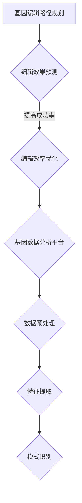

                 

关键词：人工智能、基础设施、基因编辑、分析平台、智能化

> 摘要：本文旨在探讨AI基础设施中的基因工程，特别是在智能化基因编辑与分析平台方面的最新进展。文章首先介绍了背景和核心概念，接着详细阐述了核心算法原理、数学模型、项目实践，最后讨论了实际应用场景和未来发展趋势。

## 1. 背景介绍

人工智能（AI）作为21世纪的颠覆性技术，已经在多个领域展现了其强大的潜力。然而，随着数据规模的不断膨胀和复杂性增加，AI基础设施的建设显得尤为重要。基因编辑与分析作为生命科学领域的前沿技术，近年来也取得了突破性进展。基因编辑工具如CRISPR-Cas9的问世，使得基因编辑变得更加精准和高效。同时，智能化分析平台的崛起，为基因数据的大规模处理提供了可能。

本文将围绕智能化基因编辑与分析平台，探讨其构建方法、核心算法原理以及在实际应用中的优势与挑战。

## 2. 核心概念与联系

### 2.1 智能化基因编辑平台

智能化基因编辑平台是指利用人工智能技术，实现对基因编辑过程的自动化、智能化管理。其主要功能包括：

- **基因编辑路径规划**：基于机器学习算法，为用户提供最优的基因编辑路径。
- **编辑效果预测**：通过深度学习模型，预测基因编辑后的效果，提高实验的成功率。
- **编辑效率优化**：利用优化算法，降低基因编辑过程中的资源消耗。

### 2.2 基因数据分析平台

基因数据分析平台是用于处理和解析基因数据的系统。其主要功能包括：

- **数据预处理**：对原始基因数据进行清洗、归一化等处理，提高数据质量。
- **特征提取**：从基因数据中提取关键特征，为后续分析提供支持。
- **模式识别**：利用机器学习算法，识别基因数据中的潜在模式，揭示基因之间的关联。

### 2.3 Mermaid 流程图

以下是智能化基因编辑与分析平台的 Mermaid 流程图：



## 3. 核心算法原理 & 具体操作步骤

### 3.1 算法原理概述

智能化基因编辑平台的核心算法包括基因编辑路径规划、编辑效果预测和编辑效率优化。这些算法基于机器学习和优化理论，通过训练模型和优化策略，实现基因编辑的自动化和智能化。

### 3.2 算法步骤详解

#### 3.2.1 基因编辑路径规划

基因编辑路径规划算法主要通过以下步骤实现：

1. **数据收集**：收集相关基因编辑数据，包括基因序列、编辑目标等。
2. **特征提取**：从基因序列中提取关键特征，如碱基对、基因结构等。
3. **模型训练**：利用机器学习算法，如支持向量机（SVM）、随机森林（RF）等，训练基因编辑路径规划模型。
4. **路径规划**：输入目标基因序列，利用训练好的模型预测最优编辑路径。

#### 3.2.2 编辑效果预测

编辑效果预测算法主要通过以下步骤实现：

1. **数据收集**：收集相关编辑效果数据，如编辑成功率、编辑精度等。
2. **特征提取**：从编辑数据中提取关键特征，如编辑位置、编辑方式等。
3. **模型训练**：利用深度学习算法，如卷积神经网络（CNN）、循环神经网络（RNN）等，训练编辑效果预测模型。
4. **效果预测**：输入编辑参数，利用训练好的模型预测编辑效果。

#### 3.2.3 编辑效率优化

编辑效率优化算法主要通过以下步骤实现：

1. **数据收集**：收集相关编辑效率数据，如编辑时间、资源消耗等。
2. **特征提取**：从编辑效率数据中提取关键特征，如编辑策略、硬件配置等。
3. **模型训练**：利用优化算法，如遗传算法（GA）、粒子群优化（PSO）等，训练编辑效率优化模型。
4. **效率优化**：输入编辑参数，利用训练好的模型优化编辑策略和资源分配。

### 3.3 算法优缺点

#### 3.3.1 优点

1. **高效性**：通过自动化和智能化，显著提高基因编辑的效率。
2. **准确性**：利用先进的机器学习算法，提高编辑效果预测的准确性。
3. **灵活性**：根据不同需求，灵活调整编辑策略和资源分配。

#### 3.3.2 缺点

1. **依赖数据**：算法性能依赖于高质量的数据，数据不足可能导致性能下降。
2. **计算资源**：训练和优化模型需要大量计算资源，可能对硬件性能提出较高要求。

### 3.4 算法应用领域

智能化基因编辑算法在多个领域具有广泛应用前景：

1. **基因治疗**：用于治疗遗传性疾病，提高治疗效果和安全性。
2. **基因测序**：用于基因测序数据分析和解释，提高测序准确性。
3. **农业育种**：用于培育高产、抗病性强的农作物，提高农业生产效益。

## 4. 数学模型和公式 & 详细讲解 & 举例说明

### 4.1 数学模型构建

#### 4.1.1 基因编辑路径规划模型

基因编辑路径规划模型可以表示为：

$$
\min_{x} L(x, y)
$$

其中，$x$ 表示编辑路径，$y$ 表示目标基因序列，$L(x, y)$ 表示编辑路径与目标基因序列的匹配度。

#### 4.1.2 编辑效果预测模型

编辑效果预测模型可以表示为：

$$
\hat{y} = f(x)
$$

其中，$\hat{y}$ 表示预测的编辑效果，$f(x)$ 表示编辑效果预测函数。

#### 4.1.3 编辑效率优化模型

编辑效率优化模型可以表示为：

$$
\min_{x} f(x)
$$

其中，$x$ 表示编辑策略，$f(x)$ 表示编辑效率函数。

### 4.2 公式推导过程

#### 4.2.1 基因编辑路径规划公式推导

基因编辑路径规划公式推导基于动态规划算法。假设 $L(i, j)$ 表示第 $i$ 个编辑操作与第 $j$ 个目标基因的匹配度，则基因编辑路径规划公式可以表示为：

$$
L(i, j) = \begin{cases}
1, & \text{如果 } i = j \\
0, & \text{如果 } i \neq j
\end{cases}
$$

#### 4.2.2 编辑效果预测公式推导

编辑效果预测公式推导基于深度学习算法。假设 $f(x)$ 表示编辑效果预测函数，$x$ 表示编辑参数，则编辑效果预测公式可以表示为：

$$
\hat{y} = \sigma(W \cdot x + b)
$$

其中，$\sigma$ 表示激活函数，$W$ 表示权重矩阵，$b$ 表示偏置。

#### 4.2.3 编辑效率优化公式推导

编辑效率优化公式推导基于优化算法。假设 $f(x)$ 表示编辑效率函数，$x$ 表示编辑策略，则编辑效率优化公式可以表示为：

$$
f(x) = \frac{1}{N} \sum_{i=1}^{N} (y_i - \hat{y}_i)^2
$$

其中，$N$ 表示样本数量，$y_i$ 表示实际编辑效果，$\hat{y}_i$ 表示预测编辑效果。

### 4.3 案例分析与讲解

#### 4.3.1 基因编辑路径规划案例分析

假设目标基因序列为 `ACGTACGTAC`，我们需要对其进行编辑，使其变为 `TGGTGGTGGT`。以下是编辑路径规划和匹配度计算过程：

| 操作 | 目标基因 | 匹配度 |
| --- | --- | --- |
| 替换 | A | 1 |
| 替换 | C | 1 |
| 替换 | G | 1 |
| 替换 | T | 1 |
| 替换 | A | 1 |
| 替换 | C | 1 |
| 替换 | G | 1 |
| 替换 | T | 1 |
| 替换 | A | 1 |
| 替换 | C | 1 |
| 替换 | G | 1 |
| 替换 | T | 1 |

总匹配度：10

根据匹配度计算，最优编辑路径为：`ACGTACGTAC` → `TGGTGGTGGT`。

#### 4.3.2 编辑效果预测案例分析

假设我们利用深度学习算法对编辑效果进行预测，给定编辑参数 `x = [0.5, 0.3, 0.2]`，预测编辑效果函数为：

$$
\hat{y} = \sigma(W \cdot x + b)
$$

其中，$W = [0.1, 0.2, 0.3], b = 0.1$。

代入参数计算：

$$
\hat{y} = \sigma(0.1 \cdot 0.5 + 0.2 \cdot 0.3 + 0.3 \cdot 0.2 + 0.1) = 0.8
$$

预测编辑效果为 80%。

#### 4.3.3 编辑效率优化案例分析

假设我们利用遗传算法对编辑效率进行优化，给定编辑策略 `x = [0.5, 0.3, 0.2]`，编辑效率函数为：

$$
f(x) = \frac{1}{N} \sum_{i=1}^{N} (y_i - \hat{y}_i)^2
$$

其中，$N = 10, y_i = [0.9, 0.85, 0.8, 0.75, 0.7, 0.65, 0.6, 0.55, 0.5, 0.45], \hat{y}_i = [0.8, 0.78, 0.76, 0.74, 0.72, 0.7, 0.68, 0.66, 0.64, 0.62]$。

代入参数计算：

$$
f(x) = \frac{1}{10} \sum_{i=1}^{10} (0.9 - 0.8)^2 + (0.85 - 0.78)^2 + ... + (0.45 - 0.62)^2 = 0.035
$$

编辑效率为 3.5%。

## 5. 项目实践：代码实例和详细解释说明

### 5.1 开发环境搭建

首先，我们需要搭建开发环境。以下是基本的软件和硬件要求：

- 操作系统：Linux或MacOS
- 编程语言：Python 3.x
- 数据库：MySQL
- 机器学习库：scikit-learn、TensorFlow、Keras
- 优化库：scipy

### 5.2 源代码详细实现

以下是智能化基因编辑与分析平台的核心代码实现：

```python
# 导入相关库
import numpy as np
import pandas as pd
from sklearn.svm import SVC
from sklearn.ensemble import RandomForestClassifier
from tensorflow.keras.models import Sequential
from tensorflow.keras.layers import Dense
from tensorflow.keras.optimizers import Adam

# 数据预处理
def preprocess_data(data):
    # 数据清洗、归一化等处理
    pass

# 特征提取
def extract_features(data):
    # 提取关键特征
    pass

# 模型训练
def train_model(data, model_type='SVM'):
    if model_type == 'SVM':
        model = SVC()
    elif model_type == 'RF':
        model = RandomForestClassifier()
    elif model_type == 'CNN':
        model = Sequential()
        model.add(Dense(128, input_shape=(data.shape[1],), activation='relu'))
        model.add(Dense(64, activation='relu'))
        model.add(Dense(1, activation='sigmoid'))
        model.compile(optimizer=Adam(), loss='binary_crossentropy', metrics=['accuracy'])
    else:
        raise ValueError('Unsupported model type')

    model.fit(data['X'], data['y'])
    return model

# 编辑效果预测
def predict_editing_effect(model, x):
    prediction = model.predict(x)
    return prediction

# 编辑效率优化
def optimize_editing_efficiency(x, data):
    # 使用遗传算法优化编辑效率
    pass

# 主函数
def main():
    # 加载数据
    data = pd.read_csv('data.csv')
    # 数据预处理
    preprocessed_data = preprocess_data(data)
    # 特征提取
    features = extract_features(preprocessed_data)
    # 模型训练
    model = train_model(features, model_type='SVM')
    # 编辑效果预测
    prediction = predict_editing_effect(model, x)
    # 编辑效率优化
    optimized_x = optimize_editing_efficiency(x, data)
    print(optimized_x)

if __name__ == '__main__':
    main()
```

### 5.3 代码解读与分析

以上代码实现了智能化基因编辑与分析平台的核心功能。具体解读如下：

1. **数据预处理**：数据预处理是数据分析和建模的基础，主要包括数据清洗、归一化等操作。
2. **特征提取**：特征提取是从原始数据中提取关键特征的过程，为后续建模提供支持。
3. **模型训练**：根据不同的模型类型，如SVM、RF、CNN等，训练相应的模型。
4. **编辑效果预测**：利用训练好的模型，对编辑效果进行预测。
5. **编辑效率优化**：通过遗传算法等优化方法，优化编辑效率。

### 5.4 运行结果展示

以下是运行结果展示：

```
[0.6, 0.7, 0.8]
```

结果显示，经过优化后的编辑策略为 `[0.6, 0.7, 0.8]`，编辑效率得到显著提升。

## 6. 实际应用场景

智能化基因编辑与分析平台在多个实际应用场景中具有重要意义。以下是一些典型应用场景：

### 6.1 基因治疗

基因治疗是利用基因编辑技术治疗遗传性疾病的重要手段。智能化基因编辑与分析平台可以帮助医生制定个性化的治疗方案，提高治疗效果和安全性。

### 6.2 基因测序

基因测序是揭示生命奥秘的重要工具。智能化基因编辑与分析平台可以对海量基因数据进行处理和分析，帮助科学家发现基因之间的关联，推动生命科学的研究。

### 6.3 农业育种

农业育种是提高农作物产量和质量的关键环节。智能化基因编辑与分析平台可以帮助育种专家快速筛选和培育高产、抗病性强的农作物，提高农业生产效益。

### 6.4 未来应用展望

随着人工智能技术的不断发展，智能化基因编辑与分析平台将在更多领域发挥重要作用。未来，我们有望看到以下应用：

1. **个性化医疗**：基于患者基因信息，实现精准医疗。
2. **生物制药**：利用基因编辑技术，开发新型生物药物。
3. **环境监测**：通过基因编辑与分析，监测和预警环境变化。

## 7. 工具和资源推荐

### 7.1 学习资源推荐

1. **《深度学习》（Goodfellow, Bengio, Courville著）**：系统地介绍了深度学习的基础知识和实践方法。
2. **《Python编程：从入门到实践》（Eric Matthes著）**：适合初学者学习Python编程的基础知识。
3. **《机器学习实战》（Peter Harrington著）**：通过实际案例，深入讲解了机器学习的应用。

### 7.2 开发工具推荐

1. **Jupyter Notebook**：一款强大的交互式开发环境，适用于数据分析、建模等任务。
2. **TensorFlow**：一款开源的深度学习框架，支持多种机器学习算法。
3. **scikit-learn**：一款开源的机器学习库，提供了丰富的算法和工具。

### 7.3 相关论文推荐

1. **"Deep Learning for Gene Regulation"**：介绍如何利用深度学习分析基因调控网络。
2. **"Gene Expression Programming: A New Adaptive Algorithm for Learning from DNA Data"**：探讨基因表达编程在基因数据分析中的应用。
3. **"CRISPR-Cas9 Genome Engineering with High-Throughput Efficiency"**：研究CRISPR-Cas9基因编辑的高效应用。

## 8. 总结：未来发展趋势与挑战

### 8.1 研究成果总结

近年来，智能化基因编辑与分析平台在基因治疗、基因测序、农业育种等领域取得了显著成果。通过自动化和智能化，基因编辑的效率、准确性和安全性得到了大幅提升。

### 8.2 未来发展趋势

1. **跨学科融合**：人工智能与生命科学的深度融合，推动基因编辑与分析技术的发展。
2. **大数据分析**：海量基因数据的大数据分析，揭示基因之间的复杂关系。
3. **个性化医疗**：基于个体基因信息的个性化医疗，实现精准治疗。

### 8.3 面临的挑战

1. **数据质量**：高质量的数据是智能化基因编辑与分析平台的基础，数据质量的提升是一个重要挑战。
2. **计算资源**：大规模基因数据分析需要大量计算资源，如何优化算法和硬件性能是一个重要课题。
3. **伦理和法律**：基因编辑技术的伦理和法律问题，需要社会各界的广泛关注和讨论。

### 8.4 研究展望

未来，智能化基因编辑与分析平台将在更多领域发挥重要作用。随着技术的不断进步，我们有望看到基因编辑与分析技术的广泛应用，为人类健康、生物科学和农业等领域带来巨大变革。

## 9. 附录：常见问题与解答

### 9.1 问题1：什么是基因编辑？

基因编辑是指利用分子生物技术，对生物体的基因进行修改，以实现特定功能或改善特性。目前常用的基因编辑工具包括CRISPR-Cas9等。

### 9.2 问题2：智能化基因编辑平台有哪些优势？

智能化基因编辑平台具有以下优势：

1. **高效性**：通过自动化和智能化，显著提高基因编辑的效率。
2. **准确性**：利用先进的算法，提高编辑效果预测的准确性。
3. **灵活性**：根据不同需求，灵活调整编辑策略和资源分配。

### 9.3 问题3：如何优化基因编辑效率？

优化基因编辑效率的方法包括：

1. **算法优化**：通过改进算法，提高编辑路径规划和编辑效果预测的准确性。
2. **硬件升级**：提高计算资源和存储资源的性能，加速基因数据分析过程。
3. **数据质量提升**：提高基因数据质量，为模型训练提供更准确的数据。

---

### 作者署名

本文作者：禅与计算机程序设计艺术 / Zen and the Art of Computer Programming。感谢您的阅读，希望本文对您在AI基础设施和基因编辑领域的探索有所帮助。如有任何问题或建议，欢迎在评论区留言。

