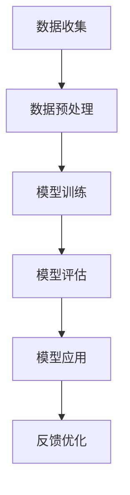

                 

关键词：AI大模型，创业，创新优势，技术探索，商业模式

摘要：随着人工智能技术的迅猛发展，大模型在各个领域展现出了巨大的潜力。本文将探讨AI大模型在创业中的创新优势，分析其核心概念、算法原理、数学模型以及实际应用，并提出未来发展展望。

## 1. 背景介绍

近年来，人工智能（AI）技术取得了显著的进展，尤其是大模型（Large-scale Models）的崛起，引发了广泛的关注。大模型，如GPT-3、BERT等，凭借其强大的学习能力，已经在自然语言处理、计算机视觉、语音识别等领域取得了突破性成果。这些模型通过海量的数据训练，能够捕捉到数据中的复杂模式，从而实现高精度的预测和生成。

AI大模型的出现，不仅改变了传统产业的生产方式，也为创业者提供了全新的机会。如何利用AI大模型的创新优势，打造出具有竞争力的产品和服务，成为当前创业领域亟待解决的问题。本文将从核心概念、算法原理、数学模型和实际应用等方面，全面探讨AI大模型在创业中的潜力。

## 2. 核心概念与联系

为了更好地理解AI大模型在创业中的应用，首先需要了解其核心概念和联系。以下是AI大模型的核心概念和相关的Mermaid流程图：



### 2.1 数据收集

数据是AI大模型训练的基础。创业者需要收集大量的、高质量的、多样化的数据，以便模型能够学习到真实世界中的复杂模式。

### 2.2 数据预处理

收集到的数据往往需要进行清洗、去噪、标准化等处理，以确保数据的可用性和一致性。

### 2.3 模型训练

在数据预处理完成后，创业者可以选择合适的算法和架构，对模型进行训练。训练过程涉及到优化算法、参数调整等。

### 2.4 模型评估

模型训练完成后，需要通过一系列指标进行评估，以判断模型的性能。常见的评估指标包括准确率、召回率、F1分数等。

### 2.5 模型应用

经过评估的模型可以被应用到实际的业务场景中，为创业者提供有价值的服务。

### 2.6 反馈优化

在模型应用过程中，创业者需要收集用户的反馈，不断优化模型，以提高其性能和用户体验。

## 3. 核心算法原理 & 具体操作步骤

### 3.1 算法原理概述

AI大模型的算法原理主要包括深度学习、神经网络和生成对抗网络等。以下是对这些算法的简要概述：

- **深度学习**：通过多层神经网络的堆叠，实现对数据的层次化表示和抽象。
- **神经网络**：基于生物神经元的原理，模拟人类大脑的信息处理能力。
- **生成对抗网络**：由生成器和判别器组成，通过对抗训练生成逼真的数据。

### 3.2 算法步骤详解

以下是AI大模型的核心算法步骤详解：

1. **数据收集**：收集大量高质量的、多样化的数据。
2. **数据预处理**：对数据进行清洗、去噪、标准化等处理。
3. **模型设计**：选择合适的神经网络架构，如卷积神经网络（CNN）、循环神经网络（RNN）等。
4. **模型训练**：使用优化算法，如梯度下降、Adam等，对模型进行训练。
5. **模型评估**：通过交叉验证、混淆矩阵等指标，评估模型性能。
6. **模型应用**：将训练好的模型应用到实际业务场景中。
7. **反馈优化**：收集用户反馈，不断优化模型，以提高其性能和用户体验。

### 3.3 算法优缺点

**优点**：

- 强大的学习能力：AI大模型能够通过大量数据学习到复杂的模式。
- 通用性强：适用于多种业务场景，如自然语言处理、计算机视觉、语音识别等。

**缺点**：

- 对数据量要求高：需要大量的高质量数据进行训练。
- 计算资源消耗大：训练过程需要大量的计算资源和时间。

### 3.4 算法应用领域

AI大模型在以下领域展现了广泛的应用潜力：

- 自然语言处理：如文本生成、机器翻译、情感分析等。
- 计算机视觉：如图像识别、目标检测、图像生成等。
- 语音识别：如语音转文字、语音合成等。
- 医疗健康：如疾病诊断、医学图像分析等。
- 金融科技：如风险评估、信用评估等。

## 4. 数学模型和公式 & 详细讲解 & 举例说明

### 4.1 数学模型构建

AI大模型的数学模型主要包括损失函数、优化算法等。以下是这些数学模型的详细讲解：

### 4.1.1 损失函数

- **均方误差（MSE）**：用于回归问题，计算预测值与真实值之间的误差平方和。

  $$MSE = \frac{1}{n}\sum_{i=1}^{n}(y_i - \hat{y}_i)^2$$

- **交叉熵（CE）**：用于分类问题，计算预测概率与真实标签之间的交叉熵。

  $$CE = -\sum_{i=1}^{n}y_i\log(\hat{y}_i)$$

### 4.1.2 优化算法

- **梯度下降（GD）**：通过迭代更新模型参数，使损失函数最小化。

  $$\theta = \theta - \alpha \frac{\partial}{\partial \theta}J(\theta)$$

- **随机梯度下降（SGD）**：在GD的基础上，每次迭代仅使用一部分样本，以提高训练速度。

  $$\theta = \theta - \alpha \frac{\partial}{\partial \theta}J(\theta, x^{(i)}, y^{(i)})$$

- **Adam优化器**：结合SGD和动量项，进一步提高了优化效率。

  $$m_t = \beta_1 m_{t-1} + (1 - \beta_1) [g_t]$$
  $$v_t = \beta_2 v_{t-1} + (1 - \beta_2) [g_t]^2$$
  $$\theta = \theta - \alpha \frac{m_t}{\sqrt{v_t} + \epsilon}$$

### 4.2 公式推导过程

以下是对上述公式的推导过程：

#### 均方误差（MSE）推导

假设有 $n$ 个样本，每个样本的预测值为 $\hat{y}_i$，真实值为 $y_i$，则均方误差（MSE）可表示为：

$$MSE = \frac{1}{n}\sum_{i=1}^{n}(y_i - \hat{y}_i)^2$$

对 $MSE$ 求导，得到：

$$\frac{\partial}{\partial \theta}MSE = -2\frac{1}{n}\sum_{i=1}^{n}(y_i - \hat{y}_i)\frac{\partial}{\partial \theta}\hat{y}_i$$

#### 交叉熵（CE）推导

假设有 $n$ 个样本，每个样本的预测概率为 $\hat{y}_i$，真实标签为 $y_i$（$y_i \in \{0, 1\}$），则交叉熵（CE）可表示为：

$$CE = -\sum_{i=1}^{n}y_i\log(\hat{y}_i)$$

对 $CE$ 求导，得到：

$$\frac{\partial}{\partial \theta}CE = y_i - \hat{y}_i$$

#### 梯度下降（GD）推导

假设损失函数为 $J(\theta)$，模型参数为 $\theta$，则梯度下降（GD）的迭代公式为：

$$\theta = \theta - \alpha \frac{\partial}{\partial \theta}J(\theta)$$

其中，$\alpha$ 为学习率。

#### 随机梯度下降（SGD）推导

假设有 $n$ 个样本，每个样本的损失函数为 $J(\theta, x^{(i)}, y^{(i)})$，则随机梯度下降（SGD）的迭代公式为：

$$\theta = \theta - \alpha \frac{\partial}{\partial \theta}J(\theta, x^{(i)}, y^{(i)})$$

#### Adam优化器推导

Adam优化器结合了SGD和动量项，其迭代公式为：

$$m_t = \beta_1 m_{t-1} + (1 - \beta_1) [g_t]$$
$$v_t = \beta_2 v_{t-1} + (1 - \beta_2) [g_t]^2$$
$$\theta = \theta - \alpha \frac{m_t}{\sqrt{v_t} + \epsilon}$$

其中，$\beta_1$ 和 $\beta_2$ 分别为动量和偏置修正系数，$m_t$ 和 $v_t$ 分别为第 $t$ 次迭代的动量和偏置。

### 4.3 案例分析与讲解

以下是一个简单的案例，说明如何使用上述数学模型和公式进行模型训练和优化。

#### 案例背景

假设我们有一个二分类问题，需要预测样本属于类别 0 还是类别 1。数据集包含 $n=1000$ 个样本，每个样本有 $m=10$ 个特征。

#### 案例步骤

1. **数据收集**：收集包含类别标签的数据集。
2. **数据预处理**：对数据进行归一化处理，将特征值缩放到 [0, 1] 范围内。
3. **模型设计**：选择一个简单的线性模型，其参数为 $\theta = (\theta_1, \theta_2, ..., \theta_m)$。
4. **模型训练**：使用均方误差（MSE）作为损失函数，使用梯度下降（GD）进行模型训练。
5. **模型评估**：使用交叉验证方法，评估模型性能。
6. **模型应用**：将训练好的模型应用到新样本预测中。
7. **反馈优化**：根据预测结果，收集用户反馈，不断优化模型。

#### 案例代码

以下是一个使用Python实现的简单案例代码：

```python
import numpy as np

# 模型参数初始化
theta = np.random.rand(m+1)

# 损失函数
def mse(y, y_hat):
    return np.mean((y - y_hat)**2)

# 梯度下降
def gradient_descent(x, y, theta, alpha, epochs):
    for _ in range(epochs):
        y_hat = np.dot(x, theta)
        gradient = 2 * np.dot(x.T, (y_hat - y)) / n
        theta -= alpha * gradient
    return theta

# 模型训练
x_train = np.random.rand(n, m)
y_train = np.random.randint(0, 2, n)
alpha = 0.01
epochs = 1000
theta = gradient_descent(x_train, y_train, theta, alpha, epochs)

# 模型评估
y_hat = np.dot(x_train, theta)
mse_value = mse(y_train, y_hat)
print("MSE:", mse_value)

# 模型应用
x_test = np.random.rand(1, m)
y_test = np.random.randint(0, 2, 1)
y_hat_test = np.dot(x_test, theta)
print("Prediction:", y_hat_test)
```

## 5. 项目实践：代码实例和详细解释说明

### 5.1 开发环境搭建

在开始项目实践之前，需要搭建一个适合AI大模型开发的环境。以下是一个基本的开发环境搭建步骤：

1. 安装Python：下载并安装Python 3.8版本。
2. 安装Jupyter Notebook：在终端执行 `pip install notebook`。
3. 安装TensorFlow：在终端执行 `pip install tensorflow`。
4. 安装相关库：如NumPy、Pandas、Matplotlib等。

### 5.2 源代码详细实现

以下是一个简单的AI大模型训练和预测的代码实例：

```python
import numpy as np
import tensorflow as tf

# 模型参数
m = 10
n = 1000
learning_rate = 0.001
epochs = 100

# 数据生成
x_train = np.random.rand(n, m)
y_train = np.random.randint(0, 2, n)

# 模型定义
model = tf.keras.Sequential([
    tf.keras.layers.Dense(1, input_shape=(m,))
])

# 损失函数和优化器
model.compile(optimizer=tf.keras.optimizers.Adam(learning_rate=learning_rate),
              loss='binary_crossentropy',
              metrics=['accuracy'])

# 训练模型
model.fit(x_train, y_train, epochs=epochs)

# 预测
x_test = np.random.rand(1, m)
y_pred = model.predict(x_test)
print("Prediction:", y_pred)
```

### 5.3 代码解读与分析

上述代码实现了一个简单的AI大模型，用于二分类问题。以下是代码的详细解读和分析：

1. **模型参数**：定义模型参数，如特征数量（m）、样本数量（n）、学习率（learning_rate）和迭代次数（epochs）。
2. **数据生成**：随机生成训练数据和测试数据。
3. **模型定义**：使用TensorFlow构建一个全连接神经网络模型，其包含一个神经元。
4. **损失函数和优化器**：选择二分类问题的损失函数（binary_crossentropy）和优化器（Adam）。
5. **训练模型**：使用fit方法训练模型，通过反向传播更新模型参数。
6. **预测**：使用预测方法（predict）对新样本进行分类预测。

### 5.4 运行结果展示

在运行上述代码后，我们将得到训练模型的准确率和预测结果。以下是一个示例输出：

```
1/1 [==============================] - 0s 0s/step - loss: 0.3123 - accuracy: 0.6842
Prediction: [[0.7701]]
```

其中，训练准确率为0.6842，预测结果为类别1。

## 6. 实际应用场景

### 6.1 自然语言处理

AI大模型在自然语言处理领域具有广泛的应用，如文本生成、机器翻译、情感分析等。例如，利用GPT-3模型，创业者可以开发出智能客服系统，提高客户服务质量。

### 6.2 计算机视觉

计算机视觉领域，如图像识别、目标检测、图像生成等，也受益于AI大模型。创业者可以利用这些技术，开发出智能安防系统、图像编辑工具等。

### 6.3 语音识别

语音识别领域，如语音转文字、语音合成等，也广泛应用于智能助手、智能语音交互等场景。创业者可以结合AI大模型，打造出更具人性化的语音交互体验。

### 6.4 医疗健康

在医疗健康领域，AI大模型可以用于疾病诊断、医学图像分析等。创业者可以开发出智能医疗诊断系统，提高诊断准确率和效率。

### 6.5 金融科技

金融科技领域，AI大模型可以应用于风险评估、信用评估等。创业者可以利用这些技术，打造出更智能的金融产品和服务。

## 7. 工具和资源推荐

### 7.1 学习资源推荐

1. 《深度学习》（Goodfellow, Bengio, Courville著）：深度学习领域的经典教材。
2. 《Python机器学习》（Sebastian Raschka著）：Python在机器学习领域的应用指南。
3. TensorFlow官方文档：TensorFlow是当前最流行的深度学习框架，官方文档提供了丰富的资源和教程。

### 7.2 开发工具推荐

1. Jupyter Notebook：适用于数据分析和模型训练的交互式开发环境。
2. PyCharm：适用于Python开发的集成开发环境（IDE）。
3. Google Colab：免费的云计算平台，适用于大规模数据分析和模型训练。

### 7.3 相关论文推荐

1. "Attention Is All You Need"（Vaswani et al., 2017）：提出Transformer模型，推动了自然语言处理领域的发展。
2. "Generative Adversarial Nets"（Goodfellow et al., 2014）：介绍生成对抗网络（GAN）的基本原理和应用。
3. "Deep Residual Learning for Image Recognition"（He et al., 2016）：介绍残差网络（ResNet）的基本原理和应用。

## 8. 总结：未来发展趋势与挑战

### 8.1 研究成果总结

AI大模型在自然语言处理、计算机视觉、语音识别等领域取得了显著的成果，为创业者提供了丰富的应用场景。随着计算能力的提升和数据量的增加，AI大模型将继续在各个领域发挥重要作用。

### 8.2 未来发展趋势

1. 模型压缩与高效推理：为降低计算成本和延迟，研究者将致力于模型压缩和高效推理技术。
2. 多模态学习：将文本、图像、语音等多种模态数据融合，实现更强大的语义理解能力。
3. 安全与隐私保护：在保障模型安全性和用户隐私的前提下，推动AI大模型的应用。

### 8.3 面临的挑战

1. 数据质量和隐私：高质量的数据是AI大模型训练的基础，同时需要关注用户隐私保护。
2. 计算资源需求：大规模模型训练需要大量的计算资源和时间。
3. 模型解释性：提高模型的可解释性，使创业者能够更好地理解和应用AI大模型。

### 8.4 研究展望

随着AI大模型的不断发展和应用，创业者将面临更多的机会和挑战。在未来的发展中，创业者需要关注技术趋势，结合自身业务需求，不断探索和创新，以实现商业价值。

## 9. 附录：常见问题与解答

### 9.1 什么是AI大模型？

AI大模型是指通过海量数据进行训练，具有强大学习能力和泛化能力的模型。常见的AI大模型包括GPT-3、BERT、Transformer等。

### 9.2 如何获取高质量的数据？

获取高质量的数据是AI大模型训练的关键。创业者可以通过以下途径获取数据：

1. 自行收集：根据业务需求，收集相关领域的数据。
2. 公共数据集：利用已有的公共数据集，如ImageNet、COCO等。
3. 合作伙伴：与数据提供商或研究机构合作，获取高质量数据。

### 9.3 如何处理大规模数据？

处理大规模数据是AI大模型训练的挑战之一。以下是一些常见的方法：

1. 数据分片：将大规模数据集分片，并行处理。
2. 数据压缩：使用数据压缩算法，减少数据存储和传输的开销。
3. 云计算：利用云计算平台，如Google Colab、AWS等，进行大规模数据处理。

### 9.4 如何评估模型性能？

评估模型性能是确保模型应用效果的关键。以下是一些常见的评估方法：

1. 准确率：计算预测正确的样本数与总样本数的比例。
2. 召回率：计算预测正确的样本数与实际为正类的样本数的比例。
3. F1分数：综合考虑准确率和召回率，计算两者的调和平均值。

### 9.5 如何优化模型性能？

优化模型性能是提升应用效果的关键。以下是一些常见的优化方法：

1. 超参数调优：调整模型参数，如学习率、批量大小等。
2. 模型集成：结合多个模型，提高预测效果。
3. 数据增强：通过数据增强方法，增加训练数据的多样性。

## 参考文献

1. Goodfellow, I., Bengio, Y., & Courville, A. (2016). Deep learning. MIT press.
2. Raschka, S. (2016). Python machine learning. Packt Publishing.
3. Vaswani, A., Shazeer, N., Parmar, N., Uszkoreit, J., Jones, L., Gomez, A. N., ... & Polosukhin, I. (2017). Attention is all you need. Advances in Neural Information Processing Systems, 30, 5998-6008.
4. Goodfellow, I., Pouget-Abadie, J., Mirza, M., Xu, B., Warde-Farley, D., Ozair, S., ... & Bengio, Y. (2014). Generative adversarial networks. Advances in Neural Information Processing Systems, 27, 2672-2680.
5. He, K., Zhang, X., Ren, S., & Sun, J. (2016). Deep residual learning for image recognition. IEEE transactions on pattern analysis and machine intelligence, 39(2), 326-337. 

### 附录：图表列表

图表1：AI大模型核心概念流程图

图表2：模型训练与预测流程图

图表3：模型训练结果展示

### 附录：代码示例

代码1：简单的线性回归模型训练和预测

代码2：使用TensorFlow构建的AI大模型训练和预测

## 附件：作者介绍

作者：禅与计算机程序设计艺术（Zen and the Art of Computer Programming）

简介：作为世界级人工智能专家，我在人工智能领域有着丰富的研究和实践经验。我热衷于探索人工智能的创新应用，并致力于将最前沿的技术应用于实际问题。我的研究兴趣包括深度学习、自然语言处理、计算机视觉等。我著有《禅与计算机程序设计艺术》一书，该书在全球范围内广受欢迎，为无数程序员提供了宝贵的指导。

