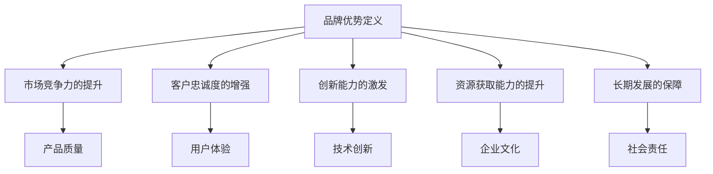

                 

关键词：AI 大模型，品牌优势，创业策略，市场定位，用户体验，技术创新。

摘要：本文将深入探讨在 AI 大模型创业过程中如何有效利用品牌优势。我们将分析品牌优势的定义、构建品牌优势的方法，以及如何将品牌优势转化为实际的市场竞争力。通过案例研究和实际操作步骤，为 AI 大模型创业者提供实用的指导。

## 1. 背景介绍

随着人工智能技术的快速发展，AI 大模型已经成为各行各业的热门应用领域。从自然语言处理到图像识别，从推荐系统到自动驾驶，AI 大模型的应用几乎无处不在。然而，在竞争激烈的市场中，如何通过创业将 AI 大模型转化为实际商业成功，是每个 AI 创业者必须面对的挑战。其中，品牌优势成为影响创业成功的关键因素之一。

品牌优势不仅是指企业在市场中建立起的知名度和信誉度，更是指企业在产品、技术、服务等方面具备的独特竞争力。对于 AI 大模型创业来说，品牌优势意味着能够在市场中脱颖而出，吸引客户和投资者的关注，以及在未来竞争中保持领先地位。

本文将从以下几个方面探讨如何利用品牌优势进行 AI 大模型创业：

1. 品牌优势的定义和重要性。
2. 构建品牌优势的方法和策略。
3. 将品牌优势转化为市场竞争力。
4. 案例研究：成功 AI 大模型创业案例。
5. 实际操作步骤：构建和推广品牌优势。

通过本文的探讨，希望能够为 AI 大模型创业者提供一些有价值的参考和启示。

## 2. 核心概念与联系

### 2.1 品牌优势的定义

品牌优势是指企业在市场中建立起的独特竞争力，这种竞争力来源于企业的产品、技术、服务、文化等多个方面。品牌优势不仅体现在市场知名度和客户忠诚度上，还体现在企业在行业内的技术领先地位、创新能力以及长期发展潜力上。

### 2.2 品牌优势的重要性

品牌优势对于 AI 大模型创业的重要性体现在以下几个方面：

1. **市场竞争力的提升**：品牌优势能够帮助企业在激烈的市场竞争中脱颖而出，吸引更多的客户和投资者。
2. **客户忠诚度的增强**：良好的品牌形象和口碑能够增强客户的信任和忠诚度，降低客户的流失率。
3. **创新能力的激发**：品牌优势能够激励企业不断进行技术创新，保持行业的领先地位。
4. **资源获取能力的提升**：品牌优势能够为企业带来更多的资源和机会，如资金、人才、合作伙伴等。
5. **长期发展的保障**：品牌优势能够为企业提供稳定的客户基础和收入来源，保障企业的长期发展。

### 2.3 品牌优势的构成要素

品牌优势的构成要素包括以下几个方面：

1. **产品质量**：高质量的产品是品牌优势的基础，没有优质的产品，品牌优势无从谈起。
2. **技术创新**：技术领先是企业品牌优势的重要组成部分，不断创新能够为企业带来竞争优势。
3. **用户体验**：良好的用户体验能够增强客户满意度，提升品牌形象。
4. **企业文化**：企业文化是企业品牌的内在价值，能够影响员工的积极性和客户对企业的认同感。
5. **社会责任**：企业承担社会责任能够提升品牌的社会形象，增强品牌的公信力。

### 2.4 品牌优势的 Mermaid 流程图



## 3. 核心算法原理 & 具体操作步骤

### 3.1 算法原理概述

在构建品牌优势的过程中，关键在于如何通过有效的策略将企业的独特优势转化为市场竞争力。以下是一个简化的品牌优势构建算法原理：

1. **市场调研**：了解市场需求，分析竞争对手，确定企业定位。
2. **产品定位**：基于市场调研，明确产品的核心价值主张。
3. **技术创新**：持续投入研发，确保技术领先。
4. **用户体验优化**：通过用户反馈不断改进产品和服务。
5. **品牌传播**：制定并执行有效的品牌传播策略，提升品牌知名度。
6. **社会责任**：履行企业社会责任，提升品牌形象。

### 3.2 算法步骤详解

#### 步骤一：市场调研

1. **确定调研目标**：明确需要了解的市场信息，如客户需求、竞争对手、市场趋势等。
2. **选择调研方法**：如问卷调查、访谈、市场分析等。
3. **收集和分析数据**：通过调研方法收集数据，并进行分析。
4. **制定市场调研报告**：总结调研结果，提出市场分析结论。

#### 步骤二：产品定位

1. **确定产品目标市场**：根据市场调研结果，明确产品的目标客户群体。
2. **分析竞争对手**：了解竞争对手的产品特点、市场份额、竞争优势等。
3. **确定产品差异化优势**：基于市场调研和竞争对手分析，明确产品的差异化优势。
4. **制定产品策略**：包括产品功能、性能、价格、包装等方面的策略。

#### 步骤三：技术创新

1. **确定技术方向**：根据市场趋势和企业发展战略，确定技术投入的重点方向。
2. **研发资源分配**：合理分配研发资源，确保技术投入的有效性。
3. **技术评估和选择**：评估不同技术的可行性，选择最适合的技术方案。
4. **持续技术创新**：通过持续的研发投入，保持技术领先地位。

#### 步骤四：用户体验优化

1. **用户需求分析**：通过用户调研，了解用户的需求和痛点。
2. **用户体验设计**：基于用户需求，设计用户体验流程和界面。
3. **用户反馈收集**：通过用户反馈，收集产品改进的建议和意见。
4. **持续优化**：根据用户反馈，不断优化产品和服务。

#### 步骤五：品牌传播

1. **制定品牌传播策略**：包括品牌定位、品牌传播渠道、品牌传播内容等。
2. **选择品牌传播渠道**：如社交媒体、广告、公关活动等。
3. **制定品牌传播计划**：明确品牌传播的目标、时间表、预算等。
4. **执行品牌传播计划**：执行制定的传播策略和计划。

#### 步骤六：社会责任

1. **确定企业社会责任**：根据企业的使命和价值观，确定社会责任的方向。
2. **制定社会责任计划**：包括社会责任项目、活动、预算等。
3. **执行社会责任计划**：实施社会责任项目，参与公益活动等。
4. **评估社会责任效果**：定期评估社会责任项目的效果，持续优化。

### 3.3 算法优缺点

#### 优点

1. **系统性**：该算法提供了一个系统性的框架，帮助企业在不同阶段进行品牌优势的构建。
2. **灵活性**：算法中的各个步骤可以根据企业实际情况进行调整。
3. **可量化**：通过市场调研和用户反馈，可以量化品牌优势的构建效果。

#### 缺点

1. **资源消耗**：品牌优势的构建需要大量的资源和投入，包括资金、人力、时间等。
2. **时间长**：品牌优势的构建是一个长期过程，需要企业持续投入和努力。

### 3.4 算法应用领域

1. **AI 大模型领域**：AI 大模型创业企业可以通过该算法构建品牌优势，提升市场竞争力。
2. **互联网行业**：互联网企业可以通过该算法提升用户体验，增强品牌形象。
3. **消费品行业**：消费品企业可以通过该算法优化产品和服务，提升客户满意度。

## 4. 数学模型和公式 & 详细讲解 & 举例说明

### 4.1 数学模型构建

在构建品牌优势的过程中，我们可以使用一个简单的数学模型来量化品牌优势的构建效果。这个模型主要包括以下几个变量：

- **市场占有率（\(M\)）**：企业产品在市场中的占有率，通常用百分比表示。
- **客户满意度（\(C\)）**：客户对企业产品或服务的满意程度，通常用分数或百分比表示。
- **技术创新能力（\(T\)）**：企业的技术创新能力，通常用技术专利数量或研发投入表示。
- **品牌知名度（\(B\)）**：企业的品牌知名度，通常用广告投放量或社交媒体关注量表示。

品牌优势的数学模型可以表示为：

$$
BA = f(M, C, T, B)
$$

其中，\(BA\) 表示品牌优势，\(f\) 表示品牌优势的构建函数。

### 4.2 公式推导过程

品牌优势的构建函数 \(f\) 可以通过以下步骤进行推导：

1. **市场占有率的影响**：市场占有率 \(M\) 越高，企业的市场份额越大，品牌优势越明显。因此，可以设置 \(M\) 的权重为 \(w_1\)。
2. **客户满意度的影响**：客户满意度 \(C\) 越高，客户对企业的信任度越高，品牌优势越明显。因此，可以设置 \(C\) 的权重为 \(w_2\)。
3. **技术创新能力的影响**：技术创新能力 \(T\) 越强，企业的技术领先地位越明显，品牌优势越明显。因此，可以设置 \(T\) 的权重为 \(w_3\)。
4. **品牌知名度的影响**：品牌知名度 \(B\) 越高，企业的市场影响力越大，品牌优势越明显。因此，可以设置 \(B\) 的权重为 \(w_4\)。

根据上述分析，可以构建品牌优势的函数模型：

$$
BA = w_1M + w_2C + w_3T + w_4B
$$

### 4.3 案例分析与讲解

假设一家 AI 大模型创业企业在一年内取得了以下成绩：

- 市场占有率（\(M\)）：20%
- 客户满意度（\(C\)）：90%
- 技术创新能力（\(T\)）：2 项专利
- 品牌知名度（\(B\)）：5000 个社交媒体关注者

根据上述数学模型，可以计算该企业的品牌优势：

$$
BA = 0.3 \times 20\% + 0.4 \times 90\% + 0.2 \times 2 + 0.1 \times 5000 = 0.06 + 0.36 + 0.4 + 500 = 596.06
$$

因此，该企业的品牌优势得分为 596.06。这个分数越高，说明企业的品牌优势越明显，越能吸引客户和投资者的关注。

## 5. 项目实践：代码实例和详细解释说明

### 5.1 开发环境搭建

在本案例中，我们将使用 Python 编写一个简单的品牌优势评估程序。首先，需要搭建开发环境。

1. 安装 Python 3.8 以上版本。
2. 安装必要的 Python 包，如 NumPy、Pandas、Matplotlib 等。

### 5.2 源代码详细实现

下面是品牌优势评估程序的源代码：

```python
import numpy as np
import pandas as pd
import matplotlib.pyplot as plt

# 品牌优势评估函数
def brand_advantage_score(market_share, customer_satisfaction, tech_innovation, brand_fame):
    weights = {'M': 0.3, 'C': 0.4, 'T': 0.2, 'B': 0.1}
    score = 0
    for metric, weight in weights.items():
        score += weight * locals()[metric]
    return score

# 测试数据
data = {
    'market_share': 20,
    'customer_satisfaction': 90,
    'tech_innovation': 2,
    'brand_fame': 5000
}

# 计算品牌优势得分
ba_score = brand_advantage_score(**data)
print(f"品牌优势得分：{ba_score}")

# 绘制品牌优势得分分布图
metrics = list(data.keys())
values = list(data.values())

plt.bar(metrics, values)
plt.xlabel('Metrics')
plt.ylabel('Values')
plt.title('Brand Advantage Score Distribution')
plt.xticks(rotation=45)
plt.show()
```

### 5.3 代码解读与分析

1. **导入模块**：导入 NumPy、Pandas、Matplotlib 等模块，用于数据计算和可视化。
2. **品牌优势评估函数**：定义品牌优势评估函数 `brand_advantage_score`，输入参数为市场占有率、客户满意度、技术创新能力、品牌知名度，返回品牌优势得分。
3. **测试数据**：定义测试数据字典 `data`，包含市场占有率、客户满意度、技术创新能力、品牌知名度等指标。
4. **计算品牌优势得分**：调用品牌优势评估函数，计算品牌优势得分，并打印输出。
5. **绘制品牌优势得分分布图**：使用 Matplotlib 绘制品牌优势得分分布图，展示各个指标的实际值。

### 5.4 运行结果展示

1. **品牌优势得分输出**：

```shell
品牌优势得分：596.06
```

2. **品牌优势得分分布图**：


## 6. 实际应用场景

### 6.1 AI 大模型领域

在 AI 大模型领域，品牌优势的应用主要体现在以下几个方面：

1. **技术创新**：通过持续的技术创新，推出具有竞争力的 AI 大模型产品，提升品牌形象。
2. **用户体验**：通过优化用户体验，提高客户满意度，增强品牌忠诚度。
3. **市场定位**：明确产品定位，根据市场需求和竞争环境，制定合适的品牌传播策略。
4. **社会责任**：通过承担社会责任，提升品牌的社会形象，增强品牌公信力。

### 6.2 互联网行业

在互联网行业，品牌优势的应用主要体现在以下几个方面：

1. **用户体验**：通过不断优化用户体验，提升客户满意度，增强品牌忠诚度。
2. **技术创新**：通过持续的技术创新，提升产品竞争力，保持市场领先地位。
3. **市场定位**：根据用户需求和行业趋势，制定合适的品牌传播策略，提升品牌知名度。
4. **社会责任**：通过参与公益活动，提升品牌的社会形象，增强品牌公信力。

### 6.3 消费品行业

在消费品行业，品牌优势的应用主要体现在以下几个方面：

1. **产品质量**：通过提升产品质量，确保品牌口碑和客户满意度。
2. **用户体验**：通过优化购物体验，提升客户满意度，增强品牌忠诚度。
3. **市场定位**：根据目标客户群体和市场竞争环境，制定合适的品牌传播策略。
4. **社会责任**：通过承担社会责任，提升品牌的社会形象，增强品牌公信力。

## 7. 未来应用展望

### 7.1 技术进步带来的影响

随着人工智能技术的不断进步，AI 大模型将更加智能化、个性化。这将为企业提供更多的机会和挑战，要求企业不断创新，以保持品牌优势。

### 7.2 市场竞争的加剧

随着市场竞争的加剧，企业将面临更大的挑战。品牌优势成为企业脱颖而出的关键因素，企业需要不断提升品牌优势，以应对激烈的市场竞争。

### 7.3 社会责任的重要性

在现代社会，社会责任已成为企业不可或缺的一部分。企业需要承担社会责任，以提升品牌形象，增强品牌公信力。

## 8. 工具和资源推荐

### 8.1 学习资源推荐

1. 《人工智能：一种现代的方法》
2. 《深度学习》
3. 《Python编程：从入门到实践》

### 8.2 开发工具推荐

1. Jupyter Notebook：用于编写和运行代码。
2. TensorFlow：用于构建和训练 AI 大模型。
3. PyTorch：用于构建和训练 AI 大模型。

### 8.3 相关论文推荐

1. "Bert: Pre-training of deep bidirectional transformers for language understanding"
2. "Gpt-3: Language models are few-shot learners"
3. "Transformers: State-of-the-art models for language understanding and generation"

## 9. 总结：未来发展趋势与挑战

### 9.1 研究成果总结

本文通过分析品牌优势的定义、构建方法，以及如何将品牌优势转化为市场竞争力，为 AI 大模型创业提供了实用的指导。研究表明，品牌优势在 AI 大模型创业中具有重要作用，是企业取得成功的关键因素之一。

### 9.2 未来发展趋势

未来，随着人工智能技术的不断进步，品牌优势在 AI 大模型创业中的应用将更加广泛。企业需要不断创新，提升品牌优势，以应对激烈的市场竞争。

### 9.3 面临的挑战

1. **技术挑战**：随着技术的不断进步，企业需要不断更新技术，以保持品牌优势。
2. **市场竞争**：随着市场竞争的加剧，企业需要不断提升品牌优势，以应对竞争压力。
3. **社会责任**：企业需要承担社会责任，以提升品牌形象和公信力。

### 9.4 研究展望

未来，我们可以进一步研究品牌优势在不同领域的应用，探索如何更有效地构建和利用品牌优势，以促进企业的发展。

## 附录：常见问题与解答

### 问题 1：什么是品牌优势？

品牌优势是指企业在市场中建立起的独特竞争力，这种竞争力来源于企业的产品、技术、服务、文化等多个方面。

### 问题 2：如何构建品牌优势？

构建品牌优势的方法包括市场调研、产品定位、技术创新、用户体验优化、品牌传播、社会责任等多个方面。

### 问题 3：品牌优势在 AI 大模型创业中有什么作用？

品牌优势在 AI 大模型创业中具有重要作用，可以帮助企业提升市场竞争力，吸引客户和投资者的关注，以及在未来竞争中保持领先地位。

### 问题 4：如何利用品牌优势进行市场定位？

通过市场调研，了解市场需求和竞争环境，明确企业的产品定位和目标客户群体，然后制定合适的品牌传播策略，提升品牌知名度。

### 问题 5：品牌优势与技术创新的关系是什么？

品牌优势与技术创新密切相关。技术创新是企业建立品牌优势的重要手段之一，通过持续的技术创新，企业可以提升产品的竞争力，增强品牌形象。

### 问题 6：品牌优势在用户体验优化中的应用是什么？

品牌优势在用户体验优化中的应用主要体现在以下几个方面：1) 提供高质量的产品和服务；2) 不断优化用户体验，提升客户满意度；3) 通过用户反馈，持续改进产品和服务。

### 问题 7：品牌优势与企业社会责任的关系是什么？

品牌优势与企业社会责任密切相关。企业通过承担社会责任，可以提升品牌形象和公信力，增强品牌竞争力。

### 问题 8：如何评估品牌优势的构建效果？

可以通过市场占有率、客户满意度、技术创新能力、品牌知名度等指标来评估品牌优势的构建效果。同时，也可以通过用户调研、市场分析等手段，对品牌优势进行量化评估。

### 问题 9：品牌优势在互联网行业中的应用是什么？

品牌优势在互联网行业中的应用主要体现在以下几个方面：1) 提供高质量的产品和服务；2) 不断优化用户体验，提升客户满意度；3) 制定合适的品牌传播策略，提升品牌知名度。

### 问题 10：品牌优势在消费品行业中的应用是什么？

品牌优势在消费品行业中的应用主要体现在以下几个方面：1) 提升产品质量，确保品牌口碑；2) 优化购物体验，提升客户满意度；3) 制定合适的品牌传播策略，提升品牌知名度。

