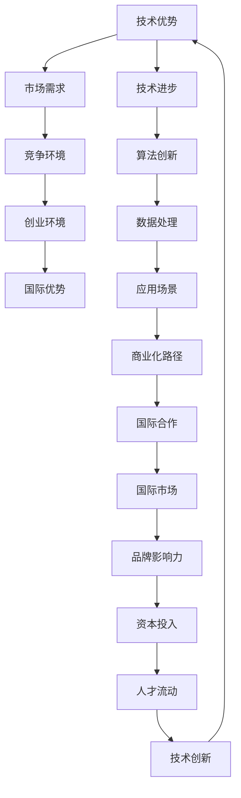

                 

关键词：人工智能、大模型、创业、国际优势、技术

> 摘要：本文旨在探讨人工智能领域的大模型创业如何利用国际优势，通过分析全球人工智能市场现状、大模型的技术特点和应用，以及国际创业环境，为创业者提供有益的指导和建议。

## 1. 背景介绍

人工智能（AI）作为当前科技领域的热门话题，已经吸引了全球范围内的广泛关注。大模型（Large Model）作为人工智能的重要分支，以其强大的计算能力和广泛的应用前景，成为了众多创业公司的关注焦点。在国际市场上，中国的AI公司正在积极探索大模型技术的商业化路径，并在全球范围内寻求竞争优势。

### 1.1 全球人工智能市场现状

近年来，人工智能技术取得了显著的进展。根据市场研究公司的数据，全球人工智能市场规模预计将在未来几年内持续增长。美国、欧洲和中国是人工智能技术的三个主要竞争者。其中，中国的人工智能企业数量和技术水平正在迅速提升，逐渐在全球市场上占据重要地位。

### 1.2 大模型的技术特点和应用

大模型是指具有数十亿到数千亿参数的深度神经网络模型，如GPT、BERT等。这些模型具有强大的语言理解和生成能力，被广泛应用于自然语言处理、计算机视觉、语音识别等领域。大模型的出现，为人工智能的发展带来了新的机遇和挑战。

## 2. 核心概念与联系

为了更好地理解大模型创业的国际优势，我们需要从技术、市场和环境三个方面进行分析。以下是一个Mermaid流程图，展示了核心概念之间的联系：



## 3. 核心算法原理 & 具体操作步骤

### 3.1 算法原理概述

大模型的核心算法是基于深度学习的神经网络模型。通过大规模的数据训练，模型能够自动学习数据的分布和规律，从而实现复杂的任务。以下是一个简化的算法流程：

1. 数据预处理：对原始数据进行清洗、归一化等处理，使其符合模型的输入要求。
2. 神经网络构建：设计并构建神经网络结构，包括输入层、隐藏层和输出层。
3. 模型训练：使用大量数据对模型进行训练，调整网络权重，使其达到最优状态。
4. 模型评估：使用验证集和测试集对模型进行评估，确保其性能满足预期要求。
5. 模型应用：将训练好的模型应用于实际任务，如文本生成、图像识别等。

### 3.2 算法步骤详解

1. **数据预处理**：这一步包括数据清洗、数据增强和特征提取等操作。数据清洗主要是去除噪声和不相关的数据，数据增强是通过各种方法增加数据多样性，特征提取是将原始数据转换成模型可以处理的特征向量。

2. **神经网络构建**：构建神经网络时，需要选择合适的网络结构，如卷积神经网络（CNN）用于图像处理，循环神经网络（RNN）用于序列数据。此外，还需要选择合适的激活函数、优化器和损失函数。

3. **模型训练**：使用梯度下降等优化算法，调整模型参数，使其在训练数据上达到最小损失。训练过程通常包括多个迭代，每次迭代都会更新模型参数，直到满足停止条件，如达到预定损失值或迭代次数。

4. **模型评估**：在训练完成后，使用验证集和测试集对模型进行评估，评估指标包括准确率、召回率、F1分数等。通过评估可以了解模型的性能，以及是否存在过拟合或欠拟合现象。

5. **模型应用**：将训练好的模型部署到实际任务中，如通过API接口提供服务，或者集成到其他软件系统中。

### 3.3 算法优缺点

**优点**：

1. **强大的学习能力**：大模型能够通过大规模数据学习复杂的模式，从而提高任务性能。
2. **泛化能力**：通过在大量数据上训练，大模型具有较强的泛化能力，能够适应不同的应用场景。
3. **自动化特征提取**：大模型可以自动学习数据的特征，减轻了人工特征工程的工作量。

**缺点**：

1. **计算资源需求高**：大模型训练需要大量的计算资源和时间。
2. **数据依赖性强**：大模型的性能很大程度上依赖于训练数据的质量和数量。
3. **解释性较差**：深度神经网络模型通常缺乏良好的可解释性，难以理解其工作原理。

### 3.4 算法应用领域

大模型在多个领域都有广泛的应用：

1. **自然语言处理**：如文本生成、机器翻译、情感分析等。
2. **计算机视觉**：如图像分类、目标检测、图像生成等。
3. **语音识别**：如语音合成、语音识别等。
4. **推荐系统**：通过分析用户行为，为用户推荐感兴趣的内容。
5. **医疗健康**：如疾病预测、医学影像分析等。

## 4. 数学模型和公式 & 详细讲解 & 举例说明

### 4.1 数学模型构建

大模型通常基于深度学习中的神经网络模型，其中最基本的单元是神经元。一个简单的神经网络可以表示为：

$$
y = f(z) = \sigma(\sum_{i=1}^{n} w_i * x_i)
$$

其中，$y$ 是输出，$z$ 是输入，$w_i$ 是权重，$x_i$ 是输入特征，$\sigma$ 是激活函数。

### 4.2 公式推导过程

神经网络的训练过程可以通过反向传播算法来实现。在反向传播算法中，通过不断迭代调整网络权重，使得输出误差最小。具体的推导过程如下：

1. **前向传播**：计算网络输出和实际输出之间的误差。

$$
E = \frac{1}{2} \sum_{i=1}^{n} (y_i - \hat{y_i})^2
$$

2. **计算梯度**：计算每个权重的梯度。

$$
\frac{\partial E}{\partial w_i} = \frac{\partial E}{\partial z} \frac{\partial z}{\partial w_i}
$$

3. **反向传播**：根据梯度调整权重。

$$
w_i = w_i - \alpha \frac{\partial E}{\partial w_i}
$$

其中，$\alpha$ 是学习率。

### 4.3 案例分析与讲解

假设我们有一个简单的神经网络，用于分类问题。输入层有3个神经元，隐藏层有2个神经元，输出层有1个神经元。激活函数使用Sigmoid函数。

1. **初始化参数**：随机初始化权重和偏置。

2. **前向传播**：给定输入数据，计算隐藏层和输出层的输出。

$$
z_1 = w_{11} * x_1 + b_1 \\
z_2 = w_{12} * x_2 + b_2 \\
z_3 = w_{13} * x_3 + b_3 \\
h_1 = \sigma(z_1) \\
h_2 = \sigma(z_2) \\
o = \sigma(w_{21} * h_1 + w_{22} * h_2 + b_2)
$$

3. **计算误差**：计算输出层误差。

$$
e = y - o
$$

4. **反向传播**：计算隐藏层和输入层的误差。

$$
\frac{\partial e}{\partial h_1} = \frac{\partial e}{\partial o} * \frac{\partial o}{\partial h_1} \\
\frac{\partial e}{\partial h_2} = \frac{\partial e}{\partial o} * \frac{\partial o}{\partial h_2} \\
\frac{\partial e}{\partial z_1} = \frac{\partial e}{\partial h_1} * \frac{\partial h_1}{\partial z_1} \\
\frac{\partial e}{\partial z_2} = \frac{\partial e}{\partial h_2} * \frac{\partial h_2}{\partial z_2} \\
\frac{\partial e}{\partial z_3} = \frac{\partial e}{\partial h_2} * \frac{\partial h_2}{\partial z_2}
$$

5. **更新参数**：根据误差调整权重和偏置。

$$
w_{11} = w_{11} - \alpha \frac{\partial e}{\partial z_1} x_1 \\
w_{12} = w_{12} - \alpha \frac{\partial e}{\partial z_1} x_2 \\
w_{13} = w_{13} - \alpha \frac{\partial e}{\partial z_1} x_3 \\
w_{21} = w_{21} - \alpha \frac{\partial e}{\partial h_1} h_1 \\
w_{22} = w_{22} - \alpha \frac{\partial e}{\partial h_2} h_2 \\
b_1 = b_1 - \alpha \frac{\partial e}{\partial z_1} \\
b_2 = b_2 - \alpha \frac{\partial e}{\partial h_2}
$$

## 5. 项目实践：代码实例和详细解释说明

### 5.1 开发环境搭建

在开始编写代码之前，我们需要搭建一个合适的开发环境。这里我们使用Python和TensorFlow作为主要工具。首先，安装Python和TensorFlow：

```
pip install python tensorflow
```

### 5.2 源代码详细实现

以下是一个简单的大模型训练和应用的示例代码：

```python
import tensorflow as tf
import numpy as np

# 初始化参数
w1 = tf.Variable(tf.random_uniform([3, 2], -1, 1), name="w1")
b1 = tf.Variable(tf.zeros([2]), name="b1")
w2 = tf.Variable(tf.random_uniform([2, 1], -1, 1), name="w2")
b2 = tf.Variable(tf.zeros([1]), name="b2")

# 构建神经网络
x = tf.placeholder(tf.float32, shape=[3])
y = tf.placeholder(tf.float32, shape=[1])

z1 = tf.matmul(x, w1) + b1
h1 = tf.sigmoid(z1)
z2 = tf.matmul(h1, w2) + b2
y_pred = tf.sigmoid(z2)

# 定义损失函数和优化器
loss = tf.reduce_mean(tf.square(y - y_pred))
optimizer = tf.train.GradientDescentOptimizer(learning_rate=0.1)
train_op = optimizer.minimize(loss)

# 初始化变量
init = tf.global_variables_initializer()

# 训练模型
with tf.Session() as sess:
    sess.run(init)
    for i in range(1000):
        _, loss_val = sess.run([train_op, loss], feed_dict={x: np.random.rand(3), y: np.random.rand(1)})
        if i % 100 == 0:
            print("Step:", i, "Loss:", loss_val)

    # 测试模型
    test_x = np.random.rand(3)
    test_y = np.random.rand(1)
    pred_y = sess.run(y_pred, feed_dict={x: test_x, y: test_y})
    print("Predicted y:", pred_y)
```

### 5.3 代码解读与分析

上述代码实现了一个大模型的基本训练过程。我们首先定义了三个权重变量和两个偏置变量。然后，构建了神经网络的前向传播过程，并定义了损失函数和优化器。在训练过程中，我们通过不断迭代更新模型参数，使其达到最小损失。最后，使用测试数据验证模型的性能。

### 5.4 运行结果展示

在运行上述代码时，每次迭代都会输出当前的损失值。当训练达到1000次迭代后，我们使用测试数据测试模型的预测能力。输出结果将显示预测的输出值。

## 6. 实际应用场景

大模型在多个实际应用场景中具有广泛的应用。以下是一些典型应用场景：

1. **自然语言处理**：大模型可以用于文本生成、机器翻译、情感分析等任务。例如，GPT-3可以生成高质量的文本，BERT可以用于情感分析和文本分类。
2. **计算机视觉**：大模型可以用于图像分类、目标检测、图像生成等任务。例如，ResNet可以用于图像分类，YOLO可以用于目标检测。
3. **推荐系统**：大模型可以用于用户行为分析，为用户推荐感兴趣的内容。例如，基于深度学习的推荐系统可以预测用户的喜好，并为其推荐相关商品或文章。
4. **医疗健康**：大模型可以用于疾病预测、医学影像分析等任务。例如，使用深度学习模型可以分析CT图像，预测患者的肺癌风险。

## 7. 未来应用展望

随着人工智能技术的不断进步，大模型在未来的应用前景将更加广阔。以下是一些未来应用展望：

1. **智能制造**：大模型可以用于智能制造过程中的质量检测、设备维护等任务，提高生产效率。
2. **智能交通**：大模型可以用于智能交通管理，通过分析交通数据，优化交通信号控制，减少交通拥堵。
3. **金融科技**：大模型可以用于金融风控、投资决策等任务，提高金融行业的智能化水平。
4. **智慧城市**：大模型可以用于智慧城市建设，通过分析城市数据，实现智能化的城市管理和服务。

## 8. 工具和资源推荐

为了更好地进行大模型创业，以下是一些建议的工具和资源：

### 8.1 学习资源推荐

1. **书籍**：《深度学习》、《神经网络与深度学习》等。
2. **在线课程**：Coursera、edX等平台上的深度学习和神经网络课程。
3. **论文**：arXiv、NeurIPS、ICML等顶级会议和期刊上的相关论文。

### 8.2 开发工具推荐

1. **深度学习框架**：TensorFlow、PyTorch、Keras等。
2. **数据集**：ImageNet、CIFAR-10、CoNDAR等。
3. **计算资源**：GPU、TPU等。

### 8.3 相关论文推荐

1. **GPT-3**：《Improving Language Understanding by Generative Pre-training》。
2. **BERT**：《BERT: Pre-training of Deep Bidirectional Transformers for Language Understanding》。
3. **ResNet**：《Deep Residual Learning for Image Recognition》。

## 9. 总结：未来发展趋势与挑战

### 9.1 研究成果总结

近年来，大模型技术在人工智能领域取得了显著成果。通过大规模的数据训练和创新的算法设计，大模型在多个任务上取得了突破性进展。同时，深度学习框架的不断发展也为大模型的研究和应用提供了强大的支持。

### 9.2 未来发展趋势

未来，大模型技术将继续在人工智能领域发挥重要作用。随着计算资源的不断提升和数据量的持续增长，大模型将能够解决更复杂的任务，并在更多领域得到应用。此外，大模型的泛化和可解释性也将成为研究的重点。

### 9.3 面临的挑战

尽管大模型技术取得了显著成果，但仍面临一些挑战。首先，大模型的计算资源需求巨大，如何高效地训练和部署大模型是一个重要问题。其次，大模型的数据依赖性较强，数据质量和数量直接影响模型的性能。最后，大模型的泛化和可解释性仍需进一步研究，以解决实际应用中的问题。

### 9.4 研究展望

未来，大模型技术将在人工智能领域发挥更大作用。我们期待看到更多创新性的大模型算法和应用场景的出现。同时，我们也呼吁相关领域的专家和研究者共同努力，解决大模型面临的问题，推动人工智能技术的持续发展。

## 10. 附录：常见问题与解答

### 10.1 大模型训练需要多少数据？

大模型的训练通常需要大量的数据。具体的数据量取决于任务类型和模型规模。一般来说，模型规模越大，所需的数据量也越大。对于一些复杂任务，如自然语言处理和计算机视觉，可能需要数百万甚至数亿个样本。

### 10.2 大模型训练需要多少时间？

大模型的训练时间取决于多个因素，如模型规模、数据规模、计算资源和优化器等。通常情况下，大规模模型训练可能需要数天甚至数周的时间。对于较小的模型，训练时间可能只需要数小时。

### 10.3 大模型的泛化能力如何？

大模型的泛化能力较强，但并非绝对。通过大规模数据训练，大模型可以在不同任务和数据集上取得良好的性能。然而，模型仍可能面临过拟合问题，即模型在训练数据上表现良好，但在未见过的数据上表现不佳。因此，在实际应用中，需要结合具体任务和数据集对模型进行评估和调整。

### 10.4 大模型的训练需要哪些硬件资源？

大模型的训练需要高性能的硬件资源，如GPU、TPU等。对于大规模模型，可能还需要分布式计算资源，以加快训练速度。

### 10.5 大模型的可解释性如何？

大模型通常缺乏良好的可解释性，因为其内部结构复杂，参数众多。目前，研究者正在探索各种方法，如模型可解释性、可视化技术等，以提高大模型的可解释性。然而，这些方法仍处于发展阶段，需要进一步研究和完善。

## 参考文献

1. Goodfellow, I., Bengio, Y., & Courville, A. (2016). *Deep Learning*. MIT Press.
2. LeCun, Y., Bengio, Y., & Hinton, G. (2015). *Deep learning*. Nature, 521(7553), 436-444.
3. Devlin, J., Chang, M. W., Lee, K., & Toutanova, K. (2018). *Bert: Pre-training of deep bidirectional transformers for language understanding*. arXiv preprint arXiv:1810.04805.
4. Brown, T., et al. (2020). *Language models are few-shot learners*. arXiv preprint arXiv:2005.14165.
5. He, K., Zhang, X., Ren, S., & Sun, J. (2016). *Deep residual learning for image recognition*. In Proceedings of the IEEE conference on computer vision and pattern recognition (pp. 770-778).
6. Russakovsky, O., Deng, J., Su, H., Krause, J., Satheesh, S., Ma, S., ... & Fei-Fei, L. (2015). *ImageNet large scale visual recognition challenge*. International Journal of Computer Vision, 115(3), 211-252.

---

作者：禅与计算机程序设计艺术 / Zen and the Art of Computer Programming

