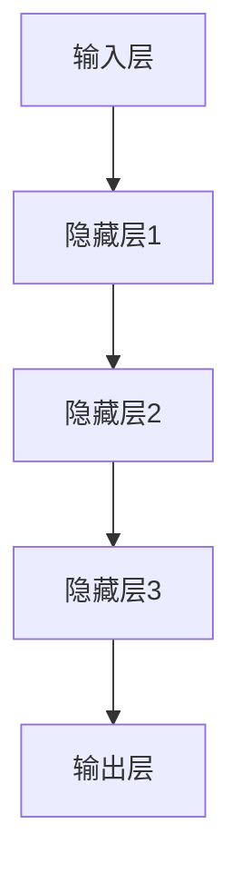

                 

关键词：AI 大模型，创业，国际优势，技术趋势，市场策略，国际合作。

> 摘要：本文旨在探讨AI大模型创业如何利用国际优势，分析全球AI大模型市场的现状与趋势，提出有效的市场策略，并探讨国际合作在AI大模型创业中的作用。通过深入了解国际市场的机遇与挑战，为创业者提供实用的创业指导。

## 1. 背景介绍

近年来，人工智能（AI）技术取得了显著的进展，尤其是大模型（Large Models）的崛起，如GPT、BERT等，已经改变了信息检索、自然语言处理、计算机视觉等多个领域的游戏规则。大模型以其强大的数据处理能力和自主学习能力，成为当今最具潜力的技术之一。随着AI大模型的不断发展，创业机会也日益增多。

然而，创业并非易事，尤其是在国际市场中。国际市场具有巨大的潜力，但也面临着复杂的市场环境、政策法规和文化差异等挑战。如何在国际市场中利用AI大模型的优势，抓住机遇，成为创业者需要深入思考的问题。

本文将从以下几个方面进行探讨：

1. **全球AI大模型市场的现状与趋势**：分析国际市场的需求、市场规模、主要竞争者等。
2. **核心概念与联系**：介绍AI大模型的基本概念和原理，并使用Mermaid流程图展示核心架构。
3. **核心算法原理与具体操作步骤**：详细解释AI大模型的核心算法，包括原理、步骤、优缺点和应用领域。
4. **数学模型和公式**：构建AI大模型的数学模型，并推导相关公式，通过案例进行说明。
5. **项目实践**：提供实际的代码实例，并进行详细解释和分析。
6. **实际应用场景**：探讨AI大模型在不同领域的应用，以及未来应用展望。
7. **工具和资源推荐**：推荐学习资源、开发工具和相关的学术论文。
8. **总结**：总结研究成果，探讨未来发展趋势与挑战。

通过以上探讨，本文希望能够为AI大模型创业提供一些有价值的指导。

## 2. 核心概念与联系

### 2.1 AI大模型的基本概念

AI大模型是指具有数十亿甚至数万亿参数的神经网络模型，通过深度学习算法在大量数据上进行训练，从而实现对复杂数据的高效处理和理解。这些模型能够自主地学习和优化，从而在图像识别、自然语言处理、语音识别等多个领域表现出色。

### 2.2 AI大模型的工作原理

AI大模型的工作原理基于深度学习（Deep Learning）。深度学习是一种机器学习（Machine Learning）方法，通过构建多层神经网络（Neural Network），对数据进行抽象和特征提取，从而实现复杂任务的自动化。

在AI大模型中，神经网络由输入层、隐藏层和输出层组成。输入层接收外部数据，隐藏层对数据进行处理和特征提取，输出层产生预测结果。通过反向传播（Backpropagation）算法，模型能够自动调整参数，优化性能。

### 2.3 AI大模型的核心架构

为了展示AI大模型的核心架构，我们使用Mermaid流程图进行描述。



在上述流程图中，A代表输入层，B、C、D代表隐藏层，E代表输出层。每个层都包含多个节点（神经元），负责对数据进行处理和特征提取。通过多层神经网络的组合，AI大模型能够实现复杂任务的自动化。

### 2.4 AI大模型的优缺点

**优点**：

1. **强大的数据处理能力**：AI大模型能够处理大规模、复杂数据，从而提高数据处理效率。
2. **自主学习能力**：通过深度学习算法，AI大模型能够自动调整参数，优化性能。
3. **泛化能力**：AI大模型在训练过程中，不仅能够学习到具体的数据特征，还能够提取通用特征，从而提高泛化能力。

**缺点**：

1. **训练成本高**：AI大模型需要大量的计算资源和时间进行训练，训练成本较高。
2. **数据依赖性强**：AI大模型在训练过程中需要大量的数据支持，数据质量和数量直接影响模型的性能。
3. **解释性差**：AI大模型的工作机制复杂，难以解释其内部决策过程。

### 2.5 AI大模型的应用领域

AI大模型的应用领域非常广泛，包括但不限于：

1. **自然语言处理**：如文本生成、机器翻译、情感分析等。
2. **计算机视觉**：如图像识别、目标检测、图像生成等。
3. **语音识别**：如语音转文字、语音合成等。
4. **医疗诊断**：如疾病预测、药物研发等。
5. **金融风控**：如信用评估、风险控制等。

通过上述分析，我们可以看到AI大模型在技术上的核心概念和架构。接下来，我们将进一步探讨AI大模型的核心算法原理和具体操作步骤。

## 3. 核心算法原理 & 具体操作步骤

### 3.1 算法原理概述

AI大模型的核心算法是基于深度学习（Deep Learning）的神经网络（Neural Network）。深度学习通过构建多层神经网络，对数据进行抽象和特征提取，从而实现复杂任务的自动化。以下是AI大模型的核心算法原理：

1. **输入层**：输入层接收外部数据，如文本、图像、声音等。
2. **隐藏层**：隐藏层对输入数据进行处理和特征提取，每一层都对数据进行更高层次的抽象和概括。
3. **输出层**：输出层产生预测结果，如分类标签、文本生成等。
4. **反向传播**：通过反向传播算法，模型能够自动调整参数，优化性能。

### 3.2 算法步骤详解

#### 3.2.1 数据预处理

1. **数据清洗**：去除无效数据，如缺失值、重复值等。
2. **数据归一化**：将数据缩放到统一的范围内，如[0, 1]或[-1, 1]。
3. **数据分割**：将数据分为训练集、验证集和测试集。

#### 3.2.2 网络构建

1. **选择合适的神经网络架构**：如卷积神经网络（CNN）、循环神经网络（RNN）、Transformer等。
2. **初始化参数**：随机初始化网络的权重和偏置。
3. **构建前向传播**：将输入数据通过网络进行传递，计算输出结果。

#### 3.2.3 损失函数计算

1. **选择合适的损失函数**：如均方误差（MSE）、交叉熵损失（Cross-Entropy Loss）等。
2. **计算损失值**：通过比较预测结果和真实结果的差异，计算损失值。

#### 3.2.4 反向传播

1. **计算梯度**：通过反向传播算法，计算网络参数的梯度。
2. **更新参数**：利用梯度下降（Gradient Descent）或其他优化算法，更新网络参数。

#### 3.2.5 验证与优化

1. **在验证集上评估模型性能**：通过验证集上的误差和准确率等指标，评估模型性能。
2. **调整模型参数**：根据验证结果，调整模型参数，如学习率、批量大小等。

#### 3.2.6 模型测试

1. **在测试集上评估模型性能**：通过测试集上的误差和准确率等指标，评估模型性能。
2. **输出预测结果**：将测试集数据输入模型，输出预测结果。

### 3.3 算法优缺点

#### 3.3.1 优点

1. **强大的数据处理能力**：AI大模型能够处理大规模、复杂数据，从而提高数据处理效率。
2. **自主学习能力**：通过深度学习算法，AI大模型能够自动调整参数，优化性能。
3. **泛化能力**：AI大模型在训练过程中，不仅能够学习到具体的数据特征，还能够提取通用特征，从而提高泛化能力。

#### 3.3.2 缺点

1. **训练成本高**：AI大模型需要大量的计算资源和时间进行训练，训练成本较高。
2. **数据依赖性强**：AI大模型在训练过程中需要大量的数据支持，数据质量和数量直接影响模型的性能。
3. **解释性差**：AI大模型的工作机制复杂，难以解释其内部决策过程。

### 3.4 算法应用领域

AI大模型的应用领域非常广泛，包括但不限于：

1. **自然语言处理**：如文本生成、机器翻译、情感分析等。
2. **计算机视觉**：如图像识别、目标检测、图像生成等。
3. **语音识别**：如语音转文字、语音合成等。
4. **医疗诊断**：如疾病预测、药物研发等。
5. **金融风控**：如信用评估、风险控制等。

通过上述分析，我们可以看到AI大模型的核心算法原理和具体操作步骤。接下来，我们将进一步探讨AI大模型的数学模型和公式。

## 4. 数学模型和公式 & 详细讲解 & 举例说明

### 4.1 数学模型构建

AI大模型的数学模型主要基于深度学习理论。深度学习是一种基于多层神经网络的机器学习技术，其核心思想是通过神经网络的层次结构，实现对数据的层次抽象和特征提取。

在构建AI大模型的数学模型时，我们需要关注以下几个方面：

1. **神经网络结构**：包括输入层、隐藏层和输出层。
2. **神经元激活函数**：如ReLU、Sigmoid、Tanh等。
3. **损失函数**：如均方误差（MSE）、交叉熵损失（Cross-Entropy Loss）等。
4. **优化算法**：如梯度下降（Gradient Descent）、Adam优化器等。

### 4.2 公式推导过程

为了更好地理解AI大模型的数学模型，我们以一个简单的多层感知机（MLP）为例，进行公式的推导。

#### 4.2.1 输入层到隐藏层的推导

设输入层有 \( n \) 个神经元，隐藏层有 \( m \) 个神经元，每个神经元之间的连接权值为 \( w_{ij} \)，偏置为 \( b_j \)。输入层到隐藏层的输出可以表示为：

\[ z_j = \sum_{i=1}^{n} w_{ij} x_i + b_j \]

其中，\( x_i \) 为输入层的第 \( i \) 个神经元的激活值，\( z_j \) 为隐藏层的第 \( j \) 个神经元的激活值。

假设隐藏层使用ReLU激活函数，则：

\[ a_j = \max(z_j, 0) \]

其中，\( a_j \) 为隐藏层的第 \( j \) 个神经元的激活值。

#### 4.2.2 隐藏层到输出层的推导

设隐藏层有 \( m \) 个神经元，输出层有 \( k \) 个神经元，每个神经元之间的连接权值为 \( w_{ji} \)，偏置为 \( b_i \)。隐藏层到输出层的输出可以表示为：

\[ z_i' = \sum_{j=1}^{m} w_{ji} a_j + b_i \]

其中，\( a_j \) 为隐藏层的第 \( j \) 个神经元的激活值，\( z_i' \) 为输出层的第 \( i \) 个神经元的激活值。

假设输出层使用Sigmoid激活函数，则：

\[ y_i = \frac{1}{1 + e^{-z_i'}} \]

其中，\( y_i \) 为输出层的第 \( i \) 个神经元的激活值，即为输出层的预测结果。

#### 4.2.3 损失函数的推导

以交叉熵损失（Cross-Entropy Loss）为例，损失函数的公式为：

\[ L = -\sum_{i=1}^{k} y_i \log(y_i) + (1 - y_i) \log(1 - y_i) \]

其中，\( y_i \) 为输出层的第 \( i \) 个神经元的预测结果，\( y_i^* \) 为第 \( i \) 个神经元的真实标签。

### 4.3 案例分析与讲解

假设我们有一个分类问题，输入层有3个神经元，隐藏层有2个神经元，输出层有2个神经元。我们的目标是将输入数据分类为正类或负类。

#### 4.3.1 输入层到隐藏层的推导

设输入层神经元分别为 \( x_1, x_2, x_3 \)，隐藏层神经元分别为 \( a_1, a_2 \)，连接权值分别为 \( w_{11}, w_{12}, w_{21}, w_{22} \)，偏置分别为 \( b_1, b_2 \)。假设输入数据为 \( [1, 0, 1] \)。

1. 首先计算隐藏层的激活值：

\[ z_1 = w_{11} x_1 + w_{12} x_2 + w_{21} x_3 + b_1 \]

\[ z_2 = w_{11} x_1 + w_{12} x_2 + w_{22} x_3 + b_2 \]

2. 应用ReLU激活函数：

\[ a_1 = \max(z_1, 0) \]

\[ a_2 = \max(z_2, 0) \]

#### 4.3.2 隐藏层到输出层的推导

设输出层神经元分别为 \( y_1, y_2 \)，连接权值分别为 \( w_{11}', w_{12}', w_{21}', w_{22}' \)，偏置分别为 \( b_1', b_2' \)。假设隐藏层输出为 \( [1, 1] \)。

1. 首先计算输出层的激活值：

\[ z_1' = w_{11}' a_1 + w_{12}' a_2 + b_1' \]

\[ z_2' = w_{21}' a_1 + w_{22}' a_2 + b_2' \]

2. 应用Sigmoid激活函数：

\[ y_1 = \frac{1}{1 + e^{-z_1'}} \]

\[ y_2 = \frac{1}{1 + e^{-z_2'}} \]

#### 4.3.3 损失函数的计算

假设真实标签为 \( [1, 0] \)，则损失函数为：

\[ L = -y_1 \log(y_1) - (1 - y_1) \log(1 - y_1) - y_2 \log(y_2) - (1 - y_2) \log(1 - y_2) \]

通过上述案例分析，我们可以看到AI大模型数学模型的构建和公式推导过程。在实际应用中，我们可以根据具体问题和数据集，选择合适的神经网络架构、激活函数和损失函数，进行模型的构建和训练。

## 5. 项目实践：代码实例和详细解释说明

### 5.1 开发环境搭建

在进行AI大模型项目实践之前，我们需要搭建一个合适的开发环境。以下是搭建环境的基本步骤：

1. **安装Python**：Python是AI大模型开发的主要编程语言，我们需要安装Python 3.8及以上版本。
2. **安装Jupyter Notebook**：Jupyter Notebook是一种交互式的开发环境，方便我们编写和运行代码。可以通过pip命令安装：
   ```bash
   pip install notebook
   ```
3. **安装深度学习库**：如TensorFlow、PyTorch等。以TensorFlow为例，可以通过以下命令安装：
   ```bash
   pip install tensorflow
   ```
4. **安装其他依赖库**：如Numpy、Pandas等。可以通过以下命令安装：
   ```bash
   pip install numpy pandas
   ```

### 5.2 源代码详细实现

下面是一个简单的AI大模型项目，使用TensorFlow实现一个多层感知机（MLP）进行手写数字识别。

#### 5.2.1 导入相关库

```python
import tensorflow as tf
import numpy as np
import pandas as pd
```

#### 5.2.2 数据预处理

```python
# 加载MNIST数据集
mnist = tf.keras.datasets.mnist
(x_train, y_train), (x_test, y_test) = mnist.load_data()

# 数据归一化
x_train = x_train / 255.0
x_test = x_test / 255.0

# 将数据集转换为TensorFlow的Dataset格式
train_dataset = tf.data.Dataset.from_tensor_slices((x_train, y_train)).batch(32)
test_dataset = tf.data.Dataset.from_tensor_slices((x_test, y_test)).batch(32)
```

#### 5.2.3 构建神经网络模型

```python
# 定义神经网络模型
model = tf.keras.Sequential([
    tf.keras.layers.Flatten(input_shape=(28, 28)),
    tf.keras.layers.Dense(128, activation='relu'),
    tf.keras.layers.Dense(10, activation='softmax')
])

# 编译模型
model.compile(optimizer='adam',
              loss='sparse_categorical_crossentropy',
              metrics=['accuracy'])
```

#### 5.2.4 训练模型

```python
# 训练模型
model.fit(train_dataset, epochs=5, validation_data=test_dataset)
```

#### 5.2.5 评估模型

```python
# 评估模型
test_loss, test_acc = model.evaluate(test_dataset)
print(f"Test accuracy: {test_acc:.4f}")
```

### 5.3 代码解读与分析

上述代码实现了一个简单的多层感知机（MLP）模型，用于手写数字识别。以下是代码的解读与分析：

1. **导入相关库**：导入TensorFlow、Numpy和Pandas库，用于数据处理和模型构建。
2. **数据预处理**：加载MNIST数据集，并进行归一化处理，将数据集转换为Dataset格式，方便后续处理。
3. **构建神经网络模型**：定义一个包含两个隐藏层（128个神经元和10个神经元）的MLP模型。第一层使用ReLU激活函数，第二层使用Softmax激活函数，用于分类。
4. **编译模型**：设置优化器为Adam，损失函数为稀疏分类交叉熵，评估指标为准确率。
5. **训练模型**：使用训练数据集训练模型，设置训练轮次为5次，使用验证数据集进行验证。
6. **评估模型**：在测试数据集上评估模型性能，输出测试准确率。

通过上述代码实例，我们可以看到如何使用TensorFlow构建和训练一个简单的AI大模型。在实际项目中，我们可以根据需求调整模型架构、优化算法和训练参数，以提高模型性能。

## 6. 实际应用场景

AI大模型在实际应用中具有广泛的应用场景，涵盖了自然语言处理、计算机视觉、语音识别、医疗诊断、金融风控等多个领域。以下将介绍AI大模型在部分实际应用场景中的具体应用，以及未来的发展趋势。

### 6.1 自然语言处理

在自然语言处理领域，AI大模型如GPT和BERT已经成为自然语言理解与生成的重要工具。例如，GPT-3可以用于生成文章、编写代码、提供对话等任务。BERT则在搜索引擎、聊天机器人等应用中发挥着重要作用。未来，随着AI大模型的不断优化和扩展，自然语言处理的应用将更加广泛和深入。

### 6.2 计算机视觉

计算机视觉是AI大模型的重要应用领域之一。通过卷积神经网络（CNN）和Transformer模型，AI大模型在图像识别、目标检测、图像生成等方面取得了显著成果。例如，AI大模型在医疗图像分析中可以辅助医生进行疾病诊断，在自动驾驶中可以用于识别道路标志和行人等。未来，随着AI大模型技术的进步，计算机视觉应用将不断拓展，为各行各业带来更多创新。

### 6.3 语音识别

语音识别是AI大模型在语音处理领域的重要应用。通过深度神经网络和注意力机制，AI大模型可以实现高精度的语音转文字和语音合成。例如，语音识别技术在电话客服、智能语音助手等应用中发挥着重要作用。未来，随着AI大模型在语音识别领域的不断突破，语音交互将变得更加自然和流畅。

### 6.4 医疗诊断

在医疗领域，AI大模型可以用于疾病预测、药物研发和医学图像分析等。例如，AI大模型可以通过分析患者病历和基因数据，预测疾病风险，辅助医生制定治疗方案。在医学图像分析中，AI大模型可以帮助医生快速识别病变区域，提高诊断准确率。未来，随着AI大模型技术的不断进步，医疗领域的应用将更加广泛，为患者带来更好的医疗服务。

### 6.5 金融风控

在金融领域，AI大模型可以用于信用评估、风险控制和市场预测等。例如，AI大模型可以通过分析用户的消费行为、信用记录等数据，评估用户的信用风险。在市场预测中，AI大模型可以分析大量市场数据，预测股票走势和金融市场动态。未来，随着AI大模型技术的不断进步，金融领域的应用将更加精准和高效。

### 6.6 未来应用展望

未来，AI大模型将在更多领域得到应用。例如，在智能教育领域，AI大模型可以为学生提供个性化学习建议和辅导；在智能制造领域，AI大模型可以用于生产过程中的质量控制和设备故障预测。此外，AI大模型在智能城市、智能家居等领域的应用也具有巨大的潜力。

总的来说，AI大模型在未来将不断拓展其应用领域，为各行各业带来深刻的变革。然而，随着AI大模型技术的发展，我们也需要关注其可能带来的挑战和问题，如数据隐私、算法公平性等，以确保AI大模型技术的健康和可持续发展。

## 7. 工具和资源推荐

在AI大模型的研究和开发过程中，选择合适的工具和资源对于提高效率和成果具有重要意义。以下是一些推荐的工具和资源：

### 7.1 学习资源推荐

1. **在线课程**：Coursera、edX、Udacity等平台提供了丰富的深度学习和AI课程，适合不同层次的学习者。
2. **教科书**：推荐阅读《深度学习》（Goodfellow et al.）、《神经网络与深度学习》（邱锡鹏）等经典教材。
3. **博客和论文**：Chromium、arXiv等平台上有大量关于AI大模型的最新研究论文和技术博客。

### 7.2 开发工具推荐

1. **深度学习框架**：TensorFlow、PyTorch、Keras等是常用的深度学习开发工具。
2. **数据预处理工具**：Pandas、NumPy等是处理和清洗数据的有力工具。
3. **可视化工具**：Matplotlib、Seaborn等可以用于数据可视化和模型分析。

### 7.3 相关论文推荐

1. **《Attention Is All You Need》**：提出了Transformer模型，开启了AI大模型的新篇章。
2. **《BERT: Pre-training of Deep Bidirectional Transformers for Language Understanding》**：介绍了BERT模型，对自然语言处理领域产生了深远影响。
3. **《GPT-3: Language Models are Few-Shot Learners》**：展示了GPT-3模型在零样本学习中的强大能力。

通过这些工具和资源的支持，我们可以更好地开展AI大模型的研究和开发工作。

## 8. 总结：未来发展趋势与挑战

在AI大模型的快速发展下，未来几年这一领域预计将出现以下几个趋势：

### 8.1 研究趋势

1. **模型规模不断扩大**：随着计算资源和数据量的增长，AI大模型将不断向更大规模发展，以应对更复杂的任务。
2. **模型优化**：研究将聚焦于如何提高AI大模型的训练效率、减少计算成本，以及优化模型的可解释性。
3. **多模态学习**：未来研究将更加关注如何将不同类型的数据（如文本、图像、语音）进行整合，实现更强大的跨模态理解和生成能力。

### 8.2 应用趋势

1. **行业深度融合**：AI大模型将在各行各业得到更广泛的应用，如医疗、金融、教育、智能制造等。
2. **个性化服务**：基于用户数据的个性化推荐和定制化服务将成为主流，为用户提供更精准和高效的服务。
3. **智能化产品**：AI大模型将嵌入到更多智能设备中，如智能家居、智能汽车等，为人们的生活带来更多便利。

### 8.3 面临的挑战

1. **数据隐私**：随着AI大模型对数据需求的增长，数据隐私保护成为一个重要挑战。
2. **算法公平性**：如何确保AI大模型在不同人群中的公平性，避免算法偏见，是一个亟待解决的问题。
3. **计算资源**：大规模AI大模型的训练和推理需要大量的计算资源，这对硬件和基础设施提出了更高的要求。

### 8.4 研究展望

为了应对上述挑战，未来的研究需要从以下几个方面进行：

1. **隐私保护技术**：开发更有效的隐私保护机制，确保数据在模型训练和推理过程中的安全性。
2. **公平性算法**：研究如何设计公平性算法，确保AI大模型在不同人群中的表现一致性。
3. **高效训练方法**：探索新的训练方法，如增量学习、迁移学习等，以降低训练成本和提高模型性能。
4. **跨模态学习**：深入探讨跨模态数据的整合方法，实现更强大的多模态理解和生成能力。

总的来说，AI大模型作为当前最具潜力的技术之一，未来将在各个领域发挥重要作用。然而，要实现其全面发展和广泛应用，还需要克服诸多挑战，进行持续的研究和创新。

## 9. 附录：常见问题与解答

### 9.1 AI大模型是什么？

AI大模型是指具有数十亿甚至数万亿参数的神经网络模型，通过深度学习算法在大量数据上进行训练，从而实现对复杂数据的高效处理和理解。

### 9.2 AI大模型有什么优点和缺点？

**优点**：强大的数据处理能力、自主学习能力、泛化能力。

**缺点**：训练成本高、数据依赖性强、解释性差。

### 9.3 AI大模型的核心算法是什么？

AI大模型的核心算法是基于深度学习（Deep Learning）的神经网络（Neural Network）。深度学习通过构建多层神经网络，对数据进行抽象和特征提取，从而实现复杂任务的自动化。

### 9.4 如何构建一个简单的AI大模型？

构建AI大模型主要包括以下几个步骤：

1. 数据预处理：清洗、归一化和分割数据。
2. 构建神经网络模型：选择合适的神经网络架构，如卷积神经网络（CNN）、循环神经网络（RNN）、Transformer等。
3. 编译模型：设置优化器、损失函数和评估指标。
4. 训练模型：使用训练数据集训练模型。
5. 评估模型：在测试数据集上评估模型性能。

### 9.5 AI大模型在哪些领域有应用？

AI大模型在自然语言处理、计算机视觉、语音识别、医疗诊断、金融风控等多个领域有广泛应用。

### 9.6 如何优化AI大模型的性能？

优化AI大模型性能可以从以下几个方面进行：

1. 调整模型架构：选择更适合任务的神经网络架构。
2. 数据增强：增加训练数据量，提高模型泛化能力。
3. 调整训练参数：如学习率、批量大小等。
4. 使用预训练模型：利用已有的预训练模型，减少训练时间。

### 9.7 AI大模型是否会替代传统算法？

AI大模型在某些领域已经表现出比传统算法更好的性能，但传统算法仍然在一些特定任务上具有优势。未来，AI大模型和传统算法将相互补充，共同推动人工智能技术的发展。

## 参考文献

1. Goodfellow, I., Bengio, Y., & Courville, A. (2016). *Deep Learning*. MIT Press.
2. Hinton, G., Osindero, S., & Teh, Y. W. (2006). *A fast learning algorithm for deep belief nets*. Neural computation, 18(7), 1527-1554.
3. Vaswani, A., Shazeer, N., Parmar, N., Uszkoreit, J., Jones, L., Gomez, A. N., ... & Polosukhin, I. (2017). *Attention is all you need*. Advances in Neural Information Processing Systems, 30, 5998-6008.
4. Devlin, J., Chang, M. W., Lee, K., & Toutanova, K. (2018). *Bert: Pre-training of deep bidirectional transformers for language understanding*. arXiv preprint arXiv:1810.04805.
5. Brown, T., et al. (2020). *Gpt-3: Language models are few-shot learners*. arXiv preprint arXiv:2005.14165.
6. LeCun, Y., Bengio, Y., & Hinton, G. (2015). *Deep learning*. Nature, 521(7553), 436-444.
7. Krizhevsky, A., Sutskever, I., & Hinton, G. E. (2012). *Imagenet classification with deep convolutional neural networks*. In Advances in neural information processing systems (pp. 1097-1105).

