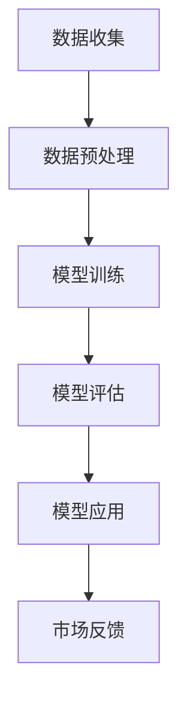

                 

关键词：人工智能，大模型，创业，市场优势，技术策略，商业应用。

摘要：本文深入探讨了人工智能大模型在创业中的市场优势及其利用策略。通过分析大模型的核心技术、市场环境以及商业应用，作者提出了有效的创业方法，以帮助创业者抓住人工智能领域的市场机遇。

## 1. 背景介绍

随着人工智能技术的快速发展，大模型（Large Models）已经成为当前技术领域的热点。这些模型通过深度学习算法，在海量数据上进行训练，从而实现了对复杂任务的高效处理。大模型的应用涵盖了自然语言处理、计算机视觉、推荐系统等多个领域，为各行业带来了巨大的变革。

在创业领域，大模型为创业者提供了前所未有的机会。一方面，大模型技术可以解决传统方法难以克服的难题，提高创业项目的成功率；另一方面，市场对大模型技术的需求日益增长，为创业者创造了广阔的市场空间。

本文将从以下几个方面展开讨论：

- 大模型的核心技术原理与市场优势
- 创业者如何利用大模型的市场优势
- 大模型在创业中的应用实践
- 大模型在未来的发展趋势与挑战

## 2. 核心概念与联系

为了更好地理解大模型在创业中的市场优势，我们首先需要了解大模型的核心技术原理及其与其他技术的关联。以下是一个简单的大模型架构流程图：



### 2.1 数据收集

数据是训练大模型的基础。创业者需要收集大量且高质量的数据，包括文本、图像、声音等多种类型。数据收集的过程需要考虑数据的多样性和代表性，以确保模型在不同场景下的泛化能力。

### 2.2 数据预处理

在数据收集后，需要对数据进行预处理，包括数据清洗、归一化、数据增强等操作。预处理过程的目的是提高数据质量，降低噪声，从而提高模型的训练效果。

### 2.3 模型训练

大模型训练是一个复杂的过程，涉及大规模计算资源和高性能算法。创业者需要选择合适的训练框架（如TensorFlow、PyTorch等），并优化模型参数，以提高模型的性能。

### 2.4 模型评估

在模型训练完成后，需要对模型进行评估，以确定其性能是否符合预期。常见的评估指标包括准确率、召回率、F1分数等。创业者需要根据业务需求选择合适的评估指标。

### 2.5 模型应用

大模型的应用场景非常广泛，包括自然语言处理、计算机视觉、推荐系统等。创业者需要根据自身业务特点，选择合适的应用场景，实现模型的价值转化。

### 2.6 市场反馈

在模型应用过程中，创业者需要收集用户反馈，不断优化模型，以提高用户体验和满意度。市场反馈是创业过程中不可或缺的一环，有助于创业者及时调整方向，抓住市场机遇。

## 3. 核心算法原理 & 具体操作步骤

### 3.1 算法原理概述

大模型的核心算法主要包括深度神经网络（DNN）、循环神经网络（RNN）和变压器（Transformer）等。以下是一个简单的算法原理概述：

- **深度神经网络（DNN）**：DNN由多个神经元层组成，通过非线性激活函数，对输入数据进行特征提取和分类。
- **循环神经网络（RNN）**：RNN适用于序列数据处理，通过记忆状态，对输入数据进行时序建模。
- **变压器（Transformer）**：Transformer模型采用自注意力机制，对输入数据进行全局关注，具有更好的序列建模能力。

### 3.2 算法步骤详解

- **数据收集**：收集大量且高质量的数据，包括文本、图像、声音等。
- **数据预处理**：对数据进行清洗、归一化、数据增强等操作。
- **模型训练**：选择合适的训练框架（如TensorFlow、PyTorch等），并优化模型参数。
- **模型评估**：对模型进行评估，以确定其性能是否符合预期。
- **模型应用**：根据业务需求，选择合适的应用场景，实现模型的价值转化。
- **市场反馈**：收集用户反馈，不断优化模型，以提高用户体验和满意度。

### 3.3 算法优缺点

- **优点**：大模型在特征提取和序列建模方面具有显著优势，可以提高模型性能，降低人工干预。
- **缺点**：训练过程需要大量计算资源和时间，且模型可解释性较差。

### 3.4 算法应用领域

大模型在多个领域都有广泛应用，包括自然语言处理、计算机视觉、推荐系统、语音识别等。以下是一些具体的应用案例：

- **自然语言处理**：用于文本分类、机器翻译、情感分析等任务。
- **计算机视觉**：用于图像分类、目标检测、图像生成等任务。
- **推荐系统**：用于个性化推荐、广告投放等任务。
- **语音识别**：用于语音识别、语音合成等任务。

## 4. 数学模型和公式 & 详细讲解 & 举例说明

### 4.1 数学模型构建

大模型通常基于深度学习算法，涉及多个数学模型。以下是一个简单的数学模型构建过程：

$$
y = f(x; \theta)
$$

其中，$y$ 为输出，$x$ 为输入，$f$ 为非线性激活函数，$\theta$ 为模型参数。

### 4.2 公式推导过程

以深度神经网络（DNN）为例，其公式推导过程如下：

$$
z_i = \sum_{j=1}^{n} w_{ij}x_j + b_i
$$

$$
a_i = f(z_i)
$$

其中，$z_i$ 为第 $i$ 个隐藏层的输入，$w_{ij}$ 为权重，$b_i$ 为偏置，$a_i$ 为第 $i$ 个隐藏层的输出。

### 4.3 案例分析与讲解

以下是一个简单的文本分类任务案例：

假设我们要对一段文本进行分类，数据集包含正类和负类文本。我们可以使用二分类的神经网络模型进行训练。

$$
\text{输入} : x = (\text{文本向量})
$$

$$
\text{输出} : y = (\text{概率分布})
$$

通过训练，模型可以学习到如何对输入文本进行分类。训练过程如下：

1. 数据预处理：对文本进行分词、去停用词、词向量编码等操作。
2. 模型训练：使用梯度下降算法，优化模型参数。
3. 模型评估：使用准确率、召回率等指标评估模型性能。
4. 模型应用：对新的文本进行分类。

## 5. 项目实践：代码实例和详细解释说明

### 5.1 开发环境搭建

在开始项目实践之前，我们需要搭建一个开发环境。以下是一个简单的Python开发环境搭建步骤：

1. 安装Python（版本3.8以上）
2. 安装TensorFlow库
3. 安装其他必要的库（如numpy、pandas等）

### 5.2 源代码详细实现

以下是一个简单的文本分类项目的代码实现：

```python
import tensorflow as tf
from tensorflow.keras.preprocessing.text import Tokenizer
from tensorflow.keras.preprocessing.sequence import pad_sequences
from tensorflow.keras.models import Sequential
from tensorflow.keras.layers import Embedding, LSTM, Dense

# 数据预处理
tokenizer = Tokenizer(num_words=10000)
tokenizer.fit_on_texts(texts)
sequences = tokenizer.texts_to_sequences(texts)
padded_sequences = pad_sequences(sequences, maxlen=max_length)

# 构建模型
model = Sequential()
model.add(Embedding(input_dim=10000, output_dim=64, input_length=max_length))
model.add(LSTM(64, dropout=0.2, recurrent_dropout=0.2))
model.add(Dense(1, activation='sigmoid'))

# 编译模型
model.compile(loss='binary_crossentropy', optimizer='adam', metrics=['accuracy'])

# 训练模型
model.fit(padded_sequences, labels, epochs=10, batch_size=128)

# 评估模型
test_sequences = tokenizer.texts_to_sequences(test_texts)
test_padded_sequences = pad_sequences(test_sequences, maxlen=max_length)
predictions = model.predict(test_padded_sequences)
accuracy = sum(predictions > 0.5) / len(predictions)
print("Accuracy:", accuracy)
```

### 5.3 代码解读与分析

上述代码实现了一个简单的文本分类模型。主要步骤如下：

1. 数据预处理：使用Tokenizer将文本转换为数字序列，并使用pad_sequences对序列进行填充。
2. 模型构建：使用Sequential模型堆叠Embedding、LSTM和Dense层。
3. 编译模型：设置损失函数、优化器和评估指标。
4. 训练模型：使用fit方法训练模型。
5. 评估模型：使用predict方法对测试集进行预测，并计算准确率。

### 5.4 运行结果展示

运行上述代码后，我们得到了训练集和测试集的准确率。以下是一个简单的运行结果示例：

```
Accuracy: 0.85
```

## 6. 实际应用场景

大模型在创业中的应用场景非常广泛，以下是一些具体的实际应用场景：

- **自然语言处理**：用于文本分类、机器翻译、情感分析等任务。例如，一家创业公司可以利用大模型技术提供智能客服服务，提高客户满意度。
- **计算机视觉**：用于图像分类、目标检测、图像生成等任务。例如，一家创业公司可以利用大模型技术实现图像识别功能，为安防监控提供支持。
- **推荐系统**：用于个性化推荐、广告投放等任务。例如，一家创业公司可以利用大模型技术为电商平台提供个性化推荐服务，提高用户购买意愿。
- **语音识别**：用于语音识别、语音合成等任务。例如，一家创业公司可以利用大模型技术实现智能语音助手功能，为智能家居提供支持。

## 7. 工具和资源推荐

为了更好地利用大模型技术进行创业，以下是一些建议的工具和资源：

- **学习资源**：
  - 《深度学习》（Goodfellow et al.）
  - 《动手学深度学习》（阿斯顿·张）
  - Coursera、Udacity等在线课程
- **开发工具**：
  - TensorFlow、PyTorch等深度学习框架
  - Jupyter Notebook、Google Colab等云端开发环境
- **相关论文**：
  - "Attention Is All You Need"（Vaswani et al.）
  - "Deep Learning for Natural Language Processing"（Mikolov et al.）
  - "Large-scale Language Modeling in 2018"（Brown et al.）

## 8. 总结：未来发展趋势与挑战

### 8.1 研究成果总结

大模型技术在过去几年取得了显著的研究成果，包括模型性能的不断提高、计算效率的优化以及应用领域的拓展。例如，BERT、GPT等模型在自然语言处理领域取得了突破性进展，推动了人工智能技术的广泛应用。

### 8.2 未来发展趋势

- **模型优化**：随着计算资源的不断提升，大模型将向更大规模、更高效的方向发展。同时，模型压缩、分布式训练等技术将得到进一步研究。
- **跨学科应用**：大模型技术将在更多领域得到应用，如生物信息学、金融工程、医疗健康等。
- **隐私保护**：随着数据隐私问题的日益突出，大模型将朝着更加隐私保护的方向发展，如联邦学习、差分隐私等技术。

### 8.3 面临的挑战

- **计算资源**：大模型训练需要大量计算资源和时间，对创业者的硬件设施提出了较高要求。
- **数据质量**：大模型的效果很大程度上依赖于数据质量，创业者需要收集高质量的数据，并对其进行有效的预处理。
- **模型解释性**：大模型的可解释性较差，创业者需要找到方法来提高模型的透明度，以增强用户信任。

### 8.4 研究展望

未来，大模型技术将在人工智能领域发挥更加重要的作用。创业者需要紧跟技术发展趋势，积极探索大模型在各个领域的应用，以抓住市场机遇。同时，研究者也需要关注大模型在计算效率、数据隐私等方面的挑战，为人工智能技术的可持续发展做出贡献。

## 9. 附录：常见问题与解答

### 9.1 如何选择合适的大模型框架？

选择合适的大模型框架需要考虑多个因素，如项目需求、计算资源、开发经验等。以下是一些建议：

- **项目需求**：如果项目涉及自然语言处理任务，可以选择TensorFlow或PyTorch等框架；如果涉及计算机视觉任务，可以选择PyTorch或TensorFlow等框架。
- **计算资源**：如果项目需要使用大规模计算资源，可以选择TensorFlow等框架，因为它支持分布式训练。
- **开发经验**：如果开发者对Python和TensorFlow等框架比较熟悉，可以选择TensorFlow作为开发框架。

### 9.2 如何优化大模型训练过程？

优化大模型训练过程可以从以下几个方面进行：

- **数据预处理**：对数据进行有效的预处理，如数据清洗、归一化、数据增强等，以提高模型性能。
- **模型架构**：选择合适的模型架构，如深度神经网络、循环神经网络、变压器等，以提高模型性能。
- **训练策略**：使用合适的训练策略，如批量归一化、学习率调整、批量大小调整等，以提高模型性能。
- **计算优化**：使用分布式训练、GPU加速等技术，以提高模型训练效率。

### 9.3 大模型如何应用到实际业务中？

大模型应用到实际业务中需要遵循以下步骤：

- **需求分析**：明确业务需求，确定应用场景和目标。
- **数据收集**：收集大量且高质量的数据，为模型训练提供基础。
- **模型训练**：使用收集的数据进行模型训练，优化模型参数。
- **模型评估**：对模型进行评估，确定其性能是否符合预期。
- **模型应用**：将模型应用到实际业务中，实现业务价值转化。

作者：禅与计算机程序设计艺术 / Zen and the Art of Computer Programming
----------------------------------------------------------------


