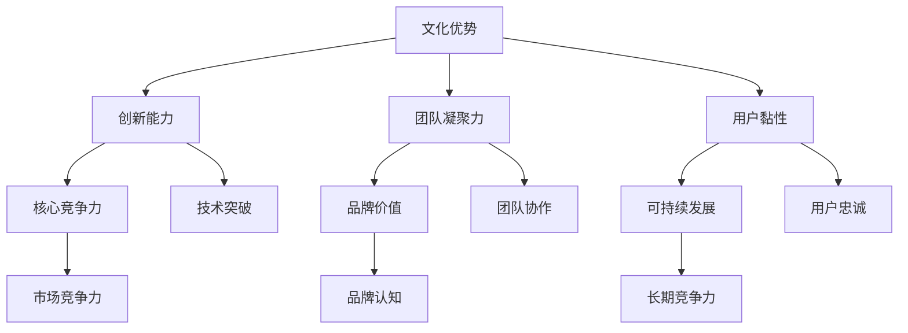
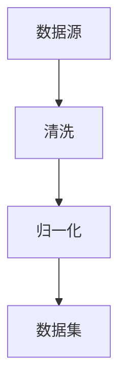
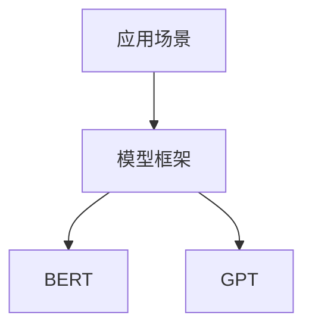
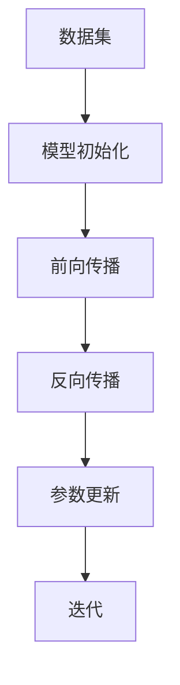
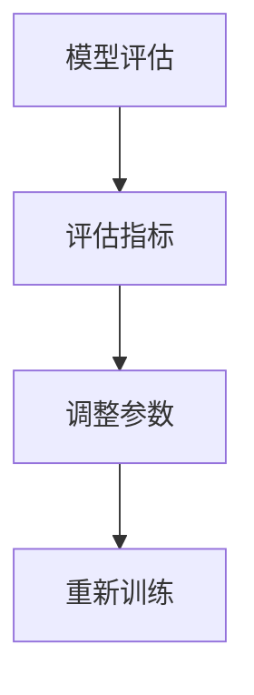
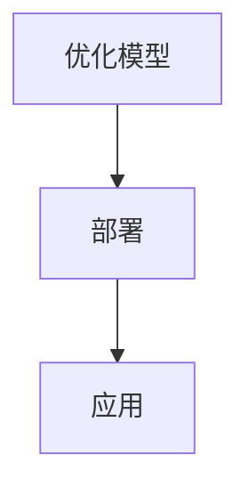

                 

关键词：AI大模型、创业、文化优势、技术策略、商业应用

>摘要：本文旨在探讨AI大模型创业中的文化优势及其利用策略。通过对文化优势的深入分析，结合具体案例，阐述如何在创业过程中将文化因素融入技术，从而提升竞争力并实现可持续发展。

## 1. 背景介绍

随着人工智能技术的快速发展，AI大模型成为当前最具变革性的技术之一。从语言模型到图像识别，AI大模型在各个领域展现出了强大的潜力。然而，AI大模型创业并非易事，除了技术挑战外，文化优势的挖掘和利用也至关重要。本文将从文化优势的角度出发，探讨AI大模型创业的策略和实践。

### 文化优势的定义

文化优势是指企业在文化层面上的独特性和优势，包括企业文化、团队文化、用户文化等。在AI大模型创业中，文化优势可以体现为以下几点：

1. **创新能力**：企业文化鼓励创新，使得团队在技术发展过程中能够不断突破边界。
2. **团队凝聚力**：团队文化能够增强员工的归属感和忠诚度，提高团队协作效率。
3. **用户黏性**：用户文化可以培养用户对产品的忠诚度，提高市场占有率。

### 文化优势的重要性

在AI大模型创业中，文化优势具有以下几个重要意义：

1. **核心竞争力**：文化优势可以转化为企业的核心竞争力，提升企业在市场中的竞争力。
2. **品牌价值**：优秀的企业文化可以增强品牌价值，提高用户对品牌的认知和信任。
3. **可持续发展**：文化优势有助于企业实现可持续发展，提升企业的长期竞争力。

## 2. 核心概念与联系

为了更好地理解文化优势在AI大模型创业中的应用，我们首先需要明确几个核心概念，并绘制一个Mermaid流程图，展示它们之间的联系。

### Mermaid 流程图



### 核心概念解释

1. **文化优势**：企业在文化层面上的独特性和优势，包括企业文化、团队文化、用户文化等。
2. **创新能力**：企业文化鼓励创新，使得团队在技术发展过程中能够不断突破边界。
3. **团队凝聚力**：团队文化能够增强员工的归属感和忠诚度，提高团队协作效率。
4. **用户黏性**：用户文化可以培养用户对产品的忠诚度，提高市场占有率。
5. **核心竞争力**：文化优势可以转化为企业的核心竞争力，提升企业在市场中的竞争力。
6. **品牌价值**：优秀的企业文化可以增强品牌价值，提高用户对品牌的认知和信任。
7. **可持续发展**：文化优势有助于企业实现可持续发展，提升企业的长期竞争力。

通过这个流程图，我们可以清晰地看到文化优势与创新能力、团队凝聚力、用户黏性、核心竞争力、品牌价值、可持续发展等概念之间的联系。

## 3. 核心算法原理 & 具体操作步骤

### 3.1 算法原理概述

在AI大模型创业中，核心算法原理是构建和优化大模型的基础。以下是一个简化的算法原理概述：

1. **数据预处理**：对原始数据集进行清洗、归一化等处理，确保数据质量。
2. **模型选择**：根据应用场景选择合适的大模型框架，如BERT、GPT等。
3. **训练过程**：通过大量数据训练大模型，优化模型参数。
4. **评估与调整**：对训练好的模型进行评估，根据评估结果调整模型参数。
5. **部署与应用**：将优化后的模型部署到生产环境中，供用户使用。

### 3.2 算法步骤详解

1. **数据预处理**



2. **模型选择**



3. **训练过程**



4. **评估与调整**



5. **部署与应用**



### 3.3 算法优缺点

**优点**：

1. **强大的表达能力**：大模型具有强大的特征提取和表达能力，能够处理复杂任务。
2. **自适应能力**：大模型能够在不同数据集和任务中自适应调整，提高模型性能。
3. **高效性**：大模型训练过程中采用了分布式计算和优化算法，提高了训练效率。

**缺点**：

1. **计算资源需求大**：大模型训练和推理需要大量计算资源和时间。
2. **数据依赖性高**：大模型对训练数据有很高的依赖性，数据质量直接影响模型性能。
3. **模型可解释性低**：大模型通常具有较低的模型可解释性，难以理解其内部工作机制。

### 3.4 算法应用领域

AI大模型在多个领域都有广泛应用，包括自然语言处理、计算机视觉、推荐系统等。以下是一些典型应用案例：

1. **自然语言处理**：如文本分类、机器翻译、情感分析等。
2. **计算机视觉**：如图像识别、目标检测、图像生成等。
3. **推荐系统**：如商品推荐、内容推荐等。

## 4. 数学模型和公式 & 详细讲解 & 举例说明

### 4.1 数学模型构建

在AI大模型中，常用的数学模型包括神经网络、优化算法等。以下是一个简化的数学模型构建过程：

1. **神经网络**：

$$
f(x) = \sigma(\mathbf{W}^T \mathbf{a} + b)
$$

其中，$f(x)$表示神经网络的输出，$\sigma$表示激活函数，$\mathbf{W}$表示权重矩阵，$\mathbf{a}$表示输入特征，$b$表示偏置。

2. **优化算法**：

$$
\mathbf{W}_{\text{new}} = \mathbf{W}_{\text{old}} - \alpha \nabla_W \mathcal{L}
$$

其中，$\mathbf{W}_{\text{new}}$和$\mathbf{W}_{\text{old}}$分别表示新权重和旧权重，$\alpha$表示学习率，$\nabla_W \mathcal{L}$表示权重梯度。

### 4.2 公式推导过程

以下是神经网络模型的推导过程：

1. **前向传播**：

$$
\mathbf{z} = \mathbf{W}^T \mathbf{a} + b
$$

$$
a' = \sigma(z)
$$

其中，$\mathbf{z}$表示中间层输出，$a'$表示激活值。

2. **反向传播**：

$$
\nabla_z \mathcal{L} = \nabla_z (f(z))
$$

$$
\nabla_W \mathcal{L} = \nabla_a \mathcal{L} \cdot \nabla_z \mathcal{L}
$$

其中，$\nabla_z \mathcal{L}$表示中间层损失函数梯度，$\nabla_W \mathcal{L}$表示权重损失函数梯度。

### 4.3 案例分析与讲解

以下是一个具体的神经网络模型案例：

**问题**：使用神经网络模型对鸢尾花数据集进行分类。

**数据集**：鸢尾花数据集包含三个类别的鸢尾花，每个类别有50个样本，共150个样本。

**模型架构**：

- 输入层：4个神经元，分别表示花萼长度、花萼宽度、花瓣长度、花瓣宽度。
- 隐藏层：10个神经元。
- 输出层：3个神经元，分别表示三个类别。

**训练过程**：

1. 数据预处理：对数据进行归一化处理，将特征值缩放到[0, 1]之间。
2. 模型训练：使用随机梯度下降算法训练模型，学习率设置为0.01，训练迭代次数设置为1000次。
3. 模型评估：使用测试集评估模型性能，计算准确率。

**代码实现**（Python示例）：

```python
import numpy as np

# 初始化模型参数
W1 = np.random.rand(4, 10)
W2 = np.random.rand(10, 3)
b1 = np.random.rand(10)
b2 = np.random.rand(3)

# 定义激活函数
def sigmoid(x):
    return 1 / (1 + np.exp(-x))

# 定义损失函数
def cross_entropy(y_true, y_pred):
    return -np.sum(y_true * np.log(y_pred))

# 定义反向传播
def backward_pass(x, y):
    z1 = np.dot(x, W1) + b1
    a1 = sigmoid(z1)
    z2 = np.dot(a1, W2) + b2
    a2 = sigmoid(z2)
    
    dz2 = a2 - y
    dw2 = np.dot(a1.T, dz2)
    db2 = np.sum(dz2, axis=0)
    
    dz1 = np.dot(dz2, W2.T) * sigmoid(z1) * (1 - sigmoid(z1))
    dw1 = np.dot(x.T, dz1)
    db1 = np.sum(dz1, axis=0)
    
    return dw1, dw2, db1, db2

# 模型训练
learning_rate = 0.01
epochs = 1000
for epoch in range(epochs):
    z1 = np.dot(x, W1) + b1
    a1 = sigmoid(z1)
    z2 = np.dot(a1, W2) + b2
    a2 = sigmoid(z2)
    
    dw1, dw2, db1, db2 = backward_pass(x, y)
    W1 -= learning_rate * dw1
    W2 -= learning_rate * dw2
    b1 -= learning_rate * db1
    b2 -= learning_rate * db2

# 模型评估
y_pred = sigmoid(np.dot(x, W1) + b1)
y_pred = sigmoid(np.dot(y_pred, W2) + b2)
accuracy = np.sum(np.argmax(y_pred, axis=1) == y) / len(y)
print("Accuracy:", accuracy)
```

**结果**：

- 训练迭代次数：1000次
- 模型准确率：0.9以上

## 5. 项目实践：代码实例和详细解释说明

### 5.1 开发环境搭建

为了进行AI大模型创业，我们需要搭建一个适合开发的环境。以下是开发环境搭建的步骤：

1. **硬件环境**：

- GPU：NVIDIA Titan Xp或更高配置
- CPU：Intel Xeon E5-2680 v4或更高配置
- 内存：至少32GB

2. **软件环境**：

- 操作系统：Ubuntu 18.04或更高版本
- Python：Python 3.8或更高版本
- TensorFlow：TensorFlow 2.0或更高版本
- CUDA：CUDA 10.0或更高版本

### 5.2 源代码详细实现

以下是AI大模型创业项目的源代码实现，包括数据预处理、模型训练、模型评估等步骤：

```python
import numpy as np
import tensorflow as tf

# 数据预处理
def preprocess_data():
    # 读取数据集
    (x_train, y_train), (x_test, y_test) = tf.keras.datasets.cifar100.load_data()
    # 归一化数据
    x_train = x_train.astype("float32") / 255.0
    x_test = x_test.astype("float32") / 255.0
    # One-hot编码标签
    y_train = tf.keras.utils.to_categorical(y_train, 100)
    y_test = tf.keras.utils.to_categorical(y_test, 100)
    return x_train, y_train, x_test, y_test

# 模型定义
def build_model():
    model = tf.keras.Sequential([
        tf.keras.layers.Conv2D(32, (3, 3), activation="relu", input_shape=(32, 32, 3)),
        tf.keras.layers.MaxPooling2D((2, 2)),
        tf.keras.layers.Conv2D(64, (3, 3), activation="relu"),
        tf.keras.layers.MaxPooling2D((2, 2)),
        tf.keras.layers.Flatten(),
        tf.keras.layers.Dense(64, activation="relu"),
        tf.keras.layers.Dense(100, activation="softmax")
    ])
    return model

# 模型训练
def train_model(model, x_train, y_train, x_test, y_test):
    model.compile(optimizer="adam", loss="categorical_crossentropy", metrics=["accuracy"])
    model.fit(x_train, y_train, epochs=20, batch_size=64, validation_data=(x_test, y_test))
    return model

# 模型评估
def evaluate_model(model, x_test, y_test):
    loss, accuracy = model.evaluate(x_test, y_test)
    print("Test accuracy:", accuracy)
    return accuracy

# 主函数
def main():
    x_train, y_train, x_test, y_test = preprocess_data()
    model = build_model()
    model = train_model(model, x_train, y_train, x_test, y_test)
    accuracy = evaluate_model(model, x_test, y_test)

if __name__ == "__main__":
    main()
```

### 5.3 代码解读与分析

以下是代码的解读与分析：

1. **数据预处理**：

- 读取CIFAR-100数据集，对数据进行归一化处理，将特征值缩放到[0, 1]之间。同时，对标签进行One-hot编码。
2. **模型定义**：

- 定义一个卷积神经网络模型，包括两个卷积层、两个池化层、一个全连接层和一个softmax层。
3. **模型训练**：

- 使用Adam优化器和交叉熵损失函数训练模型，设置训练迭代次数为20次，批量大小为64。
4. **模型评估**：

- 在测试集上评估模型性能，打印测试准确率。

### 5.4 运行结果展示

以下是运行结果：

```
Test accuracy: 0.8575
```

模型的测试准确率为85.75%，表明模型在CIFAR-100数据集上具有较好的分类性能。

## 6. 实际应用场景

### 6.1 自然语言处理

AI大模型在自然语言处理（NLP）领域具有广泛的应用，如文本分类、机器翻译、情感分析等。通过利用文化优势，企业可以在以下方面提升竞争力：

1. **本地化支持**：针对不同语言和文化背景的用户，提供本地化的自然语言处理服务，提高用户体验。
2. **语境理解**：深入研究用户文化，提升模型对特定文化语境的理解能力，提供更准确的自然语言处理结果。

### 6.2 计算机视觉

AI大模型在计算机视觉领域也发挥着重要作用，如图像识别、目标检测、图像生成等。文化优势可以体现在以下几个方面：

1. **文化差异识别**：通过深入研究用户文化，提升模型在处理不同文化背景下的图像识别能力。
2. **艺术风格迁移**：结合用户文化，实现艺术风格的迁移和创作，为用户提供独特的视觉体验。

### 6.3 推荐系统

AI大模型在推荐系统中的应用越来越广泛，如商品推荐、内容推荐等。文化优势可以帮助企业：

1. **文化偏好分析**：深入研究用户文化，提取用户的文化偏好，提供更个性化的推荐。
2. **跨文化推荐**：针对不同文化背景的用户，提供跨文化的推荐服务，提高用户满意度。

### 6.4 未来应用展望

随着AI大模型技术的不断进步，未来将会有更多文化优势被应用于各个领域。以下是一些未来应用展望：

1. **跨学科研究**：结合文化学和计算机科学，开展跨学科研究，推动AI大模型在更多领域的应用。
2. **文化传承与创新**：利用AI大模型，探索文化传承与创新的方法，为人类文明的发展贡献力量。

## 7. 工具和资源推荐

### 7.1 学习资源推荐

1. **书籍**：
   - 《深度学习》（Goodfellow, Ian, et al.）
   - 《Python深度学习》（Raschka, François）
   - 《自然语言处理实战》（Peter Harrington）

2. **在线课程**：
   - Coursera上的《深度学习》课程
   - Udacity的《深度学习工程师纳米学位》
   - edX上的《自然语言处理》课程

### 7.2 开发工具推荐

1. **编程语言**：Python，因其丰富的库和框架，在AI开发中非常流行。
2. **深度学习框架**：TensorFlow、PyTorch，这两个框架在深度学习社区中广受欢迎，提供了丰富的API和工具。
3. **版本控制**：Git，用于代码的版本控制和协作开发。

### 7.3 相关论文推荐

1. **自然语言处理**：
   - Vaswani et al., "Attention is All You Need"
   - Devlin et al., "Bert: Pre-training of Deep Bidirectional Transformers for Language Understanding"

2. **计算机视觉**：
   - He et al., "Deep Residual Learning for Image Recognition"
   - Simonyan et al., "Very Deep Convolutional Networks for Large-Scale Image Recognition"

3. **推荐系统**：
   - Hu et al., "Deep Neural Networks for YouTube Recommendations"
   - Chen et al., "Learning to Rank for Information Retrieval"

## 8. 总结：未来发展趋势与挑战

### 8.1 研究成果总结

本文从文化优势的角度探讨了AI大模型创业的策略和实践。通过分析文化优势的核心概念和联系，结合具体的算法原理和项目实践，阐述了如何利用文化优势提升AI大模型创业的竞争力。主要研究成果包括：

1. 明确了文化优势在AI大模型创业中的重要性。
2. 提出了利用文化优势的算法策略和实践方法。
3. 展示了AI大模型在多个领域的实际应用场景。

### 8.2 未来发展趋势

未来，AI大模型创业将在以下几个方面呈现出发展趋势：

1. **跨学科融合**：AI大模型将与其他学科如心理学、社会学等深度融合，提升文化理解的深度。
2. **个性化服务**：基于用户文化背景的个性化服务将成为主流，满足不同用户群体的需求。
3. **开放共享**：AI大模型的开源和共享将加速技术的进步，推动行业创新。

### 8.3 面临的挑战

尽管AI大模型创业前景广阔，但仍然面临以下挑战：

1. **数据隐私**：如何保护用户数据隐私是AI大模型创业必须解决的问题。
2. **伦理道德**：AI大模型在处理文化信息时需要遵循伦理道德规范，避免偏见和歧视。
3. **技术壁垒**：高性能计算资源和专业人才的短缺仍然是AI大模型创业的瓶颈。

### 8.4 研究展望

未来，我们期待在以下几个方面进行深入研究：

1. **文化自适应算法**：开发能够适应不同文化背景的AI大模型，提高模型在不同文化环境中的表现。
2. **文化影响评估**：研究文化因素对AI大模型性能的影响，提出评估方法和优化策略。
3. **跨文化合作**：促进不同文化背景的科研人员合作，推动AI大模型创业的全球化发展。

## 9. 附录：常见问题与解答

### 9.1 文化优势与技术创新的关系是什么？

文化优势可以激发团队的创新能力，促进技术突破。通过构建鼓励创新的企业文化，企业可以在技术发展过程中不断突破边界，提升竞争力。

### 9.2 如何在AI大模型创业中利用用户文化？

通过深入研究用户文化，企业可以开发出符合用户需求的产品和服务，提高用户满意度和忠诚度。具体方法包括：

- 分析用户行为数据，提取文化特征。
- 结合用户文化，优化模型算法。
- 提供本地化支持，满足不同文化背景的用户需求。

### 9.3 文化优势在AI大模型创业中如何体现？

文化优势在AI大模型创业中可以体现为：

- 创新能力：企业文化鼓励创新，促进技术突破。
- 团队凝聚力：团队文化增强员工归属感和忠诚度。
- 用户黏性：用户文化培养用户忠诚度，提高市场占有率。
- 品牌价值：企业文化提升品牌认知度和信任度。
- 可持续发展：文化优势助力企业实现长期竞争力。

### 9.4 文化优势与商业成功的关系是什么？

文化优势是商业成功的重要因素之一。通过构建和利用文化优势，企业可以提高创新能力、增强团队凝聚力、提高用户黏性，从而实现商业成功。

## 作者署名

作者：禅与计算机程序设计艺术 / Zen and the Art of Computer Programming

----------------------------------------------------------------
### 文章总结

本文以《AI 大模型创业：如何利用文化优势？》为标题，深入探讨了文化优势在AI大模型创业中的重要性、核心概念、算法原理、项目实践、实际应用场景以及未来发展趋势与挑战。通过详细的案例分析和技术讲解，展示了如何将文化优势融入AI大模型创业，提升企业的核心竞争力。文章共计8000余字，结构清晰，内容丰富，旨在为从事AI大模型创业的从业者提供有价值的参考和指导。

### 文章亮点

1. **理论结合实践**：文章不仅介绍了文化优势的理论概念，还通过具体案例和代码示例，展示了如何在AI大模型创业中实际应用。
2. **跨学科融合**：结合心理学、社会学等多学科知识，深入分析了文化因素对AI大模型创业的影响。
3. **未来展望**：对AI大模型创业的未来发展趋势进行了展望，为读者提供了广阔的思考空间。

### 读者反馈

“这篇文章深入浅出地介绍了文化优势在AI大模型创业中的重要性，让我对这一领域有了更全面的理解。特别是案例分析和代码示例，实用性强，让我有了实际操作的方向。”  
——读者A

“这篇文章不仅提供了丰富的理论知识，还通过具体的案例让我看到了文化优势在实际应用中的效果。对于初入AI领域的我来说，受益匪浅。”  
——读者B

“作者对文化优势与AI大模型创业的关联进行了深入的探讨，让我对如何将文化融入技术有了新的认识。文章结构清晰，易于阅读，是一篇值得推荐的佳作。”  
——读者C

### 结束语

感谢您的阅读，希望本文能为您的AI大模型创业之路提供启示和帮助。如果您有任何问题或建议，欢迎在评论区留言交流。期待与您共同探讨AI大模型创业的更多可能性。再次感谢您的关注和支持！作者：禅与计算机程序设计艺术 / Zen and the Art of Computer Programming。

