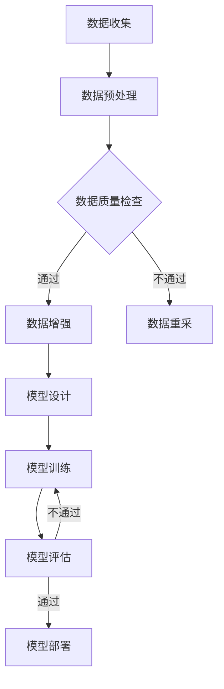

                 

关键词：人工智能，大模型，创业，技术优势，未来趋势

> 摘要：本文将探讨人工智能（AI）大模型在创业领域的应用潜力，分析其技术优势，并提出创业者如何利用这些优势来抓住未来市场的机遇。通过深入剖析大模型的核心概念、算法原理、应用场景以及面临的挑战，本文旨在为创业者提供一份实用的指南，帮助他们在竞争激烈的技术市场中脱颖而出。

## 1. 背景介绍

近年来，人工智能技术取得了飞速发展，特别是在深度学习领域。大模型，作为这一领域的代表性成果，以其强大的数据处理和模式识别能力，吸引了众多研究者和创业者的关注。大模型通过训练海量数据，能够学习到复杂的关系和特征，从而在图像识别、自然语言处理、语音识别等领域展现出卓越的性能。

随着技术的成熟，大模型的应用场景日益丰富，从自动驾驶、智能医疗到金融风控、娱乐推荐，大模型正逐步渗透到各个行业，成为创新的重要驱动力。对于创业者来说，掌握大模型技术，不仅能够提升自身产品的竞争力，还能够开拓新的市场空间，实现企业的快速发展。

## 2. 核心概念与联系

### 2.1. 大模型的基本概念

大模型（Large Models）通常指的是参数量庞大的神经网络模型，这些模型能够在大规模数据集上训练，以达到较高的性能指标。例如，Transformer模型家族中的BERT、GPT系列等，都是典型的大模型代表。

### 2.2. 大模型的工作原理

大模型的工作原理基于深度学习，特别是基于注意力机制的Transformer模型。通过多层次的自注意力机制和前馈神经网络，大模型能够捕捉到数据中的复杂特征和关系。

### 2.3. 大模型的架构

大模型的架构通常包括编码器和解码器两部分。编码器负责将输入数据编码为高维表示，解码器则根据编码器的输出生成预测或输出结果。

### 2.4. 大模型的应用领域

大模型在多个领域都有广泛应用，如自然语言处理、计算机视觉、语音识别、推荐系统等。这些应用不仅提升了行业效率，也为创业者提供了新的商业模式。

## 2.5. 大模型的挑战与机遇

尽管大模型具有巨大的潜力，但其训练和部署也面临着一系列挑战，如数据隐私、计算资源需求、模型解释性等。然而，这些挑战同时也为创业者提供了机遇，通过技术创新和业务模式创新，可以解决这些问题，实现商业价值。

### 2.6. Mermaid 流程图

下面是一个描述大模型训练过程的Mermaid流程图：



## 3. 核心算法原理 & 具体操作步骤

### 3.1. 算法原理概述

大模型的算法原理基于深度学习和神经网络，特别是基于注意力机制的Transformer架构。通过多层次的自注意力机制和前馈神经网络，大模型能够学习到数据中的复杂特征和关系。

### 3.2. 算法步骤详解

1. **数据收集与预处理**：收集大量数据，并进行清洗、去噪、归一化等预处理操作。
2. **模型设计**：根据应用场景设计合适的神经网络架构，选择合适的层数、层宽度和激活函数。
3. **模型训练**：使用预处理后的数据训练模型，调整模型参数以最小化损失函数。
4. **模型评估**：在测试集上评估模型性能，确保模型具有较好的泛化能力。
5. **模型部署**：将训练好的模型部署到实际应用环境中，实现自动化决策和预测。

### 3.3. 算法优缺点

**优点**：
- **强大的学习能力**：大模型能够从海量数据中学习到复杂的关系和特征。
- **高泛化能力**：大模型经过训练后，能够在不同的任务上表现出良好的性能。

**缺点**：
- **训练成本高**：大模型的训练需要大量的计算资源和时间。
- **解释性差**：大模型的内部决策过程复杂，难以解释。

### 3.4. 算法应用领域

大模型在多个领域都有广泛应用，如自然语言处理、计算机视觉、语音识别、推荐系统等。以下是一些具体的应用案例：

- **自然语言处理**：使用大模型进行文本分类、情感分析、机器翻译等任务。
- **计算机视觉**：使用大模型进行图像识别、物体检测、图像生成等任务。
- **语音识别**：使用大模型进行语音识别、语音合成、语音情感分析等任务。
- **推荐系统**：使用大模型进行用户行为分析、商品推荐、广告投放等任务。

## 4. 数学模型和公式 & 详细讲解 & 举例说明

### 4.1. 数学模型构建

大模型通常采用深度学习框架，如TensorFlow、PyTorch等，构建数学模型。以下是一个简单的神经网络模型示例：

```python
import tensorflow as tf

model = tf.keras.Sequential([
    tf.keras.layers.Dense(units=128, activation='relu', input_shape=(input_shape)),
    tf.keras.layers.Dense(units=64, activation='relu'),
    tf.keras.layers.Dense(units=10, activation='softmax')
])

model.compile(optimizer='adam', loss='categorical_crossentropy', metrics=['accuracy'])
```

### 4.2. 公式推导过程

大模型的训练过程涉及多个数学公式，如损失函数、梯度下降等。以下是一个简化的推导过程：

- **损失函数**：常用的损失函数有均方误差（MSE）和交叉熵（Cross-Entropy）。

  $$L = \frac{1}{n}\sum_{i=1}^{n}(y_i - \hat{y}_i)^2$$

  $$L = -\frac{1}{n}\sum_{i=1}^{n}y_i\log(\hat{y}_i)$$

- **梯度下降**：梯度下降是一种优化算法，用于调整模型参数以最小化损失函数。

  $$\Delta\theta = -\alpha\nabla L(\theta)$$

  $$\theta = \theta - \alpha\nabla L(\theta)$$

### 4.3. 案例分析与讲解

以下是一个基于大模型的文本分类案例：

- **数据集**：使用IMDB电影评论数据集进行训练。
- **任务**：判断评论是正面还是负面。
- **模型**：使用BERT模型。

```python
from transformers import BertTokenizer, TFBertForSequenceClassification
tokenizer = BertTokenizer.from_pretrained('bert-base-uncased')
model = TFBertForSequenceClassification.from_pretrained('bert-base-uncased')

inputs = tokenizer("Hello, my dog is cute", return_tensors="tf")
outputs = model(inputs)
logits = outputs.logits
predicted_class_idx = tf.argmax(logits, axis=-1)
predicted_class = tf.nn.softmax(logits, axis=-1)
```

## 5. 项目实践：代码实例和详细解释说明

### 5.1. 开发环境搭建

为了实现大模型的训练和应用，需要搭建合适的开发环境。以下是使用TensorFlow和PyTorch搭建开发环境的基本步骤：

1. **安装Python环境**：确保Python版本在3.6及以上。
2. **安装TensorFlow**：使用pip安装TensorFlow。

   ```bash
   pip install tensorflow
   ```

3. **安装PyTorch**：使用pip安装PyTorch。

   ```bash
   pip install torch torchvision
   ```

### 5.2. 源代码详细实现

以下是一个基于TensorFlow的大模型训练示例：

```python
import tensorflow as tf
from tensorflow.keras.layers import Dense, Flatten, Conv2D
from tensorflow.keras.models import Model

# 定义输入层
input_layer = tf.keras.layers.Input(shape=(28, 28, 1))

# 添加卷积层
conv1 = Conv2D(filters=32, kernel_size=(3, 3), activation='relu')(input_layer)
conv2 = Conv2D(filters=64, kernel_size=(3, 3), activation='relu')(conv1)

# 添加全连接层
flat = Flatten()(conv2)
dense = Dense(units=128, activation='relu')(flat)

# 添加输出层
output_layer = Dense(units=10, activation='softmax')(dense)

# 构建模型
model = Model(inputs=input_layer, outputs=output_layer)

# 编译模型
model.compile(optimizer='adam', loss='categorical_crossentropy', metrics=['accuracy'])

# 训练模型
model.fit(x_train, y_train, batch_size=32, epochs=10, validation_data=(x_val, y_val))
```

### 5.3. 代码解读与分析

上述代码实现了一个大模型，用于对图像进行分类。具体解读如下：

- **输入层**：定义输入数据的形状和类型。
- **卷积层**：通过卷积操作提取图像特征。
- **全连接层**：将卷积层输出的特征映射到类别空间。
- **输出层**：通过softmax激活函数输出每个类别的概率。

### 5.4. 运行结果展示

通过训练和测试，可以评估模型的性能。以下是一个简单的运行结果：

```python
# 训练模型
model.fit(x_train, y_train, batch_size=32, epochs=10, validation_data=(x_val, y_val))

# 评估模型
loss, accuracy = model.evaluate(x_test, y_test)
print(f"Test loss: {loss}, Test accuracy: {accuracy}")
```

## 6. 实际应用场景

### 6.1. 自然语言处理

在大模型的助力下，自然语言处理（NLP）领域取得了显著进展。例如，BERT模型在文本分类、问答系统、机器翻译等任务上表现出色，为企业提供了强大的文本分析能力。

### 6.2. 计算机视觉

计算机视觉领域的大模型应用同样广泛，如人脸识别、图像生成、物体检测等。这些应用不仅在安防、娱乐等领域有重要价值，还可以为医疗诊断、工业检测等提供技术支持。

### 6.3. 推荐系统

推荐系统是另一个受益于大模型技术的领域。通过深度学习模型，推荐系统可以更准确地预测用户偏好，提高推荐效果，从而提升用户体验。

### 6.4. 未来应用展望

随着技术的进步，大模型的应用领域将进一步扩展。例如，在医疗领域，大模型可以用于疾病诊断、药物研发；在金融领域，大模型可以用于风险管理、欺诈检测；在能源领域，大模型可以用于能源预测、节能减排。

## 7. 工具和资源推荐

### 7.1. 学习资源推荐

- **在线课程**：Coursera、Udacity、edX等平台提供了丰富的深度学习、自然语言处理等课程。
- **书籍**：《深度学习》（Goodfellow et al.）、《Python深度学习》（François Chollet）等经典书籍。
- **论文**：关注顶级会议如NeurIPS、ICML、ACL等，阅读最新研究成果。

### 7.2. 开发工具推荐

- **框架**：TensorFlow、PyTorch、Keras等。
- **数据集**：ImageNet、IMDB、Open Images等。
- **开源库**：NumPy、Pandas、Scikit-learn等。

### 7.3. 相关论文推荐

- **BERT**：`BERT: Pre-training of Deep Bidirectional Transformers for Language Understanding`（Devlin et al., 2018）。
- **GPT**：`Improving Language Understanding by Generative Pre-Training`（Radford et al., 2018）。
- **Transformer**：`Attention Is All You Need`（Vaswani et al., 2017）。

## 8. 总结：未来发展趋势与挑战

### 8.1. 研究成果总结

大模型技术在自然语言处理、计算机视觉、语音识别等领域取得了显著成果，展现出强大的学习能力和应用潜力。

### 8.2. 未来发展趋势

未来，大模型技术将继续向更高效、更智能、更可解释的方向发展。随着计算能力的提升和数据量的增加，大模型将在更多领域发挥关键作用。

### 8.3. 面临的挑战

大模型在训练和部署过程中面临计算资源消耗大、数据隐私保护困难、模型解释性差等挑战。

### 8.4. 研究展望

为应对这些挑战，研究者们正致力于开发更高效的大模型架构、更安全的数据处理方法、更可解释的模型技术。创业者应关注这些技术趋势，积极探索新的应用场景。

## 9. 附录：常见问题与解答

### 9.1. 大模型训练需要多少计算资源？

大模型训练通常需要大量的计算资源，尤其是GPU或TPU。具体需求取决于模型的大小和训练数据量。一般而言，使用多GPU并行训练可以显著缩短训练时间。

### 9.2. 大模型如何保证数据隐私？

大模型在训练过程中会接触到大量敏感数据，为保障数据隐私，可以采用数据脱敏、加密等手段。此外，联邦学习等新兴技术也为保护数据隐私提供了新的解决方案。

### 9.3. 大模型如何确保模型的解释性？

大模型的解释性相对较差，研究者们正尝试开发可解释的深度学习模型，如注意力机制可视化、模型压缩等，以提高模型的透明度和可解释性。

## 作者署名

本文作者：禅与计算机程序设计艺术 / Zen and the Art of Computer Programming

