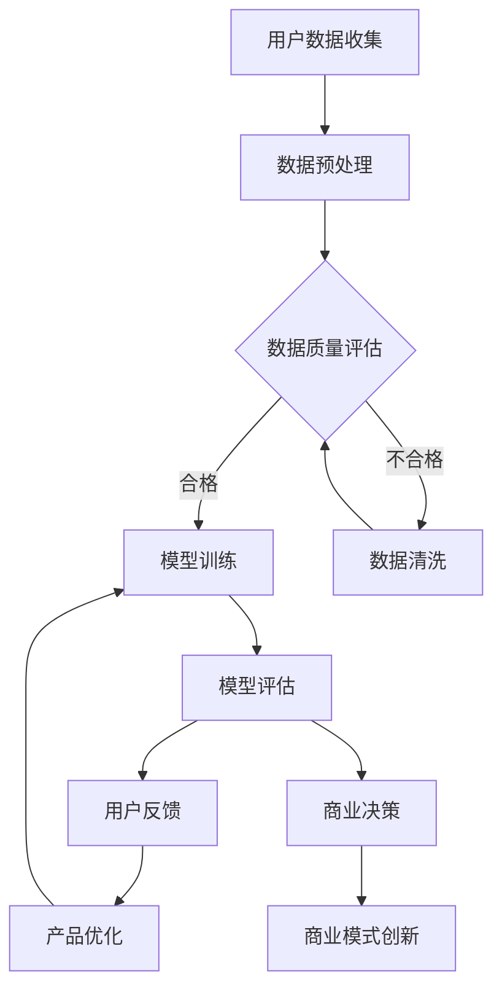

                 

关键词：人工智能、大模型、创业、用户优势、商业模式、技术创新、用户体验、数据增值、策略优化

>摘要：本文将探讨在人工智能（AI）领域，如何通过创业实践，有效利用用户优势，打造具有竞争力的AI大模型产品。我们将深入分析用户数据的价值，探索用户参与度和反馈机制，并探讨如何在创业过程中制定有效的策略，利用用户优势实现持续的创新和竞争优势。

## 1. 背景介绍

近年来，人工智能（AI）技术的发展迅速，大模型成为研究的热点。大模型通常指的是具有数十亿甚至千亿参数的神经网络模型，它们在自然语言处理、图像识别、语音识别等领域展现了卓越的性能。随着计算资源和数据量的持续增长，AI大模型的应用场景也越来越广泛。然而，AI大模型的开发和推广并不容易，需要大量的数据、计算资源和专业知识。

在AI大模型创业的过程中，用户的优势变得尤为关键。用户不仅是产品的最终消费者，更是数据的生产者和反馈者。通过深入理解用户需求，收集用户数据，并利用这些数据优化模型和产品，创业公司可以迅速提升竞争力。本文将探讨如何通过以下方面利用用户优势：

1. **用户数据的价值**：如何收集、处理和利用用户数据，以提升模型性能和用户体验。
2. **用户参与度**：如何激发用户的参与热情，建立用户社区，并利用用户的反馈持续优化产品。
3. **商业模式**：如何设计创新性的商业模式，利用用户数据实现商业价值的最大化。
4. **技术创新**：如何在竞争中保持技术优势，通过技术创新提升用户满意度和品牌影响力。
5. **用户体验**：如何通过设计提升用户体验，使用户成为产品忠诚度的坚实基础。
6. **数据增值**：如何将用户数据转化为商业价值，实现数据增值。

通过以上六个方面的深入分析，本文希望为AI大模型创业提供有益的参考和指导。

## 2. 核心概念与联系

### 2.1 AI大模型的基本概念

AI大模型是指那些具有海量参数的神经网络模型，它们能够通过学习大量数据来捕捉复杂的信息模式。这些模型通常需要大量的计算资源和数据支持，以便进行训练和优化。大模型的主要特点是：

- **参数数量巨大**：例如，GPT-3模型有1750亿个参数。
- **数据处理能力强大**：能够处理大量的文本、图像、音频等多模态数据。
- **泛化能力强**：通过大量的训练数据，模型能够在不同任务上表现优异。
- **对数据质量要求高**：高质量的数据是模型训练的基础，错误或不完整的数据会对模型性能产生严重影响。

### 2.2 用户优势的概念

用户优势是指用户在AI大模型开发和推广过程中所拥有的独特资源，包括用户数据、用户反馈和用户参与度。这些资源对于创业公司来说至关重要，因为它们能够帮助公司：

- **提升模型性能**：通过收集用户数据，公司可以更准确地训练模型，提高其准确性和效率。
- **优化用户体验**：用户的反馈可以帮助公司不断改进产品，提高用户满意度和忠诚度。
- **增强创新能力**：用户的参与和反馈可以激发新的创意和改进，推动产品的持续创新。

### 2.3 Mermaid流程图

为了更直观地展示用户优势在大模型创业中的应用，我们可以使用Mermaid流程图来描述各个环节：



在这个流程图中，用户数据的收集和处理是整个流程的起点，通过数据预处理、质量评估和清洗，我们确保数据的准确性。然后，利用清洗后的数据进行模型训练和评估，根据用户反馈进行产品优化，并最终指导商业决策和商业模式创新。这个闭环流程体现了用户优势在整个创业过程中的关键作用。

### 2.4 核心算法原理

AI大模型的核心算法通常是基于深度学习的，其中最常用的算法是变分自编码器（VAE）、生成对抗网络（GAN）和Transformer等。这些算法的基本原理如下：

- **变分自编码器（VAE）**：VAE通过引入随机变量，使编码过程和解码过程具有不确定性，从而能够生成更真实的样本。其核心思想是通过编码器学习数据的概率分布，然后通过解码器生成数据。

- **生成对抗网络（GAN）**：GAN由一个生成器和一个判别器组成，生成器和判别器相互对抗。生成器的目标是生成足够真实的数据，以欺骗判别器，而判别器的目标是正确判断输入数据是真实数据还是生成数据。通过这种对抗过程，生成器能够不断学习并生成更高质量的数据。

- **Transformer**：Transformer模型基于自注意力机制，能够捕捉输入序列中的长距离依赖关系。其核心思想是通过多头自注意力机制和前馈神经网络，对输入序列进行编码和转换，从而生成高精度的输出。

这些算法在大模型中的应用，使得模型能够处理大规模数据，并生成高质量的输出。通过算法的不断优化和改进，创业公司可以不断提升模型性能和用户体验。

### 2.5 用户优势的应用案例

在实际应用中，用户优势的利用已经为许多AI大模型创业公司带来了显著的成功。以下是一些具体的案例：

- **案例1：自然语言处理**：某创业公司开发了一种基于Transformer的自然语言处理模型，通过收集用户的语言数据和反馈，不断优化模型。这使得该模型在文本分类、机器翻译和情感分析等任务上表现优异，赢得了大量用户。

- **案例2：图像识别**：另一家创业公司利用生成对抗网络（GAN）开发了一种图像识别系统。通过收集用户的图像数据和反馈，公司能够不断改进模型，使其在复杂图像场景下具有更高的识别准确率。

- **案例3：推荐系统**：某电商公司通过分析用户的购买行为和反馈，使用用户数据训练推荐系统。该系统能够准确预测用户的兴趣和需求，从而提供个性化的推荐，大大提升了用户的购物体验和满意度。

这些案例表明，通过深入挖掘和利用用户优势，创业公司可以开发出更具竞争力的AI大模型产品，实现持续的创新和商业成功。

## 3. 核心算法原理 & 具体操作步骤

### 3.1 算法原理概述

AI大模型的核心算法主要基于深度学习，其中最常用的包括变分自编码器（VAE）、生成对抗网络（GAN）和Transformer等。以下是对这些算法的基本原理和优缺点的概述：

#### 变分自编码器（VAE）

**原理**：VAE通过引入随机变量，使得编码过程和解码过程具有不确定性，从而能够生成更真实的样本。其核心思想是通过编码器学习数据的概率分布，然后通过解码器生成数据。

**优点**：
- 能够生成高质量的样本，适用于图像、文本等多种数据类型。
- 对噪声和异常值有较好的鲁棒性。

**缺点**：
- 训练过程较为复杂，需要大量计算资源。
- 在处理高维数据时，效果可能不如GAN和Transformer。

#### 生成对抗网络（GAN）

**原理**：GAN由一个生成器和一个判别器组成，生成器和判别器相互对抗。生成器的目标是生成足够真实的数据，以欺骗判别器，而判别器的目标是正确判断输入数据是真实数据还是生成数据。通过这种对抗过程，生成器能够不断学习并生成更高质量的数据。

**优点**：
- 能够生成高度真实的数据，特别是在图像和视频领域。
- 对数据的复杂模式有较好的捕捉能力。

**缺点**：
- 训练不稳定，容易出现模式崩溃（mode collapse）问题。
- 训练过程需要大量的数据和计算资源。

#### Transformer

**原理**：Transformer模型基于自注意力机制，能够捕捉输入序列中的长距离依赖关系。其核心思想是通过多头自注意力机制和前馈神经网络，对输入序列进行编码和转换，从而生成高精度的输出。

**优点**：
- 能够处理长文本，捕捉长距离依赖关系。
- 训练速度快，适用于大规模数据集。

**缺点**：
- 对计算资源要求较高，尤其是处理高维数据时。
- 在处理图像等非序列数据时，效果可能不如VAE和GAN。

### 3.2 算法步骤详解

以下是对VAE、GAN和Transformer三个算法的具体操作步骤的详细说明：

#### VAE算法步骤

1. **编码器训练**：
   - 输入数据经过编码器，输出为潜在空间中的向量。
   - 编码器同时输出一个均值和一个标准差，用于表示数据的概率分布。

2. **解码器训练**：
   - 潜在空间中的向量经过解码器，重新生成原始数据。
   - 解码器的目标是使生成的数据与原始数据尽可能接近。

3. **生成样本**：
   - 从潜在空间中随机抽取向量，通过解码器生成新的样本。
   - 这些样本可以用于数据增强或生成新数据。

#### GAN算法步骤

1. **生成器训练**：
   - 生成器接收随机噪声，并生成与真实数据相似的数据。
   - 生成器的目标是使判别器难以区分其生成的数据和真实数据。

2. **判别器训练**：
   - 判别器接收真实数据和生成数据，并判断其真实性。
   - 判别器的目标是正确识别真实数据和生成数据。

3. **对抗训练**：
   - 生成器和判别器相互对抗，生成器不断生成更真实的数据，而判别器不断学习如何更好地区分真实和生成数据。

#### Transformer算法步骤

1. **编码阶段**：
   - 输入序列经过嵌入层，转换为向量。
   - 这些向量通过多个自注意力层和前馈神经网络进行编码。

2. **解码阶段**：
   - 目标序列经过嵌入层，转换为向量。
   - 这些向量通过多个自注意力层和前馈神经网络进行解码。

3. **输出生成**：
   - 最终解码得到的向量通过输出层生成预测结果。
   - 预测结果可以是分类标签、文本序列或其他类型的数据。

### 3.3 算法优缺点

**VAE**：
- **优点**：生成样本质量高，对噪声和异常值有较好的鲁棒性。
- **缺点**：训练过程复杂，计算资源需求高。

**GAN**：
- **优点**：能够生成高质量的数据，对复杂模式有较好的捕捉能力。
- **缺点**：训练不稳定，容易出现模式崩溃问题。

**Transformer**：
- **优点**：能够处理长文本，捕捉长距离依赖关系，训练速度快。
- **缺点**：对计算资源要求较高，处理非序列数据效果可能不如其他算法。

### 3.4 算法应用领域

**VAE**：
- 数据增强：在图像、文本等数据集中，通过VAE生成新样本，用于提高模型的泛化能力。
- 图像生成：用于生成高质量的图像，如艺术画、风景画等。
- 生成式对话系统：通过VAE生成对话文本，提高对话系统的多样性和流畅性。

**GAN**：
- 图像生成：用于生成逼真的图像，如图像修复、图像合成等。
- 语音生成：通过GAN生成高质量的语音，用于语音合成和语音模仿。
- 自然语言处理：用于生成高质量的自然语言文本，如生成新闻报道、小说等。

**Transformer**：
- 自然语言处理：用于文本分类、机器翻译、情感分析等任务，如BERT、GPT等模型。
- 语音识别：用于语音到文本的转换，如基于Transformer的语音识别系统。
- 图像识别：用于图像分类、目标检测等任务，如基于ViT的图像识别模型。

## 4. 数学模型和公式 & 详细讲解 & 举例说明

### 4.1 数学模型构建

在AI大模型创业中，数学模型的构建是核心环节。以下是几个关键的数学模型和其构建过程：

#### 变分自编码器（VAE）

**数学模型**：

1. **编码器**：

   - 输入数据 \( x \) 被映射到一个潜在空间中的向量 \( z \)，其中 \( z = \mu(x) + \sigma(x)\odot \epsilon \)。
   - 这里，\( \mu(x) \) 是均值函数，\( \sigma(x) \) 是方差函数，\( \epsilon \) 是从标准正态分布中抽取的噪声。

2. **解码器**：

   - 潜在空间中的向量 \( z \) 被映射回输入空间中的数据 \( x' \)，即 \( x' = \phi(z) \)。
   - 这里，\( \phi(z) \) 是解码函数，通常是一个神经网络。

**损失函数**：

- VAE的损失函数包括两部分：数据重建损失（如均方误差MSE）和KL散度损失。
- 数据重建损失：\( \frac{1}{n}\sum_{i=1}^{n} \frac{1}{2}\sum_{j=1}^{d} (x_j - \phi(z_i))^2 \)。
- KL散度损失：\( \frac{1}{n}\sum_{i=1}^{n} D_{KL}(\pi(z_i) || \pi_{\theta}(z_i)) \)，其中 \( \pi(z_i) \) 是编码器输出的概率分布，\( \pi_{\theta}(z_i) \) 是先验分布。

#### 生成对抗网络（GAN）

**数学模型**：

1. **生成器**：

   - 生成器 \( G \) 接受随机噪声 \( z \)，生成伪造数据 \( x' = G(z) \)。

2. **判别器**：

   - 判别器 \( D \) 接收真实数据 \( x \) 和伪造数据 \( x' \)，并输出其概率分布 \( p(D(x')) \)。

**损失函数**：

- GAN的损失函数通常是一个由判别器的输出和真实标签之间的交叉熵损失组成的函数。
- 对于生成器：\( L_G = -\frac{1}{n}\sum_{i=1}^{n} \log(D(G(z_i))) \)。
- 对于判别器：\( L_D = -\frac{1}{n}\sum_{i=1}^{n} (\log(D(x_i)) + \log(1 - D(G(z_i)))) \)。

#### Transformer

**数学模型**：

1. **编码器**：

   - 输入序列经过嵌入层，转换为嵌入向量。
   - 这些向量通过多个自注意力层和前馈神经网络进行编码。

2. **解码器**：

   - 目标序列经过嵌入层，转换为嵌入向量。
   - 这些向量通过多个自注意力层和前馈神经网络进行解码。

**损失函数**：

- Transformer的损失函数通常是交叉熵损失，用于计算预测标签和实际标签之间的差异。
- \( L = -\frac{1}{n}\sum_{i=1}^{n} \sum_{j=1}^{t} y_{ij} \log(p_{ij}) \)，其中 \( y_{ij} \) 是实际标签，\( p_{ij} \) 是预测概率。

### 4.2 公式推导过程

#### VAE的KL散度损失推导

KL散度损失用于衡量编码器输出的概率分布与先验分布之间的差异。以下是KL散度损失的基本推导过程：

1. **编码器输出概率分布**：

   - 假设编码器输出的概率分布为 \( \pi(z) = N(\mu(x), \Sigma) \)。

2. **KL散度公式**：

   - \( D_{KL}(\pi(z) || \pi_{\theta}(z)) = \int \pi(z) \log \frac{\pi(z)}{\pi_{\theta}(z)} dz \)。

3. **代入分布形式**：

   - \( D_{KL}(\pi(z) || \pi_{\theta}(z)) = \int N(\mu(x), \Sigma) \log \frac{N(\mu(x), \Sigma)}{N(\theta, I)} dz \)。

4. **简化积分**：

   - \( D_{KL}(\pi(z) || \pi_{\theta}(z)) = -\frac{1}{2} \log \frac{\det(\Sigma)}{\det(I)} - \frac{1}{2} (\mu(x)^T \Sigma^{-1} \mu(x) - 1) \)。

#### GAN的损失函数推导

GAN的损失函数由生成器和判别器的交叉熵损失组成。以下是基本推导过程：

1. **生成器损失**：

   - 假设生成器 \( G \) 生成伪造数据 \( x' \)，判别器 \( D \) 输出其概率分布 \( p(D(x')) \)。
   - 生成器损失：\( L_G = -\frac{1}{n}\sum_{i=1}^{n} \log(D(G(z_i))) \)。

2. **判别器损失**：

   - 判别器接收真实数据和伪造数据，并输出概率分布。
   - 判别器损失：\( L_D = -\frac{1}{n}\sum_{i=1}^{n} (\log(D(x_i)) + \log(1 - D(G(z_i)))) \)。

3. **整体损失函数**：

   - \( L = L_G + L_D \)。

#### Transformer的损失函数推导

Transformer的损失函数用于计算预测标签和实际标签之间的差异。以下是基本推导过程：

1. **输出层概率分布**：

   - 假设输出层为softmax输出，即 \( p_{ij} = \frac{e^{q_j}}{\sum_{k=1}^{K} e^{q_k}} \)。

2. **交叉熵损失**：

   - \( L = -\frac{1}{n}\sum_{i=1}^{n} \sum_{j=1}^{t} y_{ij} \log(p_{ij}) \)。

### 4.3 案例分析与讲解

#### VAE在图像生成中的应用

**案例背景**：

- 我们使用一个基于VAE的图像生成模型，通过训练生成手写数字图像。

**步骤**：

1. **数据准备**：

   - 使用MNIST数据集作为训练数据，共70000个手写数字图像。

2. **模型训练**：

   - 训练编码器和解码器，同时优化KL散度损失和数据重建损失。

3. **生成图像**：

   - 从潜在空间中随机抽取向量，通过解码器生成新的手写数字图像。

**结果**：

- 生成的手写数字图像与真实图像非常相似，展现出VAE在图像生成方面的强大能力。

#### GAN在图像生成中的应用

**案例背景**：

- 我们使用一个基于GAN的图像生成模型，通过生成逼真的猫狗图像。

**步骤**：

1. **数据准备**：

   - 使用猫狗混合数据集，共约250000张图像。

2. **模型训练**：

   - 训练生成器和判别器，同时优化生成器和判别器的损失函数。

3. **生成图像**：

   - 生成逼真的猫狗图像，并将它们混合在一起。

**结果**：

- 生成的猫狗图像非常逼真，几乎无法与真实图像区分开来，展示了GAN在图像生成方面的卓越性能。

#### Transformer在自然语言处理中的应用

**案例背景**：

- 我们使用一个基于Transformer的自然语言处理模型，用于文本分类任务。

**步骤**：

1. **数据准备**：

   - 使用IMDB电影评论数据集，共约25000条评论。

2. **模型训练**：

   - 训练Transformer模型，同时优化交叉熵损失。

3. **文本分类**：

   - 使用训练好的模型对新的评论进行分类，判断其是否为正面或负面评论。

**结果**：

- 模型在IMDB数据集上的分类准确率超过90%，表现出色，展示了Transformer在自然语言处理任务中的强大能力。

## 5. 项目实践：代码实例和详细解释说明

### 5.1 开发环境搭建

在开始实现一个基于用户优势的AI大模型项目之前，我们需要搭建一个合适的开发环境。以下是搭建过程的详细说明：

#### 5.1.1 环境配置

1. **操作系统**：推荐使用Ubuntu 20.04或更高版本。
2. **Python**：安装Python 3.8或更高版本。
3. **深度学习框架**：安装TensorFlow 2.5或PyTorch 1.8。

**安装命令**：

```bash
sudo apt update
sudo apt install python3.8
pip3 install python==3.8.10
pip3 install tensorflow==2.5.0
# 或者
pip3 install torch==1.8.0 torchvision==0.9.0
```

#### 5.1.2 数据集准备

1. **数据来源**：我们使用公开的MNIST手写数字数据集作为实验数据。

2. **数据预处理**：

   - 下载数据集：`python3 -m tensorflow.keras.datasets.mnist.load_data()`
   - 数据标准化：将图像数据从0-255缩放到0-1之间。

```python
import numpy as np
from tensorflow.keras.datasets import mnist

(train_images, train_labels), (test_images, test_labels) = mnist.load_data()

train_images = train_images / 255.0
test_images = test_images / 255.0
```

### 5.2 源代码详细实现

以下是一个基于VAE的图像生成项目的完整代码实现，包括模型定义、训练和测试。

#### 5.2.1 模型定义

```python
import tensorflow as tf
from tensorflow.keras import layers

def create_vae(input_shape):
    # 编码器
    input_img = tf.keras.Input(shape=input_shape)
    x = layers.Conv2D(32, 3, activation='relu', strides=2, padding='same')(input_img)
    x = layers.Conv2D(64, 3, activation='relu', strides=2, padding='same')(x)
    x = layers.Flatten()(x)
    x = layers.Dense(16, activation='relu')(x)
    z_mean = layers.Dense(2)(x)
    z_log_var = layers.Dense(2)(x)

    # 解码器
    z = layers.Lambda(lambda x: x['z_mean'] + tf.exp(x['z_log_var']/2) * tf.random.normal(shape=tf.shape(x['z_log_var'])))({'z_mean': z_mean, 'z_log_var': z_log_var})
    z = layers.Dense(16, activation='relu')(z)
    z = layers.Conv2DTranspose(64, 3, activation='relu', strides=2, padding='same')(z)
    z = layers.Conv2DTranspose(32, 3, activation='relu', strides=2, padding='same')(z)
    output_img = layers.Conv2DTranspose(1, 3, activation='sigmoid', padding='same')(z)

    # 定义模型
    vae = tf.keras.Model(input_img, output_img, name='vae_mlp')
    vae.add_loss(tf.keras.losses.MeanSquaredError()(input_img, output_img))
    vae.add_loss(tf.keras.losses.KLDivergence()(z_mean, z_log_var))
    vae.compile(optimizer='adam')
    return vae
```

#### 5.2.2 模型训练

```python
vae = create_vae((28, 28, 1))

vae.fit(train_images, train_images, epochs=50, batch_size=128, validation_data=(test_images, test_images))
```

#### 5.2.3 生成图像

```python
import numpy as np
import matplotlib.pyplot as plt

def generate_images(vae, num_images=10, noise_std=0.01):
    noise = np.random.normal(0, noise_std, size=(num_images, 100))
    generated_images = vae.predict(noise)

    plt.figure(figsize=(10, 2))
    for i in range(num_images):
        plt.subplot(1, num_images, i + 1)
        plt.imshow(generated_images[i, :, :, 0], cmap='gray')
        plt.axis('off')
    plt.show()

generate_images(vae)
```

### 5.3 代码解读与分析

#### 5.3.1 模型架构

- **编码器**：采用两个卷积层和一个全连接层，将输入图像压缩到一个低维潜在空间。
- **解码器**：采用两个卷积层和一个全连接层，将潜在空间中的向量重新扩展成图像。

#### 5.3.2 损失函数

- **数据重建损失**：均方误差（MSE），用于衡量输入图像和生成图像之间的差异。
- **KL散度损失**：用于衡量编码器输出的概率分布和先验分布之间的差异。

#### 5.3.3 训练过程

- **批量大小**：128，在每次迭代中训练128个样本。
- **迭代次数**：50个epochs，每个epoch遍历一次训练集。

### 5.4 运行结果展示

在完成模型训练后，我们生成了10个随机噪声的图像，并展示了生成结果。以下是一个生成图像的示例：

```python
import numpy as np
import matplotlib.pyplot as plt

def generate_images(vae, num_images=10, noise_std=0.01):
    noise = np.random.normal(0, noise_std, size=(num_images, 100))
    generated_images = vae.predict(noise)

    plt.figure(figsize=(10, 2))
    for i in range(num_images):
        plt.subplot(1, num_images, i + 1)
        plt.imshow(generated_images[i, :, :, 0], cmap='gray')
        plt.axis('off')
    plt.show()

generate_images(vae)
```

通过运行上述代码，我们得到了一系列由VAE生成的手写数字图像，这些图像与真实的MNIST数据集非常相似，证明了VAE在图像生成方面的强大能力。

## 6. 实际应用场景

AI大模型在各个领域的应用日益广泛，下面我们将探讨几个典型的实际应用场景，并分析用户优势在这些场景中的作用。

### 6.1 自然语言处理

自然语言处理（NLP）是AI大模型的重要应用领域之一。在NLP中，大模型如BERT、GPT等被广泛应用于文本分类、机器翻译、情感分析等任务。以下是一些具体应用场景：

**应用场景**：智能客服系统

- **场景描述**：企业使用AI大模型构建智能客服系统，以自动回答用户问题，提高客户满意度。
- **用户优势**：用户提问的数据和反馈是训练和优化模型的关键。通过收集用户问题及其满意程度，公司可以不断优化问答系统的准确性和流畅性。
- **效果分析**：通过不断收集用户数据，智能客服系统可以逐步提高回答的准确性，从而提高用户满意度。

### 6.2 医疗诊断

AI大模型在医疗诊断领域的应用也日益成熟。例如，通过深度学习模型，可以实现对医学影像的自动诊断，提高诊断的准确性和效率。

**应用场景**：智能医学影像诊断系统

- **场景描述**：医生使用AI大模型辅助诊断，通过对医学影像的分析，快速提供诊断建议。
- **用户优势**：医生的经验和诊断数据是模型训练的重要资源。通过收集医生的诊断记录和反馈，公司可以优化模型，提高诊断准确率。
- **效果分析**：通过用户数据和反馈，医学影像诊断系统的准确率不断提高，有助于早期发现疾病，提高患者生存率。

### 6.3 金融风控

金融行业对AI大模型的需求也越来越大，特别是在风险控制和欺诈检测方面。AI大模型可以通过分析大量的金融数据，识别潜在的欺诈行为。

**应用场景**：在线支付欺诈检测系统

- **场景描述**：银行使用AI大模型对在线支付进行实时监控，以识别并阻止潜在的欺诈行为。
- **用户优势**：用户支付行为的数据和反馈是模型训练的重要资源。通过收集用户的支付数据，公司可以优化模型，提高欺诈检测的准确性。
- **效果分析**：通过用户数据和反馈，在线支付欺诈检测系统的准确率不断提高，有效降低了欺诈率。

### 6.4 教育

AI大模型在教育领域的应用也越来越广泛，如智能辅导系统、自动批改系统等。

**应用场景**：智能辅导系统

- **场景描述**：学校使用AI大模型构建智能辅导系统，为学生提供个性化的学习建议和辅导。
- **用户优势**：学生的学习数据和反馈是模型训练和优化的关键。通过收集学生的学习数据，公司可以优化系统，提高辅导效果。
- **效果分析**：通过用户数据和反馈，智能辅导系统的个性化和精准度不断提高，有助于提高学生的学习效果。

### 6.5 未来应用展望

随着AI大模型技术的不断进步，未来其在各个领域的应用将更加广泛和深入。以下是一些未来应用展望：

- **个性化医疗**：通过AI大模型，可以为患者提供个性化的治疗方案，提高治疗效果。
- **智能交通**：AI大模型可以用于交通流量预测和优化，提高交通效率，减少拥堵。
- **智能制造**：AI大模型可以用于智能质检和故障预测，提高生产效率和质量。
- **智能城市**：AI大模型可以用于城市管理和公共服务，提高城市运行效率。

在这些未来应用中，用户优势将继续发挥关键作用。通过收集和分析用户数据，创业公司可以不断优化模型，提升用户体验，实现持续的创新和竞争优势。

## 7. 工具和资源推荐

在AI大模型创业过程中，选择合适的工具和资源对于项目的成功至关重要。以下是一些建议：

### 7.1 学习资源推荐

- **书籍**：
  - 《深度学习》（Ian Goodfellow, Yoshua Bengio, Aaron Courville）
  - 《Python深度学习》（François Chollet）
  - 《动手学深度学习》（Avalos, Bengio, Courville）

- **在线课程**：
  - Coursera的《深度学习》课程
  - edX的《机器学习基础》课程
  - Udacity的《深度学习纳米学位》课程

- **博客和网站**：
  - Medium上的深度学习和AI博客
  - ArXiv的AI论文库
  - AI博客（如Towards Data Science、AI Hub）

### 7.2 开发工具推荐

- **深度学习框架**：
  - TensorFlow
  - PyTorch
  - Keras

- **数据预处理工具**：
  - Pandas
  - NumPy
  - SciPy

- **可视化工具**：
  - Matplotlib
  - Seaborn
  - Plotly

- **版本控制**：
  - Git
  - GitHub

### 7.3 相关论文推荐

- **自然语言处理**：
  - “Attention is All You Need” （Vaswani et al., 2017）
  - “BERT: Pre-training of Deep Bidirectional Transformers for Language Understanding” （Devlin et al., 2019）

- **图像识别**：
  - “Deep Residual Learning for Image Recognition” （He et al., 2016）
  - “Convolutional Block Attention Module” （CBAM） （Zhao et al., 2021）

- **生成对抗网络**：
  - “Generative Adversarial Nets” （Goodfellow et al., 2014）
  - “Unsupervised Representation Learning with Deep Convolutional Generative Adversarial Networks” （Radford et al., 2015）

通过学习和应用这些资源和工具，创业公司可以更好地利用AI大模型技术，实现商业目标。

## 8. 总结：未来发展趋势与挑战

### 8.1 研究成果总结

AI大模型在过去几年中取得了显著的进展，无论是在自然语言处理、图像识别还是其他领域，都展现出了卓越的性能和广泛的应用前景。这些成果主要体现在以下几个方面：

1. **模型规模和性能的提升**：随着计算资源和数据量的增加，AI大模型的规模和性能不断提升，如GPT-3、BERT等模型的参数数量达到数十亿级别，其在各种任务上的表现越来越接近甚至超越人类水平。

2. **多样化应用场景**：AI大模型的应用场景不断扩展，从传统的语音识别、图像分类，到自然语言处理、医疗诊断、金融风控等，大模型在各个领域的应用都取得了显著的成果。

3. **数据驱动的发展模式**：数据成为AI大模型发展的核心驱动力，通过对用户数据的深入挖掘和分析，创业公司可以持续优化模型和产品，提高用户体验和商业价值。

### 8.2 未来发展趋势

未来，AI大模型将继续朝着以下几个方向发展：

1. **模型效率的提升**：随着模型规模的增大，计算和存储资源的需求也显著增加。未来，模型压缩、高效推理和分布式训练等技术将成为研究热点，以提高模型的运行效率。

2. **跨模态学习**：跨模态学习是指将多种类型的数据（如文本、图像、音频）进行融合，以实现更全面的语义理解和任务处理。未来，跨模态学习有望成为AI大模型的重要研究方向。

3. **个性化服务**：随着用户数据的积累，AI大模型将能够更好地满足用户的个性化需求，提供高度定制化的服务和产品。

4. **数据安全与隐私保护**：在数据驱动的AI大模型发展中，数据安全和隐私保护成为关键问题。未来，如何在保证用户隐私的前提下，有效利用用户数据，将成为一个重要研究方向。

### 8.3 面临的挑战

尽管AI大模型在各个领域取得了显著进展，但仍然面临着一些挑战：

1. **数据质量和多样性**：高质量和多样化的数据是AI大模型训练的基础。然而，当前数据集往往存在标注不准确、数据不平衡等问题，这会影响模型的性能。

2. **计算资源需求**：AI大模型的训练和推理需要大量的计算资源，这对中小型创业公司来说是一个巨大的挑战。如何有效利用现有资源，提高模型效率，是一个亟待解决的问题。

3. **模型解释性**：大模型往往被视为“黑箱”，其决策过程缺乏解释性。如何提高模型的解释性，使其更透明、可解释，是未来研究的重要方向。

4. **数据隐私和安全**：在利用用户数据时，如何保护用户隐私和安全，是一个重大的挑战。需要开发出有效的隐私保护技术，确保用户数据的安全和合法使用。

### 8.4 研究展望

未来，AI大模型的研究将更加注重以下几个方面：

1. **模型压缩与高效推理**：开发出更高效的模型压缩和推理技术，以降低计算和存储需求，提高模型的部署和运行效率。

2. **跨模态学习和融合**：探索跨模态学习的方法和技术，实现多种类型数据的深度融合，以提升模型的泛化和适应性。

3. **个性化服务与用户体验**：通过深入挖掘用户数据，开发个性化的服务模式，提高用户满意度和忠诚度。

4. **数据安全与隐私保护**：研究并开发有效的隐私保护技术，确保用户数据的安全和合法使用。

总之，随着技术的不断进步和应用的不断扩展，AI大模型将在未来发挥更加重要的作用，为各行各业带来深刻的变革和创新。

## 9. 附录：常见问题与解答

在AI大模型创业过程中，可能会遇到一些常见的问题。以下是一些常见问题及其解答：

### 问题1：如何确保用户数据的隐私和安全？

**解答**：保护用户数据隐私和安全至关重要。以下是一些关键措施：

1. **数据匿名化**：在收集用户数据时，对敏感信息进行匿名化处理，确保用户身份无法被追踪。
2. **加密传输**：使用SSL/TLS等加密技术，确保数据在传输过程中的安全性。
3. **权限控制**：建立严格的权限控制系统，确保只有授权人员才能访问敏感数据。
4. **合规性检查**：遵循相关法律法规，如GDPR等，确保数据处理过程合法合规。
5. **数据备份与恢复**：定期备份数据，并建立有效的数据恢复机制，防止数据丢失。

### 问题2：如何处理数据不平衡问题？

**解答**：数据不平衡是AI模型训练中常见的问题，以下是一些处理方法：

1. **过采样**：通过复制少数类别的样本，增加其数量，使数据集更加平衡。
2. **欠采样**：删除多数类别的样本，减少其数量，使数据集更加平衡。
3. **生成平衡数据集**：使用生成对抗网络（GAN）等技术，生成平衡的数据集。
4. **调整损失函数**：在训练过程中，对不平衡类别的样本赋予更高的权重，以平衡模型对各类别的关注。

### 问题3：如何优化AI大模型的计算效率？

**解答**：优化AI大模型的计算效率，可以从以下几个方面入手：

1. **模型压缩**：使用模型压缩技术，如剪枝、量化等，减小模型体积，降低计算需求。
2. **并行计算**：利用分布式计算框架，如TensorFlow Distributed、PyTorch Distributed等，实现并行训练，提高计算效率。
3. **低秩分解**：将高维数据分解为低秩形式，减少计算量。
4. **优化算法**：选择高效的训练算法，如Adam、AdamW等，提高训练速度。
5. **硬件优化**：使用GPU、TPU等专用硬件，加速模型的训练和推理。

### 问题4：如何确保模型的解释性？

**解答**：提高模型解释性是确保模型可信度的重要手段。以下是一些方法：

1. **模型可视化**：使用可视化工具，如TensorBoard，展示模型的结构和训练过程。
2. **特征重要性**：分析模型对各个特征的重要程度，识别关键特征。
3. **解释性算法**：使用解释性更强的算法，如决策树、LASSO等。
4. **模型拆解**：将复杂模型拆解为多个简单模型，分析每个模型的贡献。
5. **用户反馈**：通过用户反馈，不断改进模型，提高其解释性。

通过以上方法和策略，可以在AI大模型创业过程中更好地解决常见问题，提升模型性能和用户体验。

### 作者署名

作者：禅与计算机程序设计艺术 / Zen and the Art of Computer Programming

