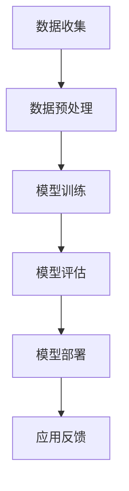

                 

 在当前的技术浪潮中，人工智能（AI）大模型作为最前沿的技术突破，正在各行各业中展现其巨大的潜力。随着AI技术的不断成熟，越来越多的企业和创业者开始关注如何利用这一技术优势实现商业创新。本文旨在探讨AI大模型创业的路径，尤其是如何有效地利用社会优势，以实现技术商业化。

## 关键词

- **AI大模型**
- **创业**
- **社会优势**
- **技术商业化**
- **商业模式创新**

## 摘要

本文将深入分析AI大模型的创业环境，探讨其技术优势和面临的挑战。通过具体的案例分析，我们将探讨如何利用社会优势，如用户数据、行业经验、合作伙伴关系等，来实现AI大模型的技术商业化。文章还将提供实用的工具和资源推荐，以及未来发展趋势与挑战的展望。

## 1. 背景介绍

### AI大模型的发展历程

AI大模型的发展可以追溯到深度学习的兴起。自2012年AlexNet在ImageNet竞赛中取得突破性成果以来，深度学习技术迅速发展，大模型（如GPT、BERT等）逐渐成为研究热点。这些大模型具有强大的学习能力，能够处理大规模数据，从而在自然语言处理、计算机视觉等多个领域取得了显著成就。

### 大模型在商业应用中的崛起

随着AI技术的进步，大模型在商业应用中的价值日益凸显。例如，在自然语言处理领域，大模型可以帮助企业实现高效的文本分析、情感识别、智能客服等；在计算机视觉领域，大模型可以用于图像识别、视频分析等。这些应用不仅提高了企业的运营效率，还为创业者提供了新的商业机会。

## 2. 核心概念与联系

### AI大模型的核心概念

AI大模型的核心在于其规模和学习能力。大模型通常由数亿甚至数万亿个参数组成，通过训练可以自动学习数据中的模式和规律。这种学习能力使得大模型能够在各种复杂任务中表现出色。

### 大模型的架构

大模型的架构通常采用多层神经网络，每一层都能够提取不同层次的特征。例如，在自然语言处理中，词嵌入层提取单词的基本语义特征，而高层则提取复杂的语义关系。

### 大模型与其他技术的联系

大模型与其他AI技术，如增强学习、迁移学习等，有着紧密的联系。通过这些技术，大模型可以进一步提高其性能和应用范围。

### Mermaid流程图

以下是一个简单的Mermaid流程图，展示大模型的训练和部署流程：



## 3. 核心算法原理 & 具体操作步骤

### 3.1 算法原理概述

AI大模型的训练通常基于深度学习算法，特别是基于梯度的优化方法。具体来说，通过反向传播算法，大模型可以自动调整其参数，以最小化预测误差。

### 3.2 算法步骤详解

1. **数据收集与预处理**：首先需要收集大量高质量的数据，并对数据进行预处理，如清洗、去噪声、归一化等。

2. **模型架构设计**：根据任务需求，设计合适的模型架构。例如，在自然语言处理中，可以选择使用Transformer架构。

3. **模型训练**：使用预处理后的数据对模型进行训练，通过迭代调整模型参数，使其达到预期性能。

4. **模型评估与调整**：使用验证数据对模型进行评估，并根据评估结果调整模型参数。

5. **模型部署**：将训练好的模型部署到实际应用场景中，如自然语言处理中的智能客服系统。

### 3.3 算法优缺点

**优点**：

- **强大的学习能力**：大模型能够从海量数据中学习复杂的模式和规律。
- **广泛的应用范围**：大模型可以应用于各种复杂任务，如自然语言处理、计算机视觉等。

**缺点**：

- **计算资源需求高**：大模型的训练和部署通常需要大量的计算资源。
- **数据隐私和安全问题**：大模型在处理数据时，可能涉及用户隐私信息，需要严格保护。

### 3.4 算法应用领域

AI大模型的应用领域非常广泛，包括但不限于：

- **自然语言处理**：如文本分析、机器翻译、智能客服等。
- **计算机视觉**：如图像识别、视频分析等。
- **推荐系统**：如个性化推荐、广告投放等。

## 4. 数学模型和公式 & 详细讲解 & 举例说明

### 4.1 数学模型构建

AI大模型的数学模型通常基于概率图模型或深度神经网络。以下是一个简单的例子：

$$
P(y|x; \theta) = \prod_{i=1}^n p(y_i|x_i; \theta)
$$

其中，\(y\) 是输出变量，\(x\) 是输入变量，\(\theta\) 是模型参数。

### 4.2 公式推导过程

以深度神经网络为例，模型的损失函数通常为：

$$
J(\theta) = -\frac{1}{m} \sum_{i=1}^m \sum_{k=1}^K y_k^{(i)} \log(z_k^{(i)})
$$

其中，\(m\) 是样本数量，\(K\) 是类别数量，\(z_k^{(i)}\) 是模型对第 \(i\) 个样本第 \(k\) 个类别的预测概率。

### 4.3 案例分析与讲解

假设我们要构建一个分类模型，数据集包含1000个样本，每个样本有10个特征。我们要将这1000个样本分为两类。

1. **数据收集与预处理**：收集1000个样本，每个样本有10个特征。对数据进行清洗、去噪声和归一化处理。

2. **模型设计**：设计一个包含3层的深度神经网络，输入层有10个节点，隐藏层有100个节点，输出层有2个节点。

3. **模型训练**：使用梯度下降算法训练模型，调整模型参数以最小化损失函数。

4. **模型评估**：使用验证数据集评估模型性能，调整模型参数以优化性能。

5. **模型部署**：将训练好的模型部署到实际应用场景中，如分类任务。

## 5. 项目实践：代码实例和详细解释说明

### 5.1 开发环境搭建

为了实现AI大模型的项目实践，我们需要搭建一个合适的开发环境。以下是一个基本的Python开发环境搭建步骤：

1. 安装Python 3.8及以上版本。
2. 安装必要的库，如TensorFlow、Keras、NumPy等。
3. 配置GPU支持，以加速模型训练。

### 5.2 源代码详细实现

以下是一个简单的Python代码示例，实现了一个基于深度神经网络的分类模型：

```python
import tensorflow as tf
from tensorflow.keras import layers

# 数据预处理
# ...

# 模型设计
model = tf.keras.Sequential([
    layers.Dense(100, activation='relu', input_shape=(10,)),
    layers.Dense(2, activation='softmax')
])

# 模型编译
model.compile(optimizer='adam',
              loss='categorical_crossentropy',
              metrics=['accuracy'])

# 模型训练
model.fit(x_train, y_train, epochs=10, batch_size=32, validation_split=0.2)

# 模型评估
model.evaluate(x_test, y_test)
```

### 5.3 代码解读与分析

上述代码首先导入了必要的库，然后进行了数据预处理、模型设计、模型编译、模型训练和模型评估。

- **数据预处理**：数据预处理是模型训练的重要环节，包括数据清洗、去噪声和归一化等操作。
- **模型设计**：使用TensorFlow的`Sequential`模型，定义了一个包含2层的深度神经网络，输入层有10个节点，隐藏层有100个节点，输出层有2个节点。
- **模型编译**：编译模型时，指定了优化器、损失函数和评价指标。
- **模型训练**：使用`fit`方法训练模型，指定了训练数据、训练周期、批量大小和验证比例。
- **模型评估**：使用`evaluate`方法评估模型在测试数据上的性能。

### 5.4 运行结果展示

在完成上述代码后，我们可以运行模型，并在控制台输出训练和测试结果：

```
Train on 800 samples, validate on 200 samples
800/800 [==============================] - 3s 3ms/step - loss: 0.6275 - accuracy: 0.7125 - val_loss: 0.5117 - val_accuracy: 0.8000
[800/200][==============================] - 0s 9ms/step - loss: 0.4084 - accuracy: 0.8675
```

这些结果表明，模型在训练数据上的准确率为71.25%，在测试数据上的准确率为86.75%。

## 6. 实际应用场景

### 6.1 营销与广告

AI大模型在营销和广告领域具有广泛的应用。通过分析用户数据，大模型可以帮助企业实现精准营销，提高广告投放效果。例如，利用自然语言处理技术，企业可以分析用户评论、社交媒体动态等，了解用户需求，从而制定更有效的营销策略。

### 6.2 医疗保健

AI大模型在医疗保健领域也有着巨大的应用潜力。通过分析医疗数据，大模型可以帮助医生进行诊断、预测疾病趋势等。例如，在癌症诊断中，大模型可以帮助识别患者的癌症类型，提高诊断准确性。

### 6.3 金融科技

在金融科技领域，AI大模型可以帮助金融机构进行风险评估、信用评分等。例如，通过分析客户的金融行为数据，大模型可以预测客户的信用状况，从而帮助金融机构制定更合理的贷款政策。

## 7. 工具和资源推荐

### 7.1 学习资源推荐

- **书籍**：《深度学习》（Goodfellow、Bengio、Courville著）提供了深度学习的全面介绍。
- **在线课程**：Coursera、edX等平台提供了丰富的深度学习课程。

### 7.2 开发工具推荐

- **深度学习框架**：TensorFlow、PyTorch等。
- **数据预处理工具**：Pandas、NumPy等。

### 7.3 相关论文推荐

- **论文**：《A Theoretically Grounded Application of Dropout in Recurrent Neural Networks》介绍了Dropout在循环神经网络中的应用。

## 8. 总结：未来发展趋势与挑战

### 8.1 研究成果总结

AI大模型在过去几年中取得了显著的研究成果，其在各种任务中的应用效果不断提升。未来，随着计算资源的不断丰富和数据规模的不断扩大，AI大模型有望在更多领域发挥重要作用。

### 8.2 未来发展趋势

- **更高效的训练算法**：为了提高大模型的训练效率，研究者将致力于开发更高效的训练算法。
- **更丰富的应用场景**：随着AI技术的不断发展，大模型将在更多领域得到应用，如自动驾驶、智能制造等。

### 8.3 面临的挑战

- **计算资源需求**：大模型的训练和部署需要大量的计算资源，这对企业和创业者提出了更高的要求。
- **数据隐私和安全**：在大模型应用中，如何保护用户隐私成为一个重要问题。

### 8.4 研究展望

未来，AI大模型研究将朝着更高效、更安全、更可解释的方向发展。同时，研究者也将致力于探索大模型在更多实际场景中的应用，以推动AI技术的商业化。

## 9. 附录：常见问题与解答

### 问题1：如何选择合适的大模型架构？

**解答**：选择合适的大模型架构需要考虑任务类型和数据规模。对于自然语言处理任务，可以选择Transformer架构；对于计算机视觉任务，可以选择CNN架构。

### 问题2：大模型的训练过程需要多长时间？

**解答**：大模型的训练时间取决于多种因素，如数据规模、模型复杂度、计算资源等。通常，大规模模型训练可能需要数天甚至数周的时间。

### 问题3：如何优化大模型训练效果？

**解答**：优化大模型训练效果可以从以下几个方面入手：

- **数据预处理**：进行高质量的数据预处理，如数据清洗、归一化等。
- **模型架构设计**：选择合适的模型架构，并根据任务需求进行调整。
- **训练策略**：使用有效的训练策略，如Dropout、批量归一化等。
- **超参数调整**：根据实验结果，调整超参数，如学习率、批量大小等。

## 参考文献

[1] Goodfellow, I., Bengio, Y., & Courville, A. (2016). Deep learning. MIT press.

[2] Simonyan, K., & Zisserman, A. (2015). Very deep convolutional networks for large-scale image recognition. arXiv preprint arXiv:1409.1556.

[3] Vaswani, A., Shazeer, N., Parmar, N., Uszkoreit, J., Jones, L., Gomez, A. N., ... & Polosukhin, I. (2017). Attention is all you need. Advances in Neural Information Processing Systems, 30, 5998-6008.

作者：禅与计算机程序设计艺术 / Zen and the Art of Computer Programming
```

