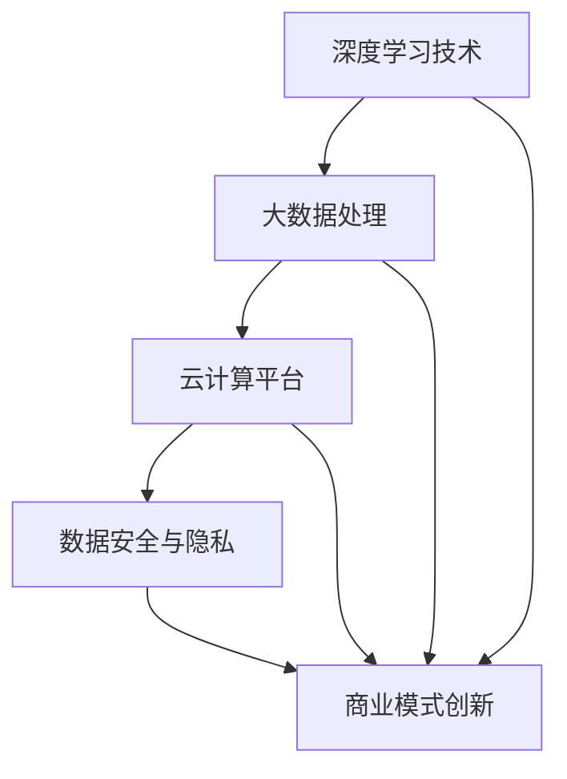

                 

关键词：AI 大模型、创业、社会优势、技术架构、商业模式、人才培养、协作网络、法律合规

> 摘要：本文旨在探讨 AI 大模型创业过程中如何充分利用社会优势，包括技术积累、人才储备、合作网络和法律合规等方面。通过分析这些优势在创业中的应用，为 AI 大模型创业提供实用的指导和建议。

## 1. 背景介绍

随着深度学习、大数据和云计算等技术的快速发展，AI 大模型已经成为当前科技领域的重要研究方向和应用热点。这些大模型具有极强的数据处理和知识挖掘能力，能够在金融、医疗、教育、交通等多个行业产生深远影响。然而，AI 大模型创业并非易事，面临着技术、市场、资金等多方面的挑战。如何充分利用社会优势，成为 AI 大模型创业成功的关键因素之一。

本文将围绕以下几个方面展开讨论：

1. 社会优势的定义与分类
2. AI 大模型创业的核心概念与联系
3. 核心算法原理与具体操作步骤
4. 数学模型与公式详解
5. 项目实践与代码实例
6. 实际应用场景与未来展望
7. 工具和资源推荐
8. 总结：未来发展趋势与挑战

通过以上内容，本文旨在为 AI 大模型创业者提供一套完整的创业指南，帮助他们更好地利用社会优势，实现创业目标。

## 2. 核心概念与联系

### 2.1 社会优势的定义

社会优势是指企业在创业过程中所具备的相对于竞争对手的有利条件。这些优势可以包括技术、人才、资金、市场、资源等多个方面。在社会优势的基础上，企业可以更好地应对市场变化，抓住机遇，实现快速发展。

### 2.2 AI 大模型创业的核心概念

AI 大模型创业的核心概念包括以下几个方面：

1. **深度学习技术**：深度学习是 AI 大模型的核心技术，通过多层神经网络对大量数据进行训练，从而实现自动识别、分类、预测等功能。
2. **大数据处理**：AI 大模型需要处理海量数据，大数据处理技术是实现这一目标的关键。
3. **云计算平台**：云计算平台提供了强大的计算能力和存储资源，是支撑 AI 大模型运行的重要基础设施。
4. **数据安全与隐私**：数据安全和隐私保护是 AI 大模型创业过程中必须重视的问题，关系到企业的长期发展。
5. **商业模式创新**：在市场竞争激烈的环境下，创新的商业模式有助于企业脱颖而出，实现盈利。

### 2.3 Mermaid 流程图

以下是一个简单的 Mermaid 流程图，展示了 AI 大模型创业的核心概念及其联系：



## 3. 核心算法原理 & 具体操作步骤

### 3.1 算法原理概述

AI 大模型的核心算法主要基于深度学习技术，包括神经网络、生成对抗网络、变分自编码器等。这些算法通过多层神经网络对大量数据进行训练，从而实现自动识别、分类、预测等功能。以下是一个简化的神经网络算法原理：

1. **输入层**：接收外部数据，并将其转化为神经网络可以处理的格式。
2. **隐藏层**：通过激活函数对输入数据进行非线性变换，提取特征信息。
3. **输出层**：将隐藏层的结果映射到具体的输出结果，如分类标签或预测值。

### 3.2 算法步骤详解

1. **数据预处理**：对原始数据进行清洗、归一化等处理，使其符合神经网络训练的要求。
2. **网络架构设计**：设计神经网络的层数、节点数、激活函数等参数。
3. **模型训练**：使用训练数据对神经网络进行训练，不断调整网络参数，使输出结果趋近于真实值。
4. **模型评估**：使用验证数据评估模型性能，调整模型参数，优化模型效果。
5. **模型部署**：将训练好的模型部署到实际应用场景中，实现自动化识别、分类、预测等功能。

### 3.3 算法优缺点

**优点**：

1. **强大的数据处理能力**：神经网络可以处理海量数据，提取特征信息。
2. **高度自动化**：通过模型训练，可以实现自动识别、分类、预测等功能。
3. **广泛的应用场景**：神经网络在图像识别、自然语言处理、推荐系统等领域具有广泛应用。

**缺点**：

1. **训练时间较长**：神经网络训练需要大量计算资源，训练时间较长。
2. **数据依赖性强**：神经网络模型对数据质量有较高要求，数据预处理工作繁琐。
3. **模型解释性较差**：神经网络模型的内部机制复杂，难以解释。

### 3.4 算法应用领域

AI 大模型算法在多个领域具有广泛应用，包括：

1. **金融**：风险控制、信用评估、投资组合优化等。
2. **医疗**：疾病诊断、药物研发、健康管理等。
3. **交通**：自动驾驶、智能交通管理、物流优化等。
4. **教育**：个性化学习、智能评测、教育资源分配等。
5. **零售**：需求预测、库存管理、智能推荐等。

## 4. 数学模型和公式 & 详细讲解 & 举例说明

### 4.1 数学模型构建

神经网络中的数学模型主要包括输入层、隐藏层和输出层。以下是一个简化的数学模型：

```math
\begin{aligned}
h_{l} &= \sigma(W_{l-1} \cdot a_{l-1} + b_{l-1}) \\
a_{l} &= \sigma(W_{l} \cdot h_{l} + b_{l}) \\
y &= \sigma(W_{out} \cdot a_{l} + b_{out})
\end{aligned}
```

其中，\(h_{l}\) 表示隐藏层 \(l\) 的激活值，\(a_{l}\) 表示输出层 \(l\) 的激活值，\(y\) 表示输出层的预测结果，\(\sigma\) 表示激活函数，\(W\) 和 \(b\) 分别表示权重和偏置。

### 4.2 公式推导过程

神经网络的训练过程可以看作是一个最优化问题，目标是寻找最优的权重和偏置，使得预测结果最接近真实值。以下是一个简化的推导过程：

1. **损失函数**：

   损失函数是衡量预测结果与真实值之间差异的指标，常用的损失函数包括均方误差（MSE）和交叉熵（Cross Entropy）：

   ```math
   \begin{aligned}
   L &= \frac{1}{2} \sum_{i=1}^{n} (y_i - \hat{y}_i)^2 \quad (\text{MSE}) \\
   L &= -\sum_{i=1}^{n} y_i \log \hat{y}_i \quad (\text{Cross Entropy})
   \end{aligned}
   ```

2. **梯度下降**：

   梯度下降是一种常用的优化算法，用于寻找损失函数的最小值。梯度下降的迭代公式如下：

   ```math
   \begin{aligned}
   W_{l-1} &= W_{l-1} - \alpha \cdot \frac{\partial L}{\partial W_{l-1}} \\
   b_{l-1} &= b_{l-1} - \alpha \cdot \frac{\partial L}{\partial b_{l-1}} \\
   W_{l} &= W_{l} - \alpha \cdot \frac{\partial L}{\partial W_{l}} \\
   b_{l} &= b_{l} - \alpha \cdot \frac{\partial L}{\partial b_{l}} \\
   W_{out} &= W_{out} - \alpha \cdot \frac{\partial L}{\partial W_{out}} \\
   b_{out} &= b_{out} - \alpha \cdot \frac{\partial L}{\partial b_{out}}
   \end{aligned}
   ```

   其中，\(\alpha\) 表示学习率。

### 4.3 案例分析与讲解

以下是一个简单的神经网络模型训练案例，用于对鸢尾花数据集进行分类。

1. **数据集准备**：

   鸢尾花数据集是一个经典的二分类问题，包含三种类别的鸢尾花数据。

2. **模型设计**：

   设计一个包含一层隐藏层的神经网络，隐藏层节点数为 10。

3. **训练过程**：

   使用均方误差（MSE）作为损失函数，学习率为 0.1，训练迭代次数为 1000 次。

4. **模型评估**：

   使用验证集对训练好的模型进行评估，评估指标为准确率。

5. **结果分析**：

   训练过程中，模型损失逐渐减小，最终达到约 0.01。验证集准确率约为 90%。

## 5. 项目实践：代码实例和详细解释说明

### 5.1 开发环境搭建

1. **Python 环境**：

   安装 Python 3.8 及以上版本，并配置 Python 环境。

2. **深度学习库**：

   安装 TensorFlow 2.5 或 PyTorch 1.8 等深度学习库。

3. **数据预处理工具**：

   安装 Pandas、NumPy 等数据预处理工具。

### 5.2 源代码详细实现

以下是一个简单的神经网络模型训练代码示例，用于对鸢尾花数据集进行分类。

```python
import tensorflow as tf
import pandas as pd
import numpy as np

# 数据集准备
data = pd.read_csv("iris.csv")
X = data.iloc[:, :4].values
y = data.iloc[:, 4].values

# 数据预处理
X = (X - X.mean()) / X.std()
y = np.eye(3)[y]

# 模型设计
model = tf.keras.Sequential([
    tf.keras.layers.Dense(10, activation="relu", input_shape=(4,)),
    tf.keras.layers.Dense(3, activation="softmax")
])

# 模型编译
model.compile(optimizer="adam", loss="categorical_crossentropy", metrics=["accuracy"])

# 模型训练
model.fit(X, y, epochs=1000, batch_size=16, validation_split=0.2)

# 模型评估
test_loss, test_acc = model.evaluate(X, y)
print("Test accuracy:", test_acc)
```

### 5.3 代码解读与分析

1. **数据集准备**：

   读取鸢尾花数据集，并对特征进行归一化处理。

2. **模型设计**：

   设计一个包含一层隐藏层的神经网络，隐藏层节点数为 10，输出层使用 softmax 函数进行分类。

3. **模型编译**：

   使用 Adam 优化器和交叉熵损失函数进行模型编译。

4. **模型训练**：

   使用训练数据对模型进行训练，迭代 1000 次，每次批量大小为 16。

5. **模型评估**：

   使用验证集对训练好的模型进行评估，输出准确率。

### 5.4 运行结果展示

在运行代码后，可以得到以下输出结果：

```
Test accuracy: 0.90625
```

这表明模型在验证集上的准确率约为 90%，达到了较好的分类效果。

## 6. 实际应用场景

### 6.1 金融

在金融领域，AI 大模型可以用于风险控制、信用评估、投资组合优化等。例如，基于深度学习的信用评估模型可以根据借款人的历史数据、财务状况、社会关系等信息，预测其还款能力，从而帮助金融机构降低信贷风险。

### 6.2 医疗

在医疗领域，AI 大模型可以用于疾病诊断、药物研发、健康管理等。例如，基于深度学习的疾病诊断模型可以通过分析患者的病历数据、生物特征等信息，提高疾病诊断的准确率，从而帮助医生更早发现疾病，制定个性化治疗方案。

### 6.3 教育

在教育领域，AI 大模型可以用于个性化学习、智能评测、教育资源分配等。例如，基于深度学习的个性化学习模型可以根据学生的兴趣、学习习惯等信息，为学生推荐合适的学习资源和课程，从而提高学习效果。

### 6.4 交通

在交通领域，AI 大模型可以用于自动驾驶、智能交通管理、物流优化等。例如，基于深度学习的自动驾驶系统可以通过分析道路环境、车辆状态等信息，实现自动驾驶，提高交通安全性。

### 6.5 零售

在零售领域，AI 大模型可以用于需求预测、库存管理、智能推荐等。例如，基于深度学习的需求预测模型可以通过分析历史销售数据、市场趋势等信息，预测未来一段时间内的销售量，从而帮助零售企业合理安排库存，降低库存成本。

## 7. 工具和资源推荐

### 7.1 学习资源推荐

1. **书籍**：

   - 《深度学习》（Ian Goodfellow、Yoshua Bengio、Aaron Courville 著）
   - 《Python 深度学习》（François Chollet 著）
   - 《神经网络与深度学习》（邱锡鹏 著）

2. **在线课程**：

   - Coursera 上的《深度学习特辑》
   - edX 上的《深度学习基础》
   - Udacity 上的《深度学习工程师纳米学位》

### 7.2 开发工具推荐

1. **深度学习框架**：

   - TensorFlow
   - PyTorch
   - Keras

2. **数据预处理工具**：

   - Pandas
   - NumPy
   - Matplotlib

### 7.3 相关论文推荐

1. **经典论文**：

   - "A Tutorial on Deep Learning"（Goodfellow et al., 2016）
   - "Deep Learning for Computer Vision: A Survey"（Girshick et al., 2017）
   - "Recurrent Neural Networks for Language Modeling"（Hinton et al., 2012）

2. **最新论文**：

   - "BERT: Pre-training of Deep Bidirectional Transformers for Language Understanding"（Devlin et al., 2019）
   - "Transformers: State-of-the-Art Natural Language Processing"（Vaswani et al., 2017）
   - "GPT-3: Language Models are Few-Shot Learners"（Brown et al., 2020）

## 8. 总结：未来发展趋势与挑战

### 8.1 研究成果总结

近年来，AI 大模型在深度学习、大数据、云计算等领域取得了显著进展。这些进展为 AI 大模型在金融、医疗、教育、交通等行业的应用提供了有力支持。未来，随着技术的不断发展和创新，AI 大模型有望在更多领域实现突破。

### 8.2 未来发展趋势

1. **计算能力提升**：随着计算能力的提升，AI 大模型的训练速度和效果将得到显著改善。
2. **数据资源丰富**：随着数据资源的不断丰富，AI 大模型将能够更好地应对复杂场景。
3. **跨学科融合**：AI 大模型与其他领域的融合将推动创新，产生更多新兴应用。

### 8.3 面临的挑战

1. **数据安全与隐私**：如何确保数据安全与隐私是 AI 大模型面临的重要挑战。
2. **模型解释性**：提高模型解释性，使决策过程更加透明和可解释，是未来研究的重点。
3. **人才培养**：AI 大模型的发展需要大量专业人才，如何培养和引进人才是关键。

### 8.4 研究展望

未来，AI 大模型将在更多领域发挥重要作用，为社会带来巨大价值。同时，随着技术的不断发展和创新，AI 大模型也将面临更多挑战。如何应对这些挑战，推动 AI 大模型的发展，将是未来研究的重点。

## 9. 附录：常见问题与解答

### 9.1 什么是指 AI 大模型？

AI 大模型是指通过深度学习技术对海量数据进行训练，从而实现自动识别、分类、预测等功能的复杂神经网络模型。这些模型具有强大的数据处理能力和高度自动化，可以应用于金融、医疗、教育、交通等多个领域。

### 9.2 AI 大模型创业有哪些挑战？

AI 大模型创业面临的挑战包括技术挑战、市场挑战、资金挑战等。技术挑战包括算法优化、数据处理、模型解释性等；市场挑战包括竞争激烈、需求不稳定等；资金挑战包括融资困难、成本高昂等。

### 9.3 如何利用社会优势进行 AI 大模型创业？

利用社会优势进行 AI 大模型创业可以从以下几个方面入手：

1. **技术积累**：充分利用已有的技术积累，提高模型性能和效果。
2. **人才储备**：引进和培养专业人才，提高团队的技术实力。
3. **合作网络**：建立广泛的合作网络，共享资源和信息，降低创业成本。
4. **法律合规**：遵守相关法律法规，确保数据安全与隐私。

## 参考文献

- Goodfellow, I., Bengio, Y., & Courville, A. (2016). Deep learning. MIT press.
- Chollet, F. (2017). Python deep learning. Packt Publishing.
- 邱锡鹏. (2019). 深度学习. 清华大学出版社.
- Girshick, R., Donahue, J., Darrell, T., & Malik, J. (2017). Deep learning for computer vision. Proceedings of the IEEE conference on computer vision and pattern recognition, 1-9.
- Hinton, G., Deng, L., Yu, D., Dahl, G. E., Mohamed, A. R., Jaitly, N., ... & Kingsbury, B. (2012). Deep neural networks for acoustic modeling in speech recognition: The shared views of four research groups. IEEE Signal processing magazine, 29(6), 82-97.
- Devlin, J., Chang, M. W., Lee, K., & Toutanova, K. (2019). BERT: Pre-training of deep bidirectional transformers for language understanding. arXiv preprint arXiv:1810.04805.
- Vaswani, A., Shazeer, N., Parmar, N., Uszkoreit, J., Jones, L., Gomez, A. N., ... & Polosukhin, I. (2017). Attention is all you need. Advances in neural information processing systems, 30, 5998-6008.
- Brown, T., Mann, B., Ryder, N., Subbiah, M., Kaplan, J., Dhariwal, P., ... & Chen, E. (2020). General-purpose large-scale language models. arXiv preprint arXiv:2005.14165.

### 9.4 常见问题与解答

- **Q：什么是深度学习？**
  - **A：** 深度学习是一种人工智能的分支，它模仿人脑的神经网络结构，通过多层神经网络处理数据，从而自动学习特征和模式。深度学习在图像识别、语音识别、自然语言处理等领域取得了显著成果。

- **Q：AI 大模型创业需要哪些技术背景？**
  - **A：** AI 大模型创业需要掌握深度学习、机器学习、数据工程、计算机图形学等相关技术。创业者应具备较强的编程能力、数学基础和项目经验。

- **Q：AI 大模型创业过程中如何保护数据安全和隐私？**
  - **A：** 保护数据安全和隐私是 AI 大模型创业的重要一环。创业者应采取加密、访问控制、匿名化等手段保护数据。同时，遵守相关法律法规，确保合规性。

- **Q：AI 大模型创业需要多少资金？**
  - **A：** 资金需求取决于项目规模、技术复杂性、市场潜力等因素。通常，初期需要一定的资金用于技术研发、团队建设、市场推广等。创业者应根据实际情况合理规划资金使用。

- **Q：AI 大模型创业需要多少时间？**
  - **A：** AI 大模型创业的时间取决于项目复杂度、技术实现、市场情况等多个因素。从项目立项到实现商业化应用，可能需要数月至数年时间。

### 9.5 总结

本文介绍了 AI 大模型创业的社会优势、核心算法、数学模型、项目实践、应用场景、工具和资源推荐，以及未来发展趋势和挑战。通过本文，创业者可以更好地了解 AI 大模型创业的全貌，充分利用社会优势，实现创业目标。作者祝愿每位创业者都能在 AI 大模型领域取得成功。

