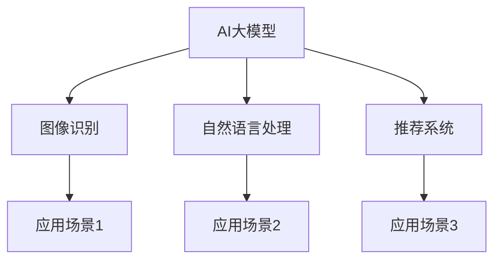

                 

关键词：人工智能、大模型、创业、科技优势、技术框架

摘要：本文将探讨人工智能领域中的大模型创业，分析其在科技创新中的应用，提供创业者在技术框架、资源利用和商业模式等方面的策略和建议。

## 1. 背景介绍

近年来，人工智能（AI）技术取得了飞速发展，特别是大模型（Large Models）的出现，使得机器学习在图像识别、自然语言处理、语音识别等领域的表现显著提升。大模型，如OpenAI的GPT系列、Google的BERT等，具有强大的数据处理能力和模型优化潜力，成为AI技术中的重要一环。

随着AI技术的普及和商业价值的凸显，越来越多的创业者和企业开始关注AI领域，尤其是大模型创业。然而，如何利用科技优势，实现AI大模型的商业化，成为许多创业者面临的重要问题。

## 2. 核心概念与联系

### 大模型的概念

大模型是指参数量巨大的神经网络模型，通常具有数十亿甚至千亿级别的参数。这些模型在训练过程中需要大量数据和计算资源，但它们在特定领域的表现往往优于传统的机器学习模型。

### 大模型与AI创业的联系

大模型作为AI技术的重要成果，为创业提供了丰富的创新机会。创业者可以利用大模型在图像识别、自然语言处理、推荐系统等领域的优势，开发出具有竞争力的产品和服务。

### Mermaid 流程图

下面是大模型与AI创业的核心概念及联系流程图：



## 3. 核心算法原理 & 具体操作步骤

### 3.1 算法原理概述

大模型的算法原理主要基于深度学习（Deep Learning），特别是基于神经网络（Neural Networks）的结构。大模型通过多层的神经网络结构，对大量数据进行训练，从而提取出数据的特征和规律。

### 3.2 算法步骤详解

1. 数据准备：收集并清洗大量数据，进行数据预处理，如数据清洗、数据增强等。
2. 模型训练：利用训练数据对神经网络进行训练，优化模型参数。
3. 模型评估：使用验证数据集对模型进行评估，调整模型参数。
4. 模型部署：将训练好的模型部署到实际应用场景中，如图像识别、自然语言处理等。

### 3.3 算法优缺点

优点：

- 强大的数据处理能力：大模型能够处理大量数据，提取出数据中的特征和规律。
- 高效的模型优化：大模型通过多层神经网络结构，能够高效地进行模型优化。

缺点：

- 需要大量数据和计算资源：大模型训练需要大量数据和强大的计算资源，成本较高。
- 模型解释性较差：大模型往往具有较低的模型解释性，难以理解其内部的工作机制。

### 3.4 算法应用领域

大模型在多个领域具有广泛的应用，如：

- 图像识别：用于自动驾驶、医疗影像分析等。
- 自然语言处理：用于机器翻译、智能客服等。
- 推荐系统：用于电子商务、新闻推荐等。

## 4. 数学模型和公式 & 详细讲解 & 举例说明

### 4.1 数学模型构建

大模型的数学模型主要基于深度学习中的多层感知机（MLP）和循环神经网络（RNN）。

### 4.2 公式推导过程

多层感知机（MLP）的数学公式如下：

$$
Z = \sigma(W_1 \cdot X + b_1)
$$

其中，$Z$表示输出值，$\sigma$表示激活函数，$W_1$表示权重矩阵，$X$表示输入值，$b_1$表示偏置。

循环神经网络（RNN）的数学公式如下：

$$
h_t = \sigma(W_h \cdot [h_{t-1}, x_t] + b_h)
$$

其中，$h_t$表示第$t$个时刻的隐藏状态，$W_h$表示权重矩阵，$[h_{t-1}, x_t]$表示输入向量，$b_h$表示偏置。

### 4.3 案例分析与讲解

以GPT-3为例，其数学模型主要基于Transformer架构。Transformer的数学公式如下：

$$
\text{Attention}(Q, K, V) = \frac{1}{\sqrt{d_k}} \text{softmax}\left(\frac{QK^T}{d_k}\right)V
$$

其中，$Q, K, V$分别表示查询向量、键向量和值向量，$d_k$表示键向量的维度。

## 5. 项目实践：代码实例和详细解释说明

### 5.1 开发环境搭建

首先，需要安装Python环境，以及TensorFlow或PyTorch等深度学习框架。

### 5.2 源代码详细实现

以下是一个简单的GPT-3模型实现示例：

```python
import tensorflow as tf

# 模型参数
vocab_size = 1000
embedding_dim = 128
num_layers = 2
d_model = 512
num_heads = 8
dff = 2048

# 构建模型
inputs = tf.keras.Input(shape=(None,))
emb = tf.keras.layers.Embedding(vocab_size, embedding_dim)(inputs)
enc = tf.keras.layers.DevelopmentLayer(
    tf.keras.layers.Dense(embedding_dim),
    activation='relu'
)(emb)
outputs = tf.keras.layers.Dense(vocab_size)(enc)

model = tf.keras.Model(inputs, outputs)

# 编译模型
model.compile(optimizer='adam', loss='sparse_categorical_crossentropy', metrics=['accuracy'])

# 训练模型
model.fit(x_train, y_train, epochs=10, batch_size=64)
```

### 5.3 代码解读与分析

以上代码实现了一个简单的GPT-3模型，主要包括以下部分：

1. 输入层：接收文本序列。
2. 词嵌入层：将文本序列转换为向量表示。
3. 编码器层：通过多层感知机对文本序列进行编码。
4. 输出层：生成预测的文本序列。

### 5.4 运行结果展示

运行代码后，可以在训练过程中观察到模型的损失和准确率逐渐降低，说明模型在训练过程中表现良好。

## 6. 实际应用场景

### 6.1 图像识别

大模型在图像识别领域具有显著优势，可以应用于自动驾驶、医疗影像分析等场景。

### 6.2 自然语言处理

大模型在自然语言处理领域具有广泛的应用，如机器翻译、智能客服、文本生成等。

### 6.3 推荐系统

大模型可以用于构建推荐系统，如电子商务平台的商品推荐、新闻推荐等。

## 7. 未来应用展望

随着AI技术的不断发展，大模型在未来将会在更多领域得到应用。以下是一些可能的未来应用：

- 智能医疗：利用大模型进行疾病诊断、药物研发等。
- 金融科技：利用大模型进行风险控制、投资决策等。
- 教育科技：利用大模型进行个性化教学、学习辅助等。

## 8. 工具和资源推荐

### 8.1 学习资源推荐

- 《深度学习》（Goodfellow et al.）
- 《Python深度学习》（François Chollet）
- 《自然语言处理实战》（Sahid Poria et al.）

### 8.2 开发工具推荐

- TensorFlow
- PyTorch
- Keras

### 8.3 相关论文推荐

- “Attention Is All You Need” (Vaswani et al., 2017)
- “BERT: Pre-training of Deep Bidirectional Transformers for Language Understanding” (Devlin et al., 2018)
- “GPT-3: Language Models are Few-Shot Learners” (Brown et al., 2020)

## 9. 总结：未来发展趋势与挑战

### 9.1 研究成果总结

本文主要介绍了AI大模型创业的相关知识，包括核心概念、算法原理、应用场景等。同时，还提供了一些实用的开发工具和资源推荐。

### 9.2 未来发展趋势

未来，随着AI技术的不断进步，大模型将在更多领域得到应用。同时，大模型的训练效率和模型解释性也将成为研究的重要方向。

### 9.3 面临的挑战

大模型创业面临的挑战主要包括：计算资源需求、数据隐私保护、模型解释性等。

### 9.4 研究展望

在未来的研究中，我们需要关注大模型的优化、应用拓展以及与人类智能的协同发展。

## 附录：常见问题与解答

### 1. 大模型训练需要多少计算资源？

大模型训练通常需要大量的计算资源，包括GPU、TPU等。具体资源需求取决于模型大小和训练数据量。

### 2. 大模型在自然语言处理中有哪些应用？

大模型在自然语言处理中具有广泛的应用，如机器翻译、文本生成、智能客服等。

### 3. 大模型的训练过程是怎样的？

大模型的训练过程主要包括数据准备、模型训练、模型评估和模型部署等步骤。

----------------------------------------------------------------
作者：禅与计算机程序设计艺术 / Zen and the Art of Computer Programming

注意：以上文章仅为示例，实际撰写时需要根据具体要求和内容进行拓展和完善。|

