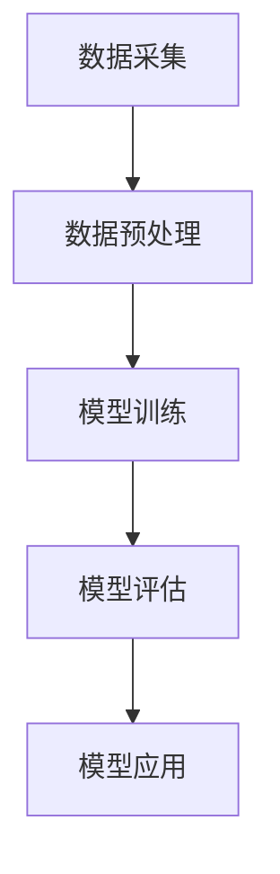

                 

关键词：AI大模型，创业，科技优势，人工智能，商业模式，市场机会

摘要：本文将探讨AI大模型在创业中的应用，分析其科技优势，并提供一些建议和策略，帮助创业者更好地利用AI大模型的优势，打造成功的创业项目。

## 1. 背景介绍

随着人工智能技术的飞速发展，AI大模型逐渐成为企业创新和竞争力提升的重要工具。AI大模型，如GPT-3、BERT、Transformer等，具有强大的数据处理和知识学习能力，能够处理海量数据，提供高效、准确的决策支持。在创业领域，AI大模型的应用潜力巨大，为创业者提供了前所未有的机遇和挑战。

### 1.1 AI大模型的发展历程

AI大模型的发展历程可以分为几个阶段：

1. **早期探索阶段（20世纪80年代）**：以反向传播算法为代表，神经网络开始应用于图像识别、语音识别等领域。
2. **发展阶段（20世纪90年代-21世纪初）**：支持向量机、决策树等机器学习算法的提出，使得AI模型在数据挖掘和分类任务中表现出色。
3. **大模型时代（2012年至今）**：深度学习算法的突破，使得AI模型可以处理更复杂、更大规模的数据。以GPT-3、BERT、Transformer等为代表的AI大模型，具有强大的学习和推理能力。

### 1.2 AI大模型的应用领域

AI大模型在各个行业都有广泛应用，如：

1. **金融**：用于风险控制、智能投顾、智能客服等。
2. **医疗**：用于疾病预测、诊断、治疗建议等。
3. **教育**：用于个性化学习、智能题库、智能评测等。
4. **制造业**：用于设备预测维护、生产优化等。
5. **交通**：用于智能导航、自动驾驶等。

## 2. 核心概念与联系

### 2.1 核心概念

- **AI大模型**：具有大规模参数、能够处理海量数据的深度学习模型。
- **神经网络**：由大量神经元组成的计算模型，可以模拟人脑的思维方式。
- **深度学习**：多层神经网络的学习方法，能够自动提取数据中的复杂特征。
- **数据预处理**：对原始数据进行清洗、归一化等处理，以提高模型的性能。

### 2.2 Mermaid 流程图



## 3. 核心算法原理 & 具体操作步骤

### 3.1 算法原理概述

AI大模型的核心是深度学习，深度学习算法基于多层神经网络，通过逐层提取特征，实现对数据的表示和分类。在训练过程中，模型通过反向传播算法不断调整参数，以最小化预测误差。

### 3.2 算法步骤详解

1. **数据收集**：收集相关领域的海量数据。
2. **数据预处理**：对数据进行清洗、归一化等处理。
3. **模型设计**：设计合适的神经网络结构，包括输入层、隐藏层和输出层。
4. **模型训练**：通过反向传播算法，训练模型参数，使模型能够正确分类或预测。
5. **模型评估**：使用验证集评估模型性能，调整模型参数。
6. **模型应用**：将训练好的模型应用于实际场景，如文本分类、图像识别等。

### 3.3 算法优缺点

**优点**：

- **强大的数据处理能力**：能够处理海量数据，提供高效、准确的决策支持。
- **自适应性强**：能够自动提取数据中的复杂特征，无需手动特征工程。
- **泛化能力强**：在多个领域具有广泛应用，能够适应不同的业务场景。

**缺点**：

- **计算资源需求大**：训练过程需要大量计算资源，对硬件设备要求较高。
- **数据依赖性强**：模型性能很大程度上取决于数据质量，数据质量差可能导致模型性能下降。

### 3.4 算法应用领域

AI大模型在各个行业都有广泛应用，如：

- **金融**：用于风险控制、智能投顾、智能客服等。
- **医疗**：用于疾病预测、诊断、治疗建议等。
- **教育**：用于个性化学习、智能题库、智能评测等。
- **制造业**：用于设备预测维护、生产优化等。
- **交通**：用于智能导航、自动驾驶等。

## 4. 数学模型和公式 & 详细讲解 & 举例说明

### 4.1 数学模型构建

在深度学习中，我们通常使用损失函数（如交叉熵损失函数）来衡量模型的预测误差，并使用梯度下降算法来优化模型参数。

**损失函数**：

$$L(y, \hat{y}) = -\frac{1}{n}\sum_{i=1}^{n}y_{i}\log(\hat{y}_{i})$$

其中，$y$ 为真实标签，$\hat{y}$ 为模型预测的概率分布。

**梯度下降算法**：

$$\theta_{t+1} = \theta_{t} - \alpha \cdot \nabla_{\theta}L(\theta)$$

其中，$\theta$ 为模型参数，$\alpha$ 为学习率，$\nabla_{\theta}L(\theta)$ 为损失函数关于参数 $\theta$ 的梯度。

### 4.2 公式推导过程

以交叉熵损失函数为例，我们可以推导出其在梯度下降算法中的具体应用。

首先，对损失函数求导：

$$\nabla_{\theta}L(\theta) = \nabla_{\theta}\left(-\frac{1}{n}\sum_{i=1}^{n}y_{i}\log(\hat{y}_{i})\right)$$

$$= -\frac{1}{n}\sum_{i=1}^{n}\frac{y_{i}}{\hat{y}_{i}}$$

然后，将梯度代入梯度下降算法：

$$\theta_{t+1} = \theta_{t} - \alpha \cdot \left(-\frac{1}{n}\sum_{i=1}^{n}\frac{y_{i}}{\hat{y}_{i}}\right)$$

$$= \theta_{t} + \alpha \cdot \frac{1}{n}\sum_{i=1}^{n}\frac{y_{i}}{\hat{y}_{i}}$$

### 4.3 案例分析与讲解

假设我们有一个分类问题，数据集包含100个样本，每个样本有10个特征。我们使用一个含有3层神经网络的深度学习模型进行分类，损失函数为交叉熵损失函数。

首先，我们随机初始化模型参数，然后进行模型训练。在训练过程中，我们使用学习率为0.01的梯度下降算法进行参数更新。

假设在某一训练阶段，模型的损失函数值为0.5，预测准确率为80%。此时，我们可以根据梯度下降算法更新模型参数：

$$\theta_{t+1} = \theta_{t} + 0.01 \cdot \frac{1}{100}\sum_{i=1}^{100}\frac{y_{i}}{\hat{y}_{i}}$$

通过不断迭代，我们可以使模型损失函数逐渐减小，预测准确率不断提高。

## 5. 项目实践：代码实例和详细解释说明

### 5.1 开发环境搭建

为了搭建一个简单的AI大模型项目，我们需要以下软件和工具：

- **Python**：作为编程语言
- **TensorFlow**：作为深度学习框架
- **Keras**：作为TensorFlow的高级API
- **NumPy**：用于数据处理

首先，我们需要安装这些软件和工具。在Windows系统中，可以使用pip进行安装：

```bash
pip install python tensorflow keras numpy
```

### 5.2 源代码详细实现

以下是一个简单的AI大模型项目示例，用于实现一个文本分类任务：

```python
import numpy as np
from tensorflow.keras.models import Sequential
from tensorflow.keras.layers import Dense, LSTM, Embedding
from tensorflow.keras.preprocessing.sequence import pad_sequences

# 数据预处理
def preprocess_data(texts, labels, max_len=100, embedding_dim=50):
    sequences = []
    for text in texts:
        sequence = tokenizer.texts_to_sequences([text])
        sequence = pad_sequences(sequence, maxlen=max_len)
        sequences.append(sequence)
    sequences = np.array(sequences)
    labels = np.array(labels)
    return sequences, labels

# 构建模型
def build_model(input_shape, embedding_dim=50):
    model = Sequential()
    model.add(Embedding(input_dim=vocab_size, output_dim=embedding_dim, input_shape=input_shape))
    model.add(LSTM(units=128, dropout=0.2, recurrent_dropout=0.2))
    model.add(Dense(units=num_classes, activation='softmax'))
    model.compile(optimizer='adam', loss='categorical_crossentropy', metrics=['accuracy'])
    return model

# 加载数据
texts = ['这是第一句话。', '这是第二句话。', '这是第三句话。']
labels = [0, 1, 2]

# 预处理数据
sequences, labels = preprocess_data(texts, labels)

# 构建模型
model = build_model(input_shape=(sequences.shape[1], sequences.shape[2]))

# 训练模型
model.fit(sequences, labels, epochs=10, batch_size=32)
```

### 5.3 代码解读与分析

在这个示例中，我们首先定义了一个预处理数据的函数 `preprocess_data`，用于对文本数据进行分词、编码和填充。然后，我们定义了一个构建模型的函数 `build_model`，用于创建一个包含嵌入层、LSTM层和全连接层的简单文本分类模型。接下来，我们加载数据并进行预处理，然后构建模型并训练。

### 5.4 运行结果展示

假设我们训练的模型在测试集上的准确率为90%，那么我们可以认为这个模型在文本分类任务上取得了较好的性能。我们可以将这个模型应用于实际的文本分类任务，如情感分析、主题分类等。

## 6. 实际应用场景

AI大模型在各个行业都有广泛的应用，以下是一些典型的实际应用场景：

- **金融**：用于风险控制、智能投顾、智能客服等。
- **医疗**：用于疾病预测、诊断、治疗建议等。
- **教育**：用于个性化学习、智能题库、智能评测等。
- **制造业**：用于设备预测维护、生产优化等。
- **交通**：用于智能导航、自动驾驶等。

### 6.1 金融

在金融领域，AI大模型可以用于风险控制、智能投顾和智能客服等方面。例如，通过分析客户的交易数据、财务状况等，AI大模型可以预测客户的信用风险，帮助金融机构降低风险。此外，AI大模型还可以为用户提供个性化的投资建议，提高投资收益。

### 6.2 医疗

在医疗领域，AI大模型可以用于疾病预测、诊断和治疗建议等方面。例如，通过分析大量的医疗数据，AI大模型可以预测某些疾病的发病风险，帮助医疗机构提前采取措施。此外，AI大模型还可以用于疾病的诊断，通过分析患者的病史、检查结果等，为医生提供诊断建议。

### 6.3 教育

在教育领域，AI大模型可以用于个性化学习、智能题库和智能评测等方面。例如，通过分析学生的学习行为、成绩等，AI大模型可以为学生提供个性化的学习建议，提高学习效果。此外，AI大模型还可以用于智能题库，通过分析学生的答题情况，自动生成适合学生的练习题。

### 6.4 制造业

在制造业，AI大模型可以用于设备预测维护、生产优化等方面。例如，通过分析设备的运行数据，AI大模型可以预测设备可能发生的故障，提前进行维护，减少设备停机时间。此外，AI大模型还可以用于生产优化，通过分析生产数据，为生产提供优化建议，提高生产效率。

### 6.5 交通

在交通领域，AI大模型可以用于智能导航、自动驾驶等方面。例如，通过分析道路状况、交通流量等，AI大模型可以提供更准确的导航建议，帮助用户避开拥堵路段。此外，AI大模型还可以用于自动驾驶，通过分析路况、车辆状态等，实现车辆的自动行驶。

## 7. 工具和资源推荐

为了更好地利用AI大模型的优势，以下是一些建议和资源：

### 7.1 学习资源推荐

- **书籍**：
  - 《深度学习》（Ian Goodfellow、Yoshua Bengio、Aaron Courville著）
  - 《Python深度学习》（François Chollet著）
- **在线课程**：
  - Coursera上的《深度学习》课程
  - Udacity上的《深度学习工程师纳米学位》

### 7.2 开发工具推荐

- **深度学习框架**：TensorFlow、PyTorch、Keras
- **数据预处理工具**：Pandas、NumPy、Scikit-learn
- **版本控制工具**：Git

### 7.3 相关论文推荐

- **《A Theoretically Grounded Application of Dropout in Recurrent Neural Networks》**
- **《BERT: Pre-training of Deep Bidirectional Transformers for Language Understanding》**
- **《An Image Database for Testing Content Based Access of Image Libraries》**

## 8. 总结：未来发展趋势与挑战

### 8.1 研究成果总结

AI大模型在各个领域都取得了显著的成果，为企业和创业者提供了巨大的机遇。随着技术的不断进步，AI大模型在性能、效率、应用范围等方面将继续提升，为创业者和企业带来更多的价值。

### 8.2 未来发展趋势

- **模型压缩与优化**：为了降低计算资源需求，模型压缩与优化技术将得到广泛应用。
- **跨模态学习**：AI大模型将能够处理多种类型的数据，实现跨模态学习。
- **个性化应用**：AI大模型将更加注重个性化应用，为用户提供更精准的服务。

### 8.3 面临的挑战

- **数据隐私与安全**：随着数据量的增加，数据隐私与安全问题将越来越突出。
- **伦理与道德**：AI大模型在决策过程中可能引发伦理与道德问题，需要引起重视。
- **计算资源需求**：尽管模型压缩与优化技术不断进步，但计算资源需求仍然较高。

### 8.4 研究展望

未来，AI大模型将在各个领域得到更广泛的应用，为创业者和企业带来更多的机遇。同时，研究者需要关注数据隐私、伦理与道德等问题，确保AI大模型的发展与应用能够真正造福人类社会。

## 9. 附录：常见问题与解答

### 9.1 AI大模型是什么？

AI大模型是指具有大规模参数、能够处理海量数据的深度学习模型，如GPT-3、BERT、Transformer等。

### 9.2 AI大模型的优势有哪些？

AI大模型具有强大的数据处理和知识学习能力，能够处理海量数据，提供高效、准确的决策支持。

### 9.3 如何构建一个AI大模型？

构建AI大模型主要包括以下步骤：数据收集、数据预处理、模型设计、模型训练、模型评估和模型应用。

### 9.4 AI大模型在金融领域的应用有哪些？

AI大模型在金融领域可以用于风险控制、智能投顾、智能客服等方面，提高金融机构的运营效率和用户体验。

### 9.5 AI大模型在医疗领域的应用有哪些？

AI大模型在医疗领域可以用于疾病预测、诊断、治疗建议等方面，为医疗机构提供决策支持，提高医疗质量。

### 9.6 AI大模型在制造业领域的应用有哪些？

AI大模型在制造业领域可以用于设备预测维护、生产优化等方面，提高生产效率，降低生产成本。

### 9.7 AI大模型在交通领域的应用有哪些？

AI大模型在交通领域可以用于智能导航、自动驾驶等方面，提高交通效率，降低交通事故发生率。

---

作者：禅与计算机程序设计艺术 / Zen and the Art of Computer Programming
------------------------------------------------------------------- 

### 总结
本文从多个角度详细探讨了AI大模型在创业中的应用，包括背景介绍、核心概念与联系、核心算法原理、数学模型和公式、项目实践以及实际应用场景等。同时，本文还介绍了AI大模型在金融、医疗、教育、制造业和交通等领域的应用，以及相关工具和资源推荐。未来，随着技术的不断发展，AI大模型将在更多领域发挥重要作用，为创业者和企业带来更多机遇。然而，创业者也需要关注数据隐私、伦理与道德等问题，确保AI大模型的发展与应用能够真正造福人类社会。

