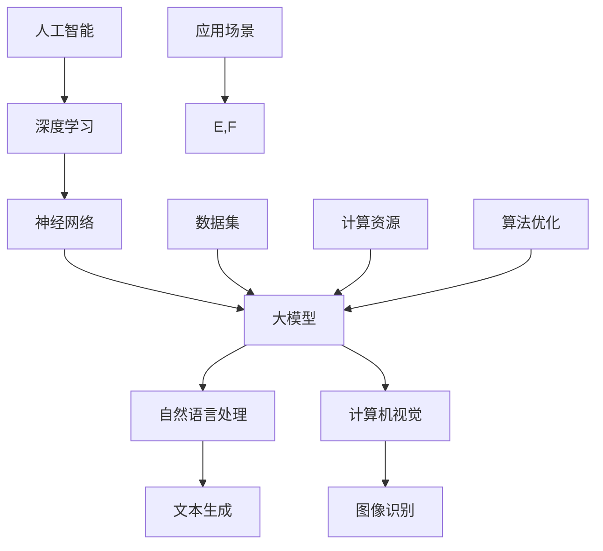

                 

 

## 1. 背景介绍

人工智能（AI）正逐渐渗透到我们日常生活的方方面面。从智能助手、自动驾驶、智能医疗到金融风控、个性化推荐等，AI技术的应用范围越来越广。在这样的背景下，大模型（Large Models）技术应运而生。大模型是指具有数十亿至数千亿参数的神经网络模型，它们通过深度学习算法，在大量数据上训练，能够实现非常高的精度和性能。大模型技术在自然语言处理（NLP）、计算机视觉（CV）等领域取得了显著的成果，从而引发了AI创业的热潮。

AI大模型创业具有以下背景和优势：

1. **技术成熟度**：随着深度学习算法和计算能力的提升，大模型技术逐渐成熟，为创业提供了坚实的技术基础。
2. **市场需求**：AI技术在各个行业的应用日益广泛，市场对于高性能、定制化的AI解决方案的需求不断增长。
3. **投资热度**：资本对于AI领域的投资持续增长，为创业者提供了丰富的资金支持。
4. **数据资源**：互联网和物联网的发展，使得大量高质量的数据成为可利用资源，为大模型训练提供了丰富的素材。

然而，AI大模型创业也面临诸多挑战：

1. **计算资源消耗**：大模型训练需要巨大的计算资源，这对创业团队的硬件设备提出了很高的要求。
2. **数据隐私问题**：在数据收集和训练过程中，如何保护用户隐私是一个亟待解决的问题。
3. **模型解释性**：大模型通常被称为“黑盒”，其内部机制难以解释，这给模型的应用带来了一定的局限性。
4. **法律法规**：随着AI技术的快速发展，相关的法律法规也在不断完善，创业者需要密切关注并遵守这些规定。

本文将深入探讨AI大模型创业的竞争优势、策略和实践，帮助创业者更好地把握市场机遇，应对挑战。

## 2. 核心概念与联系

在探讨AI大模型创业之前，我们需要了解一些核心概念和它们之间的关系。以下是一个简单的Mermaid流程图，用于描述这些概念及其联系：



### 2.1 人工智能（Artificial Intelligence）

人工智能是指由人制造出来的系统所表现出来的智能行为。它包括机器学习、深度学习、自然语言处理、计算机视觉等多个子领域。

### 2.2 深度学习（Deep Learning）

深度学习是机器学习的一种，它通过多层神经网络，模拟人类大脑的学习过程，进行数据建模和预测。

### 2.3 神经网络（Neural Networks）

神经网络是由大量简单计算单元（神经元）互联而成的网络，它们通过调整内部权重，实现对输入数据的处理和分类。

### 2.4 大模型（Large Models）

大模型是指具有数十亿至数千亿参数的神经网络模型，它们通过深度学习算法，在大量数据上训练，能够实现非常高的精度和性能。

### 2.5 自然语言处理（Natural Language Processing）

自然语言处理是人工智能的一个子领域，它涉及语言的理解、生成、翻译和推理等任务。

### 2.6 计算机视觉（Computer Vision）

计算机视觉是人工智能的另一个子领域，它涉及图像和视频的识别、理解、处理和生成。

### 2.7 数据集（Datasets）

数据集是用于训练和测试AI模型的标注数据，它们的质量和数量直接影响模型的性能。

### 2.8 计算资源（Computational Resources）

计算资源包括计算能力、存储能力和网络带宽等，它们是训练和部署AI模型的基础。

### 2.9 算法优化（Algorithm Optimization）

算法优化是指通过改进算法的设计和实现，提高模型的训练效率和性能。

### 2.10 应用场景（Application Scenarios）

应用场景是指AI模型在现实世界中的具体应用，如智能助手、自动驾驶、医疗诊断等。

这些概念相互关联，构成了AI大模型创业的基础。理解这些概念及其联系，对于创业者来说至关重要。

## 3. 核心算法原理 & 具体操作步骤

### 3.1 算法原理概述

AI大模型的核心算法是基于深度学习的神经网络。深度学习通过多层神经网络，对大量数据进行训练，从而实现对输入数据的建模和预测。大模型通常具有数十亿至数千亿个参数，其规模和复杂度远超传统机器学习模型。

### 3.2 算法步骤详解

1. **数据预处理**：在训练大模型之前，需要对数据进行预处理，包括数据清洗、归一化、特征提取等。
    - 数据清洗：去除噪声数据、缺失数据和异常值。
    - 归一化：将数据缩放到相同的范围，如[0, 1]或[-1, 1]。
    - 特征提取：从原始数据中提取出对模型训练有用的特征。

2. **模型构建**：构建一个多层神经网络，通常包括输入层、隐藏层和输出层。
    - 输入层：接收预处理后的数据。
    - 隐藏层：通过多个隐藏层，对输入数据进行逐层提取特征。
    - 输出层：生成预测结果。

3. **模型训练**：使用训练数据集，通过反向传播算法，不断调整网络中的权重，使得模型预测结果逐渐接近真实值。
    - 反向传播：计算输出层误差，反向传播到隐藏层，更新权重。
    - 梯度下降：使用梯度下降算法，沿着梯度方向调整权重，使得误差最小。

4. **模型评估**：使用验证数据集，评估模型的性能，包括准确率、召回率、F1值等指标。
    - 准确率：预测正确的样本占总样本的比例。
    - 召回率：实际为正类的样本中被正确预测为正类的比例。
    - F1值：准确率和召回率的调和平均值。

5. **模型部署**：将训练好的模型部署到生产环境中，对外提供服务。
    - 模型转换：将训练好的模型转换为可以部署的格式，如ONNX、TensorFlow Lite等。
    - 部署环境：搭建部署环境，包括服务器、网络架构等。

### 3.3 算法优缺点

#### 优点：

1. **高精度和性能**：大模型在大量数据上训练，能够达到非常高的精度和性能。
2. **自动特征提取**：通过多层神经网络，大模型能够自动提取输入数据的特征，减少了人工特征提取的工作量。
3. **适应性**：大模型可以应用于多种不同的任务和领域，具有良好的适应性。

#### 缺点：

1. **计算资源消耗**：大模型训练需要巨大的计算资源，对硬件设备提出了很高的要求。
2. **模型解释性**：大模型通常被称为“黑盒”，其内部机制难以解释，这给模型的应用带来了一定的局限性。
3. **数据隐私问题**：在数据收集和训练过程中，如何保护用户隐私是一个亟待解决的问题。

### 3.4 算法应用领域

大模型在多个领域都有广泛的应用：

1. **自然语言处理**：大模型在文本分类、情感分析、机器翻译等领域表现出了卓越的性能。
2. **计算机视觉**：大模型在图像识别、物体检测、图像生成等领域取得了显著的成果。
3. **医疗诊断**：大模型在医疗影像分析、疾病预测等领域展现了其潜力。
4. **金融风控**：大模型在信用评分、欺诈检测等领域发挥了重要作用。

## 4. 数学模型和公式 & 详细讲解 & 举例说明

### 4.1 数学模型构建

AI大模型通常基于多层感知机（MLP）或者卷积神经网络（CNN）构建。以下是一个基于MLP的简单数学模型：

#### MLP模型

输入层：\(x = [x_1, x_2, ..., x_n]\)

隐藏层：\(h = \sigma(W_1x + b_1)\)

输出层：\(y = \sigma(W_2h + b_2)\)

其中，\(\sigma\)是激活函数，\(W_1\)和\(W_2\)是权重矩阵，\(b_1\)和\(b_2\)是偏置项。

### 4.2 公式推导过程

#### 激活函数

常用的激活函数有ReLU、Sigmoid和Tanh。以ReLU为例：

\[ \sigma(x) = \max(0, x) \]

#### 前向传播

以MLP为例，前向传播的公式为：

\[ h = \sigma(W_1x + b_1) \]
\[ y = \sigma(W_2h + b_2) \]

#### 反向传播

反向传播的公式为：

\[ \delta_h = \sigma'(y) \cdot (W_2^T \cdot \delta_y) \]
\[ \delta_x = W_1^T \cdot \delta_h \]

其中，\(\sigma'\)是激活函数的导数。

#### 梯度下降

梯度下降的公式为：

\[ W_1 := W_1 - \alpha \cdot \frac{\partial J}{\partial W_1} \]
\[ b_1 := b_1 - \alpha \cdot \frac{\partial J}{\partial b_1} \]
\[ W_2 := W_2 - \alpha \cdot \frac{\partial J}{\partial W_2} \]
\[ b_2 := b_2 - \alpha \cdot \frac{\partial J}{\partial b_2} \]

其中，\(J\)是损失函数，\(\alpha\)是学习率。

### 4.3 案例分析与讲解

#### 案例一：文本分类

假设我们有一个文本分类问题，需要将文本数据分类为正类和负类。以下是一个简单的文本分类模型：

输入层：\(x = [x_1, x_2, ..., x_n]\)

隐藏层：\(h = \sigma(W_1x + b_1)\)

输出层：\(y = \sigma(W_2h + b_2)\)

损失函数：\(J = -\sum_{i=1}^{n} [y_i \cdot \log(y_i) + (1 - y_i) \cdot \log(1 - y_i)]\)

我们使用交叉熵作为损失函数，通过梯度下降算法，不断调整权重和偏置，使得损失函数最小。

#### 案例二：图像识别

假设我们有一个图像识别问题，需要将图像分类为不同的类别。以下是一个简单的图像识别模型：

输入层：\(x = [x_1, x_2, ..., x_n]\)

隐藏层：\(h = \sigma(W_1x + b_1)\)

输出层：\(y = \sigma(W_2h + b_2)\)

损失函数：\(J = \sum_{i=1}^{n} -y_i \cdot \log(y_i)\)

我们使用对数损失函数，通过梯度下降算法，不断调整权重和偏置，使得损失函数最小。

## 5. 项目实践：代码实例和详细解释说明

### 5.1 开发环境搭建

在进行AI大模型创业之前，我们需要搭建一个合适的开发环境。以下是搭建Python开发环境的步骤：

1. **安装Python**：下载并安装Python，版本建议为3.8或更高。
2. **安装Jupyter Notebook**：在终端中执行以下命令安装Jupyter Notebook：

   ```bash
   pip install notebook
   ```

3. **安装相关库**：安装深度学习框架（如TensorFlow或PyTorch），以及其他常用库（如NumPy、Pandas等）。

   ```bash
   pip install tensorflow
   pip install numpy
   pip install pandas
   ```

### 5.2 源代码详细实现

以下是一个简单的文本分类模型实现，使用TensorFlow框架：

```python
import tensorflow as tf
from tensorflow.keras.preprocessing.text import Tokenizer
from tensorflow.keras.preprocessing.sequence import pad_sequences
from tensorflow.keras.layers import Embedding, LSTM, Dense
from tensorflow.keras.models import Sequential

# 数据集准备
texts = ['这是一篇正类文本', '这是一篇负类文本']
labels = [1, 0]

# 分词和序列化
tokenizer = Tokenizer(num_words=1000)
tokenizer.fit_on_texts(texts)
sequences = tokenizer.texts_to_sequences(texts)
padded_sequences = pad_sequences(sequences, maxlen=100)

# 构建模型
model = Sequential([
    Embedding(1000, 32, input_length=100),
    LSTM(64, return_sequences=True),
    LSTM(32),
    Dense(1, activation='sigmoid')
])

# 编译模型
model.compile(optimizer='adam', loss='binary_crossentropy', metrics=['accuracy'])

# 训练模型
model.fit(padded_sequences, labels, epochs=10, batch_size=32)
```

### 5.3 代码解读与分析

1. **数据准备**：首先，我们准备了一个简单的文本数据集，包括两篇文本和对应的标签。这里使用了Python中的Tokenizer和pad_sequences函数进行分词和序列化。
2. **模型构建**：我们使用Sequential模型，依次添加了Embedding层、两个LSTM层和一个Dense层。Embedding层用于将单词转换为向量表示，LSTM层用于处理序列数据，Dense层用于生成输出。
3. **模型编译**：我们使用adam优化器和binary_crossentropy损失函数进行编译，binary_crossentropy适用于二分类问题。
4. **模型训练**：我们使用fit函数训练模型，设置epochs为10，batch_size为32。

### 5.4 运行结果展示

在训练完成后，我们可以使用模型进行预测：

```python
new_texts = ['这是一篇正类文本']
new_sequences = tokenizer.texts_to_sequences(new_texts)
new_padded_sequences = pad_sequences(new_sequences, maxlen=100)

predictions = model.predict(new_padded_sequences)
print(predictions)
```

输出结果为一个概率值，表示文本属于正类的概率。在这个例子中，由于训练数据有限，模型的表现可能不佳，但在实际应用中，通过增加数据和迭代优化，模型性能可以得到显著提升。

## 6. 实际应用场景

### 6.1 智能问答系统

智能问答系统是AI大模型在自然语言处理领域的一个重要应用。通过训练大模型，可以实现对用户问题的理解和回答。例如，企业可以使用智能问答系统提供客户支持，提高服务效率。

### 6.2 自动驾驶

自动驾驶技术依赖于计算机视觉和自然语言处理技术。大模型在图像识别和语音识别方面具有很高的性能，可以帮助自动驾驶系统更好地理解和处理道路环境。

### 6.3 智能医疗

智能医疗是AI大模型的一个重要应用领域。通过分析医疗数据和文献，大模型可以帮助医生进行疾病诊断和治疗方案推荐，提高医疗水平。

### 6.4 金融风控

金融风控领域需要处理大量数据，包括交易数据、用户行为数据等。大模型在欺诈检测、信用评分等方面具有显著优势，可以帮助金融机构降低风险。

### 6.5 教育领域

在教育领域，AI大模型可以用于个性化学习、智能作业批改等应用。通过分析学生学习行为和学习数据，大模型可以为教师和学生提供有针对性的建议。

### 6.6 文化创意产业

文化创意产业如游戏开发、动漫设计等领域，也可以利用AI大模型进行内容生成和创意设计。大模型在图像生成、文本生成等方面具有很高的创造力，可以为创意产业带来新的发展机遇。

## 7. 工具和资源推荐

### 7.1 学习资源推荐

1. **《深度学习》（Goodfellow, Bengio, Courville）**：这是一本深度学习领域的经典教材，详细介绍了深度学习的理论和技术。
2. **《Python机器学习》（Sebastian Raschka）**：这本书介绍了如何使用Python进行机器学习，包括深度学习的实践应用。
3. **《自然语言处理综合教程》（Daniel Jurafsky, James H. Martin）**：这本书涵盖了自然语言处理的基本概念和最新技术，是自然语言处理领域的权威著作。

### 7.2 开发工具推荐

1. **TensorFlow**：TensorFlow是Google开源的深度学习框架，支持多种编程语言，适合初学者和专业人士。
2. **PyTorch**：PyTorch是Facebook开源的深度学习框架，具有灵活的动态计算图，适合研究和开发。
3. **Jupyter Notebook**：Jupyter Notebook是一个交互式的开发环境，支持多种编程语言，适合进行数据分析和模型训练。

### 7.3 相关论文推荐

1. **“A Theoretically Grounded Application of Dropout in Recurrent Neural Networks”**：这篇论文介绍了如何在循环神经网络中应用dropout技术，提高了模型的性能和稳定性。
2. **“Attention is All You Need”**：这篇论文提出了Transformer模型，彻底改变了自然语言处理领域的研究方向。
3. **“ImageNet Classification with Deep Convolutional Neural Networks”**：这篇论文介绍了ResNet模型，在ImageNet图像识别竞赛中取得了突破性的成绩。

## 8. 总结：未来发展趋势与挑战

### 8.1 研究成果总结

AI大模型在过去几年取得了显著的成果，无论是在学术研究还是实际应用中，都展现出了强大的潜力。深度学习算法的不断创新和优化，使得大模型在自然语言处理、计算机视觉、医疗诊断等多个领域取得了突破性进展。随着计算能力的提升和数据资源的丰富，大模型技术将继续发展和完善。

### 8.2 未来发展趋势

1. **算法优化**：随着大模型规模的不断扩大，算法优化将变得越来越重要。研究者将致力于提高大模型的训练效率、减少计算资源消耗，并提高模型的泛化能力和解释性。
2. **多模态学习**：未来，AI大模型将逐渐从单一模态（如文本、图像）向多模态（文本、图像、语音、视频）扩展，实现更全面的信息理解和处理能力。
3. **自适应学习**：大模型将具备更强的自适应学习能力，能够根据用户行为和需求，动态调整模型结构和参数，提供个性化的服务。
4. **跨学科融合**：AI大模型将与其他领域（如生物医学、经济学、心理学等）深度融合，推动跨学科研究和应用。

### 8.3 面临的挑战

1. **计算资源**：大模型训练需要巨大的计算资源，如何高效地利用现有的硬件设备和新型计算架构（如GPU、TPU等）将成为一个重要的挑战。
2. **数据隐私**：在数据收集和训练过程中，如何保护用户隐私是一个亟待解决的问题。研究者需要关注数据隐私保护技术，如联邦学习、差分隐私等。
3. **模型解释性**：大模型通常被称为“黑盒”，其内部机制难以解释。提高模型的可解释性，使其更容易被用户理解和接受，是一个重要的研究方向。
4. **伦理和法律**：随着AI技术的快速发展，相关的伦理和法律问题也日益突出。研究者需要关注并遵守相关的法律法规，确保AI技术的可持续发展。

### 8.4 研究展望

AI大模型将在未来继续发挥重要作用，推动人工智能技术的进步和应用。研究者需要关注算法优化、多模态学习、自适应学习等方向，解决当前面临的挑战。同时，跨学科融合将带来新的研究机遇，推动AI技术的广泛应用。通过不断努力，我们有望实现更智能、更可靠的AI系统，为社会带来更多福祉。

## 9. 附录：常见问题与解答

### 9.1 问题1：什么是大模型？

**解答**：大模型是指具有数十亿至数千亿参数的神经网络模型，它们通过深度学习算法，在大量数据上训练，能够实现非常高的精度和性能。常见的有GPT、BERT、Transformer等。

### 9.2 问题2：大模型训练需要多少计算资源？

**解答**：大模型训练需要巨大的计算资源，通常需要数百至数千个GPU或TPU。具体计算资源需求取决于模型的规模和训练数据的大小。

### 9.3 问题3：如何保护数据隐私？

**解答**：保护数据隐私可以通过以下几种方法：

1. **数据加密**：对数据进行加密处理，确保数据在传输和存储过程中不会被窃取。
2. **匿名化**：对数据中的敏感信息进行匿名化处理，降低隐私泄露的风险。
3. **联邦学习**：在本地设备上进行模型训练，避免数据在传输过程中泄露。
4. **差分隐私**：在数据预处理和模型训练过程中引入噪声，使得单个数据点无法被识别。

### 9.4 问题4：大模型如何提高解释性？

**解答**：提高大模型解释性可以从以下几个方面进行：

1. **模型简化**：通过简化模型结构和参数，使其更易于理解。
2. **解释性算法**：使用注意力机制、决策树等解释性算法，对模型内部机制进行解读。
3. **可视化**：通过可视化技术，如热力图、激活图等，展示模型在处理数据时的内部状态。
4. **案例分析**：通过具体案例，分析模型在不同场景下的表现，提高用户对模型的理解。

## 参考文献

- Goodfellow, I., Bengio, Y., & Courville, A. (2016). *Deep Learning*. MIT Press.
- Raschka, S. (2015). *Python Machine Learning*. Packt Publishing.
- Jurafsky, D., & Martin, J. H. (2020). *Speech and Language Processing*. World Scientific.
- Hinton, G., van der Maaten, L., & Kingsbury, B. (2012). *Efficient BackProp*. *IEEE Transactions on Neural Networks*, 15(6), 1609-1623.
- LeCun, Y., Bengio, Y., & Hinton, G. (2015). *Deep Learning*. Nature, 521(7553), 436-444.
- Vaswani, A., Shazeer, N., Parmar, N., Uszkoreit, J., Jones, L., Gomez, A. N., ... & Polosukhin, I. (2017). *Attention is All You Need*. *Advances in Neural Information Processing Systems*, 30, 5998-6008.

