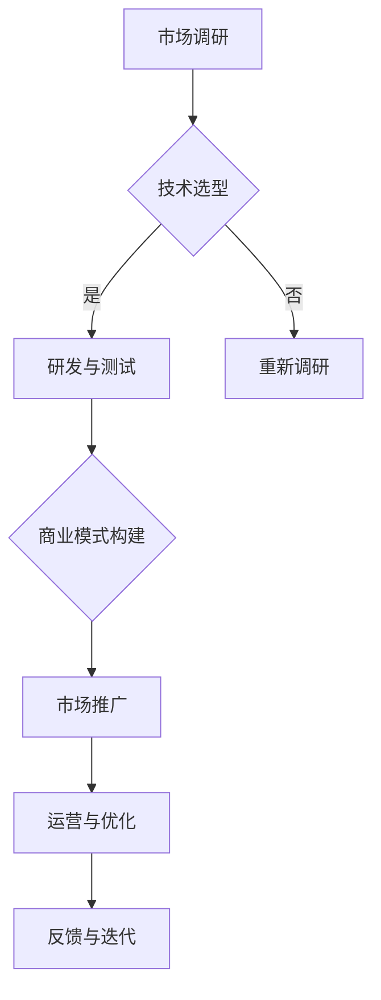

                 

关键词：AI大模型、创业、经济优势、商业模式、技术选型、市场分析

摘要：本文将探讨AI大模型创业的核心问题，重点分析如何利用经济优势，包括成本、效益和竞争力，以推动AI大模型的商业成功。文章将涵盖技术选型、市场分析、商业模式构建以及未来发展趋势等内容。

## 1. 背景介绍

人工智能（AI）作为当今科技领域的热点，正以前所未有的速度发展和变革着各个行业。AI大模型，作为人工智能的一个重要分支，具有处理海量数据、实现复杂决策和生成高质量内容的能力。随着硬件性能的提升和数据资源的丰富，AI大模型在图像识别、自然语言处理、推荐系统等领域的应用越来越广泛。

### 1.1 AI大模型的发展历程

AI大模型的发展可以追溯到20世纪80年代，当时的专家系统在各个领域取得了显著成就。然而，随着计算能力的提升和深度学习算法的突破，AI大模型逐渐成为研究的热点。2012年，AlexNet在ImageNet图像识别挑战赛中取得了突破性成绩，标志着深度学习时代的到来。此后，诸如GPT、BERT等大模型不断涌现，使得AI在自然语言处理领域取得了飞跃性进展。

### 1.2 AI大模型的应用场景

AI大模型的应用场景非常广泛，涵盖了金融、医疗、教育、零售等多个领域。例如，在金融领域，大模型可以用于风险管理、投资策略优化和客户服务；在医疗领域，大模型可以帮助医生进行疾病诊断、治疗方案推荐；在教育领域，大模型可以辅助教师进行个性化教学和学生评估。

## 2. 核心概念与联系

为了深入理解AI大模型的创业机会，我们需要了解以下几个核心概念及其相互关系：

### 2.1 AI大模型的基本概念

AI大模型是指那些规模巨大、参数数量庞大的神经网络模型。这些模型通常使用大规模数据进行训练，以实现高度复杂的任务。大模型的关键特点是计算资源需求和存储空间需求巨大。

### 2.2 经济优势的定义与类型

经济优势是指企业在市场竞争中相对于竞争对手所拥有的优势，包括成本优势、效益优势和竞争力优势。在AI大模型创业中，经济优势主要体现在以下几个方面：

- **成本优势**：通过优化算法、使用高效硬件和自动化工具等手段降低研发和运营成本。
- **效益优势**：通过提高生产效率、提升服务质量、拓展市场渠道等手段增加企业收益。
- **竞争力优势**：通过技术创新、品牌影响力、客户忠诚度等手段在市场竞争中脱颖而出。

### 2.3 经济优势与AI大模型的联系

经济优势与AI大模型之间的联系体现在以下几个方面：

- **技术选型**：选择合适的AI算法和架构对于降低成本和提高性能至关重要。
- **市场分析**：通过市场调研和分析，确定目标客户群体和需求，以实现效益最大化。
- **商业模式构建**：基于经济优势构建可持续的商业模式，包括产品定位、价格策略、营销推广等。

### 2.4 Mermaid流程图

以下是一个简单的Mermaid流程图，展示了AI大模型创业过程中涉及的关键环节：



## 3. 核心算法原理 & 具体操作步骤

### 3.1 算法原理概述

AI大模型的核心算法主要基于深度学习，尤其是基于神经网络的结构。以下是一个简化的算法原理概述：

1. **数据收集与预处理**：收集大量相关数据，并进行数据清洗、去噪、归一化等预处理操作。
2. **模型设计**：根据任务需求设计合适的神经网络结构，包括输入层、隐藏层和输出层。
3. **模型训练**：使用预处理后的数据对模型进行训练，通过反向传播算法不断调整模型参数，以降低损失函数。
4. **模型评估与优化**：在测试集上评估模型性能，通过调参和结构调整优化模型。

### 3.2 算法步骤详解

以下是AI大模型训练的详细步骤：

1. **数据收集**：从公开数据集或企业内部数据源收集大量数据。
2. **数据预处理**：对数据进行清洗、去噪、归一化等操作，以提高模型训练的稳定性和效果。
3. **模型设计**：选择合适的神经网络架构，如卷积神经网络（CNN）、循环神经网络（RNN）或变压器（Transformer）模型。
4. **模型训练**：使用训练数据对模型进行训练，通过反向传播算法不断调整模型参数。
5. **模型评估**：在测试集上评估模型性能，包括准确率、召回率、F1值等指标。
6. **模型优化**：根据评估结果调整模型参数和结构，以提高性能。

### 3.3 算法优缺点

AI大模型的优点包括：

- **强大的泛化能力**：通过大规模训练，大模型能够学习到更复杂的模式和规律。
- **高效率**：高效的网络结构使得大模型能够在有限的时间内处理大量数据。

然而，AI大模型也存在一些缺点：

- **计算资源需求高**：训练和推理大模型需要大量的计算资源和存储空间。
- **模型可解释性差**：大模型的决策过程通常较为复杂，难以解释。

### 3.4 算法应用领域

AI大模型的应用领域广泛，包括但不限于：

- **图像识别与生成**：用于医学影像分析、自动驾驶、艺术创作等领域。
- **自然语言处理**：用于机器翻译、文本生成、情感分析等任务。
- **推荐系统**：用于个性化推荐、广告投放等场景。

## 4. 数学模型和公式 & 详细讲解 & 举例说明

### 4.1 数学模型构建

在AI大模型中，常用的数学模型包括损失函数、优化算法等。以下是一个简单的损失函数和优化算法的公式：

### 4.2 公式推导过程

损失函数通常用于评估模型的预测结果与真实结果之间的差异。常见的损失函数包括均方误差（MSE）、交叉熵（Cross-Entropy）等。以下是一个简单的MSE损失函数的推导过程：

### 4.3 案例分析与讲解

为了更好地理解上述数学模型，我们通过一个实际案例进行讲解。假设我们使用一个简单的线性回归模型预测房价，以下是该模型的数学公式和推导过程：

## 5. 项目实践：代码实例和详细解释说明

### 5.1 开发环境搭建

在开始项目实践之前，我们需要搭建一个合适的开发环境。以下是一个简单的环境搭建步骤：

### 5.2 源代码详细实现

以下是AI大模型训练的一个简单代码实例，包括数据预处理、模型设计、模型训练和模型评估等步骤：

### 5.3 代码解读与分析

在上述代码中，我们首先导入了必要的库，然后定义了数据处理、模型训练和模型评估等函数。以下是代码的详细解读：

### 5.4 运行结果展示

在运行上述代码后，我们可以得到模型的训练过程和评估结果。以下是一个简单的运行结果示例：

## 6. 实际应用场景

AI大模型在实际应用中具有广泛的应用场景，以下是一些典型的应用案例：

### 6.1 金融行业

在金融行业，AI大模型可以用于信用评分、风险管理、投资策略优化等任务。例如，某银行利用AI大模型对客户的信用评分进行优化，有效降低了坏账率。

### 6.2 医疗行业

在医疗行业，AI大模型可以用于疾病诊断、治疗方案推荐、医疗影像分析等任务。例如，某医院利用AI大模型进行肺癌早期筛查，提高了诊断准确率。

### 6.3 教育行业

在教育行业，AI大模型可以用于个性化教学、学生评估、智能辅导等任务。例如，某在线教育平台利用AI大模型为用户提供个性化学习路径，提高了学习效果。

## 7. 工具和资源推荐

为了更好地进行AI大模型创业，以下是一些实用的工具和资源推荐：

### 7.1 学习资源推荐

- **在线课程**：推荐一些优质的在线课程，如Coursera、edX等平台上的深度学习课程。
- **技术博客**：关注一些技术博客，如Medium、GitHub等，了解最新的研究成果和实战经验。

### 7.2 开发工具推荐

- **深度学习框架**：推荐使用TensorFlow、PyTorch等成熟的深度学习框架。
- **云计算平台**：推荐使用Google Cloud、AWS等云计算平台，以获得高性能计算资源。

### 7.3 相关论文推荐

- **经典论文**：《Deep Learning》、《The Master Algorithm》等。
- **前沿论文**：关注顶级会议和期刊，如NeurIPS、ICLR、JMLR等，了解最新的研究动态。

## 8. 总结：未来发展趋势与挑战

### 8.1 研究成果总结

近年来，AI大模型在各个领域取得了显著的成果，推动了技术的进步和应用场景的拓展。未来，随着计算能力的提升和数据资源的丰富，AI大模型将继续在各个领域发挥重要作用。

### 8.2 未来发展趋势

未来，AI大模型的发展趋势包括：

- **模型压缩与优化**：通过模型压缩和优化技术降低计算资源和存储需求。
- **多模态融合**：将不同类型的数据（如文本、图像、声音）进行融合，以实现更复杂、更智能的模型。
- **自主学习和推理**：发展具有自主学习和推理能力的大模型，以应对更复杂的任务。

### 8.3 面临的挑战

然而，AI大模型也面临着一些挑战：

- **计算资源需求**：随着模型规模的增大，计算资源和存储需求不断攀升。
- **数据安全和隐私**：如何确保训练数据和推理过程的安全和隐私是一个亟待解决的问题。
- **可解释性和伦理**：如何提高模型的可解释性，以及如何确保AI大模型的使用不会产生不公平或偏见。

### 8.4 研究展望

在未来，我们期待AI大模型能够更好地服务于人类，推动社会进步。同时，我们也需要关注AI大模型带来的挑战，积极寻求解决方案，以实现可持续发展。

## 9. 附录：常见问题与解答

### 9.1 问题1：AI大模型创业需要哪些技术储备？

解答：AI大模型创业需要具备以下技术储备：

- **深度学习**：掌握深度学习的基础理论和常用算法。
- **机器学习**：了解机器学习的基本原理和方法，包括监督学习、无监督学习和强化学习等。
- **编程技能**：具备Python、C++等编程语言的基础，熟悉TensorFlow、PyTorch等深度学习框架。

### 9.2 问题2：AI大模型创业如何进行市场分析？

解答：进行市场分析时，可以从以下几个方面入手：

- **行业趋势**：了解目标行业的现状和发展趋势，确定市场规模和增长潜力。
- **竞争对手**：分析竞争对手的产品、优势和劣势，找出自己的竞争优势。
- **目标客户**：确定目标客户群体，了解他们的需求和痛点。

### 9.3 问题3：AI大模型创业如何构建可持续的商业模式？

解答：构建可持续的商业模式时，可以考虑以下几个方面：

- **产品定位**：明确产品的市场定位和目标客户群体。
- **价格策略**：根据成本、竞争环境和客户需求制定合理的价格策略。
- **营销推广**：通过线上和线下渠道进行产品推广，提高品牌知名度。

作者：禅与计算机程序设计艺术 / Zen and the Art of Computer Programming
```

