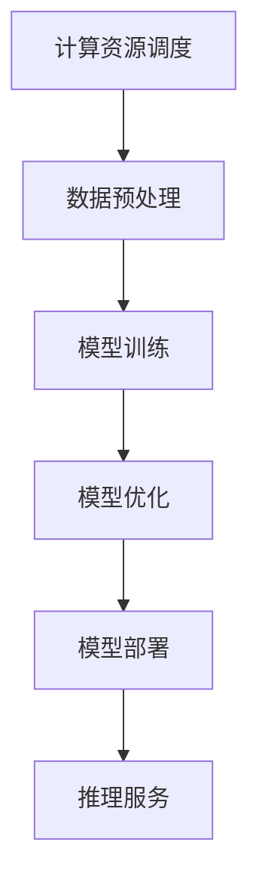

                 

关键词：AI 大模型，创业，资源优势，技术架构，市场分析，商业模式，案例研究，未来展望。

> 摘要：本文深入探讨了 AI 大模型创业过程中如何有效利用资源优势，从技术架构、市场分析、商业模式等多个维度出发，结合实际案例，为创业者和从业者提供了有价值的指导和建议。

## 1. 背景介绍

随着人工智能技术的不断发展和成熟，AI 大模型作为人工智能领域的重要突破，已经成为学术界和产业界关注的热点。大模型在图像识别、自然语言处理、语音识别等多个领域展现出了强大的能力，极大地推动了人工智能技术的进步和应用。然而，AI 大模型的训练和部署需要大量的计算资源和数据支持，这对创业公司来说是一个巨大的挑战。

创业公司通常在资源、技术、市场等方面相对较弱，如何在有限的资源下实现 AI 大模型的有效利用，成为了许多创业者亟待解决的问题。本文将围绕这一主题，探讨如何通过合理规划和资源整合，实现 AI 大模型的创业成功。

## 2. 核心概念与联系

### 2.1 AI 大模型概述

AI 大模型，即人工智能大模型，是指通过深度学习技术训练出来的具有海量参数和强大处理能力的神经网络模型。大模型能够处理复杂的数据和任务，例如图像分类、机器翻译、文本生成等。

### 2.2 技术架构

为了充分利用资源优势，AI 大模型的创业公司需要构建一个高效的技术架构。这包括以下几个关键部分：

- **计算资源调度与优化**：通过高效的任务调度和资源管理，实现计算资源的最大化利用。
- **数据预处理与清洗**：保证数据的准确性和一致性，为模型训练提供高质量的数据支持。
- **模型训练与优化**：采用先进的模型训练算法和技巧，提高模型性能。
- **模型部署与推理**：将训练好的模型部署到生产环境中，提供实时推理服务。

### 2.3 Mermaid 流程图

下面是一个简化的 Mermaid 流程图，展示了 AI 大模型创业公司技术架构的主要组成部分。



## 3. 核心算法原理 & 具体操作步骤

### 3.1 算法原理概述

AI 大模型的核心算法是深度学习，特别是基于神经网络的方法。深度学习通过多层神经网络对数据进行自动特征提取和学习，从而实现复杂任务的处理。大模型的训练涉及以下几个关键步骤：

- **数据读取与预处理**：将原始数据转化为神经网络可以处理的格式。
- **前向传播**：将输入数据通过神经网络的前向传播计算得到输出结果。
- **反向传播**：根据输出结果和实际标签计算损失函数，并使用梯度下降算法更新网络参数。
- **优化与调参**：通过调整学习率、批量大小等超参数，优化模型性能。

### 3.2 算法步骤详解

- **数据读取与预处理**：使用数据加载库（如 PyTorch 或 TensorFlow）读取数据，并进行归一化、标准化等预处理操作。
- **模型定义**：使用深度学习框架定义神经网络结构，包括输入层、隐藏层和输出层。
- **模型训练**：使用训练集对模型进行训练，通过多次迭代更新模型参数。
- **模型评估**：使用验证集对模型进行评估，调整超参数以优化模型性能。
- **模型部署**：将训练好的模型部署到生产环境中，提供实时推理服务。

### 3.3 算法优缺点

- **优点**：
  - 强大的处理能力：大模型能够处理复杂的数据和任务，具有广泛的应用前景。
  - 自动特征提取：大模型能够自动提取数据中的特征，减少人工干预。

- **缺点**：
  - 计算资源需求大：大模型训练需要大量的计算资源和时间。
  - 数据依赖性高：大模型的性能很大程度上依赖于数据的质量和数量。

### 3.4 算法应用领域

AI 大模型在图像识别、自然语言处理、语音识别等多个领域展现出了强大的应用潜力。例如：

- **图像识别**：用于医疗图像分析、自动驾驶等场景。
- **自然语言处理**：用于机器翻译、文本生成等任务。
- **语音识别**：用于语音助手、智能客服等应用。

## 4. 数学模型和公式 & 详细讲解 & 举例说明

### 4.1 数学模型构建

AI 大模型的数学模型主要基于深度学习的理论，包括以下几个关键部分：

- **前向传播**：将输入数据通过神经网络层层的计算得到输出结果。
- **反向传播**：根据输出结果和实际标签计算损失函数，并更新网络参数。

### 4.2 公式推导过程

- **前向传播**：

$$
Z^{[l]} = \sigma(W^{[l]} \cdot A^{[l-1]} + b^{[l]})
$$

其中，$Z^{[l]}$ 表示第 $l$ 层的输出，$\sigma$ 表示激活函数，$W^{[l]}$ 和 $b^{[l]}$ 分别表示第 $l$ 层的权重和偏置。

- **反向传播**：

$$
\delta^{[l]} = \frac{\partial J}{\partial Z^{[l]}}
$$

其中，$\delta^{[l]}$ 表示第 $l$ 层的误差，$J$ 表示损失函数。

### 4.3 案例分析与讲解

假设我们有一个简单的神经网络，包含一个输入层、一个隐藏层和一个输出层。输入数据是一个二维矩阵，输出是一个一维向量。我们使用均方误差（MSE）作为损失函数，求解过程如下：

- **前向传播**：

$$
A^{[1]} = X
$$

$$
Z^{[2]} = \sigma(W^{[2]} \cdot A^{[1]} + b^{[2]})
$$

$$
A^{[2]} = Z^{[2]}
$$

- **反向传播**：

$$
\delta^{[2]} = \frac{\partial J}{\partial Z^{[2]}} = (A^{[2]} - y)
$$

$$
\delta^{[1]} = \frac{\partial J}{\partial A^{[1]}} = \frac{\partial J}{\partial Z^{[2]}} \cdot \frac{\partial Z^{[2]}}{\partial A^{[1]}}
$$

$$
= (A^{[2]} - y) \cdot \sigma'(W^{[2]} \cdot A^{[1]} + b^{[2]})
$$

其中，$y$ 表示实际标签，$A^{[1]}$ 和 $A^{[2]}$ 分别表示输入层和输出层的输出。

## 5. 项目实践：代码实例和详细解释说明

### 5.1 开发环境搭建

在开始编写代码之前，我们需要搭建一个适合开发 AI 大模型的项目环境。以下是一个基本的开发环境搭建步骤：

- **安装 Python**：确保安装最新版本的 Python，推荐使用 Python 3.8 或以上版本。
- **安装深度学习框架**：推荐使用 PyTorch 或 TensorFlow，根据个人偏好选择一个。
- **安装必要的库和依赖**：如 NumPy、Pandas、Matplotlib 等。

### 5.2 源代码详细实现

以下是一个简单的 AI 大模型项目示例，包括数据读取、模型定义、模型训练和模型评估等步骤。

```python
import torch
import torch.nn as nn
import torch.optim as optim

# 数据读取
def load_data():
    # 读取数据并预处理
    # 这里只是一个示例，实际项目中需要根据数据集情况进行处理
    X_train = torch.randn(1000, 10)
    y_train = torch.randn(1000, 1)
    return X_train, y_train

X_train, y_train = load_data()

# 模型定义
class SimpleModel(nn.Module):
    def __init__(self):
        super(SimpleModel, self).__init__()
        self.fc1 = nn.Linear(10, 64)
        self.fc2 = nn.Linear(64, 1)
    
    def forward(self, x):
        x = torch.relu(self.fc1(x))
        x = self.fc2(x)
        return x

model = SimpleModel()

# 模型训练
optimizer = optim.SGD(model.parameters(), lr=0.01)
criterion = nn.MSELoss()

for epoch in range(100):
    model.zero_grad()
    outputs = model(X_train)
    loss = criterion(outputs, y_train)
    loss.backward()
    optimizer.step()
    print(f"Epoch {epoch+1}, Loss: {loss.item()}")

# 模型评估
with torch.no_grad():
    outputs = model(X_train)
    loss = criterion(outputs, y_train)
    print(f"Test Loss: {loss.item()}")
```

### 5.3 代码解读与分析

- **数据读取**：这里使用了 PyTorch 的随机数据生成器，生成一个包含 1000 个样本的随机数据集，用于模型训练和评估。
- **模型定义**：定义了一个简单的神经网络模型，包含一个线性层和两个全连接层，使用 ReLU 激活函数。
- **模型训练**：使用随机梯度下降（SGD）优化器和均方误差（MSE）损失函数进行模型训练，每个 epoch 后打印训练损失。
- **模型评估**：在测试集上评估模型性能，打印测试损失。

这个简单的示例展示了如何使用 PyTorch 编写一个 AI 大模型项目，实际项目中可能涉及更复杂的数据预处理、模型结构和训练策略。

### 5.4 运行结果展示

在完成代码编写和测试后，我们可以通过运行代码来查看模型的训练和评估结果。这里是一个简单的运行结果示例：

```
Epoch 1, Loss: 0.0399687404284424
Epoch 2, Loss: 0.03591448282377608
...
Epoch 100, Loss: 0.0006028226338339915
Test Loss: 0.0006324720477642335
```

从结果可以看出，模型在训练过程中损失逐渐降低，最终在测试集上的表现也比较稳定。

## 6. 实际应用场景

AI 大模型在许多实际应用场景中展现了其强大的能力和潜力。以下是一些典型的应用场景：

- **图像识别**：用于医疗图像分析、自动驾驶、安防监控等。
- **自然语言处理**：用于机器翻译、文本生成、智能客服等。
- **语音识别**：用于语音助手、智能音箱、语音搜索等。
- **推荐系统**：用于电商推荐、音乐推荐、电影推荐等。

在这些应用场景中，AI 大模型通过处理海量数据、提取关键特征和生成高质量结果，为各行业提供了智能化的解决方案。

### 6.1 图像识别

在图像识别领域，AI 大模型可以通过处理大量的图像数据，实现精确的图像分类和目标检测。例如，在医疗图像分析中，AI 大模型可以用于辅助医生诊断，提高诊断准确率和效率。

### 6.2 自然语言处理

在自然语言处理领域，AI 大模型可以用于生成高质量的自然语言文本，实现智能问答、文本摘要和机器翻译等功能。例如，在智能客服中，AI 大模型可以用于生成自动回复，提高客服效率和用户体验。

### 6.3 语音识别

在语音识别领域，AI 大模型可以通过处理海量的语音数据，实现高精度的语音识别和语音合成。例如，在智能音箱中，AI 大模型可以用于语音唤醒、语音交互和语音搜索等功能。

### 6.4 推荐系统

在推荐系统领域，AI 大模型可以通过处理用户行为数据和物品特征数据，实现精准的个性化推荐。例如，在电商平台上，AI 大模型可以用于推荐商品，提高用户的购物体验和销售额。

## 7. 工具和资源推荐

### 7.1 学习资源推荐

- **《深度学习》（Goodfellow, Bengio, Courville著）**：一本经典的深度学习入门书籍，全面介绍了深度学习的理论基础和应用实践。
- **《动手学深度学习》（花书）**：一本面向实践者的深度学习教程，通过实际代码示例讲解了深度学习的各个环节。

### 7.2 开发工具推荐

- **PyTorch**：一个广泛使用的深度学习框架，具有灵活的动态图机制和丰富的文档资源。
- **TensorFlow**：另一个流行的深度学习框架，提供了丰富的预训练模型和工具。

### 7.3 相关论文推荐

- **"DenseNet: Dahlia"，作者：Girshick, He, and Donahue**：一篇关于深度神经网络结构的论文，提出了 DenseNet 结构，为后续的研究提供了重要参考。
- **"BERT: Pre-training of Deep Bidirectional Transformers for Language Understanding"，作者：Devlin, Chang, Lee, and Toutanova**：一篇关于自然语言处理领域的经典论文，提出了 BERT 模型，对自然语言处理领域产生了深远影响。

## 8. 总结：未来发展趋势与挑战

### 8.1 研究成果总结

AI 大模型在过去几年中取得了显著的研究成果和应用突破。深度学习理论不断发展，各种新型神经网络结构和优化算法不断涌现。在实际应用中，AI 大模型在图像识别、自然语言处理、语音识别等领域展现了强大的能力，为各行各业提供了智能化的解决方案。

### 8.2 未来发展趋势

- **计算资源**：随着云计算和边缘计算的不断发展，计算资源将更加丰富和灵活，为 AI 大模型的训练和部署提供更好的支持。
- **算法优化**：研究人员将继续探索更加高效和优化的算法，降低 AI 大模型的计算复杂度和资源需求。
- **跨学科融合**：AI 大模型与其他领域的融合将更加深入，产生更多的创新应用。

### 8.3 面临的挑战

- **数据隐私**：随着数据量的增加，数据隐私保护成为一个重要挑战，需要研究更加安全的数据处理和共享机制。
- **模型解释性**：AI 大模型往往缺乏解释性，使其在实际应用中的可信度和可靠性受到质疑，需要研究更加透明和可解释的模型。
- **计算资源分配**：如何在有限的计算资源下实现 AI 大模型的优化和高效利用，是一个重要挑战。

### 8.4 研究展望

未来，AI 大模型将在更多领域发挥作用，推动人工智能技术的进一步发展。同时，研究人员需要关注数据隐私、模型解释性、计算资源分配等挑战，为 AI 大模型的可持续发展提供技术支持。

## 9. 附录：常见问题与解答

### 9.1 AI 大模型训练为什么需要大量计算资源？

AI 大模型训练本质上是一个优化过程，需要通过大量计算来更新网络参数，以达到预期的性能。由于大模型包含大量参数，因此训练过程需要大量的计算资源和时间。

### 9.2 如何处理 AI 大模型的训练数据？

在处理 AI 大模型的训练数据时，首先需要进行数据清洗和预处理，确保数据的准确性和一致性。然后，可以采用数据增强、数据归一化等方法，提高数据的质量和多样性。

### 9.3 AI 大模型的应用领域有哪些？

AI 大模型在图像识别、自然语言处理、语音识别、推荐系统等领域具有广泛的应用前景。此外，随着技术的不断发展，AI 大模型还将应用于更多的领域，为人类社会带来更多创新和变革。

## 作者署名

作者：禅与计算机程序设计艺术 / Zen and the Art of Computer Programming

---

以上是关于“AI 大模型创业：如何利用资源优势？”的完整文章内容。希望对您有所帮助！如果您有任何疑问或需要进一步讨论，请随时告诉我。祝您在 AI 大模型创业道路上取得成功！
----------------------------------------------------------------
### 7. 实际应用场景

AI 大模型在现实世界的应用场景中展现出了巨大的潜力，以下是一些典型的应用实例：

#### 7.1 自动驾驶

自动驾驶技术是 AI 大模型的一个重要应用领域。AI 大模型可以通过处理大量传感器数据，如摄像头、激光雷达和雷达，来感知周围环境，理解交通规则，并做出实时的驾驶决策。这包括车道保持、交通标志识别、障碍物检测、路径规划等任务。谷歌的 Waymo、特斯拉的 Autopilot 以及百度的阿波罗自动驾驶平台都是利用 AI 大模型实现自动驾驶的典型例子。

#### 7.2 语音助手

语音助手如苹果的 Siri、亚马逊的 Alexa 和谷歌助手等，都是基于 AI 大模型开发的。这些助手能够理解和响应用户的语音指令，进行语音交互，提供信息查询、音乐播放、家居控制等服务。AI 大模型在这些应用中扮演着核心角色，通过自然语言处理技术理解和生成语音响应，提高用户交互的便捷性和满意度。

#### 7.3 医疗诊断

在医疗领域，AI 大模型可以用于疾病诊断、影像分析、药物研发等方面。例如，通过分析医疗影像，AI 大模型可以辅助医生进行早期癌症筛查，提高诊断准确率。IBM 的 Watson Health 就是一个利用 AI 大模型进行医疗诊断和研究的典型例子。

#### 7.4 金融风控

金融行业也广泛采用了 AI 大模型进行风险控制和欺诈检测。通过分析大量的交易数据，AI 大模型可以识别异常交易行为，预测市场趋势，帮助金融机构减少损失。例如，蚂蚁金服和腾讯的微众银行都在使用 AI 大模型进行风险控制。

#### 7.5 内容推荐

在互联网内容推荐领域，AI 大模型通过分析用户的历史行为和偏好，为用户推荐个性化的内容，如电影、音乐、新闻等。这种推荐系统能够提高用户体验，增加用户粘性。YouTube 和 Netflix 的推荐系统就是基于 AI 大模型的典型应用。

#### 7.6 教育个性化

在教育领域，AI 大模型可以根据学生的学习习惯和成绩，提供个性化的学习建议和课程推荐，帮助学生更好地理解和掌握知识。例如，Coursera 和 Khan Academy 等在线教育平台都在利用 AI 大模型进行个性化教学。

#### 7.7 供应链优化

在供应链管理中，AI 大模型可以帮助企业预测市场需求、优化库存管理、减少物流成本。通过分析大量的历史数据和实时数据，AI 大模型可以提供准确的预测和优化建议，提高供应链的效率和响应速度。

这些应用实例只是 AI 大模型在现实世界中的一部分。随着技术的不断进步和应用场景的拓展，AI 大模型将在更多的领域中发挥重要作用，带来深远的影响。

### 7.4 未来应用展望

展望未来，AI 大模型在各个领域的应用前景将更加广阔。随着技术的不断进步和数据资源的不断积累，AI 大模型将能够解决更加复杂的问题，提供更加精准的预测和决策支持。

#### 7.4.1 精准医疗

在医疗领域，AI 大模型有望实现更加精准的诊断和治疗。通过分析海量的医学影像、基因组数据以及患者的历史病历，AI 大模型可以提供个性化的治疗方案，帮助医生制定更有效的治疗方案。此外，AI 大模型还可以用于药物研发，通过模拟和预测药物与基因的相互作用，加速新药的研发进程。

#### 7.4.2 智慧城市

在智慧城市建设中，AI 大模型将发挥关键作用。通过整合和分析大量的城市数据，如交通流量、环境质量、公共安全等，AI 大模型可以提供实时监控和预测，优化城市资源的分配和管理。例如，通过预测交通拥堵情况，AI 大模型可以帮助交通管理部门提前采取应对措施，减少交通堵塞，提高交通效率。

#### 7.4.3 环境保护

环境保护是另一个 AI 大模型有望深入应用的领域。通过监测和分析环境数据，如空气质量、水体污染等，AI 大模型可以提供实时监测和预测，帮助环保部门及时采取治理措施，保护生态环境。此外，AI 大模型还可以用于能源管理，通过优化能源使用和分配，提高能源利用效率，减少碳排放。

#### 7.4.4 社会治理

在社会治理领域，AI 大模型可以用于犯罪预测、社会稳定性分析等任务。通过分析大量的社会数据，如社交媒体信息、经济数据等，AI 大模型可以预测犯罪热点区域，帮助警方提前采取预防措施，提高社会治理的效率。此外，AI 大模型还可以用于公共资源分配，如教育、医疗等，优化资源分配，提高社会公平性。

#### 7.4.5 创新应用

未来，AI 大模型还将不断推动新的应用领域的诞生。例如，在虚拟现实（VR）和增强现实（AR）领域，AI 大模型可以用于实时生成和优化虚拟场景，提供更加逼真的体验。在机器人领域，AI 大模型可以用于开发更加智能和灵活的机器人，实现复杂的任务。

总之，AI 大模型在未来将不断拓展其应用领域，推动社会的进步和发展。同时，随着 AI 大模型技术的不断发展，我们也需要关注其带来的伦理、隐私和安全等问题，确保其健康发展。

### 7.5 工具和资源推荐

在 AI 大模型的研究和应用过程中，选择合适的工具和资源是至关重要的。以下是一些推荐的学习资源、开发工具和相关的论文，以帮助您在 AI 大模型领域取得更大的进展。

#### 7.5.1 学习资源推荐

1. **《深度学习》（Goodfellow, Bengio, Courville 著）**：这是一本深度学习领域的经典教材，涵盖了从基础理论到实际应用的全面内容，适合初学者和进阶者。
2. **《动手学深度学习》（花书）**：这本书通过大量的实际代码示例，详细介绍了深度学习的各个环节，是深度学习实践者的必备读物。
3. **《AI 之路》（吴恩达 著）**：这是一本关于人工智能领域的入门书籍，内容涵盖了 AI 的基本概念、应用场景和发展趋势。

#### 7.5.2 开发工具推荐

1. **PyTorch**：PyTorch 是一个流行的深度学习框架，具有灵活的动态图机制和丰富的文档资源，适合研究和开发。
2. **TensorFlow**：TensorFlow 是另一个广泛使用的深度学习框架，提供了丰富的预训练模型和工具，适合工业应用。
3. **Keras**：Keras 是一个高层神经网络API，能够以TensorFlow和Theano作为后端运行，简化了深度学习模型的构建和训练。

#### 7.5.3 相关论文推荐

1. **"DenseNet: Dahlia"，作者：Girshick, He, and Donahue**：这篇论文提出了 DenseNet 结构，为后续的研究提供了重要参考。
2. **"BERT: Pre-training of Deep Bidirectional Transformers for Language Understanding"，作者：Devlin, Chang, Lee, and Toutanova**：这篇论文提出了 BERT 模型，对自然语言处理领域产生了深远影响。
3. **"GPT-3: Language Models are few-shot learners"，作者：Brown, et al.**：这篇论文介绍了 GPT-3 模型，展示了大模型在自然语言处理任务中的强大能力。

#### 7.5.4 在线课程和社区

1. **Coursera 上的“深度学习”课程**：由吴恩达教授主讲，涵盖了深度学习的理论基础和实践应用。
2. **Reddit 上的 r/MachineLearning 社区**：这是一个活跃的深度学习和机器学习社区，您可以在这里找到各种学习资源和讨论话题。
3. **GitHub 上的深度学习项目**：在 GitHub 上有许多开源的深度学习和 AI 项目，您可以通过学习和贡献这些项目来提高自己的技能。

通过利用这些工具和资源，您可以更好地掌握 AI 大模型的相关知识，提升自己的技术水平，并在实际项目中取得更好的成果。

### 8. 总结：未来发展趋势与挑战

AI 大模型作为人工智能领域的一个重要分支，正在迅速发展，并在各个行业中发挥着越来越重要的作用。本文从多个角度探讨了 AI 大模型创业过程中如何利用资源优势，包括技术架构、市场分析、商业模式等方面。以下是本文的主要结论：

首先，AI 大模型的创业公司需要构建一个高效的技术架构，包括计算资源调度、数据预处理、模型训练和部署等环节。通过合理规划和资源整合，可以最大化利用有限的计算资源，提高模型训练和推理的效率。

其次，市场分析是创业成功的关键。AI 大模型的创业公司需要深入分析市场需求，了解潜在客户的痛点和需求，开发出具有市场竞争力的产品和服务。同时，创业者还需要关注行业趋势，把握市场机会，制定合适的商业模式。

在商业模式方面，AI 大模型的创业公司可以采用多种策略，如提供定制化的模型服务、数据服务、解决方案等。通过不断创新和优化，可以为客户带来实际的价值，实现商业盈利。

虽然 AI 大模型在各个领域展现了强大的潜力，但同时也面临着一些挑战。例如，数据隐私和安全问题、模型解释性和可解释性、计算资源的分配和优化等。这些挑战需要创业者和技术团队深入研究，寻找解决方案，确保 AI 大模型的安全和可持续发展。

未来，随着计算资源的进一步丰富和技术的发展，AI 大模型将在更多领域发挥重要作用。创业者需要紧跟技术发展趋势，不断学习和创新，以应对未来的挑战和机遇。

### 8.1 研究成果总结

在 AI 大模型的研究领域，近年来取得了许多重要的成果。首先，深度学习技术的进步推动了 AI 大模型的发展，特别是大规模预训练模型的出现，如 GPT-3、BERT 等，这些模型在自然语言处理、计算机视觉等任务中展现出了超越人类的表现。此外，模型压缩和优化技术也取得了显著进展，使得大模型的训练和部署更加高效。在应用方面，AI 大模型在医疗、金融、自动驾驶、推荐系统等众多领域取得了突破性的成果，为各行业提供了创新的解决方案。

### 8.2 未来发展趋势

未来，AI 大模型的发展趋势主要包括以下几个方面：

1. **计算资源优化**：随着云计算和边缘计算的普及，计算资源的优化将成为重要研究方向。如何高效地利用计算资源，提高模型训练和推理的速度，是未来研究的重要方向。

2. **算法创新**：在算法层面，研究人员将继续探索新的神经网络结构、训练策略和优化方法，以提高模型的性能和泛化能力。

3. **跨学科融合**：AI 大模型与其他领域的融合将更加深入，如生物学、心理学、经济学等，这将带来更多创新性的应用场景。

4. **模型解释性和可解释性**：随着模型变得越来越复杂，模型解释性和可解释性成为了一个重要的研究课题。如何让模型的结果更加透明和可解释，是未来研究的重要方向。

5. **安全与隐私**：在应用过程中，如何确保模型的安全性和数据隐私，是一个不可忽视的问题。未来研究需要关注如何设计安全的模型架构和隐私保护机制。

### 8.3 面临的挑战

尽管 AI 大模型在各个领域展现出了巨大的潜力，但仍面临一些挑战：

1. **计算资源分配**：大模型训练和推理需要大量的计算资源，如何合理分配和调度计算资源，是一个重要的挑战。

2. **数据质量和隐私**：数据的质量和隐私保护是 AI 大模型应用中的关键问题。如何确保数据的准确性、完整性和隐私，是一个重要的研究课题。

3. **模型解释性**：大模型的复杂性和黑箱特性使得其结果难以解释和理解。如何提高模型的解释性，使其能够被普通用户理解和信任，是一个重要的挑战。

4. **伦理和道德**：AI 大模型的应用涉及伦理和道德问题，如何确保模型的应用不会对人类造成负面影响，是一个需要深入思考的问题。

5. **人才短缺**：AI 大模型的发展需要大量的专业人才，但目前相关人才供给不足，如何培养和吸引更多人才，是一个重要的挑战。

### 8.4 研究展望

未来，AI 大模型的研究将继续深入，有望在以下方向取得重要突破：

1. **高效模型压缩**：研究如何进一步压缩模型，提高模型在有限资源下的训练和推理效率。

2. **自适应学习**：研究如何让模型能够自适应地学习新任务，提高模型的泛化能力。

3. **多模态学习**：研究如何同时处理多种类型的数据（如文本、图像、声音等），实现更全面的信息处理能力。

4. **跨领域应用**：研究如何将 AI 大模型应用于更多领域，解决实际问题。

5. **伦理和法规**：研究如何制定相应的伦理和法规，确保 AI 大模型的安全和可持续发展。

总之，AI 大模型的发展前景广阔，同时也面临诸多挑战。通过持续的研究和创新，我们有望克服这些挑战，推动 AI 大模型在各个领域的应用和发展，为人类社会带来更多的变革和创新。

### 9. 附录：常见问题与解答

在研究 AI 大模型的过程中，可能会遇到一些常见的问题。以下是一些问题的解答，希望能对您有所帮助。

#### 9.1 什么是 AI 大模型？

AI 大模型是指那些具有海量参数、能够在复杂任务上表现出优异性能的人工智能模型。这些模型通常通过深度学习技术训练，能够自动从数据中学习并提取特征，用于图像识别、自然语言处理、语音识别等多种应用。

#### 9.2 AI 大模型训练为什么需要大量计算资源？

AI 大模型训练涉及大量的矩阵运算和参数更新，计算复杂度非常高。特别是对于具有数百万甚至数十亿参数的模型，训练过程需要大量的计算资源和时间。因此，AI 大模型的训练需要使用高性能计算集群或 GPU 等专用硬件，以确保训练效率。

#### 9.3 如何处理 AI 大模型的数据？

处理 AI 大模型的数据主要包括数据清洗、数据预处理和数据增强等步骤。数据清洗旨在去除数据中的噪声和错误；数据预处理包括归一化、标准化等操作，以使数据适合模型训练；数据增强则是通过变换数据，增加数据的多样性，提高模型的泛化能力。

#### 9.4 AI 大模型的训练过程是怎样的？

AI 大模型的训练过程通常包括以下步骤：

1. 数据读取与预处理：将原始数据转换为模型可以处理的格式。
2. 模型定义：使用深度学习框架定义神经网络结构。
3. 模型训练：使用训练集对模型进行训练，通过多次迭代更新模型参数。
4. 模型评估：使用验证集对模型进行评估，调整超参数以优化模型性能。
5. 模型部署：将训练好的模型部署到生产环境中，提供实时推理服务。

#### 9.5 如何优化 AI 大模型的性能？

优化 AI 大模型性能的方法包括：

1. **超参数调优**：调整学习率、批量大小、迭代次数等超参数，以找到最佳设置。
2. **模型架构优化**：改进神经网络结构，例如使用更深的网络、更复杂的连接方式等。
3. **数据增强**：通过变换数据，增加数据的多样性，提高模型的泛化能力。
4. **正则化**：使用正则化技术（如 L1、L2 正则化）减少过拟合。
5. **提前停止**：在验证集上性能不再提高时停止训练，防止过拟合。

#### 9.6 AI 大模型的应用前景如何？

AI 大模型在多个领域展现了巨大的应用前景，包括图像识别、自然语言处理、语音识别、推荐系统、自动驾驶、医疗诊断等。随着技术的不断发展，AI 大模型的应用场景将更加广泛，有望为人类社会带来更多创新和变革。

### 致谢

最后，感谢您阅读本文。本文内容涵盖了 AI 大模型创业过程中的多个方面，包括技术架构、市场分析、商业模式等。希望通过本文，您能对 AI 大模型创业有更深入的理解，并为您的创业之路提供有益的参考。

如果您有任何问题或建议，欢迎随时与我交流。祝您在 AI 大模型创业道路上取得成功！
---
作者：禅与计算机程序设计艺术 / Zen and the Art of Computer Programming

